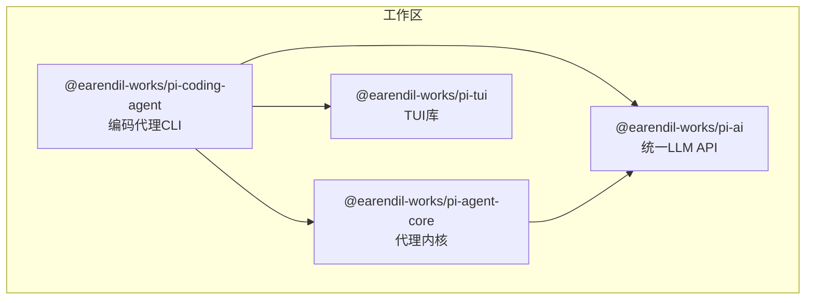
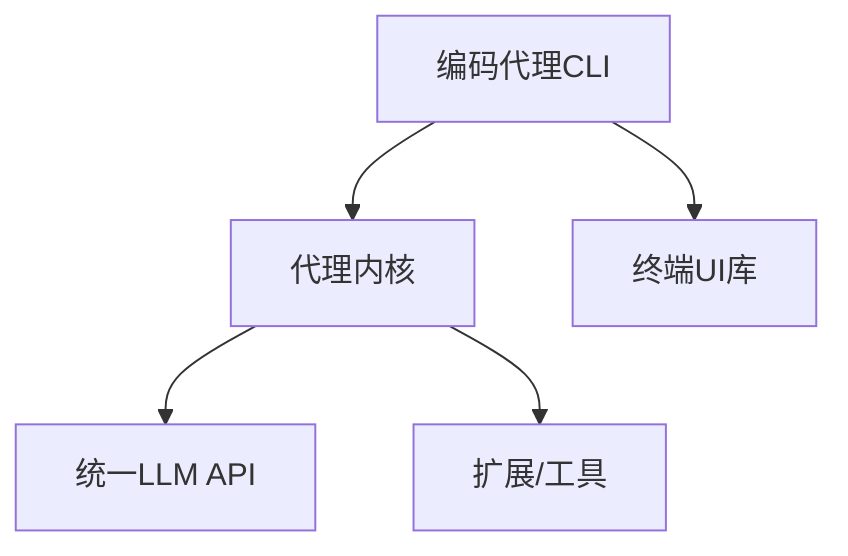
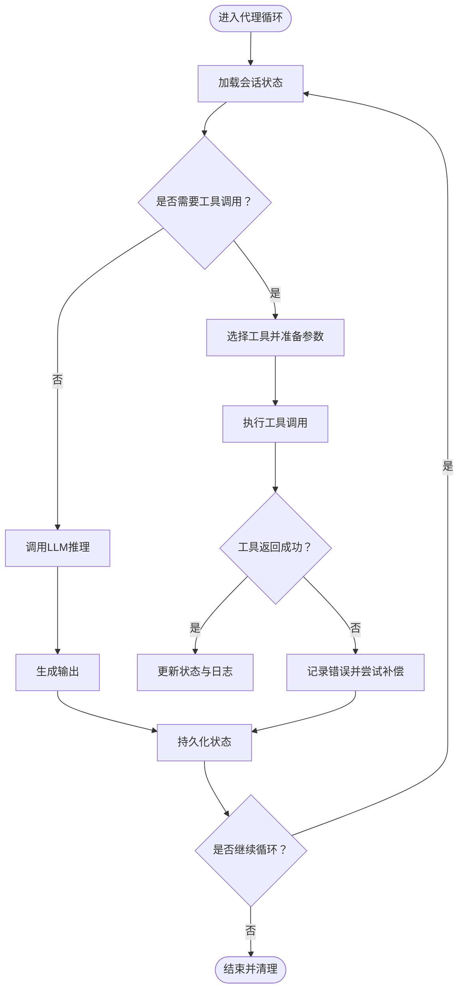
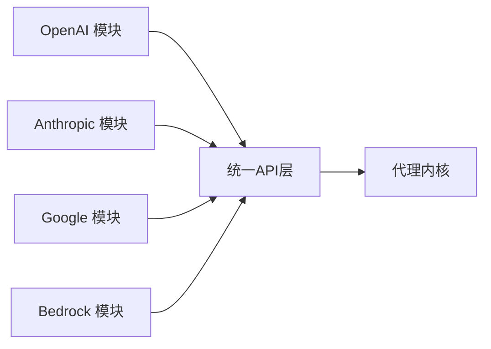
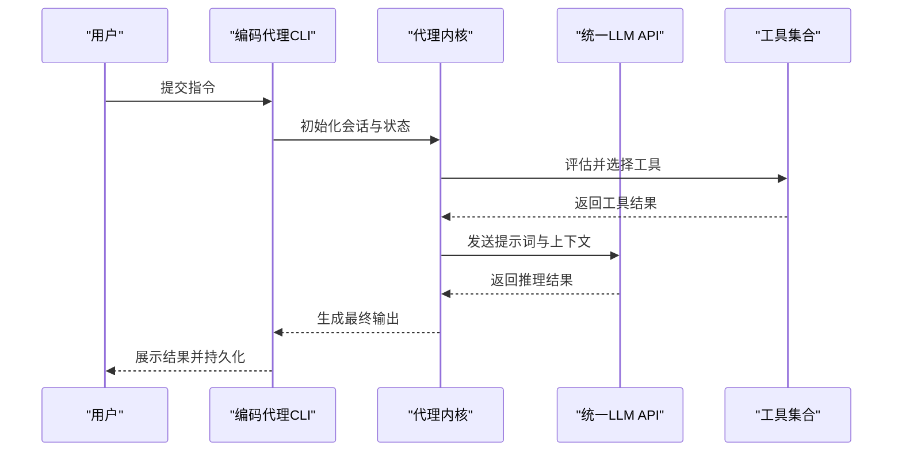
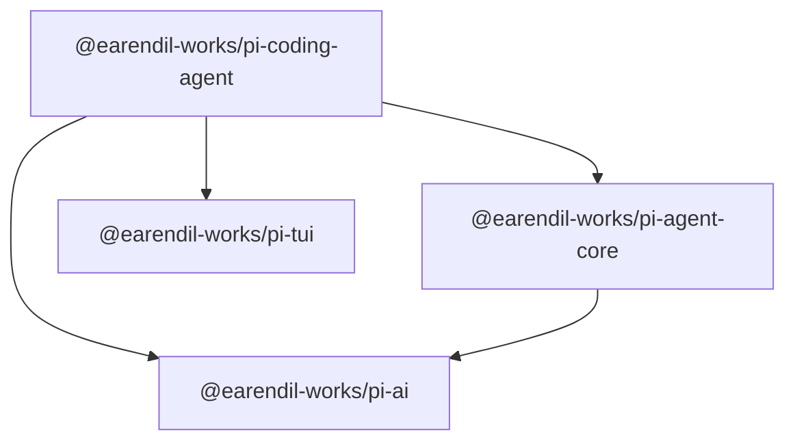

# 代理系统

<cite>
**本文引用的文件**
- [README.md](file://README.md)
- [AGENTS.md](file://AGENTS.md)
- [packages/agent/package.json](file://packages/agent/package.json)
- [packages/ai/package.json](file://packages/ai/package.json)
- [packages/coding-agent/package.json](file://packages/coding-agent/package.json)
- [packages/tui/package.json](file://packages/tui/package.json)
</cite>

## 目录
1. [简介](#简介)
2. [项目结构](#项目结构)
3. [核心组件](#核心组件)
4. [架构总览](#架构总览)
5. [详细组件分析](#详细组件分析)
6. [依赖分析](#依赖分析)
7. [性能考虑](#性能考虑)
8. [故障排查指南](#故障排查指南)
9. [结论](#结论)
10. [附录](#附录)

## 简介
本文件面向Pi代理系统的技术文档，聚焦于代理核心能力：代理循环机制、状态管理、工具调用与会话持久化；同时覆盖代理生命周期管理、事件驱动通信机制与扩展系统架构；并阐述传输抽象设计以支持不同消息格式与协议。文档还提供如何创建自定义代理、注册工具与处理复杂工作流的实践指引，以及代理间协作与并发处理策略的说明。由于当前仓库未包含已编译产物（如dist目录），本文在不展示具体代码内容的前提下，基于现有包配置与项目说明进行系统性梳理与可视化呈现。

## 项目结构
Pi是一个多包工作区（monorepo），由以下主要包组成：
- @earendil-works/pi-ai：统一的多提供商LLM API层，负责模型发现与提供商配置。
- @earendil-works/pi-agent-core：通用代理内核，提供传输抽象、状态管理与附件支持。
- @earendil-works/pi-coding-agent：交互式编码代理CLI，集成工具链与会话管理。
- @earendil-works/pi-tui：终端用户界面库，提供高效文本应用的差异渲染能力。

图表来源
- [packages/agent/package.json:1-61](file://packages/agent/package.json#L1-L61)
- [packages/ai/package.json:1-107](file://packages/ai/package.json#L1-L107)
- [packages/coding-agent/package.json:1-99](file://packages/coding-agent/package.json#L1-L99)
- [packages/tui/package.json:1-48](file://packages/tui/package.json#L1-L48)

章节来源
- [README.md:19-58](file://README.md#L19-L58)
- [packages/agent/package.json:1-61](file://packages/agent/package.json#L1-L61)
- [packages/ai/package.json:1-107](file://packages/ai/package.json#L1-L107)
- [packages/coding-agent/package.json:1-99](file://packages/coding-agent/package.json#L1-L99)
- [packages/tui/package.json:1-48](file://packages/tui/package.json#L1-L48)

## 核心组件
- 代理内核（@earendil-works/pi-agent-core）
  - 职责：提供通用代理运行时，具备工具调用与状态管理能力；支持传输抽象与附件处理。
  - 关键点：作为上层编码代理与AI层之间的桥梁，承担生命周期管理与事件驱动通信的基础设施职责。
- 统一LLM API（@earendil-works/pi-ai）
  - 职责：统一OpenAI、Anthropic、Google、Bedrock等多家提供商的接口，自动模型发现与提供商配置。
  - 关键点：通过导出多种提供商模块与OAuth支持，实现跨平台与多供应商适配。
- 编码代理CLI（@earendil-works/pi-coding-agent）
  - 职责：提供交互式命令行界面，内置读取、执行、编辑、写入等工具，以及会话管理。
  - 关键点：依赖代理内核与TUI库，形成完整的开发工作流闭环。
- 终端UI库（@earendil-works/pi-tui）
  - 职责：提供高效的文本界面渲染与差异更新能力，降低终端应用的重绘开销。
  - 关键点：为编码代理CLI提供流畅的交互体验基础。

章节来源
- [README.md:23-26](file://README.md#L23-L26)
- [packages/agent/package.json:1-61](file://packages/agent/package.json#L1-L61)
- [packages/ai/package.json:1-107](file://packages/ai/package.json#L1-L107)
- [packages/coding-agent/package.json:1-99](file://packages/coding-agent/package.json#L1-L99)
- [packages/tui/package.json:1-48](file://packages/tui/package.json#L1-L48)

## 架构总览
下图展示了Pi代理系统的高层架构：编码代理CLI作为入口，通过代理内核协调LLM与工具资源，TUI库提供终端交互体验。

图表来源
- [packages/coding-agent/package.json:1-99](file://packages/coding-agent/package.json#L1-L99)
- [packages/agent/package.json:1-61](file://packages/agent/package.json#L1-L61)
- [packages/ai/package.json:1-107](file://packages/ai/package.json#L1-L107)
- [packages/tui/package.json:1-48](file://packages/tui/package.json#L1-L48)

## 详细组件分析

### 代理内核（@earendil-works/pi-agent-core）
- 设计要点
  - 传输抽象：允许在不同消息格式与协议之间切换，屏蔽底层细节，便于扩展新的通信通道。
  - 工具调用：集中管理工具注册与执行，确保工具接口一致、可追踪、可回滚。
  - 状态管理：维护代理上下文状态，支持会话持久化与恢复，保障长时间任务的连续性。
  - 生命周期管理：从初始化、启动、运行到停止的完整生命周期，包含事件钩子与清理流程。
  - 扩展系统：通过插件化或模块化机制接入第三方工具与适配器，保持核心稳定与外部灵活。
- 典型流程（代理循环）
  - 输入接收 → 状态加载 → 工具选择与调用 → LLM推理 → 输出生成 → 状态保存 → 循环继续或结束
- 并发与协作
  - 采用异步非阻塞模型，避免长耗时工具阻塞主循环。
  - 对共享资源使用互斥与队列控制，保证状态一致性与事件顺序。
- 事件驱动通信
  - 内部事件总线用于工具回调、状态变更与错误上报，外部可通过订阅机制接入。

图表来源
- [packages/agent/package.json:1-61](file://packages/agent/package.json#L1-L61)

章节来源
- [packages/agent/package.json:1-61](file://packages/agent/package.json#L1-L61)

### 统一LLM API（@earendil-works/pi-ai）
- 设计要点
  - 多提供商抽象：通过独立导出模块适配OpenAI、Anthropic、Google、Bedrock等，统一请求与响应格式。
  - 自动模型发现：根据提供商能力与配置动态选择可用模型，减少硬编码耦合。
  - OAuth与代理支持：内置HTTP/HTTPS代理与OAuth流程，提升网络与鉴权灵活性。
- 扩展路径
  - 新增提供商时，遵循现有模块结构与类型约束，确保与代理内核的解耦对接。

图表来源
- [packages/ai/package.json:1-107](file://packages/ai/package.json#L1-L107)

章节来源
- [packages/ai/package.json:1-107](file://packages/ai/package.json#L1-L107)

### 编码代理CLI（@earendil-works/pi-coding-agent）
- 设计要点
  - 工具集：内置读取、执行、编辑、写入等工具，满足常见开发任务。
  - 会话管理：支持会话创建、加载、导出与分享，结合后端数据发布能力（如HF）。
  - CLI与交互：提供命令行入口与交互模式，结合TUI库实现高效终端体验。
- 生命周期与事件
  - 启动 → 初始化工具与会话 → 进入交互循环 → 记录事件与状态 → 结束与归档。
- 并发策略
  - 工具执行与LLM调用采用异步调度，避免阻塞；对共享文件与锁进行保护。

图表来源
- [packages/coding-agent/package.json:1-99](file://packages/coding-agent/package.json#L1-L99)
- [packages/agent/package.json:1-61](file://packages/agent/package.json#L1-L61)
- [packages/ai/package.json:1-107](file://packages/ai/package.json#L1-L107)

章节来源
- [packages/coding-agent/package.json:1-99](file://packages/coding-agent/package.json#L1-L99)

### 终端UI库（@earendil-works/pi-tui）
- 设计要点
  - 差异渲染：仅更新变化区域，显著降低终端重绘成本。
  - 文本与主题：提供Markdown解析与主题配置，增强可读性与一致性。
- 与代理系统的协作
  - 为编码代理CLI提供稳定的终端交互界面，确保长时间会话的流畅体验。

章节来源
- [packages/tui/package.json:1-48](file://packages/tui/package.json#L1-L48)

## 依赖分析
- 包间依赖关系
  - 编码代理CLI依赖代理内核、统一LLM API与TUI库。
  - 代理内核依赖统一LLM API以完成推理调用。
- 版本与引擎要求
  - 所有包均声明Node >= 22.19.0，确保运行环境一致性。
  - 工作区采用lockfile与严格依赖策略，避免版本漂移带来的风险。

图表来源
- [packages/coding-agent/package.json:1-99](file://packages/coding-agent/package.json#L1-L99)
- [packages/agent/package.json:1-61](file://packages/agent/package.json#L1-L61)
- [packages/ai/package.json:1-107](file://packages/ai/package.json#L1-L107)
- [packages/tui/package.json:1-48](file://packages/tui/package.json#L1-L48)

章节来源
- [packages/coding-agent/package.json:1-99](file://packages/coding-agent/package.json#L1-L99)
- [packages/agent/package.json:1-61](file://packages/agent/package.json#L1-L61)
- [packages/ai/package.json:1-107](file://packages/ai/package.json#L1-L107)
- [packages/tui/package.json:1-48](file://packages/tui/package.json#L1-L48)

## 性能考虑
- 异步与非阻塞
  - 工具调用与LLM推理采用异步执行，避免主线程阻塞，提高响应速度。
- 差异渲染
  - 使用TUI库的差异更新策略，减少终端重绘次数，降低CPU与带宽消耗。
- 会话持久化
  - 定期快照与增量保存，缩短恢复时间，减少IO压力。
- 并发控制
  - 对共享资源加锁与队列化处理，防止竞态条件与状态不一致。
- 网络与鉴权
  - 统一LLM API内置代理与OAuth支持，优化网络访问与认证开销。

## 故障排查指南
- 常见问题定位
  - 工具调用失败：检查工具参数与返回值，确认状态更新与错误日志。
  - LLM调用异常：验证提供商配置、密钥与网络代理设置。
  - 会话恢复失败：核对持久化文件完整性与权限，必要时回滚到最近快照。
- 开发与测试建议
  - 使用工作区脚本进行全量检查与构建，确保依赖一致。
  - 在无真实API密钥环境下运行非端到端测试，加速迭代。

章节来源
- [AGENTS.md:26-35](file://AGENTS.md#L26-L35)
- [README.md:63-71](file://README.md#L63-L71)

## 结论
Pi代理系统通过清晰的分层架构与模块化设计，实现了从LLM推理到工具调用、从状态管理到会话持久化的完整闭环。代理内核作为核心枢纽，向上承接CLI与TUI，向下连接统一LLM API与扩展工具，具备良好的可扩展性与可维护性。借助事件驱动与异步并发策略，系统能够在复杂工作流中保持高吞吐与稳定性。未来可在传输抽象与多协议支持方面进一步扩展，以适配更多场景与生态。

## 附录
- 快速开始
  - 安装与构建：参考根目录脚本与各包的构建配置，确保Node版本满足要求。
  - 运行测试：使用提供的测试脚本在本地快速验证功能。
- 参考与致谢
  - 项目主页与文档入口位于README中的链接，欢迎查阅以获取最新信息与演示。

章节来源
- [README.md:27-31](file://README.md#L27-L31)
- [README.md:63-71](file://README.md#L63-L71)