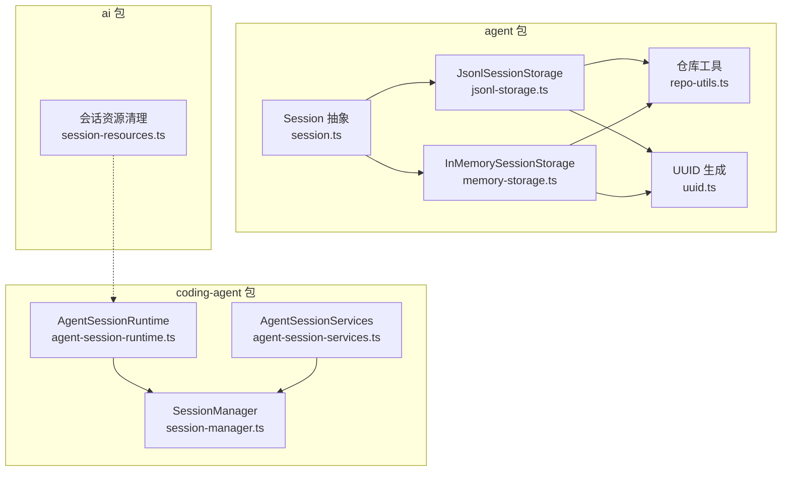
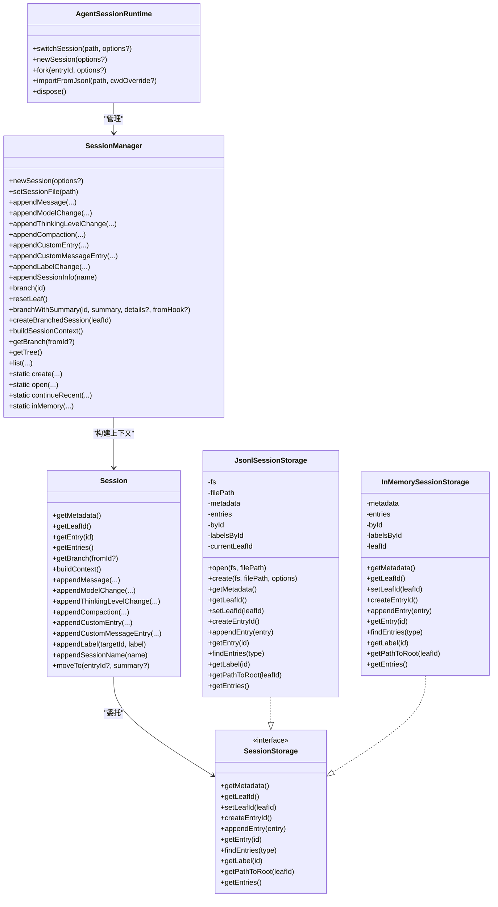
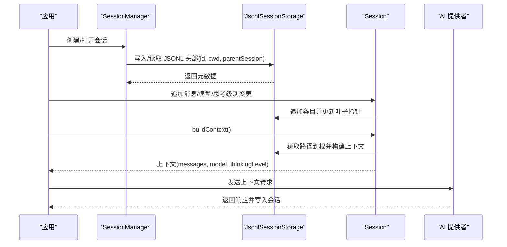
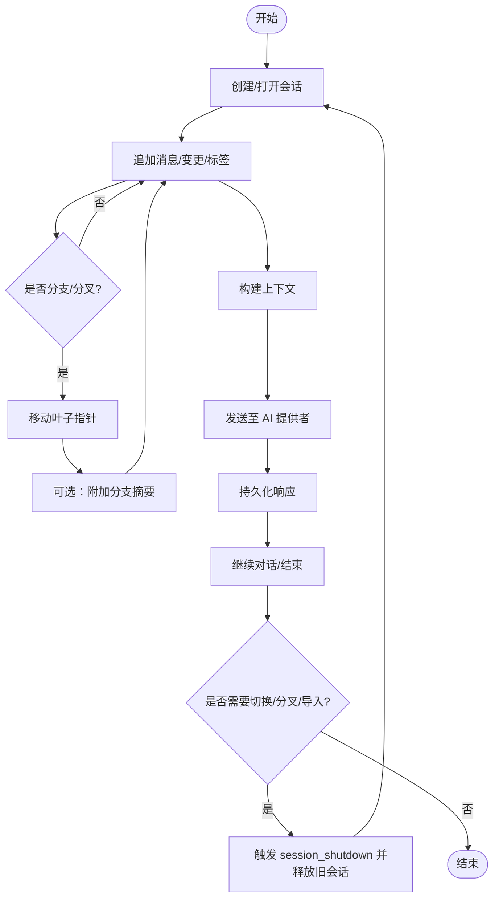
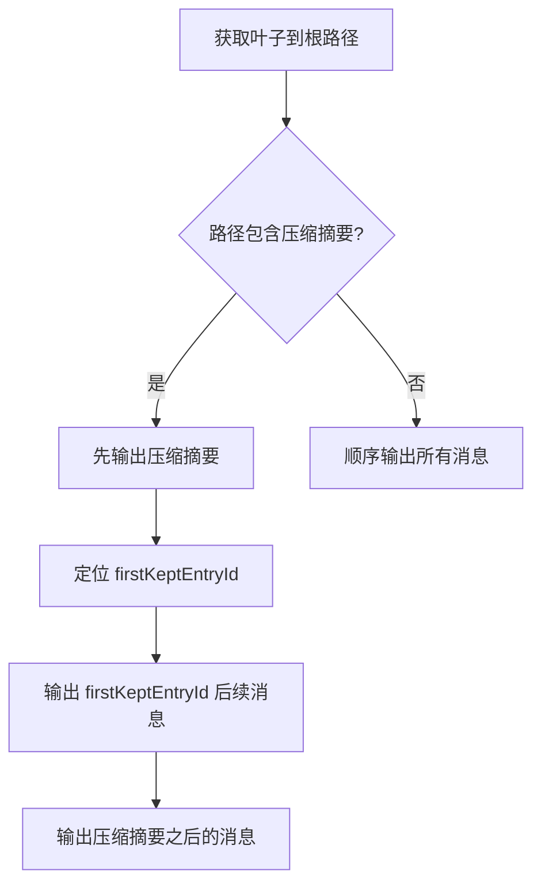
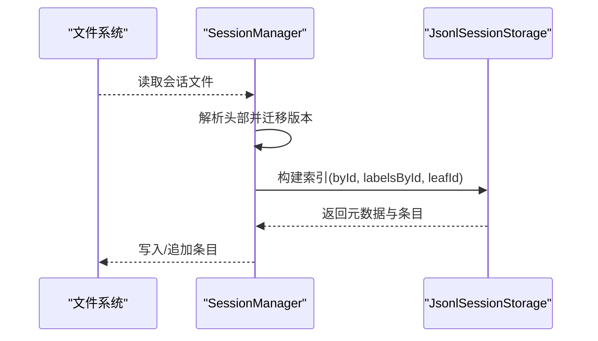
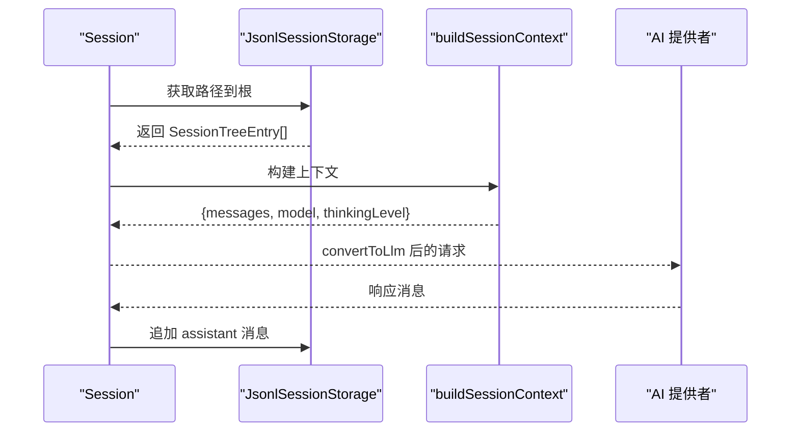
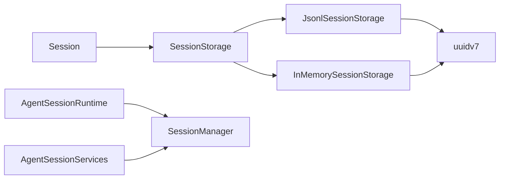

# 会话管理

<cite>
**本文引用的文件**
- [packages/agent/src/harness/session/session.ts](file://packages/agent/src/harness/session/session.ts)
- [packages/agent/src/harness/session/jsonl-storage.ts](file://packages/agent/src/harness/session/jsonl-storage.ts)
- [packages/agent/src/harness/session/memory-storage.ts](file://packages/agent/src/harness/session/memory-storage.ts)
- [packages/agent/src/harness/session/repo-utils.ts](file://packages/agent/src/harness/session/repo-utils.ts)
- [packages/agent/src/harness/session/uuid.ts](file://packages/agent/src/harness/session/uuid.ts)
- [packages/agent/src/types.ts](file://packages/agent/src/types.ts)
- [packages/ai/src/session-resources.ts](file://packages/ai/src/session-resources.ts)
- [packages/coding-agent/src/core/session-manager.ts](file://packages/coding-agent/src/core/session-manager.ts)
- [packages/coding-agent/src/core/agent-session-runtime.ts](file://packages/coding-agent/src/core/agent-session-runtime.ts)
- [packages/coding-agent/src/core/agent-session-services.ts](file://packages/coding-agent/src/core/agent-session-services.ts)
- [packages/coding-agent/examples/sdk/11-sessions.ts](file://packages/coding-agent/examples/sdk/11-sessions.ts)
- [packages/coding-agent/examples/sdk/13-session-runtime.ts](file://packages/coding-agent/examples/sdk/13-session-runtime.ts)
- [packages/coding-agent/docs/sessions.md](file://packages/coding-agent/docs/sessions.md)
</cite>

## 目录
1. [简介](#简介)
2. [项目结构](#项目结构)
3. [核心组件](#核心组件)
4. [架构总览](#架构总览)
5. [详细组件分析](#详细组件分析)
6. [依赖关系分析](#依赖关系分析)
7. [性能考量](#性能考量)
8. [故障排查指南](#故障排查指南)
9. [结论](#结论)
10. [附录](#附录)

## 简介
本文件系统性阐述 Pi 代理的会话管理机制，围绕会话标识符（sessionId）的生成与传递、与 AI 提供者的集成、缓存感知与上下文构建、会话生命周期（创建、维护、分支/分叉、清理）、持久化策略与跨进程恢复、并发访问控制等主题展开，并结合代码级图示与示例路径，帮助读者在长对话与复杂工作流中正确使用与扩展会话管理。

## 项目结构
Pi 的会话管理横跨多个包：
- agent 包：会话抽象与存储接口、JSONL 文件存储、内存存储、工具函数与 UUID 生成器
- ai 包：会话资源清理钩子
- coding-agent 包：会话目录组织、JSONL 文件格式、树形会话结构、分支/分叉、运行时切换与新会话创建、服务层装配

**图表来源**
- [packages/agent/src/harness/session/session.ts:82-267](file://packages/agent/src/harness/session/session.ts#L82-L267)
- [packages/agent/src/harness/session/jsonl-storage.ts:161-294](file://packages/agent/src/harness/session/jsonl-storage.ts#L161-L294)
- [packages/agent/src/harness/session/memory-storage.ts:40-132](file://packages/agent/src/harness/session/memory-storage.ts#L40-L132)
- [packages/agent/src/harness/session/repo-utils.ts:20-52](file://packages/agent/src/harness/session/repo-utils.ts#L20-L52)
- [packages/agent/src/harness/session/uuid.ts:15-55](file://packages/agent/src/harness/session/uuid.ts#L15-L55)
- [packages/ai/src/session-resources.ts:1-25](file://packages/ai/src/session-resources.ts#L1-L25)
- [packages/coding-agent/src/core/session-manager.ts:741-1546](file://packages/coding-agent/src/core/session-manager.ts#L741-L1546)
- [packages/coding-agent/src/core/agent-session-runtime.ts:68-421](file://packages/coding-agent/src/core/agent-session-runtime.ts#L68-L421)
- [packages/coding-agent/src/core/agent-session-services.ts:131-202](file://packages/coding-agent/src/core/agent-session-services.ts#L131-L202)

**章节来源**
- [packages/agent/src/harness/session/session.ts:1-267](file://packages/agent/src/harness/session/session.ts#L1-L267)
- [packages/agent/src/harness/session/jsonl-storage.ts:1-294](file://packages/agent/src/harness/session/jsonl-storage.ts#L1-L294)
- [packages/agent/src/harness/session/memory-storage.ts:1-132](file://packages/agent/src/harness/session/memory-storage.ts#L1-L132)
- [packages/agent/src/harness/session/repo-utils.ts:1-52](file://packages/agent/src/harness/session/repo-utils.ts#L1-L52)
- [packages/agent/src/harness/session/uuid.ts:1-55](file://packages/agent/src/harness/session/uuid.ts#L1-L55)
- [packages/ai/src/session-resources.ts:1-25](file://packages/ai/src/session-resources.ts#L1-L25)
- [packages/coding-agent/src/core/session-manager.ts:1-1546](file://packages/coding-agent/src/core/session-manager.ts#L1-L1546)
- [packages/coding-agent/src/core/agent-session-runtime.ts:1-421](file://packages/coding-agent/src/core/agent-session-runtime.ts#L1-L421)
- [packages/coding-agent/src/core/agent-session-services.ts:1-202](file://packages/coding-agent/src/core/agent-session-services.ts#L1-L202)

## 核心组件
- 会话抽象与上下文构建
  - Session：面向应用的会话操作入口，封装对 SessionStorage 的调用，负责追加消息、模型/思考级别变更、标签、会话名、分支摘要、压缩摘要等，并通过 buildContext 构建发送给 LLM 的上下文
  - buildSessionContext：从当前叶子节点到根的路径遍历，聚合消息、模型/思考级别、标签等，支持压缩摘要与分支摘要的特殊处理
- 存储实现
  - JsonlSessionStorage：基于 JSONL 文件的持久化存储，支持头信息、条目解析、叶子指针、标签缓存、路径回溯、追加写入
  - InMemorySessionStorage：纯内存存储，用于测试或临时场景，具备与 JsonlSessionStorage 相同的接口能力
- 工具与标识
  - uuidv7：高分辨时间戳 UUID 生成器，保证单调递增序列，适合短 ID 生成与冲突规避
  - repo-utils：会话工厂、错误转换、fork 目标解析等工具
- 运行时与服务
  - AgentSessionRuntime：负责会话替换（新建、恢复、分叉、导入）、事件发射、资源回收
  - AgentSessionServices：按 cwd 绑定的服务集合（认证、设置、模型注册表、资源加载），用于创建 AgentSession
  - SessionManager：会话目录组织、JSONL 文件格式、树形结构、分支/分叉、上下文构建、会话列表与查询

**章节来源**
- [packages/agent/src/harness/session/session.ts:82-267](file://packages/agent/src/harness/session/session.ts#L82-L267)
- [packages/agent/src/harness/session/jsonl-storage.ts:161-294](file://packages/agent/src/harness/session/jsonl-storage.ts#L161-L294)
- [packages/agent/src/harness/session/memory-storage.ts:40-132](file://packages/agent/src/harness/session/memory-storage.ts#L40-L132)
- [packages/agent/src/harness/session/repo-utils.ts:20-52](file://packages/agent/src/harness/session/repo-utils.ts#L20-L52)
- [packages/agent/src/harness/session/uuid.ts:15-55](file://packages/agent/src/harness/session/uuid.ts#L15-L55)
- [packages/coding-agent/src/core/agent-session-runtime.ts:68-421](file://packages/coding-agent/src/core/agent-session-runtime.ts#L68-L421)
- [packages/coding-agent/src/core/agent-session-services.ts:131-202](file://packages/coding-agent/src/core/agent-session-services.ts#L131-L202)
- [packages/coding-agent/src/core/session-manager.ts:741-1546](file://packages/coding-agent/src/core/session-manager.ts#L741-L1546)

## 架构总览
下图展示了会话管理在 Pi 中的整体架构：Session 作为高层抽象，委托 SessionStorage 实现具体存储；SessionManager 负责 JSONL 文件与树形结构；AgentSessionRuntime 在需要时进行会话替换；AI 提供者通过统一接口接入，会话上下文由 buildSessionContext 产出。

**图表来源**
- [packages/agent/src/harness/session/session.ts:82-267](file://packages/agent/src/harness/session/session.ts#L82-L267)
- [packages/agent/src/harness/session/jsonl-storage.ts:161-294](file://packages/agent/src/harness/session/jsonl-storage.ts#L161-L294)
- [packages/agent/src/harness/session/memory-storage.ts:40-132](file://packages/agent/src/harness/session/memory-storage.ts#L40-L132)
- [packages/coding-agent/src/core/agent-session-runtime.ts:68-421](file://packages/coding-agent/src/core/agent-session-runtime.ts#L68-L421)
- [packages/coding-agent/src/core/session-manager.ts:741-1546](file://packages/coding-agent/src/core/session-manager.ts#L741-L1546)

## 详细组件分析

### 会话标识符（sessionId）与传递机制
- 生成与校验
  - 使用 uuidv7 生成全局唯一且单调递增的 sessionId，确保在分布式与多进程环境下不冲突
  - SessionManager 对 sessionId 做格式校验，避免非法字符
- 传递与持久化
  - SessionManager 在创建新会话时写入 JSONL 头部字段 id；后续所有操作均以该 id 作为会话标识
  - JsonlSessionStorage 读取头部后构建元数据，包含 id、创建时间、工作目录、父会话路径等
- 与 AI 提供者集成
  - 会话上下文通过 buildSessionContext 输出给 AI 提供者，其中包含 messages、thinkingLevel、model 等，这些信息由会话条目推导而来
  - 模型变更与思考级别变更通过专用条目记录，确保上下文构建时能正确反映当前配置

**图表来源**
- [packages/coding-agent/src/core/session-manager.ts:808-833](file://packages/coding-agent/src/core/session-manager.ts#L808-L833)
- [packages/agent/src/harness/session/jsonl-storage.ts:191-213](file://packages/agent/src/harness/session/jsonl-storage.ts#L191-L213)
- [packages/agent/src/harness/session/session.ts:114-116](file://packages/agent/src/harness/session/session.ts#L114-L116)
- [packages/agent/src/types.ts:135-277](file://packages/agent/src/types.ts#L135-L277)

**章节来源**
- [packages/agent/src/harness/session/uuid.ts:15-55](file://packages/agent/src/harness/session/uuid.ts#L15-L55)
- [packages/coding-agent/src/core/session-manager.ts:201-211](file://packages/coding-agent/src/core/session-manager.ts#L201-L211)
- [packages/agent/src/harness/session/jsonl-storage.ts:113-121](file://packages/agent/src/harness/session/jsonl-storage.ts#L113-L121)
- [packages/agent/src/harness/session/session.ts:114-116](file://packages/agent/src/harness/session/session.ts#L114-L116)
- [packages/agent/src/types.ts:135-277](file://packages/agent/src/types.ts#L135-L277)

### 会话生命周期管理
- 创建
  - 新建：SessionManager.create 或 continueRecent 选择最近会话；若无则创建新会话并写入头部
  - 打开：SessionManager.open 指定文件路径，自动迁移版本并建立索引
- 维护
  - 追加消息、模型/思考级别变更、自定义条目、标签等；叶子指针随追加移动
  - 分支：branch 将叶子指针移动到指定条目；branchWithSummary 在切换分支时附加摘要
  - 分叉：createBranchedSession 从指定叶子复制路径并重建标签映射，生成新的会话文件
- 清理
  - AgentSessionRuntime 在切换/分叉/导入前触发 session_shutdown 事件，随后释放当前会话并绑定新会话
  - 会话资源清理：cleanupSessionResources 收集并执行已注册的清理回调，集中抛出聚合错误

**图表来源**
- [packages/coding-agent/src/core/agent-session-runtime.ts:161-169](file://packages/coding-agent/src/core/agent-session-runtime.ts#L161-L169)
- [packages/coding-agent/src/core/agent-session-runtime.ts:187-244](file://packages/coding-agent/src/core/agent-session-runtime.ts#L187-L244)
- [packages/coding-agent/src/core/agent-session-runtime.ts:246-331](file://packages/coding-agent/src/core/agent-session-runtime.ts#L246-L331)
- [packages/ai/src/session-resources.ts:12-24](file://packages/ai/src/session-resources.ts#L12-L24)

**章节来源**
- [packages/coding-agent/src/core/session-manager.ts:808-833](file://packages/coding-agent/src/core/session-manager.ts#L808-L833)
- [packages/coding-agent/src/core/session-manager.ts:1219-1257](file://packages/coding-agent/src/core/session-manager.ts#L1219-L1257)
- [packages/coding-agent/src/core/session-manager.ts:1264-1356](file://packages/coding-agent/src/core/session-manager.ts#L1264-L1356)
- [packages/coding-agent/src/core/agent-session-runtime.ts:161-169](file://packages/coding-agent/src/core/agent-session-runtime.ts#L161-L169)
- [packages/ai/src/session-resources.ts:1-25](file://packages/ai/src/session-resources.ts#L1-L25)

### 缓存感知与上下文构建
- 标签缓存
  - JsonlSessionStorage 与 InMemorySessionStorage 维护 labelsById 映射，追加条目时增量更新，查询 O(1)
- 叶子指针与路径回溯
  - 当前叶子指针指向最新条目；getPathToRoot 从叶子回溯到根，形成完整路径
- 压缩与分支摘要
  - buildSessionContext 遍历路径，遇到压缩摘要时仅保留 firstKeptEntryId 之后的消息，先输出压缩摘要再输出其余消息
  - 分支摘要在分支切换时插入，便于保留被放弃路径的关键信息

**图表来源**
- [packages/agent/src/harness/session/jsonl-storage.ts:27-33](file://packages/agent/src/harness/session/jsonl-storage.ts#L27-L33)
- [packages/agent/src/harness/session/jsonl-storage.ts:275-288](file://packages/agent/src/harness/session/jsonl-storage.ts#L275-L288)
- [packages/coding-agent/src/core/session-manager.ts:398-430](file://packages/coding-agent/src/core/session-manager.ts#L398-L430)

**章节来源**
- [packages/agent/src/harness/session/jsonl-storage.ts:17-33](file://packages/agent/src/harness/session/jsonl-storage.ts#L17-L33)
- [packages/agent/src/harness/session/jsonl-storage.ts:275-288](file://packages/agent/src/harness/session/jsonl-storage.ts#L275-L288)
- [packages/coding-agent/src/core/session-manager.ts:317-430](file://packages/coding-agent/src/core/session-manager.ts#L317-L430)

### 会话状态持久化策略与跨进程恢复
- 文件组织
  - 默认会话目录按工作目录编码存放于 ~/.pi/agent/sessions/<编码>/，每个会话一个 .jsonl 文件
- 版本迁移
  - 从 v1/v2 自动迁移到 v3，确保兼容性
- 恢复与导入
  - AgentSessionRuntime.switchSession/importFromJsonl 支持从文件系统恢复或导入外部 JSONL
  - SessionManager.open/continueRecent 从文件读取并建立索引，必要时迁移版本

**图表来源**
- [packages/coding-agent/src/core/session-manager.ts:775-806](file://packages/coding-agent/src/core/session-manager.ts#L775-L806)
- [packages/coding-agent/src/core/session-manager.ts:795-797](file://packages/coding-agent/src/core/session-manager.ts#L795-L797)
- [packages/agent/src/harness/session/jsonl-storage.ts:136-159](file://packages/agent/src/harness/session/jsonl-storage.ts#L136-L159)

**章节来源**
- [packages/coding-agent/docs/sessions.md:1-138](file://packages/coding-agent/docs/sessions.md#L1-L138)
- [packages/coding-agent/src/core/session-manager.ts:432-449](file://packages/coding-agent/src/core/session-manager.ts#L432-L449)
- [packages/coding-agent/src/core/session-manager.ts:775-806](file://packages/coding-agent/src/core/session-manager.ts#L775-L806)
- [packages/agent/src/harness/session/jsonl-storage.ts:136-159](file://packages/agent/src/harness/session/jsonl-storage.ts#L136-L159)

### 并发访问控制
- 单实例写入
  - JsonlSessionStorage 与 SessionManager 的持久化采用追加写入与一次性重写策略，避免并发写入冲突
- 并发读取
  - 通过内存索引（byId、labelsById）提供只读快照，读取路径时不阻塞
- 运行时替换
  - AgentSessionRuntime 在替换会话前后发出事件，确保 UI/扩展在切换期间有序释放与重建

**章节来源**
- [packages/agent/src/harness/session/jsonl-storage.ts:250-259](file://packages/agent/src/harness/session/jsonl-storage.ts#L250-L259)
- [packages/coding-agent/src/core/session-manager.ts:886-913](file://packages/coding-agent/src/core/session-manager.ts#L886-L913)
- [packages/coding-agent/src/core/agent-session-runtime.ts:161-169](file://packages/coding-agent/src/core/agent-session-runtime.ts#L161-L169)

### 与 AI 提供者的集成与上下文传递
- 上下文构建
  - buildSessionContext 从路径中提取 messages、model、thinkingLevel，并处理压缩与分支摘要
- 请求/响应
  - 会话上下文经 convertToLlm 转换为 Provider 可理解的消息数组，随后发起请求；响应写回会话

**图表来源**
- [packages/agent/src/harness/session/session.ts:114-116](file://packages/agent/src/harness/session/session.ts#L114-L116)
- [packages/agent/src/harness/session/jsonl-storage.ts:275-288](file://packages/agent/src/harness/session/jsonl-storage.ts#L275-L288)
- [packages/coding-agent/src/core/session-manager.ts:323-430](file://packages/coding-agent/src/core/session-manager.ts#L323-L430)
- [packages/agent/src/types.ts:135-164](file://packages/agent/src/types.ts#L135-L164)

**章节来源**
- [packages/agent/src/harness/session/session.ts:114-116](file://packages/agent/src/harness/session/session.ts#L114-L116)
- [packages/coding-agent/src/core/session-manager.ts:323-430](file://packages/coding-agent/src/core/session-manager.ts#L323-L430)
- [packages/agent/src/types.ts:135-164](file://packages/agent/src/types.ts#L135-L164)

### 配置会话参数、持久化与异常处理示例路径
- 配置会话参数
  - 示例：SDK 使用 SessionManager 控制会话持久化模式（内存/新建/继续/打开）
  - 示例路径：[packages/coding-agent/examples/sdk/11-sessions.ts:1-53](file://packages/coding-agent/examples/sdk/11-sessions.ts#L1-L53)
- 运行时会话替换
  - 示例：AgentSessionRuntime.newSession/switchSession/fork/importFromJsonl
  - 示例路径：[packages/coding-agent/examples/sdk/13-session-runtime.ts:1-68](file://packages/coding-agent/examples/sdk/13-session-runtime.ts#L1-L68)
- 会话资源清理
  - 注册清理回调与集中清理
  - 示例路径：[packages/ai/src/session-resources.ts:1-25](file://packages/ai/src/session-resources.ts#L1-L25)
- 会话命令与交互
  - 文档：sessions.md 列举 /new、/resume、/fork、/clone 等命令
  - 示例路径：[packages/coding-agent/docs/sessions.md:1-138](file://packages/coding-agent/docs/sessions.md#L1-L138)

**章节来源**
- [packages/coding-agent/examples/sdk/11-sessions.ts:1-53](file://packages/coding-agent/examples/sdk/11-sessions.ts#L1-L53)
- [packages/coding-agent/examples/sdk/13-session-runtime.ts:1-68](file://packages/coding-agent/examples/sdk/13-session-runtime.ts#L1-L68)
- [packages/ai/src/session-resources.ts:1-25](file://packages/ai/src/session-resources.ts#L1-L25)
- [packages/coding-agent/docs/sessions.md:1-138](file://packages/coding-agent/docs/sessions.md#L1-L138)

## 依赖关系分析
- Session 依赖 SessionStorage 接口，具体实现可为 JsonlSessionStorage 或 InMemorySessionStorage
- JsonlSessionStorage/InMemorySessionStorage 依赖 uuidv7 生成条目 ID，依赖标签缓存与路径回溯
- AgentSessionRuntime 依赖 SessionManager 进行会话替换与事件发射
- AgentSessionServices 为 AgentSession 提供 cwd 绑定的认证、设置、模型注册表与资源加载

**图表来源**
- [packages/agent/src/harness/session/session.ts:82-95](file://packages/agent/src/harness/session/session.ts#L82-L95)
- [packages/agent/src/harness/session/jsonl-storage.ts:161-184](file://packages/agent/src/harness/session/jsonl-storage.ts#L161-L184)
- [packages/agent/src/harness/session/memory-storage.ts:40-59](file://packages/agent/src/harness/session/memory-storage.ts#L40-L59)
- [packages/agent/src/harness/session/uuid.ts:15-55](file://packages/agent/src/harness/session/uuid.ts#L15-L55)
- [packages/coding-agent/src/core/agent-session-runtime.ts:68-90](file://packages/coding-agent/src/core/agent-session-runtime.ts#L68-L90)
- [packages/coding-agent/src/core/agent-session-services.ts:131-172](file://packages/coding-agent/src/core/agent-session-services.ts#L131-L172)

**章节来源**
- [packages/agent/src/harness/session/session.ts:82-95](file://packages/agent/src/harness/session/session.ts#L82-L95)
- [packages/agent/src/harness/session/jsonl-storage.ts:161-184](file://packages/agent/src/harness/session/jsonl-storage.ts#L161-L184)
- [packages/agent/src/harness/session/memory-storage.ts:40-59](file://packages/agent/src/harness/session/memory-storage.ts#L40-L59)
- [packages/agent/src/harness/session/uuid.ts:15-55](file://packages/agent/src/harness/session/uuid.ts#L15-L55)
- [packages/coding-agent/src/core/agent-session-runtime.ts:68-90](file://packages/coding-agent/src/core/agent-session-runtime.ts#L68-L90)
- [packages/coding-agent/src/core/agent-session-services.ts:131-172](file://packages/coding-agent/src/core/agent-session-services.ts#L131-L172)

## 性能考量
- 写入策略
  - 追加写入优于频繁重写，减少磁盘 IO；首次出现 assistant 消息时才一次性重写，避免空文件头问题
- 索引与查询
  - byId、labelsById 提供 O(1) 查询；路径回溯为 O(h)，h 为树高
- 并发与一致性
  - 单实例写入与事件驱动的运行时替换，降低锁竞争；内存快照读取不影响写入线程
- 上下文构建
  - 压缩摘要与分支摘要的特殊处理在路径遍历时完成，避免重复扫描

[本节为通用指导，无需特定文件来源]

## 故障排查指南
- 无效会话/条目
  - JsonlSessionStorage 在解析头部或条目失败时抛出 SessionError，包含“无效会话”“无效条目”等错误码
  - 定位：检查 JSONL 文件首行头部与后续条目的类型、id、parentId、时间戳字段
- 叶子指针丢失
  - 若叶子指针引用的条目不存在，抛出“not_found”或“invalid_session”错误
  - 处理：重新构建索引或从根开始重建路径
- fork 目标无效
  - repo-utils.getEntriesToFork 对 fork 目标进行合法性检查，非用户消息或目标不存在会抛错
- 资源清理失败
  - cleanupSessionResources 收集所有清理回调的异常并以聚合错误形式抛出，便于一次性定位问题

**章节来源**
- [packages/agent/src/harness/session/jsonl-storage.ts:47-57](file://packages/agent/src/harness/session/jsonl-storage.ts#L47-L57)
- [packages/agent/src/harness/session/jsonl-storage.ts:219-229](file://packages/agent/src/harness/session/jsonl-storage.ts#L219-L229)
- [packages/agent/src/harness/session/repo-utils.ts:32-51](file://packages/agent/src/harness/session/repo-utils.ts#L32-L51)
- [packages/ai/src/session-resources.ts:12-24](file://packages/ai/src/session-resources.ts#L12-L24)

## 结论
Pi 的会话管理以 Session 抽象为核心，通过 SessionStorage 实现可插拔的存储后端，结合 SessionManager 的树形结构与 JSONL 文件格式，实现了对长对话与复杂工作流的稳健支持。sessionId 的生成与传递贯穿始终，配合缓存感知与上下文构建，确保与 AI 提供者的高效集成。运行时替换与资源清理机制保障了跨进程恢复与并发安全。通过示例与文档，开发者可以快速配置、持久化与扩展会话管理能力。

[本节为总结，无需特定文件来源]

## 附录
- 会话命令与交互参考：[packages/coding-agent/docs/sessions.md:1-138](file://packages/coding-agent/docs/sessions.md#L1-L138)
- SDK 示例：会话创建与运行时替换
  - [packages/coding-agent/examples/sdk/11-sessions.ts:1-53](file://packages/coding-agent/examples/sdk/11-sessions.ts#L1-L53)
  - [packages/coding-agent/examples/sdk/13-session-runtime.ts:1-68](file://packages/coding-agent/examples/sdk/13-session-runtime.ts#L1-L68)