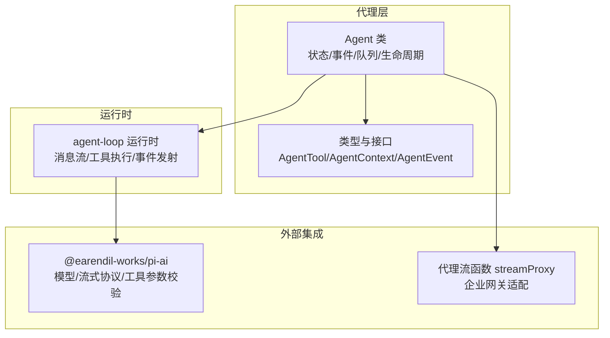
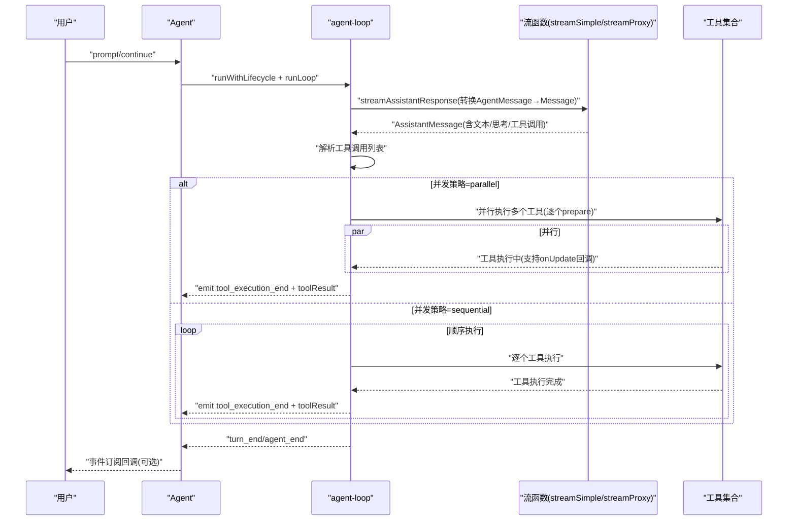
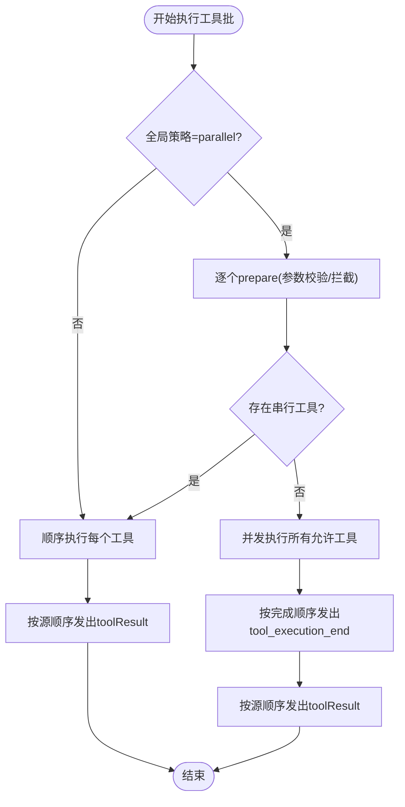
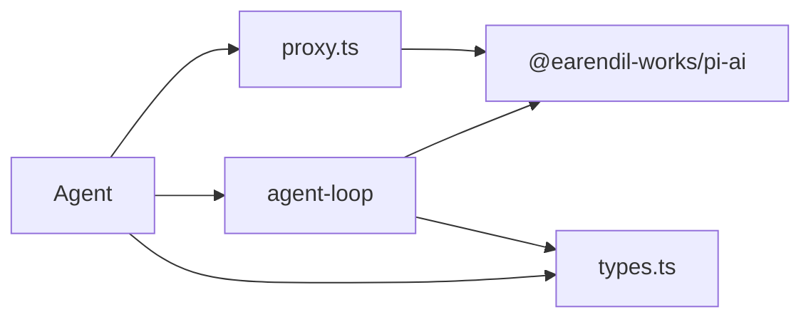

# 工具系统

<cite>
**本文引用的文件**
- [packages/agent/src/agent.ts](file://packages/agent/src/agent.ts)
- [packages/agent/src/agent-loop.ts](file://packages/agent/src/agent-loop.ts)
- [packages/agent/src/types.ts](file://packages/agent/src/types.ts)
- [packages/agent/src/index.ts](file://packages/agent/src/index.ts)
- [packages/agent/src/proxy.ts](file://packages/agent/src/proxy.ts)
- [.pi/extensions](file://.pi/extensions)
- [.pi/skills](file://.pi/skills)
</cite>

## 目录
1. [简介](#简介)
2. [项目结构](#项目结构)
3. [核心组件](#核心组件)
4. [架构总览](#架构总览)
5. [详细组件分析](#详细组件分析)
6. [依赖关系分析](#依赖关系分析)
7. [性能考量](#性能考量)
8. [故障排查指南](#故障排查指南)
9. [结论](#结论)
10. [附录](#附录)

## 简介
本文件面向Pi代理工具系统，聚焦“工具”（AgentTool）的定义、签名、参数校验、返回值处理、注册与动态发现、生命周期管理、并发执行策略、错误处理与超时控制，并提供可直接定位到源码位置的参考路径，帮助读者快速理解并扩展工具链。

## 项目结构
Pi代理工具系统位于packages/agent目录，围绕Agent类与低层agent-loop运行时协作，形成“代理-工具-LLM”的闭环。核心类型与接口在types.ts中定义；Agent类负责状态、事件、队列与生命周期；agent-loop.ts实现工具调用、并发策略与事件流；proxy.ts提供代理流式函数以适配企业网关场景。

图表来源
- [packages/agent/src/agent.ts:166-558](file://packages/agent/src/agent.ts#L166-L558)
- [packages/agent/src/agent-loop.ts:95-743](file://packages/agent/src/agent-loop.ts#L95-L743)
- [packages/agent/src/types.ts:360-419](file://packages/agent/src/types.ts#L360-L419)
- [packages/agent/src/proxy.ts:116-233](file://packages/agent/src/proxy.ts#L116-L233)

章节来源
- [packages/agent/src/index.ts:1-45](file://packages/agent/src/index.ts#L1-L45)

## 核心组件
- AgentTool：代理侧工具定义，继承自底层Tool，新增label、prepareArguments、execute、executionMode等字段，用于UI显示、参数预处理、执行与并发控制。
- Agent：持有工具数组与消息历史，封装事件订阅、队列注入（steer/followUp）、生命周期管理与错误收尾。
- agent-loop：低层循环，负责消息流、工具调用批处理、并发策略选择、事件发射与上下文更新。
- 类型系统：统一AgentMessage、AgentTool、AgentContext、AgentEvent等类型契约，确保跨模块一致性。
- 代理流函数：streamProxy将流事件通过HTTP SSE转发至企业代理服务器，客户端重建partial消息。

章节来源
- [packages/agent/src/types.ts:360-384](file://packages/agent/src/types.ts#L360-L384)
- [packages/agent/src/agent.ts:166-558](file://packages/agent/src/agent.ts#L166-L558)
- [packages/agent/src/agent-loop.ts:95-743](file://packages/agent/src/agent-loop.ts#L95-L743)
- [packages/agent/src/proxy.ts:116-233](file://packages/agent/src/proxy.ts#L116-L233)

## 架构总览
下图展示了从Agent发起一次对话到工具执行的端到端流程，包括工具参数准备、并发策略、事件发射与结果回传。

图表来源
- [packages/agent/src/agent.ts:386-449](file://packages/agent/src/agent.ts#L386-L449)
- [packages/agent/src/agent-loop.ts:275-368](file://packages/agent/src/agent-loop.ts#L275-L368)
- [packages/agent/src/agent-loop.ts:373-516](file://packages/agent/src/agent-loop.ts#L373-L516)
- [packages/agent/src/proxy.ts:116-233](file://packages/agent/src/proxy.ts#L116-L233)

## 详细组件分析

### AgentTool 定义与实现模式
- 工具签名
  - 名称与参数：继承自底层Tool，使用TypeBox Schema进行参数定义与校验。
  - 执行函数：execute(toolCallId, params, signal?, onUpdate?)，返回AgentToolResult。
  - 标签与预处理：label用于UI显示；prepareArguments用于原始参数兼容性预处理。
  - 并发控制：executionMode可覆盖全局toolExecution策略，允许单个工具串行化。
- 参数验证与返回值
  - 参数验证：在prepareToolCall阶段先调用prepareArguments，再由底层validateToolArguments进行Schema校验。
  - 返回值：AgentToolResult包含content（文本/图像内容）、details（结构化细节）、terminate（是否提前终止当前批次）。
- 生命周期钩子
  - beforeToolCall：在参数校验后、执行前，可阻止工具执行或修改行为。
  - afterToolCall：在工具执行后、事件发射前，可部分覆盖结果（content/details/isError/terminate）。
- 错误处理
  - 工具抛错会被捕获并转为错误工具结果；异常也会触发错误事件与最终消息的stopReason标记。

章节来源
- [packages/agent/src/types.ts:360-384](file://packages/agent/src/types.ts#L360-L384)
- [packages/agent/src/types.ts:55-81](file://packages/agent/src/types.ts#L55-L81)
- [packages/agent/src/agent-loop.ts:562-626](file://packages/agent/src/agent-loop.ts#L562-L626)
- [packages/agent/src/agent-loop.ts:665-708](file://packages/agent/src/agent-loop.ts#L665-L708)

### 工具注册机制、动态发现与生命周期
- 注册与可见性
  - Agent.state.tools为可读写数组，赋值会复制顶层数组，避免外部直接修改内部引用。
  - AgentContext包含tools字段，作为某次运行的可用工具集。
- 动态发现
  - 运行时通过AgentContext.tools按名称查找目标工具；未找到则立即生成错误结果。
  - 支持在每次turn开始前通过prepareNextTurn替换上下文中的tools，实现动态切换。
- 生命周期管理
  - Agent维护pendingToolCalls集合，跟踪正在执行的toolCallId；事件tool_execution_start/end用于增删。
  - 订阅者可在agent_end后清理资源；Agent.reset()清空消息、队列与运行时状态。

章节来源
- [packages/agent/src/agent.ts:66-93](file://packages/agent/src/agent.ts#L66-L93)
- [packages/agent/src/agent.ts:414-449](file://packages/agent/src/agent.ts#L414-L449)
- [packages/agent/src/agent-loop.ts:562-576](file://packages/agent/src/agent-loop.ts#L562-L576)
- [packages/agent/src/agent.ts:524-542](file://packages/agent/src/agent.ts#L524-L542)

### 工具执行的并发策略、错误处理与超时控制
- 并发策略
  - 全局策略：Agent.toolExecution默认parallel；也可在AgentOptions中设置。
  - 单工具策略：若任一工具声明executionMode="sequential"，整批工具按顺序执行。
  - 并行模式：先逐个prepare，随后并发执行allowed工具，完成后按完成顺序发出tool_execution_end，再按原始顺序发出toolResult消息。
- 错误处理
  - 工具执行异常：包装为错误工具结果，isError=true；beforeToolCall返回block也会生成错误结果。
  - 运行期中断：AbortSignal被触发时，尽快结束当前批处理并发出错误消息。
  - 统一收尾：handleRunFailure在异常或中断时生成带stopReason与errorMessage的消息事件序列。
- 超时控制
  - 通过AbortSignal实现超时中断；代理流函数也尊重signal并在读取时检测中断。
  - 代理流函数在请求失败或响应非2xx时，构造错误事件并结束流。

图表来源
- [packages/agent/src/agent-loop.ts:373-516](file://packages/agent/src/agent-loop.ts#L373-L516)
- [packages/agent/src/agent-loop.ts:384-387](file://packages/agent/src/agent-loop.ts#L384-L387)

章节来源
- [packages/agent/src/agent.ts:218-219](file://packages/agent/src/agent.ts#L218-L219)
- [packages/agent/src/agent-loop.ts:373-516](file://packages/agent/src/agent-loop.ts#L373-L516)
- [packages/agent/src/agent.ts:476-492](file://packages/agent/src/agent.ts#L476-L492)
- [packages/agent/src/proxy.ts:147-229](file://packages/agent/src/proxy.ts#L147-L229)

### 事件流与状态交互
- 事件类型
  - 消息事件：message_start/message_update/message_end
  - 工具事件：tool_execution_start/tool_execution_update/tool_execution_end
  - 轮次事件：turn_start/turn_end
  - 代理事件：agent_start/agent_end
- 状态交互
  - Agent.processEvents根据事件更新内部状态（如pendingToolCalls、streamingMessage、errorMessage），并同步通知订阅者。
  - beforeToolCall/afterToolCall可影响后续事件与toolResult内容。

章节来源
- [packages/agent/src/types.ts:403-419](file://packages/agent/src/types.ts#L403-L419)
- [packages/agent/src/agent.ts:509-556](file://packages/agent/src/agent.ts#L509-L556)

### 工具链组合使用策略
- 顺序批处理：当存在串行工具或全局策略为sequential时，工具按源顺序执行，适合需要严格依赖关系的场景。
- 并行批处理：全局并行时，工具并发执行，提升吞吐；适用于独立性强的工具。
- 提前终止：工具返回的terminate为true时，若当前批所有工具均标记terminate，则提前结束本轮，避免无意义的后续调用。
- 队列驱动：steer/followUp队列在turn间隙注入消息，配合getSteeringMessages/getFollowUpMessages实现“边执行边引导”。

章节来源
- [packages/agent/src/agent-loop.ts:544-546](file://packages/agent/src/agent-loop.ts#L544-L546)
- [packages/agent/src/agent.ts:440-447](file://packages/agent/src/agent.ts#L440-L447)

### 代码示例（以路径代替具体代码）
- 定义自定义工具
  - 参考AgentTool接口与参数Schema定义位置：[packages/agent/src/types.ts:360-384](file://packages/agent/src/types.ts#L360-L384)
  - 参数预处理与执行函数签名：[packages/agent/src/agent-loop.ts:562-626](file://packages/agent/src/agent-loop.ts#L562-L626)
- 注册工具到代理
  - 将工具数组赋值给Agent.state.tools或在AgentOptions初始化时传入：[packages/agent/src/agent.ts:66-93](file://packages/agent/src/agent.ts#L66-L93)
- 处理工具调用结果
  - 订阅Agent事件并读取toolResult消息：[packages/agent/src/types.ts:403-419](file://packages/agent/src/types.ts#L403-L419)
  - 使用afterToolCall对结果进行部分覆盖：[packages/agent/src/agent-loop.ts:665-708](file://packages/agent/src/agent-loop.ts#L665-L708)
- 动态发现与上下文切换
  - 在prepareNextTurn中替换AgentContext.tools：[packages/agent/src/agent.ts:422-449](file://packages/agent/src/agent.ts#L422-L449)
- 代理流函数集成
  - 使用streamProxy作为streamFn并配置代理URL与令牌：[packages/agent/src/proxy.ts:116-233](file://packages/agent/src/proxy.ts#L116-L233)

## 依赖关系分析
- Agent依赖agent-loop运行时与AI流式协议，通过convertToLlm与transformContext桥接消息格式。
- agent-loop依赖@earendil-works/pi-ai的validateToolArguments与流式事件协议。
- AgentTool基于TypeBox Schema，确保参数结构与校验一致。
- 代理流函数streamProxy依赖fetch与ReadableStream Reader，将代理事件还原为完整partial消息。

图表来源
- [packages/agent/src/agent.ts:166-558](file://packages/agent/src/agent.ts#L166-L558)
- [packages/agent/src/agent-loop.ts:95-743](file://packages/agent/src/agent-loop.ts#L95-L743)
- [packages/agent/src/types.ts:1-27](file://packages/agent/src/types.ts#L1-L27)
- [packages/agent/src/proxy.ts:116-233](file://packages/agent/src/proxy.ts#L116-L233)

章节来源
- [packages/agent/src/types.ts:1-27](file://packages/agent/src/types.ts#L1-L27)
- [packages/agent/src/agent.ts:166-558](file://packages/agent/src/agent.ts#L166-L558)
- [packages/agent/src/agent-loop.ts:95-743](file://packages/agent/src/agent-loop.ts#L95-L743)
- [packages/agent/src/proxy.ts:116-233](file://packages/agent/src/proxy.ts#L116-L233)

## 性能考量
- 并发执行优先：在工具相互独立时采用并行策略，减少整体等待时间。
- 事件发射成本：频繁的tool_execution_update会增加事件开销，建议在工具内部合并更新。
- 上下文转换与校验：convertToLlm与validateToolArguments应尽量轻量，避免在热路径做昂贵操作。
- 代理流函数：网络往返与JSON解析为瓶颈，建议合理设置超时与重试上限。

## 故障排查指南
- 工具未找到
  - 现象：立即产生错误工具结果。
  - 排查：确认AgentContext.tools中是否存在该工具名；检查工具注册与命名一致性。
  - 参考：[packages/agent/src/agent-loop.ts:562-576](file://packages/agent/src/agent-loop.ts#L562-L576)
- 参数校验失败
  - 现象：beforeToolCall被调用前即返回错误结果。
  - 排查：检查prepareArguments与Schema定义；确认输入数据结构。
  - 参考：[packages/agent/src/agent-loop.ts:578-626](file://packages/agent/src/agent-loop.ts#L578-L626)
- 工具执行异常
  - 现象：工具抛错被包装为错误工具结果，isError=true。
  - 排查：查看工具内部日志与信号状态；确认资源可用性。
  - 参考：[packages/agent/src/agent-loop.ts:635-663](file://packages/agent/src/agent-loop.ts#L635-L663)
- 中断与超时
  - 现象：stopReason为aborted；代理流函数报错。
  - 排查：检查AbortSignal来源；代理服务可达性与认证。
  - 参考：[packages/agent/src/agent.ts:476-492](file://packages/agent/src/agent.ts#L476-L492)，[packages/agent/src/proxy.ts:147-229](file://packages/agent/src/proxy.ts#L147-L229)
- 事件丢失或顺序异常
  - 现象：tool_execution_end与toolResult顺序不一致。
  - 排查：确认全局策略为parallel且存在并发；注意并行模式下的事件顺序差异。
  - 参考：[packages/agent/src/agent-loop.ts:451-516](file://packages/agent/src/agent-loop.ts#L451-L516)

## 结论
Pi代理工具系统通过清晰的类型契约、灵活的并发策略与完善的事件流，实现了可扩展、可观测、可中断的工具执行框架。开发者可通过AgentTool接口快速定义工具，结合beforeToolCall/afterToolCall实现细粒度控制，并利用代理流函数适配企业环境。建议在实际工程中遵循参数Schema、最小化工具间耦合、合理设置并发策略与超时控制，以获得稳定高效的工具链体验。

## 附录
- 工具与扩展生态
  - .pi/extensions与.pi/skills目录为系统扩展与技能模板所在，可用于组织与复用工具与技能。
  - 参考：[.pi/extensions](file://.pi/extensions)，[.pi/skills](file://.pi/skills)