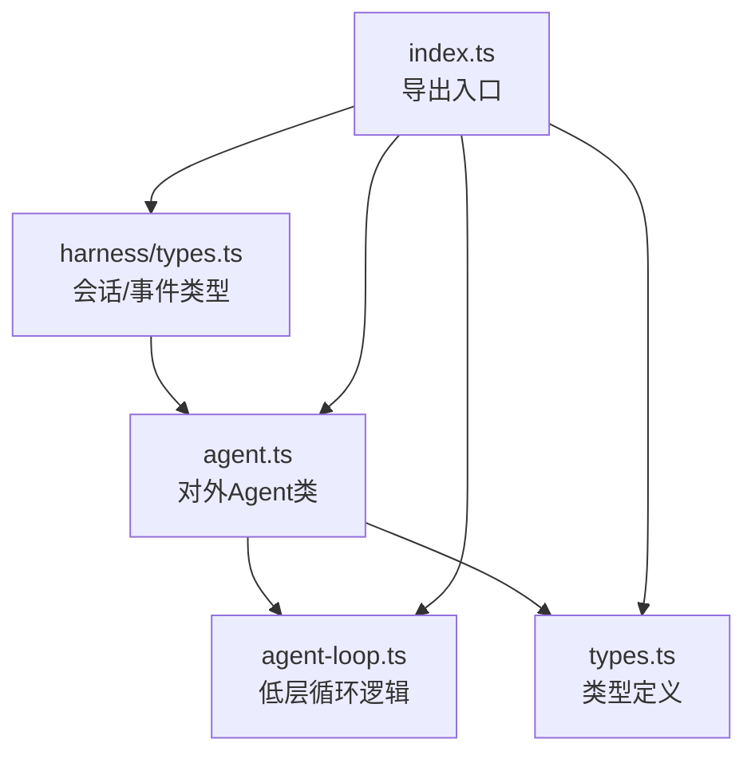
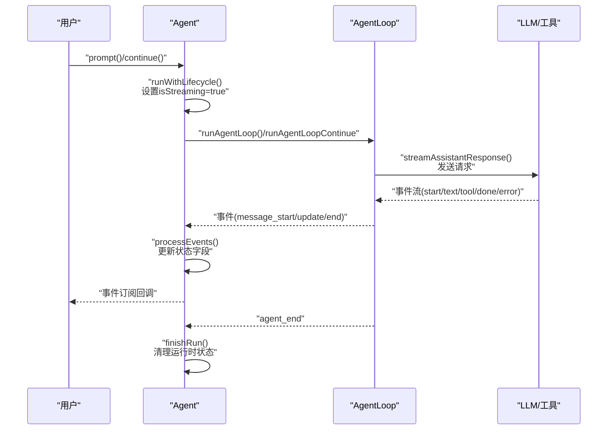
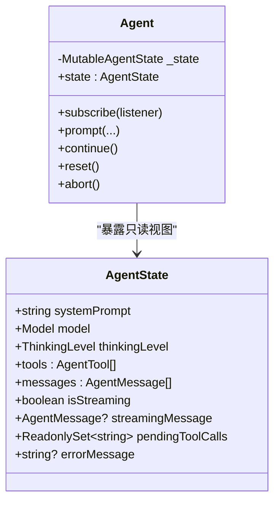
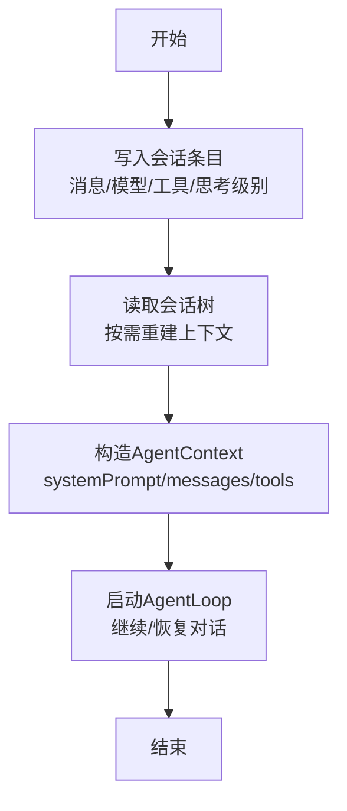
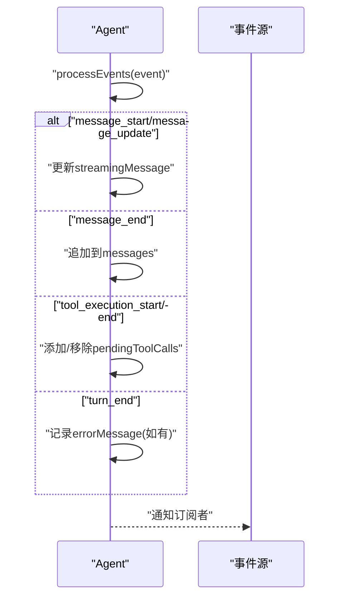
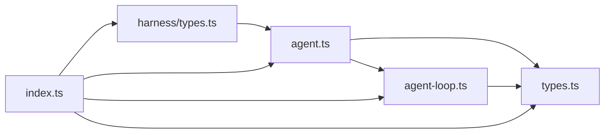

# 状态管理系统

<cite>
**本文引用的文件**
- [packages/agent/src/agent.ts](file://packages/agent/src/agent.ts)
- [packages/agent/src/agent-loop.ts](file://packages/agent/src/agent-loop.ts)
- [packages/agent/src/types.ts](file://packages/agent/src/types.ts)
- [packages/agent/src/index.ts](file://packages/agent/src/index.ts)
- [packages/agent/src/harness/types.ts](file://packages/agent/src/harness/types.ts)
</cite>

## 目录
1. [简介](#简介)
2. [项目结构](#项目结构)
3. [核心组件](#核心组件)
4. [架构总览](#架构总览)
5. [详细组件分析](#详细组件分析)
6. [依赖关系分析](#依赖关系分析)
7. [性能考量](#性能考量)
8. [故障排查指南](#故障排查指南)
9. [结论](#结论)
10. [附录](#附录)

## 简介
本文件面向Pi代理状态管理系统，系统性阐述AgentState数据结构设计（消息历史、工具列表、模型配置、运行时状态），状态持久化与序列化/反序列化的实现路径，状态变更的原子性与不可变性保障，以及响应式更新机制。文档同时提供在多代理场景下的并发控制与一致性建议，并通过图示与“章节来源”标注帮助读者定位到具体源码位置。

## 项目结构
Pi代理状态管理位于packages/agent子包中，核心由以下模块构成：
- agent.ts：对外暴露的Agent类，封装状态、事件流、队列与生命周期控制
- agent-loop.ts：低层循环逻辑，负责消息流转、工具调用、事件发射
- types.ts：类型定义，包括AgentState、AgentMessage、AgentTool等
- harness/types.ts：会话与编排层类型，涵盖会话树、事件、错误码等
- index.ts：导出入口，统一暴露Agent、循环函数、会话与类型

**图表来源**
- [packages/agent/src/agent.ts:166-558](file://packages/agent/src/agent.ts#L166-L558)
- [packages/agent/src/agent-loop.ts:1-743](file://packages/agent/src/agent-loop.ts#L1-L743)
- [packages/agent/src/types.ts:310-419](file://packages/agent/src/types.ts#L310-L419)
- [packages/agent/src/harness/types.ts:1-834](file://packages/agent/src/harness/types.ts#L1-L834)
- [packages/agent/src/index.ts:1-45](file://packages/agent/src/index.ts#L1-L45)

**章节来源**
- [packages/agent/src/index.ts:1-45](file://packages/agent/src/index.ts#L1-L45)

## 核心组件
- AgentState：对外公开的状态接口，包含系统提示词、当前模型、推理级别、工具列表、消息历史、流式状态、待执行工具集合与错误信息
- Agent：状态持有者与生命周期管理者，负责事件订阅、队列注入、运行时状态切换、重置与恢复
- AgentLoop：低层循环，驱动一次或连续对话，处理消息、工具调用、事件发射与终止条件
- 类型系统：统一的消息、工具、事件、会话树条目与错误类型

关键要点：
- AgentState对工具列表与消息数组采用访问器属性，写入时复制顶层数组，确保外部可变性不穿透至内部状态
- Agent内部维护可变快照（MutableAgentState）用于运行时变更，对外暴露只读视图
- AgentLoop在每次turn开始/结束、工具执行开始/结束、消息开始/更新/结束等节点发射事件，Agent据此更新内部状态

**章节来源**
- [packages/agent/src/types.ts:310-342](file://packages/agent/src/types.ts#L310-L342)
- [packages/agent/src/agent.ts:59-93](file://packages/agent/src/agent.ts#L59-L93)
- [packages/agent/src/agent.ts:241-243](file://packages/agent/src/agent.ts#L241-L243)
- [packages/agent/src/agent-loop.ts:155-269](file://packages/agent/src/agent-loop.ts#L155-L269)

## 架构总览
下图展示了从用户输入到事件驱动状态更新的整体流程，以及Agent与AgentLoop之间的协作关系。

**图表来源**
- [packages/agent/src/agent.ts:451-500](file://packages/agent/src/agent.ts#L451-L500)
- [packages/agent/src/agent.ts:509-556](file://packages/agent/src/agent.ts#L509-L556)
- [packages/agent/src/agent-loop.ts:275-368](file://packages/agent/src/agent-loop.ts#L275-L368)
- [packages/agent/src/agent-loop.ts:155-269](file://packages/agent/src/agent-loop.ts#L155-L269)

## 详细组件分析

### AgentState数据结构设计
- 字段与职责
  - systemPrompt：随每个模型请求发送的系统提示词
  - model：当前模型配置（含提供商、基础URL、上下文窗口、计费信息等）
  - thinkingLevel：推理级别（off/minimal/…/xhigh）
  - tools：可用工具列表；写入时复制顶层数组，避免外部直接修改内部引用
  - messages：对话历史；写入时复制顶层数组
  - isStreaming：是否正在处理prompt或continuation
  - streamingMessage：当前流式响应的部分内容
  - pendingToolCalls：当前执行中的工具调用ID集合（只读）
  - errorMessage：最近一次失败或中断的错误信息
- 不可变性与复制策略
  - 访问器属性在setter中对数组进行浅拷贝，确保外部可变性不会影响内部状态
  - Agent内部使用可变快照（MutableAgentState）承载运行时变更，对外仅暴露只读AgentState

**图表来源**
- [packages/agent/src/types.ts:310-342](file://packages/agent/src/types.ts#L310-L342)
- [packages/agent/src/agent.ts:59-93](file://packages/agent/src/agent.ts#L59-L93)
- [packages/agent/src/agent.ts:241-243](file://packages/agent/src/agent.ts#L241-L243)

**章节来源**
- [packages/agent/src/types.ts:310-342](file://packages/agent/src/types.ts#L310-L342)
- [packages/agent/src/agent.ts:59-93](file://packages/agent/src/agent.ts#L59-L93)

### 状态持久化、序列化与反序列化
- 持久化路径
  - 会话存储：会话树条目（消息、模型变更、工具变更、思考级别变更、压缩摘要等）通过SessionStorage接口写入
  - 入口：会话仓库（SessionRepo）提供创建、打开、fork、列出与删除操作
- 序列化/反序列化
  - 会话条目为结构化对象，支持JSON序列化；会话元数据包含会话标识与创建时间
  - 会话树遍历与路径查询用于恢复状态
- 状态恢复
  - 可基于会话树重建AgentContext（systemPrompt、messages、tools），再结合AgentLoop配置恢复对话
  - 编排层（Harness）提供事件与钩子，便于在恢复前后注入上下文与资源

**图表来源**
- [packages/agent/src/harness/types.ts:440-454](file://packages/agent/src/harness/types.ts#L440-L454)
- [packages/agent/src/harness/types.ts:468-478](file://packages/agent/src/harness/types.ts#L468-L478)
- [packages/agent/src/harness/types.ts:410-421](file://packages/agent/src/harness/types.ts#L410-L421)

**章节来源**
- [packages/agent/src/harness/types.ts:410-454](file://packages/agent/src/harness/types.ts#L410-L454)
- [packages/agent/src/harness/types.ts:468-478](file://packages/agent/src/harness/types.ts#L468-L478)

### 状态变更的原子性与不可变性
- 原子性
  - 单次runWithLifecycle包裹一次完整的运行周期，期间状态变更在事件处理阶段按序发生，最终在finishRun中统一收尾
  - 工具执行批处理（顺序/并行）在单个turn内完成，避免跨turn的中间态被外部观察
- 不可变性
  - 对外暴露的AgentState为只读视图；内部使用可变快照（MutableAgentState）承载运行时变更
  - 写入tools/messages时复制数组，防止外部直接修改内部引用
- 响应式更新
  - Agent.subscribe提供事件订阅，事件类型覆盖agent_start/agent_end、turn_*、message_*、tool_execution_*等
  - processEvents根据事件类型更新isStreaming、streamingMessage、messages、pendingToolCalls与errorMessage

**图表来源**
- [packages/agent/src/agent.ts:509-556](file://packages/agent/src/agent.ts#L509-L556)

**章节来源**
- [packages/agent/src/agent.ts:509-556](file://packages/agent/src/agent.ts#L509-L556)
- [packages/agent/src/agent.ts:59-93](file://packages/agent/src/agent.ts#L59-L93)

### 多代理场景下的并发控制与一致性
- 并发控制
  - 单Agent实例在同一时刻仅允许一个活跃运行（activeRun），后续prompt/continue会抛出错误
  - 工具执行模式支持顺序或并行，避免竞态条件；并行模式下以批处理完成后再发出结果
- 一致性
  - 会话树条目作为事实来源，按时间戳与父子关系组织，确保状态恢复的一致性
  - 事件流严格有序，agent_end之后才认为运行结束，避免订阅者竞争
- 建议实践
  - 多代理共享会话存储时，使用唯一sessionId区分缓存与统计
  - 使用AbortSignal协调长任务取消，确保状态回滚一致

**章节来源**
- [packages/agent/src/agent.ts:327-365](file://packages/agent/src/agent.ts#L327-L365)
- [packages/agent/src/agent-loop.ts:389-516](file://packages/agent/src/agent-loop.ts#L389-L516)
- [packages/agent/src/harness/types.ts:410-421](file://packages/agent/src/harness/types.ts#L410-L421)

## 依赖关系分析
- Agent依赖AgentLoop进行实际的对话与工具执行
- AgentLoop依赖类型系统（AgentMessage、AgentTool、AgentEvent等）与流式接口
- 会话与编排层类型（SessionStorage、SessionRepo、SessionTreeEntry等）支撑状态持久化
- 导出入口统一暴露Agent、循环函数与类型，便于上层集成

**图表来源**
- [packages/agent/src/agent.ts:1-27](file://packages/agent/src/agent.ts#L1-L27)
- [packages/agent/src/agent-loop.ts:1-23](file://packages/agent/src/agent-loop.ts#L1-L23)
- [packages/agent/src/types.ts:1-13](file://packages/agent/src/types.ts#L1-L13)
- [packages/agent/src/harness/types.ts:1-8](file://packages/agent/src/harness/types.ts#L1-L8)
- [packages/agent/src/index.ts:1-45](file://packages/agent/src/index.ts#L1-L45)

**章节来源**
- [packages/agent/src/index.ts:1-45](file://packages/agent/src/index.ts#L1-L45)

## 性能考量
- 数组复制成本：tools与messages写入时的浅拷贝在消息量较大时会产生额外开销，建议批量更新或合并多次写入
- 流式事件：事件发射与订阅者等待会增加延迟，建议在UI层节流渲染
- 工具执行：并行模式提升吞吐但增加内存与锁竞争，顺序模式更稳定
- 会话写入：批量写入会话条目，减少I/O次数

## 故障排查指南
- 运行冲突
  - 症状：重复调用prompt/continue抛出异常
  - 处理：等待waitForIdle或检查activeRun状态
- 中断与错误
  - 症状：errorMessage存在，stopReason为aborted或error
  - 处理：检查AbortSignal与beforeToolCall/afterToolCall返回值
- 队列堆积
  - 症状：steering/followUp队列未清空
  - 处理：使用clearSteeringQueue/clearFollowUpQueue或clearAllQueues
- 会话恢复
  - 症状：恢复后上下文不一致
  - 处理：核对SessionTreeEntry顺序与AgentContext重建逻辑

**章节来源**
- [packages/agent/src/agent.ts:327-365](file://packages/agent/src/agent.ts#L327-L365)
- [packages/agent/src/agent.ts:476-492](file://packages/agent/src/agent.ts#L476-L492)
- [packages/agent/src/agent.ts:274-287](file://packages/agent/src/agent.ts#L274-L287)
- [packages/agent/src/harness/types.ts:410-421](file://packages/agent/src/harness/types.ts#L410-L421)

## 结论
Pi代理状态管理系统通过清晰的类型抽象、事件驱动的状态更新与会话持久化机制，实现了对消息历史、工具列表、模型配置与运行时状态的可靠管理。AgentState的不可变性与复制策略、AgentLoop的原子事件流、以及会话树的结构化存储共同构成了高一致性与可恢复性的基础。在多代理场景下，借助sessionId、AbortSignal与严格的事件顺序，可进一步增强并发控制与一致性保障。

## 附录

### 如何访问与修改代理状态
- 订阅事件以响应状态变化
  - 使用Agent.subscribe注册回调，接收agent_start/agent_end、turn_*、message_*、tool_execution_*等事件
  - 参考：[packages/agent/src/agent.ts:231-234](file://packages/agent/src/agent.ts#L231-L234)，[packages/agent/src/agent.ts:509-556](file://packages/agent/src/agent.ts#L509-L556)
- 获取当前状态
  - 通过Agent.state访问只读AgentState
  - 参考：[packages/agent/src/agent.ts:241-243](file://packages/agent/src/agent.ts#L241-L243)，[packages/agent/src/types.ts:310-342](file://packages/agent/src/types.ts#L310-L342)
- 修改工具列表与消息历史
  - 写入tools与messages会复制数组，避免外部修改穿透
  - 参考：[packages/agent/src/agent.ts:69-93](file://packages/agent/src/agent.ts#L69-L93)，[packages/agent/src/types.ts:324-329](file://packages/agent/src/types.ts#L324-L329)
- 清理与重置
  - reset清空消息、运行时状态与队列
  - 参考：[packages/agent/src/agent.ts:314-322](file://packages/agent/src/agent.ts#L314-L322)

### 实现状态恢复功能
- 从会话树重建上下文
  - 读取SessionTreeEntry，构建AgentContext(systemPrompt/messages/tools)
  - 参考：[packages/agent/src/harness/types.ts:410-421](file://packages/agent/src/harness/types.ts#L410-L421)，[packages/agent/src/harness/types.ts:422-427](file://packages/agent/src/harness/types.ts#L422-L427)
- 启动AgentLoop继续对话
  - 使用runAgentLoop或runAgentLoopContinue，传入AgentContext与AgentLoopConfig
  - 参考：[packages/agent/src/agent-loop.ts:95-143](file://packages/agent/src/agent-loop.ts#L95-L143)，[packages/agent/src/agent-loop.ts:155-269](file://packages/agent/src/agent-loop.ts#L155-L269)