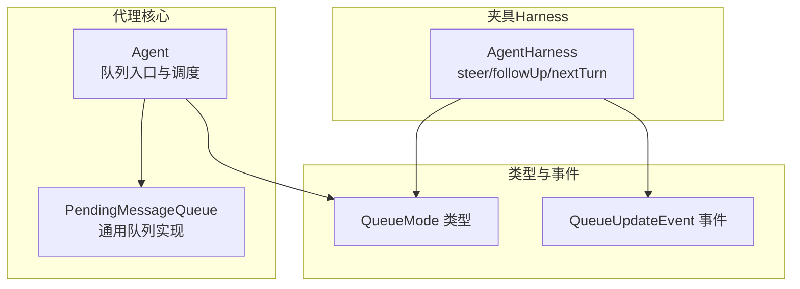
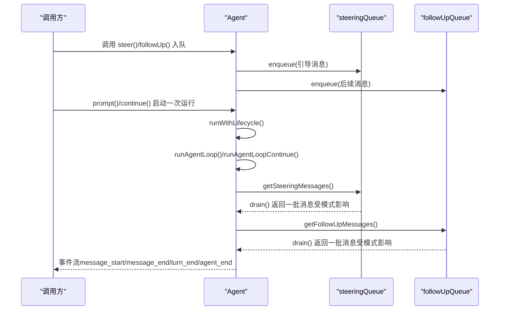
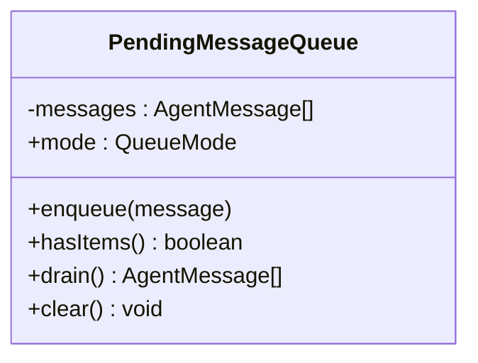
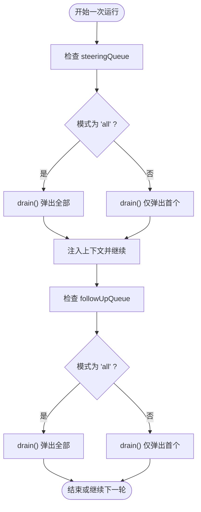
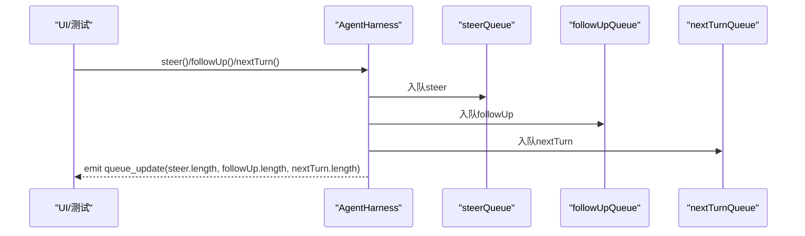
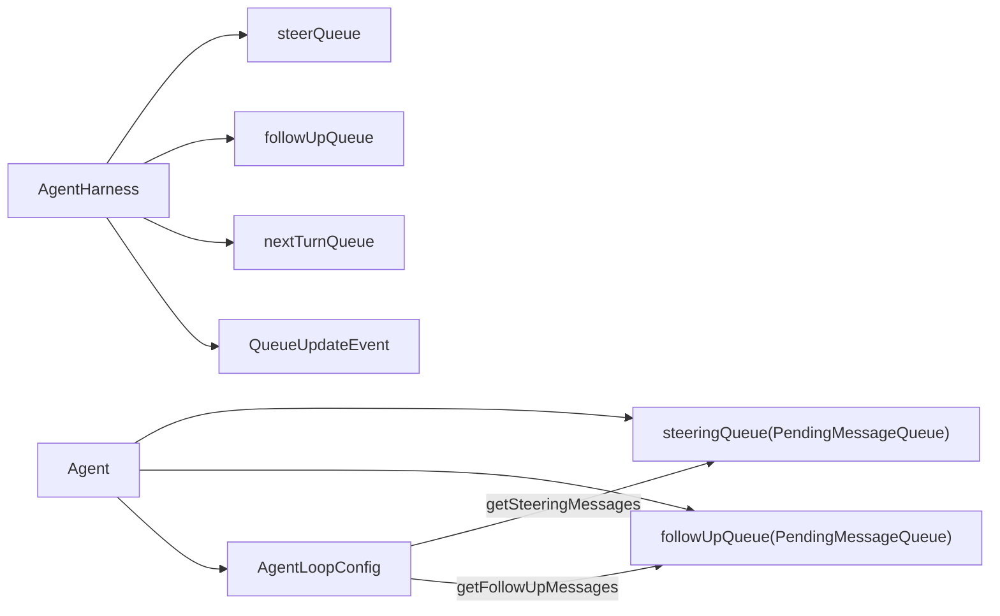

# 队列机制

<cite>
**本文引用的文件**
- [agent.ts](file://packages/agent/src/agent.ts)
- [types.ts](file://packages/agent/src/types.ts)
- [agent-harness.ts](file://packages/agent/src/harness/agent-harness.ts)
- [agent-harness.test.ts](file://packages/agent/test/harness/agent-harness.test.ts)
- [agent.test.ts](file://packages/agent/test/agent.test.ts)
- [harness/types.ts](file://packages/agent/src/harness/types.ts)
</cite>

## 目录
1. [简介](#简介)
2. [项目结构](#项目结构)
3. [核心组件](#核心组件)
4. [架构总览](#架构总览)
5. [详细组件分析](#详细组件分析)
6. [依赖关系分析](#依赖关系分析)
7. [性能考量](#性能考量)
8. [故障排查指南](#故障排查指南)
9. [结论](#结论)
10. [附录](#附录)

## 简介
本文件系统性阐述 Pi 代理（Agent）的队列机制，重点围绕 PendingMessageQueue 的设计与实现，解释其“先进先出”策略、批量处理与优先级管理；详解引导队列（steering queue）与后续队列（follow-up queue）的职责边界、使用场景与行为差异；给出队列模式选择策略（'one-at-a-time' 与 'all' 模式）及在代理协作与工作流编排中的作用。文末提供基于源码路径的示例定位，帮助读者快速定位到具体实现。

## 项目结构
本节聚焦与队列机制直接相关的模块与文件：
- 核心实现：packages/agent/src/agent.ts 中的 Agent 类与 PendingMessageQueue
- 类型定义：packages/agent/src/types.ts 中的 QueueMode 等类型
- 测试验证：packages/agent/test 下的 agent.test.ts 与 agent-harness.test.ts
- 夹具（Harness）队列：packages/agent/src/harness/agent-harness.ts 中的 steer/followUp/nextTurn 队列
- 夹具事件：packages/agent/src/harness/types.ts 中的 QueueUpdateEvent 等

图示来源
- [agent.ts:118-152](file://packages/agent/src/agent.ts#L118-L152)
- [types.ts:38-44](file://packages/agent/src/types.ts#L38-L44)
- [harness/types.ts:500-505](file://packages/agent/src/harness/types.ts#L500-L505)
- [agent-harness.ts:679-694](file://packages/agent/src/harness/agent-harness.ts#L679-L694)

章节来源
- [agent.ts:118-152](file://packages/agent/src/agent.ts#L118-L152)
- [types.ts:38-44](file://packages/agent/src/types.ts#L38-L44)
- [harness/types.ts:500-505](file://packages/agent/src/harness/types.ts#L500-L505)
- [agent-harness.ts:679-694](file://packages/agent/src/harness/agent-harness.ts#L679-L694)

## 核心组件
- PendingMessageQueue：通用消息队列，支持两种模式（'one-at-a-time'/'all'），提供 enqueue/drain/clear/hasItems 等操作。
- Agent.steeringQueue/followUpQueue：分别对应引导队列与后续队列，由 Agent 在构造时初始化，并通过 steer()/followUp() 入队。
- QueueMode：'one-at-a-time' 或 'all'，决定队列在被拉取时是仅取一个还是全部弹出。
- AgentHarness：在夹具层提供 steer()/followUp()/nextTurn()，并发出 queue_update 事件，便于 UI/工具观察队列状态。

章节来源
- [agent.ts:118-152](file://packages/agent/src/agent.ts#L118-L152)
- [agent.ts:264-287](file://packages/agent/src/agent.ts#L264-L287)
- [types.ts:38-44](file://packages/agent/src/types.ts#L38-L44)
- [agent-harness.ts:679-694](file://packages/agent/src/harness/agent-harness.ts#L679-L694)
- [harness/types.ts:500-505](file://packages/agent/src/harness/types.ts#L500-L505)

## 架构总览
下图展示了 Agent 如何在一次运行中消费 steering 与 follow-up 队列，以及队列模式对行为的影响。

图示来源
- [agent.ts:422-449](file://packages/agent/src/agent.ts#L422-L449)
- [agent.ts:386-400](file://packages/agent/src/agent.ts#L386-L400)
- [agent.ts:337-365](file://packages/agent/src/agent.ts#L337-L365)

## 详细组件分析

### PendingMessageQueue 设计与实现
- 数据结构：内部维护 AgentMessage[] 数组，按入队顺序存储。
- 模式控制：构造时指定 QueueMode；通过 setter 可动态切换。
- 出队策略：
  - 'one-at-a-time'：每次只取第一个元素，剩余元素保留。
  - 'all'：一次性弹出所有元素，清空队列。
- 辅助能力：hasItems/clear/enqueue。

图示来源
- [agent.ts:118-152](file://packages/agent/src/agent.ts#L118-L152)

章节来源
- [agent.ts:118-152](file://packages/agent/src/agent.ts#L118-L152)

### Agent 队列接口与生命周期集成
- 初始化：steeringQueue/followUpQueue 默认模式为 'one-at-a-time'。
- 入队：steer()/followUp() 分别写入对应队列。
- 拉取：在 AgentLoopConfig.getSteeringMessages/getFollowUpMessages 中调用 drain()。
- 清理：clearSteeringQueue()/clearFollowUpQueue()/clearAllQueues()。
- 状态：hasQueuedMessages() 判断任一队列是否非空。

图示来源
- [agent.ts:422-449](file://packages/agent/src/agent.ts#L422-L449)
- [agent.ts:337-365](file://packages/agent/src/agent.ts#L337-L365)

章节来源
- [agent.ts:201-219](file://packages/agent/src/agent.ts#L201-L219)
- [agent.ts:264-287](file://packages/agent/src/agent.ts#L264-L287)
- [agent.ts:337-365](file://packages/agent/src/agent.ts#L337-L365)
- [agent.ts:422-449](file://packages/agent/src/agent.ts#L422-L449)

### 队列模式选择策略（'one-at-a-time' vs 'all'）
- 'one-at-a-time'
  - 行为：每次从队列取出一个消息，其余保留在队列中，等待后续拉取点。
  - 适用：需要逐步推进、保持交互节奏与可感知性的场景（如 UI 连续提示、逐步引导）。
  - 测试验证：单次连续响应、队列长度逐步递减。
- 'all'
  - 行为：一次性弹出队列中全部消息，清空队列。
  - 适用：批处理、合并请求、减少往返次数的场景。
  - 测试验证：夹具测试中明确设置 steeringMode/followUpMode 为 "all" 并断言行为。

章节来源
- [types.ts:38-44](file://packages/agent/src/types.ts#L38-L44)
- [agent-harness.test.ts:63-76](file://packages/agent/test/harness/agent-harness.test.ts#L63-L76)
- [agent-harness.test.ts:229-231](file://packages/agent/test/harness/agent-harness.test.ts#L229-L231)

### 引导队列（steering queue）与后续队列（follow-up queue）
- 引导队列（steering）
  - 触发时机：在当前助手回合完成工具调用后、下一轮请求前。
  - 用途：在代理执行过程中插入新的用户消息，实现“边执行边引导”。
  - 行为：默认 'one-at-a-time'，确保逐步注入，避免过载。
- 后续队列（follow-up）
  - 触发时机：当代理已无工具调用且无引导消息时。
  - 用途：延迟执行的消息，等待代理真正“空闲”后再继续。
  - 行为：默认 'one-at-a-time'，保证串行推进。

章节来源
- [agent.ts:422-449](file://packages/agent/src/agent.ts#L422-L449)
- [agent.ts:337-365](file://packages/agent/src/agent.ts#L337-L365)

### 夹具（AgentHarness）队列与事件
- 提供 steer()/followUp()/nextTurn() 方法，分别向不同队列写入消息。
- 发出 queue_update 事件，包含 steer/followUp/nextTurn 三类队列的当前内容，便于 UI 实时反馈。
- 支持 abort 时清理 steer/followUp，但保留 nextTurn（用于“下一回合”保留）。

图示来源
- [agent-harness.ts:679-694](file://packages/agent/src/harness/agent-harness.ts#L679-L694)
- [harness/types.ts:500-505](file://packages/agent/src/harness/types.ts#L500-L505)

章节来源
- [agent-harness.ts:679-694](file://packages/agent/src/harness/agent-harness.ts#L679-L694)
- [harness/types.ts:500-505](file://packages/agent/src/harness/types.ts#L500-L505)
- [agent-harness.test.ts:178-206](file://packages/agent/test/harness/agent-harness.test.ts#L178-L206)

### 使用示例（基于源码路径）
- steer() 与 followUp() 入队
  - [steer() 定义:264-266](file://packages/agent/src/agent.ts#L264-L266)
  - [followUp() 定义:269-271](file://packages/agent/src/agent.ts#L269-L271)
- 配置队列模式
  - [构造函数中设置默认模式:212-213](file://packages/agent/src/agent.ts#L212-L213)
  - [getter/setter 访问模式:246-261](file://packages/agent/src/agent.ts#L246-L261)
- 处理队列中的消息
  - [getSteeringMessages/getFollowUpMessages 拉取:440-447](file://packages/agent/src/agent.ts#L440-L447)
  - [continue() 中的队列消费逻辑:337-365](file://packages/agent/src/agent.ts#L337-L365)
- 夹具侧使用
  - [steer()/followUp()/nextTurn():679-694](file://packages/agent/src/harness/agent-harness.ts#L679-L694)
  - [queue_update 事件:500-505](file://packages/agent/src/harness/types.ts#L500-L505)

章节来源
- [agent.ts:212-213](file://packages/agent/src/agent.ts#L212-L213)
- [agent.ts:246-261](file://packages/agent/src/agent.ts#L246-L261)
- [agent.ts:264-271](file://packages/agent/src/agent.ts#L264-L271)
- [agent.ts:337-365](file://packages/agent/src/agent.ts#L337-L365)
- [agent.ts:440-447](file://packages/agent/src/agent.ts#L440-L447)
- [agent-harness.ts:679-694](file://packages/agent/src/harness/agent-harness.ts#L679-L694)
- [harness/types.ts:500-505](file://packages/agent/src/harness/types.ts#L500-L505)

## 依赖关系分析
- Agent 对 PendingMessageQueue 的依赖：组合关系，分别持有 steeringQueue 与 followUpQueue。
- AgentLoopConfig 通过 getSteeringMessages/getFollowUpMessages 间接依赖队列的 drain()。
- AgentHarness 对队列的依赖：独立的 steerQueue/followUpQueue/nextTurnQueue，配合 queue_update 事件对外暴露状态。
- 类型约束：QueueMode 限定为 "all" 或 "one-at-a-time"，保证行为确定性。

图示来源
- [agent.ts:169-170](file://packages/agent/src/agent.ts#L169-L170)
- [agent.ts:440-447](file://packages/agent/src/agent.ts#L440-L447)
- [agent-harness.ts:193-197](file://packages/agent/src/harness/agent-harness.ts#L193-L197)
- [harness/types.ts:500-505](file://packages/agent/src/harness/types.ts#L500-L505)

章节来源
- [agent.ts:169-170](file://packages/agent/src/agent.ts#L169-L170)
- [agent.ts:440-447](file://packages/agent/src/agent.ts#L440-L447)
- [agent-harness.ts:193-197](file://packages/agent/src/harness/agent-harness.ts#L193-L197)
- [harness/types.ts:500-505](file://packages/agent/src/harness/types.ts#L500-L505)

## 性能考量
- 'all' 模式可能在单次拉取中产生较大上下文增量，需关注模型上下文窗口与令牌预算。
- 'one-at-a-time' 模式更利于渐进式处理，降低单轮负载，适合长会话与高并发场景。
- 队列清空策略（drain/all）直接影响事件数量与网络往返次数，应根据业务目标权衡。

## 故障排查指南
- 同时发起多个 prompt()/continue() 会抛错，提示使用 steer()/followUp() 或等待完成。
  - 参考：[错误抛出位置:328-332](file://packages/agent/src/agent.ts#L328-L332)
  - 测试用例：[并发 prompt 抛错:341-344](file://packages/agent/test/agent.test.ts#L341-L344)
- abort 后队列清理：steer/followUp 被清空，nextTurn 保留。
  - 参考：[abort 清理行为:178-206](file://packages/agent/test/harness/agent-harness.test.ts#L178-L206)
- 队列长度与模式验证：可通过订阅 queue_update 事件观察队列变化。
  - 参考：[queue_update 事件定义:500-505](file://packages/agent/src/harness/types.ts#L500-L505)
  - 测试用例：[one-at-a-time 模式队列长度递减:78-119](file://packages/agent/test/harness/agent-harness.test.ts#L78-L119)

章节来源
- [agent.ts:328-332](file://packages/agent/src/agent.ts#L328-L332)
- [agent.test.ts:341-344](file://packages/agent/test/agent.test.ts#L341-L344)
- [agent-harness.test.ts:178-206](file://packages/agent/test/harness/agent-harness.test.ts#L178-L206)
- [harness/types.ts:500-505](file://packages/agent/src/harness/types.ts#L500-L505)
- [agent-harness.test.ts:78-119](file://packages/agent/test/harness/agent-harness.test.ts#L78-L119)

## 结论
Pi 代理的队列机制通过 PendingMessageQueue 提供统一的 FIFO 存储与模式化拉取策略，结合 Agent 的 steering 与 follow-up 两类队列，实现了“边执行边引导”与“延迟串行”的双轨控制。'one-at-a-time' 与 'all' 两种模式满足不同场景下的吞吐与节奏需求；配合夹具的 queue_update 事件，可实现 UI 与外部系统的可观测与可控编排。建议在高并发或长会话场景优先采用 'one-at-a-time'，在批处理或低延迟场景考虑 'all'。

## 附录
- 关键实现路径速查
  - [PendingMessageQueue 类:118-152](file://packages/agent/src/agent.ts#L118-L152)
  - [Agent 构造与队列初始化:201-219](file://packages/agent/src/agent.ts#L201-L219)
  - [steer()/followUp() 接口:264-271](file://packages/agent/src/agent.ts#L264-L271)
  - [队列模式类型定义:38-44](file://packages/agent/src/types.ts#L38-L44)
  - [夹具 steer/followUp/nextTurn:679-694](file://packages/agent/src/harness/agent-harness.ts#L679-L694)
  - [queue_update 事件定义:500-505](file://packages/agent/src/harness/types.ts#L500-L505)
  - [单次/批量模式测试:63-76](file://packages/agent/test/harness/agent-harness.test.ts#L63-L76)
  - [one-at-a-time 行为验证:78-119](file://packages/agent/test/harness/agent-harness.test.ts#L78-L119)
  - [follow-up one-at-a-time 行为验证:208-249](file://packages/agent/test/harness/agent-harness.test.ts#L208-L249)