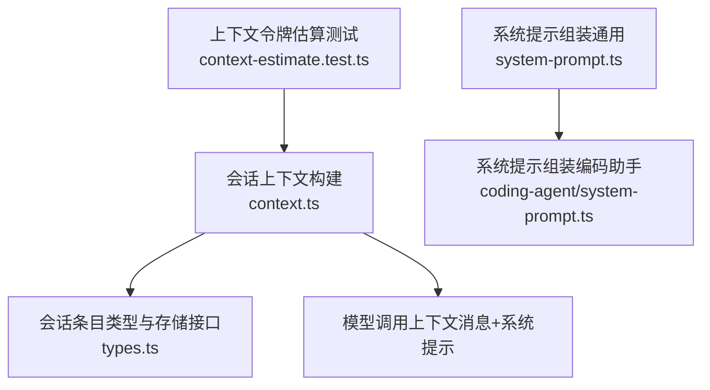
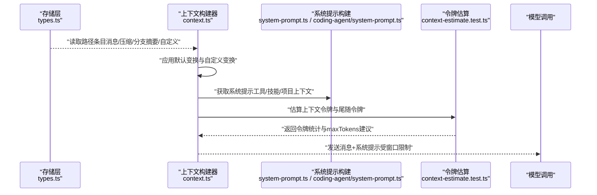
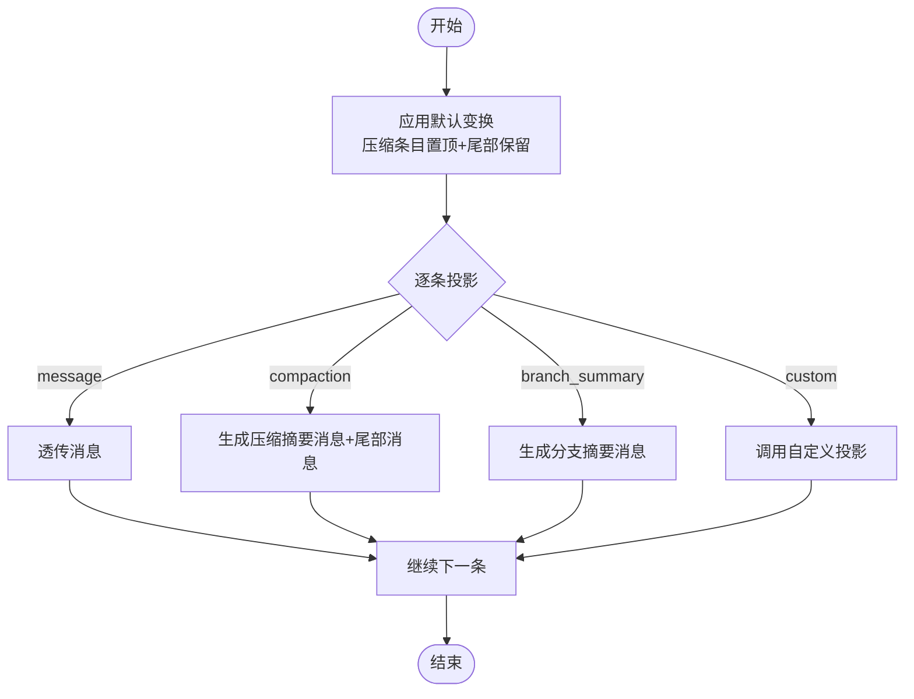
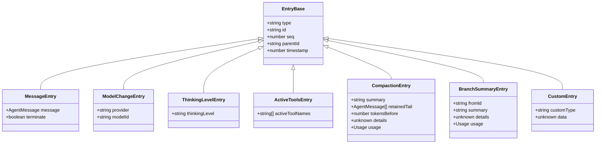
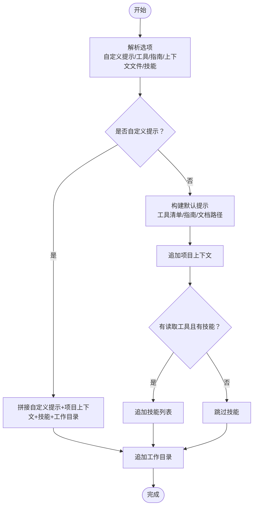
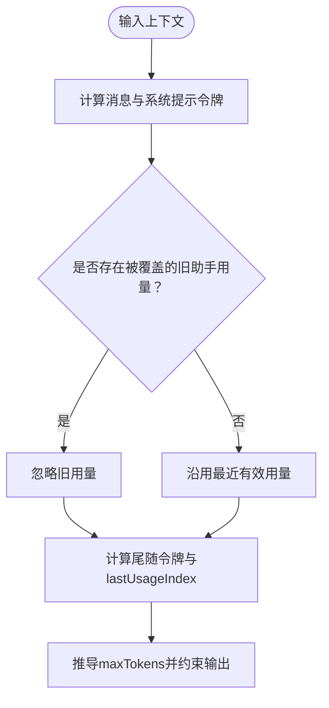
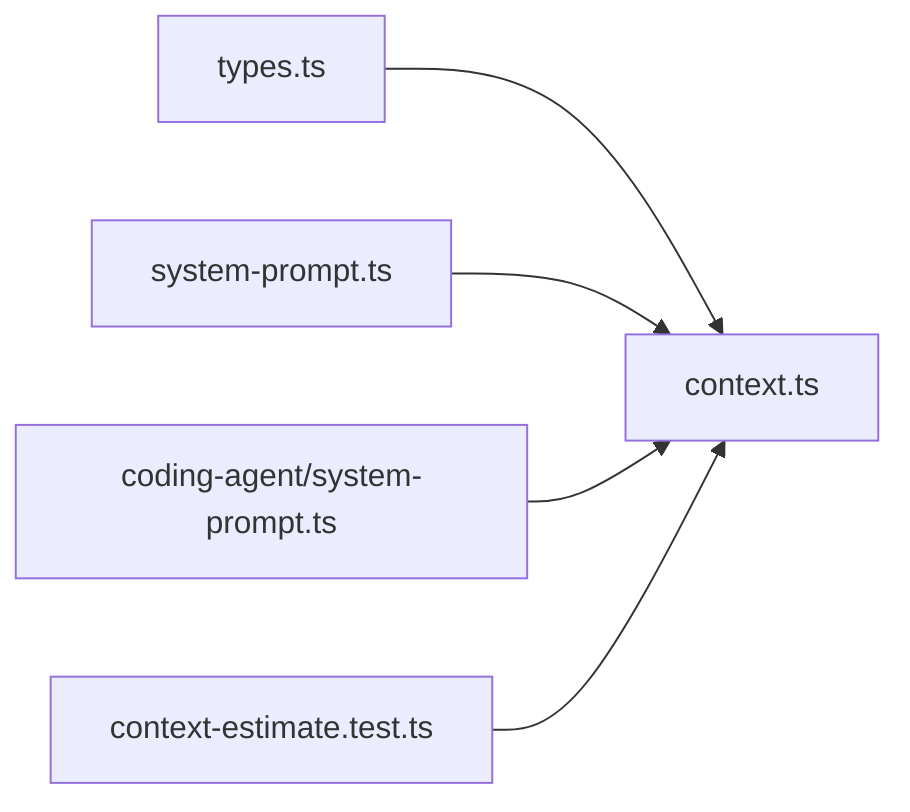

# 上下文管理

<cite>
**本文引用的文件**
- [packages/agent/src/harness/session/context.ts](file://packages/agent/src/harness/session/context.ts)
- [packages/agent/src/harness/session/types.ts](file://packages/agent/src/harness/session/types.ts)
- [packages/agent/src/harness/system-prompt.ts](file://packages/agent/src/harness/system-prompt.ts)
- [packages/coding-agent/src/core/system-prompt.ts](file://packages/coding-agent/src/core/system-prompt.ts)
- [packages/ai/test/context-estimate.test.ts](file://packages/ai/test/context-estimate.test.ts)
</cite>

## 目录
1. [简介](#简介)
2. [项目结构](#项目结构)
3. [核心组件](#核心组件)
4. [架构总览](#架构总览)
5. [详细组件分析](#详细组件分析)
6. [依赖关系分析](#依赖关系分析)
7. [性能考量](#性能考量)
8. [故障排查指南](#故障排查指南)
9. [结论](#结论)
10. [附录](#附录)

## 简介
本文件围绕“上下文管理”展开，系统性说明对话历史、系统提示、工具定义、用户偏好等如何组织与流转；阐述在长对话中保持性能与准确性的压缩策略（摘要生成、历史裁剪、重要性评估）；解释上下文窗口管理（最大长度限制、动态调整、内存优化）；介绍分支摘要功能以支持多任务并行；说明上下文的序列化与反序列化以确保跨会话一致性；提供上下文质量评估方法（相关性评分、信息密度分析、冗余检测）；并给出性能优化建议与最佳实践（预加载、懒加载、缓存策略）。

## 项目结构
与上下文管理直接相关的代码主要分布在以下模块：
- 会话上下文构建与消息投影：packages/agent/src/harness/session/context.ts
- 会话条目类型、分支与压缩记录、存储接口：packages/agent/src/harness/session/types.ts
- 系统提示组装（通用技能列表）：packages/agent/src/harness/system-prompt.ts
- 系统提示组装（编码助手场景，含工具、指南、项目上下文文件）：packages/coding-agent/src/core/system-prompt.ts
- 上下文令牌估算与窗口边界行为验证：packages/ai/test/context-estimate.test.ts

**图表来源**
- [packages/agent/src/harness/session/context.ts:5-100](file://packages/agent/src/harness/session/context.ts#L5-L100)
- [packages/agent/src/harness/session/types.ts:14-74](file://packages/agent/src/harness/session/types.ts#L14-L74)
- [packages/agent/src/harness/system-prompt.ts:3-25](file://packages/agent/src/harness/system-prompt.ts#L3-L25)
- [packages/coding-agent/src/core/system-prompt.ts:28-162](file://packages/coding-agent/src/core/system-prompt.ts#L28-L162)
- [packages/ai/test/context-estimate.test.ts:43-81](file://packages/ai/test/context-estimate.test.ts#L43-L81)

**章节来源**
- [packages/agent/src/harness/session/context.ts:5-100](file://packages/agent/src/harness/session/context.ts#L5-L100)
- [packages/agent/src/harness/session/types.ts:14-74](file://packages/agent/src/harness/session/types.ts#L14-L74)
- [packages/agent/src/harness/system-prompt.ts:3-25](file://packages/agent/src/harness/system-prompt.ts#L3-L25)
- [packages/coding-agent/src/core/system-prompt.ts:28-162](file://packages/coding-agent/src/core/system-prompt.ts#L28-L162)
- [packages/ai/test/context-estimate.test.ts:43-81](file://packages/ai/test/context-estimate.test.ts#L43-L81)

## 核心组件
- 会话上下文（SessionContext）：封装当前对话所需的消息序列以及衍生状态（思考级别、模型选择、活跃工具名），用于驱动模型调用。
- 条目（Entry）体系：将对话历史、系统变更、压缩结果、分支摘要、自定义事件统一为可追加的有序条目，支持分支与合并。
- 上下文构建管线：对原始路径条目进行变换与投影，生成最终的消息序列与状态。
- 系统提示构建：根据可用工具、技能、项目上下文文件与指南，生成面向模型的指令文本。
- 上下文令牌估算：基于消息与使用统计估算输入令牌，辅助控制输出上限与窗口边界。

**章节来源**
- [packages/agent/src/harness/session/context.ts:5-100](file://packages/agent/src/harness/session/context.ts#L5-L100)
- [packages/agent/src/harness/session/types.ts:14-74](file://packages/agent/src/harness/session/types.ts#L14-L74)
- [packages/coding-agent/src/core/system-prompt.ts:28-162](file://packages/coding-agent/src/core/system-prompt.ts#L28-L162)
- [packages/ai/test/context-estimate.test.ts:43-81](file://packages/ai/test/context-estimate.test.ts#L43-L81)

## 架构总览
下图展示了从会话条目到最终模型调用的上下文装配流程，包括压缩与分支摘要的注入、系统提示的拼接以及令牌估算对窗口边界的约束。

**图表来源**
- [packages/agent/src/harness/session/context.ts:45-100](file://packages/agent/src/harness/session/context.ts#L45-L100)
- [packages/agent/src/harness/session/types.ts:44-74](file://packages/agent/src/harness/session/types.ts#L44-L74)
- [packages/coding-agent/src/core/system-prompt.ts:28-162](file://packages/coding-agent/src/core/system-prompt.ts#L28-L162)
- [packages/ai/test/context-estimate.test.ts:43-81](file://packages/ai/test/context-estimate.test.ts#L43-L81)

## 详细组件分析

### 会话上下文构建与消息投影
- 会话上下文包含：消息数组、思考级别、模型信息、活跃工具名。
- 默认变换策略：若存在压缩条目，则将其置于最前，并保留其尾部消息，确保最新上下文优先且关键尾部不丢失。
- 消息投影规则：
  - 普通消息按角色透传。
  - 压缩条目转换为“压缩摘要消息”并附带保留的尾部消息。
  - 分支摘要条目转换为“分支摘要消息”，携带来源ID与时间戳。
  - 自定义条目通过可选的投影函数映射为消息。
- 状态推导：遍历路径条目，提取最新的思考级别、模型切换与活跃工具集合。

**图表来源**
- [packages/agent/src/harness/session/context.ts:45-88](file://packages/agent/src/harness/session/context.ts#L45-L88)

**章节来源**
- [packages/agent/src/harness/session/context.ts:5-100](file://packages/agent/src/harness/session/context.ts#L5-L100)

### 条目类型与分支/压缩语义
- 基础条目：消息、模型切换、思考级别变化、活跃工具变化、压缩、分支摘要、自定义。
- 压缩条目：包含摘要文本、保留的尾部消息、压缩前的令牌数、可选详情与用量。
- 分支摘要条目：记录摘要来源ID、摘要文本、可选详情与用量。
- 存储与查询：支持按分支范围扫描、按类型过滤、游标分页、操作恢复等。

**图表来源**
- [packages/agent/src/harness/session/types.ts:14-74](file://packages/agent/src/harness/session/types.ts#L14-L74)

**章节来源**
- [packages/agent/src/harness/session/types.ts:14-74](file://packages/agent/src/harness/session/types.ts#L14-L74)

### 系统提示构建（工具、技能、项目上下文）
- 通用技能列表：将可见技能以结构化片段插入系统提示，便于模型按需读取。
- 编码助手系统提示：
  - 可选择工具集与一行工具说明。
  - 动态指南（如文件探索、响应简洁性、路径清晰等）。
  - 项目上下文文件以带路径的标记块注入。
  - 仅在具备读取能力时附加技能列表。
  - 始终附加当前工作目录。

**图表来源**
- [packages/coding-agent/src/core/system-prompt.ts:28-162](file://packages/coding-agent/src/core/system-prompt.ts#L28-L162)
- [packages/agent/src/harness/system-prompt.ts:3-25](file://packages/agent/src/harness/system-prompt.ts#L3-L25)

**章节来源**
- [packages/coding-agent/src/core/system-prompt.ts:28-162](file://packages/coding-agent/src/core/system-prompt.ts#L28-L162)
- [packages/agent/src/harness/system-prompt.ts:3-25](file://packages/agent/src/harness/system-prompt.ts#L3-L25)

### 上下文窗口管理与令牌估算
- 令牌估算关注：
  - 忽略被新消息覆盖的过时助手用量。
  - 在插入新上下文后，若已有后续助手回复，则重新采用该回复的用量参与估算。
- 窗口边界影响：
  - 根据估算结果设置 maxTokens，保证输出不超过模型上下文窗口限制。
  - 结合压缩与分支摘要，减少历史占用，提升吞吐与稳定性。

**图表来源**
- [packages/ai/test/context-estimate.test.ts:43-81](file://packages/ai/test/context-estimate.test.ts#L43-L81)

**章节来源**
- [packages/ai/test/context-estimate.test.ts:43-81](file://packages/ai/test/context-estimate.test.ts#L43-L81)

### 分支摘要与多任务并行
- 分支摘要条目用于记录某分支的关键信息，并在主路径上以“分支摘要消息”形式呈现，使模型在不加载完整分支的情况下理解上下文。
- 结合路径扫描与分支边界，可在多任务并行时仅维护必要摘要，降低内存与令牌消耗。

**章节来源**
- [packages/agent/src/harness/session/types.ts:53-59](file://packages/agent/src/harness/session/types.ts#L53-L59)
- [packages/agent/src/harness/session/context.ts:81-83](file://packages/agent/src/harness/session/context.ts#L81-L83)

### 上下文序列化与反序列化（跨会话一致性）
- 所有写入均为不可变条目追加，带有全局序列号、父节点ID与时间戳，天然支持回放与重建。
- 存储接口提供按分支范围查询、游标分页、操作恢复等能力，确保跨进程/跨会话的一致性。
- 通过统一的条目类型与查询协议，不同后端可实现一致的上下文视图。

**章节来源**
- [packages/agent/src/harness/session/types.ts:14-21](file://packages/agent/src/harness/session/types.ts#L14-L21)
- [packages/agent/src/harness/session/types.ts:219-326](file://packages/agent/src/harness/session/types.ts#L219-L326)

## 依赖关系分析
- context.ts 依赖 types.ts 的条目类型与存储接口，负责将底层条目转化为上层可用的 SessionContext。
- system-prompt.ts 与 coding-agent/system-prompt.ts 提供系统提示构建，作为模型调用的前置条件。
- context-estimate.test.ts 验证令牌估算逻辑，间接指导上下文窗口管理策略。

**图表来源**
- [packages/agent/src/harness/session/context.ts:1-100](file://packages/agent/src/harness/session/context.ts#L1-L100)
- [packages/agent/src/harness/session/types.ts:14-74](file://packages/agent/src/harness/session/types.ts#L14-L74)
- [packages/agent/src/harness/system-prompt.ts:3-25](file://packages/agent/src/harness/system-prompt.ts#L3-L25)
- [packages/coding-agent/src/core/system-prompt.ts:28-162](file://packages/coding-agent/src/core/system-prompt.ts#L28-L162)
- [packages/ai/test/context-estimate.test.ts:43-81](file://packages/ai/test/context-estimate.test.ts#L43-L81)

**章节来源**
- [packages/agent/src/harness/session/context.ts:1-100](file://packages/agent/src/harness/session/context.ts#L1-L100)
- [packages/agent/src/harness/session/types.ts:14-74](file://packages/agent/src/harness/session/types.ts#L14-L74)
- [packages/agent/src/harness/system-prompt.ts:3-25](file://packages/agent/src/harness/system-prompt.ts#L3-L25)
- [packages/coding-agent/src/core/system-prompt.ts:28-162](file://packages/coding-agent/src/core/system-prompt.ts#L28-L162)
- [packages/ai/test/context-estimate.test.ts:43-81](file://packages/ai/test/context-estimate.test.ts#L43-L81)

## 性能考量
- 压缩策略
  - 触发时机：当上下文接近或超过模型窗口限制时，生成压缩摘要并保留关键尾部消息，避免重要信息丢失。
  - 效果：显著降低历史占用，提高吞吐与稳定性。
- 分支摘要
  - 在多任务并行时，仅在主路径保留分支摘要，减少重复内容带来的令牌与内存开销。
- 令牌估算与窗口管理
  - 基于估算结果动态设置 maxTokens，防止溢出。
  - 忽略被覆盖的旧用量，确保估算准确性。
- 内存优化
  - 条目不可变追加，避免大对象复制。
  - 通过游标与分页查询，按需加载历史片段。
- 系统提示优化
  - 仅注入必要的工具与技能，减少提示体积。
  - 项目上下文文件按需加载与裁剪，避免过大提示。

[本节为通用性能讨论，无需特定文件引用]

## 故障排查指南
- 上下文未更新或状态不一致
  - 检查条目追加顺序与父节点关系是否正确。
  - 确认分支边界与扫描起点是否符合预期。
- 压缩异常导致信息丢失
  - 核查压缩摘要是否保留了足够的尾部消息。
  - 检查压缩触发阈值与模型窗口配置。
- 令牌估算偏差
  - 确认是否存在被新消息覆盖的旧助手用量。
  - 校验系统提示与项目上下文大小是否合理。
- 系统提示缺失工具或技能
  - 核对所选工具与技能注入逻辑。
  - 确认读取工具可用性后再注入技能列表。

[本节为通用故障排查建议，无需特定文件引用]

## 结论
本仓库通过统一的条目体系与上下文构建管线，实现了对话历史、系统提示、工具与技能的有机组合；借助压缩与分支摘要，在长对话与多任务场景下保持性能与准确性；通过令牌估算与窗口管理，确保模型调用稳定可靠；并以不可变追加与标准化查询接口保障跨会话一致性。配合合理的提示工程与内存优化策略，可在复杂应用中实现高效、可扩展的上下文管理。

[本节为总结性内容，无需特定文件引用]

## 附录
- 术语表
  - 条目（Entry）：会话中的最小不可变单元，承载消息、状态变更、压缩与分支摘要等。
  - 分支（Branch）：从某条目向根方向的路径，支持多任务并行与独立演进。
  - 压缩（Compaction）：将较长历史摘要化，保留关键尾部消息以维持上下文连贯性。
  - 分支摘要（Branch Summary）：对某分支的关键信息进行摘要，供主路径消费。
  - 令牌估算（Token Estimation）：估算上下文输入令牌，辅助窗口边界控制。

[本节为概念性补充，无需特定文件引用]