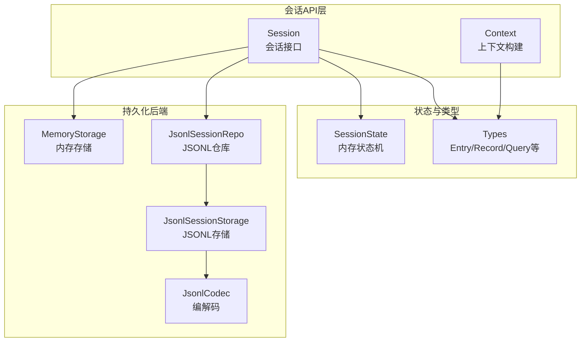
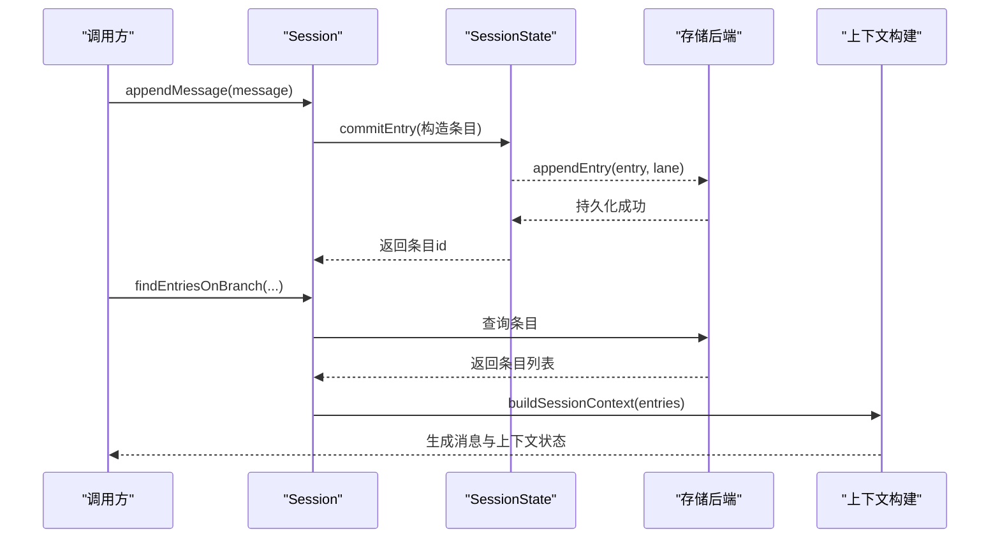
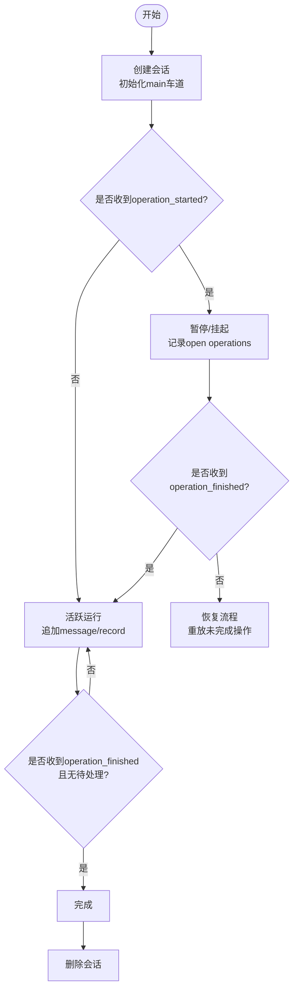
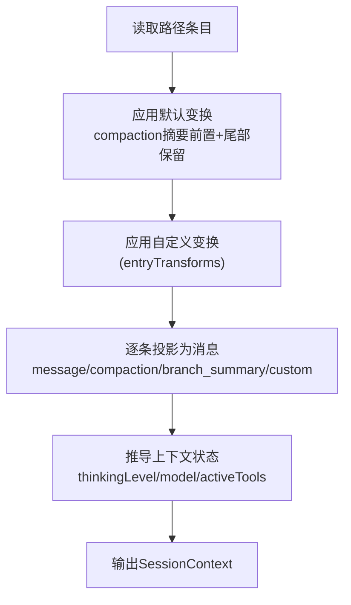
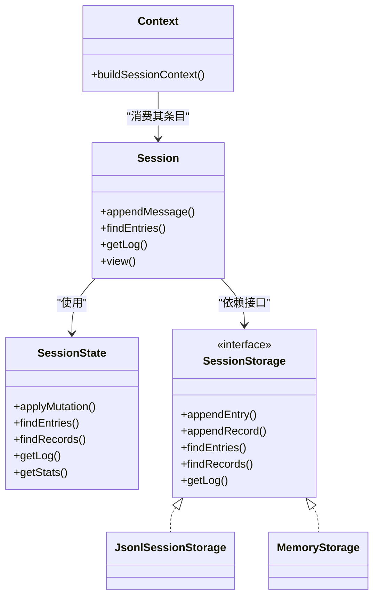

# 会话生命周期

<cite>
**本文引用的文件**
- [session.ts](file://packages/agent/src/harness/session/session.ts)
- [state.ts](file://packages/agent/src/harness/session/state.ts)
- [types.ts](file://packages/agent/src/harness/session/types.ts)
- [context.ts](file://packages/agent/src/harness/session/context.ts)
- [jsonl/storage.ts](file://packages/agent/src/harness/session/jsonl/storage.ts)
- [jsonl/repo.ts](file://packages/agent/src/harness/session/jsonl/repo.ts)
- [jsonl/codec.ts](file://packages/agent/src/harness/session/jsonl/codec.ts)
- [memory.ts](file://packages/agent/src/harness/session/memory.ts)
</cite>

## 目录
1. [简介](#简介)
2. [项目结构](#项目结构)
3. [核心组件](#核心组件)
4. [架构总览](#架构总览)
5. [详细组件分析](#详细组件分析)
6. [依赖关系分析](#依赖关系分析)
7. [性能考量](#性能考量)
8. [故障排查指南](#故障排查指南)
9. [结论](#结论)
10. [附录](#附录)

## 简介
本文件系统化阐述会话从创建到销毁的完整生命周期，覆盖初始化、活跃期管理、暂停与恢复、状态转换、上下文构建与维护、持久化策略（含增量更新与冲突处理）、监控与调试方法，以及最佳实践建议。内容基于仓库中会话子系统实现进行归纳与可视化说明，帮助读者理解并正确使用该能力。

## 项目结构
会话子系统位于 agent harness 模块下，围绕“会话树”组织数据：以“车道（lane）”为写入指针，支持分支与回溯；通过“条目（entry）”记录消息与事件，通过“记录（record）”记录操作元信息与用量统计；提供内存与 JSONL 两种存储后端；并通过上下文构建器将历史转换为模型可用的消息序列。

图表来源
- [session.ts:102-299](file://packages/agent/src/harness/session/session.ts#L102-L299)
- [state.ts:50-180](file://packages/agent/src/harness/session/state.ts#L50-L180)
- [types.ts:290-352](file://packages/agent/src/harness/session/types.ts#L290-L352)
- [jsonl/storage.ts:48-...](file://packages/agent/src/harness/session/jsonl/storage.ts#L48-L...)
- [jsonl/repo.ts:36-...](file://packages/agent/src/harness/session/jsonl/repo.ts#L36-L...)
- [jsonl/codec.ts:1-...](file://packages/agent/src/harness/session/jsonl/codec.ts#L1-L...)

章节来源
- [session.ts:102-299](file://packages/agent/src/harness/session/session.ts#L102-L299)
- [types.ts:290-352](file://packages/agent/src/harness/session/types.ts#L290-L352)

## 核心组件
- Session（会话接口）：对外暴露读写、查询、分支与日志能力，统一封装底层存储与状态。
- SessionState（内存状态机）：维护序列号、条目索引、记录、开放操作集合、车道指针、名称与标签、统计信息，并提供变更应用与查询。
- Context（上下文构建）：将路径上的条目转换为模型消息与上下文状态（思考级别、模型、工具集）。
- 存储后端：
  - MemoryStorage：进程内内存实现，便于测试与临时使用。
  - JsonlSessionStorage/Repo：基于 JSONL 文件的持久化实现，提供仓库级管理与单会话存储。
  - JsonlCodec：负责元数据与版本头编解码。

章节来源
- [session.ts:102-299](file://packages/agent/src/harness/session/session.ts#L102-L299)
- [state.ts:50-180](file://packages/agent/src/harness/session/state.ts#L50-L180)
- [context.ts:25-100](file://packages/agent/src/harness/session/context.ts#L25-L100)
- [memory.ts:17-...](file://packages/agent/src/harness/session/memory.ts#L17-L...)
- [jsonl/storage.ts:48-...](file://packages/agent/src/harness/session/jsonl/storage.ts#L48-L...)
- [jsonl/repo.ts:36-...](file://packages/agent/src/harness/session/jsonl/repo.ts#L36-L...)
- [jsonl/codec.ts:1-...](file://packages/agent/src/harness/session/jsonl/codec.ts#L1-L...)

## 架构总览
会话由“接口层-状态层-存储层”三层构成。上层通过 Session 调用 append/find/query 等方法；中间层 SessionState 保证一致性（序列号递增、ID 唯一、车道链式追加）；下层 Storage 负责落盘或内存缓存。上下文构建在读取侧，按路径回放并投影为消息。

图表来源
- [session.ts:178-299](file://packages/agent/src/harness/session/session.ts#L178-L299)
- [state.ts:97-180](file://packages/agent/src/harness/session/state.ts#L97-L180)
- [context.ts:59-100](file://packages/agent/src/harness/session/context.ts#L59-L100)

## 详细组件分析

### 会话状态与状态机
- 状态定义与约束
  - 序列号严格递增，任何变更必须满足 seq = previous + 1。
  - ID 全局唯一，重复会报错。
  - 条目追加需遵循车道叶子节点链式关系（parentId 指向当前 lane leaf）。
  - 记录用于描述操作生命周期与用量统计。
- 主要状态与转换
  - 新建：创建会话元数据与初始 main 车道。
  - 运行中：持续追加 message/custom 条目与 operation_started/finished 记录。
  - 暂停：出现 operation_started 且未收到对应 finished；恢复时依据 open operations 继续。
  - 完成：收到 operation_finished 且无更多待处理任务。
  - 删除：通过仓库 delete 接口移除会话。
- 关键验证
  - 查询参数校验（limit、cursor）。
  - 分支遍历检测环路与越界。
  - JSON 可序列化校验，防止不可持久化的对象进入存储。

图表来源
- [state.ts:97-180](file://packages/agent/src/harness/session/state.ts#L97-L180)
- [types.ts:87-212](file://packages/agent/src/harness/session/types.ts#L87-L212)

章节来源
- [state.ts:50-180](file://packages/agent/src/harness/session/state.ts#L50-L180)
- [types.ts:87-212](file://packages/agent/src/harness/session/types.ts#L87-L212)

### 会话上下文管理
- 上下文组成
  - messages：由路径上的 message、compaction、branch_summary 与 custom 投影生成的 AgentMessage 序列。
  - thinkingLevel、model、activeToolNames：从路径上最新的状态变更条目推导。
- 上下文窗口控制
  - 默认变换会将最近的 compaction 摘要前置，并保留尾部消息，从而在压缩后维持有效上下文窗口。
  - 可通过自定义 entryTransforms 与 entryProjectors 扩展上下文构建逻辑。
- 消息历史维护
  - 仅对 message 类型的条目直接投影为消息；其他类型作为上下文增强或摘要注入。
  - 对 stopReason=deferred 的消息不投影，避免向模型暴露未完成片段。

图表来源
- [context.ts:25-100](file://packages/agent/src/harness/session/context.ts#L25-L100)

章节来源
- [context.ts:25-100](file://packages/agent/src/harness/session/context.ts#L25-L100)

### 持久化策略与增量更新
- 存储后端
  - MemoryStorage：进程内数组/映射，适合测试与短期会话。
  - JsonlSessionStorage/Repo：基于 JSONL 文件，支持会话仓库管理、元数据与版本头。
- 增量写入
  - 所有变更以追加方式写入（appendEntry/appendRecord），保持顺序与幂等性。
  - 通过序列号与记录类型区分不同变更，支持增量回放与恢复。
- 冲突与一致性
  - 序列号严格递增，违反即视为无效变更。
  - ID 唯一性检查避免重复写入。
  - 分支追加强制链式关系，防止乱序与悬挂引用。
- 恢复机制
  - 通过查找未完成的 operation_started 记录，结合后续记录重建运行态，确保中断后可继续执行。

章节来源
- [jsonl/storage.ts:48-...](file://packages/agent/src/harness/session/jsonl/storage.ts#L48-L...)
- [jsonl/repo.ts:36-...](file://packages/agent/src/harness/session/jsonl/repo.ts#L36-L...)
- [jsonl/codec.ts:1-...](file://packages/agent/src/harness/session/jsonl/codec.ts#L1-L...)
- [state.ts:97-180](file://packages/agent/src/harness/session/state.ts#L97-L180)
- [types.ts:290-352](file://packages/agent/src/harness/session/types.ts#L290-L352)

### 监控与调试
- 日志与审计
  - 通过 getLog 获取包含 entry/record/lane/fact 的有序日志，支持 afterSeq 与 limit 分页。
- 指标收集
  - getStats 提供消息数、缓存/非缓存 token、总 token、成本累计等指标。
- 问题诊断
  - 使用 findOpenOperations 定位未完成的运行项，辅助判断卡死或异常中断。
  - 使用 findRecords 过滤特定 runId 或 operationKind 的记录，缩小问题范围。
  - 使用 getLabel/getName 快速识别会话与条目语义。

章节来源
- [state.ts:229-258](file://packages/agent/src/harness/session/state.ts#L229-L258)
- [types.ts:259-288](file://packages/agent/src/harness/session/types.ts#L259-L288)

### 最佳实践
- 会话复用
  - 同一会话内通过分支（createLane/moveLane）隔离实验，避免污染主分支。
  - 使用 view(lane) 获取只读视图，减少误写。
- 资源清理
  - 及时关闭或释放不再使用的会话实例；必要时调用仓库 delete 清理磁盘。
  - 合理设置上下文窗口，利用 compaction 与 branch_summary 控制消息规模。
- 错误处理模式
  - 捕获 SessionError 并按 code 分类处理（如 invalid_entry、invalid_lane、storage）。
  - 对 append 与 query 操作增加重试与限流保护，避免瞬时风暴。
  - 使用 afterSeq 增量拉取日志，降低带宽与解析开销。

章节来源
- [session.ts:115-224](file://packages/agent/src/harness/session/session.ts#L115-L224)
- [types.ts:375-393](file://packages/agent/src/harness/session/types.ts#L375-L393)

## 依赖关系分析
- 松耦合设计
  - Session 仅依赖 SessionStorage 接口，可替换内存或 JSONL 实现。
  - Context 仅依赖 Entry 类型与消息构造函数，解耦于具体存储。
- 内部依赖
  - SessionState 依赖 types 中的 Entry/Record/LanePointer 等类型。
  - JSONL 后端依赖 codec 进行元数据与版本头处理。

图表来源
- [session.ts:102-299](file://packages/agent/src/harness/session/session.ts#L102-L299)
- [state.ts:50-180](file://packages/agent/src/harness/session/state.ts#L50-L180)
- [types.ts:290-352](file://packages/agent/src/harness/session/types.ts#L290-L352)
- [context.ts:25-100](file://packages/agent/src/harness/session/context.ts#L25-L100)

章节来源
- [session.ts:102-299](file://packages/agent/src/harness/session/session.ts#L102-L299)
- [types.ts:290-352](file://packages/agent/src/harness/session/types.ts#L290-L352)

## 性能考量
- 写入路径优化
  - 批量追加时尽量合并小条目，减少锁竞争与 IO 次数。
  - 使用 afterSeq 增量拉取日志，避免全量扫描。
- 读取路径优化
  - 使用 findEntriesOnBranch 限制分支范围，配合 stopAtType/stopAtId 提前终止。
  - 合理使用 limit 与 order，减少不必要的数据传输。
- 上下文窗口控制
  - 启用 compaction 与 branch_summary，将长历史压缩为摘要+尾部消息，显著降低 token 消耗。
  - 自定义 entryTransforms 裁剪无关条目，进一步收紧上下文。
- 存储后端选择
  - 高频短会话优先内存后端；跨进程/跨重启场景使用 JSONL 后端。

[本节为通用指导，不直接分析具体文件]

## 故障排查指南
- 常见问题定位
  - 无法追加：检查 lane 是否存在、parentId 是否指向当前 lane leaf。
  - 查询为空：确认 afterSeq 与 order 是否正确；检查 limit 是否过小。
  - 运行卡住：使用 findOpenOperations 查看未完成的 operation_started。
- 诊断步骤
  - 获取日志：getLog(afterSeq, limit) 逐步回放变更。
  - 检查指标：getStats 观察 token 与成本变化是否异常。
  - 分支回溯：findEntriesOnBranch(start, stopAtType) 聚焦问题分支段。
- 常见错误码
  - not_found、already_exists、invalid_entry、invalid_lane、invalid_query、invalid_fork_target、storage。

章节来源
- [state.ts:97-180](file://packages/agent/src/harness/session/state.ts#L97-L180)
- [types.ts:375-393](file://packages/agent/src/harness/session/types.ts#L375-L393)

## 结论
该会话子系统以“会话树”为核心，通过严格的序列号与链式追加保证一致性与可恢复性；借助上下文构建器将历史高效转换为模型可用消息；提供内存与 JSONL 双后端以满足不同场景；内置日志与指标便于监控与排障。遵循本文的最佳实践，可在高并发与长会话场景中稳定运行并有效控制成本。

[本节为总结性内容，不直接分析具体文件]

## 附录
- 术语表
  - 会话（Session）：一次对话或任务的完整上下文载体。
  - 车道（Lane）：会话内的写入指针，支持多分支。
  - 条目（Entry）：会话中的消息或事件记录。
  - 记录（Record）：操作元数据与用量统计。
  - 上下文（Context）：由条目投影而成的模型输入与状态。
- 参考路径
  - 会话接口与实现：[session.ts](file://packages/agent/src/harness/session/session.ts)
  - 状态机与查询：[state.ts](file://packages/agent/src/harness/session/state.ts)
  - 类型定义：[types.ts](file://packages/agent/src/harness/session/types.ts)
  - 上下文构建：[context.ts](file://packages/agent/src/harness/session/context.ts)
  - JSONL 持久化：[jsonl/storage.ts](file://packages/agent/src/harness/session/jsonl/storage.ts)、[jsonl/repo.ts](file://packages/agent/src/harness/session/jsonl/repo.ts)、[jsonl/codec.ts](file://packages/agent/src/harness/session/jsonl/codec.ts)
  - 内存实现：[memory.ts](file://packages/agent/src/harness/session/memory.ts)

[本节为补充信息，不直接分析具体文件]