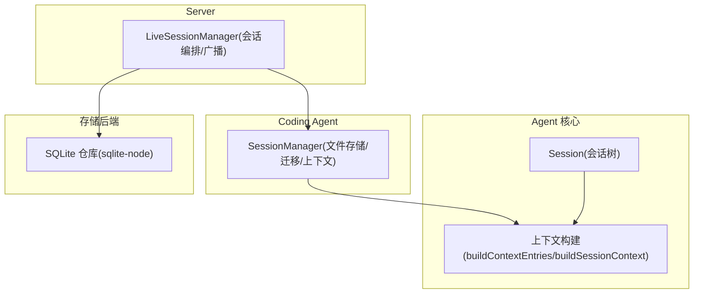
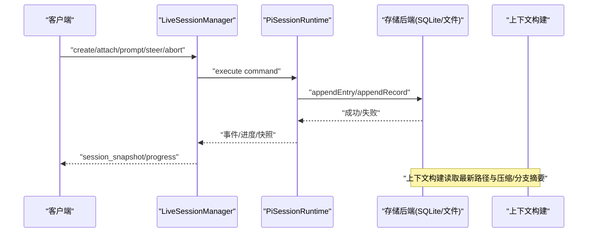
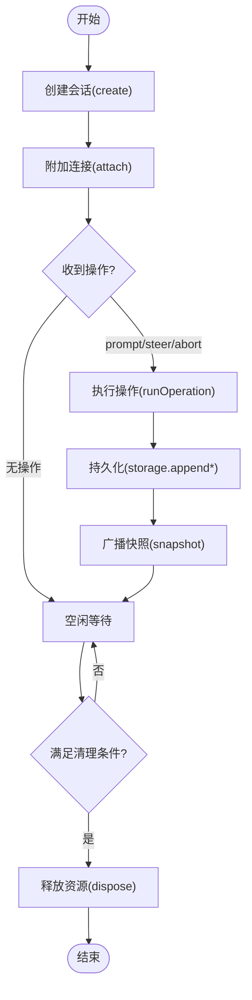
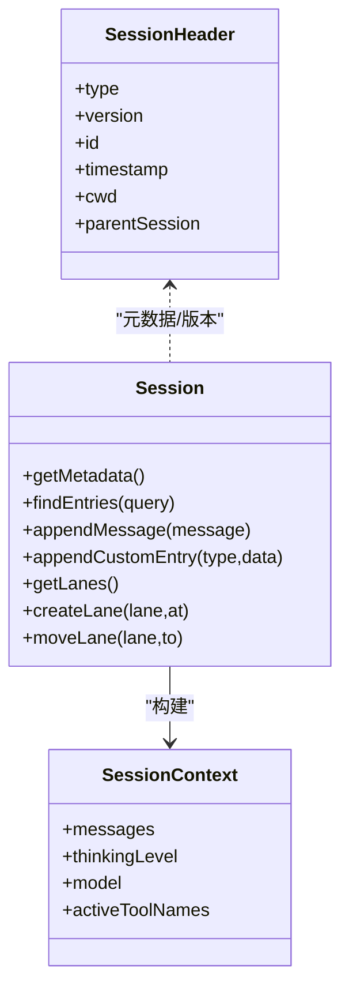
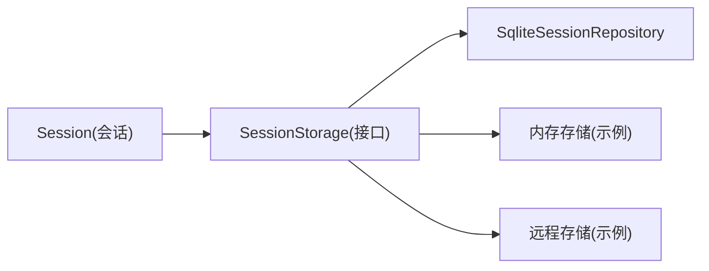
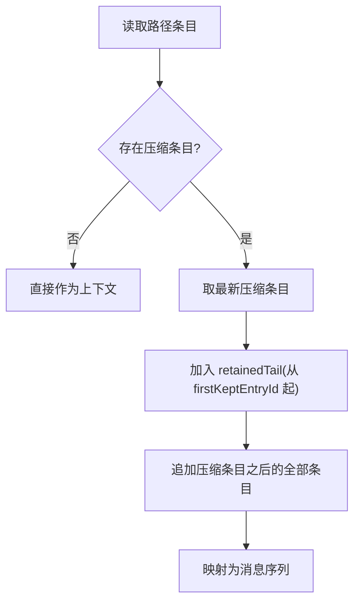
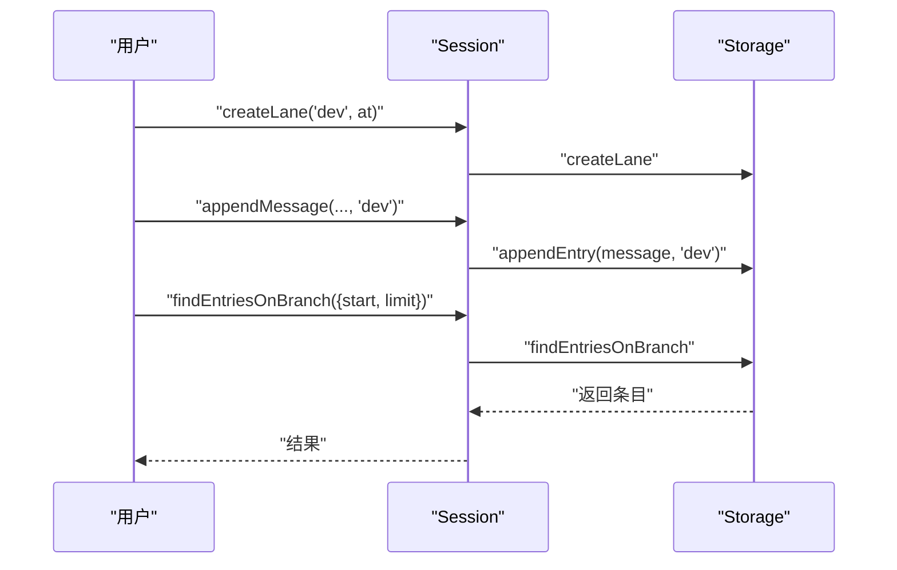
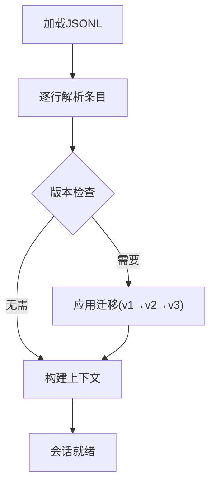
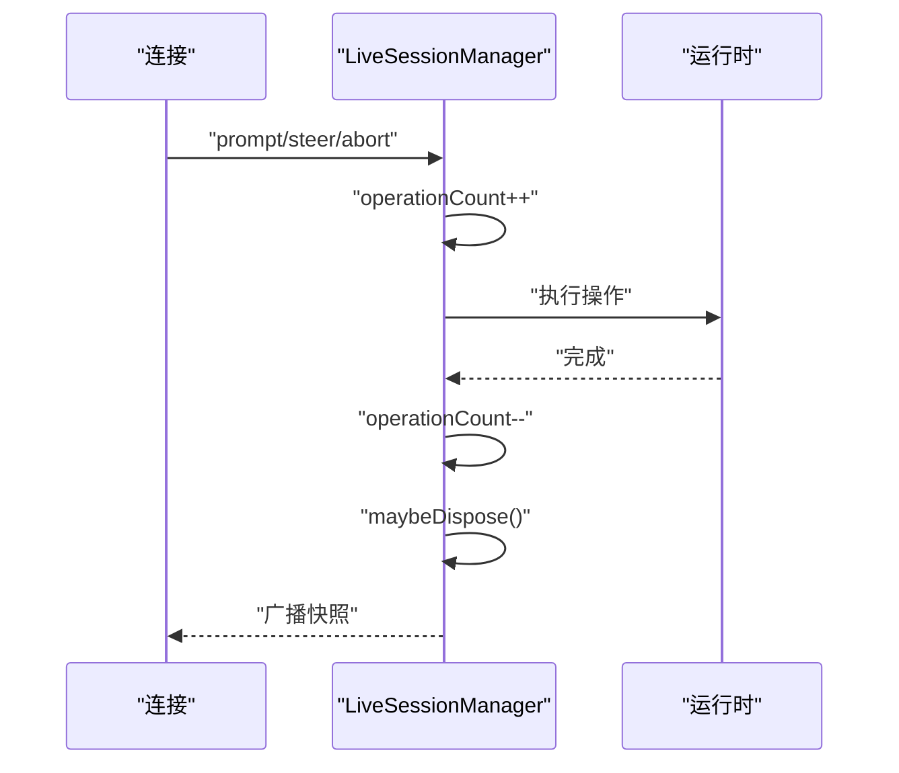
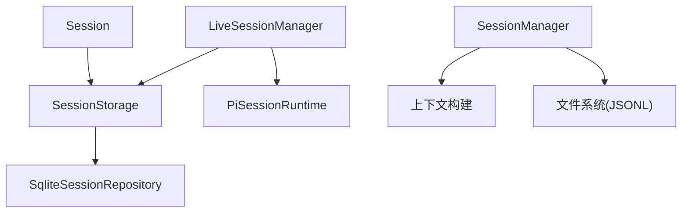

# 会话管理

<cite>
**本文引用的文件**
- [packages/agent/src/harness/session/session.ts](file://packages/agent/src/harness/session/session.ts)
- [packages/agent/src/harness/session/context.ts](file://packages/agent/src/harness/session/context.ts)
- [packages/coding-agent/src/core/session-manager.ts](file://packages/coding-agent/src/core/session-manager.ts)
- [packages/server/src/sessions.ts](file://packages/server/src/sessions.ts)
- [packages/session-backends/sqlite-node/README.md](file://packages/session-backends/sqlite-node/README.md)
</cite>

## 目录
1. [简介](#简介)
2. [项目结构](#项目结构)
3. [核心组件](#核心组件)
4. [架构总览](#架构总览)
5. [详细组件分析](#详细组件分析)
6. [依赖关系分析](#依赖关系分析)
7. [性能考量](#性能考量)
8. [故障排查指南](#故障排查指南)
9. [结论](#结论)
10. [附录](#附录)

## 简介
本文件面向“会话管理系统”的完整技术文档，覆盖会话生命周期（创建、更新、保存、恢复、清理）、数据结构（消息历史、上下文信息、元数据管理）、存储后端（SQLite、内存、远程等）与实现特点、长对话中的上下文压缩策略、分支摘要功能、持久化配置与性能调优、迁移与备份恢复、并发访问控制与一致性保证。内容基于仓库中会话核心实现与服务层代码进行梳理与归纳。

## 项目结构
- 会话核心接口与树形操作：位于 agent harness session 模块，提供 Session 类与上下文构建能力。
- 编码代理侧会话管理：coding-agent 提供本地 JSONL 文件存储、会话迁移、上下文构建、分支与压缩处理。
- 服务端会话编排：server 层提供 LiveSessionManager，负责会话创建、附加、命令执行、快照广播与生命周期管理。
- SQLite 后端：session-backends/sqlite-node 提供 Node sqlite 适配器、仓库、迁移与 FTS 搜索。

图表来源
- [packages/agent/src/harness/session/session.ts:102-299](file://packages/agent/src/harness/session/session.ts#L102-L299)
- [packages/agent/src/harness/session/context.ts:45-100](file://packages/agent/src/harness/session/context.ts#L45-L100)
- [packages/coding-agent/src/core/session-manager.ts:418-470](file://packages/coding-agent/src/core/session-manager.ts#L418-L470)
- [packages/server/src/sessions.ts:38-120](file://packages/server/src/sessions.ts#L38-L120)
- [packages/session-backends/sqlite-node/README.md:1-16](file://packages/session-backends/sqlite-node/README.md#L1-L16)

章节来源
- [packages/agent/src/harness/session/session.ts:102-299](file://packages/agent/src/harness/session/session.ts#L102-L299)
- [packages/agent/src/harness/session/context.ts:45-100](file://packages/agent/src/harness/session/context.ts#L45-L100)
- [packages/coding-agent/src/core/session-manager.ts:418-470](file://packages/coding-agent/src/core/session-manager.ts#L418-L470)
- [packages/server/src/sessions.ts:38-120](file://packages/server/src/sessions.ts#L38-L120)
- [packages/session-backends/sqlite-node/README.md:1-16](file://packages/session-backends/sqlite-node/README.md#L1-L16)

## 核心组件
- 会话树与会话对象
  - Session 类封装了会话树操作：追加消息/自定义条目、查询条目/记录、分支（lane）管理、标签与名称、统计信息等。所有写操作均通过 storage 抽象落盘或入队。
- 上下文构建
  - 将路径上的 Entry 转换为 LLM 可用的消息序列；支持压缩（compaction）与分支摘要（branch_summary），并提取模型、思考级别、活跃工具等上下文状态。
- 编码代理会话管理器
  - 基于 JSONL 文件的本地会话存储：解析/写入条目、构建会话路径、上下文构建、迁移（v1→v2→v3）、最近会话发现、并发加载会话信息等。
- 服务端会话编排
  - LiveSessionManager 统一处理 create/attach/detach/prompt/steer/abort/set_model/set_thinking 等命令，维护 live sessions，广播快照，管理资源释放。

章节来源
- [packages/agent/src/harness/session/session.ts:102-299](file://packages/agent/src/harness/session/session.ts#L102-L299)
- [packages/agent/src/harness/session/context.ts:45-100](file://packages/agent/src/harness/session/context.ts#L45-L100)
- [packages/coding-agent/src/core/session-manager.ts:230-296](file://packages/coding-agent/src/core/session-manager.ts#L230-L296)
- [packages/coding-agent/src/core/session-manager.ts:418-470](file://packages/coding-agent/src/core/session-manager.ts#L418-L470)
- [packages/server/src/sessions.ts:38-120](file://packages/server/src/sessions.ts#L38-L120)

## 架构总览
下图展示了从客户端到服务端的会话请求流，以及会话在存储后端的持久化过程。

图表来源
- [packages/server/src/sessions.ts:47-120](file://packages/server/src/sessions.ts#L47-L120)
- [packages/agent/src/harness/session/session.ts:178-299](file://packages/agent/src/harness/session/session.ts#L178-L299)
- [packages/agent/src/harness/session/context.ts:59-100](file://packages/agent/src/harness/session/context.ts#L59-L100)

## 详细组件分析

### 会话生命周期：创建、更新、保存、恢复、清理
- 创建
  - 服务端通过 create 命令生成唯一 id，调用 service.createSession 初始化运行时，随后 attach 连接并广播初始快照。
- 更新
  - prompt/steer/abort/set_model/set_thinking 等操作通过 runOperation 串行化执行，完成后广播最新快照。
- 保存
  - 会话写入由底层 storage 完成（如 SQLite 仓库或 JSONL 文件）。Session 类对写入前进行 JSON 可序列化校验。
- 恢复
  - 通过 openSession/attach 重新获取运行时快照，或从文件加载会话条目并重建上下文。
- 清理
  - maybeDispose 在无连接且空闲时释放运行时资源；服务器关闭时批量 dispose。

图表来源
- [packages/server/src/sessions.ts:47-120](file://packages/server/src/sessions.ts#L47-L120)
- [packages/server/src/sessions.ts:171-184](file://packages/server/src/sessions.ts#L171-L184)
- [packages/server/src/sessions.ts:320-345](file://packages/server/src/sessions.ts#L320-L345)
- [packages/agent/src/harness/session/session.ts:286-299](file://packages/agent/src/harness/session/session.ts#L286-L299)

章节来源
- [packages/server/src/sessions.ts:47-120](file://packages/server/src/sessions.ts#L47-L120)
- [packages/server/src/sessions.ts:171-184](file://packages/server/src/sessions.ts#L171-L184)
- [packages/server/src/sessions.ts:320-345](file://packages/server/src/sessions.ts#L320-L345)
- [packages/agent/src/harness/session/session.ts:286-299](file://packages/agent/src/harness/session/session.ts#L286-L299)

### 会话数据结构：消息历史、上下文信息、元数据管理
- 消息历史
  - 以 Entry 形式追加（message/custom/compaction/branch_summary 等），支持按 lane 分支与游标分页查询。
- 上下文信息
  - 通过 buildSessionContext 聚合 thinkingLevel、model、activeToolNames 及转换后的 messages。
- 元数据管理
  - 名称、标签、统计信息通过 storage 抽象存取；服务端快照包含 id、时间戳、cwd、name 等。

图表来源
- [packages/agent/src/harness/session/session.ts:102-299](file://packages/agent/src/harness/session/session.ts#L102-L299)
- [packages/agent/src/harness/session/context.ts:5-100](file://packages/agent/src/harness/session/context.ts#L5-L100)
- [packages/coding-agent/src/core/session-manager.ts:32-156](file://packages/coding-agent/src/core/session-manager.ts#L32-L156)

章节来源
- [packages/agent/src/harness/session/session.ts:102-299](file://packages/agent/src/harness/session/session.ts#L102-L299)
- [packages/agent/src/harness/session/context.ts:5-100](file://packages/agent/src/harness/session/context.ts#L5-L100)
- [packages/coding-agent/src/core/session-manager.ts:32-156](file://packages/coding-agent/src/core/session-manager.ts#L32-L156)

### 存储后端：SQLite、内存存储、远程存储
- SQLite（Node）
  - 提供 SqliteDatabase 实现、仓库、迁移与可选 FTS 搜索；仓库懒加载共享数据库连接，搜索为只读投影。
- 内存存储
  - 可通过实现 SessionStorage 接口在内存中缓存会话条目与记录，适合测试或临时会话。
- 远程存储
  - 通过抽象 SessionStorage 适配远程服务（例如网络 RPC），将 append/find 等调用转发至远端。

图表来源
- [packages/agent/src/harness/session/session.ts:102-299](file://packages/agent/src/harness/session/session.ts#L102-L299)
- [packages/session-backends/sqlite-node/README.md:1-16](file://packages/session-backends/sqlite-node/README.md#L1-L16)

章节来源
- [packages/session-backends/sqlite-node/README.md:1-16](file://packages/session-backends/sqlite-node/README.md#L1-L16)
- [packages/agent/src/harness/session/session.ts:102-299](file://packages/agent/src/harness/session/session.ts#L102-L299)

### 上下文压缩策略：长对话中的性能与准确性
- 压缩条目（compaction）
  - 将早期历史压缩为摘要，保留首条保留条目之后的部分与压缩后新增条目，减少上下文长度。
- 分支摘要（branch_summary）
  - 对分支路径生成摘要并插入上下文，避免重复展开分支历史。
- 构建流程
  - 先定位最新 compaction，再拼接 retainedTail 与后续条目，最后映射为消息。

图表来源
- [packages/agent/src/harness/session/context.ts:45-100](file://packages/agent/src/harness/session/context.ts#L45-L100)
- [packages/coding-agent/src/core/session-manager.ts:418-470](file://packages/coding-agent/src/core/session-manager.ts#L418-L470)

章节来源
- [packages/agent/src/harness/session/context.ts:45-100](file://packages/agent/src/harness/session/context.ts#L45-L100)
- [packages/coding-agent/src/core/session-manager.ts:418-470](file://packages/coding-agent/src/core/session-manager.ts#L418-L470)

### 分支摘要功能：管理与合并对话分支
- 分支（lane）
  - 会话支持多 lane，可在指定位置创建分支，并在分支上追加条目。
- 分支摘要
  - 在分支路径上生成 branch_summary 条目，用于上下文展示与合并，避免全量展开分支历史。
- 查询
  - findEntriesOnBranch/findEntryOnBranch 支持限定 start 与范围，结合游标分页。

图表来源
- [packages/agent/src/harness/session/session.ts:186-254](file://packages/agent/src/harness/session/session.ts#L186-L254)
- [packages/agent/src/harness/session/context.ts:81-83](file://packages/agent/src/harness/session/context.ts#L81-L83)

章节来源
- [packages/agent/src/harness/session/session.ts:186-254](file://packages/agent/src/harness/session/session.ts#L186-L254)
- [packages/agent/src/harness/session/context.ts:81-83](file://packages/agent/src/harness/session/context.ts#L81-L83)

### 持久化配置与性能调优建议
- 文件读取缓冲与扫描限制
  - 会话文件采用行式 JSONL 流式读取，限制头部扫描字节数以避免大文件阻塞。
- 并发加载
  - 会话信息构建支持并发上限，提升列表加载速度。
- 索引与视图
  - SQLite 后端可使用物化视图与 FTS 提升查询效率。
- 写入优化
  - 使用事务批量写入（由存储后端实现保障）；避免频繁小写。
- 上下文裁剪
  - 合理设置压缩阈值与 retainedTail 长度，平衡上下文长度与质量。

章节来源
- [packages/coding-agent/src/core/session-manager.ts:491-613](file://packages/coding-agent/src/core/session-manager.ts#L491-L613)
- [packages/coding-agent/src/core/session-manager.ts:769-800](file://packages/coding-agent/src/core/session-manager.ts#L769-L800)
- [packages/session-backends/sqlite-node/README.md:1-16](file://packages/session-backends/sqlite-node/README.md#L1-L16)

### 会话迁移与备份恢复
- 迁移
  - v1→v2：添加 id/parentId 树结构与 firstKeptEntryId；v2→v3：重命名 hookMessage role 为 custom。
- 备份
  - 会话文件为 JSONL，可直接复制备份；服务端快照可用于导出元数据。
- 恢复
  - 通过 loadEntriesFromFile 解析文件，migrateToCurrentVersion 升级至当前版本，再重建上下文。

图表来源
- [packages/coding-agent/src/core/session-manager.ts:230-296](file://packages/coding-agent/src/core/session-manager.ts#L230-L296)
- [packages/coding-agent/src/core/session-manager.ts:514-556](file://packages/coding-agent/src/core/session-manager.ts#L514-L556)

章节来源
- [packages/coding-agent/src/core/session-manager.ts:230-296](file://packages/coding-agent/src/core/session-manager.ts#L230-L296)
- [packages/coding-agent/src/core/session-manager.ts:514-556](file://packages/coding-agent/src/core/session-manager.ts#L514-L556)

### 并发访问控制与数据一致性保证
- 服务端并发
  - LiveSessionManager 使用 Map/Set 维护 liveSessions 与 connections，runOperation 在操作前后计数，确保同一会话的操作顺序与资源安全释放。
- 会话锁定
  - 打开/附加过程中使用 openingSessions 去重，避免重复初始化；终止态会话拒绝新操作。
- 数据一致性
  - 写入前进行 JSON 可序列化校验；存储后端负责原子性（如 SQLite 事务）；快照广播保证客户端一致视图。

图表来源
- [packages/server/src/sessions.ts:171-184](file://packages/server/src/sessions.ts#L171-L184)
- [packages/server/src/sessions.ts:186-207](file://packages/server/src/sessions.ts#L186-L207)
- [packages/server/src/sessions.ts:320-345](file://packages/server/src/sessions.ts#L320-L345)
- [packages/agent/src/harness/session/session.ts:42-100](file://packages/agent/src/harness/session/session.ts#L42-L100)

章节来源
- [packages/server/src/sessions.ts:171-184](file://packages/server/src/sessions.ts#L171-L184)
- [packages/server/src/sessions.ts:186-207](file://packages/server/src/sessions.ts#L186-L207)
- [packages/server/src/sessions.ts:320-345](file://packages/server/src/sessions.ts#L320-L345)
- [packages/agent/src/harness/session/session.ts:42-100](file://packages/agent/src/harness/session/session.ts#L42-L100)

## 依赖关系分析
- Session 依赖 SessionStorage 抽象，解耦具体存储实现。
- Coding Agent 的 SessionManager 依赖文件系统与 JSONL 格式，提供迁移与上下文构建。
- Server 的 LiveSessionManager 依赖 PiSessionRuntime 与存储服务，负责命令路由与快照广播。
- SQLite 后端提供仓库与搜索能力，可作为 SessionStorage 的具体实现之一。

图表来源
- [packages/agent/src/harness/session/session.ts:102-299](file://packages/agent/src/harness/session/session.ts#L102-L299)
- [packages/coding-agent/src/core/session-manager.ts:418-470](file://packages/coding-agent/src/core/session-manager.ts#L418-L470)
- [packages/server/src/sessions.ts:38-120](file://packages/server/src/sessions.ts#L38-L120)
- [packages/session-backends/sqlite-node/README.md:1-16](file://packages/session-backends/sqlite-node/README.md#L1-L16)

章节来源
- [packages/agent/src/harness/session/session.ts:102-299](file://packages/agent/src/harness/session/session.ts#L102-L299)
- [packages/coding-agent/src/core/session-manager.ts:418-470](file://packages/coding-agent/src/core/session-manager.ts#L418-L470)
- [packages/server/src/sessions.ts:38-120](file://packages/server/src/sessions.ts#L38-L120)
- [packages/session-backends/sqlite-node/README.md:1-16](file://packages/session-backends/sqlite-node/README.md#L1-L16)

## 性能考量
- 流式读取与头部扫描限制，避免大文件导致阻塞。
- 会话信息构建并发上限，提高列表响应速度。
- SQLite 物化视图与 FTS 加速检索。
- 上下文压缩与分支摘要降低 LLM 输入长度，提升吞吐与成本效益。
- 写入批量化与事务提交减少磁盘 IO 次数。

[本节为通用指导，不直接分析具体文件]

## 故障排查指南
- 会话头过大
  - 当会话头超过扫描限制时会抛出异常，需检查是否有异常大的元数据字段。
- 无效会话
  - 若首个条目非 session 或缺少 id，将被视为无效会话，忽略该文件。
- 连接断开
  - 附加会话时若连接已断开，会抛出错误并尝试清理资源。
- 未附加操作
  - 对未附加的连接执行操作将报错，需先 attach。

章节来源
- [packages/coding-agent/src/core/session-manager.ts:496-513](file://packages/coding-agent/src/core/session-manager.ts#L496-L513)
- [packages/coding-agent/src/core/session-manager.ts:548-556](file://packages/coding-agent/src/core/session-manager.ts#L548-L556)
- [packages/server/src/sessions.ts:300-318](file://packages/server/src/sessions.ts#L300-L318)

## 结论
本系统通过清晰的会话树抽象、灵活的上下文构建机制与可扩展的存储后端，实现了高内聚、低耦合的会话管理能力。服务端编排保证了并发安全与一致性，配合压缩与分支摘要有效应对长对话场景。SQLite 后端提供了高性能与可搜索能力，便于生产部署。建议在长对话中合理配置压缩策略，并结合事务与视图优化读写性能。

[本节为总结，不直接分析具体文件]

## 附录
- 常用 API 参考
  - 会话树：appendMessage/findEntries/getLanes/createLane/moveLane
  - 上下文：buildSessionContext/buildContextEntries/sessionEntryToContextMessages
  - 服务端：create/attach/detach/prompt/steer/abort/set_model/set_thinking/list
- 最佳实践
  - 使用事务批量写入；定期归档旧会话；监控上下文长度与压缩命中率；为高频查询建立视图或索引。

[本节为补充说明，不直接分析具体文件]