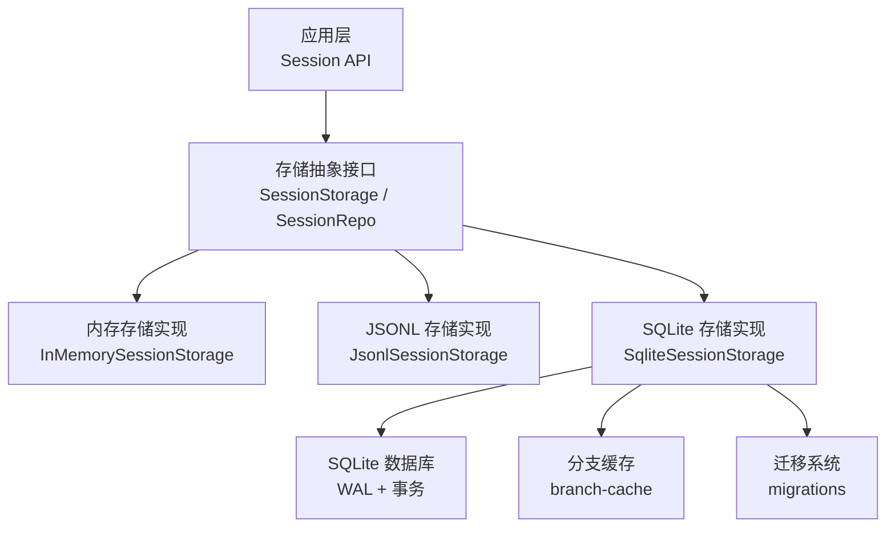
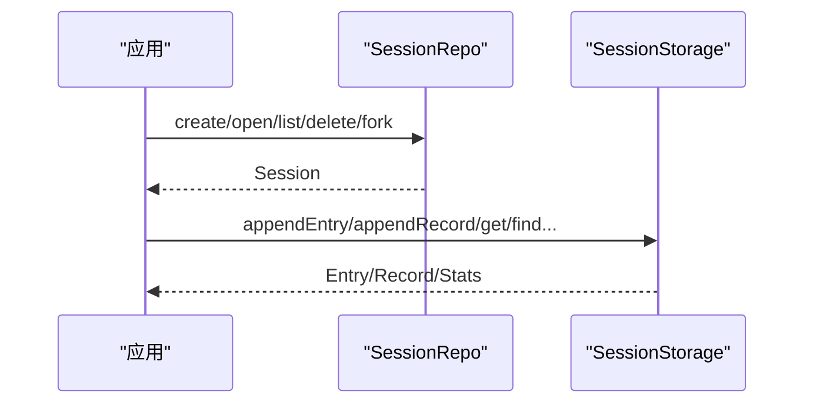
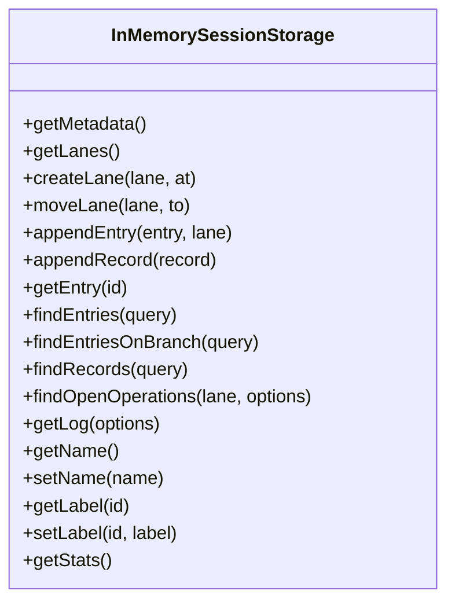
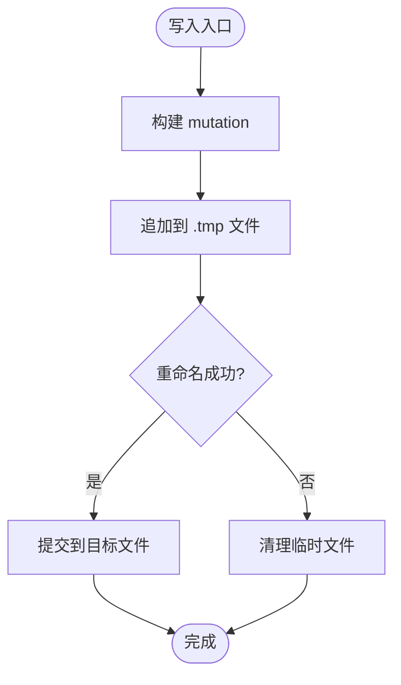
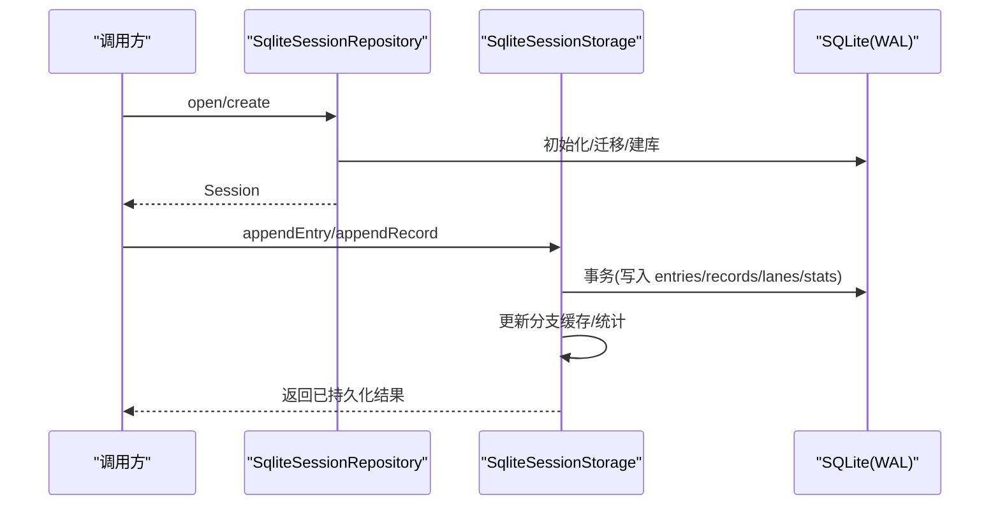
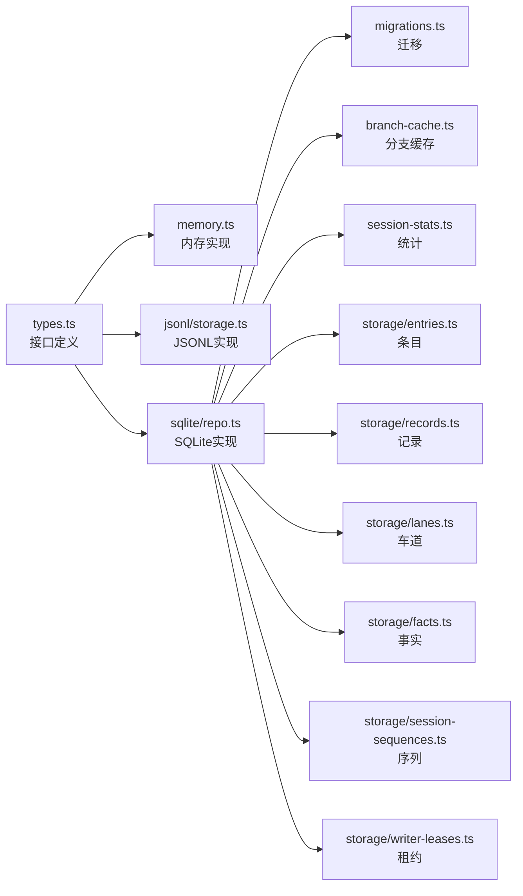

# 存储后端

<cite>
**本文引用的文件**
- [packages/agent/src/harness/session/types.ts](file://packages/agent/src/harness/session/types.ts)
- [packages/agent/src/harness/session/memory.ts](file://packages/agent/src/harness/session/memory.ts)
- [packages/agent/src/harness/session/jsonl/storage.ts](file://packages/agent/src/harness/session/jsonl/storage.ts)
- [packages/session-backends/sqlite-node/src/sqlite/repo.ts](file://packages/session-backends/sqlite-node/src/sqlite/repo.ts)
- [packages/session-backends/sqlite-node/src/sqlite/migrations.ts](file://packages/session-backends/sqlite-node/src/sqlite/migrations.ts)
- [packages/session-backends/sqlite-node/README.md](file://packages/session-backends/sqlite-node/README.md)
</cite>

## 目录
1. [简介](#简介)
2. [项目结构](#项目结构)
3. [核心组件](#核心组件)
4. [架构总览](#架构总览)
5. [详细组件分析](#详细组件分析)
6. [依赖关系分析](#依赖关系分析)
7. [性能考量](#性能考量)
8. [故障恢复与备份恢复](#故障恢复与备份恢复)
9. [自定义存储后端开发指南](#自定义存储后端开发指南)
10. [结论](#结论)

## 简介
本文件面向“会话存储后端”的完整技术文档，覆盖以下主题：
- 支持的存储类型：SQLite、内存存储、JSONL（持久化日志）的实现原理与对比
- 配置方法、连接参数、性能特征与适用场景
- 数据存储格式：消息结构、元数据组织、索引设计
- 迁移机制：版本升级与数据兼容性
- 性能调优：连接池、查询优化、缓存策略
- 并发访问控制：锁机制、事务管理、一致性保证
- 故障恢复与备份恢复操作步骤
- 自定义存储后端的接口规范与实现要点

## 项目结构
仓库中与存储后端相关的代码主要分布在以下位置：
- 会话抽象与通用接口定义：packages/agent/src/harness/session/types.ts
- 内存存储实现：packages/agent/src/harness/session/memory.ts
- JSONL 持久化存储实现：packages/agent/src/harness/session/jsonl/storage.ts
- SQLite 存储实现（Node 端）：packages/session-backends/sqlite-node/src/sqlite/repo.ts
- SQLite 迁移脚本加载与执行：packages/session-backends/sqlite-node/src/sqlite/migrations.ts
- SQLite 包说明：packages/session-backends/sqlite-node/README.md

图表来源
- [packages/agent/src/harness/session/types.ts:290-373](file://packages/agent/src/harness/session/types.ts#L290-L373)
- [packages/agent/src/harness/session/memory.ts:25-146](file://packages/agent/src/harness/session/memory.ts#L25-L146)
- [packages/agent/src/harness/session/jsonl/storage.ts:48-278](file://packages/agent/src/harness/session/jsonl/storage.ts#L48-L278)
- [packages/session-backends/sqlite-node/src/sqlite/repo.ts:345-800](file://packages/session-backends/sqlite-node/src/sqlite/repo.ts#L345-L800)
- [packages/session-backends/sqlite-node/src/sqlite/migrations.ts:1-50](file://packages/session-backends/sqlite-node/src/sqlite/migrations.ts#L1-L50)

章节来源
- [packages/agent/src/harness/session/types.ts:290-373](file://packages/agent/src/harness/session/types.ts#L290-L373)
- [packages/session-backends/sqlite-node/README.md:1-16](file://packages/session-backends/sqlite-node/README.md#L1-L16)

## 核心组件
- 存储抽象接口
  - SessionStorage：会话级读写接口，包含 lanes、entries、records、facts、stats 等能力
  - SessionRepo：会话仓库，负责创建、打开、列举、删除、fork 会话
- 具体实现
  - InMemorySessionStorage：进程内内存状态，适合测试与临时使用
  - JsonlSessionStorage：基于 JSON Lines 文件的追加式日志，支持原子发布与尾部修复
  - SqliteSessionStorage：基于 SQLite 的关系型存储，具备 WAL、事务、序列号、分支缓存、统计等

章节来源
- [packages/agent/src/harness/session/types.ts:290-373](file://packages/agent/src/harness/session/types.ts#L290-L373)
- [packages/agent/src/harness/session/memory.ts:25-146](file://packages/agent/src/harness/session/memory.ts#L25-L146)
- [packages/agent/src/harness/session/jsonl/storage.ts:48-278](file://packages/agent/src/harness/session/jsonl/storage.ts#L48-L278)
- [packages/session-backends/sqlite-node/src/sqlite/repo.ts:345-800](file://packages/session-backends/sqlite-node/src/sqlite/repo.ts#L345-L800)

## 架构总览
存储后端通过统一的抽象接口屏蔽底层差异。上层通过 SessionRepo 获取 Session，再调用 SessionStorage 进行读写。不同后端在并发、持久性、查询能力上各有侧重：
- 内存存储：无持久化，单进程串行，适合单元测试
- JSONL：顺序追加写，读时回放或维护状态，适合轻量持久化
- SQLite：强一致、事务、WAL、索引、统计、分支缓存，适合生产环境

图表来源
- [packages/agent/src/harness/session/types.ts:290-373](file://packages/agent/src/harness/session/types.ts#L290-L373)
- [packages/session-backends/sqlite-node/src/sqlite/repo.ts:681-800](file://packages/session-backends/sqlite-node/src/sqlite/repo.ts#L681-L800)

## 详细组件分析

### 数据模型与存储格式
- 条目（Entry）：消息、模型变更、思考级别变更、工具变更、压缩摘要、分支摘要、自定义条目等
- 记录（LaneRecord）：操作开始/结束、步骤尝试、工具调用、队列入队/取消、延迟写入、用量统计等
- 元数据（SessionMetadata）：会话 ID、创建时间、父会话 ID
- 事实（Facts）：名称、标签等全局事实
- 统计（SessionStats）：消息数、token 用量、成本等

这些结构由统一接口定义，各后端以各自方式持久化：
- 内存：对象图与状态机
- JSONL：每行一个 mutation，头部包含元数据
- SQLite：多表（sessions、entries、records、lanes、facts、stats、sequences、writer_leases 等），并通过视图/缓存加速读取

章节来源
- [packages/agent/src/harness/session/types.ts:14-271](file://packages/agent/src/harness/session/types.ts#L14-L271)
- [packages/agent/src/harness/session/jsonl/storage.ts:48-120](file://packages/agent/src/harness/session/jsonl/storage.ts#L48-L120)
- [packages/session-backends/sqlite-node/src/sqlite/repo.ts:198-302](file://packages/session-backends/sqlite-node/src/sqlite/repo.ts#L198-L302)

### 内存存储（InMemorySessionStorage）
- 特点
  - 无持久化，进程重启丢失
  - 单线程顺序写入，简单可靠
  - 提供 fork 能力，按选项复制状态
- 适用场景
  - 单元测试、快速原型、无需持久化的调试

图表来源
- [packages/agent/src/harness/session/memory.ts:25-146](file://packages/agent/src/harness/session/memory.ts#L25-L146)

章节来源
- [packages/agent/src/harness/session/memory.ts:25-146](file://packages/agent/src/harness/session/memory.ts#L25-L146)

### JSONL 存储（JsonlSessionStorage）
- 特点
  - 以 JSON Lines 形式追加写入，文件头部为元数据
  - 原子发布：先写临时文件再重命名，避免部分写入
  - 尾部修复：遇到损坏的最后一行，自动回滚到有效前缀并补换行符
- 适用场景
  - 需要轻量持久化、可审计的日志式存储
  - 跨进程共享只读副本（通过拷贝文件）

图表来源
- [packages/agent/src/harness/session/jsonl/storage.ts:33-46](file://packages/agent/src/harness/session/jsonl/storage.ts#L33-L46)
- [packages/agent/src/harness/session/jsonl/storage.ts:267-272](file://packages/agent/src/harness/session/jsonl/storage.ts#L267-L272)

章节来源
- [packages/agent/src/harness/session/jsonl/storage.ts:48-278](file://packages/agent/src/harness/session/jsonl/storage.ts#L48-L278)

### SQLite 存储（SqliteSessionStorage）
- 特点
  - 使用 WAL 模式、FULL 同步、busy_timeout 提升并发与稳定性
  - 序列号（sequence）保证全局有序
  - 分支缓存（branch cache）加速分支读取
  - 统计（stats）增量更新消息数、token、成本
  - 写租约（writer lease）+ 心跳保活，防止多写冲突
- 适用场景
  - 高并发、强一致、复杂查询的生产环境

图表来源
- [packages/session-backends/sqlite-node/src/sqlite/repo.ts:172-176](file://packages/session-backends/sqlite-node/src/sqlite/repo.ts#L172-L176)
- [packages/session-backends/sqlite-node/src/sqlite/repo.ts:468-527](file://packages/session-backends/sqlite-node/src/sqlite/repo.ts#L468-L527)
- [packages/session-backends/sqlite-node/src/sqlite/repo.ts:681-800](file://packages/session-backends/sqlite-node/src/sqlite/repo.ts#L681-L800)

章节来源
- [packages/session-backends/sqlite-node/src/sqlite/repo.ts:172-176](file://packages/session-backends/sqlite-node/src/sqlite/repo.ts#L172-L176)
- [packages/session-backends/sqlite-node/src/sqlite/repo.ts:345-800](file://packages/session-backends/sqlite-node/src/sqlite/repo.ts#L345-L800)

### 配置方法与连接参数
- SQLite 仓库选项
  - env：文件系统与环境能力
  - sqlite：数据库工厂
  - databasePath：数据库路径
  - writerLease：写租约 TTL 与心跳间隔
- 运行时行为
  - 自动启用 WAL、FULL 同步、busy_timeout
  - 懒加载数据库连接，复用单一连接
  - 列表操作不获取写租约，仅读取会话目录

章节来源
- [packages/session-backends/sqlite-node/src/sqlite/repo.ts:95-122](file://packages/session-backends/sqlite-node/src/sqlite/repo.ts#L95-L122)
- [packages/session-backends/sqlite-node/src/sqlite/repo.ts:172-176](file://packages/session-backends/sqlite-node/src/sqlite/repo.ts#L172-L176)
- [packages/session-backends/sqlite-node/README.md:1-16](file://packages/session-backends/sqlite-node/README.md#L1-L16)

### 索引设计与查询优化
- 序列号（seq）：全局单调递增，用于排序与游标分页
- 分支缓存：将“从叶子到根”的路径物化为缓存，减少树遍历开销
- 统计表：增量维护消息数与 token 用量，避免全量扫描
- 记录过滤：按 type、runId、opKind、afterSeq、order、limit 等条件高效筛选

章节来源
- [packages/session-backends/sqlite-node/src/sqlite/repo.ts:534-578](file://packages/session-backends/sqlite-node/src/sqlite/repo.ts#L534-L578)
- [packages/session-backends/sqlite-node/src/sqlite/repo.ts:654-656](file://packages/session-backends/sqlite-node/src/sqlite/repo.ts#L654-L656)

### 并发访问控制与一致性
- 写租约（Writer Lease）
  - 获取租约：同一会话仅一个写者
  - 心跳保活：定期续期，超时释放
  - 丢失处理：后续写入检测租约失效并抛出错误
- 事务与序列化
  - 所有写操作在事务中执行
  - 内部串行队列确保同一会话的写操作顺序
- 一致性保证
  - 序列号与父子指针保证事件顺序与树结构正确
  - 分支缓存与事实（facts）保持一致性

章节来源
- [packages/session-backends/sqlite-node/src/sqlite/repo.ts:124-137](file://packages/session-backends/sqlite-node/src/sqlite/repo.ts#L124-L137)
- [packages/session-backends/sqlite-node/src/sqlite/repo.ts:389-427](file://packages/session-backends/sqlite-node/src/sqlite/repo.ts#L389-L427)
- [packages/session-backends/sqlite-node/src/sqlite/repo.ts:659-679](file://packages/session-backends/sqlite-node/src/sqlite/repo.ts#L659-L679)

### 迁移机制与版本兼容
- 迁移表：记录已应用的迁移 ID 与时间
- 迁移加载：从 SQL 文件加载并按序执行
- 幂等性：重复执行不会破坏数据
- 扩展性：新增迁移只需添加 SQL 文件并注册

章节来源
- [packages/session-backends/sqlite-node/src/sqlite/migrations.ts:1-50](file://packages/session-backends/sqlite-node/src/sqlite/migrations.ts#L1-L50)

## 依赖关系分析
- 接口依赖
  - 所有存储实现均依赖 SessionStorage/SessionRepo 接口定义
- 实现依赖
  - SQLite 实现依赖迁移、SQL 封装、分支缓存、统计、会话、记录、条目、车道、序列、租约等子模块
  - JSONL 实现依赖编解码器、错误处理、文件系统抽象
  - 内存实现依赖状态机（SessionState）

图表来源
- [packages/agent/src/harness/session/types.ts:290-373](file://packages/agent/src/harness/session/types.ts#L290-L373)
- [packages/session-backends/sqlite-node/src/sqlite/repo.ts:21-85](file://packages/session-backends/sqlite-node/src/sqlite/repo.ts#L21-L85)

章节来源
- [packages/agent/src/harness/session/types.ts:290-373](file://packages/agent/src/harness/session/types.ts#L290-L373)
- [packages/session-backends/sqlite-node/src/sqlite/repo.ts:21-85](file://packages/session-backends/sqlite-node/src/sqlite/repo.ts#L21-L85)

## 性能考量
- SQLite 调优建议
  - 保持 WAL 模式与 FULL 同步，平衡安全与吞吐
  - 合理设置 busy_timeout，降低锁等待失败率
  - 利用分支缓存与统计表，减少全表扫描
  - 使用 afterSeq 游标分页，避免大结果集
- JSONL 调优建议
  - 顺序追加写，避免随机写
  - 合理使用原子发布，避免脏读
  - 对大文件考虑分片或归档
- 内存存储
  - 无 IO 开销，但受限于进程内存与生命周期
- 连接与并发
  - SQLite 使用单连接，写操作串行化；读操作可并发
  - 写租约心跳需小于 TTL，避免频繁切换写者

[本节为通用指导，不直接分析具体文件]

## 故障恢复与备份恢复
- JSONL 恢复
  - 启动时解析头部与每一行 mutation
  - 若尾部行损坏，自动裁剪到有效前缀并补换行符
  - 通过原子发布避免部分写入导致的不一致
- SQLite 恢复
  - WAL 模式天然支持崩溃恢复
  - 迁移系统在启动时确保 schema 最新
  - 分支缓存可在必要时重建
- 备份与恢复
  - JSONL：直接复制文件（注意一致性快照）
  - SQLite：关闭写者或使用 WAL 检查点后再复制文件

章节来源
- [packages/agent/src/harness/session/jsonl/storage.ts:69-108](file://packages/agent/src/harness/session/jsonl/storage.ts#L69-L108)
- [packages/session-backends/sqlite-node/src/sqlite/repo.ts:172-176](file://packages/session-backends/sqlite-node/src/sqlite/repo.ts#L172-L176)
- [packages/session-backends/sqlite-node/src/sqlite/migrations.ts:35-49](file://packages/session-backends/sqlite-node/src/sqlite/migrations.ts#L35-L49)

## 自定义存储后端开发指南
- 接口规范
  - 实现 SessionStorage：提供 getMetadata、lanes、entries、records、facts、stats 等能力
  - 可选实现 SessionRepo：提供 create/open/list/delete/fork
- 关键实现要点
  - 唯一 ID：使用稳定 ID 生成策略（如 uuidv7）
  - 序列号：保证全局有序，便于游标分页与恢复
  - 事务与一致性：写操作应原子提交，失败回滚
  - 并发控制：如需多写者，实现租约/锁机制与心跳
  - 查询优化：按需建立索引或缓存，避免全表扫描
  - 迁移：提供 schema 迁移与数据兼容逻辑
- 参考实现
  - 内存实现：最小可用，验证接口契约
  - JSONL 实现：顺序追加、原子发布、尾部修复
  - SQLite 实现：WAL、事务、分支缓存、统计、租约

章节来源
- [packages/agent/src/harness/session/types.ts:290-373](file://packages/agent/src/harness/session/types.ts#L290-L373)
- [packages/agent/src/harness/session/memory.ts:25-146](file://packages/agent/src/harness/session/memory.ts#L25-L146)
- [packages/agent/src/harness/session/jsonl/storage.ts:48-278](file://packages/agent/src/harness/session/jsonl/storage.ts#L48-L278)
- [packages/session-backends/sqlite-node/src/sqlite/repo.ts:345-800](file://packages/session-backends/sqlite-node/src/sqlite/repo.ts#L345-L800)

## 结论
- 内存存储适合测试与临时场景
- JSONL 适合轻量持久化与可审计日志
- SQLite 适合生产环境的高并发、强一致与复杂查询需求
- 通过统一接口与迁移机制，系统具备良好的可扩展性与可维护性
- 结合 WAL、事务、分支缓存与统计，SQLite 后端在性能与可靠性之间取得良好平衡