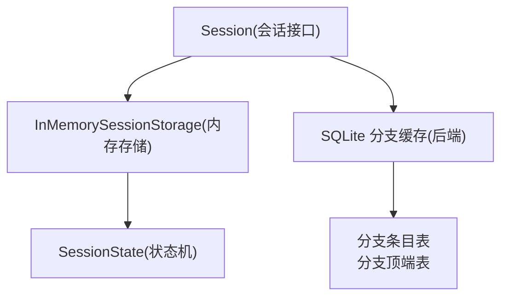
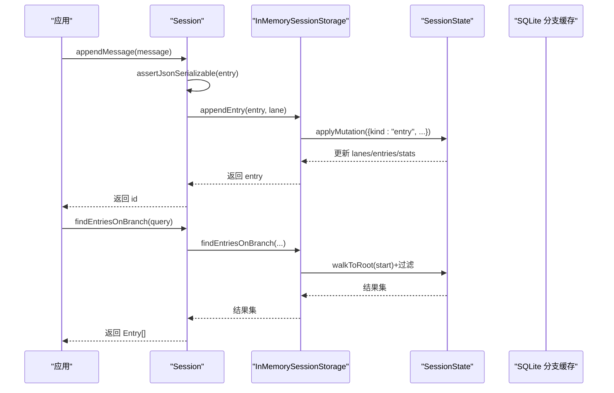
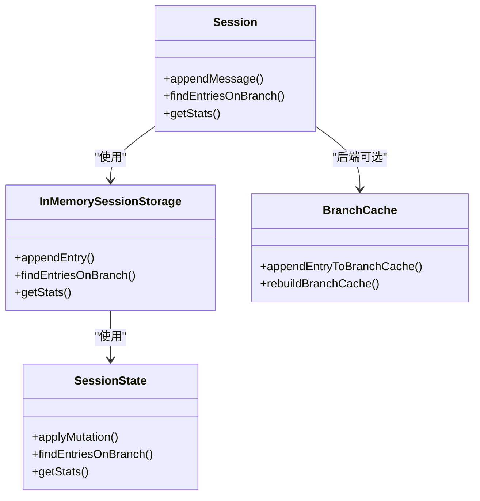
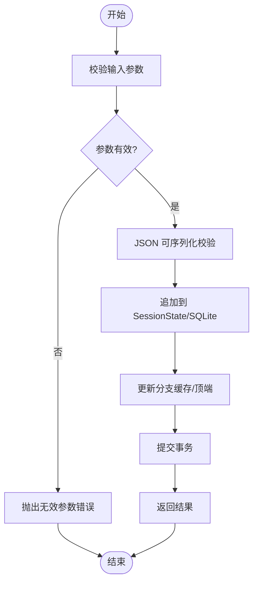

# 性能优化

<cite>
**本文引用的文件**
- [session.ts](file://packages/agent/src/harness/session/session.ts)
- [types.ts](file://packages/agent/src/harness/session/types.ts)
- [memory.ts](file://packages/agent/src/harness/session/memory.ts)
- [state.ts](file://packages/agent/src/harness/session/state.ts)
- [branch-cache.ts](file://packages/session-backends/sqlite-node/src/sqlite/branch-cache.ts)
</cite>

## 目录
1. [简介](#简介)
2. [项目结构](#项目结构)
3. [核心组件](#核心组件)
4. [架构总览](#架构总览)
5. [详细组件分析](#详细组件分析)
6. [依赖关系分析](#依赖关系分析)
7. [性能考量](#性能考量)
8. [故障排查指南](#故障排查指南)
9. [结论](#结论)
10. [附录](#附录)

## 简介
本文件聚焦会话管理在 I/O、内存与 CPU 层面的性能瓶颈与优化机会，结合仓库中的会话抽象、内存实现与 SQLite 分支缓存等关键代码，给出数据库层优化（索引、查询、连接池、批量）、内存管理策略（对象池、GC、泄漏防护）、多级缓存设计（失效与一致性）、监控与分析工具建议、大规模处理方案（分片、负载均衡、异步），以及不同部署环境（容器化、云原生、边缘）的优化建议。文末提供基准测试方法与优化前后对比框架，便于落地验证。

## 项目结构
会话子系统由“会话接口 + 内存实现 + SQLite 后端”组成：
- 会话接口与类型定义：统一读写语义、查询模型、统计指标与错误码
- 内存会话存储：用于开发与测试的高性能路径，避免持久化开销
- SQLite 分支缓存：将树形分支结构物化为可快速追加与读取的线性序列，降低回溯成本

图表来源
- [session.ts:102-299](file://packages/agent/src/harness/session/session.ts#L102-L299)
- [memory.ts:25-146](file://packages/agent/src/harness/session/memory.ts#L25-L146)
- [state.ts:50-345](file://packages/agent/src/harness/session/state.ts#L50-L345)
- [branch-cache.ts:14-101](file://packages/session-backends/sqlite-node/src/sqlite/branch-cache.ts#L14-L101)

章节来源
- [session.ts:102-299](file://packages/agent/src/harness/session/session.ts#L102-L299)
- [memory.ts:25-146](file://packages/agent/src/harness/session/memory.ts#L25-L146)
- [state.ts:50-345](file://packages/agent/src/harness/session/state.ts#L50-L345)
- [branch-cache.ts:14-101](file://packages/session-backends/sqlite-node/src/sqlite/branch-cache.ts#L14-L101)

## 核心组件
- Session：对外暴露统一的会话树操作（消息写入、记录写入、分支查询、日志与统计）。所有写前进行 JSON 可序列化校验，保证落盘数据质量。
- InMemorySessionStorage：无锁、顺序追加的状态机实现，适合高吞吐读写的开发/测试场景。
- SessionState：维护 entries、records、lanes、openOperations、labels、stats 等，并提供分支遍历、过滤与统计聚合。
- SQLite 分支缓存：通过“分支条目 + 分支顶端”两张表，将树形结构物化为可增量构建的线性序列，支持高效追加与回溯。

章节来源
- [session.ts:102-299](file://packages/agent/src/harness/session/session.ts#L102-L299)
- [memory.ts:25-146](file://packages/agent/src/harness/session/memory.ts#L25-L146)
- [state.ts:50-345](file://packages/agent/src/harness/session/state.ts#L50-L345)
- [branch-cache.ts:14-101](file://packages/session-backends/sqlite-node/src/sqlite/branch-cache.ts#L14-L101)

## 架构总览
下图展示一次消息写入与分支查询的关键调用链，体现从应用层到存储层的 I/O 路径与缓存利用。

图表来源
- [session.ts:178-184](file://packages/agent/src/harness/session/session.ts#L178-L184)
- [session.ts:233-254](file://packages/agent/src/harness/session/session.ts#L233-L254)
- [memory.ts:59-102](file://packages/agent/src/harness/session/memory.ts#L59-L102)
- [state.ts:186-215](file://packages/agent/src/harness/session/state.ts#L186-L215)

## 详细组件分析

### 会话接口与写入路径（Session）
- 写入前校验：对 payload 进行严格的 JSON 可序列化检查，避免非法对象导致后续序列化失败或体积膨胀。
- 分支写入：appendMessage/appendCustomEntry 均委托给 commitEntry，确保 parentId 指向当前 lane 的 leaf。
- 查询封装：findEntries/findEntriesOnBranch 统一参数校验与 limit/cursor 处理，减少重复逻辑。

优化要点
- 批量写入：将多次 append 合并为单次事务提交，减少 I/O 次数与锁竞争。
- 预分配 ID：使用高效 ID 生成器并提前分配，避免写入时随机分配带来的抖动。
- 限制查询范围：优先使用 findEntriesOnBranch 并设置 stopAtType/stopAtId，减少回溯深度。

章节来源
- [session.ts:42-100](file://packages/agent/src/harness/session/session.ts#L42-L100)
- [session.ts:178-207](file://packages/agent/src/harness/session/session.ts#L178-L207)
- [session.ts:233-269](file://packages/agent/src/harness/session/session.ts#L233-L269)

### 内存会话存储（InMemorySessionStorage）
- 无 I/O 的纯内存实现，所有写操作以结构化克隆方式隔离外部引用，避免共享可变状态。
- 通过 SessionState 的顺序追加与断言，保证 seq 单调递增、ID 唯一、父子关系一致。
- 开放操作跟踪：维护每个 lane 的 openOperations，防止并发冲突。

优化要点
- 对象复用：对频繁创建的小对象（如查询结果、中间结构）采用对象池，降低 GC 压力。
- 惰性计算：按需计算 stats 或分支路径，避免全量扫描。
- 批量复制：fork 时使用最小拷贝策略，仅复制必要分支与事实。

章节来源
- [memory.ts:25-146](file://packages/agent/src/harness/session/memory.ts#L25-L146)
- [memory.ts:148-193](file://packages/agent/src/harness/session/memory.ts#L148-L193)
- [state.ts:97-180](file://packages/agent/src/harness/session/state.ts#L97-L180)

### 状态机（SessionState）
- 数据结构：entries、entriesById、records、openOperationsByLane、lanes、log、stats、labels。
- 查询：支持按 type/customType/order/limit/cursor 过滤；分支遍历 walkToRoot 带循环检测与边界控制。
- 统计：实时累计 messageCount、tokens、cost 等，便于观测与限流。

优化要点
- 索引化访问：entriesById 提供 O(1) 查找；openOperationsByLane 提供 O(1) 打开操作定位。
- 游标分页：afterSeq 配合 order 实现稳定分页，避免偏移扫描。
- 分支裁剪：stopAtType/stopAtId 尽早终止遍历，降低最坏复杂度。

章节来源
- [state.ts:50-68](file://packages/agent/src/harness/session/state.ts#L50-L68)
- [state.ts:186-234](file://packages/agent/src/harness/session/state.ts#L186-L234)
- [state.ts:301-345](file://packages/agent/src/harness/session/state.ts#L301-L345)

### SQLite 分支缓存（branch-cache）
- 目标：将树形分支物化为“分支条目 + 分支顶端”，支持增量追加与快速回溯。
- 重建与扩展：rebuildBranchCache 基于叶子节点重建；appendEntryToBranchCache 根据父节点是否已有分支顶端决定直接扩展或复制历史片段。
- 事务保护：使用 SAVEPOINT 包裹构建过程，异常时回滚至保存点，保证一致性。

优化要点
- 索引设计：
  - entries(session_id, parent_id) 加速父节点查找
  - entries(session_id, seq) 加速顺序回放
  - branch_tips(session_id, parent_entry_id) 加速分支顶端定位
  - branch_entries(session_id, branch_id, seq) 加速分支内顺序读取
- 批量操作：
  - 构建分支时批量插入条目，减少事务切换
  - 合并多次追加为单次事务提交
- 一致性：
  - 写入后同步更新分支顶端与条目
  - 重建任务幂等，支持离线修复

章节来源
- [branch-cache.ts:14-101](file://packages/session-backends/sqlite-node/src/sqlite/branch-cache.ts#L14-L101)

## 依赖关系分析
- Session 依赖 SessionStorage 抽象，屏蔽底层实现差异（内存/SQLite）。
- InMemorySessionStorage 依赖 SessionState 完成状态变更与查询。
- SQLite 分支缓存依赖 SQL 语句与存储模块，提供高性能分支读写。

图表来源
- [session.ts:102-299](file://packages/agent/src/harness/session/session.ts#L102-L299)
- [memory.ts:25-146](file://packages/agent/src/harness/session/memory.ts#L25-L146)
- [state.ts:50-345](file://packages/agent/src/harness/session/state.ts#L50-L345)
- [branch-cache.ts:14-101](file://packages/session-backends/sqlite-node/src/sqlite/branch-cache.ts#L14-L101)

章节来源
- [session.ts:102-299](file://packages/agent/src/harness/session/session.ts#L102-L299)
- [memory.ts:25-146](file://packages/agent/src/harness/session/memory.ts#L25-L146)
- [state.ts:50-345](file://packages/agent/src/harness/session/state.ts#L50-L345)
- [branch-cache.ts:14-101](file://packages/session-backends/sqlite-node/src/sqlite/branch-cache.ts#L14-L101)

## 性能考量

### I/O 优化
- 批量写入：将多条消息/记录合并为单条事务提交，显著降低磁盘 I/O 与锁竞争。
- 顺序追加：保持 seq 单调递增，利于 WAL 与顺序写优化。
- 分支缓存：通过物化分支序列，避免每次回溯都进行树遍历。

### 内存管理
- 对象池：对高频小对象（查询结果、中间结构）复用，降低 GC 频率。
- 结构化克隆：在边界处深拷贝，避免意外共享可变状态导致的内存泄漏。
- 及时释放：关闭不再使用的游标/连接，避免句柄泄漏。

### CPU 消耗
- 查询裁剪：使用 stopAtType/stopAtId 尽早终止遍历；limit/cursor 分页避免全量扫描。
- 索引命中：确保常用查询走索引，减少全表扫描。
- 懒加载：按需计算统计与摘要，避免预热开销。

### 数据库层面优化
- 索引设计：
  - entries(session_id, parent_id) 加速父节点查找
  - entries(session_id, seq) 加速顺序回放
  - branch_tips(session_id, parent_entry_id) 加速分支顶端定位
  - branch_entries(session_id, branch_id, seq) 加速分支内顺序读取
- 查询优化：
  - 使用 afterSeq 游标分页，避免 OFFSET 扫描
  - 限定 lane/runId/type 缩小扫描范围
- 连接池配置：
  - 合理设置最大连接数与超时，避免连接风暴
  - 启用 WAL 模式提升并发读性能
- 批量操作：
  - 合并插入/更新为批量语句
  - 使用事务包裹批量写入，减少 fsync 次数

### 缓存机制
- 多级缓存：
  - L1：进程内内存缓存（热点分支顶端、最近条目）
  - L2：SQLite 分支缓存（持久化、可重建）
- 失效策略：
  - 基于版本号/时间戳的失效
  - 事件驱动失效（写入后更新缓存）
- 一致性保证：
  - 写入后原子更新缓存与主数据
  - 重建任务幂等，支持离线修复

### 大规模会话处理
- 分片：按 session_id 哈希分片，分散 I/O 与热点
- 负载均衡：多实例水平扩展，请求路由到对应分片
- 异步处理：将耗时操作（重建、压缩、摘要）放入队列异步执行

### 部署环境优化
- 容器化：固定资源配额，启用只读根文件系统，减少 IO 抖动
- 云原生：使用弹性伸缩与自动扩缩容，结合连接池与缓存预热
- 边缘计算：本地缓存优先，延迟敏感路径尽量本地化

### 基准测试与对比
- 指标：QPS、P95/P99 延迟、CPU 利用率、内存占用、I/O 吞吐
- 方法：压测脚本模拟高并发写入/查询，采集系统指标与应用指标
- 对比：优化前后在同一负载下对比，关注尾延迟与资源峰值

## 故障排查指南
- 常见错误：
  - 无效查询参数：limit 非正整数、cursor 非负整数
  - 分支不存在：lane 未找到或父节点缺失
  - 并发冲突：同一 lane 存在多个打开操作
- 定位方法：
  - 查看日志：通过 getLog 获取最近操作序列
  - 检查状态：getStats 观察 tokens/cost 变化
  - 重建缓存：当分支不一致时触发 rebuildBranchCache

章节来源
- [session.ts:30-40](file://packages/agent/src/harness/session/session.ts#L30-L40)
- [state.ts:30-40](file://packages/agent/src/harness/session/state.ts#L30-L40)
- [memory.ts:72-89](file://packages/agent/src/harness/session/memory.ts#L72-L89)
- [branch-cache.ts:19-52](file://packages/session-backends/sqlite-node/src/sqlite/branch-cache.ts#L19-L52)

## 结论
本方案通过“会话接口抽象 + 内存高速路径 + SQLite 分支缓存”的组合，实现了高吞吐、低延迟的会话管理。结合索引设计、批量写入、多级缓存与异步处理，可在不同部署环境下获得稳定性能。建议在生产环境中持续采集指标，定期评估优化效果，并根据业务增长动态调整分片与缓存策略。

## 附录

### 写入流程流程图

图表来源
- [session.ts:42-100](file://packages/agent/src/harness/session/session.ts#L42-L100)
- [memory.ts:59-89](file://packages/agent/src/harness/session/memory.ts#L59-L89)
- [branch-cache.ts:70-101](file://packages/session-backends/sqlite-node/src/sqlite/branch-cache.ts#L70-L101)