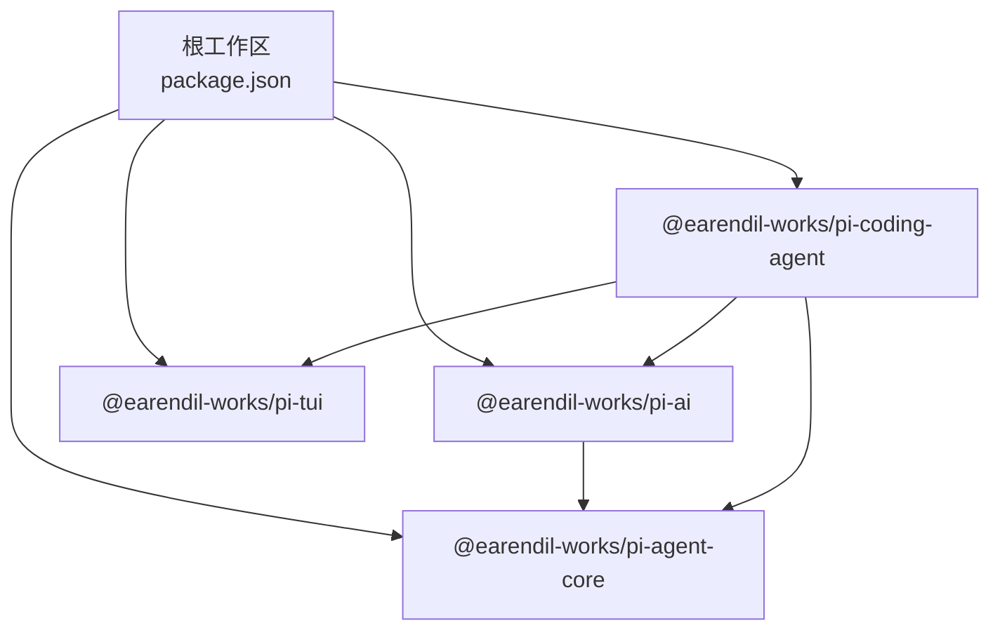
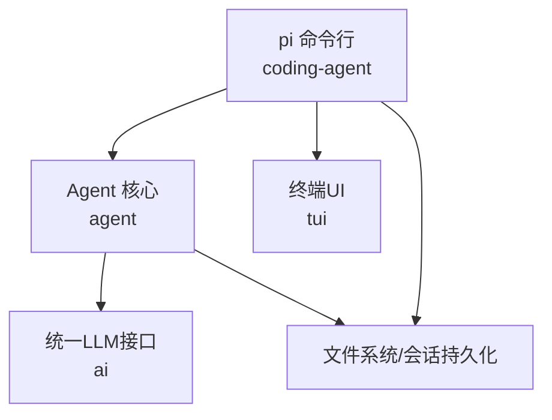
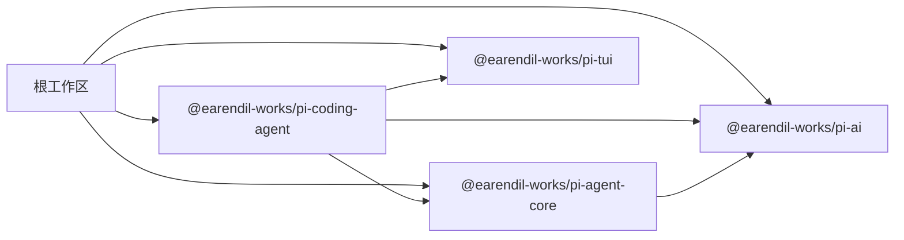
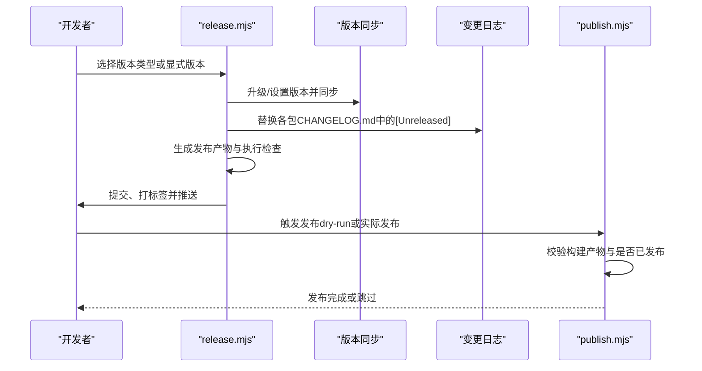

# 开发指南

<cite>
**本文引用的文件**
- [README.md](file://README.md)
- [CONTRIBUTING.md](file://CONTRIBUTING.md)
- [package.json](file://package.json)
- [biome.json](file://biome.json)
- [tsconfig.json](file://tsconfig.json)
- [tsconfig.base.json](file://tsconfig.base.json)
- [scripts/release.mjs](file://scripts/release.mjs)
- [scripts/publish.mjs](file://scripts/publish.mjs)
- [packages/agent/package.json](file://packages/agent/package.json)
- [packages/ai/package.json](file://packages/ai/package.json)
- [packages/coding-agent/package.json](file://packages/coding-agent/package.json)
- [packages/tui/package.json](file://packages/tui/package.json)
</cite>

## 目录
1. [简介](#简介)
2. [项目结构](#项目结构)
3. [核心组件](#核心组件)
4. [架构总览](#架构总览)
5. [详细组件分析](#详细组件分析)
6. [依赖关系分析](#依赖关系分析)
7. [性能与构建优化](#性能与构建优化)
8. [测试策略](#测试策略)
9. [开发环境搭建](#开发环境搭建)
10. [代码规范与风格指南](#代码规范与风格指南)
11. [贡献指南](#贡献指南)
12. [发布流程与版本管理](#发布流程与版本管理)
13. [故障排查](#故障排查)
14. [结语](#结语)

## 简介
本指南面向Pi项目贡献者与维护者，覆盖从开发环境搭建、代码规范、测试策略、贡献流程到发布与版本管理的完整实践。Pi是一个多包（monorepo）项目，包含AI统一接口、Agent运行时、终端UI库以及交互式编码代理CLI等模块。

## 项目结构
- 根目录通过工作区定义多个包：ai、agent、tui、coding-agent及其示例扩展。
- 根级脚本统一执行检查、构建、测试、发布与本地发布验证。
- 包内各自维护独立的构建、测试与发布脚本，遵循lockstep版本与产物校验。

图表来源
- [package.json:5-11](file://package.json#L5-L11)
- [packages/ai/package.json:1-107](file://packages/ai/package.json#L1-L107)
- [packages/agent/package.json:1-61](file://packages/agent/package.json#L1-L61)
- [packages/coding-agent/package.json:1-99](file://packages/coding-agent/package.json#L1-L99)
- [packages/tui/package.json:1-48](file://packages/tui/package.json#L1-L48)

章节来源
- [README.md:48-57](file://README.md#L48-L57)
- [package.json:5-11](file://package.json#L5-L11)

## 核心组件
- 统一LLM接口（@earendil-works/pi-ai）：抽象多提供商API，支持模型发现与配置。
- Agent运行时（@earendil-works/pi-agent-core）：工具调用、状态管理与会话抽象。
- 终端UI库（@earendil-works/pi-tui）：高效文本界面与差异渲染。
- 编码代理CLI（@earendil-works/pi-coding-agent）：交互式任务执行、会话管理与二进制分发。

章节来源
- [README.md:50-55](file://README.md#L50-L55)
- [packages/ai/package.json:1-107](file://packages/ai/package.json#L1-L107)
- [packages/agent/package.json:1-61](file://packages/agent/package.json#L1-L61)
- [packages/tui/package.json:1-48](file://packages/tui/package.json#L1-L48)
- [packages/coding-agent/package.json:1-99](file://packages/coding-agent/package.json#L1-L99)

## 架构总览
Pi采用“统一接口 + 运行时 + UI + CLI”的分层架构。CLI作为入口，组合Agent运行时与UI库；Agent运行时依赖统一LLM接口以屏蔽多提供商差异；TUI提供终端渲染能力。

图表来源
- [packages/coding-agent/package.json:1-99](file://packages/coding-agent/package.json#L1-L99)
- [packages/agent/package.json:1-61](file://packages/agent/package.json#L1-L61)
- [packages/ai/package.json:1-107](file://packages/ai/package.json#L1-L107)
- [packages/tui/package.json:1-48](file://packages/tui/package.json#L1-L48)

## 详细组件分析

### 统一LLM接口（pi-ai）
- 功能要点：多提供商SDK封装、模型与响应生成、CLI工具与OAuth辅助。
- 测试：使用Vitest进行单元与集成测试。
- 构建：先生成模型与图像相关类型文件，再编译打包。

章节来源
- [packages/ai/package.json:61-68](file://packages/ai/package.json#L61-L68)

### Agent运行时（pi-agent-core）
- 功能要点：工具调用、状态管理、提示模板与会话持久化。
- 测试：Vitest测试与专门的“harness”测试集。
- 构建：TypeScript编译输出至dist。

章节来源
- [packages/agent/package.json:23-29](file://packages/agent/package.json#L23-L29)

### 终端UI库（pi-tui）
- 功能要点：差异渲染、终端文本处理与跨平台原生预编译组件。
- 测试：Node内置测试运行器。
- 构建：TypeScript编译输出至dist。

章节来源
- [packages/tui/package.json:7-11](file://packages/tui/package.json#L7-L11)

### 编码代理CLI（pi-coding-agent）
- 功能要点：命令行入口、模式与主题资源复制、二进制编译（可选）。
- 测试：Vitest。
- 发布：构建后生成npm shrinkwrap以固定转译依赖。

章节来源
- [packages/coding-agent/package.json:31-40](file://packages/coding-agent/package.json#L31-L40)

## 依赖关系分析
- 工作区依赖：根工作区声明所有包；内部包之间通过路径别名解析。
- 运行时依赖：coding-agent依赖agent、ai、tui；agent依赖ai。
- 版本策略：所有包保持lockstep版本，发布前统一校验与同步。

图表来源
- [package.json:5-11](file://package.json#L5-L11)
- [packages/agent/package.json:31-36](file://packages/agent/package.json#L31-L36)
- [packages/coding-agent/package.json:41-59](file://packages/coding-agent/package.json#L41-L59)

章节来源
- [package.json:5-11](file://package.json#L5-L11)
- [tsconfig.json:5-21](file://tsconfig.json#L5-L21)

## 性能与构建优化
- 构建链路：各包按顺序构建，根脚本统一触发；TS编译开启声明与映射以便调试与发布。
- 资源复制：CLI构建阶段复制主题、资产与HTML导出模板，确保可分发包完整性。
- 二进制分发：提供二进制编译脚本，便于在目标平台快速部署。

章节来源
- [package.json:12-14](file://package.json#L12-L14)
- [packages/coding-agent/package.json:32-37](file://packages/coding-agent/package.json#L32-L37)

## 测试策略
- 单元测试：各包使用Vitest或Node内置测试运行器，确保核心逻辑与接口稳定。
- 集成测试：Agent提供“harness”专用测试集，覆盖会话、存储、提示模板等端到端场景。
- 端到端测试：README中提供测试入口脚本，可直接运行全仓库测试。
- LLM相关测试：默认跳过需API密钥的测试，避免CI失败。

章节来源
- [packages/agent/package.json:26-28](file://packages/agent/package.json#L26-L28)
- [packages/ai/package.json:66-67](file://packages/ai/package.json#L66-L67)
- [packages/tui/package.json](file://packages/tui/package.json#L10)
- [README.md](file://README.md#L69)

## 开发环境搭建
- Node版本要求：根工程引擎约束为较新版本，确保特性与安全基线。
- 安装依赖：根目录安装所有工作区包，避免执行生命周期脚本。
- 常用命令：
  - 构建：根脚本统一构建全部包。
  - 检查：Biome格式与规则检查、依赖锁定校验、TS导入一致性检查、浏览器冒烟测试。
  - 测试：根脚本运行全仓库测试；也可进入单包执行其测试脚本。
  - 运行CLI：从任意目录执行“pi”命令（由coding-agent提供）。

章节来源
- [package.json:49-51](file://package.json#L49-L51)
- [package.json:12-22](file://package.json#L12-L22)
- [README.md:65-71](file://README.md#L65-L71)

## 代码规范与风格指南
- TypeScript配置：
  - 基础配置启用严格模式、ES模块解析、装饰器支持与相对扩展名重写。
  - 根tsconfig为各包提供统一路径映射，便于跨包引用。
- Biome规则：
  - 启用推荐规则，强调const优先、禁用非空断言等风格约束。
  - 格式化使用制表符缩进、行长限制与错误即停策略。
- 导入一致性：根脚本包含TS相对导入检查，确保跨包导入稳定。

章节来源
- [tsconfig.base.json:2-24](file://tsconfig.base.json#L2-L24)
- [tsconfig.json:3-24](file://tsconfig.json#L3-L24)
- [biome.json:1-39](file://biome.json#L1-L39)
- [package.json:15-19](file://package.json#L15-L19)

## 贡献指南
- 质量门槛：新贡献者提交的问题与PR默认关闭，需达到质量标准并通过维护者认可。
- 提交前置：在提交PR前必须通过根级检查与测试。
- 讨论渠道：通过Discord进行实时沟通与问题澄清。
- 哲学原则：核心保持最小可用，功能若不属于核心应作为扩展实现。

章节来源
- [CONTRIBUTING.md:1-94](file://CONTRIBUTING.md#L1-L94)
- [README.md:59-61](file://README.md#L59-L61)

## 发布流程与版本管理
- 版本策略：所有包lockstep版本，支持补丁、小版本、主版本与显式版本号。
- 发布步骤（自动化脚本）：
  1) 校验未提交更改
  2) 升级版本（或设置显式版本），同步版本并仅更新锁文件
  3) 更新各包CHANGELOG.md中的“[Unreleased]”段落
  4) 重新生成发布产物（如模型类型、shrinkwrap）
  5) 执行根级检查
  6) 提交并打标签
  7) 为下个周期添加新的“[Unreleased]”段落
  8) 推送主分支与标签以触发CI发布
- 发布验证：
  - 发布前对各包进行构建与内容校验。
  - 若已发布则跳过，否则执行公开发布并附带溯源信息。
  - 支持dry-run模式仅验证包内容。

图表来源
- [scripts/release.mjs:145-204](file://scripts/release.mjs#L145-L204)
- [scripts/publish.mjs:90-115](file://scripts/publish.mjs#L90-L115)

章节来源
- [scripts/release.mjs:1-204](file://scripts/release.mjs#L1-L204)
- [scripts/publish.mjs:1-116](file://scripts/publish.mjs#L1-L116)
- [package.json:23-27](file://package.json#L23-L27)

## 故障排查
- 依赖锁定与供应链加固：
  - 直接外部依赖使用精确版本；内部包保留范围版本。
  - 锁文件为依赖真相，禁止意外提交除非显式允许。
  - 根检查包含依赖锁定校验、TS相对导入检查与shrinkwrap生成检查。
- 本地发布验证：
  - 使用本地发布脚本在隔离环境中构建、打包并安装，验证发布产物。
- 平台差异：
  - 发布脚本根据平台选择可执行命令（Windows使用.cmd后缀）。

章节来源
- [README.md:73-86](file://README.md#L73-L86)
- [package.json:15-19](file://package.json#L15-L19)
- [scripts/publish.mjs:22-24](file://scripts/publish.mjs#L22-L24)

## 结语
本指南提供了Pi项目从开发到发布的全流程实践。建议在每次改动前先运行根级检查与测试，并在提交PR前确保符合贡献质量标准。版本与发布流程由脚本自动化保障，配合严格的依赖与供应链策略，确保交付质量与可重复性。