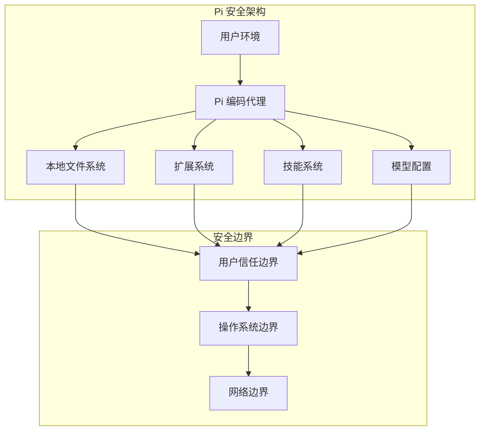
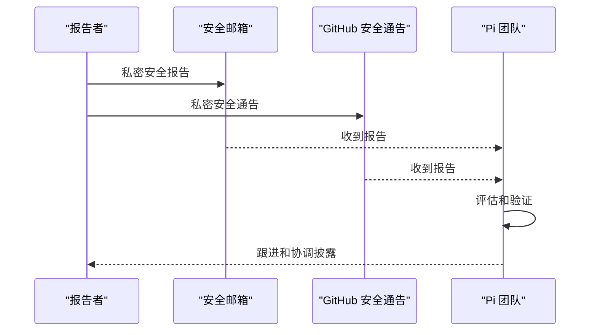
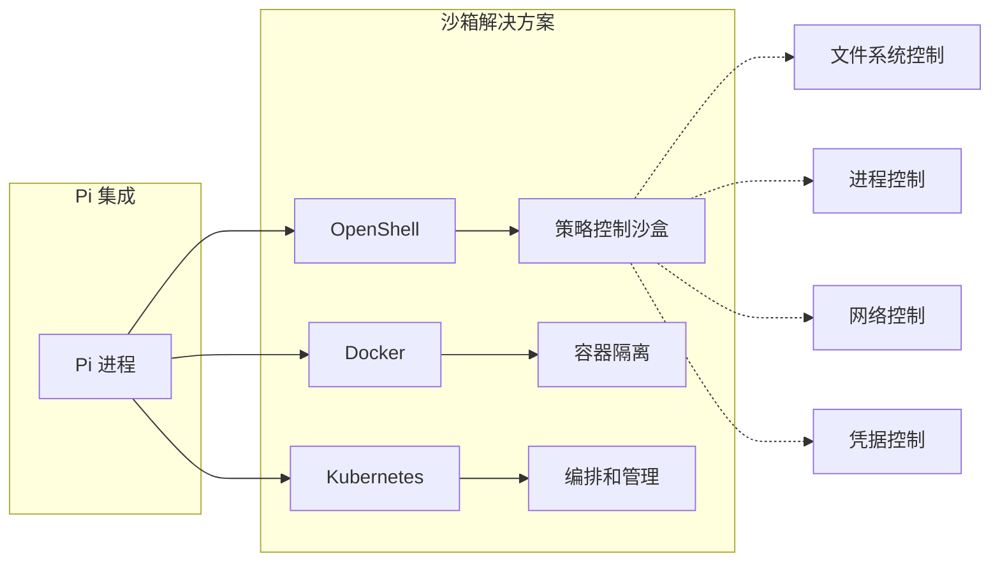
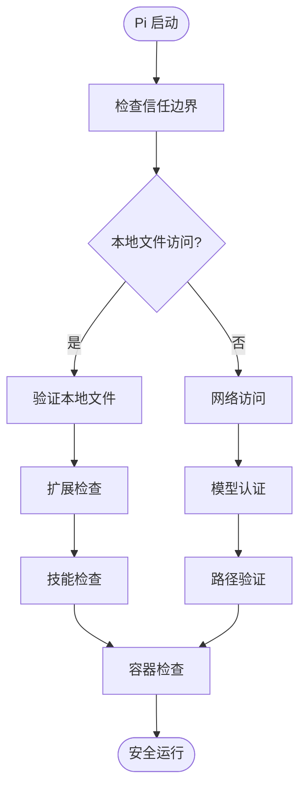
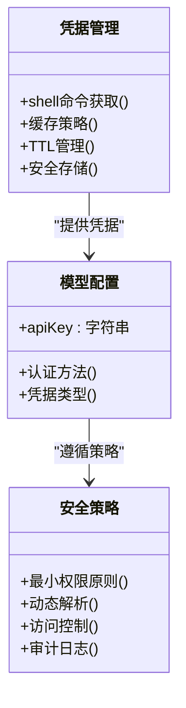
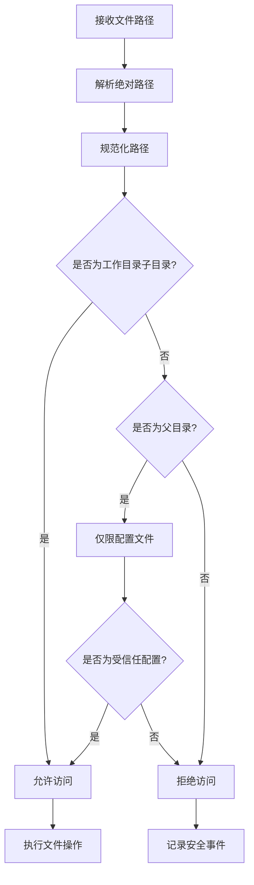
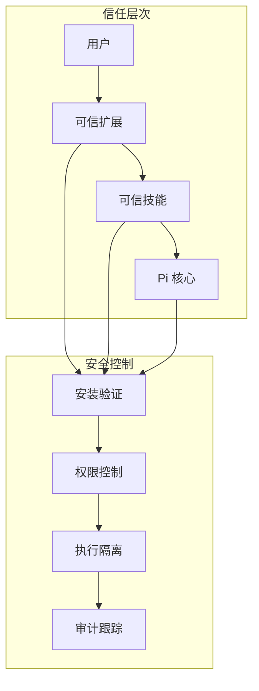
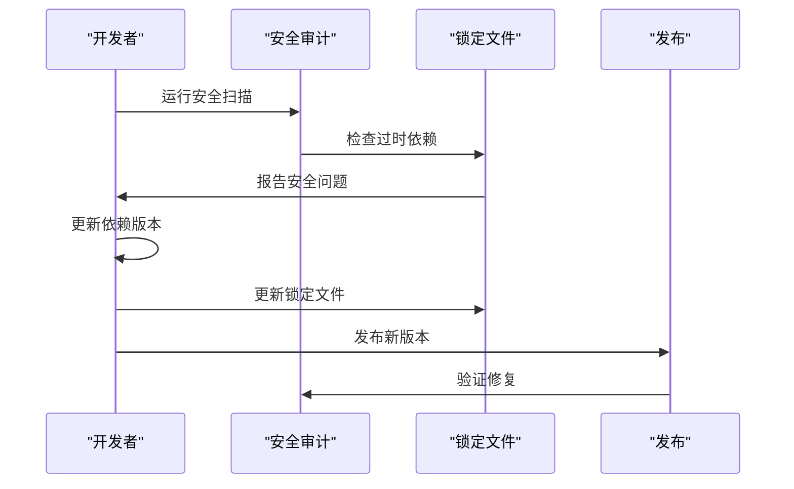
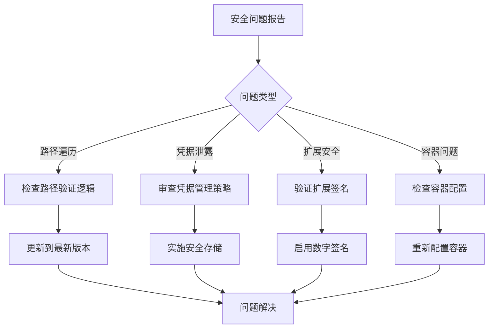

# 安全策略

<cite>
**本文档引用的文件**
- [SECURITY.md](file://SECURITY.md)
- [README.md](file://README.md)
- [package.json](file://package.json)
- [package-lock.json](file://package-lock.json)
- [packages/coding-agent/CHANGELOG.md](file://packages/coding-agent/CHANGELOG.md)
- [packages/coding-agent/README.md](file://packages/coding-agent/README.md)
- [packages/coding-agent/docs/containerization.md](file://packages/coding-agent/docs/containerization.md)
- [packages/coding-agent/docs/models.md](file://packages/coding-agent/docs/models.md)
</cite>

## 目录
1. [引言](#引言)
2. [项目结构](#项目结构)
3. [核心组件](#核心组件)
4. [架构概览](#架构概览)
5. [详细组件分析](#详细组件分析)
6. [依赖分析](#依赖分析)
7. [性能考虑](#性能考虑)
8. [故障排除指南](#故障排除指南)
9. [结论](#结论)

## 引言

Pi 是一个本地运行的编码代理系统，其安全模型基于用户边界概念。该系统的设计原则是：Pi 在用户的安全边界内本地运行，用户有责任监控其操作或将其限制在容器、虚拟机或其他沙盒解决方案中。

Pi 将本地用户账户和该账户可写入的文件视为与 Pi 进程本身在同一信任边界内。如果攻击者能够修改用户主目录、工作区、shell 启动文件、环境或 Pi 配置中的文件，他们通常可以影响 Pi 或其他本地开发工具。除非证明 Pi 授予了这种写访问权限或跨越了操作系统特权边界，否则依赖于此类先前本地写入访问的报告不被视为安全漏洞。

## 项目结构



**图表来源**
- [SECURITY.md:6-17](file://SECURITY.md#L6-L17)
- [SECURITY.md:11-17](file://SECURITY.md#L11-L17)

**章节来源**
- [SECURITY.md:6-17](file://SECURITY.md#L6-L17)
- [README.md:64](file://README.md#L64)

## 核心组件

### 安全报告流程



**图表来源**
- [SECURITY.md:24-41](file://SECURITY.md#L24-L41)

### 沙箱和容器化选项



**图表来源**
- [packages/coding-agent/docs/containerization.md:12](file://packages/coding-agent/docs/containerization.md#L12)
- [packages/coding-agent/docs/containerization.md:20](file://packages/coding-agent/docs/containerization.md#L20)

**章节来源**
- [SECURITY.md:24-41](file://SECURITY.md#L24-L41)
- [packages/coding-agent/docs/containerization.md:12](file://packages/coding-agent/docs/containerization.md#L12)

## 架构概览

### 安全边界模型



**图表来源**
- [SECURITY.md:50-66](file://SECURITY.md#L50-L66)
- [packages/coding-agent/CHANGELOG.md:4333](file://packages/coding-agent/CHANGELOG.md#L4333)

### 凭据安全管理



**图表来源**
- [packages/coding-agent/docs/models.md:149](file://packages/coding-agent/docs/models.md#L149)
- [packages/coding-agent/CHANGELOG.md:1174](file://packages/coding-agent/CHANGELOG.md#L1174)

**章节来源**
- [packages/coding-agent/docs/models.md:149](file://packages/coding-agent/docs/models.md#L149)
- [packages/coding-agent/CHANGELOG.md:1174](file://packages/coding-agent/CHANGELOG.md#L1174)

## 详细组件分析

### 路径遍历防护机制



**图表来源**
- [packages/coding-agent/CHANGELOG.md:4333](file://packages/coding-agent/CHANGELOG.md#L4333)

### 扩展和技能安全策略



**图表来源**
- [SECURITY.md:19-22](file://SECURITY.md#L19-L22)

**章节来源**
- [SECURITY.md:19-22](file://SECURITY.md#L19-L22)
- [packages/coding-agent/README.md:492](file://packages/coding-agent/README.md#L492)

### 依赖安全管理和漏洞修复



**图表来源**
- [packages/coding-agent/CHANGELOG.md:624](file://packages/coding-agent/CHANGELOG.md#L624)
- [package-lock.json:5080](file://package-lock.json#L5080)

**章节来源**
- [packages/coding-agent/CHANGELOG.md:624](file://packages/coding-agent/CHANGELOG.md#L624)
- [package-lock.json:5080](file://package-lock.json#L5080)

## 依赖分析

### 安全依赖关系图

```mermaid
graph LR
subgraph "核心安全依赖"
A[uuid@14] --> B[修复 CVE-2023-26159]
C[glob] --> D[已弃用且有漏洞]
end
subgraph "Pi 系统"
E[Pi 核心] --> A
E --> C
F[扩展系统] --> A
F --> C
end
subgraph "安全影响"
G[下游安装] --> H[安全风险]
H --> I[审计警告]
end
C -.-> G
```

**图表来源**
- [packages/coding-agent/CHANGELOG.md:624](file://packages/coding-agent/CHANGELOG.md#L624)
- [package-lock.json:5080](file://package-lock.json#L5080)

**章节来源**
- [packages/coding-agent/CHANGELOG.md:624](file://packages/coding-agent/CHANGELOG.md#L624)
- [package-lock.json:5080](file://package-lock.json#L5080)

## 性能考虑

### 安全开销与性能平衡

Pi 的安全策略在设计时充分考虑了性能影响：

- **最小权限原则**：只授予必要的文件系统和网络访问权限
- **延迟认证**：凭据在请求时解析而非缓存到长期模型状态
- **路径验证**：在执行前进行严格的路径验证，避免不必要的系统调用
- **容器化支持**：通过容器化实现更好的资源隔离和性能监控

## 故障排除指南

### 常见安全问题排查



**章节来源**
- [SECURITY.md:70-87](file://SECURITY.md#L70-L87)

### 安全事件响应流程

1. **立即响应**：收到安全报告后 24小时内确认
2. **影响评估**：确定漏洞严重性和影响范围
3. **临时缓解**：提供临时缓解措施和最佳实践建议
4. **修复开发**：开发和测试安全修复程序
5. **协调披露**：与报告者协调公开披露时间表
6. **后续跟进**：监控修复效果和用户反馈

## 结论

Pi 的安全策略建立在清晰的信任边界和最小权限原则之上。通过以下关键措施确保系统的安全性：

- **明确的边界定义**：清楚区分用户信任边界、操作系统边界和网络边界
- **多层防护机制**：从路径验证到凭据管理，再到容器化隔离
- **负责任的披露**：建立了完整的私密报告和协调披露流程
- **持续改进**：通过定期安全审计和依赖更新保持系统安全

用户在部署 Pi 时应根据自身安全需求选择合适的隔离方案，并严格遵循最小权限原则来配置扩展和技能。