# 容器化指南

<cite>
**本文档引用的文件**
- [packages/coding-agent/docs/containerization.md](file://packages/coding-agent/docs/containerization.md)
- [README.md](file://README.md)
- [SECURITY.md](file://SECURITY.md)
- [packages/coding-agent/README.md](file://packages/coding-agent/README.md)
- [packages/coding-agent/src/core/resolve-config-value.ts](file://packages/coding-agent/src/core/resolve-config-value.ts)
- [packages/coding-agent/examples/extensions/sandbox/index.ts](file://packages/coding-agent/examples/extensions/sandbox/index.ts)
- [scripts/build-binaries.sh](file://scripts/build-binaries.sh)
- [scripts/local-release.mjs](file://scripts/local-release.mjs)
- [scripts/publish.mjs](file://scripts/publish.mjs)
</cite>

## 目录
1. [简介](#简介)
2. [项目结构](#项目结构)
3. [核心组件](#核心组件)
4. [架构概览](#架构概览)
5. [详细组件分析](#详细组件分析)
6. [依赖关系分析](#依赖关系分析)
7. [性能考虑](#性能考虑)
8. [故障排除指南](#故障排除指南)
9. [结论](#结论)

## 简介

本指南基于 Pi 项目的容器化实践，提供了三种主要的容器化模式：Plain Docker、OpenShell 和 Gondolin。这些模式为不同安全需求和使用场景提供了灵活的解决方案。

Pi 是一个智能代理系统，支持在容器环境中运行以实现更好的隔离性和安全性。该系统特别适用于需要权限控制和沙箱环境的开发场景。

## 项目结构

该项目采用 Monorepo 结构，包含多个包和工具脚本：

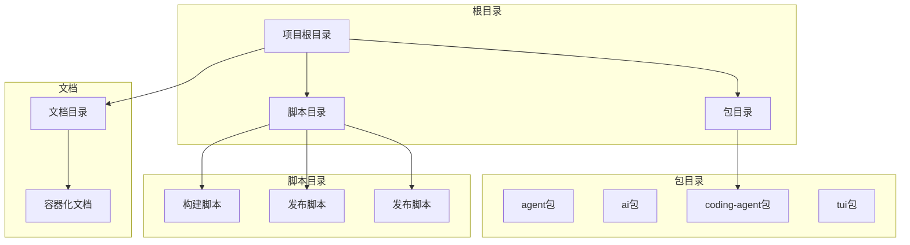

**图表来源**
- [README.md:58-66](file://README.md#L58-L66)
- [packages/coding-agent/docs/containerization.md:0-20](file://packages/coding-agent/docs/containerization.md#L0-L20)

**章节来源**
- [README.md:58-66](file://README.md#L58-L66)
- [packages/coding-agent/docs/containerization.md:0-20](file://packages/coding-agent/docs/containerization.md#L0-L20)

## 核心组件

### 容器化模式概述

项目提供了三种主要的容器化模式：

1. **Plain Docker**: 最简单的本地容器边界
2. **OpenShell**: 通过本地网关运行沙箱（支持 Docker、Podman 或虚拟机）
3. **Gondolin**: 基于微虚拟机的路由机制

每种模式都有其特定的安全边界和适用场景：

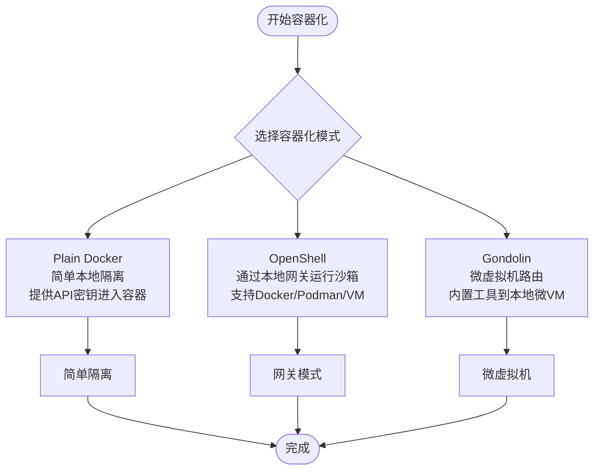

**图表来源**
- [packages/coding-agent/docs/containerization.md:14-21](file://packages/coding-agent/docs/containerization.md#L14-L21)

**章节来源**
- [packages/coding-agent/docs/containerization.md:14-21](file://packages/coding-agent/docs/containerization.md#L14-L21)

## 架构概览

### 容器化架构设计

```mermaid
graph TB
subgraph "宿主机环境"
Host[宿主机]
Docker[Docker守护进程]
Volume[命名卷]
end
subgraph "容器环境"
Container[Pi容器]
Workspace[工作区(/workspace)]
Config[配置(/root/.pi/agent)]
Node[Node.js运行时]
Pi[Pi进程]
end
subgraph "网络层"
Network[网络配置]
APIKeys[API密钥管理]
end
Host --> Docker
Docker --> Container
Container --> Workspace
Container --> Config
Container --> Node
Node --> Pi
Container --> Network
APIKeys --> Container
Volume --> Config
```

**图表来源**
- [packages/coding-agent/docs/containerization.md:84-110](file://packages/coding-agent/docs/containerization.md#L84-L110)

### 配置解析架构

系统使用配置值解析机制来处理环境变量和模板：

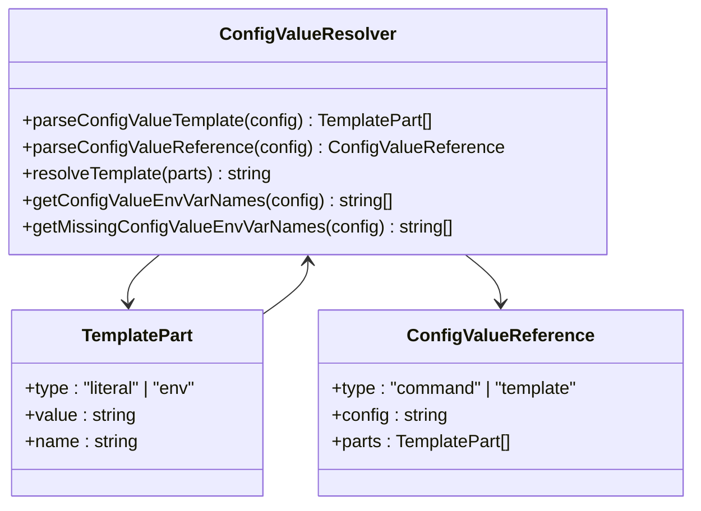

**图表来源**
- [packages/coding-agent/src/core/resolve-config-value.ts:15-129](file://packages/coding-agent/src/core/resolve-config-value.ts#L15-L129)

**章节来源**
- [packages/coding-agent/src/core/resolve-config-value.ts:1-129](file://packages/coding-agent/src/core/resolve-config-value.ts#L1-L129)

## 详细组件分析

### Plain Docker 实现

Plain Docker 提供了最简单的容器化方案：

#### Dockerfile 配置

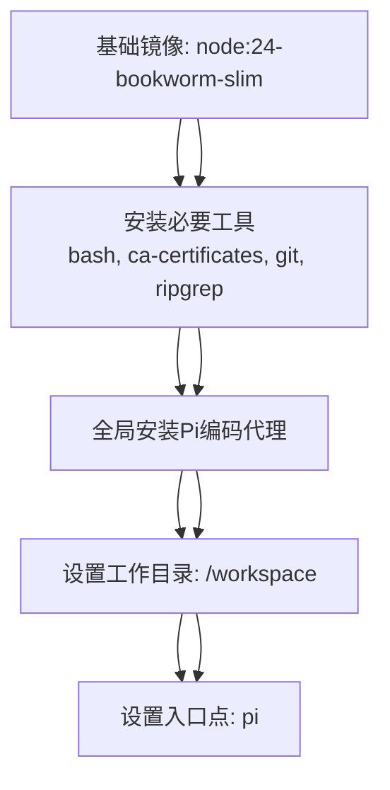

**图表来源**
- [packages/coding-agent/docs/containerization.md:84-95](file://packages/coding-agent/docs/containerization.md#L84-L95)

#### 运行参数详解

| 参数 | 描述 | 示例 |
|------|------|------|
| `-v "$PWD:/workspace"` | 将当前目录挂载到容器的工作区 | `-v "$PWD:/workspace"` |
| `-v pi-agent-home:/root/.pi/agent` | 使用命名卷存储代理配置 | `-v pi-agent-home:/root/.pi/agent` |
| `-e ANTHROPIC_API_KEY` | 传递API密钥环境变量 | `-e ANTHROPIC_API_KEY` |

**章节来源**
- [packages/coding-agent/docs/containerization.md:79-110](file://packages/coding-agent/docs/containerization.md#L79-L110)

### OpenShell 沙箱机制

OpenShell 提供了更强大的沙箱功能：

#### 沙箱配置结构

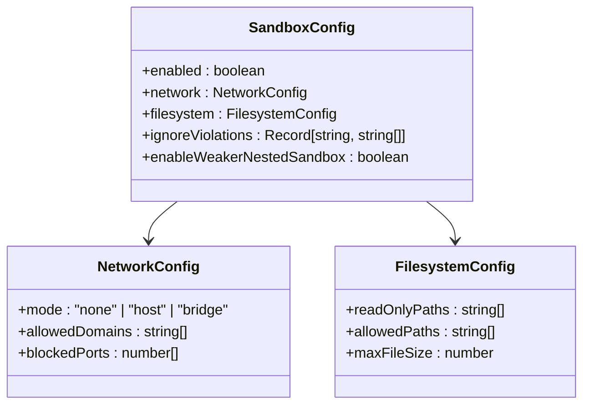

**图表来源**
- [packages/coding-agent/examples/extensions/sandbox/index.ts:105-130](file://packages/coding-agent/examples/extensions/sandbox/index.ts#L105-L130)

#### 沙箱操作执行流程

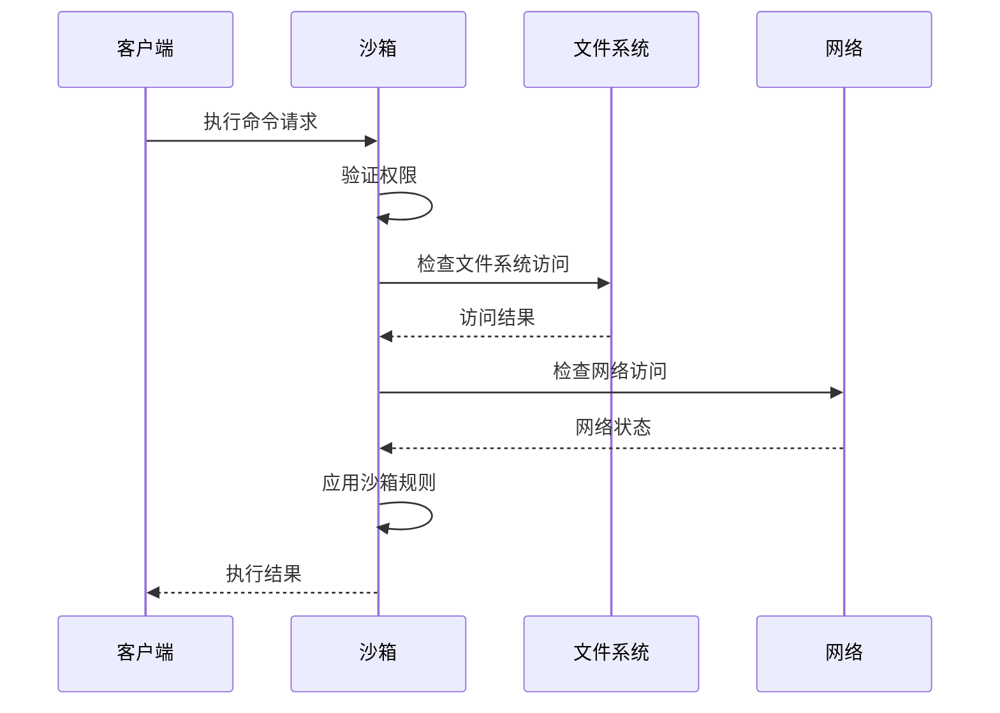

**图表来源**
- [packages/coding-agent/examples/extensions/sandbox/index.ts:132-137](file://packages/coding-agent/examples/extensions/sandbox/index.ts#L132-L137)

**章节来源**
- [packages/coding-agent/examples/extensions/sandbox/index.ts:94-137](file://packages/coding-agent/examples/extensions/sandbox/index.ts#L94-L137)

### Gondolin 微虚拟机集成

Gondolin 提供了基于微虚拟机的高级隔离：

#### 微虚拟机路由机制

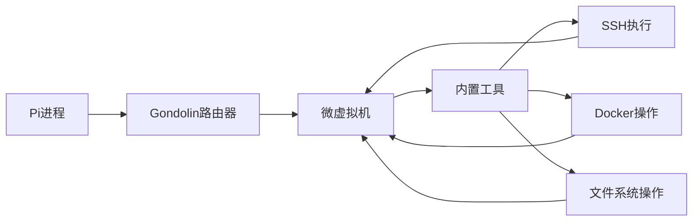

**图表来源**
- [packages/coding-agent/docs/containerization.md:21](file://packages/coding-agent/docs/containerization.md#L21)

**章节来源**
- [packages/coding-agent/docs/containerization.md:21](file://packages/coding-agent/docs/containerization.md#L21)

## 依赖关系分析

### 构建系统依赖

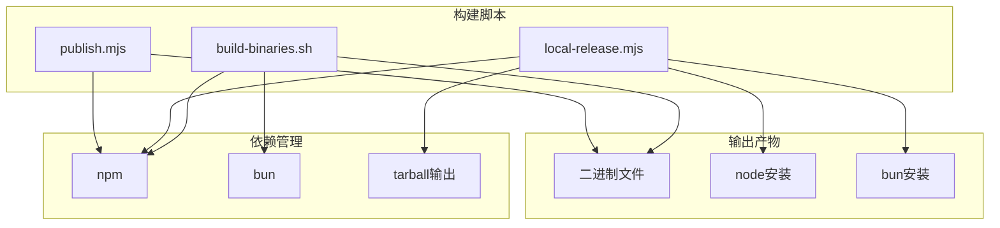

**图表来源**
- [scripts/build-binaries.sh:1-89](file://scripts/build-binaries.sh#L1-L89)
- [scripts/local-release.mjs:189-227](file://scripts/local-release.mjs#L189-L227)
- [scripts/publish.mjs:39-115](file://scripts/publish.mjs#L39-L115)

### 环境变量依赖

系统使用多种环境变量进行配置管理：

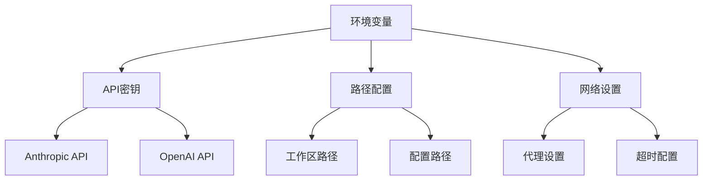

**图表来源**
- [packages/coding-agent/src/core/resolve-config-value.ts:89-129](file://packages/coding-agent/src/core/resolve-config-value.ts#L89-L129)

**章节来源**
- [scripts/build-binaries.sh:1-89](file://scripts/build-binaries.sh#L1-L89)
- [scripts/local-release.mjs:189-227](file://scripts/local-release.mjs#L189-L227)
- [scripts/publish.mjs:39-115](file://scripts/publish.mjs#L39-L115)
- [packages/coding-agent/src/core/resolve-config-value.ts:89-129](file://packages/coding-agent/src/core/resolve-config-value.ts#L89-L129)

## 性能考虑

### 容器化性能优化

1. **镜像大小优化**: 使用 slim 基础镜像减少资源占用
2. **缓存策略**: 利用 Docker 层缓存加速构建过程
3. **资源限制**: 为容器设置适当的 CPU 和内存限制
4. **网络优化**: 配置合理的网络访问策略

### 构建性能优化

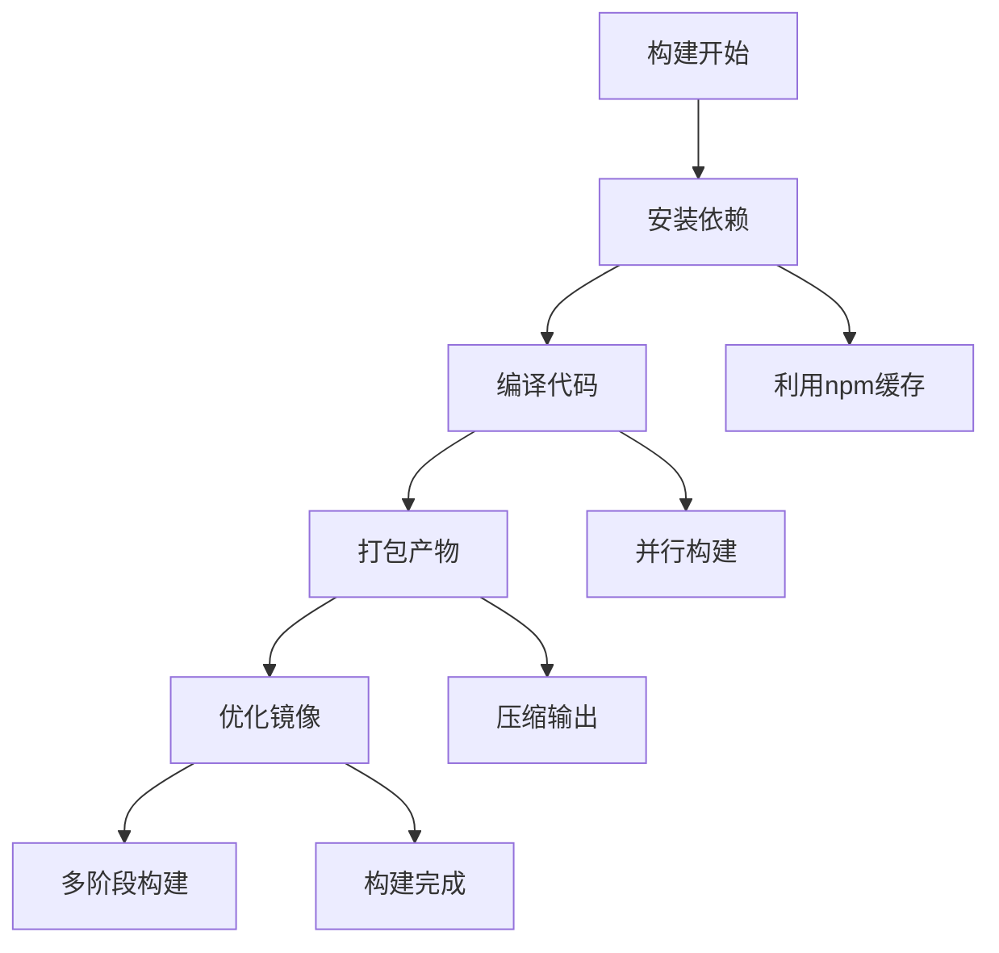

**图表来源**
- [scripts/build-binaries.sh:84-89](file://scripts/build-binaries.sh#L84-L89)

## 故障排除指南

### 常见问题及解决方案

#### 容器启动问题

| 问题 | 可能原因 | 解决方案 |
|------|----------|----------|
| 容器无法启动 | 权限不足 | 检查用户权限和文件所有权 |
| 网络连接失败 | 网络配置错误 | 验证网络设置和防火墙规则 |
| API密钥无效 | 环境变量未正确设置 | 确认环境变量注入和配置文件 |

#### 性能问题诊断

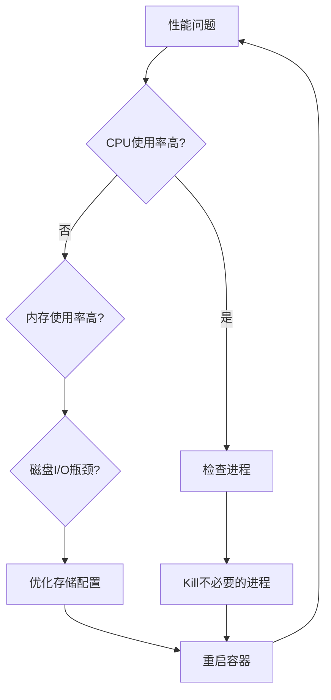

#### 配置问题排查

1. **检查环境变量**: 确保所有必需的环境变量都已正确设置
2. **验证文件权限**: 检查挂载卷的文件权限
3. **查看日志**: 分析容器日志以识别具体问题

**章节来源**
- [packages/coding-agent/src/core/resolve-config-value.ts:89-129](file://packages/coding-agent/src/core/resolve-config-value.ts#L89-L129)

## 结论

Pi 项目的容器化方案提供了从简单到复杂的多层次安全隔离选项。通过 Plain Docker、OpenShell 和 Gondolin 三种模式，用户可以根据具体的安全需求和使用场景选择最适合的容器化策略。

关键优势包括：
- 灵活的容器化模式选择
- 强大的沙箱机制
- 完善的配置管理系统
- 优化的构建和部署流程

建议在生产环境中优先考虑 Gondolin 模式以获得最佳的安全隔离效果，而在开发和测试环境中可以使用 Plain Docker 以简化配置。