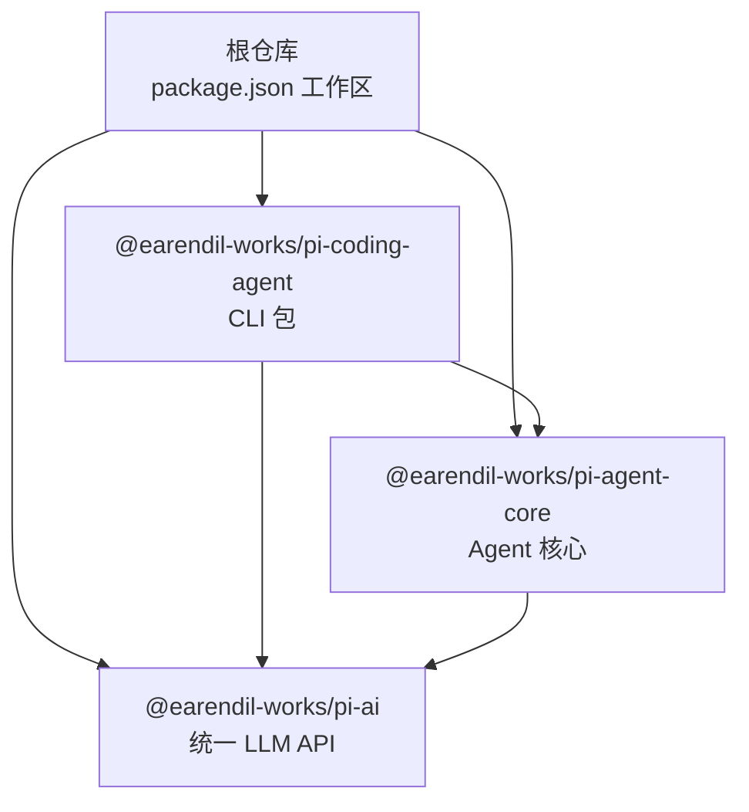
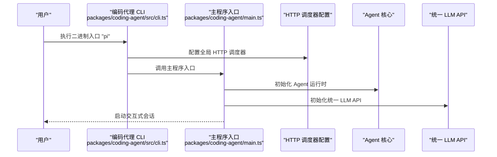
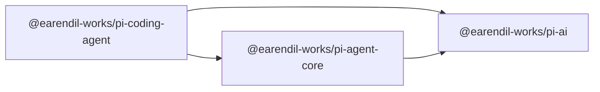

# 快速开始

<cite>
**本文引用的文件**
- [README.md](file://README.md)
- [package.json](file://package.json)
- [.npmrc](file://.npmrc)
- [packages/coding-agent/package.json](file://packages/coding-agent/package.json)
- [packages/agent/package.json](file://packages/agent/package.json)
- [packages/ai/package.json](file://packages/ai/package.json)
- [packages/coding-agent/src/cli.ts](file://packages/coding-agent/src/cli.ts)
- [CONTRIBUTING.md](file://CONTRIBUTING.md)
</cite>

## 目录
1. [简介](#简介)
2. [项目结构](#项目结构)
3. [核心组件](#核心组件)
4. [架构总览](#架构总览)
5. [详细组件分析](#详细组件分析)
6. [依赖分析](#依赖分析)
7. [性能考虑](#性能考虑)
8. [故障排除指南](#故障排除指南)
9. [结论](#结论)
10. [附录](#附录)

## 简介
本指南面向初学者与有经验的开发者，帮助你在本地快速完成 Pi 编码代理的安装、配置与首次使用。你将学到：
- Node.js 版本要求与 npm 配置
- 依赖安装与构建流程
- 启动编码代理 CLI 的方式
- 配置 AI 供应商 API 密钥与运行首个代理会话
- 常见初始化配置项与环境变量
- 常见安装与配置问题的排查方法

## 项目结构
该仓库为多包（monorepo）结构，核心包包括：
- 编码代理 CLI：用于交互式编程任务
- Agent 核心运行时：工具调用与状态管理
- 统一多提供商 LLM API：OpenAI、Anthropic、Google、Bedrock 等

图表来源
- [package.json:1-11](file://package.json#L1-L11)
- [packages/coding-agent/package.json:1-99](file://packages/coding-agent/package.json#L1-L99)
- [packages/agent/package.json:1-61](file://packages/agent/package.json#L1-L61)
- [packages/ai/package.json:1-107](file://packages/ai/package.json#L1-L107)

章节来源
- [README.md:48-57](file://README.md#L48-L57)
- [package.json:5-11](file://package.json#L5-L11)

## 核心组件
- 编码代理 CLI（pi）：通过二进制入口提供交互式编程体验，支持读取、编辑、写入等工具与会话管理。
- Agent 核心（pi-agent-core）：抽象传输层、状态管理与附件支持，是所有代理的基础运行时。
- 统一 LLM API（pi-ai）：统一 OpenAI、Anthropic、Google、Bedrock 等多家模型提供商的接口与自动模型发现。

章节来源
- [packages/coding-agent/package.json:1-99](file://packages/coding-agent/package.json#L1-L99)
- [packages/agent/package.json:1-61](file://packages/agent/package.json#L1-L61)
- [packages/ai/package.json:1-107](file://packages/ai/package.json#L1-L107)

## 架构总览
Pi 的 CLI 入口在编码代理包中定义，启动时会加载 Agent 运行时与 LLM API，并在进程启动前配置全局 HTTP 调度器以适配各提供商 SDK 的网络请求。

图表来源
- [packages/coding-agent/src/cli.ts:1-21](file://packages/coding-agent/src/cli.ts#L1-L21)

章节来源
- [packages/coding-agent/src/cli.ts:1-21](file://packages/coding-agent/src/cli.ts#L1-L21)

## 详细组件分析

### 安装与环境准备
- Node.js 版本要求
  - 根与各包均声明最低 Node.js 版本为 22.19.0 或更高。
- npm 配置
  - 使用 .npmrc 设置保存精确版本与最小发布间隔，确保依赖锁定一致性。
- 依赖安装与构建
  - 开发模式下可先安装工作区依赖，再按需构建各包；测试脚本会跳过需要 API 密钥的 LLM 测试。

章节来源
- [package.json:49-51](file://package.json#L49-L51)
- [packages/coding-agent/package.json:95-97](file://packages/coding-agent/package.json#L95-L97)
- [packages/agent/package.json:51-53](file://packages/agent/package.json#L51-L53)
- [packages/ai/package.json:98-100](file://packages/ai/package.json#L98-L100)
- [.npmrc:1-3](file://.npmrc#L1-L3)
- [README.md:65-71](file://README.md#L65-L71)

### 启动编码代理 CLI
- 二进制入口
  - 编码代理包导出二进制名称为 “pi”，指向构建产物中的 CLI 入口。
- 进程与网络配置
  - CLI 启动时会设置进程标题、标记环境变量，并在加载运行时之前配置全局 HTTP 调度器，确保后续提供商 SDK 请求行为一致。

章节来源
- [packages/coding-agent/package.json:9-11](file://packages/coding-agent/package.json#L9-L11)
- [packages/coding-agent/src/cli.ts:12-18](file://packages/coding-agent/src/cli.ts#L12-L18)

### 配置 AI 供应商 API 密钥
- 统一 LLM API 支持多家提供商（如 OpenAI、Anthropic、Google、Bedrock），具体模型与认证方式由提供商 SDK 处理。
- 在首次运行或切换模型时，根据提供商要求设置对应环境变量或凭据文件（例如 OpenAI 的 API Key、Anthropic 的 API Key 等）。
- 若未提供有效密钥，相关测试会被跳过；生产使用请确保凭据正确且可用。

章节来源
- [packages/ai/package.json:69-80](file://packages/ai/package.json#L69-L80)
- [README.md:69](file://README.md#L69)

### 运行你的第一个代理会话
- 在安装并构建完成后，通过二进制入口 “pi” 启动交互式会话。
- 首次运行会提示必要的初始化配置（如选择模型、输入凭据等），随后进入会话界面进行编程任务。

章节来源
- [packages/coding-agent/src/cli.ts:1-21](file://packages/coding-agent/src/cli.ts#L1-L21)
- [packages/coding-agent/package.json:9-11](file://packages/coding-agent/package.json#L9-L11)

### 常见初始化配置选项与环境变量
- 运行时环境变量
  - 进程启动时会设置特定标记，便于运行时识别当前为编码代理进程。
- HTTP 调度器
  - 在加载运行时前配置全局 HTTP 调度器，保证各提供商 SDK 的网络行为一致。
- 会话与配置目录
  - 编码代理包声明配置目录为 “.pi”，用于存放扩展、Git、NPM、Prompts、Skills 等运行期数据。

章节来源
- [packages/coding-agent/src/cli.ts:12-18](file://packages/coding-agent/src/cli.ts#L12-L18)
- [packages/coding-agent/package.json:6-8](file://packages/coding-agent/package.json#L6-L8)

## 依赖分析
- 工作区与包关系
  - 根 package.json 声明工作区包含多个包；编码代理 CLI 依赖 Agent 核心与统一 LLM API。
- 提供商 SDK
  - 统一 LLM API 内部引入多家提供商 SDK，用于实现统一接口与自动模型发现。
- 可选依赖
  - 编码代理包包含可选剪贴板依赖，用于增强终端交互体验。

图表来源
- [package.json:5-11](file://package.json#L5-L11)
- [packages/coding-agent/package.json:41-59](file://packages/coding-agent/package.json#L41-L59)
- [packages/agent/package.json:31-36](file://packages/agent/package.json#L31-L36)
- [packages/ai/package.json:69-80](file://packages/ai/package.json#L69-L80)

章节来源
- [package.json:5-11](file://package.json#L5-L11)
- [packages/coding-agent/package.json:41-59](file://packages/coding-agent/package.json#L41-L59)
- [packages/agent/package.json:31-36](file://packages/agent/package.json#L31-L36)
- [packages/ai/package.json:69-80](file://packages/ai/package.json#L69-L80)

## 性能考虑
- 构建与打包
  - 使用类型化构建工具生成分发产物，并在必要时生成 shrinkwrap 以固定传递依赖版本。
- 运行时网络
  - 通过全局 HTTP 调度器统一网络行为，有助于减少因不同提供商 SDK 默认网络策略差异导致的性能波动。
- 二进制与资源
  - CLI 提供二进制编译选项，便于在目标环境中直接运行；构建过程会复制主题与模板资源以保证运行时完整性。

章节来源
- [packages/coding-agent/package.json:32-39](file://packages/coding-agent/package.json#L32-L39)
- [packages/coding-agent/src/cli.ts:16-18](file://packages/coding-agent/src/cli.ts#L16-L18)

## 故障排除指南
- Node.js 版本不满足要求
  - 症状：安装或构建阶段报错。
  - 处理：升级到满足最低版本要求的 Node.js。
- 缺少或错误的 API 密钥
  - 症状：LLM 相关功能不可用或测试被跳过。
  - 处理：根据所选提供商设置正确的环境变量或凭据文件。
- 依赖锁定与版本冲突
  - 症状：安装后行为异常或构建失败。
  - 处理：遵循仓库提供的安装与检查流程，确保使用锁定文件与精确版本。
- 二进制入口不可用
  - 症状：执行 “pi” 报命令不存在。
  - 处理：先完成构建后再尝试运行；确认二进制入口已生成。
- 会话或配置目录问题
  - 症状：无法保存会话或加载配置。
  - 处理：确认配置目录存在且具有写权限；默认路径为编码代理包声明的配置目录。

章节来源
- [package.json:49-51](file://package.json#L49-L51)
- [packages/coding-agent/package.json:95-97](file://packages/coding-agent/package.json#L95-L97)
- [README.md:65-71](file://README.md#L65-L71)
- [packages/coding-agent/package.json:6-8](file://packages/coding-agent/package.json#L6-L8)

## 结论
通过本指南，你可以完成 Pi 编码代理的安装与首次使用：满足 Node.js 版本要求、配置 npm、安装并构建依赖、启动 CLI、配置 AI 供应商密钥并运行首个会话。遇到问题时，可依据故障排除章节定位原因并解决。随着深入使用，建议关注统一 LLM API 的提供商能力与 Agent 核心的扩展机制，以便在复杂场景中获得更好的开发体验。

## 附录
- 开发与测试常用命令
  - 安装依赖（忽略生命周期脚本）
  - 构建全部包
  - 代码检查（格式、类型、导入兼容性、shrinkwrap 校验）
  - 运行测试（跳过需要 API 密钥的 LLM 测试）
  - 从源码运行 CLI

章节来源
- [README.md:65-71](file://README.md#L65-L71)
- [CONTRIBUTING.md:54-57](file://CONTRIBUTING.md#L54-L57)