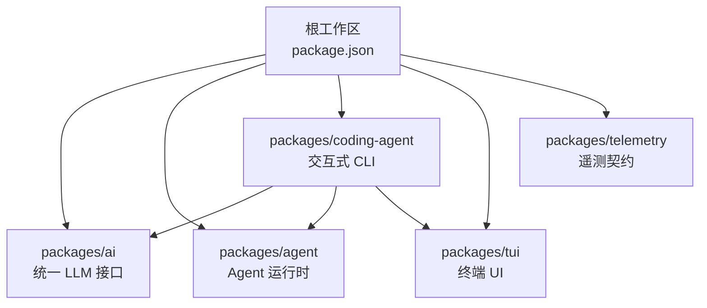
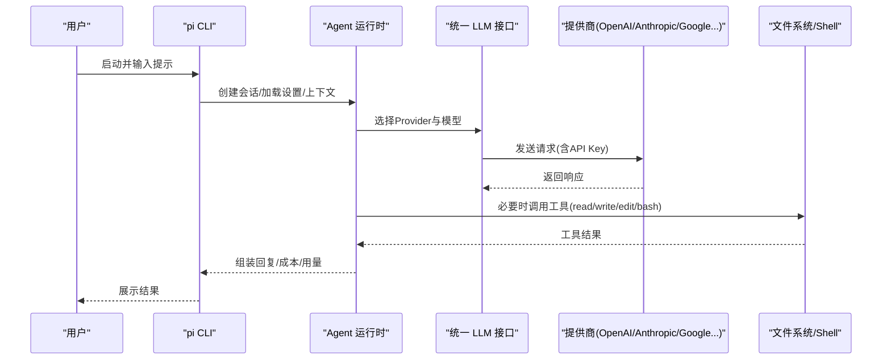
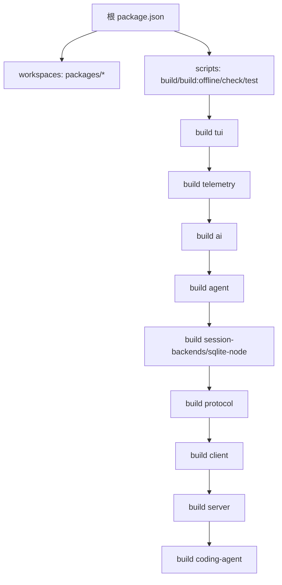

# 快速开始

<cite>
**本文引用的文件**
- [README.md](file://README.md)
- [package.json](file://package.json)
- [packages/coding-agent/README.md](file://packages/coding-agent/README.md)
- [packages/coding-agent/docs/providers.md](file://packages/coding-agent/docs/providers.md)
- [packages/coding-agent/docs/environment-variables.md](file://packages/coding-agent/docs/environment-variables.md)
- [packages/ai/src/providers/moonshotai-cn.ts](file://packages/ai/src/providers/moonshotai-cn.ts)
</cite>

## 目录
1. [简介](#简介)
2. [项目结构](#项目结构)
3. [核心组件](#核心组件)
4. [架构总览](#架构总览)
5. [详细组件分析](#详细组件分析)
6. [依赖分析](#依赖分析)
7. [性能注意事项](#性能注意事项)
8. [故障排除指南](#故障排除指南)
9. [结论](#结论)
10. [附录](#附录)

## 简介
本指南帮助你在几分钟内运行第一个 Pi 代理会话。你将完成环境准备、安装与构建、配置 API Key（OpenAI、Anthropic、Google 等）、启动交互式会话，并通过常见使用场景（代码生成、调试帮助、文件操作、命令执行）快速体验 Pi 的核心能力。同时提供故障排除与安全最佳实践，确保新手也能顺利上手。

## 项目结构
Pi 是一个多包仓库，包含 AI 统一接口、Agent 运行时、编码 Agent CLI、终端 UI、遥测等模块。根目录提供统一的构建脚本与工作区管理；coding-agent 包提供交互式的命令行工具与丰富的文档。

```mermaid
graph TB
A["根工作区<br/>package.json"] --> B["packages/ai<br/>统一 LLM 接口"]
A --> C["packages/agent<br/>Agent 运行时"]
A --> D["packages/coding-agent<br/>交互式 CLI"]
A --> E["packages/tui<br/>终端 UI"]
A --> F["packages/telemetry<br/>遥测契约"]
D --> B
D --> C
D --> E
```

图表来源
- [package.json:1-75](file://package.json#L1-L75)
- [packages/coding-agent/README.md:1-100](file://packages/coding-agent/README.md#L1-L100)

章节来源
- [README.md:13-36](file://README.md#L13-L36)
- [package.json:1-75](file://package.json#L1-L75)

## 核心组件
- 统一 LLM 接口：封装多家提供商（OpenAI、Anthropic、Google 等），通过环境变量或认证文件注入密钥。
- Agent 运行时：负责工具调用、状态管理与会话生命周期。
- 编码 Agent CLI：提供交互式模式、非交互式输出、RPC 集成与 SDK 嵌入。
- 终端 UI：提供差异渲染的 TUI，支持快捷键、消息队列与编辑器增强。
- 遥测契约：供应商中立的遥测接口与参考实现。

章节来源
- [README.md:13-36](file://README.md#L13-L36)
- [packages/coding-agent/README.md:13-20](file://packages/coding-agent/README.md#L13-L20)

## 架构总览
下图展示了从用户到模型调用的关键路径：CLI 接收输入，选择 Provider 与模型，经由 Agent 运行时调度内置工具（读/写/编辑/bash），最终调用 LLM 并返回结果。

```mermaid
sequenceDiagram
participant U as "用户"
participant CLI as "pi CLI"
participant AG as "Agent 运行时"
participant AI as "统一 LLM 接口"
participant PR as "提供商(OpenAI/Anthropic/Google...)"
participant FS as "文件系统/Shell"
U->>CLI : 启动并输入提示
CLI->>AG : 创建会话/加载设置/上下文
AG->>AI : 选择Provider与模型
AI->>PR : 发送请求(含API Key)
PR-->>AI : 返回响应
AG->>FS : 必要时调用工具(read/write/edit/bash)
FS-->>AG : 工具结果
AG-->>CLI : 组装回复/成本/用量
CLI-->>U : 展示结果
```

图表来源
- [packages/coding-agent/README.md:147-233](file://packages/coding-agent/README.md#L147-L233)
- [packages/coding-agent/docs/providers.md:58-107](file://packages/coding-agent/docs/providers.md#L58-L107)
- [packages/ai/src/providers/moonshotai-cn.ts:1-15](file://packages/ai/src/providers/moonshotai-cn.ts#L1-L15)

## 详细组件分析

### 环境与安装
- Node.js 版本要求：>= 22.19.0（由引擎声明约束）。
- 安装依赖：在工作区根目录执行 npm install（可加 --ignore-scripts 以跳过生命周期脚本）。
- 构建：npm run build（会刷新模型数据并构建所有包）；离线构建使用 npm run build:offline。
- 开发测试：npm run check 进行 lint/format/type 检查；./test.sh 运行测试（无 API Key 时跳过 LLM 相关用例）。

章节来源
- [package.json:14-28](file://package.json#L14-L28)
- [package.json:63-65](file://package.json#L63-L65)
- [README.md:52-61](file://README.md#L52-L61)

### 配置 API Key（OpenAI、Anthropic、Google 等）
- 环境变量方式：为所选提供商设置对应环境变量后直接运行 pi。
- 认证文件方式：将密钥写入 ~/.pi/agent/auth.json，优先级高于环境变量。
- 订阅登录：在交互模式下使用 /login 选择提供商并完成 OAuth 流程。
- 支持的提供商与环境变量映射详见提供商文档；示例包括 Anthropic、OpenAI、Google Gemini、Azure OpenAI、Bedrock 等。

章节来源
- [packages/coding-agent/README.md:77-91](file://packages/coding-agent/README.md#L77-L91)
- [packages/coding-agent/docs/providers.md:58-107](file://packages/coding-agent/docs/providers.md#L58-L107)
- [packages/coding-agent/docs/providers.md:109-185](file://packages/coding-agent/docs/providers.md#L109-L185)

### 启动交互式会话
- 全局安装 CLI：npm install -g --ignore-scripts @earendil-works/pi-coding-agent
- 或使用官方安装脚本：curl -fsSL https://pi.dev/install.sh | sh
- 启动交互模式：pi
- 首次对话：直接输入自然语言指令，默认启用 read、write、edit、bash 四个工具。

章节来源
- [packages/coding-agent/README.md:63-91](file://packages/coding-agent/README.md#L63-L91)

### 常见使用场景示例
- 代码生成：让模型基于当前项目上下文生成新文件或修改现有代码（利用 write/edit 工具）。
- 调试帮助：粘贴错误日志或描述问题，让模型定位原因并提供修复建议（结合 bash 查看日志/运行测试）。
- 文件操作：列出目录、搜索关键字、读取/写入配置文件（read/find/grep/ls 等工具）。
- 命令执行：通过 bash 工具执行构建、测试、部署等命令，并将输出反馈给模型继续推理。

章节来源
- [packages/coding-agent/README.md:147-233](file://packages/coding-agent/README.md#L147-L233)
- [packages/coding-agent/README.md:578-587](file://packages/coding-agent/README.md#L578-L587)

### 会话管理与上下文
- 会话自动保存到 ~/.pi/agent/sessions/，支持分支、压缩与导出导入。
- 上下文文件：启动时加载 AGENTS.md/CLAUDE.md（全局与项目级），用于注入约定与指令。
- 系统提示：可通过 .pi/SYSTEM.md 替换或追加系统提示。

章节来源
- [packages/coding-agent/README.md:236-335](file://packages/coding-agent/README.md#L236-L335)

### 安全与权限
- 默认以当前用户权限运行，无内置权限限制；需要更强隔离时使用容器化或沙箱方案。
- 第三方扩展/技能具有系统访问权限，使用前务必审查源码。
- 更新检查与遥测可配置关闭；离线模式可禁用所有启动网络操作。

章节来源
- [README.md:38-46](file://README.md#L38-L46)
- [packages/coding-agent/README.md:309-317](file://packages/coding-agent/README.md#L309-L317)
- [packages/coding-agent/README.md:407-437](file://packages/coding-agent/README.md#L407-L437)

## 依赖分析
- 工作区管理：根 package.json 定义 workspaces，统一构建与发布脚本。
- 引擎约束：Node.js >= 22.19.0。
- 构建顺序：tui → telemetry → ai → agent → session-backends/sqlite-node → protocol → client → server → coding-agent。

```mermaid
flowchart TD
P["根 package.json"] --> W["workspaces: packages/*"]
P --> S["scripts: build/build:offline/check/test"]
S --> B1["build tui"]
B1 --> B2["build telemetry"]
B2 --> B3["build ai"]
B3 --> B4["build agent"]
B4 --> B5["build session-backends/sqlite-node"]
B5 --> B6["build protocol"]
B6 --> B7["build client"]
B7 --> B8["build server"]
B8 --> B9["build coding-agent"]
```

图表来源
- [package.json:1-75](file://package.json#L1-L75)

章节来源
- [package.json:1-75](file://package.json#L1-L75)

## 性能注意事项
- 长会话建议使用压缩（/compact）以减少上下文占用，避免超出模型上下文窗口。
- 合理选择思考级别（thinking level）以平衡质量与成本。
- 使用缓存（如 provider 支持的 prompt caching）可降低重复请求成本。
- 在受限环境中优先使用只读工具集（read/grep/find/ls）减少副作用。

章节来源
- [packages/coding-agent/README.md:272-280](file://packages/coding-agent/README.md#L272-L280)
- [packages/coding-agent/README.md:555-563](file://packages/coding-agent/README.md#L555-L563)

## 故障排除指南
- 无法启动或构建失败
  - 确认 Node.js 版本满足要求（>= 22.19.0）。
  - 清理并重新安装依赖：npm ci 或 npm install --ignore-scripts。
  - 使用 npm run build:offline 避免在线拉取模型数据。
- 无法连接提供商
  - 检查环境变量或 auth.json 中的密钥是否正确。
  - 确认网络可达与代理设置（HTTP_PROXY/HTTPS_PROXY）。
  - 使用 /login 重新登录或切换提供商。
- 权限与信任问题
  - 首次进入项目会被询问是否信任该项目；按提示选择或保存决策。
  - 在非交互模式下可通过 --approve/--no-approve 控制一次运行的信任策略。
- 会话与上下文
  - 若上下文过大导致失败，尝试 /compact 或减少上下文文件内容。
  - 使用 /session 查看当前会话信息，必要时切换到历史分支继续。

章节来源
- [package.json:63-65](file://package.json#L63-L65)
- [packages/coding-agent/README.md:295-317](file://packages/coding-agent/README.md#L295-L317)
- [packages/coding-agent/docs/providers.md:58-107](file://packages/coding-agent/docs/providers.md#L58-L107)
- [packages/coding-agent/docs/environment-variables.md:70-88](file://packages/coding-agent/docs/environment-variables.md#L70-L88)

## 结论
通过以上步骤，你可以在最短时间内完成环境准备、安装构建、配置密钥并启动一个交互式 Pi 会话。借助内置工具与可扩展生态，你可以高效完成代码生成、调试、文件操作与命令执行等任务。遵循安全与性能建议，可获得更稳定、可控的体验。

## 附录

### 快速命令速查
- 安装与启动
  - 全局安装：npm install -g --ignore-scripts @earendil-works/pi-coding-agent
  - 启动交互：pi
- 配置密钥
  - 环境变量：export ANTHROPIC_API_KEY=... / export OPENAI_API_KEY=... / export GEMINI_API_KEY=...
  - 认证文件：~/.pi/agent/auth.json
  - 交互登录：/login 选择提供商
- 会话与模式
  - 继续最近会话：pi -c
  - 选择会话：pi -r
  - 非交互输出：pi -p "你的提示"
  - RPC 模式：pi --mode rpc
- 模型与工具
  - 切换模型：/model 或 --provider/--model
  - 限制工具：--tools 或 --exclude-tools
  - 只读模式：--tools read,grep,find,ls

章节来源
- [packages/coding-agent/README.md:63-91](file://packages/coding-agent/README.md#L63-L91)
- [packages/coding-agent/README.md:514-663](file://packages/coding-agent/README.md#L514-L663)
- [packages/coding-agent/docs/providers.md:58-107](file://packages/coding-agent/docs/providers.md#L58-L107)