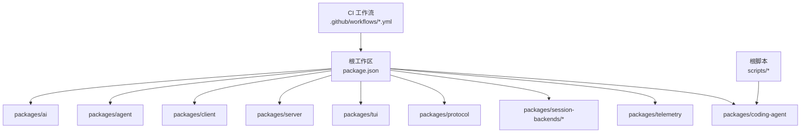
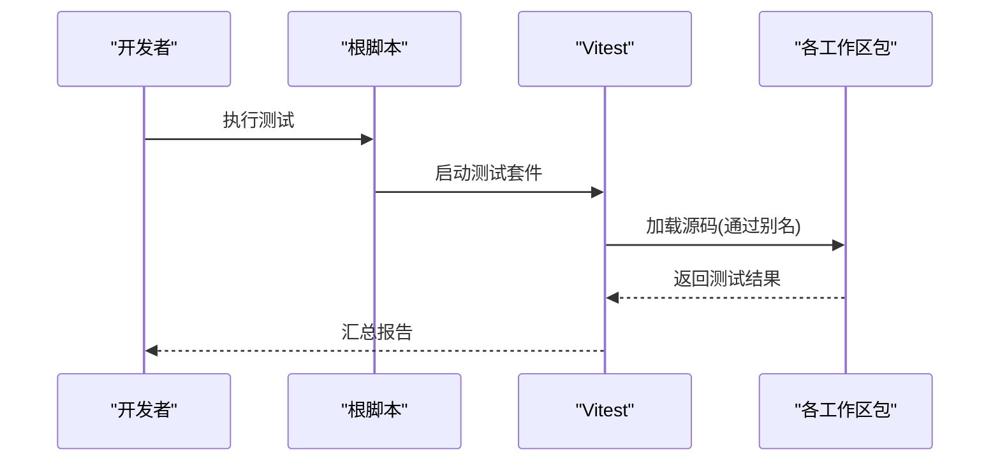
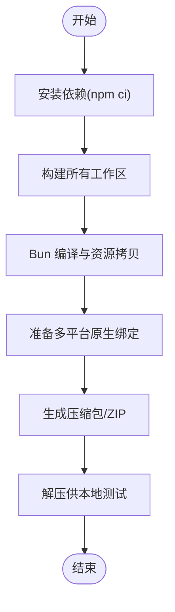
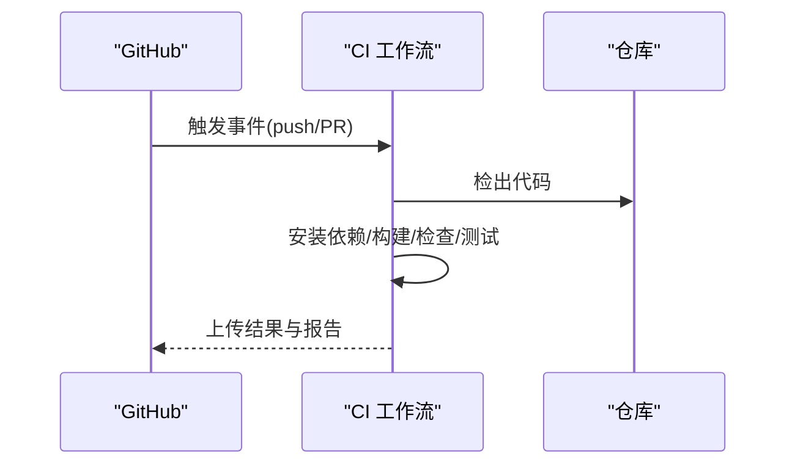
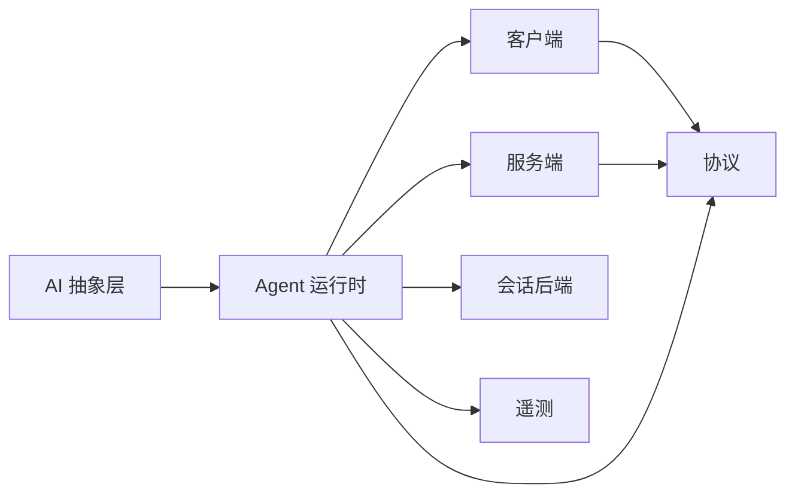

# 开发工作流程

<cite>
**本文引用的文件**
- [README.md](file://README.md)
- [package.json](file://package.json)
- [CONTRIBUTING.md](file://CONTRIBUTING.md)
- [biome.json](file://biome.json)
- [tsconfig.base.json](file://tsconfig.base.json)
- [.npmrc](file://.npmrc)
- [vitest.base.ts](file://vitest.base.ts)
- [test.sh](file://test.sh)
- [scripts/build-binaries.sh](file://scripts/build-binaries.sh)
- [.github/workflows/ci.yml](file://.github/workflows/ci.yml)
- [.github/workflows/pr-gate.yml](file://.github/workflows/pr-gate.yml)
- [packages/coding-agent/package.json](file://packages/coding-agent/package.json)
</cite>

## 目录
1. [简介](#简介)
2. [项目结构](#项目结构)
3. [核心组件](#核心组件)
4. [架构总览](#架构总览)
5. [详细组件分析](#详细组件分析)
6. [依赖分析](#依赖分析)
7. [性能考虑](#性能考虑)
8. [故障排除指南](#故障排除指南)
9. [结论](#结论)
10. [附录](#附录)

## 简介
本指南面向扩展开发者，覆盖从环境搭建、代码规范与最佳实践、测试策略、调试技巧、构建打包、发布流程到持续集成与故障排除的完整工作流。仓库采用 Monorepo 组织，提供统一的构建、检查、测试与发布脚本；通过示例扩展与可插拔架构，便于在编码代理（Coding Agent）之上快速实现自定义能力。

## 项目结构
仓库根目录为 monorepo，包含多个工作区包：AI 抽象层、Agent 运行时、客户端/服务端、TUI、协议、会话后端、遥测以及编码代理 CLI 等。根 package.json 定义了统一的工作区、脚本与工具链配置；Biome 负责格式化与静态检查；TypeScript 基础配置集中管理编译选项；Vitest 基础配置提供跨包的模块别名与测试入口映射。



图表来源
- [package.json:1-75](file://package.json#L1-L75)
- [scripts/build-binaries.sh:1-285](file://scripts/build-binaries.sh#L1-L285)
- [.github/workflows/ci.yml:1-43](file://.github/workflows/ci.yml#L1-L43)

章节来源
- [README.md:52-61](file://README.md#L52-L61)
- [package.json:1-75](file://package.json#L1-L75)

## 核心组件
- 多提供者 AI 抽象层：统一调用不同 LLM 提供商接口，屏蔽差异。
- Agent 运行时：工具调用、状态管理与会话编排。
- 客户端/服务端：用于远程交互与 RPC 通信。
- TUI：终端界面库，支持差异化渲染。
- 协议：定义跨进程/网络通信的数据契约。
- 会话后端：持久化与会话存储（如 SQLite）。
- 遥测：供应商无关的遥测契约与参考适配器。
- 编码代理 CLI：交互式命令行入口，聚合上述能力并提供扩展点。

章节来源
- [README.md:26-35](file://README.md#L26-L35)
- [packages/coding-agent/package.json:1-109](file://packages/coding-agent/package.json#L1-L109)

## 架构总览
下图展示了扩展开发涉及的主要层次与数据流向：扩展通过 CLI 或 API 接入，调用 Agent 运行时，后者协调 AI 抽象层与工具集，必要时读写会话后端并上报遥测。

```mermaid
graph TB
subgraph "用户与入口"
U["CLI / 扩展"]
end
subgraph "核心运行时"
AG["Agent 运行时"]
AI["AI 抽象层"]
PR["协议"]
CL["客户端"]
SV["服务端"]
TUI["TUI"]
SB["会话后端"]
TEL["遥测"]
end
U --> CL
CL --> AG
AG --> AI
AG --> SB
AG --> TEL
CL < --> SV
SV --> AG
U --> TUI
AG --> PR
```

图表来源
- [packages/coding-agent/package.json:1-109](file://packages/coding-agent/package.json#L1-L109)
- [vitest.base.ts:1-33](file://vitest.base.ts#L1-L33)

## 详细组件分析

### 开发环境搭建
- Node.js 版本要求：>=22.19.0（由根与子包 engines 字段约束）。
- 安装依赖：使用 npm ci --ignore-scripts 以锁定依赖并跳过生命周期脚本，保证构建稳定。
- 构建产物：运行根脚本构建全部工作区；如需离线模型数据，使用专用构建命令。
- 本地运行：提供从源码直接运行的入口脚本，可在任意目录执行。

章节来源
- [package.json:63-65](file://package.json#L63-L65)
- [README.md:52-61](file://README.md#L52-L61)

### 工具链与 IDE 配置
- 代码质量：Biome 负责格式化与静态检查，规则集中在根配置文件，支持 tab 缩进、行宽限制与推荐规则集。
- TypeScript：基础编译目标 ES2022，严格模式开启，启用声明与 SourceMap，统一模块解析与装饰器行为。
- 测试框架：Vitest 基础配置提供跨包别名，使测试可直接引用源码路径，便于断言与 Mock。
- 建议 IDE 设置：启用保存时自动格式化与类型检查；将 Biome 作为默认格式化工具；配置 TS 语言服务使用仓库基础 tsconfig。

章节来源
- [biome.json:1-42](file://biome.json#L1-L42)
- [tsconfig.base.json:1-26](file://tsconfig.base.json#L1-L26)
- [vitest.base.ts:1-33](file://vitest.base.ts#L1-L33)

### 代码组织与命名规范
- 工作区划分：按功能域拆分包，保持核心最小化，扩展能力优先放入 examples/extensions 或独立包。
- 导入约定：遵循 Node16 模块解析，避免相对路径滥用；通过 Vitest 别名在测试中直连源码。
- 命名风格：遵循 Biome 推荐规则，统一 const、禁止非空断言等；文件名大小写一致。
- 注释标准：公共 API 应附带清晰的 JSDoc；复杂逻辑需补充行内说明与边界条件描述。

章节来源
- [biome.json:1-42](file://biome.json#L1-L42)
- [tsconfig.base.json:1-26](file://tsconfig.base.json#L1-L26)
- [vitest.base.ts:1-33](file://vitest.base.ts#L1-L33)

### 测试策略
- 单元测试：在各包内使用 Vitest 编写，借助 vitest.base.ts 的别名直接 import 源码，便于断言内部实现。
- 集成测试：通过隔离环境与无 API Key 的运行方式，验证工具链、序列化与协议兼容性。
- 端到端测试：利用根脚本与平台二进制构建流程，对 CLI 进行冒烟测试与回归验证。
- 安全与合规：提交前必须通过 check 与 test 流程；新增 Provider 需满足文档要求的测试覆盖。



图表来源
- [vitest.base.ts:1-33](file://vitest.base.ts#L1-L33)
- [package.json:33-34](file://package.json#L33-L34)

章节来源
- [CONTRIBUTING.md:56-71](file://CONTRIBUTING.md#L56-L71)
- [test.sh:1-80](file://test.sh#L1-L80)

### 调试技巧
- 日志记录：在扩展中输出结构化日志，区分级别与上下文；结合 TUI 与 CLI 的输出通道定位问题。
- 断点调试：使用 Node 调试器或 IDE 断点，配合 Vitest 的 watch 模式快速迭代。
- 性能分析：使用根脚本提供的性能分析入口，针对 TUI 与 RPC 模式进行采样与瓶颈定位。
- 隔离环境：测试脚本会创建临时 home 与缓存目录，避免污染用户环境；调试时可复用该思路复现问题。

章节来源
- [package.json:31-32](file://package.json#L31-L32)
- [test.sh:1-80](file://test.sh#L1-L80)

### 构建与打包流程
- 依赖优化：根 .npmrc 强制精确版本与最小发行间隔，降低依赖漂移风险；lockfile 为唯一事实源。
- 代码压缩：Bun 编译生成跨平台二进制，嵌入必要资源与 worker 脚本，禁用自动加载配置以避免启动期副作用。
- 格式转换：构建过程复制主题、资产与导出模板，确保运行时资源可用。
- 原生绑定：为剪贴板等可选依赖预装多平台 native 模块，并在打包阶段按平台拷贝对应二进制。



图表来源
- [scripts/build-binaries.sh:1-285](file://scripts/build-binaries.sh#L1-L285)
- [packages/coding-agent/package.json:35-43](file://packages/coding-agent/package.json#L35-L43)

章节来源
- [README.md:63-88](file://README.md#L63-L88)
- [scripts/build-binaries.sh:1-285](file://scripts/build-binaries.sh#L1-L285)
- [packages/coding-agent/package.json:35-43](file://packages/coding-agent/package.json#L35-L43)

### 发布流程
- 版本管理：根脚本提供 patch/minor/major 版本同步与更新 lockfile；子包版本由工作区统一管理。
- 文档生成：构建产物包含 docs 与示例，发布前确保资源拷贝完整。
- 分发渠道：支持 npm 发布与独立二进制归档；发布前执行清理、构建与检查。
- 供应链加固：外部依赖精确锁定，预发布仅允许白名单生命周期脚本；CI 定期审计依赖。

章节来源
- [package.json:35-49](file://package.json#L35-L49)
- [README.md:76-88](file://README.md#L76-L88)

### 持续集成配置
- CI 流水线：在 push/PR 到 main 分支时执行安装、构建、检查与测试；缓存 npm 依赖加速构建。
- PR 门禁：自动校验贡献者权限，未获授权将关闭 PR 并提示流程；保护仓库免受不受控变更影响。
- 安全扫描：定期执行 npm audit 与签名校验，确保依赖安全。



图表来源
- [.github/workflows/ci.yml:1-43](file://.github/workflows/ci.yml#L1-L43)
- [.github/workflows/pr-gate.yml:1-129](file://.github/workflows/pr-gate.yml#L1-L129)

章节来源
- [.github/workflows/ci.yml:1-43](file://.github/workflows/ci.yml#L1-L43)
- [.github/workflows/pr-gate.yml:1-129](file://.github/workflows/pr-gate.yml#L1-L129)

## 依赖分析
- 工作区耦合：AI、Agent、Client、Server、TUI、Protocol、Telemetry 之间通过明确契约与协议解耦；扩展通过 CLI 暴露的钩子与 API 接入。
- 直接依赖：根与子包均使用精确版本锁定，减少传递依赖不确定性。
- 循环依赖：通过分层与模块化设计避免环；测试中使用别名直连源码，不影响生产构建。
- 外部集成：剪贴板等可选原生模块按平台注入；WASM 资源随构建产物分发。



图表来源
- [packages/coding-agent/package.json:45-67](file://packages/coding-agent/package.json#L45-L67)
- [vitest.base.ts:1-33](file://vitest.base.ts#L1-L33)

章节来源
- [package.json:1-75](file://package.json#L1-L75)
- [packages/coding-agent/package.json:1-109](file://packages/coding-agent/package.json#L1-L109)

## 性能考虑
- 构建优化：使用 Bun 编译二进制并嵌入必要资源，减少运行时开销；按需拷贝主题与资产。
- 依赖体积：通过 shrinkwrap 与精确锁定控制依赖树；发布前清理中间产物。
- 运行时性能：TUI 差异化渲染与 RPC 模式性能分析脚本帮助定位热点；避免不必要的 I/O 与重复计算。
- 内存与并发：合理拆分任务与消息队列，避免阻塞主线程；在扩展中谨慎使用全局状态。

[本节为通用指导，不直接分析具体文件]

## 故障排除指南
- 依赖安装失败：确认 Node 版本满足要求；使用 npm ci --ignore-scripts 安装；检查 .npmrc 的精确版本策略。
- 构建报错：先执行根 check 与 build；若涉及原生模块，确保系统依赖已安装；必要时使用离线模型数据构建。
- 测试不稳定：使用隔离环境的测试脚本运行；避免环境变量污染；在无 API Key 模式下验证核心路径。
- 二进制无法运行：检查平台原生绑定是否拷贝正确；确认 worker 脚本与资源已嵌入；尝试重新构建。
- CI 失败：查看工作流日志；确认 PR 是否通过门禁；修复 lint/type/test 错误后重试。

章节来源
- [README.md:52-88](file://README.md#L52-L88)
- [test.sh:1-80](file://test.sh#L1-L80)
- [scripts/build-binaries.sh:1-285](file://scripts/build-binaries.sh#L1-L285)
- [.github/workflows/ci.yml:1-43](file://.github/workflows/ci.yml#L1-L43)
- [.github/workflows/pr-gate.yml:1-129](file://.github/workflows/pr-gate.yml#L1-L129)

## 结论
本工作流以 Monorepo 为基础，结合严格的依赖锁定、统一的代码质量工具链、完善的测试与 CI 门禁，以及跨平台二进制构建与发布流程，为扩展开发提供了稳定、高效且可维护的工程保障。遵循本文档的实践，可显著降低协作成本、提升交付质量与发布可靠性。

## 附录
- 常用命令速查
  - 安装依赖：npm ci --ignore-scripts
  - 构建：npm run build 或 npm run build:offline
  - 检查：npm run check
  - 测试：./test.sh 或 npm test
  - 本地运行：./pi-test.sh
  - 构建二进制：./scripts/build-binaries.sh
  - 发布：npm run publish 或 npm run release:*

章节来源
- [README.md:52-74](file://README.md#L52-L74)
- [package.json:14-49](file://package.json#L14-L49)
- [scripts/build-binaries.sh:1-285](file://scripts/build-binaries.sh#L1-L285)