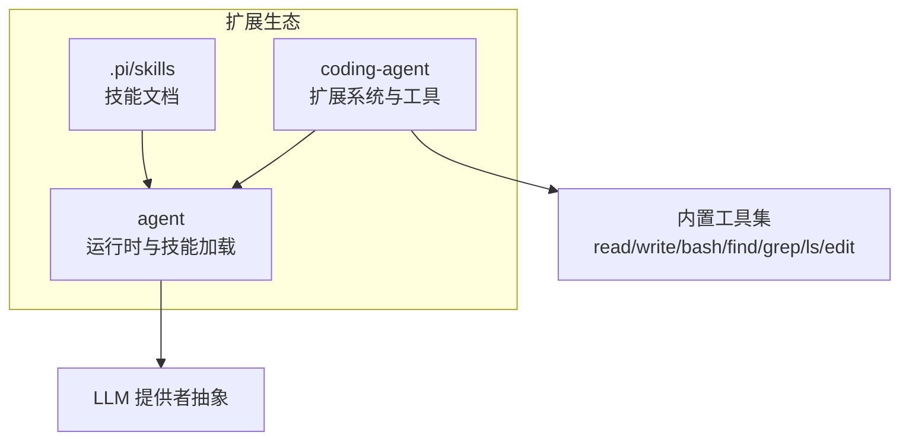
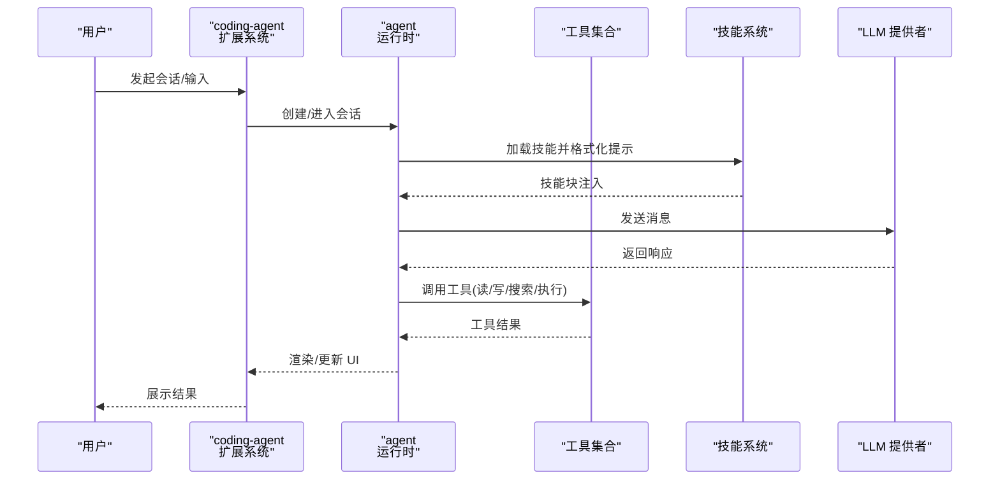
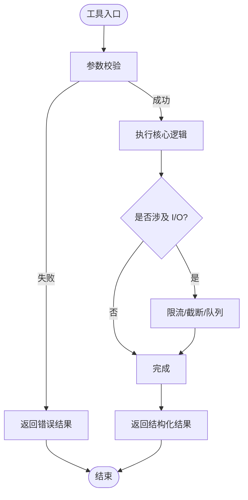
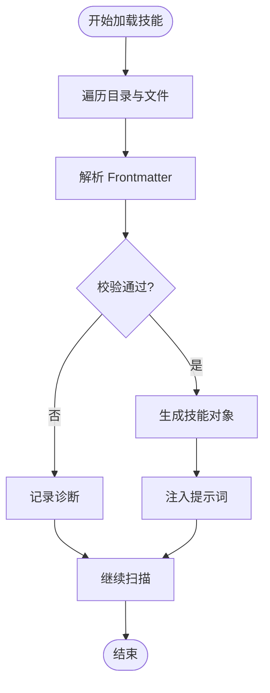
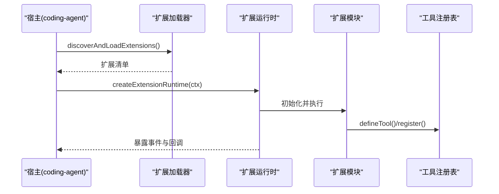
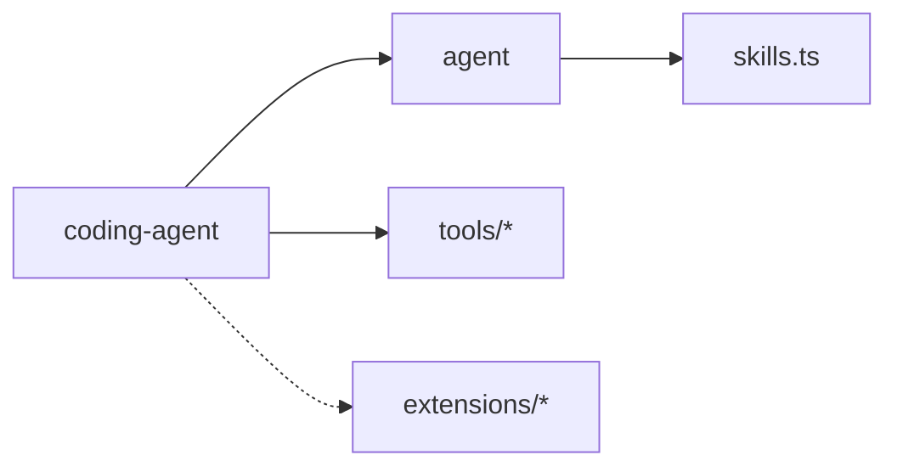

# 扩展开发

<cite>
**本文引用的文件**
- [README.md](file://README.md)
- [CONTRIBUTING.md](file://CONTRIBUTING.md)
- [packages/agent/src/index.ts](file://packages/agent/src/index.ts)
- [packages/agent/src/harness/skills.ts](file://packages/agent/src/harness/skills.ts)
- [packages/coding-agent/src/index.ts](file://packages/coding-agent/src/index.ts)
- [packages/coding-agent/src/core/extensions/index.ts](file://packages/coding-agent/src/core/extensions/index.ts)
- [packages/coding-agent/src/core/tools/index.ts](file://packages/coding-agent/src/core/tools/index.ts)
- [packages/coding-agent/src/core/tools/read.ts](file://packages/coding-agent/src/core/tools/read.ts)
- [packages/coding-agent/src/core/tools/write.ts](file://packages/coding-agent/src/core/tools/write.ts)
- [packages/coding-agent/src/core/tools/bash.ts](file://packages/coding-agent/src/core/tools/bash.ts)
- [packages/coding-agent/src/core/tools/find.ts](file://packages/coding-agent/src/core/tools/find.ts)
- [packages/coding-agent/src/core/tools/grep.ts](file://packages/coding-agent/src/core/tools/grep.ts)
- [packages/coding-agent/src/core/tools/ls.ts](file://packages/coding-agent/src/core/tools/ls.ts)
- [packages/coding-agent/src/core/tools/edit.ts](file://packages/coding-agent/src/core/tools/edit.ts)
- [packages/coding-agent/docs/containerization.md](file://packages/coding-agent/docs/containerization.md)
- [packages/coding-agent/docs/custom-provider.md](file://packages/coding-agent/docs/custom-provider.md)
- [.pi/skills/add-llm-provider.md](file://.pi/skills/add-llm-provider.md)
</cite>

## 目录
1. [简介](#简介)
2. [项目结构](#项目结构)
3. [核心组件](#核心组件)
4. [架构总览](#架构总览)
5. [详细组件分析](#详细组件分析)
6. [依赖分析](#依赖分析)
7. [性能考虑](#性能考虑)
8. [故障排查指南](#故障排查指南)
9. [结论](#结论)
10. [附录](#附录)

## 简介
本指南面向希望为 Pi Agent Harness 开发扩展的工程师，覆盖以下主题：
- 自定义工具接口规范、参数校验与错误处理
- 技能系统的工作原理与工作流封装
- 插件机制：动态加载与管理扩展
- 完整开发流程：开发、测试、调试、打包、发布
- 依赖管理与版本控制策略
- 安全与权限控制（含容器化隔离）
- 实战示例：文件处理工具、代码分析工具、外部 API 集成
- 测试策略与调试技巧
- 扩展分发与社区贡献指南

## 项目结构
仓库采用多包 monorepo 组织，核心扩展能力集中在 agent 与 coding-agent 两个包中：
- packages/agent：Agent 运行时、工具调用、状态管理、技能加载等
- packages/coding-agent：交互式 CLI、会话管理、扩展系统、内置工具集、UI 组件等
- .pi/skills：用户级技能定义（Markdown + Frontmatter）
- README/CONTRIBUTING：构建、测试、贡献与安全说明

图表来源
- [packages/coding-agent/src/index.ts:52-167](file://packages/coding-agent/src/index.ts#L52-L167)
- [packages/agent/src/index.ts:78-137](file://packages/agent/src/index.ts#L78-L137)
- [packages/coding-agent/src/core/tools/index.ts](file://packages/coding-agent/src/core/tools/index.ts)

章节来源
- [README.md:26-46](file://README.md#L26-L46)
- [CONTRIBUTING.md:56-67](file://CONTRIBUTING.md#L56-L67)

## 核心组件
- 扩展系统（Extension System）
  - 提供扩展生命周期事件、命令注册、工具注册、UI 上下文、键绑定等能力
  - 通过 discoverAndLoadExtensions、createExtensionRuntime 等入口进行发现与运行
- 工具系统（Tools）
  - 统一工具定义与执行模型，支持 read/write/bash/find/grep/ls/edit 等内置工具
  - 提供 defineTool、wrapRegisteredTool(s)、类型守卫等辅助
- 技能系统（Skills）
  - 基于 Markdown + YAML Frontmatter 的技能描述，自动扫描并注入到提示词
  - 支持忽略规则、名称与描述校验、诊断信息收集

章节来源
- [packages/coding-agent/src/core/extensions/index.ts:1-187](file://packages/coding-agent/src/core/extensions/index.ts#L1-L187)
- [packages/coding-agent/src/index.ts:52-167](file://packages/coding-agent/src/index.ts#L52-L167)
- [packages/agent/src/harness/skills.ts:37-101](file://packages/agent/src/harness/skills.ts#L37-L101)

## 架构总览
下图展示了扩展、工具、技能与 Agent 运行时的交互关系。

图表来源
- [packages/coding-agent/src/index.ts:52-167](file://packages/coding-agent/src/index.ts#L52-L167)
- [packages/agent/src/index.ts:78-137](file://packages/agent/src/index.ts#L78-L137)
- [packages/agent/src/harness/skills.ts:37-101](file://packages/agent/src/harness/skills.ts#L37-L101)

## 详细组件分析

### 自定义工具开发
- 工具接口规范
  - 使用 defineTool 声明工具元数据（名称、描述、参数 schema 等）
  - 实现执行函数，接收上下文与参数，返回结构化结果
  - 可使用 wrapRegisteredTool/wrapRegisteredTools 对已有工具进行包装或组合
- 参数验证
  - 在工具入口处校验必填字段、类型与取值范围
  - 对超大输入进行截断与限流，避免内存与 I/O 压力
- 错误处理
  - 区分可恢复与不可恢复错误，返回明确的错误码与消息
  - 记录诊断信息，便于定位问题
- 典型内置工具参考
  - 文件读取：read.ts
  - 文件写入：write.ts
  - 命令行执行：bash.ts
  - 文件查找：find.ts
  - 内容检索：grep.ts
  - 目录列表：ls.ts
  - 编辑与差异：edit.ts

图表来源
- [packages/coding-agent/src/core/tools/read.ts](file://packages/coding-agent/src/core/tools/read.ts)
- [packages/coding-agent/src/core/tools/write.ts](file://packages/coding-agent/src/core/tools/write.ts)
- [packages/coding-agent/src/core/tools/bash.ts](file://packages/coding-agent/src/core/tools/bash.ts)
- [packages/coding-agent/src/core/tools/find.ts](file://packages/coding-agent/src/core/tools/find.ts)
- [packages/coding-agent/src/core/tools/grep.ts](file://packages/coding-agent/src/core/tools/grep.ts)
- [packages/coding-agent/src/core/tools/ls.ts](file://packages/coding-agent/src/core/tools/ls.ts)
- [packages/coding-agent/src/core/tools/edit.ts](file://packages/coding-agent/src/core/tools/edit.ts)

章节来源
- [packages/coding-agent/src/core/extensions/index.ts:174-187](file://packages/coding-agent/src/core/extensions/index.ts#L174-L187)
- [packages/coding-agent/src/index.ts:276-324](file://packages/coding-agent/src/index.ts#L276-L324)

### 技能系统（Skills）
- 工作原理
  - 从指定目录递归扫描 SKILL.md 或根级 .md 文件
  - 解析 YAML Frontmatter，提取 name/description/disable-model-invocation 等元数据
  - 将技能内容以固定格式注入到系统提示中，供模型按需调用
- 忽略规则
  - 支持 .gitignore/.ignore/.fdignore 等忽略文件，按相对路径匹配
- 校验与诊断
  - 校验名称长度、字符集、前后缀等；描述非空且不超过上限
  - 对读取、解析、列出目录等操作产生诊断告警

图表来源
- [packages/agent/src/harness/skills.ts:43-101](file://packages/agent/src/harness/skills.ts#L43-L101)
- [packages/agent/src/harness/skills.ts:177-241](file://packages/agent/src/harness/skills.ts#L177-L241)
- [packages/agent/src/harness/skills.ts:243-326](file://packages/agent/src/harness/skills.ts#L243-L326)

章节来源
- [packages/agent/src/harness/skills.ts:37-101](file://packages/agent/src/harness/skills.ts#L37-L101)
- [packages/agent/src/harness/skills.ts:177-241](file://packages/agent/src/harness/skills.ts#L177-L241)
- [packages/agent/src/harness/skills.ts:243-326](file://packages/agent/src/harness/skills.ts#L243-L326)
- [.pi/skills/add-llm-provider.md](file://.pi/skills/add-llm-provider.md)

### 插件机制（扩展加载与运行）
- 发现与加载
  - discoverAndLoadExtensions：根据约定路径与配置发现扩展模块
  - createExtensionRuntime：创建扩展运行环境，注入会话、工具、UI 等上下文
- 生命周期事件
  - 会话启动/切换/关闭、工具调用前后、消息渲染等钩子
- 工具注册与包装
  - defineTool 注册新工具；wrapRegisteredTool(s) 用于增强或拦截现有工具行为
- 类型与事件
  - 丰富的类型定义保障扩展与宿主之间的契约稳定

图表来源
- [packages/coding-agent/src/core/extensions/index.ts:1-187](file://packages/coding-agent/src/core/extensions/index.ts#L1-L187)
- [packages/coding-agent/src/index.ts:52-167](file://packages/coding-agent/src/index.ts#L52-L167)

章节来源
- [packages/coding-agent/src/core/extensions/index.ts:1-187](file://packages/coding-agent/src/core/extensions/index.ts#L1-L187)
- [packages/coding-agent/src/index.ts:52-167](file://packages/coding-agent/src/index.ts#L52-L167)

### 安全与权限控制
- 默认行为
  - 未内置细粒度权限系统，默认以进程用户权限运行
- 隔离建议
  - 使用容器化或沙箱限制文件系统、进程、网络与凭据访问
  - 推荐模式：本地微 VM、Docker 容器、OpenShell 策略沙箱
- 供应链加固
  - 依赖锁定、审计、最小化脚本执行等

章节来源
- [README.md:38-46](file://README.md#L38-L46)
- [packages/coding-agent/docs/containerization.md](file://packages/coding-agent/docs/containerization.md)
- [README.md:76-88](file://README.md#L76-L88)

### 实战示例

#### 示例一：文件处理工具（读/写/列目录）
- 目标：封装常用文件操作，提供统一的参数校验、错误处理与输出截断
- 步骤
  - 使用 defineTool 声明工具元数据与参数 schema
  - 实现执行函数，调用 read/write/ls 等内置能力
  - 对大文件进行分块读取与可视化截断
  - 捕获并上报诊断信息
- 参考实现位置
  - [packages/coding-agent/src/core/tools/read.ts](file://packages/coding-agent/src/core/tools/read.ts)
  - [packages/coding-agent/src/core/tools/write.ts](file://packages/coding-agent/src/core/tools/write.ts)
  - [packages/coding-agent/src/core/tools/ls.ts](file://packages/coding-agent/src/core/tools/ls.ts)

章节来源
- [packages/coding-agent/src/core/tools/read.ts](file://packages/coding-agent/src/core/tools/read.ts)
- [packages/coding-agent/src/core/tools/write.ts](file://packages/coding-agent/src/core/tools/write.ts)
- [packages/coding-agent/src/core/tools/ls.ts](file://packages/coding-agent/src/core/tools/ls.ts)

#### 示例二：代码分析工具（查找/检索）
- 目标：提供跨项目的代码片段检索与上下文聚合
- 步骤
  - 使用 find/grep 组合，限定语言与路径
  - 对结果进行去重、排序与摘要
  - 结合技能系统注入分析模板
- 参考实现位置
  - [packages/coding-agent/src/core/tools/find.ts](file://packages/coding-agent/src/core/tools/find.ts)
  - [packages/coding-agent/src/core/tools/grep.ts](file://packages/coding-agent/src/core/tools/grep.ts)
  - [packages/agent/src/harness/skills.ts:37-101](file://packages/agent/src/harness/skills.ts#L37-L101)

章节来源
- [packages/coding-agent/src/core/tools/find.ts](file://packages/coding-agent/src/core/tools/find.ts)
- [packages/coding-agent/src/core/tools/grep.ts](file://packages/coding-agent/src/core/tools/grep.ts)
- [packages/agent/src/harness/skills.ts:37-101](file://packages/agent/src/harness/skills.ts#L37-L101)

#### 示例三：外部 API 集成（自定义提供者）
- 目标：接入第三方 LLM 或 HTTP 服务
- 步骤
  - 参照 custom-provider 文档定义提供者配置与认证方式
  - 在扩展中注册提供者，并在工具或服务中调用
- 参考实现位置
  - [packages/coding-agent/docs/custom-provider.md](file://packages/coding-agent/docs/custom-provider.md)

章节来源
- [packages/coding-agent/docs/custom-provider.md](file://packages/coding-agent/docs/custom-provider.md)

### 开发工作流程
- 开发
  - 安装依赖并构建：npm install --ignore-scripts、npm run build
  - 使用 pi-test.sh/pi-test.bat/pi-test.ps1 运行测试
- 调试
  - 利用扩展事件与工具执行事件进行断点与日志追踪
  - 使用技能注入快速验证提示词效果
- 测试
  - 单元测试：针对工具参数校验、错误分支
  - 集成测试：端到端调用链（会话→工具→LLM）
- 打包与发布
  - 遵循仓库的发布脚本与 shrinkwrap 策略
  - 使用 release:local 进行本地冒烟测试
- 贡献
  - 提交前必须通过 npm run check 与 ./test.sh
  - 遵循贡献指南与质量门槛

章节来源
- [README.md:52-88](file://README.md#L52-L88)
- [CONTRIBUTING.md:56-67](file://CONTRIBUTING.md#L56-L67)

## 依赖分析
- 包间依赖
  - coding-agent 依赖 agent 提供的运行时与技能加载能力
  - 工具子系统由 coding-agent 内部 tools 目录实现，并通过 index 聚合导出
- 扩展与宿主耦合
  - 通过类型与事件契约解耦，降低直接依赖风险
- 外部依赖
  - 供应链加固：依赖锁定、审计、最小化脚本执行

图表来源
- [packages/coding-agent/src/index.ts:52-167](file://packages/coding-agent/src/index.ts#L52-L167)
- [packages/agent/src/index.ts:78-137](file://packages/agent/src/index.ts#L78-L137)
- [packages/agent/src/harness/skills.ts:37-101](file://packages/agent/src/harness/skills.ts#L37-L101)

章节来源
- [README.md:76-88](file://README.md#L76-L88)

## 性能考虑
- 工具层
  - 对大文件读写进行分块与截断，避免 OOM
  - 批量操作合并 I/O，减少系统调用次数
- 技能加载
  - 忽略无关目录与文件，减少扫描开销
- 扩展事件
  - 避免在热路径中进行重型计算，必要时异步化
- 供应链
  - 使用精确版本与 shrinkwrap，减少解析与安装时间

[本节为通用指导，不直接分析具体文件]

## 故障排查指南
- 常见问题
  - 技能加载失败：检查 Frontmatter 语法、名称与描述约束、忽略规则
  - 工具执行异常：确认参数校验、权限、路径存在性与大小限制
  - 扩展加载失败：核对扩展清单、运行时上下文与事件订阅
- 定位方法
  - 启用扩展与工具执行事件监听，打印关键上下文
  - 查看技能加载的诊断信息，定位具体文件与行号
- 参考实现
  - 技能诊断与校验逻辑
  - 工具错误分类与消息格式化

章节来源
- [packages/agent/src/harness/skills.ts:177-241](file://packages/agent/src/harness/skills.ts#L177-L241)
- [packages/agent/src/harness/skills.ts:243-326](file://packages/agent/src/harness/skills.ts#L243-L326)
- [packages/coding-agent/src/core/extensions/index.ts:1-187](file://packages/coding-agent/src/core/extensions/index.ts#L1-L187)

## 结论
Pi 的扩展体系围绕“工具 + 技能 + 扩展”三层展开：工具提供原子能力，技能封装工作流，扩展负责编排与集成。通过严格的参数校验、完善的错误处理与安全的容器化隔离，开发者可以高效构建可复用、可维护的扩展。遵循仓库的构建、测试与发布流程，配合供应链加固策略，能够保证扩展的稳定与可信。

## 附录
- 快速上手
  - 阅读 skills 示例与自定义提供者文档
  - 使用 defineTool 编写第一个工具，并通过扩展事件验证
- 最佳实践
  - 明确工具边界与错误语义
  - 使用技能模板统一提示词风格
  - 在扩展中集中管理配置与凭据
- 社区贡献
  - 遵循 CONTRIBUTING 的质量门槛与流程
  - 提交前确保 lint、类型检查与测试通过

[本节为通用指导，不直接分析具体文件]