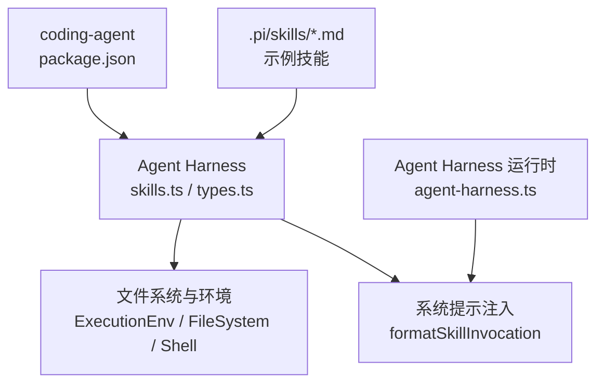
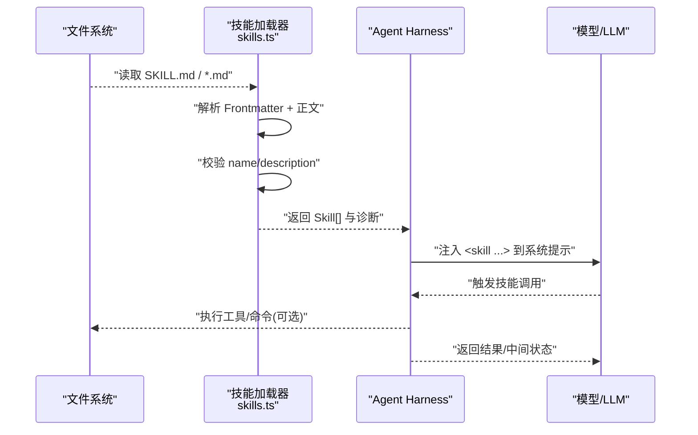
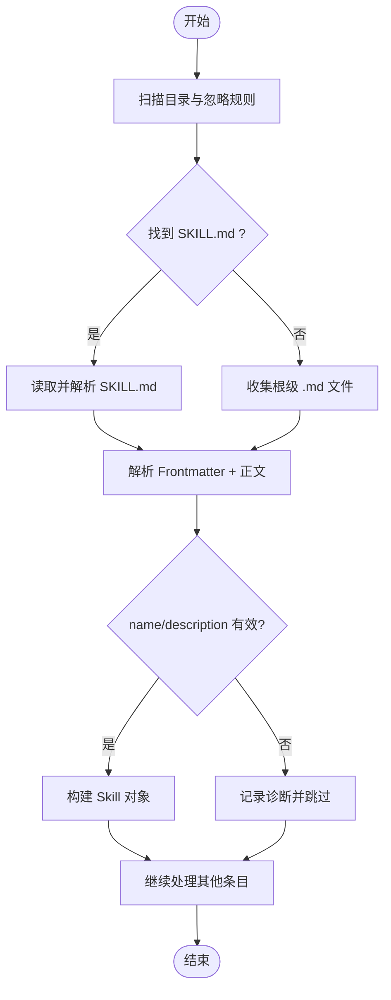
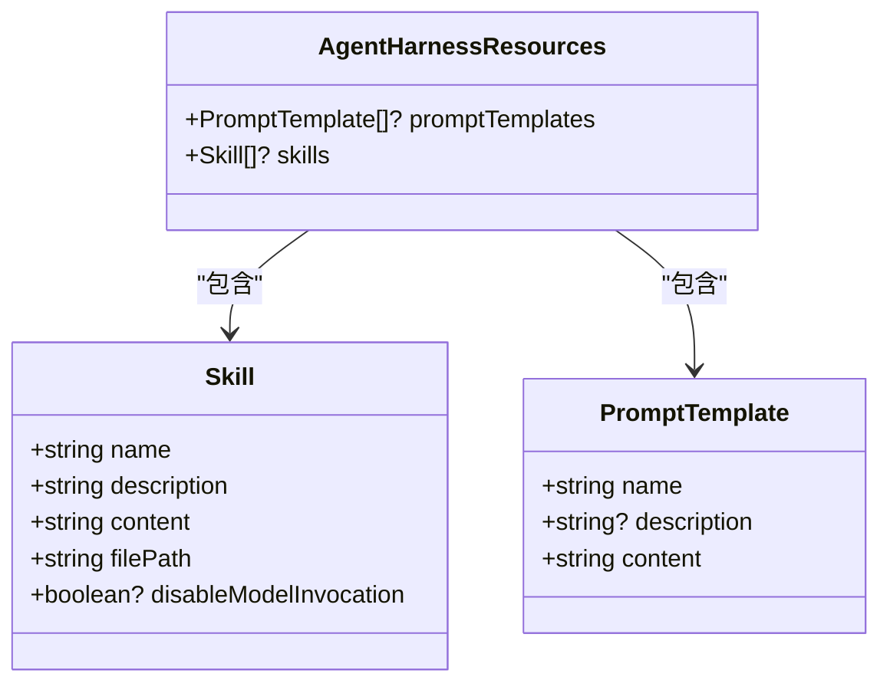
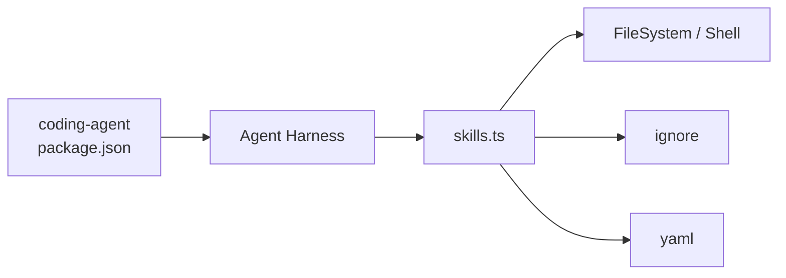

# 技能系统

<cite>
**本文引用的文件**
- [packages/agent/src/harness/skills.ts](file://packages/agent/src/harness/skills.ts)
- [packages/agent/src/harness/types.ts](file://packages/agent/src/harness/types.ts)
- [packages/agent/src/harness/agent-harness.ts](file://packages/agent/src/harness/agent-harness.ts)
- [.pi/skills/add-llm-provider.md](file://.pi/skills/add-llm-provider.md)
- [packages/coding-agent/package.json](file://packages/coding-agent/package.json)
- [README.md](file://README.md)
</cite>

## 目录
1. [简介](#简介)
2. [项目结构](#项目结构)
3. [核心组件](#核心组件)
4. [架构总览](#架构总览)
5. [详细组件分析](#详细组件分析)
6. [依赖关系分析](#依赖关系分析)
7. [性能考量](#性能考量)
8. [故障排查指南](#故障排查指南)
9. [结论](#结论)
10. [附录](#附录)

## 简介
本文件系统化阐述“技能系统”的概念、工作原理与实现细节。技能是以 Markdown 文档形式封装的“可被智能体识别与调用的任务模板”，通过统一的前置元数据（Frontmatter）与内容体，将常用工作流标准化为可复用、可组合、可诊断的单元。技能由 Agent Harness 加载并注入到系统提示中，供模型在对话过程中按需调用；同时支持显式调用与参数化扩展，便于构建复杂业务流程。

## 项目结构
技能系统主要位于 agent 包的 harness 子系统中，负责技能的发现、解析、校验与格式化；coding-agent 包提供运行入口与配置约定；根级 .pi/skills 目录存放示例技能。

图表来源
- [packages/coding-agent/package.json:6-8](file://packages/coding-agent/package.json#L6-L8)
- [packages/agent/src/harness/skills.ts:37-41](file://packages/agent/src/harness/skills.ts#L37-L41)
- [packages/agent/src/harness/types.ts:222-315](file://packages/agent/src/harness/types.ts#L222-L315)

章节来源
- [packages/coding-agent/package.json:6-8](file://packages/coding-agent/package.json#L6-L8)
- [README.md:17-34](file://README.md#L17-L34)

## 核心组件
- 技能定义与数据结构：Skill、PromptTemplate、AgentHarnessResources
- 技能加载器：loadSkills、loadSourcedSkills
- 技能格式化：formatSkillInvocation
- 执行环境抽象：FileSystem、Shell、ExecutionEnv
- 诊断与错误：SkillDiagnostic、Result、FileError、ExecutionError

章节来源
- [packages/agent/src/harness/types.ts:40-78](file://packages/agent/src/harness/types.ts#L40-L78)
- [packages/agent/src/harness/types.ts:128-315](file://packages/agent/src/harness/types.ts#L128-L315)
- [packages/agent/src/harness/skills.ts:11-28](file://packages/agent/src/harness/skills.ts#L11-L28)
- [packages/agent/src/harness/skills.ts:37-41](file://packages/agent/src/harness/skills.ts#L37-L41)
- [packages/agent/src/harness/skills.ts:49-101](file://packages/agent/src/harness/skills.ts#L49-L101)

## 架构总览
技能从磁盘上的 Markdown 文件加载，解析 Frontmatter 与正文，进行名称与描述校验，生成标准化的 Skill 对象，并通过 formatSkillInvocation 包装成 XML 块注入系统提示。Agent Harness 在运行时根据上下文选择并调用相应技能，结合工具与外部能力完成工作流。

图表来源
- [packages/agent/src/harness/skills.ts:49-75](file://packages/agent/src/harness/skills.ts#L49-L75)
- [packages/agent/src/harness/skills.ts:243-288](file://packages/agent/src/harness/skills.ts#L243-L288)
- [packages/agent/src/harness/skills.ts:37-41](file://packages/agent/src/harness/skills.ts#L37-L41)
- [packages/agent/src/harness/types.ts:222-315](file://packages/agent/src/harness/types.ts#L222-L315)

## 详细组件分析

### 技能定义格式与生命周期
- 文件位置与发现
  - 递归扫描指定目录，优先识别每个子目录下的 SKILL.md；若未找到，则收集根级 .md 文件作为候选技能。
  - 支持忽略规则：.gitignore、.ignore、.fdignore 中的模式会被加载并应用于路径匹配。
- Frontmatter 字段
  - name：技能稳定名称，需与父目录名一致且符合命名规范（小写字母、数字、短横线）。
  - description：模型可见的描述，必填且长度受限。
  - disable-model-invocation：可选开关，用于隐藏技能但允许应用显式调用。
- 正文内容
  - 作为技能指令的主体，将被包裹在 <skill> 标签中注入系统提示。
- 诊断与容错
  - 对文件读取失败、列表失败、解析失败、元数据无效等场景输出诊断信息，不中断整体加载流程。

图表来源
- [packages/agent/src/harness/skills.ts:49-75](file://packages/agent/src/harness/skills.ts#L49-L75)
- [packages/agent/src/harness/skills.ts:103-175](file://packages/agent/src/harness/skills.ts#L103-L175)
- [packages/agent/src/harness/skills.ts:177-241](file://packages/agent/src/harness/skills.ts#L177-L241)
- [packages/agent/src/harness/skills.ts:243-288](file://packages/agent/src/harness/skills.ts#L243-L288)
- [packages/agent/src/harness/skills.ts:290-310](file://packages/agent/src/harness/skills.ts#L290-L310)

章节来源
- [packages/agent/src/harness/skills.ts:49-101](file://packages/agent/src/harness/skills.ts#L49-L101)
- [packages/agent/src/harness/skills.ts:243-310](file://packages/agent/src/harness/skills.ts#L243-L310)

### 技能格式化与注入
- 使用 formatSkillInvocation 将 Skill 包装为 XML 块，包含 name、location 与 content，并可选择追加用户附加指令。
- 该块按建议格式插入系统提示，使模型能够感知可用技能及其上下文。

章节来源
- [packages/agent/src/harness/skills.ts:37-41](file://packages/agent/src/harness/skills.ts#L37-L41)

### 执行环境与资源抽象
- FileSystem：提供跨后端一致的读写、列举、创建、删除、临时文件等操作，所有操作以 Result 返回，避免抛出异常。
- Shell：提供命令执行能力，支持超时、中止信号与标准输出/错误回调。
- ExecutionEnv：组合 FileSystem 与 Shell，供技能加载与执行使用。

章节来源
- [packages/agent/src/harness/types.ts:222-315](file://packages/agent/src/harness/types.ts#L222-L315)

### 技能组合与复用机制
- 多目录加载：loadSkills 接受单个或多个目录，聚合结果并汇总诊断。
- 带来源的技能：loadSourcedSkills 为每个技能附加 source 标记，便于追踪来源与应用层路由。
- 显式调用：Agent Harness 暴露 skill(name, additionalInstructions?) 方法，可在运行时直接调用特定技能并追加指令。

图表来源
- [packages/agent/src/harness/types.ts:40-78](file://packages/agent/src/harness/types.ts#L40-L78)

章节来源
- [packages/agent/src/harness/skills.ts:49-101](file://packages/agent/src/harness/skills.ts#L49-L101)
- [packages/agent/src/harness/agent-harness.ts:276-276](file://packages/agent/src/harness/agent-harness.ts#L276-L276)

### 状态管理与持久化
- 中间状态：技能执行期间可通过工具或 Shell 输出逐步反馈；Agent Harness 支持 per-turn 快照与上下文传递。
- 持久化：文件系统接口提供写入、追加、原子重命名等能力，可用于保存中间产物或最终结果；临时目录与临时文件接口便于清理。
- 错误恢复：所有 I/O 与执行均以 Result 返回，便于上层捕获并决定重试、降级或回滚策略。

章节来源
- [packages/agent/src/harness/types.ts:128-315](file://packages/agent/src/harness/types.ts#L128-L315)

### 开发最佳实践
- 模块化设计：将复杂流程拆分为多个小型技能，每个技能职责单一、描述清晰。
- 错误恢复：利用 Result 与诊断信息定位问题；对关键步骤设置超时与中止信号。
- 日志记录：通过 Shell 的标准输出/错误回调与文件系统落盘记录过程日志，便于调试与审计。
- 测试与验证：为新技能编写端到端用例，覆盖正常路径、边界条件与失败路径。

[本节为通用指导，不直接分析具体文件]

### 实际技能示例
- 代码重构技能：以 SKILL.md 描述重构目标、输入范围、约束与验收标准；通过工具读取/编辑代码，生成变更并提交。
- 测试生成技能：基于现有代码结构与类型定义，自动生成单元测试骨架与断言；通过 Shell 运行测试并报告结果。
- 文档更新技能：根据变更摘要与 API 变化，自动更新 README/CHANGELOG 等文档；保留版本信息与迁移指引。

[本节为概念性示例，不直接分析具体文件]

## 依赖关系分析
- coding-agent 包通过 package.json 的 piConfig 指定配置目录为 .pi，技能通常放置于 .pi/skills。
- Agent Harness 依赖 ExecutionEnv 提供的文件系统与 Shell 能力，解耦底层实现。
- 技能加载器依赖 ignore 与 yaml 库进行忽略规则匹配与 Frontmatter 解析。

图表来源
- [packages/coding-agent/package.json:6-8](file://packages/coding-agent/package.json#L6-L8)
- [packages/agent/src/harness/skills.ts:1-3](file://packages/agent/src/harness/skills.ts#L1-L3)
- [packages/agent/src/harness/types.ts:222-315](file://packages/agent/src/harness/types.ts#L222-L315)

章节来源
- [packages/coding-agent/package.json:6-8](file://packages/coding-agent/package.json#L6-L8)
- [packages/agent/src/harness/skills.ts:1-3](file://packages/agent/src/harness/skills.ts#L1-L3)

## 性能考量
- 批量加载：loadSkills 支持多目录一次性加载，减少重复开销。
- 忽略规则：通过 .gitignore 等规则过滤无关文件，降低 I/O 与解析成本。
- 延迟与超时：Shell.exec 支持超时与中止信号，避免长时间阻塞。
- 诊断聚合：诊断信息累积而非中断，提升加载鲁棒性。

[本节为通用指导，不直接分析具体文件]

## 故障排查指南
- 常见诊断码
  - file_info_failed：获取文件或目录信息失败
  - list_failed：列出目录失败
  - read_failed：读取文件失败
  - parse_failed：Frontmatter 解析失败
  - invalid_metadata：name/description 不符合规范
- 排查步骤
  - 检查技能文件是否存在且可读
  - 确认 Frontmatter 是否完整且合法
  - 查看忽略规则是否误过滤了技能文件
  - 通过诊断消息定位具体路径与原因

章节来源
- [packages/agent/src/harness/skills.ts:11-28](file://packages/agent/src/harness/skills.ts#L11-L28)
- [packages/agent/src/harness/skills.ts:243-310](file://packages/agent/src/harness/skills.ts#L243-L310)

## 结论
技能系统将“任务工作流”以标准化文档形式沉淀，借助统一的加载、校验与注入机制，使智能体能够在对话中灵活调用与组合。通过 ExecutionEnv 的抽象，技能具备跨平台与可扩展的执行能力；完善的诊断与错误处理保障了系统的健壮性。遵循模块化、可观测与可测试的最佳实践，可以高效构建复杂的业务流程。

[本节为总结性内容，不直接分析具体文件]

## 附录
- 示例技能参考：添加新 LLM Provider 的步骤清单可作为技能编写的参考范式，体现结构化步骤与检查点的设计思路。

章节来源
- [.pi/skills/add-llm-provider.md:1-58](file://.pi/skills/add-llm-provider.md#L1-L58)