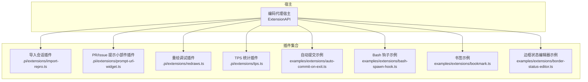
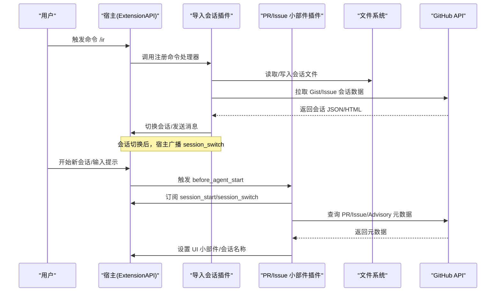
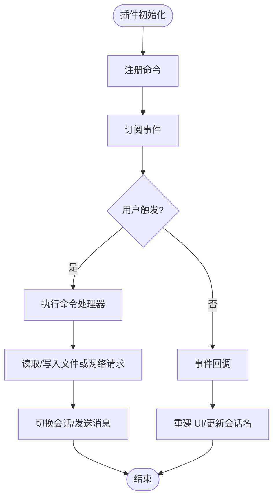
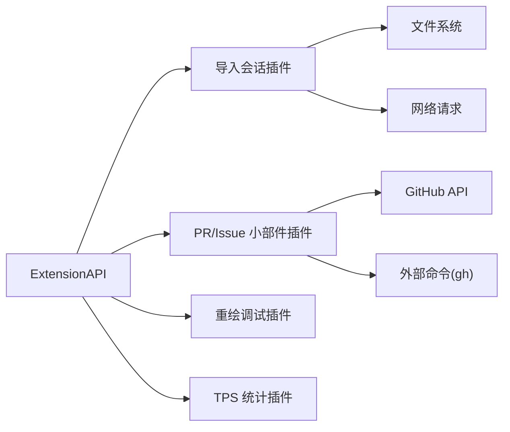

# 插件机制

<cite>
**本文引用的文件**
- [README.md](file://README.md)
- [import-repro.ts](file://.pi/extensions/import-repro.ts)
- [prompt-url-widget.ts](file://.pi/extensions/prompt-url-widget.ts)
- [redraws.ts](file://.pi/extensions/redraws.ts)
- [tps.ts](file://.pi/extensions/tps.ts)
- [auto-commit-on-exit.ts](file://packages/coding-agent/examples/extensions/auto-commit-on-exit.ts)
- [bash-spawn-hook.ts](file://packages/coding-agent/examples/extensions/bash-spawn-hook.ts)
- [bookmark.ts](file://packages/coding-agent/examples/extensions/bookmark.ts)
- [border-status-editor.ts](file://packages/coding-agent/examples/extensions/border-status-editor.ts)
</cite>

## 目录
1. [简介](#简介)
2. [项目结构](#项目结构)
3. [核心组件](#核心组件)
4. [架构总览](#架构总览)
5. [详细组件分析](#详细组件分析)
6. [依赖关系分析](#依赖关系分析)
7. [性能考量](#性能考量)
8. [故障排查指南](#故障排查指南)
9. [结论](#结论)
10. [附录](#附录)

## 简介
本文件面向希望理解并扩展 Pi 插件机制的开发者，系统阐述插件架构的设计原理、动态加载与管理方式、注册与生命周期、插件间通信、安全与隔离策略、开发框架与工具、打包分发与版本管理、热重载/热更新机制，以及实际示例与最佳实践。文档基于仓库中已实现的插件示例与相关说明进行归纳，确保内容可追溯、可验证。

## 项目结构
Pi 的插件体系由“宿主（coding-agent）+ 插件（位于 .pi/extensions 与 examples/extensions）”构成：
- 插件入口：每个插件以默认导出函数形式暴露，接收 ExtensionAPI 实例，用于注册命令、监听事件、操作 UI 等。
- 插件存放位置：
  - 用户级插件：.pi/extensions/*.ts
  - 示例插件：packages/coding-agent/examples/extensions/*.ts
- 宿主能力：通过 ExtensionAPI 暴露命令注册、事件订阅、会话管理、UI 控件、进程执行等能力；插件通过该 API 与宿主交互。

图表来源
- [import-repro.ts:283-351](file://.pi/extensions/import-repro.ts#L283-L351)
- [prompt-url-widget.ts:172-269](file://.pi/extensions/prompt-url-widget.ts#L172-L269)
- [redraws.ts:10-12](file://.pi/extensions/redraws.ts#L10-L12)
- [tps.ts:10-12](file://.pi/extensions/tps.ts#L10-L12)
- [auto-commit-on-exit.ts:10-12](file://packages/coding-agent/examples/extensions/auto-commit-on-exit.ts#L10-L12)
- [bash-spawn-hook.ts:10-14](file://packages/coding-agent/examples/extensions/bash-spawn-hook.ts#L10-L14)
- [bookmark.ts:10-16](file://packages/coding-agent/examples/extensions/bookmark.ts#L10-L16)
- [border-status-editor.ts:1-20](file://packages/coding-agent/examples/extensions/border-status-editor.ts#L1-L20)

章节来源
- [README.md:13-35](file://README.md#L13-L35)

## 核心组件
- 插件接口契约
  - 插件默认导出函数接收 ExtensionAPI，用于注册命令、监听事件、访问会话与 UI。
  - 典型能力包括：registerCommand、on、exec、setSessionName、getSessionName、ui.setWidget、sessionManager 等。
- 插件发现与加载
  - 插件以 TypeScript 文件形式存放在 .pi/extensions，由宿主在启动时扫描并加载。
  - 示例插件位于 packages/coding-agent/examples/extensions，便于学习与复用。
- 生命周期与事件
  - 插件通过事件总线订阅宿主生命周期事件，如 before_agent_start、session_start、session_switch 等，完成初始化与上下文重建。
- 命令注册
  - 插件通过 registerCommand 向宿主注册自定义命令，供用户在 CLI/TUI 中调用。
- UI 扩展
  - 插件可通过 ui.setWidget 在提示区域或侧边栏渲染自定义控件，展示元数据或状态信息。
- 外部工具集成
  - 插件可通过 exec 调用外部命令（如 gh），获取远程资源元数据或执行工作流。

章节来源
- [import-repro.ts:283-351](file://.pi/extensions/import-repro.ts#L283-L351)
- [prompt-url-widget.ts:172-269](file://.pi/extensions/prompt-url-widget.ts#L172-L269)
- [redraws.ts:10-12](file://.pi/extensions/redraws.ts#L10-L12)
- [tps.ts:10-12](file://.pi/extensions/tps.ts#L10-L12)
- [auto-commit-on-exit.ts:10-12](file://packages/coding-agent/examples/extensions/auto-commit-on-exit.ts#L10-L12)
- [bash-spawn-hook.ts:10-14](file://packages/coding-agent/examples/extensions/bash-spawn-hook.ts#L10-L14)
- [bookmark.ts:10-16](file://packages/coding-agent/examples/extensions/bookmark.ts#L10-L16)
- [border-status-editor.ts:1-20](file://packages/coding-agent/examples/extensions/border-status-editor.ts#L1-L20)

## 架构总览
下图展示了插件与宿主的交互关系：插件通过 ExtensionAPI 注册命令、订阅事件、操作 UI 和会话；宿主负责调度、权限控制与资源隔离。

图表来源
- [import-repro.ts:283-351](file://.pi/extensions/import-repro.ts#L283-L351)
- [prompt-url-widget.ts:172-269](file://.pi/extensions/prompt-url-widget.ts#L172-L269)

## 详细组件分析

### 插件发现与加载
- 插件位置
  - 用户插件：.pi/extensions/*.ts
  - 示例插件：packages/coding-agent/examples/extensions/*.ts
- 加载约定
  - 每个插件文件默认导出一个函数，接收 ExtensionAPI 实例。
  - 宿主在启动时扫描这些目录，按顺序加载并执行插件初始化逻辑。
- 配置与扩展点
  - 插件通过 ExtensionAPI 提供的能力进行功能扩展，无需修改宿主代码。

章节来源
- [import-repro.ts:283-351](file://.pi/extensions/import-repro.ts#L283-L351)
- [prompt-url-widget.ts:172-269](file://.pi/extensions/prompt-url-widget.ts#L172-L269)
- [redraws.ts:10-12](file://.pi/extensions/redraws.ts#L10-L12)
- [tps.ts:10-12](file://.pi/extensions/tps.ts#L10-L12)
- [auto-commit-on-exit.ts:10-12](file://packages/coding-agent/examples/extensions/auto-commit-on-exit.ts#L10-L12)
- [bash-spawn-hook.ts:10-14](file://packages/coding-agent/examples/extensions/bash-spawn-hook.ts#L10-L14)
- [bookmark.ts:10-16](file://packages/coding-agent/examples/extensions/bookmark.ts#L10-L16)
- [border-status-editor.ts:1-20](file://packages/coding-agent/examples/extensions/border-status-editor.ts#L1-L20)

### 插件注册机制（命令与事件）
- 命令注册
  - 使用 registerCommand 注册命令名与处理器，处理器可访问会话上下文、UI 通知、会话切换等能力。
- 事件订阅
  - 使用 on 订阅宿主事件，如 before_agent_start、session_start、session_switch，实现跨会话的状态同步与 UI 重建。
- 典型流程
  - 命令处理器解析参数 -> 访问会话管理器 -> 读写文件或网络 -> 切换会话或发送消息。
  - 事件回调根据当前会话内容重建 UI 或调整会话名称。

图表来源
- [import-repro.ts:283-351](file://.pi/extensions/import-repro.ts#L283-L351)
- [prompt-url-widget.ts:172-269](file://.pi/extensions/prompt-url-widget.ts#L172-L269)

章节来源
- [import-repro.ts:283-351](file://.pi/extensions/import-repro.ts#L283-L351)
- [prompt-url-widget.ts:172-269](file://.pi/extensions/prompt-url-widget.ts#L172-L269)

### 生命周期管理
- 关键事件
  - before_agent_start：在代理开始前处理提示内容与上下文。
  - session_start：会话开始时重建 UI 或恢复状态。
  - session_switch：会话切换时清理或迁移状态。
- 状态同步
  - 插件通过事件回调与会话管理器保持状态一致，例如根据最后一条用户消息重建提示小部件。

章节来源
- [prompt-url-widget.ts:220-269](file://.pi/extensions/prompt-url-widget.ts#L220-L269)

### 插件间通信与共享数据
- 事件总线
  - 插件通过宿主事件总线进行解耦通信，避免直接耦合。
- 会话上下文
  - 插件通过会话管理器访问当前会话条目、工作目录、会话名称等，实现数据共享。
- UI 小部件
  - 插件可在同一命名空间下设置/清除 UI 小部件，形成统一的展示面。

章节来源
- [prompt-url-widget.ts:172-269](file://.pi/extensions/prompt-url-widget.ts#L172-L269)
- [import-repro.ts:283-351](file://.pi/extensions/import-repro.ts#L283-L351)

### 安全沙箱、权限控制与资源隔离
- 权限模型
  - 默认情况下，Pi 以启动用户的权限运行，不包含内置的文件系统、进程、网络或凭据限制。
- 隔离建议
  - 如需更强边界，可将 Pi 容器化或沙箱化，参考 README 中的三种模式：Gondolin 扩展、Plain Docker、OpenShell。
- 插件影响面
  - 插件可调用外部命令（如 gh）、读写本地文件、发起网络请求，需遵循最小权限原则并在沙箱环境中运行。

章节来源
- [README.md:38-47](file://README.md#L38-L47)

### 插件开发框架（基础类、工具函数、配置管理）
- 基础能力
  - ExtensionAPI：提供命令注册、事件订阅、会话管理、UI 控件、进程执行等。
- 常用工具
  - 路径与平台处理、JSON/HTML 解析、正则匹配、网络请求封装等。
- 配置管理
  - 插件通常通过环境变量或配置文件注入密钥与选项；示例中通过 exec 调用 gh 获取 GitHub 元数据。

章节来源
- [import-repro.ts:283-351](file://.pi/extensions/import-repro.ts#L283-L351)
- [prompt-url-widget.ts:117-160](file://.pi/extensions/prompt-url-widget.ts#L117-L160)

### 插件打包与分发、版本管理与依赖解析
- 包与发布
  - 根 README 描述了 monorepo 构建与发布流程，包含 npm shrinkwrap、依赖锁定、审计与发布脚本。
- 版本管理
  - 直接外部依赖精确锁定，内部工作区包使用范围版本；发布前进行一致性检查与签名审计。
- 插件分发
  - 插件以 TS 文件形式随项目或独立仓库分发；宿主通过固定目录扫描加载，无需额外打包步骤。

章节来源
- [README.md:76-88](file://README.md#L76-L88)

### 热重载与热更新机制
- 现状说明
  - 仓库未提供内置的插件热重载/热更新机制；插件通常在宿主启动时加载。
- 替代方案
  - 可通过重启宿主或重新加载会话的方式应用变更；对于频繁迭代场景，建议在开发阶段使用示例插件快速验证。

[本节为概念性说明，不直接分析具体文件]

### 实际插件示例与最佳实践
- 导入会话插件（import-repro.ts）
  - 功能：从 Gist/Issue/URL 导入会话并切换到目标工作目录，重写路径兼容不同平台。
  - 要点：命令注册、会话切换、网络请求、错误提示。
- PR/Issue 小部件插件（prompt-url-widget.ts）
  - 功能：识别提示中的 PR/Issue/Advisory 链接，拉取元数据并渲染到 UI，自动设置会话名称。
  - 要点：事件订阅、UI 小部件、外部命令调用、异步元数据刷新。
- 其他示例
  - 自动提交、Bash 钩子、书签、边框状态编辑器等，展示命令注册、事件钩子、UI 编辑等常见模式。

章节来源
- [import-repro.ts:283-351](file://.pi/extensions/import-repro.ts#L283-L351)
- [prompt-url-widget.ts:172-269](file://.pi/extensions/prompt-url-widget.ts#L172-L269)
- [auto-commit-on-exit.ts:10-12](file://packages/coding-agent/examples/extensions/auto-commit-on-exit.ts#L10-L12)
- [bash-spawn-hook.ts:10-14](file://packages/coding-agent/examples/extensions/bash-spawn-hook.ts#L10-L14)
- [bookmark.ts:10-16](file://packages/coding-agent/examples/extensions/bookmark.ts#L10-L16)
- [border-status-editor.ts:1-20](file://packages/coding-agent/examples/extensions/border-status-editor.ts#L1-L20)

## 依赖关系分析
- 插件对宿主的依赖
  - 所有插件均依赖 ExtensionAPI，通过其能力与宿主交互。
- 插件间的解耦
  - 插件之间不直接相互引用，通过宿主事件与共享会话上下文协作。
- 外部依赖
  - 插件可能依赖 Node 标准库（fs、path、os）与第三方命令（gh），需注意权限与安全。

图表来源
- [import-repro.ts:283-351](file://.pi/extensions/import-repro.ts#L283-L351)
- [prompt-url-widget.ts:172-269](file://.pi/extensions/prompt-url-widget.ts#L172-L269)
- [redraws.ts:10-12](file://.pi/extensions/redraws.ts#L10-L12)
- [tps.ts:10-12](file://.pi/extensions/tps.ts#L10-L12)

章节来源
- [import-repro.ts:283-351](file://.pi/extensions/import-repro.ts#L283-L351)
- [prompt-url-widget.ts:172-269](file://.pi/extensions/prompt-url-widget.ts#L172-L269)

## 性能考量
- 网络请求优化
  - 对外部 API（如 GitHub）的请求应缓存结果、减少重复调用，避免阻塞 UI。
- I/O 操作
  - 文件读写应尽量批量与异步，避免在主线程长时间阻塞。
- UI 渲染
  - 小部件渲染应保持轻量，仅在必要时重建，避免频繁重绘。
- 事件处理
  - 事件回调应尽快返回，耗时任务放入后台队列或延迟执行。

[本节为通用指导，不直接分析具体文件]

## 故障排查指南
- 常见问题
  - 命令未生效：检查是否成功注册命令，确认宿主已加载插件。
  - 会话切换失败：检查会话文件路径与权限，确认目标目录存在且可写。
  - UI 小部件不显示：检查事件是否正确订阅，确认 hasUI 条件满足。
  - 外部命令失败：检查 gh 是否安装并配置正确，确认网络可达。
- 定位方法
  - 使用 ui.notify 输出调试信息，逐步缩小问题范围。
  - 查看会话条目与上下文，确认状态是否符合预期。

章节来源
- [import-repro.ts:283-351](file://.pi/extensions/import-repro.ts#L283-L351)
- [prompt-url-widget.ts:172-269](file://.pi/extensions/prompt-url-widget.ts#L172-L269)

## 结论
Pi 的插件机制以 ExtensionAPI 为核心，提供命令注册、事件订阅、会话与 UI 扩展能力。插件通过约定式目录与默认导出函数被宿主发现与加载，借助事件总线实现解耦通信。安全方面，默认无内置权限限制，推荐通过容器化或沙箱化增强隔离。开发上，示例插件提供了丰富的实践范式，便于快速上手与扩展。

[本节为总结性内容，不直接分析具体文件]

## 附录
- 快速上手
  - 在 .pi/extensions 下创建新的 .ts 文件，默认导出函数接收 ExtensionAPI，注册命令或订阅事件。
  - 参考示例插件，逐步添加功能并测试。
- 最佳实践
  - 最小权限原则：仅申请必要的文件系统、网络与进程访问。
  - 错误处理：对用户输入与外部依赖进行健壮校验与提示。
  - 性能优化：避免阻塞主线程，合理使用缓存与异步。

[本节为补充说明，不直接分析具体文件]