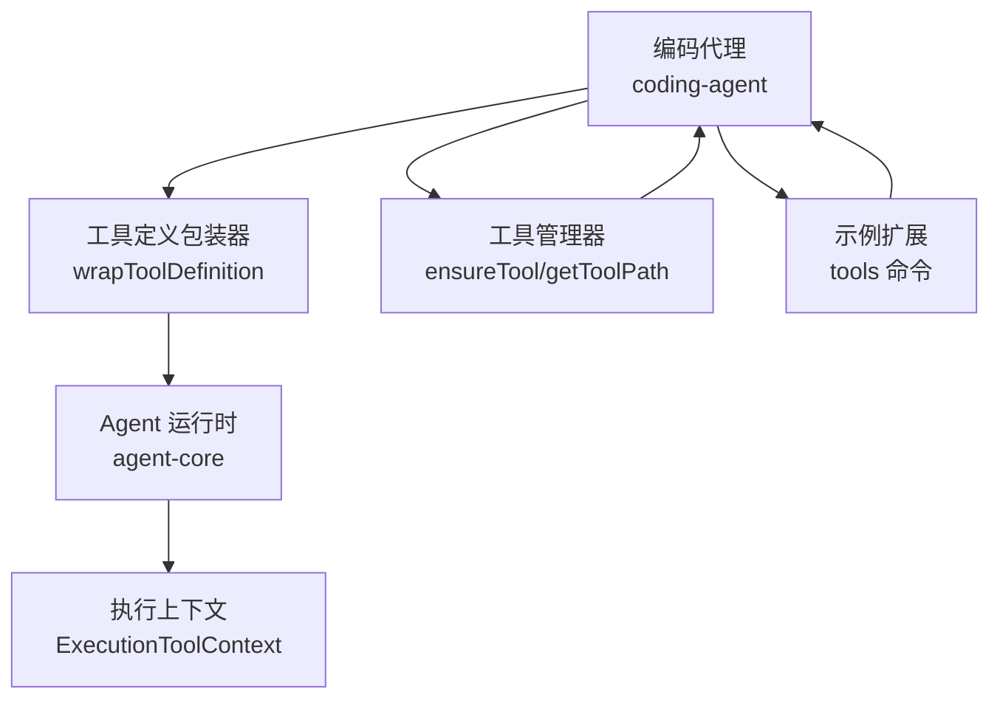
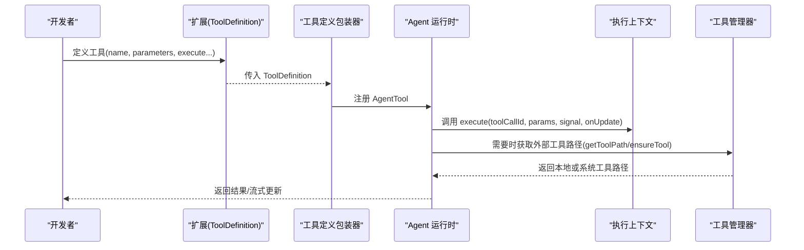
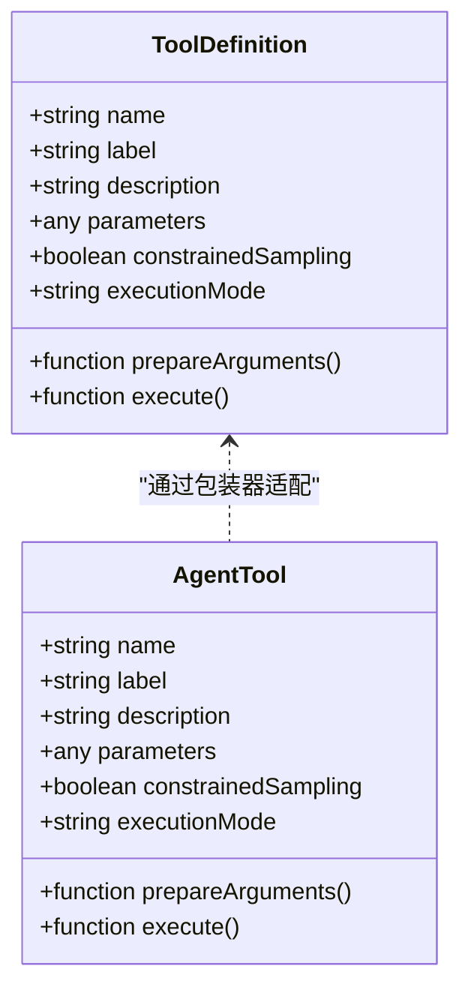
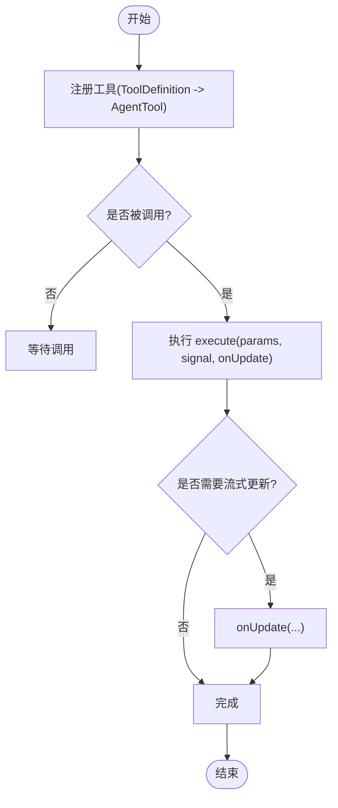
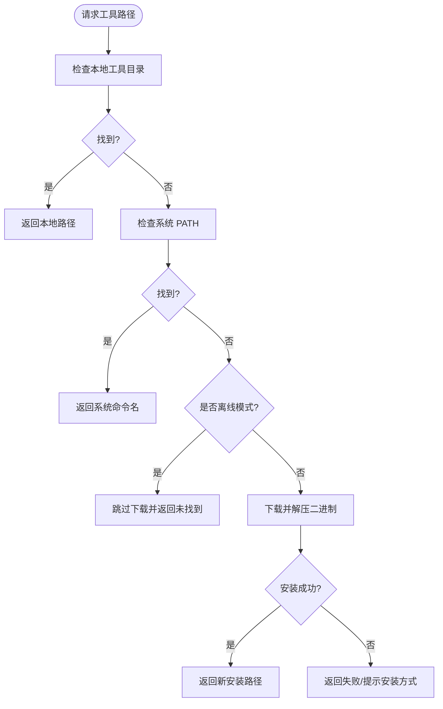
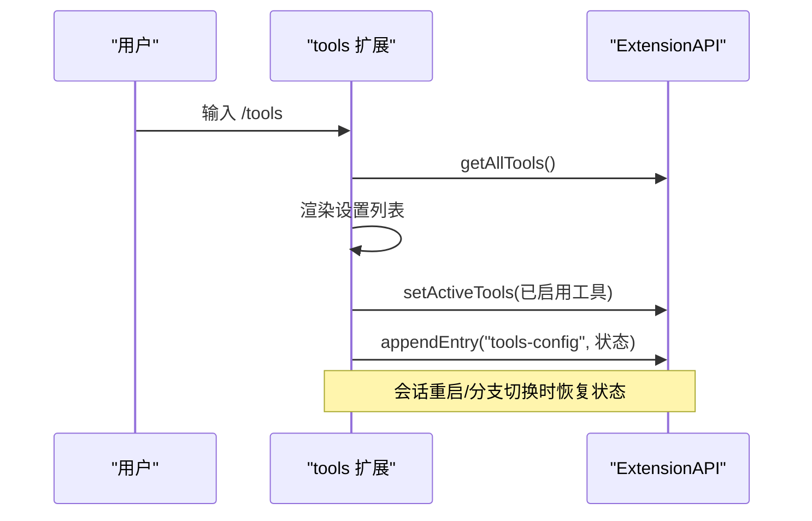
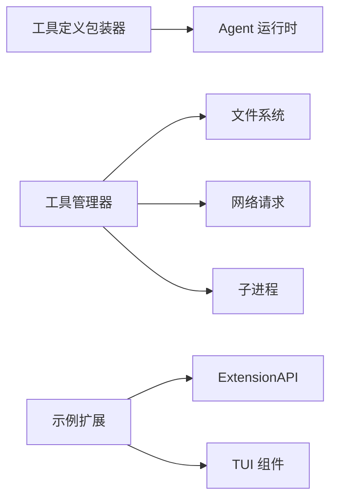

# 自定义工具开发

<cite>
**本文引用的文件**
- [README.md](file://README.md)
- [tool-definition-wrapper.ts](file://packages/coding-agent/src/core/tools/tool-definition-wrapper.ts)
- [tools-manager.ts](file://packages/coding-agent/src/utils/tools-manager.ts)
- [tools.ts](file://packages/coding-agent/examples/extensions/tools.ts)
- [tool-context.ts](file://packages/agent/src/harness/tools/tool-context.ts)
</cite>

## 目录
1. [简介](#简介)
2. [项目结构](#项目结构)
3. [核心组件](#核心组件)
4. [架构总览](#架构总览)
5. [详细组件分析](#详细组件分析)
6. [依赖关系分析](#依赖关系分析)
7. [性能考虑](#性能考虑)
8. [故障排查指南](#故障排查指南)
9. [结论](#结论)
10. [附录](#附录)

## 简介
本指南面向希望在 Pi Agent Harness 中开发“自定义工具”的工程师，围绕工具接口规范、生命周期管理、参数验证、错误处理、测试与调试、性能优化以及依赖管理与版本兼容性进行系统化说明。内容基于仓库中的实际实现，帮助你在不深入源码细节的前提下快速上手并写出健壮的工具。

## 项目结构
Pi 采用多包（monorepo）组织，与工具开发直接相关的代码主要分布在以下位置：
- 编码代理扩展与工具定义包装：packages/coding-agent/src/core/tools
- 外部二进制工具下载与管理：packages/coding-agent/src/utils
- 示例扩展（含工具启用/禁用交互）：packages/coding-agent/examples/extensions
- 执行上下文与内置工具所需环境：packages/agent/src/harness/tools

图表来源
- [tool-definition-wrapper.ts:1-48](file://packages/coding-agent/src/core/tools/tool-definition-wrapper.ts#L1-L48)
- [tools-manager.ts:1-372](file://packages/coding-agent/src/utils/tools-manager.ts#L1-L372)
- [tools.ts:1-147](file://packages/coding-agent/examples/extensions/tools.ts#L1-L147)
- [tool-context.ts:1-7](file://packages/agent/src/harness/tools/tool-context.ts#L1-L7)

章节来源
- [README.md:13-36](file://README.md#L13-L36)

## 核心组件
- 工具定义包装器：将扩展侧的 ToolDefinition 适配为 Agent 运行时可识别的 AgentTool，统一暴露 name、label、description、parameters、prepareArguments、executionMode、execute 等能力。
- 工具管理器：负责外部二进制工具（如 fd、rg）的自动发现、下载、解压与缓存，提供 getToolPath/ensureTool 等能力。
- 示例扩展：演示如何通过 /tools 命令动态启用/禁用工具，并将选择持久化到会话分支。
- 执行上下文：为内置执行类工具提供运行环境（如环境变量）的抽象入口。

章节来源
- [tool-definition-wrapper.ts:1-48](file://packages/coding-agent/src/core/tools/tool-definition-wrapper.ts#L1-L48)
- [tools-manager.ts:1-372](file://packages/coding-agent/src/utils/tools-manager.ts#L1-L372)
- [tools.ts:1-147](file://packages/coding-agent/examples/extensions/tools.ts#L1-L147)
- [tool-context.ts:1-7](file://packages/agent/src/harness/tools/tool-context.ts#L1-L7)

## 架构总览
下图展示了从“工具定义”到“运行时执行”的关键路径，以及与外部二进制工具的集成点。

图表来源
- [tool-definition-wrapper.ts:1-48](file://packages/coding-agent/src/core/tools/tool-definition-wrapper.ts#L1-L48)
- [tools-manager.ts:85-105](file://packages/coding-agent/src/utils/tools-manager.ts#L85-L105)
- [tools-manager.ts:326-372](file://packages/coding-agent/src/utils/tools-manager.ts#L326-L372)

## 详细组件分析

### 工具定义与接口规范
- 工具元数据：name、label、description 用于描述与展示；constrainedSampling、executionMode 控制采样与执行模式。
- 参数与校验：通过 parameters 声明参数结构；prepareArguments 可用于参数预处理与校验。
- 执行函数：execute(toolCallId, params, signal, onUpdate, ctx?) 是核心入口，支持取消信号与增量更新回调。
- 适配层：wrapToolDefinition 将扩展定义的 ToolDefinition 转换为 AgentTool；createToolDefinitionFromAgentTool 反向兼容。

图表来源
- [tool-definition-wrapper.ts:1-48](file://packages/coding-agent/src/core/tools/tool-definition-wrapper.ts#L1-L48)

章节来源
- [tool-definition-wrapper.ts:1-48](file://packages/coding-agent/src/core/tools/tool-definition-wrapper.ts#L1-L48)

### 工具生命周期管理
- 注册：扩展通过 ToolDefinition 暴露工具，由包装器转为 AgentTool 后交由运行时管理。
- 调用：运行时根据 toolCallId 分发到具体 execute，支持 signal 取消与 onUpdate 流式输出。
- 销毁：当会话结束或工具被移除时，由运行时回收资源；建议在 execute 中监听 signal 及时释放。

图表来源
- [tool-definition-wrapper.ts:1-48](file://packages/coding-agent/src/core/tools/tool-definition-wrapper.ts#L1-L48)

章节来源
- [tool-definition-wrapper.ts:1-48](file://packages/coding-agent/src/core/tools/tool-definition-wrapper.ts#L1-L48)

### 参数验证机制
- 类型检查：在 prepareArguments 中对入参进行类型与格式校验，确保下游 execute 获得安全数据。
- 必填字段：在 prepareArguments 中校验必需字段是否存在且非空。
- 默认值处理：对可选字段提供合理默认值，避免下游出现 undefined。
- 建议：结合 JSON Schema 或轻量校验库，集中维护参数契约，便于测试与维护。

章节来源
- [tool-definition-wrapper.ts:1-48](file://packages/coding-agent/src/core/tools/tool-definition-wrapper.ts#L1-L48)

### 错误处理策略
- 异常捕获：在 execute 内部使用 try/catch 包裹关键逻辑，统一捕获并返回结构化错误信息。
- 错误格式化：将错误消息标准化（包含 code、message、details），便于前端展示与日志追踪。
- 重试机制：对于网络或外部依赖失败，可在上层封装重试策略（指数退避、最大重试次数）。
- 取消支持：响应 signal 中断，避免无效计算与资源泄漏。

章节来源
- [tool-definition-wrapper.ts:1-48](file://packages/coding-agent/src/core/tools/tool-definition-wrapper.ts#L1-L48)

### 外部二进制工具集成（fd/rg）
- 自动发现：优先查找本地工具目录，其次尝试系统 PATH 中的同名命令。
- 自动下载：若未找到，则从 GitHub Releases 下载对应平台二进制，解压并缓存至本地工具目录。
- 离线模式：可通过环境变量关闭自动下载行为，避免在无网环境下阻塞。
- 跨平台兼容：针对 Windows/macOS/Linux 的不同归档格式与解压命令进行处理。

图表来源
- [tools-manager.ts:85-105](file://packages/coding-agent/src/utils/tools-manager.ts#L85-L105)
- [tools-manager.ts:107-139](file://packages/coding-agent/src/utils/tools-manager.ts#L107-L139)
- [tools-manager.ts:242-318](file://packages/coding-agent/src/utils/tools-manager.ts#L242-L318)
- [tools-manager.ts:326-372](file://packages/coding-agent/src/utils/tools-manager.ts#L326-L372)

章节来源
- [tools-manager.ts:1-372](file://packages/coding-agent/src/utils/tools-manager.ts#L1-L372)

### 工具启用/禁用与状态持久化（示例）
- 交互命令：通过 /tools 命令打开 TUI 界面，勾选启用/禁用工具。
- 状态同步：实时调用 setActiveTools 应用当前选择，并通过 appendEntry 将选择写入会话分支。
- 恢复策略：会话启动或树导航时，从当前分支恢复上次选择的工具集合。

图表来源
- [tools.ts:21-64](file://packages/coding-agent/examples/extensions/tools.ts#L21-L64)
- [tools.ts:66-145](file://packages/coding-agent/examples/extensions/tools.ts#L66-L145)

章节来源
- [tools.ts:1-147](file://packages/coding-agent/examples/extensions/tools.ts#L1-L147)

### 执行上下文
- ExecutionToolContext：为执行类工具提供 env 等运行环境，便于在沙箱或受限环境中注入变量。
- 使用建议：在执行前校验必要的环境变量，缺失时给出明确提示与降级方案。

章节来源
- [tool-context.ts:1-7](file://packages/agent/src/harness/tools/tool-context.ts#L1-L7)

## 依赖关系分析
- 工具定义包装器依赖 Agent 运行时类型，确保扩展与核心解耦。
- 工具管理器依赖文件系统、进程调用与网络请求，具备较强的平台差异处理能力。
- 示例扩展依赖 ExtensionAPI 与 TUI 组件，提供用户友好的工具管理能力。

图表来源
- [tool-definition-wrapper.ts:1-48](file://packages/coding-agent/src/core/tools/tool-definition-wrapper.ts#L1-L48)
- [tools-manager.ts:1-372](file://packages/coding-agent/src/utils/tools-manager.ts#L1-L372)
- [tools.ts:1-147](file://packages/coding-agent/examples/extensions/tools.ts#L1-L147)

章节来源
- [tool-definition-wrapper.ts:1-48](file://packages/coding-agent/src/core/tools/tool-definition-wrapper.ts#L1-L48)
- [tools-manager.ts:1-372](file://packages/coding-agent/src/utils/tools-manager.ts#L1-L372)
- [tools.ts:1-147](file://packages/coding-agent/examples/extensions/tools.ts#L1-L147)

## 性能考虑
- 流式更新：在 execute 中使用 onUpdate 逐步推送结果，降低首屏延迟。
- 取消信号：及时响应 signal，避免长耗时任务浪费资源。
- 工具缓存：外部二进制工具下载一次后缓存至本地目录，减少重复网络开销。
- 并行与串行：对独立任务可并发执行，但注意 I/O 竞争与磁盘占用。
- 资源清理：在 finally 块中释放临时文件、句柄与内存。

## 故障排查指南
- 工具未找到：确认本地工具目录与系统 PATH；必要时开启下载流程或手动安装。
- 下载失败：检查网络连通性与 GitHub 访问；查看错误码与提示信息。
- 解压失败：确认平台支持的解压命令可用；Windows 下优先使用系统 tar 或 PowerShell。
- 权限问题：Unix 平台需确保二进制可执行；必要时调整权限位。
- 超时与重试：为网络请求设置合理超时；实现指数退避的重试策略。

章节来源
- [tools-manager.ts:107-139](file://packages/coding-agent/src/utils/tools-manager.ts#L107-L139)
- [tools-manager.ts:178-240](file://packages/coding-agent/src/utils/tools-manager.ts#L178-L240)
- [tools-manager.ts:326-372](file://packages/coding-agent/src/utils/tools-manager.ts#L326-L372)

## 结论
通过统一的工具定义包装与运行时适配，Pi 提供了清晰、可扩展的工具开发生态。借助工具管理器，外部二进制工具可实现自动化发现与安装；示例扩展展示了交互式工具管理的最佳实践。遵循参数验证、错误处理与性能优化建议，可以构建稳定高效的自定义工具。

## 附录

### 完整工具开发示例（概念性步骤）
- 文件操作工具
  - 定义：name、parameters（路径、模式）、execute（读写、创建、删除）。
  - 验证：路径合法性、权限检查、目标存在性。
  - 错误：权限不足、路径不存在、I/O 异常。
  - 性能：大文件分块读取、流式写入、及时关闭句柄。
- 代码分析工具
  - 定义：parameters（文件/目录、规则集）、execute（解析、匹配、报告）。
  - 验证：规则有效性、文件可读性。
  - 错误：语法错误、规则冲突、解析失败。
  - 性能：增量分析、缓存 AST、并行扫描。
- 外部 API 集成工具
  - 定义：parameters（端点、参数、认证）、execute（请求、重试、解析）。
  - 验证：鉴权令牌、参数签名、速率限制。
  - 错误：网络异常、HTTP 错误、超时。
  - 性能：连接池、请求合并、缓存热点数据。

[本节为概念性说明，不直接引用具体文件]

### 测试方法
- 单元测试：覆盖参数校验、边界条件、错误分支。
- 集成测试：模拟外部依赖（文件系统、网络），验证端到端流程。
- 回归测试：关注版本升级后的兼容性与行为一致性。

### 调试技巧
- 日志分级：区分 info/warn/error，附带上下文标识（toolCallId）。
- 断点与追踪：在 execute 入口与关键分支设置断点。
- 最小复现：构造最小参数集，隔离问题范围。

### 依赖管理与版本兼容性
- 锁定依赖：使用 lockfile 锁定精确版本，避免上游变更影响。
- 兼容性矩阵：记录支持的平台与 Node/Bun 版本。
- 灰度发布：先在小范围启用新工具，收集反馈后再全量推广。