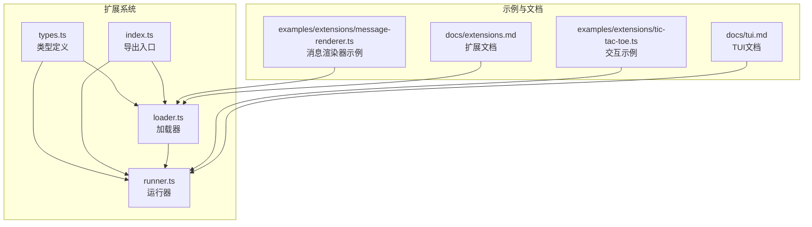
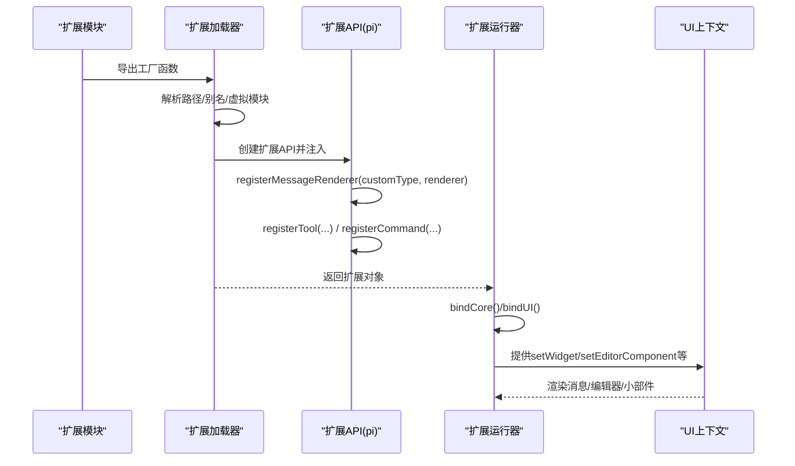
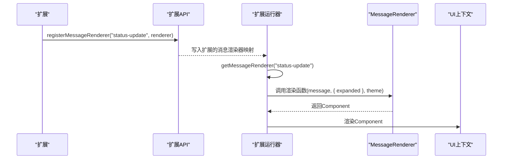
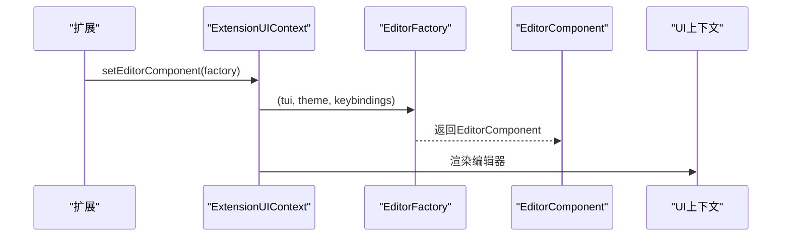
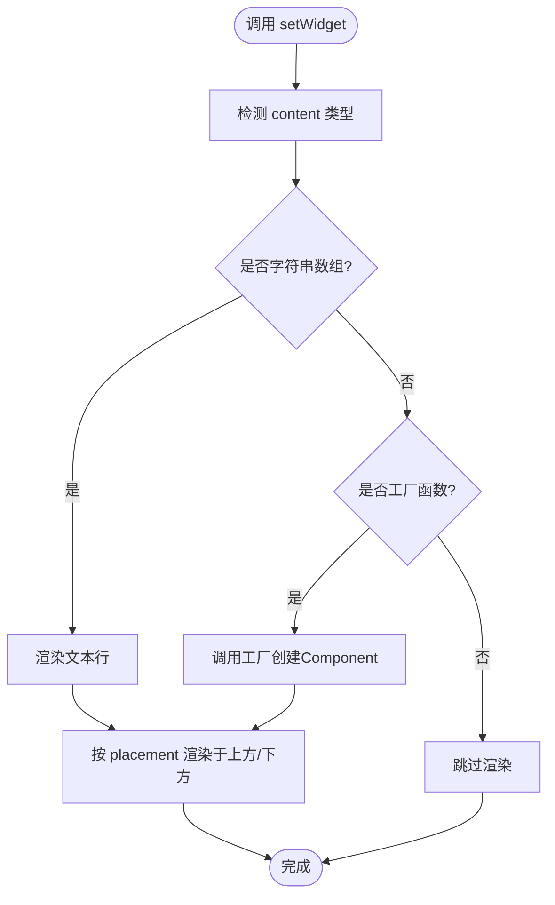
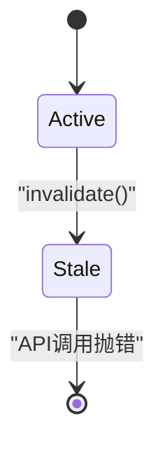
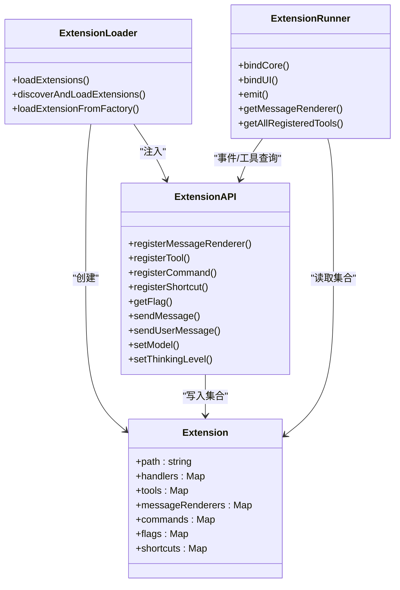

# UI组件开发

<cite>
**本文引用的文件**
- [packages/coding-agent/src/core/extensions/types.ts](file://packages/coding-agent/src/core/extensions/types.ts)
- [packages/coding-agent/src/core/extensions/index.ts](file://packages/coding-agent/src/core/extensions/index.ts)
- [packages/coding-agent/src/core/extensions/loader.ts](file://packages/coding-agent/src/core/extensions/loader.ts)
- [packages/coding-agent/src/core/extensions/runner.ts](file://packages/coding-agent/src/core/extensions/runner.ts)
- [packages/coding-agent/examples/extensions/message-renderer.ts](file://packages/coding-agent/examples/extensions/message-renderer.ts)
- [packages/coding-agent/docs/extensions.md](file://packages/coding-agent/docs/extensions.md)
- [packages/coding-agent/docs/tui.md](file://packages/coding-agent/docs/tui.md)
- [packages/coding-agent/examples/extensions/tic-tac-toe.ts](file://packages/coding-agent/examples/extensions/tic-tac-toe.ts)
</cite>

## 目录
1. [简介](#简介)
2. [项目结构](#项目结构)
3. [核心组件](#核心组件)
4. [架构总览](#架构总览)
5. [详细组件分析](#详细组件分析)
6. [依赖关系分析](#依赖关系分析)
7. [性能考量](#性能考量)
8. [故障排查指南](#故障排查指南)
9. [结论](#结论)
10. [附录](#附录)

## 简介
本指南面向Pi扩展生态中的UI组件开发者，系统讲解以下主题：
- EditorFactory接口与MessageRenderer接口的职责、参数与使用方式
- WidgetPlacement与ExtensionWidgetOptions的配置项与渲染位置控制
- UI组件的生命周期管理与状态处理（含上下文校验、失效保护）
- 可复用UI组件的创建、注册与渲染机制（扩展系统集成）
- 完整开发示例：从简单文本组件到复杂交互式编辑器
- 组件与扩展系统的集成：事件传递、数据绑定、主题与键位支持
- 样式定制与主题支持
- 用户输入处理与组件间通信
- 测试策略与调试技巧

## 项目结构
本仓库采用多包结构，UI组件开发主要围绕“编码代理”包展开，其中扩展系统负责加载、运行并桥接UI上下文。关键文件与职责如下：
- 扩展类型定义：定义EditorFactory、MessageRenderer、WidgetPlacement、ExtensionWidgetOptions等核心类型
- 扩展导出入口：统一导出扩展系统类型与工具
- 扩展加载器：动态加载扩展模块、构建扩展API、注册消息渲染器
- 扩展运行器：绑定核心动作、上下文、UI上下文；分发事件；提供工具与命令查询
- 示例与文档：演示消息渲染器注册、主题切换、自定义编辑器等

图表来源
- [packages/coding-agent/src/core/extensions/types.ts:116-118](file://packages/coding-agent/src/core/extensions/types.ts#L116-L118)
- [packages/coding-agent/src/core/extensions/index.ts:1-173](file://packages/coding-agent/src/core/extensions/index.ts#L1-L173)
- [packages/coding-agent/src/core/extensions/loader.ts:232-235](file://packages/coding-agent/src/core/extensions/loader.ts#L232-L235)
- [packages/coding-agent/src/core/extensions/runner.ts:502-510](file://packages/coding-agent/src/core/extensions/runner.ts#L502-L510)

章节来源
- [packages/coding-agent/src/core/extensions/types.ts:96-118](file://packages/coding-agent/src/core/extensions/types.ts#L96-L118)
- [packages/coding-agent/src/core/extensions/index.ts:1-173](file://packages/coding-agent/src/core/extensions/index.ts#L1-L173)

## 核心组件
本节聚焦UI组件开发的关键类型与接口，帮助你理解如何编写可复用的UI组件并与扩展系统协同工作。

- EditorFactory
  - 职责：工厂函数，用于创建自定义编辑器组件实例
  - 参数：接收TUI实例、编辑器主题、键位管理器
  - 返回：EditorComponent实例
  - 使用要点：通过上下文设置自定义编辑器；需正确处理应用级键位与文本编辑逻辑
- MessageRenderer
  - 职责：根据消息类型渲染自定义UI
  - 参数：消息对象、渲染选项（如expanded）、主题
  - 返回：Component实例
  - 使用要点：按customType匹配消息类型；支持展开/收起、颜色与布局定制
- WidgetPlacement
  - 值域："aboveEditor" | "belowEditor"
  - 作用：控制小部件在编辑器上方或下方的渲染位置
- ExtensionWidgetOptions
  - 关键字段：placement（默认上方）
  - 作用：为setWidget提供位置控制

章节来源
- [packages/coding-agent/src/core/extensions/types.ts:96-118](file://packages/coding-agent/src/core/extensions/types.ts#L96-L118)
- [packages/coding-agent/src/core/extensions/types.ts:162-168](file://packages/coding-agent/src/core/extensions/types.ts#L162-L168)

## 架构总览
扩展系统通过加载器解析扩展模块，构建扩展API并注册消息渲染器；运行器绑定核心动作与UI上下文，将事件分发给各扩展处理器，并提供工具与命令查询能力。UI组件（编辑器、消息渲染器、小部件）通过扩展API注册并由运行器统一调度。

图表来源
- [packages/coding-agent/src/core/extensions/loader.ts:331-343](file://packages/coding-agent/src/core/extensions/loader.ts#L331-L343)
- [packages/coding-agent/src/core/extensions/loader.ts:177-329](file://packages/coding-agent/src/core/extensions/loader.ts#L177-L329)
- [packages/coding-agent/src/core/extensions/runner.ts:266-336](file://packages/coding-agent/src/core/extensions/runner.ts#L266-L336)

## 详细组件分析

### 消息渲染器(MessageRenderer)详解
- 注册方式：通过扩展API的registerMessageRenderer(customType, renderer)完成注册
- 匹配规则：运行器按customType查找对应渲染器
- 渲染流程：运行器在渲染消息时调用对应MessageRenderer，返回Component进行绘制
- 示例参考：
  - 自定义消息类型渲染：[packages/coding-agent/examples/extensions/message-renderer.ts:14-20](file://packages/coding-agent/examples/extensions/message-renderer.ts#L14-L20)
  - 游戏消息渲染示例：[packages/coding-agent/examples/extensions/tic-tac-toe.ts:684-697](file://packages/coding-agent/examples/extensions/tic-tac-toe.ts#L684-L697)

图表来源
- [packages/coding-agent/src/core/extensions/loader.ts:232-235](file://packages/coding-agent/src/core/extensions/loader.ts#L232-L235)
- [packages/coding-agent/src/core/extensions/runner.ts:502-510](file://packages/coding-agent/src/core/extensions/runner.ts#L502-L510)
- [packages/coding-agent/examples/extensions/message-renderer.ts:14-20](file://packages/coding-agent/examples/extensions/message-renderer.ts#L14-L20)

章节来源
- [packages/coding-agent/src/core/extensions/loader.ts:232-235](file://packages/coding-agent/src/core/extensions/loader.ts#L232-L235)
- [packages/coding-agent/src/core/extensions/runner.ts:502-510](file://packages/coding-agent/src/core/extensions/runner.ts#L502-L510)
- [packages/coding-agent/examples/extensions/message-renderer.ts:14-20](file://packages/coding-agent/examples/extensions/message-renderer.ts#L14-L20)
- [packages/coding-agent/examples/extensions/tic-tac-toe.ts:684-697](file://packages/coding-agent/examples/extensions/tic-tac-toe.ts#L684-L697)

### 编辑器工厂(EditorFactory)详解
- 注册方式：通过上下文的setEditorComponent(factory)设置自定义编辑器
- 工厂签名：(tui, theme, keybindings) => EditorComponent
- 集成要点：继承或实现CustomEditor以获得完整键位支持；对未处理的输入调用父类handleInput以保留应用级功能
- 文档参考：[packages/coding-agent/docs/extensions.md:1442-1452](file://packages/coding-agent/docs/extensions.md#L1442-L1452)

图表来源
- [packages/coding-agent/src/core/extensions/types.ts:220-253](file://packages/coding-agent/src/core/extensions/types.ts#L220-L253)
- [packages/coding-agent/docs/extensions.md:1442-1452](file://packages/coding-agent/docs/extensions.md#L1442-L1452)

章节来源
- [packages/coding-agent/src/core/extensions/types.ts:220-253](file://packages/coding-agent/src/core/extensions/types.ts#L220-L253)
- [packages/coding-agent/docs/extensions.md:1442-1452](file://packages/coding-agent/docs/extensions.md#L1442-L1452)

### 小部件与位置控制(WidgetPlacement/ExtensionWidgetOptions)
- setWidget(key, content, options)用于注册小部件
- options.placement控制位置："aboveEditor"或"belowEditor"
- 典型用途：状态栏、工具条、辅助面板等

图表来源
- [packages/coding-agent/src/core/extensions/types.ts:162-168](file://packages/coding-agent/src/core/extensions/types.ts#L162-L168)
- [packages/coding-agent/src/core/extensions/types.ts:99-103](file://packages/coding-agent/src/core/extensions/types.ts#L99-L103)

章节来源
- [packages/coding-agent/src/core/extensions/types.ts:96-118](file://packages/coding-agent/src/core/extensions/types.ts#L96-L118)
- [packages/coding-agent/src/core/extensions/types.ts:162-168](file://packages/coding-agent/src/core/extensions/types.ts#L162-L168)

### 生命周期管理与状态处理
- 上下文校验：运行器在创建上下文时提供assertActive，防止会话替换/重载后继续使用旧上下文
- 失效保护：invalidate标记后，所有API调用抛错，避免竞态条件
- UI可用性：hasUI判断当前模式是否支持UI；RPC/打印模式下UI上下文退化为no-op
- 事件驱动：运行器emit各类事件（会话、输入、工具执行、消息流等），扩展可订阅并修改行为

图表来源
- [packages/coding-agent/src/core/extensions/runner.ts:466-479](file://packages/coding-agent/src/core/extensions/runner.ts#L466-L479)
- [packages/coding-agent/src/core/extensions/runner.ts:191-222](file://packages/coding-agent/src/core/extensions/runner.ts#L191-L222)

章节来源
- [packages/coding-agent/src/core/extensions/runner.ts:466-479](file://packages/coding-agent/src/core/extensions/runner.ts#L466-L479)
- [packages/coding-agent/src/core/extensions/runner.ts:191-222](file://packages/coding-agent/src/core/extensions/runner.ts#L191-L222)

### 可复用UI组件的创建、注册与渲染机制
- 组件注册
  - 消息渲染器：registerMessageRenderer(customType, renderer)
  - 编辑器：setEditorComponent(factory)
  - 小部件：setWidget(key, content, options)
- 渲染机制
  - 运行器按类型查找渲染器/组件工厂，返回Component后交由UI上下文渲染
  - 支持主题注入与键位管理器传递，确保一致的外观与交互体验

章节来源
- [packages/coding-agent/src/core/extensions/loader.ts:232-235](file://packages/coding-agent/src/core/extensions/loader.ts#L232-L235)
- [packages/coding-agent/src/core/extensions/types.ts:162-168](file://packages/coding-agent/src/core/extensions/types.ts#L162-L168)
- [packages/coding-agent/src/core/extensions/types.ts:220-253](file://packages/coding-agent/src/core/extensions/types.ts#L220-L253)

### 完整开发示例

#### 示例一：自定义消息渲染器
- 目标：为特定customType的消息提供自定义渲染
- 步骤：
  1) 在扩展中调用registerMessageRenderer("your-type", renderer)
  2) renderer接收message、{ expanded }、theme，返回Component
  3) 运行器在渲染阶段调用该渲染器
- 参考：
  - [packages/coding-agent/examples/extensions/message-renderer.ts:14-20](file://packages/coding-agent/examples/extensions/message-renderer.ts#L14-L20)
  - [packages/coding-agent/docs/extensions.md:1442-1452](file://packages/coding-agent/docs/extensions.md#L1442-L1452)

章节来源
- [packages/coding-agent/examples/extensions/message-renderer.ts:14-20](file://packages/coding-agent/examples/extensions/message-renderer.ts#L14-L20)
- [packages/coding-agent/docs/extensions.md:1442-1452](file://packages/coding-agent/docs/extensions.md#L1442-L1452)

#### 示例二：自定义编辑器
- 目标：提供一个带键位支持的自定义编辑器
- 步骤：
  1) 实现EditorFactory，返回自定义EditorComponent
  2) 在编辑器中处理输入，未处理的键位调用父类handleInput
  3) 通过setEditorComponent注册
- 参考：
  - [packages/coding-agent/docs/extensions.md:1442-1452](file://packages/coding-agent/docs/extensions.md#L1442-L1452)

章节来源
- [packages/coding-agent/docs/extensions.md:1442-1452](file://packages/coding-agent/docs/extensions.md#L1442-L1452)

#### 示例三：游戏消息渲染（复杂交互）
- 目标：渲染棋盘、响应点击并更新状态
- 步骤：
  1) 注册不同消息类型的渲染器（如MOVE_MESSAGE_TYPE、GAME_OVER_MESSAGE_TYPE）
  2) 渲染器根据expanded状态决定显示细节
  3) 通过上下文发送消息或触发后续回合
- 参考：
  - [packages/coding-agent/examples/extensions/tic-tac-toe.ts:684-697](file://packages/coding-agent/examples/extensions/tic-tac-toe.ts#L684-L697)

章节来源
- [packages/coding-agent/examples/extensions/tic-tac-toe.ts:684-697](file://packages/coding-agent/examples/extensions/tic-tac-toe.ts#L684-L697)

### 组件与扩展系统的集成
- 事件传递
  - 运行器emit各类事件（会话、输入、工具执行、消息流等）
  - 扩展通过on(event, handler)订阅并可修改结果（如取消会话切换）
- 数据绑定
  - 通过上下文访问模型、会话管理器、令牌用量等
  - 通过ui.setWidget/setEditorComponent等API绑定UI
- 主题与键位
  - 渲染器与编辑器可获取theme与keybindings，保证风格一致与快捷键支持

章节来源
- [packages/coding-agent/src/core/extensions/runner.ts:680-712](file://packages/coding-agent/src/core/extensions/runner.ts#L680-L712)
- [packages/coding-agent/src/core/extensions/types.ts:124-275](file://packages/coding-agent/src/core/extensions/types.ts#L124-L275)

### 样式定制与主题支持
- 主题获取与切换
  - 通过ui.theme读取当前主题
  - 通过getAllThemes/getTheme/setTheme管理主题
- 渲染器与编辑器
  - 渲染器与编辑器工厂接收theme参数，用于边框、自动补全等样式
- 文档参考：
  - [packages/coding-agent/docs/tui.md](file://packages/coding-agent/docs/tui.md)

章节来源
- [packages/coding-agent/src/core/extensions/types.ts:258-268](file://packages/coding-agent/src/core/extensions/types.ts#L258-L268)
- [packages/coding-agent/docs/tui.md](file://packages/coding-agent/docs/tui.md)

### 用户输入与组件间通信
- 输入监听
  - ui.onTerminalInput提供原始终端输入监听（交互模式）
- 组件间通信
  - 通过pi.sendMessage/pi.sendUserMessage在组件间传递消息
  - 通过ui.setWidget共享状态（如工具状态、计数器）

章节来源
- [packages/coding-agent/src/core/extensions/types.ts:137-138](file://packages/coding-agent/src/core/extensions/types.ts#L137-L138)
- [packages/coding-agent/src/core/extensions/types.ts:372-380](file://packages/coding-agent/src/core/extensions/types.ts#L372-L380)

### 测试策略与调试技巧
- 单元测试
  - 对渲染器与编辑器工厂进行纯函数测试：输入消息/主题/选项，断言输出Component
  - 对事件处理器进行mock上下文测试：验证cancel/transform/continue等返回值
- 集成测试
  - 使用loadExtensionFromFactory创建扩展实例，验证注册的渲染器与工具
  - 使用discoverAndLoadExtensions加载本地/全局扩展，验证运行器绑定
- 调试技巧
  - 使用运行器的onError监听扩展错误，定位异常堆栈
  - 在渲染器中打印关键状态（如expanded、customType），便于排障
  - 利用UI上下文的notify与setWorkingMessage反馈进度

章节来源
- [packages/coding-agent/src/core/extensions/loader.ts:396-408](file://packages/coding-agent/src/core/extensions/loader.ts#L396-L408)
- [packages/coding-agent/src/core/extensions/runner.ts:481-490](file://packages/coding-agent/src/core/extensions/runner.ts#L481-L490)

## 依赖关系分析
扩展系统内部类型、加载与运行的关系如下：

图表来源
- [packages/coding-agent/src/core/extensions/loader.ts:348-366](file://packages/coding-agent/src/core/extensions/loader.ts#L348-L366)
- [packages/coding-agent/src/core/extensions/loader.ts:177-329](file://packages/coding-agent/src/core/extensions/loader.ts#L177-L329)
- [packages/coding-agent/src/core/extensions/runner.ts:224-264](file://packages/coding-agent/src/core/extensions/runner.ts#L224-L264)

章节来源
- [packages/coding-agent/src/core/extensions/loader.ts:348-366](file://packages/coding-agent/src/core/extensions/loader.ts#L348-L366)
- [packages/coding-agent/src/core/extensions/runner.ts:224-264](file://packages/coding-agent/src/core/extensions/runner.ts#L224-L264)

## 性能考量
- 渲染开销控制
  - 合理使用expanded选项，避免一次性渲染大量细节
  - 小部件尽量使用字符串数组而非复杂组件，减少重绘成本
- 事件处理
  - 在before_*事件中尽早返回，避免长耗时阻塞
- 主题与键位
  - 将主题与键位缓存至组件状态，避免重复计算

## 故障排查指南
- 常见问题
  - “上下文已失效”：在会话替换/重载后仍使用旧pi或ctx，应遵循提示在新会话回调中使用新ctx
  - “UI不可用”：RPC/打印模式下UI上下文为no-op，需在交互模式下调试
  - “渲染器未生效”：确认customType与注册类型一致，且运行器能查到对应渲染器
- 排障步骤
  - 使用onError监听扩展错误，查看extensionPath与event定位问题
  - 在渲染器中打印关键参数（如expanded、theme），确认传入状态
  - 通过ui.notify与setWorkingMessage反馈中间状态

章节来源
- [packages/coding-agent/src/core/extensions/runner.ts:481-490](file://packages/coding-agent/src/core/extensions/runner.ts#L481-L490)
- [packages/coding-agent/src/core/extensions/runner.ts:466-479](file://packages/coding-agent/src/core/extensions/runner.ts#L466-L479)

## 结论
通过EditorFactory与MessageRenderer，结合WidgetPlacement与ExtensionWidgetOptions，开发者可以灵活地在Pi扩展生态中构建可复用、可维护的UI组件。配合扩展系统的事件驱动与上下文校验机制，能够实现稳定的状态管理与良好的用户体验。建议从简单消息渲染器开始，逐步过渡到自定义编辑器与复杂交互组件，并始终关注主题一致性、键位支持与性能优化。

## 附录
- 相关文档与示例
  - 扩展系统文档：[packages/coding-agent/docs/extensions.md](file://packages/coding-agent/docs/extensions.md)
  - TUI文档：[packages/coding-agent/docs/tui.md](file://packages/coding-agent/docs/tui.md)
  - 消息渲染器示例：[packages/coding-agent/examples/extensions/message-renderer.ts](file://packages/coding-agent/examples/extensions/message-renderer.ts)
  - 交互示例（井字棋）：[packages/coding-agent/examples/extensions/tic-tac-toe.ts](file://packages/coding-agent/examples/extensions/tic-tac-toe.ts)