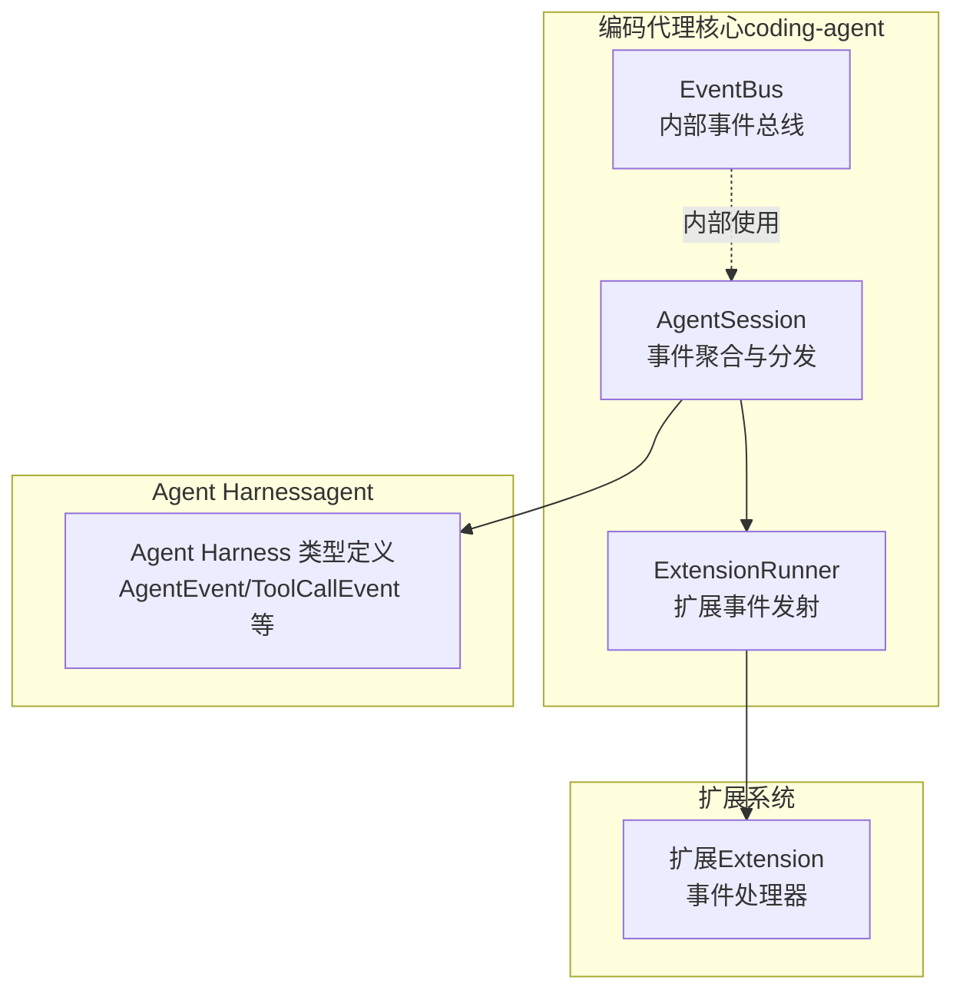
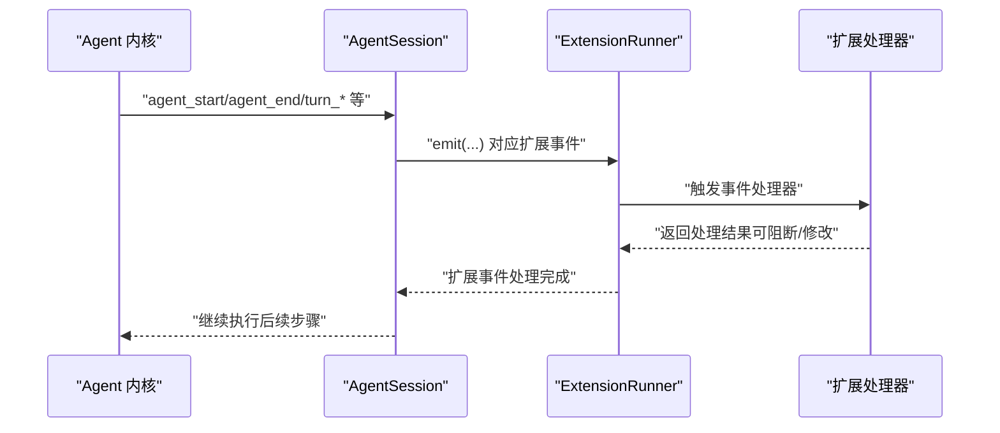
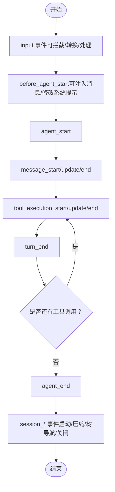
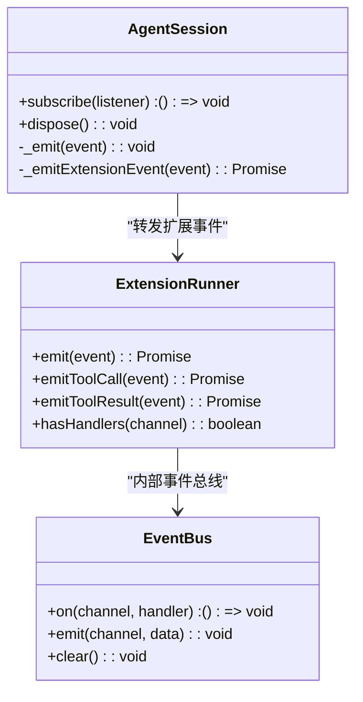
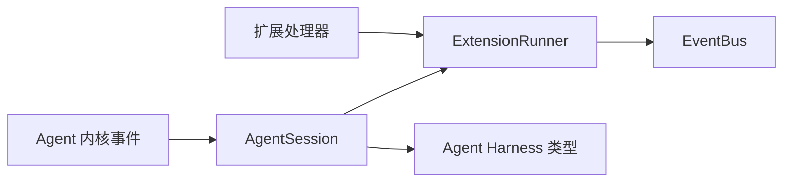

# 事件系统

<cite>
**本文引用的文件**
- [event-bus.ts](file://packages/coding-agent/src/core/event-bus.ts)
- [agent-session.ts](file://packages/coding-agent/src/core/agent-session.ts)
- [types.ts（Agent Harness）](file://packages/agent/src/harness/types.ts)
- [extensions/index.ts](file://packages/coding-agent/src/core/extensions/index.ts)
- [extensions/types.ts](file://packages/coding-agent/src/core/extensions/types.ts)
- [extensions.md](file://packages/coding-agent/docs/extensions.md)
- [event-bus.ts（示例）](file://packages/coding-agent/examples/extensions/event-bus.ts)
</cite>

## 目录
1. [简介](#简介)
2. [项目结构](#项目结构)
3. [核心组件](#核心组件)
4. [架构总览](#架构总览)
5. [详细组件分析](#详细组件分析)
6. [依赖关系分析](#依赖关系分析)
7. [性能考量](#性能考量)
8. [故障排查指南](#故障排查指南)
9. [结论](#结论)
10. [附录](#附录)

## 简介
本文件面向Pi事件系统，系统性阐述事件模型、生命周期与传播机制，以及扩展系统中的事件监听、过滤与路由。重点覆盖以下内容：
- ExtensionEvent接口与各类事件类型（如AgentStartEvent、ToolCallEvent、SessionEvent等）
- 事件在Agent会话与扩展运行时之间的传播路径
- 事件监听器的注册与管理方式
- 事件处理器的编写规范与最佳实践
- 完整示例：如何监听与响应不同类型的事件
- 事件与扩展系统的集成（过滤、路由）
- 性能与内存管理建议
- 自定义事件类型与处理器的创建流程
- 调试与监控方法

## 项目结构
Pi事件系统主要分布在两个包中：
- 编码代理核心（coding-agent）：提供AgentSession事件聚合、扩展运行时桥接、工具调用拦截与扩展事件发射
- Agent Harness（agent）：提供通用Agent事件类型与结果类型定义，用于扩展侧事件处理的统一契约

图表来源
- [agent-session.ts:454-670](file://packages/coding-agent/src/core/agent-session.ts#L454-L670)
- [extensions/types.ts:600-706](file://packages/coding-agent/src/core/extensions/types.ts#L600-L706)
- [extensions/index.ts:1-173](file://packages/coding-agent/src/core/extensions/index.ts#L1-L173)

章节来源
- [agent-session.ts:122-150](file://packages/coding-agent/src/core/agent-session.ts#L122-L150)
- [extensions/types.ts:600-706](file://packages/coding-agent/src/core/extensions/types.ts#L600-L706)
- [extensions/index.ts:1-173](file://packages/coding-agent/src/core/extensions/index.ts#L1-L173)

## 核心组件
- AgentSession事件类型与监听器
  - AgentSessionEvent：会话级事件联合类型，扩展自AgentEvent并新增队列更新、压缩、思考级别变更、自动重试等事件
  - AgentSessionEventListener：对AgentSessionEvent的监听函数签名
- 扩展事件类型
  - AgentStartEvent、AgentEndEvent、TurnStartEvent、TurnEndEvent、MessageStartEvent、MessageUpdateEvent、MessageEndEvent、ToolExecutionStartEvent、ToolExecutionUpdateEvent、ToolExecutionEndEvent、BeforeAgentStartEvent、ContextEvent、BeforeProviderRequestEvent、AfterProviderResponseEvent、ToolCallEvent、ToolResultEvent、SessionStartEvent、SessionBeforeCompactEvent、SessionCompactEvent、SessionBeforeTreeEvent、SessionTreeEvent、ModelSelectEvent、ThinkingLevelSelectEvent、InputEvent等
- 事件总线（EventBus）
  - 提供on/emit/clear能力，并对异步处理器进行错误捕获，避免事件处理异常影响主流程

章节来源
- [agent-session.ts:122-150](file://packages/coding-agent/src/core/agent-session.ts#L122-L150)
- [extensions/types.ts:600-706](file://packages/coding-agent/src/core/extensions/types.ts#L600-L706)
- [event-bus.ts:1-34](file://packages/coding-agent/src/core/event-bus.ts#L1-L34)

## 架构总览
事件从Agent内核产生，经由AgentSession聚合后，再转发给扩展运行时（ExtensionRunner），扩展可选择拦截、修改或阻断工具调用，最终回传到AgentSession以完成一次完整的事件生命周期。

图表来源
- [agent-session.ts:496-670](file://packages/coding-agent/src/core/agent-session.ts#L496-L670)
- [extensions/types.ts:600-706](file://packages/coding-agent/src/core/extensions/types.ts#L600-L706)

## 详细组件分析

### AgentSession事件模型与生命周期
- 事件类型
  - AgentSessionEvent：在AgentEvent基础上扩展了agent_end（携带willRetry）、queue_update、compaction_*、session_info_changed、thinking_level_changed、auto_retry_*等
- 生命周期阶段
  - 输入阶段：input事件（可拦截/转换/处理）
  - 预处理阶段：before_agent_start（可注入消息、修改系统提示）
  - 代理循环：agent_start → 消息流（message_start/update/end）→ 工具调用（tool_execution_*）→ turn_end → agent_end
  - 会话阶段：session_start → 资源发现 → 会话切换/分叉/压缩/树导航 → session_shutdown
- 传播机制
  - AgentSession订阅Agent事件，先转发给扩展（_emitExtensionEvent），再通知用户监听器（_emit）
  - 工具调用拦截：beforeToolCall/afterToolCall通过ExtensionRunner.emitToolCall/emitToolResult实现，支持阻断与结果修改

图表来源
- [agent-session.ts:473-670](file://packages/coding-agent/src/core/agent-session.ts#L473-L670)
- [extensions.md:266-335](file://packages/coding-agent/docs/extensions.md#L266-L335)

章节来源
- [agent-session.ts:122-150](file://packages/coding-agent/src/core/agent-session.ts#L122-L150)
- [agent-session.ts:473-670](file://packages/coding-agent/src/core/agent-session.ts#L473-L670)
- [extensions.md:266-335](file://packages/coding-agent/docs/extensions.md#L266-L335)

### 扩展事件类型与处理器
- 关键事件类型
  - Agent生命周期：agent_start、agent_end、turn_start、turn_end、message_start、message_update、message_end
  - 工具执行：tool_execution_start、tool_execution_update、tool_execution_end
  - 工具调用：tool_call（可阻断）、tool_result（可修改）
  - 会话：session_start、session_before_switch、session_before_fork、session_before_compact、session_compact、session_before_tree、session_tree、session_shutdown
  - 资源：resources_discover
  - 其他：before_agent_start、context、before_provider_request、after_provider_response、model_select、thinking_level_select、input
- 处理器返回值
  - ToolCallEventResult：block/reason
  - ToolResultPatch：content/details/isError/terminate
  - SessionBeforeCompactResult/SessionBeforeTreeResult：cancel/compaction/summary/customInstructions/replaceInstructions/label
  - BeforeAgentStartResult：messages/systemPrompt
  - ContextResult：messages
  - BeforeProviderRequestResult：streamOptions
  - BeforeProviderPayloadResult：payload

章节来源
- [extensions/types.ts:600-706](file://packages/coding-agent/src/core/extensions/types.ts#L600-L706)
- [extensions/types.ts:770-806](file://packages/coding-agent/src/core/extensions/types.ts#L770-L806)
- [types.ts（Agent Harness）:558-573](file://packages/agent/src/harness/types.ts#L558-L573)
- [types.ts（Agent Harness）:679-724](file://packages/agent/src/harness/types.ts#L679-L724)

### 事件监听器注册与管理
- 用户监听器
  - AgentSession.subscribe(listener)：添加监听器，返回取消订阅函数
  - dispose()：断开Agent事件订阅、清理扩展上下文、释放资源
- 扩展监听器
  - ExtensionAPI.on(eventType, handler)：注册扩展事件处理器
  - ExtensionRunner.hasHandlers(channel)：检查是否存在某类事件处理器
- 内部事件总线
  - EventBus：封装Node EventEmitter，提供安全的异步处理器包装与错误捕获

图表来源
- [agent-session.ts:454-731](file://packages/coding-agent/src/core/agent-session.ts#L454-L731)
- [extensions/types.ts:600-706](file://packages/coding-agent/src/core/extensions/types.ts#L600-L706)
- [event-bus.ts:1-34](file://packages/coding-agent/src/core/event-bus.ts#L1-L34)

章节来源
- [agent-session.ts:677-731](file://packages/coding-agent/src/core/agent-session.ts#L677-L731)
- [extensions/index.ts:1-173](file://packages/coding-agent/src/core/extensions/index.ts#L1-L173)
- [event-bus.ts:1-34](file://packages/coding-agent/src/core/event-bus.ts#L1-L34)

### 事件处理器编写规范与最佳实践
- 返回值语义
  - 阻断工具调用：ToolCallEventResult.block=true
  - 修改工具结果：ToolResultPatch.content/details/isError/terminate
  - 取消/定制会话操作：SessionBeforeCompactResult/SessionBeforeTreeResult.cancel/compaction/summary
- 异步与错误处理
  - 扩展处理器为异步；EventBus对处理器错误进行捕获，避免影响主流程
- 事件链与副作用
  - before_agent_start可多次链式修改系统提示与注入消息
  - message_end可替换最终消息对象，需保持角色一致
- 并行工具执行
  - tool_execution_start按预检顺序发出；tool_execution_update可能交错；tool_execution_end按完成顺序发出

章节来源
- [extensions/types.ts:679-724](file://packages/coding-agent/src/core/extensions/types.ts#L679-L724)
- [agent-session.ts:400-448](file://packages/coding-agent/src/core/agent-session.ts#L400-L448)
- [extensions.md:565-587](file://packages/coding-agent/docs/extensions.md#L565-L587)

### 事件处理示例
- 基于事件总线的扩展间通信
  - 使用pi.events.on/emit在扩展之间传递数据
  - 示例：event-bus.ts展示了监听“my:notification”并弹出通知，以及在session_start时发送通知
- 工具调用拦截示例
  - 在tool_call事件中根据输入决定阻断或放行，并给出原因

章节来源
- [event-bus.ts（示例）:1-44](file://packages/coding-agent/examples/extensions/event-bus.ts#L1-L44)
- [extensions.md:69-99](file://packages/coding-agent/docs/extensions.md#L69-L99)

### 事件与扩展系统的集成（过滤与路由）
- 过滤
  - 通过ExtensionRunner.hasHandlers(channel)判断是否存在处理器，避免不必要的开销
  - 在AgentSession._installAgentToolHooks中仅在存在对应处理器时才拦截工具调用
- 路由
  - AgentSession._emitExtensionEvent将Agent事件映射为扩展事件并路由至ExtensionRunner
  - 扩展可通过pi.on注册处理器，实现对特定事件的路由与处理

章节来源
- [agent-session.ts:400-448](file://packages/coding-agent/src/core/agent-session.ts#L400-L448)
- [agent-session.ts:598-670](file://packages/coding-agent/src/core/agent-session.ts#L598-L670)

## 依赖关系分析
- AgentSession依赖Agent事件类型与扩展运行时，负责事件聚合与分发
- ExtensionRunner依赖EventBus与扩展API，负责事件发射与处理器调度
- 扩展通过ExtensionAPI注册处理器，形成事件处理链

图表来源
- [agent-session.ts:454-670](file://packages/coding-agent/src/core/agent-session.ts#L454-L670)
- [extensions/types.ts:600-706](file://packages/coding-agent/src/core/extensions/types.ts#L600-L706)
- [event-bus.ts:1-34](file://packages/coding-agent/src/core/event-bus.ts#L1-L34)

章节来源
- [agent-session.ts:454-670](file://packages/coding-agent/src/core/agent-session.ts#L454-L670)
- [extensions/types.ts:600-706](file://packages/coding-agent/src/core/extensions/types.ts#L600-L706)
- [extensions/index.ts:1-173](file://packages/coding-agent/src/core/extensions/index.ts#L1-L173)

## 性能考量
- 事件处理异步化与错误隔离
  - EventBus对处理器进行async包装并在try/catch中执行，避免单个处理器异常导致整体阻塞
- 工具调用拦截的条件检查
  - 仅在存在对应处理器时安装拦截钩子，减少不必要的开销
- 批量事件与队列更新
  - AgentSession维护steering/followUp队列，事件触发时及时更新并emit queue_update，避免UI状态滞后
- 会话压缩与自动重试
  - 在agent_end时评估是否需要自动重试，并在成功响应后重置计数，防止累积

章节来源
- [event-bus.ts:12-34](file://packages/coding-agent/src/core/event-bus.ts#L12-L34)
- [agent-session.ts:400-448](file://packages/coding-agent/src/core/agent-session.ts#L400-L448)
- [agent-session.ts:461-467](file://packages/coding-agent/src/core/agent-session.ts#L461-L467)
- [agent-session.ts:546-559](file://packages/coding-agent/src/core/agent-session.ts#L546-L559)

## 故障排查指南
- 事件未触发
  - 检查是否正确注册监听器（AgentSession.subscribe 或 ExtensionAPI.on）
  - 确认事件类型是否匹配（注意AgentSessionEvent与AgentEvent的区别）
- 工具调用被意外阻断
  - 检查tool_call处理器是否返回block: true且reason
  - 使用isToolCallEventType进行类型守卫，确保只对目标工具生效
- 处理器报错
  - EventBus已捕获处理器错误并记录日志，不影响主流程；可在扩展中补充日志定位问题
- UI状态不一致
  - 确保在message_start时移除队列中的消息，避免UI显示过期状态

章节来源
- [event-bus.ts:18-25](file://packages/coding-agent/src/core/event-bus.ts#L18-L25)
- [extensions.md:675-730](file://packages/coding-agent/docs/extensions.md#L675-L730)
- [agent-session.ts:473-494](file://packages/coding-agent/src/core/agent-session.ts#L473-L494)

## 结论
Pi事件系统通过AgentSession聚合Agent内核事件，并将其转化为扩展友好的事件模型，配合ExtensionRunner实现事件的路由与拦截。EventBus提供安全的异步事件总线，保障扩展处理器的稳定性。遵循本文的编写规范与最佳实践，可高效构建可维护的事件驱动扩展生态。

## 附录

### 事件类型速查表
- Agent生命周期：agent_start、agent_end、turn_start、turn_end、message_start、message_update、message_end
- 工具执行：tool_execution_start、tool_execution_update、tool_execution_end
- 工具调用：tool_call（可阻断）、tool_result（可修改）
- 会话：session_start、session_before_switch、session_before_fork、session_before_compact、session_compact、session_before_tree、session_tree、session_shutdown
- 资源：resources_discover
- 其他：before_agent_start、context、before_provider_request、after_provider_response、model_select、thinking_level_select、input

章节来源
- [extensions/types.ts:600-706](file://packages/coding-agent/src/core/extensions/types.ts#L600-L706)
- [extensions/types.ts:770-806](file://packages/coding-agent/src/core/extensions/types.ts#L770-L806)
- [types.ts（Agent Harness）:558-573](file://packages/agent/src/harness/types.ts#L558-L573)
- [types.ts（Agent Harness）:634-656](file://packages/agent/src/harness/types.ts#L634-L656)