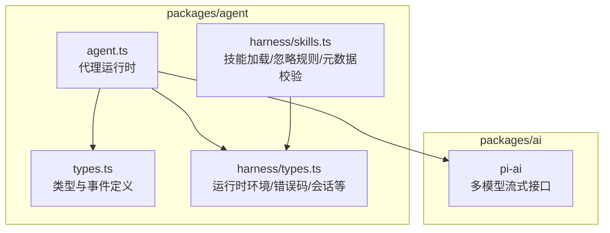
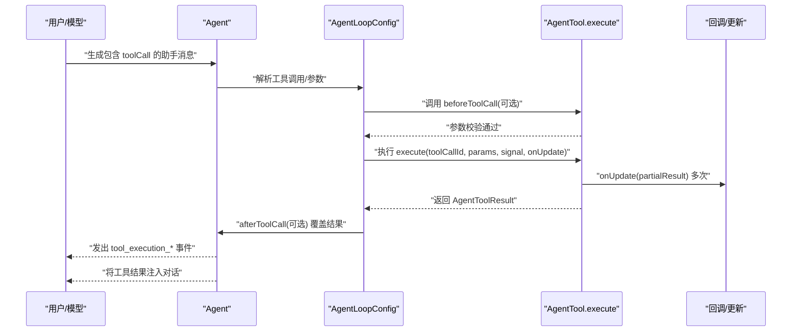
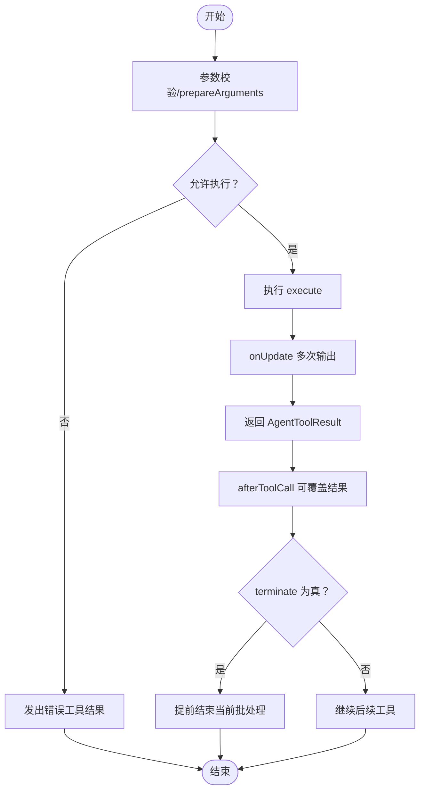
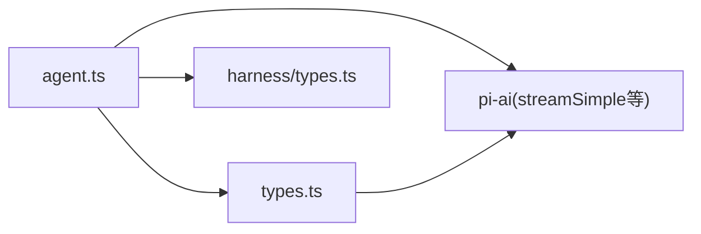

# 工具开发指南

<cite>
**本文引用的文件**
- [README.md](file://README.md)
- [packages/agent/src/types.ts](file://packages/agent/src/types.ts)
- [packages/agent/src/agent.ts](file://packages/agent/src/agent.ts)
- [packages/agent/src/harness/types.ts](file://packages/agent/src/harness/types.ts)
- [packages/agent/src/harness/skills.ts](file://packages/agent/src/harness/skills.ts)
</cite>

## 目录
1. [简介](#简介)
2. [项目结构](#项目结构)
3. [核心组件](#核心组件)
4. [架构总览](#架构总览)
5. [详细组件分析](#详细组件分析)
6. [依赖关系分析](#依赖关系分析)
7. [性能考量](#性能考量)
8. [故障排查指南](#故障排查指南)
9. [结论](#结论)
10. [附录](#附录)

## 简介
本指南面向在 Pi 生态中进行“工具（Tool）”开发的工程师，目标是帮助你：
- 理解 ToolDefinition 接口与 AgentTool 的使用方式
- 掌握 defineTool 的用法与最佳实践
- 明确 wrapRegisteredTool 的作用与适用场景
- 构建从简单文件操作到复杂系统集成的完整工具示例
- 管理工具生命周期：执行前校验、执行过程监控、结果处理
- 调试工具问题与性能优化策略
- 在扩展中注册与使用工具，并与代理系统集成

Pi 提供统一的代理运行时与多模型提供商能力，工具作为可插拔能力被注入到 Agent 的上下文中，由模型调度并在运行时执行。

章节来源
- [README.md:19-31](file://README.md#L19-L31)

## 项目结构
Pi 是一个单仓库多包结构，与工具开发直接相关的核心模块位于 packages/agent 中，涵盖：
- 类型与事件定义：packages/agent/src/types.ts
- 代理运行时：packages/agent/src/agent.ts
- 运行时环境与错误码等基础设施：packages/agent/src/harness/types.ts
- 技能加载与提示模板等辅助能力：packages/agent/src/harness/skills.ts

下面给出一个概念性的项目结构图，帮助定位工具相关文件：

## 核心组件
本节聚焦工具开发所需的关键类型与接口，帮助你快速上手。

- ToolDefinition 与 AgentTool
  - AgentTool 扩展了通用 Tool 接口，新增 label、prepareArguments、execute、executionMode 等字段，用于 UI 展示、参数预处理、执行逻辑与并发控制。
  - 参数模式通过 TypeBox Schema（TSchema）声明，支持静态类型推断与运行时校验。
  - 返回值 AgentToolResult 包含 content（文本或图像内容）、details（结构化细节）与 terminate（是否提前终止当前批处理）。

- 工具生命周期钩子
  - beforeToolCall：在参数校验后、执行前调用，可用于权限校验、资源检查、阻断执行等。
  - afterToolCall：在工具执行完成后、事件发出前调用，允许对结果进行部分覆盖（content、details、isError、terminate）。

- 工具执行模式
  - 支持 sequential 与 parallel 两种模式，可在 AgentTool 级别覆盖全局配置，以满足串行互斥或并发加速的需求。

- 事件与状态
  - Agent 会发出 tool_execution_start/tool_execution_update/tool_execution_end 等事件，便于 UI 或日志追踪工具执行进度与结果。

章节来源
- [packages/agent/src/types.ts:360-384](file://packages/agent/src/types.ts#L360-L384)
- [packages/agent/src/types.ts:344-355](file://packages/agent/src/types.ts#L344-L355)
- [packages/agent/src/types.ts:83-109](file://packages/agent/src/types.ts#L83-L109)
- [packages/agent/src/types.ts:262-276](file://packages/agent/src/types.ts#L262-L276)
- [packages/agent/src/types.ts:28-36](file://packages/agent/src/types.ts#L28-L36)
- [packages/agent/src/agent.ts:166-219](file://packages/agent/src/agent.ts#L166-L219)

## 架构总览
下图展示了工具在代理运行时中的位置与交互流程，包括参数准备、执行、事件分发与结果回传。

图表来源
- [packages/agent/src/agent.ts:422-449](file://packages/agent/src/agent.ts#L422-L449)
- [packages/agent/src/types.ts:262-276](file://packages/agent/src/types.ts#L262-L276)
- [packages/agent/src/types.ts:360-384](file://packages/agent/src/types.ts#L360-L384)

## 详细组件分析

### 组件一：ToolDefinition 与 AgentTool
- 字段与职责
  - label：UI 友好名称
  - prepareArguments：在类型校验前对原始参数做兼容性转换
  - execute：核心执行逻辑，接收 toolCallId、参数、AbortSignal、onUpdate 回调
  - executionMode：覆盖全局工具执行模式
  - 参数 Schema：通过 TSchema 静态描述，配合类型推断 Static<TParameters>

- 数据结构与复杂度
  - 参数校验与类型推断发生在执行前，复杂度取决于 Schema 结构；执行阶段复杂度取决于具体工具实现
  - 并发执行受 AgentLoopConfig 的 toolExecution 模式与单个工具 executionMode 共同影响

- 错误处理与边界
  - 工具内部应抛出异常而非将错误编码到 content，由运行时统一转为错误事件
  - onUpdate 可多次触发，需保证幂等与线程安全

- 性能影响
  - 合理使用 onUpdate 分片输出，避免一次性大块内容导致 UI 卡顿
  - 对于 IO 密集工具，考虑并发与超时控制

章节来源
- [packages/agent/src/types.ts:360-384](file://packages/agent/src/types.ts#L360-L384)
- [packages/agent/src/types.ts:344-355](file://packages/agent/src/types.ts#L344-L355)
- [packages/agent/src/types.ts:357-358](file://packages/agent/src/types.ts#L357-L358)

### 组件二：defineTool 使用指南
- 目标
  - 将一个符合 AgentTool 规范的工具对象注入到 Agent 的工具集合中，供模型调用
- 建议步骤
  - 定义参数 Schema（TSchema），确保字段完整且类型明确
  - 实现 prepareArguments（如需要）与 execute
  - 设置 label 与 executionMode（如需串行）
  - 注册到 Agent 的 tools 列表
- 注意事项
  - 参数校验失败时不要在 execute 内部处理，交由运行时统一处理
  - 在 execute 中尊重 AbortSignal，及时响应中断
  - 使用 onUpdate 输出阶段性结果，提升可观测性

章节来源
- [packages/agent/src/types.ts:360-384](file://packages/agent/src/types.ts#L360-L384)

### 组件三：wrapRegisteredTool 的作用与场景
- 作用
  - 将已注册的工具封装为可复用的 AgentTool，便于在不同 Agent 实例间共享
- 场景
  - 在扩展或插件中复用已有工具定义
  - 为工具增加统一的上下文、鉴权或限流包装
- 注意
  - 保持 execute 签名与 AgentTool 兼容
  - 如需变更参数或行为，可通过 prepareArguments 或包装层逻辑实现

（本小节为概念性说明，不直接对应具体源码文件）

### 组件四：工具生命周期管理
- 执行前验证
  - beforeToolCall：可在此处进行权限校验、资源可用性检查、参数二次校验
  - prepareArguments：兼容旧格式参数，确保与 Schema 一致
- 执行过程监控
  - onUpdate：周期性上报中间结果，驱动 UI 更新与日志记录
  - 事件监听：订阅 tool_execution_* 事件，实现外部观测与告警
- 结果处理
  - afterToolCall：对工具结果进行二次加工（如格式化、脱敏、聚合）
  - terminate：当工具明确表示“已完成任务”时，可请求提前结束当前批处理

图表来源
- [packages/agent/src/types.ts:262-276](file://packages/agent/src/types.ts#L262-L276)
- [packages/agent/src/types.ts:357-358](file://packages/agent/src/types.ts#L357-L358)
- [packages/agent/src/types.ts:344-355](file://packages/agent/src/types.ts#L344-L355)

章节来源
- [packages/agent/src/types.ts:83-109](file://packages/agent/src/types.ts#L83-L109)
- [packages/agent/src/types.ts:262-276](file://packages/agent/src/types.ts#L262-L276)
- [packages/agent/src/agent.ts:509-556](file://packages/agent/src/agent.ts#L509-L556)

### 组件五：工具开发示例（路径指引）
以下示例均以“代码片段路径”形式给出，便于你在仓库中定位实现细节与参考写法。

- 示例一：简单文件操作工具
  - 定义参数 Schema（如路径、操作类型）
  - 实现 prepareArguments（如将字符串路径标准化）
  - 实现 execute（读写文件、调用 onUpdate 输出进度）
  - 在 Agent 中注册为 AgentTool
  - 参考路径
    - [packages/agent/src/types.ts:360-384](file://packages/agent/src/types.ts#L360-L384)
    - [packages/agent/src/types.ts:357-358](file://packages/agent/src/types.ts#L357-L358)

- 示例二：系统集成工具（带并发与超时）
  - 使用 AbortController 控制超时与取消
  - 在 beforeToolCall 中检查外部服务可达性
  - 在 afterToolCall 中对敏感信息脱敏
  - 参考路径
    - [packages/agent/src/types.ts:262-276](file://packages/agent/src/types.ts#L262-L276)
    - [packages/agent/src/agent.ts:166-219](file://packages/agent/src/agent.ts#L166-L219)

- 示例三：复杂工作流工具（多阶段执行）
  - 使用 onUpdate 输出阶段性结果
  - 在 afterToolCall 中汇总最终报告
  - 参考路径
    - [packages/agent/src/types.ts:344-355](file://packages/agent/src/types.ts#L344-L355)
    - [packages/agent/src/types.ts:357-358](file://packages/agent/src/types.ts#L357-L358)

### 组件六：与代理系统的集成
- 注册工具
  - 将 AgentTool 实例加入 Agent 的 tools 数组
  - 可通过 AgentLoopConfig 的 tools 字段临时替换
- 事件集成
  - 订阅 Agent 的事件流，处理 tool_execution_* 与 tool_result 事件
- 流式输出
  - 通过 onUpdate 与事件流实现 UI 实时反馈

章节来源
- [packages/agent/src/agent.ts:231-234](file://packages/agent/src/agent.ts#L231-L234)
- [packages/agent/src/agent.ts:422-449](file://packages/agent/src/agent.ts#L422-L449)
- [packages/agent/src/types.ts:416-418](file://packages/agent/src/types.ts#L416-L418)

## 依赖关系分析
- Agent 依赖
  - 类型与事件：packages/agent/src/types.ts
  - 运行时环境与错误码：packages/agent/src/harness/types.ts
  - 多模型流式接口：@earendil-works/pi-ai（通过 streamSimple 等）
- 工具与 Agent 的耦合
  - 工具通过 AgentTool 接口与 Agent 解耦，仅依赖参数 Schema 与返回值约定
  - 生命周期钩子通过 AgentLoopConfig 注入，便于统一管理

图表来源
- [packages/agent/src/agent.ts:11-27](file://packages/agent/src/agent.ts#L11-L27)
- [packages/agent/src/types.ts:1-12](file://packages/agent/src/types.ts#L1-L12)

章节来源
- [packages/agent/src/agent.ts:11-27](file://packages/agent/src/agent.ts#L11-L27)
- [packages/agent/src/types.ts:1-12](file://packages/agent/src/types.ts#L1-L12)

## 性能考量
- 并发与串行
  - 对于互斥资源或有副作用的工具，设置 executionMode 为 "sequential"，避免竞态
  - 对于独立且耗时的工具，使用 "parallel" 加速整体吞吐
- 超时与取消
  - 在工具内尊重 AbortSignal，及时退出
  - 合理设置 AgentLoopConfig 的超时与重试策略
- 输出分片
  - 使用 onUpdate 输出阶段性结果，避免一次性大块内容
- 日志与可观测性
  - 在 afterToolCall 中记录结构化 details，便于审计与排障

（本节为通用指导，不直接分析具体文件）

## 故障排查指南
- 常见问题
  - 参数校验失败：检查 Schema 定义与 prepareArguments 是否正确
  - 工具未执行：确认 beforeToolCall 是否返回了 block
  - 结果未显示：检查 afterToolCall 是否覆盖了 content 或 isError
  - 超时或卡死：检查工具内是否正确处理 AbortSignal
- 建议手段
  - 通过 Agent.subscribe 订阅事件，观察 tool_execution_* 与 tool_result
  - 在 afterToolCall 中输出 details，记录关键上下文
  - 使用 harness/types.ts 中的错误码与错误类进行分类处理

章节来源
- [packages/agent/src/agent.ts:231-234](file://packages/agent/src/agent.ts#L231-L234)
- [packages/agent/src/types.ts:262-276](file://packages/agent/src/types.ts#L262-L276)
- [packages/agent/src/harness/types.ts:122-134](file://packages/agent/src/harness/types.ts#L122-L134)

## 结论
通过统一的 AgentTool 接口与生命周期钩子，Pi 为工具开发提供了清晰、可扩展的框架。遵循参数 Schema、合理使用 onUpdate、在 beforeToolCall/afterToolCall 中完成验证与结果处理，是构建高质量工具的关键。结合并发策略与可观测性设计，可以有效提升工具的稳定性与用户体验。

（本节为总结性内容，不直接分析具体文件）

## 附录
- 相关文件索引
  - 类型与事件：packages/agent/src/types.ts
  - 代理运行时：packages/agent/src/agent.ts
  - 运行时环境与错误码：packages/agent/src/harness/types.ts
  - 技能加载：packages/agent/src/harness/skills.ts