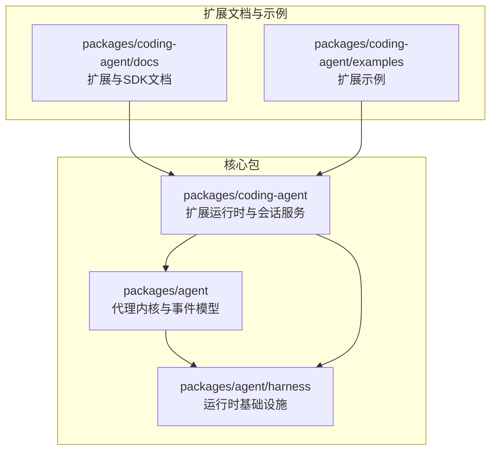
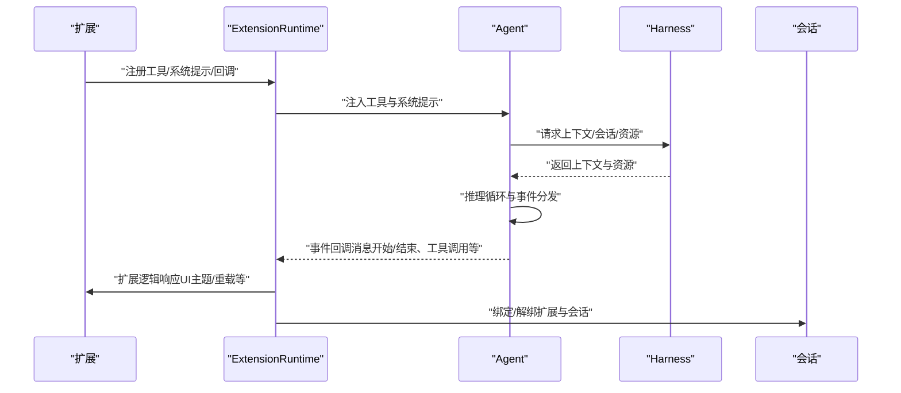
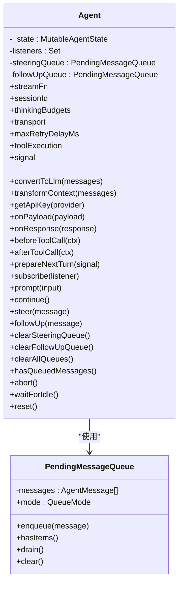
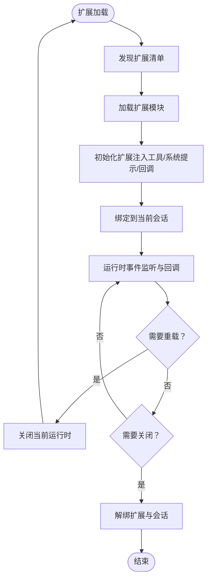
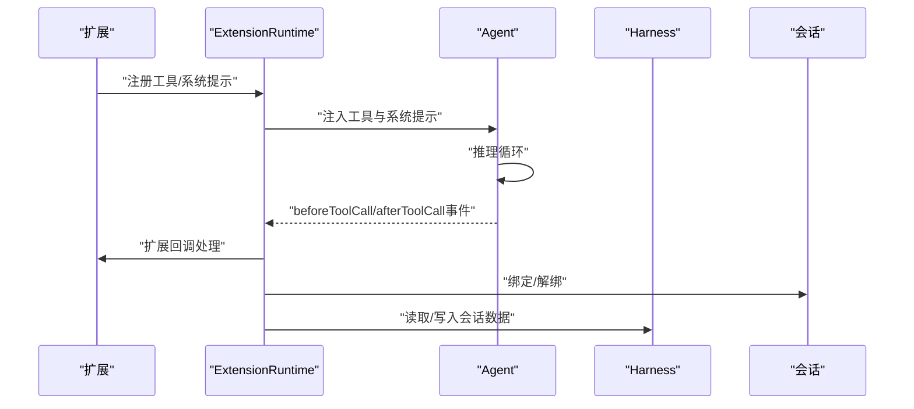
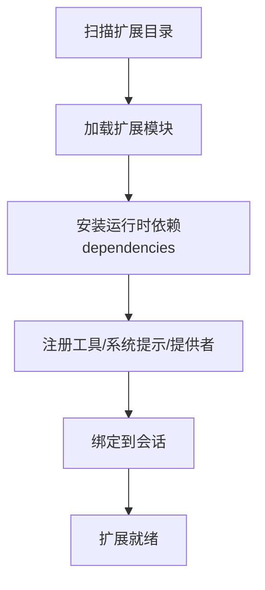
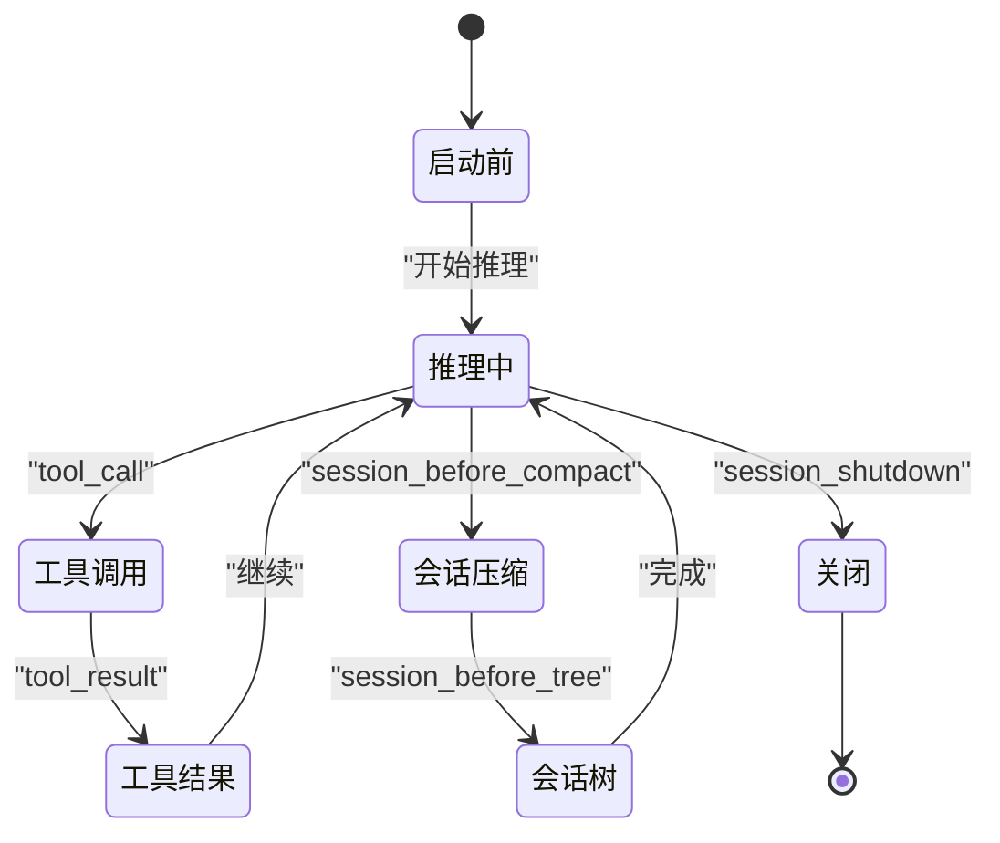
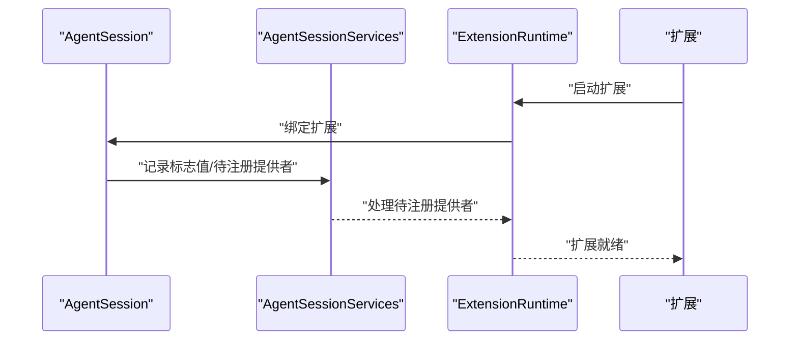
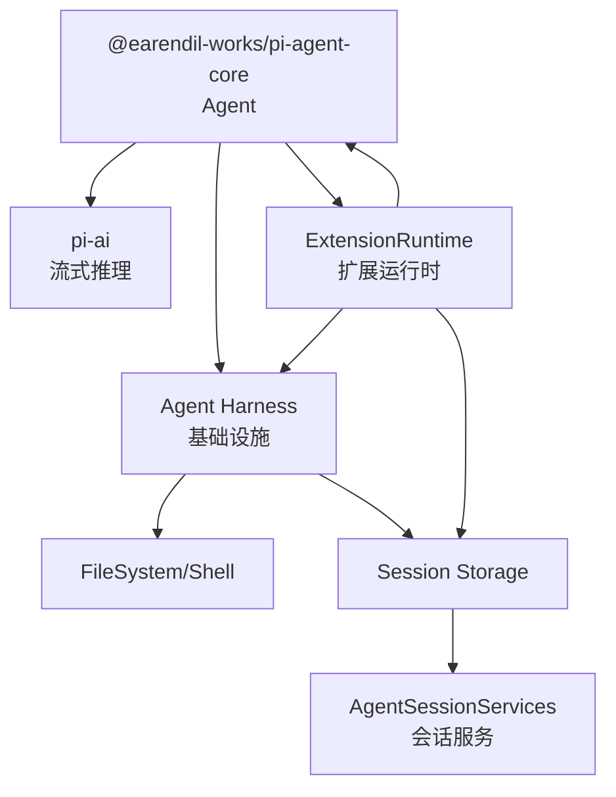

# 扩展架构设计

<cite>
**本文档引用的文件**
- [package.json](file://package.json)
- [packages/agent/src/agent.ts](file://packages/agent/src/agent.ts)
- [packages/agent/src/harness/types.ts](file://packages/agent/src/harness/types.ts)
- [packages/agent/src/harness/agent-harness.ts](file://packages/agent/src/harness/agent-harness.ts)
- [packages/agent/src/harness/session/session.ts](file://packages/agent/src/harness/session/session.ts)
- [packages/agent/src/harness/system-prompt.ts](file://packages/agent/src/harness/system-prompt.ts)
- [packages/agent/src/harness/env/nodejs.ts](file://packages/agent/src/harness/env/nodejs.ts)
- [packages/agent/src/harness/skills.ts](file://packages/agent/src/harness/skills.ts)
- [packages/agent/src/harness/prompt-templates.ts](file://packages/agent/src/harness/prompt-templates.ts)
- [packages/agent/src/harness/messages.ts](file://packages/agent/src/harness/messages.ts)
- [packages/agent/src/harness/utils/shell-output.ts](file://packages/agent/src/harness/utils/shell-output.ts)
- [packages/agent/src/harness/session/memory-storage.ts](file://packages/agent/src/harness/session/memory-storage.ts)
- [packages/agent/src/harness/session/jsonl-storage.ts](file://packages/agent/src/harness/session/jsonl-storage.ts)
- [packages/agent/src/harness/session/jsonl-repo.ts](file://packages/agent/src/harness/session/jsonl-repo.ts)
- [packages/agent/src/harness/session/repo-utils.ts](file://packages/agent/src/harness/session/repo-utils.ts)
- [packages/agent/src/harness/session/uuid.ts](file://packages/agent/src/harness/session/uuid.ts)
- [packages/agent/src/harness/compaction/compaction.ts](file://packages/agent/src/harness/compaction/compaction.ts)
- [packages/agent/src/harness/compaction/branch-summarization.ts](file://packages/agent/src/harness/compaction/branch-summarization.ts)
- [packages/agent/src/harness/compaction/utils.ts](file://packages/agent/src/harness/compaction/utils.ts)
- [packages/coding-agent/docs/extensions.md](file://packages/coding-agent/docs/extensions.md)
- [packages/coding-agent/docs/sdk.md](file://packages/coding-agent/docs/sdk.md)
- [packages/coding-agent/src/core/agent-session.ts](file://packages/coding-agent/src/core/agent-session.ts)
- [packages/coding-agent/src/core/agent-session-services.ts](file://packages/coding-agent/src/core/agent-session-services.ts)
- [packages/coding-agent/package.json](file://packages/coding-agent/package.json)
</cite>

## 目录
1. [引言](#引言)
2. [项目结构](#项目结构)
3. [核心组件](#核心组件)
4. [架构总览](#架构总览)
5. [详细组件分析](#详细组件分析)
6. [依赖分析](#依赖分析)
7. [性能考虑](#性能考虑)
8. [故障排除指南](#故障排除指南)
9. [结论](#结论)
10. [附录](#附录)

## 引言
本文件面向Pi扩展架构设计，系统性阐述扩展系统的整体架构、扩展加载机制、运行时管理与生命周期事件处理。重点解析ExtensionRuntime类的设计原理（扩展发现、加载与初始化）、扩展与代理核心的交互模式（事件驱动与回调机制）、扩展注册流程与依赖管理，并给出最佳实践（性能与错误处理）。文档包含架构图与代码示例路径，帮助读者从高层到实现细节全面理解扩展系统。

## 项目结构
Pi采用Monorepo组织，扩展能力主要由coding-agent包提供，agent包提供基础代理内核与事件模型，harness包提供会话、资源、工具等运行时基础设施。扩展文档位于coding-agent/docs中，扩展示例位于coding-agent/examples。

**图表来源**
- [package.json:1-60](file://package.json#L1-L60)
- [packages/coding-agent/package.json:1-61](file://packages/coding-agent/package.json#L1-L61)

**章节来源**
- [package.json:1-60](file://package.json#L1-L60)
- [packages/coding-agent/package.json:1-61](file://packages/coding-agent/package.json#L1-L61)

## 核心组件
- 代理内核（Agent）：封装状态、事件订阅、消息队列、生命周期管理与流式输出回调。负责将扩展注入的工具与系统提示整合进推理循环。
- 运行时基础设施（Harness）：提供文件系统、Shell执行、会话存储、思维级别与模型切换、资源与技能管理、分支摘要与压缩等能力。
- 扩展运行时（ExtensionRuntime）：在coding-agent中作为扩展装载与生命周期管理的核心载体，支持动态注册、事件绑定、主题切换、运行时重载等。
- 会话服务（AgentSession/AgentSessionServices）：负责扩展与会话的绑定、运行时标志值管理、提供者注册等。

**章节来源**
- [packages/agent/src/agent.ts:166-558](file://packages/agent/src/agent.ts#L166-L558)
- [packages/agent/src/harness/types.ts:1-834](file://packages/agent/src/harness/types.ts#L1-L834)
- [packages/coding-agent/docs/extensions.md:453-1172](file://packages/coding-agent/docs/extensions.md#L453-L1172)
- [packages/coding-agent/src/core/agent-session.ts:183-2201](file://packages/coding-agent/src/core/agent-session.ts#L183-L2201)
- [packages/coding-agent/src/core/agent-session-services.ts:102-159](file://packages/coding-agent/src/core/agent-session-services.ts#L102-L159)

## 架构总览
扩展架构围绕“事件驱动 + 回调机制”的核心范式构建。Agent通过事件回调将内部状态变化通知给扩展；扩展通过ExtensionRuntime向Agent注入工具、修改系统提示、控制模型与思维级别、触发UI主题切换与运行时重载等。

**图表来源**
- [packages/agent/src/agent.ts:386-449](file://packages/agent/src/agent.ts#L386-L449)
- [packages/agent/src/harness/types.ts:658-660](file://packages/agent/src/harness/types.ts#L658-L660)
- [packages/coding-agent/docs/extensions.md:1172-1172](file://packages/coding-agent/docs/extensions.md#L1172-L1172)
- [packages/coding-agent/src/core/agent-session.ts:183-2201](file://packages/coding-agent/src/core/agent-session.ts#L183-L2201)

## 详细组件分析

### Agent类与事件驱动架构
Agent是扩展交互的核心入口。它维护当前对话状态、工具集合、消息队列，并通过事件回调与扩展进行交互。其生命周期包括启动、事件处理、失败回退与收尾。

**图表来源**
- [packages/agent/src/agent.ts:166-558](file://packages/agent/src/agent.ts#L166-L558)

**章节来源**
- [packages/agent/src/agent.ts:166-558](file://packages/agent/src/agent.ts#L166-L558)

### ExtensionRuntime设计原理
ExtensionRuntime是扩展运行时的核心抽象，负责扩展的发现、加载、初始化与生命周期管理。根据文档，其特性包括：
- 动态注册：扩展可注册工具、系统提示、UI主题等。
- 事件绑定：扩展可订阅Agent/Harness事件，实现回调响应。
- 运行时重载：支持ctx.reload()触发完整运行时重启。
- 会话绑定：扩展与会话建立绑定关系，确保状态一致性。

**图表来源**
- [packages/coding-agent/docs/extensions.md:453-1172](file://packages/coding-agent/docs/extensions.md#L453-L1172)
- [packages/coding-agent/src/core/agent-session-services.ts:102-159](file://packages/coding-agent/src/core/agent-session-services.ts#L102-L159)

**章节来源**
- [packages/coding-agent/docs/extensions.md:453-1172](file://packages/coding-agent/docs/extensions.md#L453-L1172)
- [packages/coding-agent/src/core/agent-session-services.ts:102-159](file://packages/coding-agent/src/core/agent-session-services.ts#L102-L159)

### 扩展与代理核心的交互模式
扩展通过ExtensionRuntime与Agent/Harness交互，典型交互包括：
- 工具注入：扩展注册AgentTool，Agent在推理循环中调用beforeToolCall/afterToolCall回调。
- 系统提示与资源：扩展可提供系统提示或技能模板，Harness将其纳入上下文。
- UI与主题：扩展可通过ctx.ui接口切换主题，影响运行时UI表现。
- 会话绑定：扩展与会话绑定后，可在会话树操作、分支摘要、压缩等阶段参与。

**图表来源**
- [packages/agent/src/agent.ts:178-218](file://packages/agent/src/agent.ts#L178-L218)
- [packages/agent/src/harness/types.ts:658-660](file://packages/agent/src/harness/types.ts#L658-L660)
- [packages/coding-agent/src/core/agent-session.ts:183-2201](file://packages/coding-agent/src/core/agent-session.ts#L183-L2201)

**章节来源**
- [packages/agent/src/agent.ts:178-218](file://packages/agent/src/agent.ts#L178-L218)
- [packages/agent/src/harness/types.ts:658-660](file://packages/agent/src/harness/types.ts#L658-L660)
- [packages/coding-agent/src/core/agent-session.ts:183-2201](file://packages/coding-agent/src/core/agent-session.ts#L183-L2201)

### 扩展注册流程与依赖管理
扩展注册涉及以下步骤：
- 发现与加载：扫描扩展目录，按工作区配置加载扩展模块。
- 注册工具与系统提示：扩展通过ExtensionRuntime注册AgentTool与系统提示。
- 依赖安装：扩展运行时依赖需来自dependencies而非devDependencies，以保证生产环境可用。
- 提供者注册：扩展可注册第三方提供者，AgentSessionServices负责处理待注册列表。

**图表来源**
- [packages/coding-agent/CHANGELOG.md:689-689](file://packages/coding-agent/CHANGELOG.md#L689-L689)
- [packages/coding-agent/src/core/agent-session-services.ts:148-159](file://packages/coding-agent/src/core/agent-session-services.ts#L148-L159)

**章节来源**
- [packages/coding-agent/CHANGELOG.md:689-689](file://packages/coding-agent/CHANGELOG.md#L689-L689)
- [packages/coding-agent/src/core/agent-session-services.ts:148-159](file://packages/coding-agent/src/core/agent-session-services.ts#L148-L159)

### 扩展生命周期事件处理
扩展生命周期事件包括：
- 启动前事件：before_agent_start，允许扩展调整初始消息与系统提示。
- 推理事件：tool_call/tool_result，扩展可阻断或修补工具结果。
- 会话事件：session_before_compact/session_compact/session_before_tree/session_tree，扩展可参与压缩与分支摘要。
- 关闭事件：session_shutdown，扩展在运行时关闭前收到通知。

**图表来源**
- [packages/agent/src/harness/types.ts:523-656](file://packages/agent/src/harness/types.ts#L523-L656)
- [packages/coding-agent/docs/extensions.md:453-453](file://packages/coding-agent/docs/extensions.md#L453-L453)

**章节来源**
- [packages/agent/src/harness/types.ts:523-656](file://packages/agent/src/harness/types.ts#L523-L656)
- [packages/coding-agent/docs/extensions.md:453-453](file://packages/coding-agent/docs/extensions.md#L453-L453)

### 扩展与会话服务的集成
AgentSession与AgentSessionServices负责扩展与会话的绑定与管理：
- 绑定扩展：扩展启动时与会话建立绑定，确保事件与状态一致。
- 标志值管理：运行时标志值用于控制扩展行为。
- 提供者注册：扩展注册的提供者在会话服务中统一处理。

**图表来源**
- [packages/coding-agent/src/core/agent-session.ts:183-2201](file://packages/coding-agent/src/core/agent-session.ts#L183-L2201)
- [packages/coding-agent/src/core/agent-session-services.ts:102-159](file://packages/coding-agent/src/core/agent-session-services.ts#L102-L159)

**章节来源**
- [packages/coding-agent/src/core/agent-session.ts:183-2201](file://packages/coding-agent/src/core/agent-session.ts#L183-L2201)
- [packages/coding-agent/src/core/agent-session-services.ts:102-159](file://packages/coding-agent/src/core/agent-session-services.ts#L102-L159)

## 依赖分析
扩展系统的关键依赖关系如下：
- Agent依赖pi-ai进行流式推理与消息转换。
- Harness提供文件系统、Shell执行、会话存储等基础设施。
- ExtensionRuntime依赖Agent与Harness提供的能力，同时管理扩展生命周期。
- 会话服务负责扩展与会话的绑定与注册处理。

**图表来源**
- [packages/agent/src/agent.ts:1-11](file://packages/agent/src/agent.ts#L1-L11)
- [packages/agent/src/harness/types.ts:1-4](file://packages/agent/src/harness/types.ts#L1-L4)
- [packages/coding-agent/src/core/agent-session-services.ts:102-159](file://packages/coding-agent/src/core/agent-session-services.ts#L102-L159)

**章节来源**
- [packages/agent/src/agent.ts:1-11](file://packages/agent/src/agent.ts#L1-L11)
- [packages/agent/src/harness/types.ts:1-4](file://packages/agent/src/harness/types.ts#L1-L4)
- [packages/coding-agent/src/core/agent-session-services.ts:102-159](file://packages/coding-agent/src/core/agent-session-services.ts#L102-L159)

## 性能考虑
- 流式输出与回调：通过streamFn与onPayload/onResponse回调减少内存占用，避免一次性缓冲大量中间结果。
- 队列模式：steeringMode与followUpMode支持批量或单条注入，平衡实时性与吞吐量。
- 会话压缩与分支摘要：在长对话场景下，合理使用压缩与摘要降低上下文开销。
- 依赖安装优化：扩展运行时依赖应放入dependencies，避免开发依赖带来的体积与加载时间开销。

[本节为通用指导，无需具体文件分析]

## 故障排除指南
- 运行时重载：若扩展触发ctx.reload()，会先发出session_shutdown事件，随后重建运行时。确认扩展在重载前后正确处理状态清理与重新绑定。
- 事件丢失：确保扩展在绑定会话后订阅所需事件，避免在Agent.runWithLifecycle之外调用listener导致异常。
- 文件系统与Shell错误：Harness提供稳定的错误码（如FileError/ExecutionError），扩展应捕获并适配不同错误类型。
- 会话绑定问题：扩展与会话绑定失败时，检查AgentSessionServices中的待注册提供者与标志值是否正确更新。

**章节来源**
- [packages/coding-agent/docs/extensions.md:1172-1172](file://packages/coding-agent/docs/extensions.md#L1172-L1172)
- [packages/agent/src/agent.ts:509-556](file://packages/agent/src/agent.ts#L509-L556)
- [packages/agent/src/harness/types.ts:122-155](file://packages/agent/src/harness/types.ts#L122-L155)
- [packages/coding-agent/src/core/agent-session-services.ts:148-159](file://packages/coding-agent/src/core/agent-session-services.ts#L148-L159)

## 结论
Pi扩展架构以Agent为核心，结合ExtensionRuntime与Harness基础设施，实现了事件驱动与回调机制下的高扩展性。通过清晰的生命周期事件、严格的依赖管理与会话绑定，扩展能够在不破坏核心稳定性的前提下灵活增强代理能力。建议在实际工程中遵循性能与错误处理最佳实践，确保扩展在复杂场景下的可靠性与可维护性。

[本节为总结，无需具体文件分析]

## 附录
- 扩展文档与示例路径参考：
  - [packages/coding-agent/docs/extensions.md](file://packages/coding-agent/docs/extensions.md)
  - [packages/coding-agent/docs/sdk.md](file://packages/coding-agent/docs/sdk.md)
  - [packages/coding-agent/examples](file://packages/coding-agent/examples)

[本节为补充信息，无需具体文件分析]