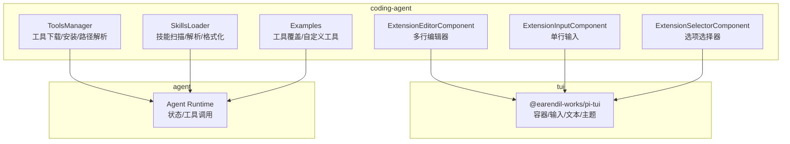
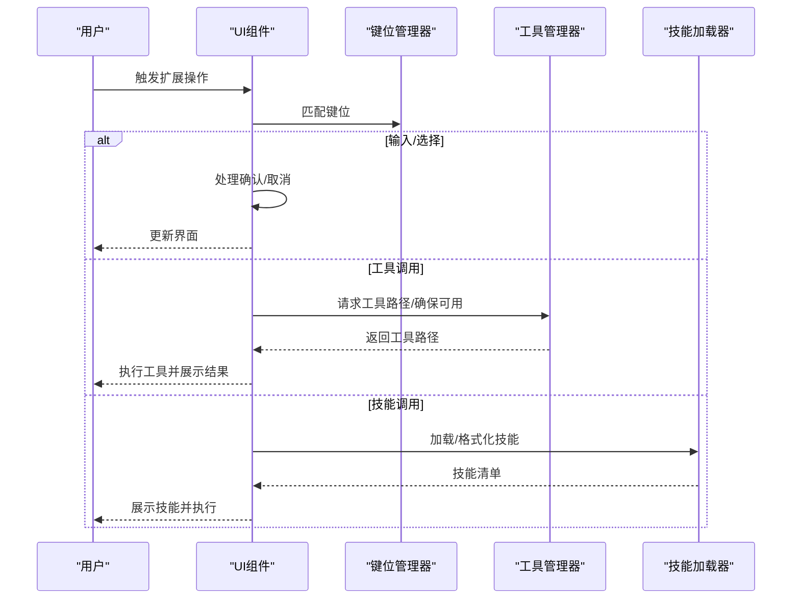
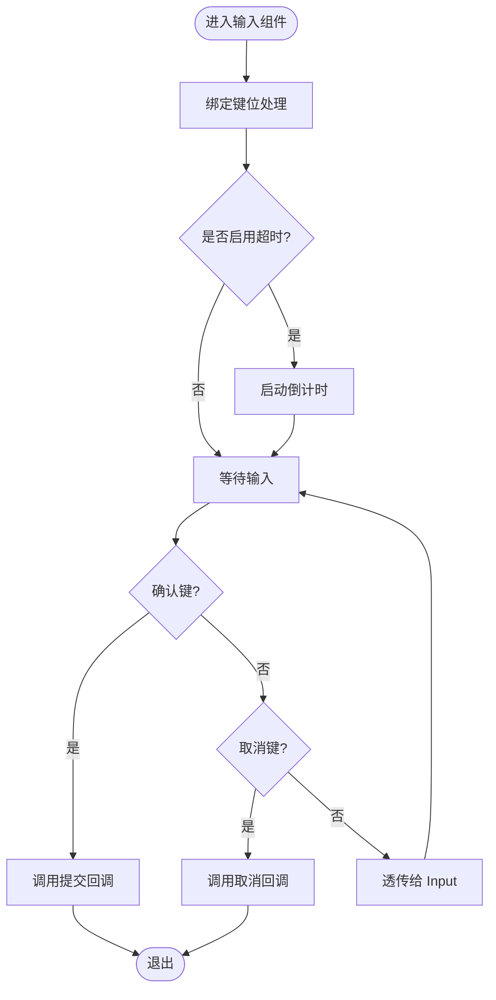
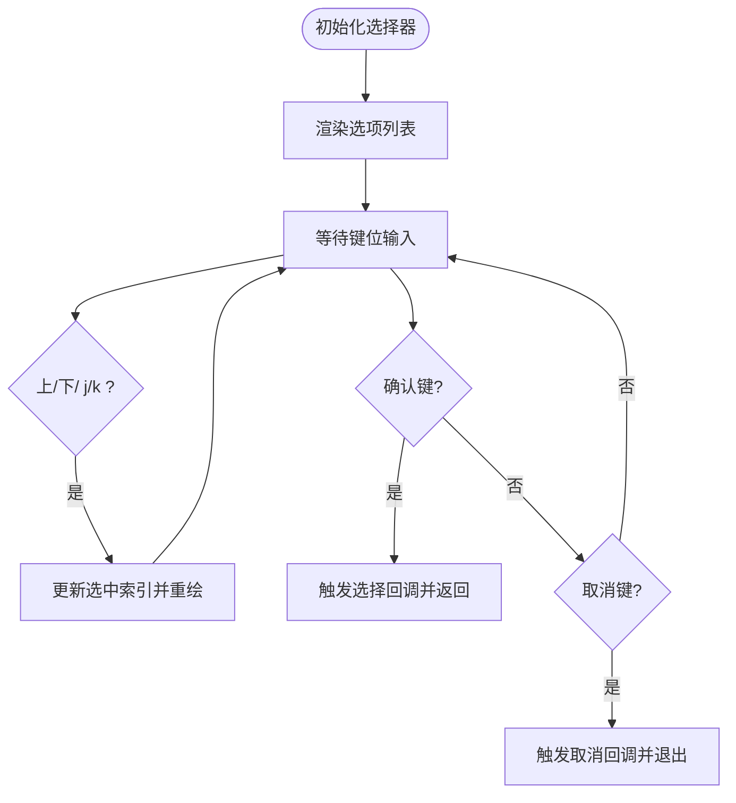
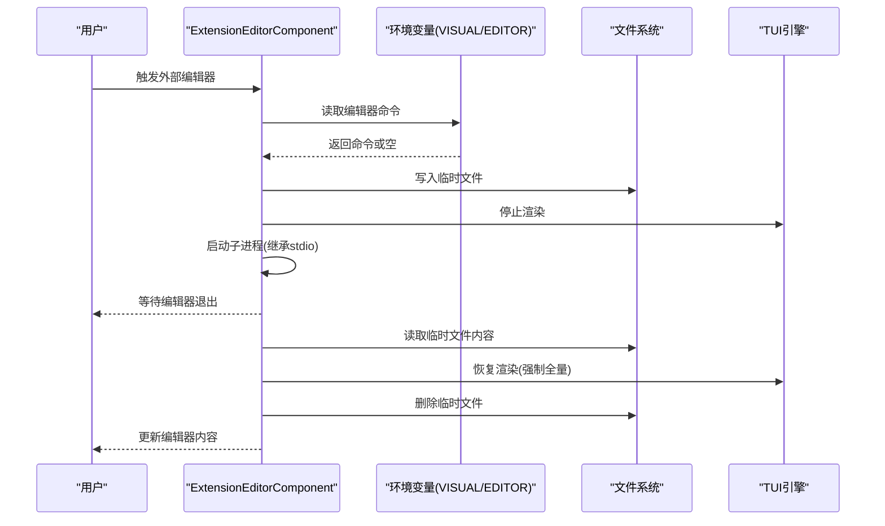
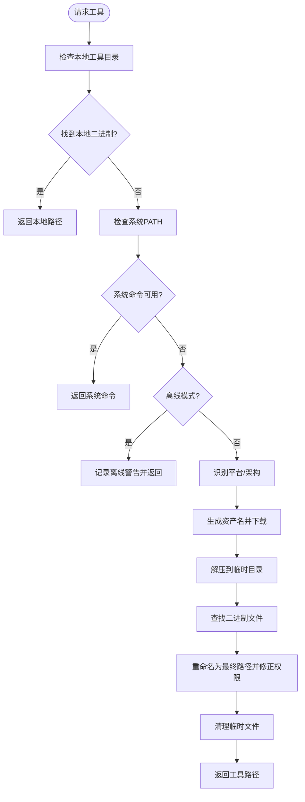
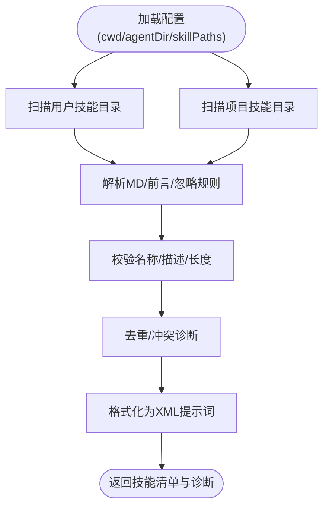
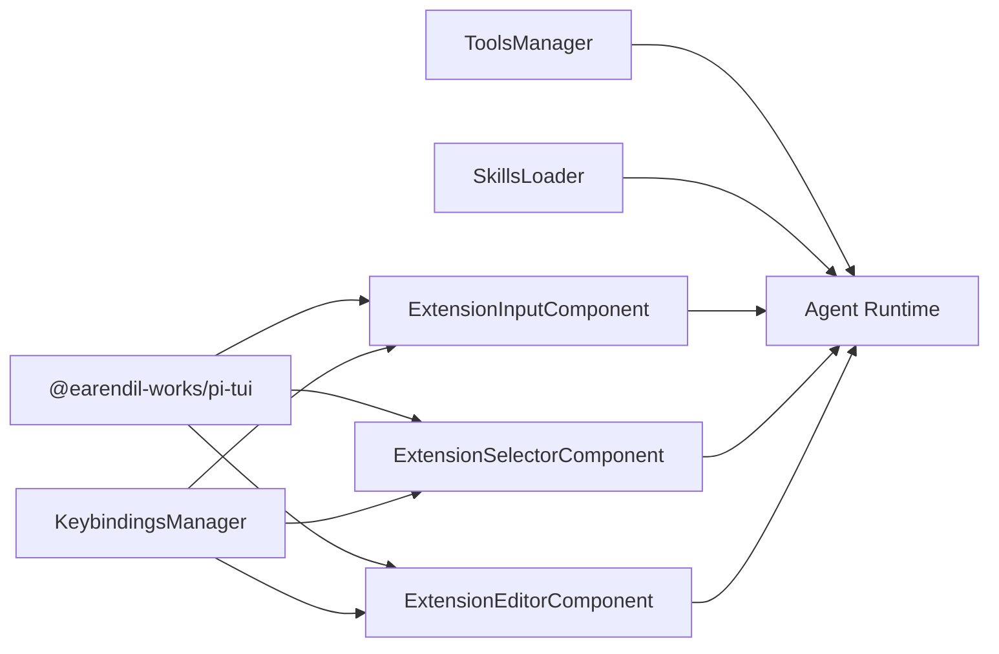

# 扩展系统

<cite>
**本文引用的文件**
- [README.md](file://README.md)
- [extension-editor.ts](file://packages/coding-agent/src/modes/interactive/components/extension-editor.ts)
- [extension-input.ts](file://packages/coding-agent/src/modes/interactive/components/extension-input.ts)
- [extension-selector.ts](file://packages/coding-agent/src/modes/interactive/components/extension-selector.ts)
- [tools-manager.ts](file://packages/coding-agent/src/utils/tools-manager.ts)
- [skills.ts](file://packages/coding-agent/src/core/skills.ts)
- [tool-override.ts](file://packages/coding-agent/examples/extensions/tool-override.ts)
- [tools.ts](file://packages/coding-agent/examples/extensions/tools.ts)
</cite>

## 目录
1. [简介](#简介)
2. [项目结构](#项目结构)
3. [核心组件](#核心组件)
4. [架构总览](#架构总览)
5. [详细组件分析](#详细组件分析)
6. [依赖关系分析](#依赖关系分析)
7. [性能考量](#性能考量)
8. [故障排查指南](#故障排查指南)
9. [结论](#结论)
10. [附录：扩展开发示例与最佳实践](#附录扩展开发示例与最佳实践)

## 简介
本指南面向希望在 Pi 编码代理中进行扩展开发的工程师，系统性讲解扩展架构设计与实现要点，涵盖以下主题：
- 工具注册与管理（二进制工具下载、安装与路径解析）
- UI 组件开发（输入、选择器、多行编辑器）
- 键盘绑定配置（键位匹配与交互提示）
- 扩展 API 使用方法（创建自定义工具、UI 组件与技能）
- 事件系统与认证存储的实现机制
- 最佳实践（代码组织、测试策略、性能优化）
- 完整示例（从简单工具到复杂 UI 组件）

Pi 的扩展体系以“可发现、可加载、可执行”为核心目标，通过统一的工具管理器、技能加载器以及交互式 UI 组件，为开发者提供一致的扩展体验。

章节来源
- [README.md:19-31](file://README.md#L19-L31)

## 项目结构
Pi 采用多包工作区结构，扩展系统主要分布在 coding-agent 包中，同时与 agent 核心、AI 多提供商接口、TUI 终端界面库协同工作。扩展系统的关键模块包括：
- 交互式 UI 组件：输入框、选择器、多行编辑器
- 工具管理器：二进制工具下载、解压、路径解析与可用性检测
- 技能加载器：从用户与项目目录扫描、解析、格式化技能清单
- 示例扩展：工具覆盖与自定义工具示例

图表来源
- [extension-editor.ts:1-157](file://packages/coding-agent/src/modes/interactive/components/extension-editor.ts#L1-L157)
- [extension-input.ts:1-88](file://packages/coding-agent/src/modes/interactive/components/extension-input.ts#L1-L88)
- [extension-selector.ts:1-113](file://packages/coding-agent/src/modes/interactive/components/extension-selector.ts#L1-L113)
- [tools-manager.ts:1-370](file://packages/coding-agent/src/utils/tools-manager.ts#L1-L370)
- [skills.ts:1-488](file://packages/coding-agent/src/core/skills.ts#L1-L488)

章节来源
- [README.md:48-57](file://README.md#L48-L57)

## 核心组件
本节聚焦扩展系统中的三大核心组件：输入组件、选择器组件与多行编辑器组件。它们共同构成扩展交互的基础 UI 层，负责接收用户输入、展示选项列表、支持外部编辑器集成等。

- 输入组件（ExtensionInputComponent）
  - 功能：单行文本输入，支持超时倒计时、确认/取消键位处理
  - 关键点：焦点传播、键位匹配、倒计时回调、资源释放
- 选择器组件（ExtensionSelectorComponent）
  - 功能：上下导航、确认/取消、显示当前选中项
  - 关键点：选项渲染、键位映射、超时倒计时、展开工具列表回调
- 多行编辑器组件（ExtensionEditorComponent）
  - 功能：多行文本编辑，支持外部编辑器（VISUAL/EDITOR）集成
  - 关键点：临时文件写入/读取、子进程启动、全屏渲染恢复

章节来源
- [extension-input.ts:16-88](file://packages/coding-agent/src/modes/interactive/components/extension-input.ts#L16-L88)
- [extension-selector.ts:18-113](file://packages/coding-agent/src/modes/interactive/components/extension-selector.ts#L18-L113)
- [extension-editor.ts:25-157](file://packages/coding-agent/src/modes/interactive/components/extension-editor.ts#L25-L157)

## 架构总览
扩展系统的运行流程可概括为：用户触发扩展操作 → UI 组件捕获输入 → 键位管理器匹配 → 调用工具或技能 → 返回结果并更新界面。工具与技能分别由工具管理器与技能加载器提供支持。

图表来源
- [extension-input.ts:73-82](file://packages/coding-agent/src/modes/interactive/components/extension-input.ts#L73-L82)
- [extension-selector.ts:91-107](file://packages/coding-agent/src/modes/interactive/components/extension-selector.ts#L91-L107)
- [extension-editor.ts:95-111](file://packages/coding-agent/src/modes/interactive/components/extension-editor.ts#L95-L111)
- [tools-manager.ts:326-370](file://packages/coding-agent/src/utils/tools-manager.ts#L326-L370)
- [skills.ts:387-487](file://packages/coding-agent/src/core/skills.ts#L387-L487)

## 详细组件分析

### 输入组件（ExtensionInputComponent）
- 设计要点
  - 实现 Focusable 接口，将焦点状态传递给内部 Input 控件，保证 IME 光标定位正确
  - 支持可选超时倒计时，倒计时结束自动取消
  - 键位处理：确认键提交、取消键关闭、其他字符交由 Input 处理
- 数据流
  - 用户输入 → 键位匹配 → 提交/取消回调 → 渲染更新
- 性能与健壮性
  - 倒计时定时器在组件销毁时释放，避免内存泄漏
  - 文本渲染与布局通过 TUI 主题与间距控制，保持一致性

图表来源
- [extension-input.ts:73-82](file://packages/coding-agent/src/modes/interactive/components/extension-input.ts#L73-L82)
- [extension-input.ts:84-86](file://packages/coding-agent/src/modes/interactive/components/extension-input.ts#L84-L86)

章节来源
- [extension-input.ts:16-88](file://packages/coding-agent/src/modes/interactive/components/extension-input.ts#L16-L88)

### 选择器组件（ExtensionSelectorComponent）
- 设计要点
  - 维护选项列表与当前索引，动态渲染选中项高亮
  - 键位支持方向键与“j/k”移动，确认键选择，取消键关闭
  - 可选回调用于展开工具列表，便于与工具面板联动
- 数据流
  - 初始化 → 渲染选项 → 键位处理 → 更新选中项 → 选择回调 → 清理资源
- 性能与健壮性
  - 列表重绘仅更新选中态，避免全量重排
  - 超时倒计时与输入组件一致，统一生命周期管理

图表来源
- [extension-selector.ts:80-89](file://packages/coding-agent/src/modes/interactive/components/extension-selector.ts#L80-L89)
- [extension-selector.ts:91-107](file://packages/coding-agent/src/modes/interactive/components/extension-selector.ts#L91-L107)

章节来源
- [extension-selector.ts:18-113](file://packages/coding-agent/src/modes/interactive/components/extension-selector.ts#L18-L113)

### 多行编辑器组件（ExtensionEditorComponent）
- 设计要点
  - 封装 TUI Editor，支持 Ctrl+G 调用外部编辑器（VISUAL/EDITOR）
  - 内部使用临时文件保存/恢复内容，确保跨屏幕编辑体验
  - 键位处理：Escape/Ctrl+C 取消；外部编辑键打开编辑器；回车提交
- 数据流
  - 用户触发 → 检查外部编辑器 → 启动子进程 → 编辑完成 → 读取临时文件 → 恢复渲染
- 性能与健壮性
  - 异步子进程避免阻塞主线程；全屏模式结束后强制请求全量重绘
  - 临时文件清理与异常保护，防止残留文件影响后续使用

图表来源
- [extension-editor.ts:104-111](file://packages/coding-agent/src/modes/interactive/components/extension-editor.ts#L104-L111)
- [extension-editor.ts:113-155](file://packages/coding-agent/src/modes/interactive/components/extension-editor.ts#L113-L155)

章节来源
- [extension-editor.ts:25-157](file://packages/coding-agent/src/modes/interactive/components/extension-editor.ts#L25-L157)

### 工具管理器（ToolsManager）
- 设计要点
  - 配置化工具元数据（仓库、二进制名、平台资产命名规则）
  - 路径优先级：本地工具目录 > 系统 PATH > 下载安装
  - 平台适配：Darwin/Linux/Win32 不同归档格式与解压方式
  - 并发安全：下载与解压使用唯一临时目录，避免竞态
- 数据流
  - 请求工具 → 检测本地/系统路径 → 可用则返回路径 → 不可用则下载并安装 → 返回路径
- 性能与健壮性
  - 超时控制（网络/下载）、错误信息格式化、权限修正（Unix）
  - Termux 场景提示用户通过包管理器安装

图表来源
- [tools-manager.ts:84-104](file://packages/coding-agent/src/utils/tools-manager.ts#L84-L104)
- [tools-manager.ts:241-316](file://packages/coding-agent/src/utils/tools-manager.ts#L241-L316)
- [tools-manager.ts:326-370](file://packages/coding-agent/src/utils/tools-manager.ts#L326-L370)

章节来源
- [tools-manager.ts:1-370](file://packages/coding-agent/src/utils/tools-manager.ts#L1-L370)

### 技能加载器（SkillsLoader）
- 设计要点
  - 从用户目录与项目目录扫描技能，支持 .md 文件与 SKILL.md 根标记
  - 忽略规则：支持 .gitignore/.ignore/.fdignore，递归合并前缀模式
  - 前言校验：名称长度与字符集限制、描述必填且长度限制
  - 格式化输出：XML 标准格式，供系统提示词使用
- 数据流
  - 解析配置 → 扫描目录 → 过滤/去重 → 校验/诊断 → 合并结果
- 性能与健壮性
  - 符号链接检测与去重，避免重复加载
  - 路径规范化与冲突诊断，提升稳定性

图表来源
- [skills.ts:168-275](file://packages/coding-agent/src/core/skills.ts#L168-L275)
- [skills.ts:277-325](file://packages/coding-agent/src/core/skills.ts#L277-L325)
- [skills.ts:387-487](file://packages/coding-agent/src/core/skills.ts#L387-L487)

章节来源
- [skills.ts:1-488](file://packages/coding-agent/src/core/skills.ts#L1-L488)

## 依赖关系分析
扩展系统各组件之间的依赖关系如下：
- UI 组件依赖 TUI 库（容器、输入、文本、主题）
- 键位匹配依赖键位管理器（统一键位常量与匹配逻辑）
- 工具管理器与技能加载器作为后端服务被 UI 组件调用
- 示例扩展通过工具覆盖与自定义工具演示扩展能力

图表来源
- [extension-input.ts:5-21](file://packages/coding-agent/src/modes/interactive/components/extension-input.ts#L5-L21)
- [extension-selector.ts:6-11](file://packages/coding-agent/src/modes/interactive/components/extension-selector.ts#L6-L11)
- [extension-editor.ts:10-24](file://packages/coding-agent/src/modes/interactive/components/extension-editor.ts#L10-L24)
- [tools-manager.ts:1-12](file://packages/coding-agent/src/utils/tools-manager.ts#L1-L12)
- [skills.ts:1-9](file://packages/coding-agent/src/core/skills.ts#L1-L9)

章节来源
- [extension-input.ts:1-88](file://packages/coding-agent/src/modes/interactive/components/extension-input.ts#L1-L88)
- [extension-selector.ts:1-113](file://packages/coding-agent/src/modes/interactive/components/extension-selector.ts#L1-L113)
- [extension-editor.ts:1-157](file://packages/coding-agent/src/modes/interactive/components/extension-editor.ts#L1-L157)
- [tools-manager.ts:1-370](file://packages/coding-agent/src/utils/tools-manager.ts#L1-L370)
- [skills.ts:1-488](file://packages/coding-agent/src/core/skills.ts#L1-L488)

## 性能考量
- UI 组件
  - 选择器与输入组件仅在状态变化时重绘，减少 TUI 刷新开销
  - 倒计时使用轻量定时器，组件销毁时及时释放
- 工具管理器
  - 并发下载与解压使用唯一临时目录，避免共享目录导致的竞态
  - 超时控制与错误聚合，降低失败重试成本
- 技能加载器
  - 忽略规则预处理与路径规范化，减少无效 IO
  - 去重与冲突诊断在内存中完成，避免重复解析

[本节为通用指导，不直接分析具体文件]

## 故障排查指南
- 外部编辑器无法启动
  - 检查 VISUAL/EDITOR 环境变量是否设置
  - 确认子进程继承 stdio，避免终端输入冲突
  - 编辑器退出码非 0 时不会更新内容，需检查编辑器日志
- 工具不可用
  - 检查本地工具目录与系统 PATH 是否存在对应二进制
  - 离线模式会跳过下载，需手动安装
  - 平台不支持时（如 Android），按提示通过包管理器安装
- 技能未生效
  - 确认技能文件符合前言规范（名称/描述/长度）
  - 检查忽略文件规则是否误屏蔽
  - 查看诊断输出，关注名称冲突与路径不存在警告

章节来源
- [extension-editor.ts:113-155](file://packages/coding-agent/src/modes/interactive/components/extension-editor.ts#L113-L155)
- [tools-manager.ts:335-370](file://packages/coding-agent/src/utils/tools-manager.ts#L335-L370)
- [skills.ts:387-487](file://packages/coding-agent/src/core/skills.ts#L387-L487)

## 结论
Pi 的扩展系统以清晰的分层架构实现了“可发现、可加载、可执行”的扩展能力。UI 组件提供一致的交互体验，工具管理器与技能加载器保障扩展资源的可用性与稳定性。通过键位管理器与统一的主题/布局，扩展开发可以专注于业务逻辑，而不必关心底层交互细节。

[本节为总结性内容，不直接分析具体文件]

## 附录：扩展开发示例与最佳实践

### 示例一：工具覆盖（Tool Override）
- 目标：通过覆盖内置工具实现自定义行为
- 关键点：遵循工具元数据配置，确保资产命名与平台兼容
- 参考路径：[tool-override.ts](file://packages/coding-agent/examples/extensions/tool-override.ts)

章节来源
- [tool-override.ts](file://packages/coding-agent/examples/extensions/tool-override.ts)

### 示例二：自定义工具（Custom Tools）
- 目标：新增一个自定义工具并接入工具管理器
- 关键点：定义工具配置、实现资产命名规则、处理不同平台解压方式
- 参考路径：[tools.ts](file://packages/coding-agent/examples/extensions/tools.ts)

章节来源
- [tools.ts](file://packages/coding-agent/examples/extensions/tools.ts)

### 最佳实践
- 代码组织
  - UI 组件：按功能拆分，统一实现 Focusable 接口，集中处理键位匹配
  - 工具管理：配置化工具元数据，按平台抽象资产命名与解压流程
  - 技能加载：统一前言校验与忽略规则，提供诊断输出
- 测试策略
  - 单元测试：键位匹配、路径解析、技能解析、工具下载流程
  - 集成测试：外部编辑器启动、工具安装、技能加载与提示词格式化
- 性能优化
  - UI：最小化重绘范围，延迟初始化与懒加载
  - 工具：并发安全与超时控制，避免重复下载
  - 技能：预处理忽略规则，缓存解析结果

[本节为通用指导，不直接分析具体文件]