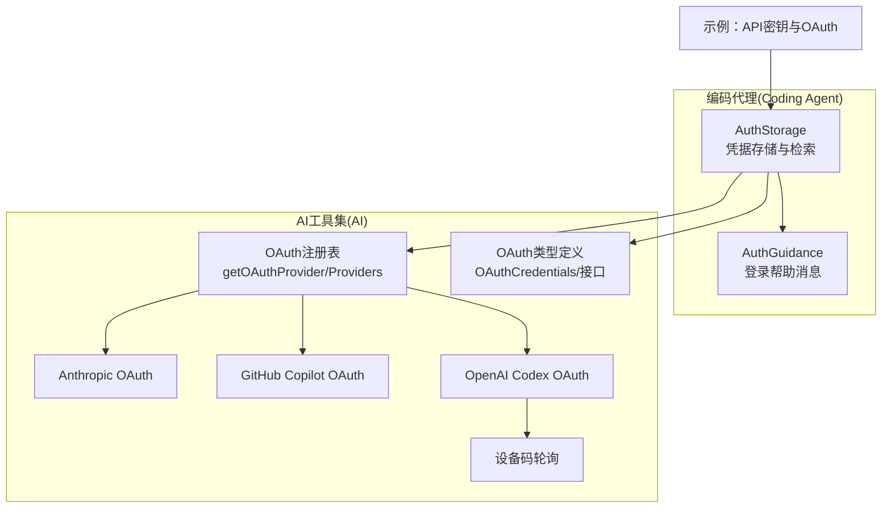
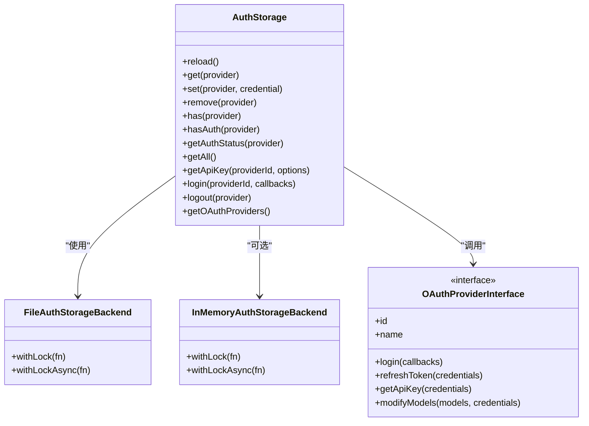
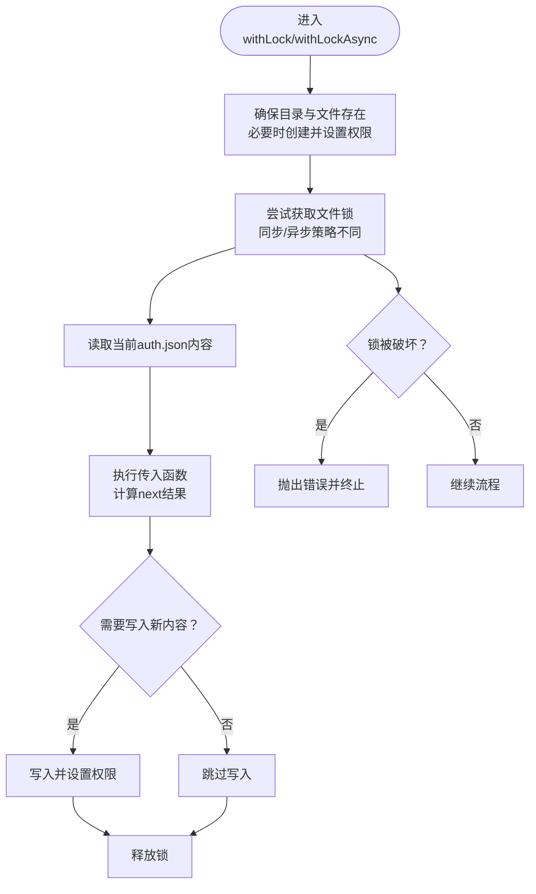
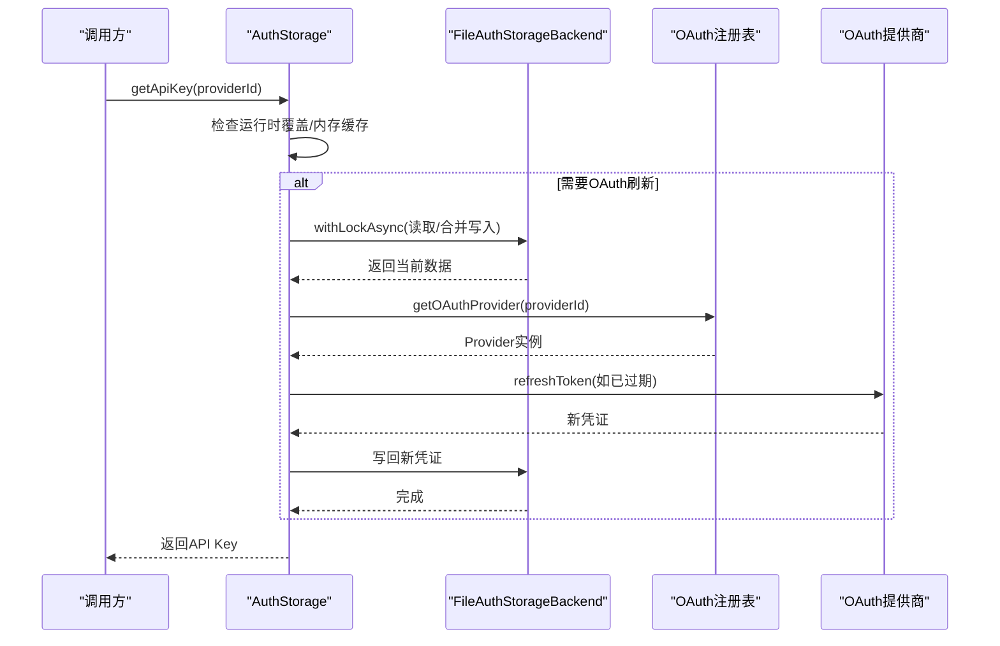
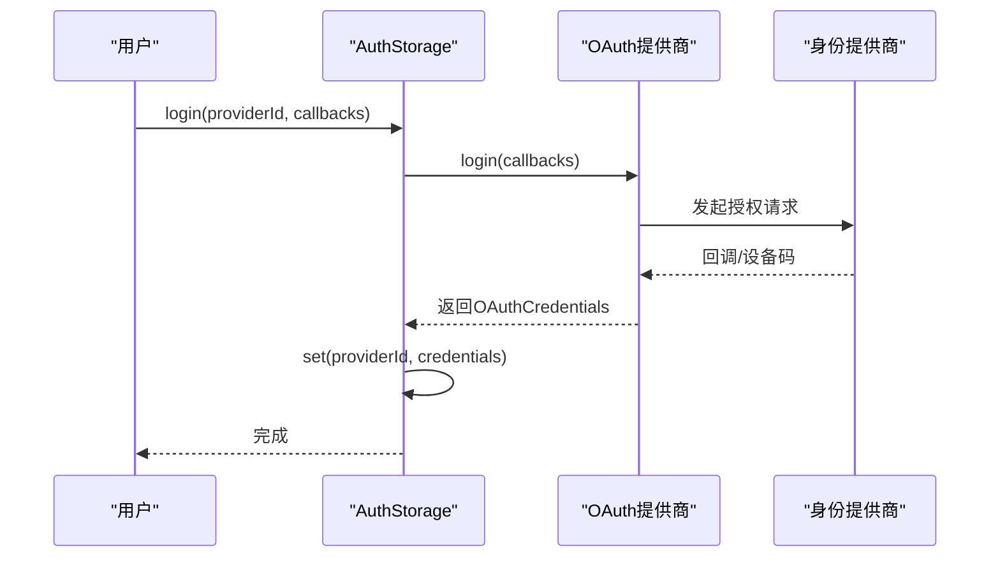
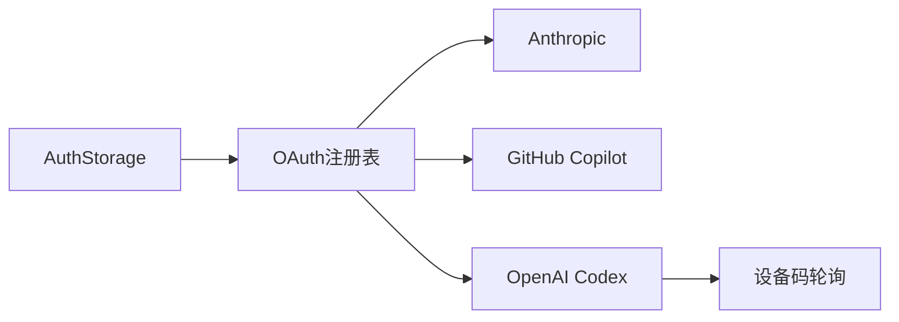

# 认证存储

<cite>
**本文引用的文件**
- [auth-storage.ts](file://packages/coding-agent/src/core/auth-storage.ts)
- [auth-guidance.ts](file://packages/coding-agent/src/core/auth-guidance.ts)
- [oauth.ts](file://packages/ai/src/oauth.ts)
- [index.ts（OAuth聚合）](file://packages/ai/src/utils/oauth/index.ts)
- [types.ts（OAuth类型）](file://packages/ai/src/utils/oauth/types.ts)
- [anthropic.ts（Anthropic OAuth）](file://packages/ai/src/utils/oauth/anthropic.ts)
- [github-copilot.ts（GitHub Copilot OAuth）](file://packages/ai/src/utils/oauth/github-copilot.ts)
- [openai-codex.ts（OpenAI Codex OAuth）](file://packages/ai/src/utils/oauth/openai-codex.ts)
- [device-code.ts（设备码轮询）](file://packages/ai/src/utils/oauth/device-code.ts)
- [09-api-keys-and-oauth.ts（示例：API密钥与OAuth）](file://packages/coding-agent/examples/sdk/09-api-keys-and-oauth.ts)
</cite>

## 目录
1. [简介](#简介)
2. [项目结构](#项目结构)
3. [核心组件](#核心组件)
4. [架构总览](#架构总览)
5. [详细组件分析](#详细组件分析)
6. [依赖关系分析](#依赖关系分析)
7. [性能考量](#性能考量)
8. [故障排查指南](#故障排查指南)
9. [结论](#结论)
10. [附录](#附录)

## 简介
本文件面向Pi认证存储系统，提供一份全面的安全文档，覆盖凭据的存储、检索与更新流程，加密与保护措施，与扩展系统的集成方式，以及多账户支持、凭据切换、失败处理与重试、备份与恢复、安全审计与监控等主题。文档同时给出基于仓库中现有实现的使用示例路径与最佳实践建议。

## 项目结构
Pi认证存储位于“coding-agent”包的核心模块中，围绕AuthStorage类构建；OAuth能力由“ai”包提供，通过注册表统一管理多个提供商（Anthropic、GitHub Copilot、OpenAI Codex）。示例代码展示了如何在会话中注入AuthStorage与ModelRegistry。

图表来源
- [auth-storage.ts:1-532](file://packages/coding-agent/src/core/auth-storage.ts#L1-L532)
- [index.ts（OAuth聚合）:1-161](file://packages/ai/src/utils/oauth/index.ts#L1-L161)
- [types.ts（OAuth类型）:1-80](file://packages/ai/src/utils/oauth/types.ts#L1-L80)
- [anthropic.ts（Anthropic OAuth）:1-403](file://packages/ai/src/utils/oauth/anthropic.ts#L1-L403)
- [github-copilot.ts（GitHub Copilot OAuth）:1-350](file://packages/ai/src/utils/oauth/github-copilot.ts#L1-L350)
- [openai-codex.ts（OpenAI Codex OAuth）:1-604](file://packages/ai/src/utils/oauth/openai-codex.ts#L1-L604)
- [device-code.ts（设备码轮询）:1-84](file://packages/ai/src/utils/oauth/device-code.ts#L1-L84)
- [09-api-keys-and-oauth.ts（示例：API密钥与OAuth）:1-53](file://packages/coding-agent/examples/sdk/09-api-keys-and-oauth.ts#L1-L53)

章节来源
- [auth-storage.ts:1-532](file://packages/coding-agent/src/core/auth-storage.ts#L1-L532)
- [index.ts（OAuth聚合）:1-161](file://packages/ai/src/utils/oauth/index.ts#L1-L161)

## 核心组件
- 凭据数据模型
  - ApiKeyCredential：键值型API密钥
  - OAuthCredential：包含刷新/访问令牌与过期时间
  - AuthStorageData：按提供商ID组织的凭据映射
- 存储后端
  - FileAuthStorageBackend：基于文件锁的磁盘持久化
  - InMemoryAuthStorageBackend：内存后端，用于测试或临时场景
- 认证存储器
  - AuthStorage：提供加载、保存、刷新、查询、状态检查、登录/登出等能力
- OAuth注册与类型
  - 注册表：内置与自定义提供商注册、重置、获取
  - 类型：OAuthCredentials、OAuthProviderInterface、回调接口等

章节来源
- [auth-storage.ts:24-532](file://packages/coding-agent/src/core/auth-storage.ts#L24-L532)
- [types.ts（OAuth类型）:1-80](file://packages/ai/src/utils/oauth/types.ts#L1-L80)
- [index.ts（OAuth聚合）:34-96](file://packages/ai/src/utils/oauth/index.ts#L34-L96)

## 架构总览
认证存储采用“存储抽象 + 提供商注册表”的分层设计。AuthStorage负责凭据生命周期管理与优先级解析；OAuth注册表集中管理各提供商的登录、刷新与API Key转换逻辑；具体提供商实现封装了各自的授权流程与安全细节。

图表来源
- [auth-storage.ts:196-532](file://packages/coding-agent/src/core/auth-storage.ts#L196-L532)
- [types.ts（OAuth类型）:54-72](file://packages/ai/src/utils/oauth/types.ts#L54-L72)
- [index.ts（OAuth聚合）:34-96](file://packages/ai/src/utils/oauth/index.ts#L34-L96)

## 详细组件分析

### 文件锁与并发控制（防竞态）
- 同步与异步文件锁
  - FileAuthStorageBackend在写入前确保父目录存在并创建空文件，设置严格权限
  - 同步锁：最大重试次数与短暂阻塞，避免频繁IO
  - 异步锁：指数回退、过期检测与“锁被破坏”回调，保证一致性
- 并发场景
  - 多实例同时刷新OAuth令牌时，通过锁协调，避免重复刷新与数据覆盖

图表来源
- [auth-storage.ts:101-170](file://packages/coding-agent/src/core/auth-storage.ts#L101-L170)

章节来源
- [auth-storage.ts:53-171](file://packages/coding-agent/src/core/auth-storage.ts#L53-L171)

### 凭据存储、检索与更新流程
- 存储与加载
  - reload：从后端读取并解析JSON，记录加载错误
  - set/remove/list/has/get：内存缓存+持久化合并写入
- API Key解析优先级
  1) 运行时覆盖（不持久化）
  2) auth.json中的API Key
  3) auth.json中的OAuth凭证（自动刷新）
  4) 环境变量
  5) 自定义回退解析器（models.json自定义提供商）
- OAuth刷新
  - 刷新前检查过期时间
  - 使用withLockAsync串行化刷新过程，避免竞态
  - 刷新成功后合并写回，并更新内存缓存

图表来源
- [auth-storage.ts:407-523](file://packages/coding-agent/src/core/auth-storage.ts#L407-L523)
- [index.ts（OAuth聚合）:135-161](file://packages/ai/src/utils/oauth/index.ts#L135-L161)

章节来源
- [auth-storage.ts:261-523](file://packages/coding-agent/src/core/auth-storage.ts#L261-L523)

### OAuth提供商实现与安全要点
- Anthropic（Claude Pro/Max）
  - 授权码+PKCE，本地回调服务器，严格state校验
  - 交换与刷新均进行响应体JSON解析与错误包装
- GitHub Copilot
  - 设备码轮询，支持企业域名与动态API基础URL推断
  - 登录后批量启用可能需要策略同意的模型
- OpenAI Codex（ChatGPT Plus/Pro）
  - 支持浏览器登录与设备码两种方式
  - 本地回调服务器，PKCE参数传递，JWT负载解析提取账号ID
  - 设备码轮询遵循RFC 8628，慢速响应时增加轮询间隔

图表来源
- [auth-storage.ts:386-401](file://packages/coding-agent/src/core/auth-storage.ts#L386-L401)
- [anthropic.ts（Anthropic OAuth）:230-343](file://packages/ai/src/utils/oauth/anthropic.ts#L230-L343)
- [github-copilot.ts（GitHub Copilot OAuth）:281-319](file://packages/ai/src/utils/oauth/github-copilot.ts#L281-L319)
- [openai-codex.ts（OpenAI Codex OAuth）:461-551](file://packages/ai/src/utils/oauth/openai-codex.ts#L461-L551)

章节来源
- [anthropic.ts（Anthropic OAuth）:1-403](file://packages/ai/src/utils/oauth/anthropic.ts#L1-L403)
- [github-copilot.ts（GitHub Copilot OAuth）:1-350](file://packages/ai/src/utils/oauth/github-copilot.ts#L1-L350)
- [openai-codex.ts（OpenAI Codex OAuth）:1-604](file://packages/ai/src/utils/oauth/openai-codex.ts#L1-L604)

### 多账户支持与凭据切换
- 多提供商并存：auth.json按providerId组织，可同时保存多个提供商的凭据
- 运行时覆盖：setRuntimeApiKey允许临时覆盖某提供商的API Key，不影响持久化
- 登录/登出：login/logout分别完成凭据写入与删除，便于切换账户
- 状态查询：getAuthStatus返回配置来源（存储/环境/运行时/回退），便于UI提示

章节来源
- [auth-storage.ts:227-401](file://packages/coding-agent/src/core/auth-storage.ts#L227-L401)
- [auth-storage.ts:349-368](file://packages/coding-agent/src/core/auth-storage.ts#L349-L368)

### 认证失败处理与重试机制
- OAuth刷新失败
  - 记录错误并重载文件，若其他实例已刷新成功则复用
  - 若仍过期则返回undefined，交由上层逻辑决定是否提示重新登录
- 设备码轮询
  - 支持取消信号、慢响应退避、超时与慢等错误处理
- 锁被破坏
  - 异步锁检测到锁被破坏时立即抛错，避免数据损坏

章节来源
- [auth-storage.ts:486-510](file://packages/coding-agent/src/core/auth-storage.ts#L486-L510)
- [device-code.ts（设备码轮询）:45-84](file://packages/ai/src/utils/oauth/device-code.ts#L45-L84)

### 加密与保护措施
- 文件权限
  - 创建auth.json时设置严格权限，防止非所有者读取
- 传输安全
  - 所有令牌交换与刷新均通过HTTPS端点进行
- 参数完整性
  - PKCE参数生成与校验，state严格匹配，降低中间人攻击风险
- 最小暴露面
  - API Key仅在必要时暴露给调用方，内部通过Provider接口转换
  - 环境变量与运行时覆盖不写入磁盘，减少持久化敏感信息

章节来源
- [auth-storage.ts:67-113](file://packages/coding-agent/src/core/auth-storage.ts#L67-L113)
- [anthropic.ts（Anthropic OAuth）:229-343](file://packages/ai/src/utils/oauth/anthropic.ts#L229-L343)
- [openai-codex.ts（OpenAI Codex OAuth）:294-551](file://packages/ai/src/utils/oauth/openai-codex.ts#L294-L551)

### 与扩展系统的集成
- 自定义提供商注册
  - registerOAuthProvider/unregisterOAuthProvider/resetOAuthProviders
  - Provider需实现OAuthProviderInterface（登录、刷新、API Key转换、可选模型修改）
- 与模型注册表协作
  - ModelRegistry通过AuthStorage提供的API Key解析，结合Provider能力动态调整模型基础URL等

章节来源
- [index.ts（OAuth聚合）:62-89](file://packages/ai/src/utils/oauth/index.ts#L62-L89)
- [types.ts（OAuth类型）:54-72](file://packages/ai/src/utils/oauth/types.ts#L54-L72)

### 使用示例（路径）
- 默认位置与自定义位置
  - 默认：~/.pi/agent/auth.json
  - 自定义：AuthStorage.create("/path/to/auth.json")
- 运行时覆盖
  - setRuntimeApiKey(providerId, key)
- 与会话集成
  - 将AuthStorage注入SessionManager与ModelRegistry，创建会话

章节来源
- [09-api-keys-and-oauth.ts（示例：API密钥与OAuth）:1-53](file://packages/coding-agent/examples/sdk/09-api-keys-and-oauth.ts#L1-L53)
- [auth-storage.ts:209-221](file://packages/coding-agent/src/core/auth-storage.ts#L209-L221)

### 备份与恢复策略
- 建议
  - 对auth.json进行定期备份（离线/异地）
  - 变更前先备份，变更后验证读取与登录流程
  - 在CI/CD中避免将auth.json纳入版本控制
- 恢复
  - 将备份文件还原至原路径，确保权限正确
  - 如遇锁问题，等待进程释放或重启后重试

章节来源
- [auth-storage.ts:67-113](file://packages/coding-agent/src/core/auth-storage.ts#L67-L113)

### 安全审计与监控
- 审计
  - 记录错误队列：drainErrors可用于收集与上报
  - 状态查询：getAuthStatus区分配置来源，便于审计凭据来源
- 监控
  - 观察刷新失败率与锁竞争情况
  - 监控设备码轮询超时与慢响应事件

章节来源
- [auth-storage.ts:246-249](file://packages/coding-agent/src/core/auth-storage.ts#L246-L249)
- [auth-storage.ts:377-381](file://packages/coding-agent/src/core/auth-storage.ts#L377-L381)
- [auth-storage.ts:349-368](file://packages/coding-agent/src/core/auth-storage.ts#L349-L368)

## 依赖关系分析
- 组件耦合
  - AuthStorage依赖OAuth注册表与Provider接口，但不直接依赖具体实现
  - Provider实现依赖各自的身份提供商端点与轮询工具
- 外部依赖
  - proper-lockfile：文件锁
  - Node http/crypto（部分Provider）
  - 浏览器端限制：Anthropic与OpenAI Codex的浏览器登录在仓库中明确标注仅限CLI

图表来源
- [index.ts（OAuth聚合）:34-96](file://packages/ai/src/utils/oauth/index.ts#L34-L96)
- [openai-codex.ts（OpenAI Codex OAuth）:20-18](file://packages/ai/src/utils/oauth/openai-codex.ts#L20-L18)
- [device-code.ts（设备码轮询）:1-84](file://packages/ai/src/utils/oauth/device-code.ts#L1-L84)

章节来源
- [index.ts（OAuth聚合）:1-161](file://packages/ai/src/utils/oauth/index.ts#L1-L161)

## 性能考量
- 文件锁退避与过期
  - 异步锁采用指数回退与stale检测，降低锁竞争对吞吐的影响
- JSON序列化与写入
  - 仅在必要时写入，避免频繁磁盘IO
- 轮询策略
  - 设备码轮询遵循最小间隔与慢响应退避，平衡及时性与服务端压力

## 故障排查指南
- 无法获取API Key
  - 检查运行时覆盖、auth.json、环境变量与回退解析器
  - 使用getAuthStatus确认来源
- 刷新失败
  - 查看错误队列与日志，确认网络与端点可达
  - 若为锁被破坏，检查系统时钟与并发进程
- 设备码登录超时
  - 检查慢响应与时钟漂移，适当延长轮询间隔
- 权限问题
  - 确认auth.json权限为仅所有者可读写

章节来源
- [auth-storage.ts:377-381](file://packages/coding-agent/src/core/auth-storage.ts#L377-L381)
- [auth-storage.ts:349-368](file://packages/coding-agent/src/core/auth-storage.ts#L349-L368)
- [device-code.ts（设备码轮询）:45-84](file://packages/ai/src/utils/oauth/device-code.ts#L45-L84)

## 结论
Pi认证存储通过严格的文件锁、清晰的凭据优先级与Provider注册机制，提供了安全、可扩展且易于集成的凭据管理方案。结合多账户支持、失败重试与审计监控，可在生产环境中稳定运行。建议在部署与运维中落实备份与权限策略，并持续关注Provider端点变化与安全更新。

## 附录
- 常见威胁与防护
  - 中间人攻击：使用HTTPS与PKCE/state校验
  - 凭据泄露：最小化持久化范围，严格文件权限
  - 并发冲突：文件锁与串行化刷新
  - 时钟漂移：设备码轮询慢响应退避
- 最佳实践
  - 不将auth.json纳入版本控制
  - 使用运行时覆盖进行短期测试，避免长期持久化
  - 定期审查Provider白名单与自定义注册
  - 在CI/CD中使用环境变量或密钥管理服务注入凭据