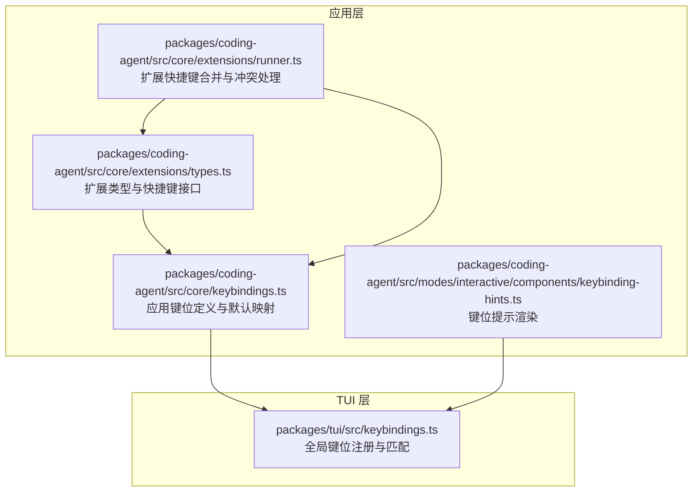
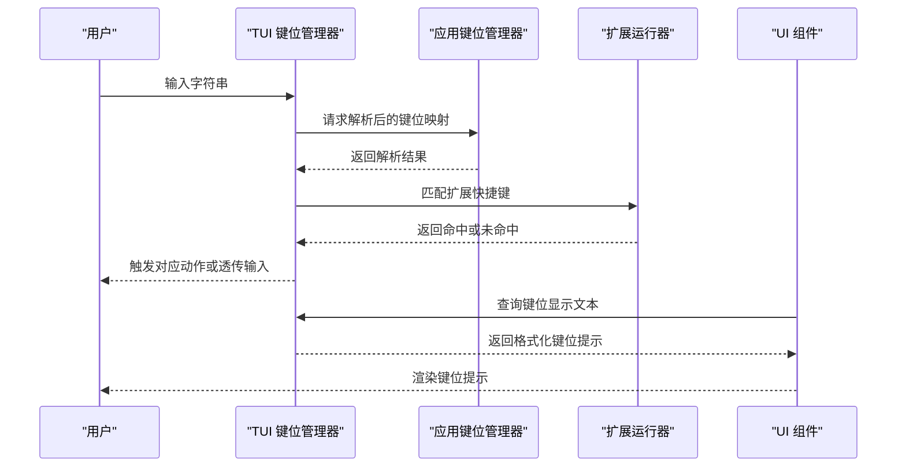
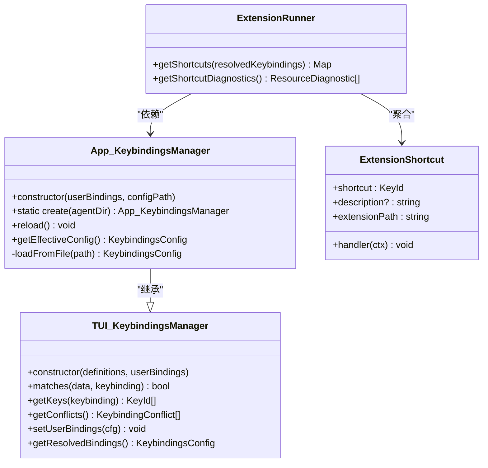

# 键盘绑定配置

<cite>
**本文引用的文件**
- [packages/coding-agent/src/core/keybindings.ts](file://packages/coding-agent/src/core/keybindings.ts)
- [packages/tui/src/keybindings.ts](file://packages/tui/src/keybindings.ts)
- [packages/coding-agent/src/core/extensions/types.ts](file://packages/coding-agent/src/core/extensions/types.ts)
- [packages/coding-agent/src/core/extensions/runner.ts](file://packages/coding-agent/src/core/extensions/runner.ts)
- [packages/coding-agent/src/modes/interactive/components/keybinding-hints.ts](file://packages/coding-agent/src/modes/interactive/components/keybinding-hints.ts)
- [packages/coding-agent/examples/extensions/border-status-editor.ts](file://packages/coding-agent/examples/extensions/border-status-editor.ts)
- [packages/coding-agent/docs/extensions.md](file://packages/coding-agent/docs/extensions.md)
- [packages/coding-agent/CHANGELOG.md](file://packages/coding-agent/CHANGELOG.md)
</cite>

## 目录
1. [简介](#简介)
2. [项目结构](#项目结构)
3. [核心组件](#核心组件)
4. [架构总览](#架构总览)
5. [组件详解](#组件详解)
6. [依赖关系分析](#依赖关系分析)
7. [性能考量](#性能考量)
8. [故障排查指南](#故障排查指南)
9. [结论](#结论)
10. [附录](#附录)

## 简介
本指南面向希望在 Pi 中为自定义编辑器与扩展功能添加键盘快捷键支持的开发者。内容覆盖：
- AppKeybinding 接口与 ExtensionShortcut 接口的使用方法
- KeybindingsManager 的工作原理、配置项与加载流程
- 如何为自定义编辑器注入并使用 KeybindingsManager
- 键盘事件的捕获与处理机制（匹配、冲突检测与优先级）
- 完整配置示例（常用快捷键与自定义快捷键）
- 键盘绑定与 UI 组件的集成方式
- 跨平台兼容策略与调试测试方法

## 项目结构
Pi 的键盘绑定体系由两层组成：
- TUI 层：提供通用键位定义与匹配逻辑（KeybindingsManager、KeybindingDefinitions、KeyId）
- 应用层：在 TUI 基础上扩展应用级键位（AppKeybindings），并提供默认键位映射与迁移逻辑

图表来源
- [packages/tui/src/keybindings.ts:155-245](file://packages/tui/src/keybindings.ts#L155-L245)
- [packages/coding-agent/src/core/keybindings.ts:63-202](file://packages/coding-agent/src/core/keybindings.ts#L63-L202)
- [packages/coding-agent/src/core/extensions/types.ts:1400-1405](file://packages/coding-agent/src/core/extensions/types.ts#L1400-L1405)
- [packages/coding-agent/src/core/extensions/runner.ts:417-460](file://packages/coding-agent/src/core/extensions/runner.ts#L417-L460)
- [packages/coding-agent/src/modes/interactive/components/keybinding-hints.ts:34-48](file://packages/coding-agent/src/modes/interactive/components/keybinding-hints.ts#L34-L48)

章节来源
- [packages/tui/src/keybindings.ts:155-245](file://packages/tui/src/keybindings.ts#L155-L245)
- [packages/coding-agent/src/core/keybindings.ts:63-202](file://packages/coding-agent/src/core/keybindings.ts#L63-L202)
- [packages/coding-agent/src/core/extensions/types.ts:1400-1405](file://packages/coding-agent/src/core/extensions/types.ts#L1400-L1405)
- [packages/coding-agent/src/core/extensions/runner.ts:417-460](file://packages/coding-agent/src/core/extensions/runner.ts#L417-L460)
- [packages/coding-agent/src/modes/interactive/components/keybinding-hints.ts:34-48](file://packages/coding-agent/src/modes/interactive/components/keybinding-hints.ts#L34-L48)

## 核心组件
- AppKeybinding 与 AppKeybindings
  - AppKeybindings 是应用级键位集合，通过声明合并扩展到全局键位表
  - AppKeybinding 是 AppKeybindings 的键名联合类型
- KeybindingsManager（TUI）
  - 负责键位定义、用户配置、冲突检测与解析
  - 提供 matches、getKeys、getDefinition、getConflicts、setUserBindings、getResolvedBindings 等能力
- KeybindingsManager（应用层）
  - 扩展自 TUI 的 KeybindingsManager，注入应用默认键位与迁移逻辑
  - 支持从用户目录加载 keybindings.json 并重建解析结果
- ExtensionShortcut
  - 扩展快捷键定义，包含键值、描述与处理器
- ExtensionRunner
  - 合并扩展快捷键，执行冲突诊断与优先级判定

章节来源
- [packages/coding-agent/src/core/keybindings.ts:13-57](file://packages/coding-agent/src/core/keybindings.ts#L13-L57)
- [packages/coding-agent/src/core/keybindings.ts:340-371](file://packages/coding-agent/src/core/keybindings.ts#L340-L371)
- [packages/tui/src/keybindings.ts:155-245](file://packages/tui/src/keybindings.ts#L155-L245)
- [packages/coding-agent/src/core/extensions/types.ts:1400-1405](file://packages/coding-agent/src/core/extensions/types.ts#L1400-L1405)
- [packages/coding-agent/src/core/extensions/runner.ts:417-460](file://packages/coding-agent/src/core/extensions/runner.ts#L417-L460)

## 架构总览
Pi 的键盘绑定从“定义—解析—匹配—渲染”四个阶段完成闭环：
- 定义：TUI 提供基础键位；应用层叠加 App 键位与默认映射
- 解析：KeybindingsManager 将用户配置与默认映射合并，生成解析后的键位集
- 匹配：运行时根据输入字符串与键位进行匹配判断
- 渲染：UI 组件将键位转换为可读文本显示

图表来源
- [packages/tui/src/keybindings.ts:194-200](file://packages/tui/src/keybindings.ts#L194-L200)
- [packages/coding-agent/src/core/keybindings.ts:340-371](file://packages/coding-agent/src/core/keybindings.ts#L340-L371)
- [packages/coding-agent/src/core/extensions/runner.ts:417-460](file://packages/coding-agent/src/core/extensions/runner.ts#L417-L460)
- [packages/coding-agent/src/modes/interactive/components/keybinding-hints.ts:34-48](file://packages/coding-agent/src/modes/interactive/components/keybinding-hints.ts#L34-L48)

## 组件详解

### AppKeybinding 与 AppKeybindings
- AppKeybindings 通过声明合并扩展全局键位表，确保应用级键位名称合法且唯一
- 默认键位映射集中于 KEYBINDINGS，包含跨平台差异（如粘贴键在 Windows 与其他平台不同）

章节来源
- [packages/coding-agent/src/core/keybindings.ts:13-57](file://packages/coding-agent/src/core/keybindings.ts#L13-L57)
- [packages/coding-agent/src/core/keybindings.ts:63-202](file://packages/coding-agent/src/core/keybindings.ts#L63-L202)

### KeybindingsManager（应用层）
- 构造函数接收“键位定义 + 用户配置”，内部调用父类重建解析
- 提供静态工厂 create，自动定位用户配置文件并加载
- 支持 reload 重新加载配置文件
- getEffectiveConfig 暴露最终生效的键位映射

章节来源
- [packages/coding-agent/src/core/keybindings.ts:340-371](file://packages/coding-agent/src/core/keybindings.ts#L340-L371)

### KeybindingsManager（TUI 层）
- 负责键位定义、用户配置、冲突检测与解析
- matches(data, keybinding) 判断输入是否匹配某键位
- getKeys 获取某键位的所有键值
- getConflicts 返回存在冲突的键位集合
- setUserBindings 与 getResolvedBindings 支持动态更新与导出

章节来源
- [packages/tui/src/keybindings.ts:155-245](file://packages/tui/src/keybindings.ts#L155-L245)

### ExtensionShortcut 与扩展快捷键注册
- ExtensionShortcut 定义了键值、描述与处理器
- 扩展可通过注册 Map<KeyId, ExtensionShortcut> 提供快捷键
- 运行器在构建内置键位映射后，对扩展快捷键进行冲突诊断与优先级判定

章节来源
- [packages/coding-agent/src/core/extensions/types.ts:1400-1405](file://packages/coding-agent/src/core/extensions/types.ts#L1400-L1405)
- [packages/coding-agent/src/core/extensions/runner.ts:417-460](file://packages/coding-agent/src/core/extensions/runner.ts#L417-L460)

### 键盘事件捕获与处理机制
- 输入字符串经由 TUI 的 matchesKey 与 KeybindingsManager.matches 判断
- 冲突处理策略：
  - 内置保留键位优先（RESERVED_KEYBINDINGS_FOR_EXTENSION_CONFLICTS）
  - 若扩展键与内置键冲突，内置键优先；若扩展键之间冲突，后注册者覆盖前者
- 运行器会记录诊断信息并在无 UI 时输出警告

章节来源
- [packages/coding-agent/src/core/extensions/runner.ts:62-103](file://packages/coding-agent/src/core/extensions/runner.ts#L62-L103)
- [packages/coding-agent/src/core/extensions/runner.ts:417-460](file://packages/coding-agent/src/core/extensions/runner.ts#L417-L460)

### UI 集成与键位提示
- UI 通过 getKeybindings().getKeys 获取键位列表
- keybinding-hints 提供键位文本格式化与跨平台修饰键名称转换（如 macOS 上的 option 显示）
- 可用于在状态栏、工具条或悬浮提示中展示当前键位

章节来源
- [packages/coding-agent/src/modes/interactive/components/keybinding-hints.ts:34-48](file://packages/coding-agent/src/modes/interactive/components/keybinding-hints.ts#L34-L48)
- [packages/coding-agent/src/modes/interactive/components/keybinding-hints.ts:12-27](file://packages/coding-agent/src/modes/interactive/components/keybinding-hints.ts#L12-L27)

### 自定义编辑器中的键位使用
- 自定义编辑器通过 ctx.ui.setEditorComponent 注入，接收 keybindings 参数
- 编辑器可直接使用 KeybindingsManager 进行键位匹配，或在不处理时调用父类输入处理以继承应用级键位
- 示例：边框状态编辑器在构造时接收 KeybindingsManager，并在渲染中结合主题与上下文信息

章节来源
- [packages/coding-agent/src/core/extensions/types.ts:220-253](file://packages/coding-agent/src/core/extensions/types.ts#L220-L253)
- [packages/coding-agent/examples/extensions/border-status-editor.ts:120-149](file://packages/coding-agent/examples/extensions/border-status-editor.ts#L120-L149)

## 依赖关系分析

图表来源
- [packages/tui/src/keybindings.ts:155-245](file://packages/tui/src/keybindings.ts#L155-L245)
- [packages/coding-agent/src/core/keybindings.ts:340-371](file://packages/coding-agent/src/core/keybindings.ts#L340-L371)
- [packages/coding-agent/src/core/extensions/types.ts:1400-1405](file://packages/coding-agent/src/core/extensions/types.ts#L1400-L1405)
- [packages/coding-agent/src/core/extensions/runner.ts:417-460](file://packages/coding-agent/src/core/extensions/runner.ts#L417-L460)

章节来源
- [packages/tui/src/keybindings.ts:155-245](file://packages/tui/src/keybindings.ts#L155-L245)
- [packages/coding-agent/src/core/keybindings.ts:340-371](file://packages/coding-agent/src/core/keybindings.ts#L340-L371)
- [packages/coding-agent/src/core/extensions/types.ts:1400-1405](file://packages/coding-agent/src/core/extensions/types.ts#L1400-L1405)
- [packages/coding-agent/src/core/extensions/runner.ts:417-460](file://packages/coding-agent/src/core/extensions/runner.ts#L417-L460)

## 性能考量
- 键位匹配采用预构建映射表，时间复杂度为 O(n)（n 为某键位绑定的键值数量）
- 冲突检测在用户配置变更时一次性重建，建议避免频繁重载配置
- UI 渲染键位提示仅在需要时查询，避免重复计算

## 故障排查指南
- 冲突告警
  - 当扩展快捷键与内置键位冲突时，运行器会记录诊断信息；可在无 UI 时查看控制台警告
  - 内置保留键位具有更高优先级，扩展无法覆盖
- 键位不生效
  - 检查 keybindings.json 是否正确加载（路径与权限）
  - 使用 getEffectiveConfig 或 getResolvedBindings 查看最终生效映射
- 跨平台差异
  - 特定键位（如粘贴）在 Windows 与其他平台不同，确认平台差异设置
- 自定义编辑器未响应
  - 确保在编辑器中对未处理的输入调用父类输入处理，以便继承应用级键位

章节来源
- [packages/coding-agent/src/core/extensions/runner.ts:417-460](file://packages/coding-agent/src/core/extensions/runner.ts#L417-L460)
- [packages/coding-agent/src/core/keybindings.ts:340-371](file://packages/coding-agent/src/core/keybindings.ts#L340-L371)
- [packages/coding-agent/src/modes/interactive/components/keybinding-hints.ts:12-27](file://packages/coding-agent/src/modes/interactive/components/keybinding-hints.ts#L12-L27)

## 结论
Pi 的键盘绑定系统通过“定义—解析—匹配—渲染”的清晰分层，既保证了应用级键位的一致性，又允许扩展灵活注册快捷键。借助 KeybindingsManager 与 ExtensionRunner，开发者可以便捷地为自定义编辑器与 UI 组件添加跨平台兼容的快捷键支持，并通过冲突诊断与提示机制提升可用性。

## 附录

### 配置文件与加载流程
- 配置文件：位于用户目录下的 keybindings.json
- 加载流程：KeybindingsManager.create 自动读取并迁移旧配置，随后重建解析映射

章节来源
- [packages/coding-agent/src/core/keybindings.ts:348-371](file://packages/coding-agent/src/core/keybindings.ts#L348-L371)
- [packages/coding-agent/src/core/keybindings.ts:290-328](file://packages/coding-agent/src/core/keybindings.ts#L290-L328)

### 常用快捷键与跨平台差异
- 粘贴键：Windows 使用 alt+v，其他平台使用 ctrl+v
- 暂停至后台：非 Windows 平台使用 ctrl+z
- 其他常见键位：参见应用层默认映射

章节来源
- [packages/coding-agent/src/core/keybindings.ts:63-202](file://packages/coding-agent/src/core/keybindings.ts#L63-L202)

### 自定义编辑器集成示例
- 在自定义编辑器构造函数中接收 KeybindingsManager
- 对未处理的输入调用父类输入处理，以继承应用级键位
- 通过 ctx.ui.setEditorComponent 注册编辑器

章节来源
- [packages/coding-agent/src/core/extensions/types.ts:220-253](file://packages/coding-agent/src/core/extensions/types.ts#L220-L253)
- [packages/coding-agent/examples/extensions/border-status-editor.ts:120-149](file://packages/coding-agent/examples/extensions/border-status-editor.ts#L120-L149)

### 键位提示与 UI 渲染
- 使用 keybinding-hints 工具函数将键位转换为可读文本
- 跨平台修饰键名称自动转换（如 macOS 的 option）

章节来源
- [packages/coding-agent/src/modes/interactive/components/keybinding-hints.ts:34-48](file://packages/coding-agent/src/modes/interactive/components/keybinding-hints.ts#L34-L48)
- [packages/coding-agent/src/modes/interactive/components/keybinding-hints.ts:12-27](file://packages/coding-agent/src/modes/interactive/components/keybinding-hints.ts#L12-L27)

### 扩展快捷键注册与冲突处理
- 扩展通过 Map<KeyId, ExtensionShortcut> 注册快捷键
- 运行器在合并前构建内置键位映射，随后进行冲突诊断与优先级判定

章节来源
- [packages/coding-agent/src/core/extensions/runner.ts:417-460](file://packages/coding-agent/src/core/extensions/runner.ts#L417-L460)

### 历史迁移与命名空间
- 旧版键位名称会自动迁移至新命名空间
- 注入的 KeybindingsManager 不应自行调用 getKeybindings()/setKeybindings()

章节来源
- [packages/coding-agent/CHANGELOG.md:1197-1197](file://packages/coding-agent/CHANGELOG.md#L1197-L1197)
- [packages/coding-agent/docs/extensions.md:2083-2083](file://packages/coding-agent/docs/extensions.md#L2083-L2083)