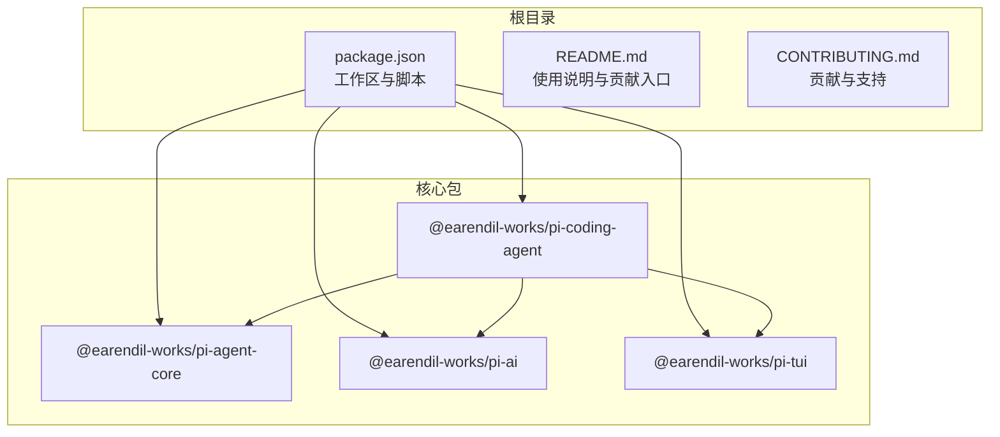
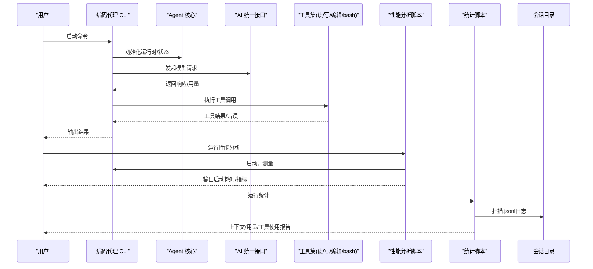
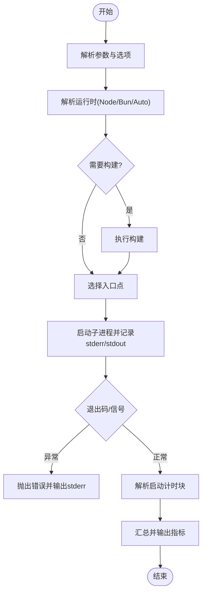
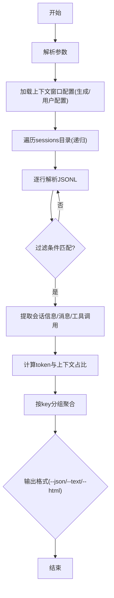
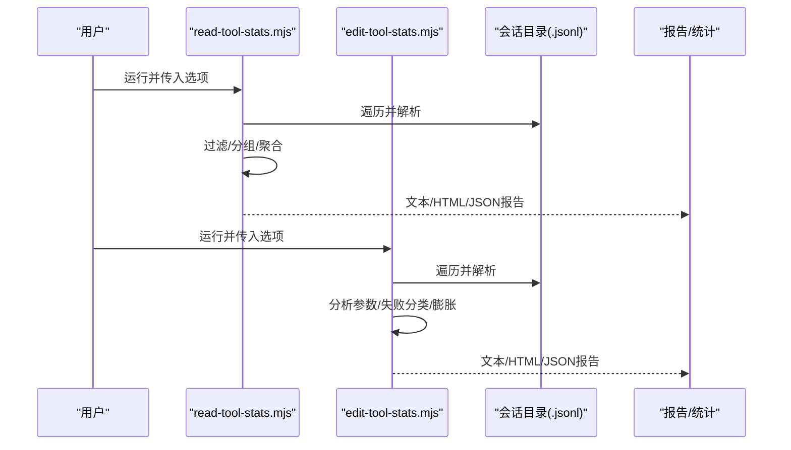
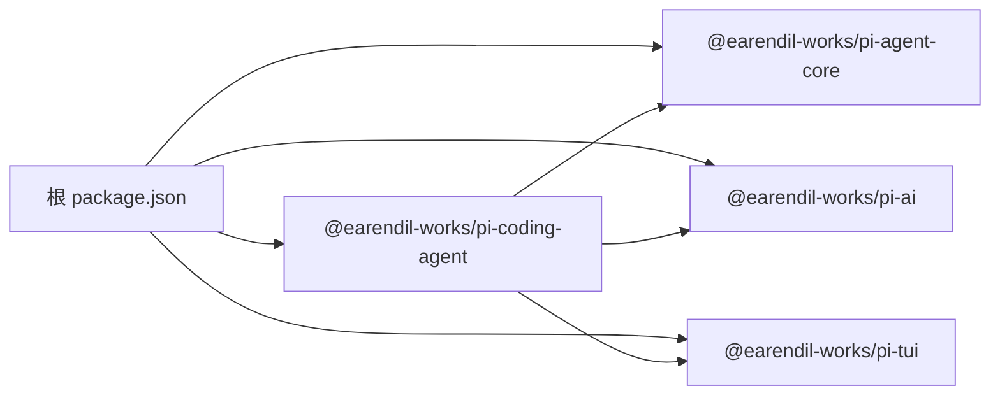

# 故障排除

<cite>
**本文引用的文件**
- [README.md](file://README.md)
- [CONTRIBUTING.md](file://CONTRIBUTING.md)
- [package.json](file://package.json)
- [scripts/profile-coding-agent-node.mjs](file://scripts/profile-coding-agent-node.mjs)
- [scripts/session-context-stats.mjs](file://scripts/session-context-stats.mjs)
- [scripts/read-tool-stats.mjs](file://scripts/read-tool-stats.mjs)
- [scripts/edit-tool-stats.mjs](file://scripts/edit-tool-stats.mjs)
- [scripts/stats.ts](file://scripts/stats.ts)
- [packages/coding-agent/package.json](file://packages/coding-agent/package.json)
- [packages/agent/package.json](file://packages/agent/package.json)
- [packages/ai/package.json](file://packages/ai/package.json)
- [packages/tui/package.json](file://packages/tui/package.json)
</cite>

## 目录
1. [简介](#简介)
2. [项目结构](#项目结构)
3. [核心组件](#核心组件)
4. [架构总览](#架构总览)
5. [详细组件分析](#详细组件分析)
6. [依赖关系分析](#依赖关系分析)
7. [性能考量](#性能考量)
8. [故障排除指南](#故障排除指南)
9. [结论](#结论)
10. [附录](#附录)

## 简介
本指南面向使用 Pi 项目的开发者与运维人员，聚焦于安装、配置、运行时异常与性能问题的排查与解决。文档基于仓库内的脚本与包配置，提供可操作的调试步骤、工具使用方法（性能分析、会话统计）、错误代码参考与优化建议，并给出社区支持渠道。

## 项目结构
Pi 是一个多包单体仓库，核心由以下包组成：
- 编码代理 CLI：交互式编码代理，提供读、bash、编辑、写入等工具与会话管理
- Agent 核心：通用 Agent 运行时，具备工具调用与状态管理
- AI 统一接口：统一多提供商大模型 API（OpenAI、Anthropic、Google 等）
- TUI 终端界面库：带差异渲染的终端 UI 库

开发与发布流程通过根目录脚本与 NPM 脚本进行统一管理；Node 版本要求在各包中统一约束。

图表来源
- [package.json:1-60](file://package.json#L1-L60)
- [packages/coding-agent/package.json:1-99](file://packages/coding-agent/package.json#L1-L99)
- [packages/agent/package.json:1-61](file://packages/agent/package.json#L1-L61)
- [packages/ai/package.json:1-107](file://packages/ai/package.json#L1-L107)
- [packages/tui/package.json:1-48](file://packages/tui/package.json#L1-L48)

章节来源
- [README.md:1-90](file://README.md#L1-L90)
- [package.json:1-60](file://package.json#L1-L60)

## 核心组件
- 性能分析脚本：启动时间与 CPU 配置剖析，支持 TUI/RPC 模式、Node/Bun 运行时、多次测量与暖机
- 会话上下文统计：扫描会话日志，计算最大上下文使用率、压缩前后使用率、按天/模型分组统计
- 工具使用统计：读取工具、编辑工具的使用频次、全量/部分读取比例、失败类型分布、字节膨胀等
- 成本与用量统计：按本地日期聚合 token 与成本，输出每日与总体统计

章节来源
- [scripts/profile-coding-agent-node.mjs:1-640](file://scripts/profile-coding-agent-node.mjs#L1-L640)
- [scripts/session-context-stats.mjs:1-406](file://scripts/session-context-stats.mjs#L1-L406)
- [scripts/read-tool-stats.mjs:1-506](file://scripts/read-tool-stats.mjs#L1-L506)
- [scripts/edit-tool-stats.mjs:1-835](file://scripts/edit-tool-stats.mjs#L1-L835)
- [scripts/stats.ts:1-234](file://scripts/stats.ts#L1-L234)

## 架构总览
下图展示从命令行到核心运行时与工具调用的整体路径，以及性能分析与统计工具如何接入。

图表来源
- [scripts/profile-coding-agent-node.mjs:331-358](file://scripts/profile-coding-agent-node.mjs#L331-L358)
- [scripts/session-context-stats.mjs:168-261](file://scripts/session-context-stats.mjs#L168-L261)
- [scripts/read-tool-stats.mjs:425-473](file://scripts/read-tool-stats.mjs#L425-L473)
- [scripts/edit-tool-stats.mjs:698-790](file://scripts/edit-tool-stats.mjs#L698-L790)
- [scripts/stats.ts:164-234](file://scripts/stats.ts#L164-L234)

## 详细组件分析

### 性能分析脚本（profile-coding-agent-node.mjs）
- 功能要点
  - 支持 TUI 与 RPC 两种模式的启动时间测量
  - 自动检测运行时（Node/Bun），可强制指定或跳过构建
  - 可选生成 CPU 配置文件，便于后续分析
  - 多次运行与暖机控制，输出最小/中位/平均/最大耗时与关键阶段时间
- 关键环境变量
  - PI_CODING_AGENT_DIR：指定代理数据目录
  - PI_STARTUP_BENCHMARK：开启 TUI 模式下的启动计时输出
  - PI_OFFLINE、PI_SKIP_VERSION_CHECK：离线模式与跳过版本检查
- 常见参数
  - --mode、--runs、--warmup、--profile-dir、--label、--runtime、--agent-dir、--isolated-agent-dir、--no-offline、--skip-build、--cpu-profile
- 使用建议
  - 在相同硬件与网络条件下重复测量，观察中位数变化
  - 使用 --cpu-profile 结合可视化工具定位热点函数
  - 使用 --isolated-agent-dir 清理缓存与配置干扰

图表来源
- [scripts/profile-coding-agent-node.mjs:73-168](file://scripts/profile-coding-agent-node.mjs#L73-L168)
- [scripts/profile-coding-agent-node.mjs:218-262](file://scripts/profile-coding-agent-node.mjs#L218-L262)
- [scripts/profile-coding-agent-node.mjs:532-633](file://scripts/profile-coding-agent-node.mjs#L532-L633)

章节来源
- [scripts/profile-coding-agent-node.mjs:1-640](file://scripts/profile-coding-agent-node.mjs#L1-L640)

### 会话上下文统计（session-context-stats.mjs）
- 功能要点
  - 扫描 ~/.pi/agent/sessions 下的 .jsonl 文件，提取会话元数据、消息条目与工具调用
  - 计算最大提示 token、压缩前 token、上下文窗口占比、是否超过阈值（80%/90%/100%）
  - 支持按天、按模型、按 cwd 过滤与聚合
- 关键输入
  - --sessions-dir、--since、--all-sessions、--model、--model-prefix、--bash-contains、--cwd、--all-cwds、--json、--text
- 输出
  - 文本/HTML/JSON 报告，包含总计、按日、按模型与模型+日分组的统计

图表来源
- [scripts/session-context-stats.mjs:15-53](file://scripts/session-context-stats.mjs#L15-L53)
- [scripts/session-context-stats.mjs:168-261](file://scripts/session-context-stats.mjs#L168-L261)
- [scripts/session-context-stats.mjs:302-329](file://scripts/session-context-stats.mjs#L302-L329)

章节来源
- [scripts/session-context-stats.mjs:1-406](file://scripts/session-context-stats.mjs#L1-L406)

### 工具使用统计（read-tool-stats.mjs 与 edit-tool-stats.mjs）
- 读取工具统计
  - 提取 read 工具调用，区分全量/部分读取，按 provider/model、时间桶（日/周）、小时维度统计
  - 支持自动 since 过滤（基于文件时间）与自定义过滤器
- 编辑工具统计
  - 分析编辑调用的参数风格、字节膨胀（inflation ratio）、失败类型分类
  - 统计同文件多调用集群行为、失败率与最差示例

图表来源
- [scripts/read-tool-stats.mjs:15-71](file://scripts/read-tool-stats.mjs#L15-L71)
- [scripts/read-tool-stats.mjs:425-473](file://scripts/read-tool-stats.mjs#L425-L473)
- [scripts/edit-tool-stats.mjs:13-80](file://scripts/edit-tool-stats.mjs#L13-L80)
- [scripts/edit-tool-stats.mjs:698-790](file://scripts/edit-tool-stats.mjs#L698-L790)

章节来源
- [scripts/read-tool-stats.mjs:1-506](file://scripts/read-tool-stats.mjs#L1-L506)
- [scripts/edit-tool-stats.mjs:1-835](file://scripts/edit-tool-stats.mjs#L1-L835)

### 成本与用量统计（stats.ts）
- 功能要点
  - 读取当前项目 cwd 对应的会话目录，按本地日聚合 assistant 消息的 token 与成本
  - 输出每日与总计统计，便于成本控制与用量审计
- 关键输入
  - --days/-n、--dir/--cwd/-d、--sessions-base

章节来源
- [scripts/stats.ts:1-234](file://scripts/stats.ts#L1-L234)

## 依赖关系分析
- Node 版本要求：各包 engines 字段统一要求 Node >= 22.19.0
- 包导出与二进制
  - 编码代理 CLI 暴露二进制名称“pi”，主入口位于 dist/index.js
  - AI 包导出多提供商模块与二进制“pi-ai”
  - TUI 与 Agent 核心分别提供导出与测试脚本
- 开发与发布
  - 根 package.json 定义工作区与统一脚本，包含构建、检查、发布、发布预检等

图表来源
- [package.json:1-60](file://package.json#L1-L60)
- [packages/coding-agent/package.json:1-99](file://packages/coding-agent/package.json#L1-L99)
- [packages/agent/package.json:1-61](file://packages/agent/package.json#L1-L61)
- [packages/ai/package.json:1-107](file://packages/ai/package.json#L1-L107)
- [packages/tui/package.json:1-48](file://packages/tui/package.json#L1-L48)

章节来源
- [package.json:1-60](file://package.json#L1-L60)
- [packages/coding-agent/package.json:1-99](file://packages/coding-agent/package.json#L1-L99)
- [packages/agent/package.json:1-61](file://packages/agent/package.json#L1-L61)
- [packages/ai/package.json:1-107](file://packages/ai/package.json#L1-L107)
- [packages/tui/package.json:1-48](file://packages/tui/package.json#L1-L48)

## 性能考量
- 启动性能
  - 使用性能分析脚本进行多轮测量与暖机，关注 TUI/RPC 模式差异
  - 在离线模式下评估网络依赖对启动的影响
- 上下文使用
  - 利用会话上下文统计识别高占比会话，避免接近或超过上下文窗口
  - 结合工具统计，减少不必要的全量读取与过度膨胀的编辑
- 成本控制
  - 使用成本统计脚本按日追踪 token 与成本，设定阈值预警
- 运行时选择
  - Node 与 Bun 的启动与运行特性不同，建议在相同条件下对比测试

[本节为通用指导，无需列出章节来源]

## 故障排除指南

### 一、安装与环境问题
- 症状
  - 安装后无法找到“pi”命令
  - Node 版本不满足要求
- 排查步骤
  - 确认 Node 版本满足各包引擎要求（>=22.19.0）
  - 确认已执行安装与构建流程（根目录安装依赖、构建所有包）
  - 确认 CLI 二进制已生成并可执行（编码代理包导出二进制“pi”）
- 解决方案
  - 升级 Node 至满足要求的版本
  - 在根目录执行安装与构建脚本，确保 dist 目录存在
  - 将项目加入 PATH 或使用 npx/npm exec 方式调用

章节来源
- [package.json:49-51](file://package.json#L49-L51)
- [packages/coding-agent/package.json:9-11](file://packages/coding-agent/package.json#L9-L11)
- [packages/coding-agent/package.json:32-39](file://packages/coding-agent/package.json#L32-L39)

### 二、配置错误
- 症状
  - 启动时报错提示缺少配置或认证信息
  - 代理目录未生效或权限不足
- 排查步骤
  - 检查代理数据目录（默认 ~/.pi/agent）是否存在与可写
  - 检查模型配置与凭据是否正确（AI 包支持多提供商）
  - 若使用自定义代理目录，确认通过环境变量或参数设置生效
- 解决方案
  - 创建或修复代理目录权限
  - 补充/修正模型配置与密钥
  - 使用 --agent-dir 或设置 PI_CODING_AGENT_DIR

章节来源
- [scripts/profile-coding-agent-node.mjs:360-375](file://scripts/profile-coding-agent-node.mjs#L360-L375)
- [scripts/session-context-stats.mjs:9-11](file://scripts/session-context-stats.mjs#L9-L11)

### 三、运行时异常
- 症状
  - 启动卡住或超时
  - 工具调用失败（读取/编辑）
- 排查步骤
  - 使用性能分析脚本开启启动计时与 CPU 配置文件
  - 使用工具统计脚本定位失败类型（如找不到文件、重复出现、重叠编辑等）
  - 检查会话目录中的 .jsonl 日志，确认工具调用与结果匹配
- 解决方案
  - 通过 CPU 配置文件定位热点，优化初始化流程
  - 针对失败类型调整工具参数或策略（例如避免重叠编辑）

章节来源
- [scripts/profile-coding-agent-node.mjs:218-242](file://scripts/profile-coding-agent-node.mjs#L218-L242)
- [scripts/edit-tool-stats.mjs:243-257](file://scripts/edit-tool-stats.mjs#L243-L257)
- [scripts/edit-tool-stats.mjs:763-777](file://scripts/edit-tool-stats.mjs#L763-L777)

### 四、性能问题
- 症状
  - 启动缓慢、上下文频繁压缩、成本上升
- 排查步骤
  - 使用性能分析脚本测量启动时间，比较 TUI/RPC 模式差异
  - 使用会话上下文统计识别高占比会话与模型
  - 使用成本统计脚本按日监控 token 与成本
- 解决方案
  - 减少不必要的全量读取，优先使用部分读取
  - 优化工具调用策略，降低上下文膨胀
  - 调整模型与上下文窗口配置

章节来源
- [scripts/profile-coding-agent-node.mjs:593-632](file://scripts/profile-coding-agent-node.mjs#L593-L632)
- [scripts/session-context-stats.mjs:302-329](file://scripts/session-context-stats.mjs#L302-L329)
- [scripts/stats.ts:155-234](file://scripts/stats.ts#L155-L234)

### 五、调试技巧与工具使用
- 性能分析
  - 使用 --cpu-profile 生成 CPU 配置文件，结合可视化工具分析热点
  - 使用 --warmup 与 --runs 控制测量稳定性
- 会话统计
  - 使用 --model、--model-prefix、--bash-contains 精确筛选
  - 使用 --since 限制扫描范围，提高效率
- 成本与用量
  - 使用 --days、--dir 控制统计周期与项目范围

章节来源
- [scripts/profile-coding-agent-node.mjs:28-48](file://scripts/profile-coding-agent-node.mjs#L28-L48)
- [scripts/session-context-stats.mjs:36-52](file://scripts/session-context-stats.mjs#L36-L52)
- [scripts/stats.ts:129-136](file://scripts/stats.ts#L129-L136)

### 六、错误代码参考与诊断步骤
- 错误类型与定位
  - 启动类：检查 stderr 中的启动计时块与退出码/信号
  - 工具调用类：根据工具统计脚本的失败类型分类（如“找不到文件”、“重复出现”、“重叠编辑”等）
  - 配置类：检查代理目录、模型配置与凭据
- 诊断步骤
  - 重现问题并启用 CPU 配置文件
  - 使用统计脚本输出报告，定位异常模式
  - 根据报告调整参数或策略

章节来源
- [scripts/profile-coding-agent-node.mjs:268-279](file://scripts/profile-coding-agent-node.mjs#L268-L279)
- [scripts/edit-tool-stats.mjs:243-257](file://scripts/edit-tool-stats.mjs#L243-L257)

### 七、社区支持与获取帮助
- 社区渠道
  - Discord 社区：用于提问与交流
  - 项目网站与文档：获取更多使用示例与说明
- 贡献与质量
  - 新贡献者提交的问题可能被自动关闭，维护者会在工作日审查并回复
  - 请遵循贡献指南，保持问题清晰、具体且可复现

章节来源
- [README.md:7-11](file://README.md#L7-L11)
- [CONTRIBUTING.md:13-26](file://CONTRIBUTING.md#L13-L26)
- [CONTRIBUTING.md:69-71](file://CONTRIBUTING.md#L69-L71)

## 结论
通过统一的性能分析与统计工具，结合规范的配置与社区支持流程，可以高效定位并解决 Pi 项目在安装、配置、运行与性能方面的问题。建议在日常使用中定期运行统计脚本，建立成本与上下文使用的基线，以便及时发现异常并采取优化措施。

[本节为总结性内容，无需列出章节来源]

## 附录

### A. 常用命令速查
- 安装与构建
  - 安装依赖与构建全部包
  - 运行检查与测试
- 性能分析
  - Node 启动分析（TUI/RPC）
  - Bun 启动分析（直接从源码）
- 会话统计
  - 上下文使用统计
  - 读取/编辑工具使用统计
- 成本统计
  - 按日 token 与成本统计

章节来源
- [README.md:63-71](file://README.md#L63-L71)
- [package.json:12-35](file://package.json#L12-L35)
- [scripts/profile-coding-agent-node.mjs:18-48](file://scripts/profile-coding-agent-node.mjs#L18-L48)
- [scripts/session-context-stats.mjs:36-52](file://scripts/session-context-stats.mjs#L36-L52)
- [scripts/read-tool-stats.mjs:55-71](file://scripts/read-tool-stats.mjs#L55-L71)
- [scripts/edit-tool-stats.mjs:64-80](file://scripts/edit-tool-stats.mjs#L64-L80)
- [scripts/stats.ts:129-136](file://scripts/stats.ts#L129-L136)