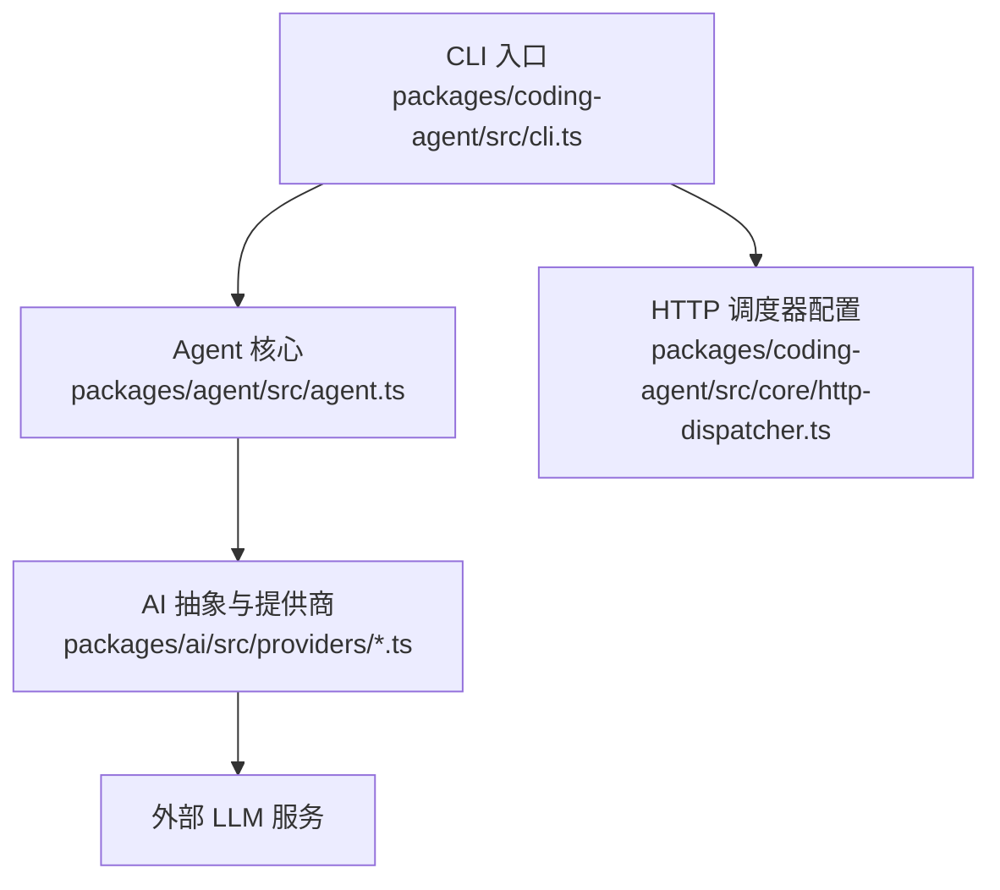
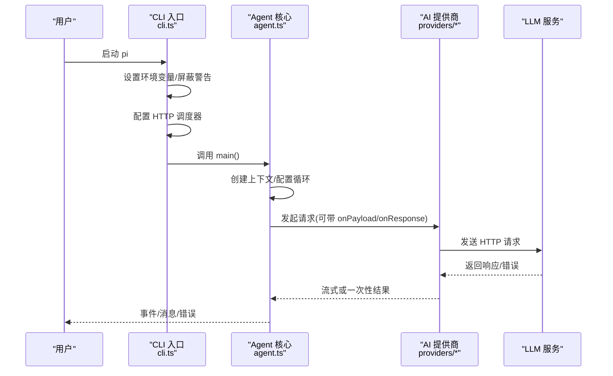
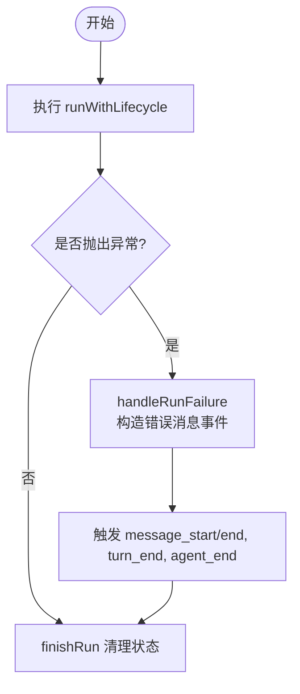
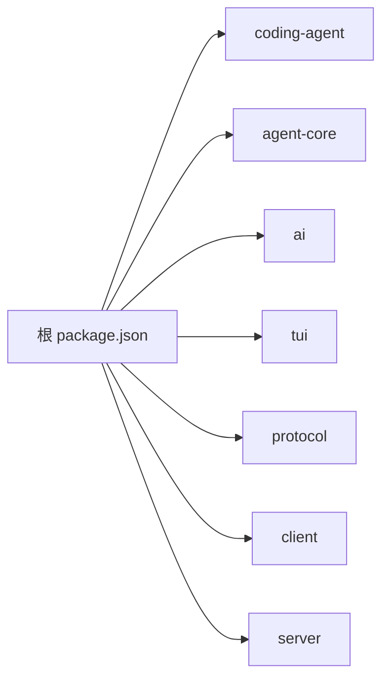

# 故障排除

<cite>
**本文引用的文件**
- [README.md](file://README.md)
- [package.json](file://package.json)
- [CONTRIBUTING.md](file://CONTRIBUTING.md)
- [cli.ts](file://packages/coding-agent/src/cli.ts)
- [agent.ts](file://packages/agent/src/agent.ts)
- [moonshotai-cn.ts](file://packages/ai/src/providers/moonshotai-cn.ts)
</cite>

## 目录
1. [简介](#简介)
2. [项目结构](#项目结构)
3. [核心组件](#核心组件)
4. [架构总览](#架构总览)
5. [详细组件分析](#详细组件分析)
6. [依赖关系分析](#依赖关系分析)
7. [性能考量](#性能考量)
8. [故障排除指南](#故障排除指南)
9. [结论](#结论)
10. [附录](#附录)

## 简介
本指南面向安装、配置、网络与 API 调用失败等常见问题，提供系统化的排查步骤、调试技巧与日志分析方法。同时涵盖如何启用调试模式、查看更详细的运行输出、定位性能瓶颈、解读错误信息、复现问题并提交高质量 Bug 报告，以及社区支持与已知问题的临时方案与升级建议。

## 项目结构
本项目为多包工作区（monorepo），包含 AI 抽象层、Agent 运行时、编码 Agent CLI、TUI、协议与遥测等。根脚本统一构建与检查，CLI 入口负责初始化 HTTP 调度器并启动主流程；Agent 核心封装了消息循环、工具调用与事件处理；AI 层提供多提供商的统一接口与鉴权。

```mermaid
graph TB
A["CLI 入口<br/>packages/coding-agent/src/cli.ts"] --> B["Agent 核心<br/>packages/agent/src/agent.ts"]
B --> C["AI 抽象与提供商<br/>packages/ai/src/providers/*.ts"]
A --> D["HTTP 调度器配置<br/>packages/coding-agent/src/core/http-dispatcher.ts"]
C --> E["外部 LLM 服务"]
```

图表来源
- [cli.ts:1-22](file://packages/coding-agent/src/cli.ts#L1-L22)
- [agent.ts:173-238](file://packages/agent/src/agent.ts#L173-L238)
- [moonshotai-cn.ts:6-14](file://packages/ai/src/providers/moonshotai-cn.ts#L6-L14)

章节来源
- [README.md:26-36](file://README.md#L26-L36)
- [package.json:14-49](file://package.json#L14-L49)

## 核心组件
- CLI 入口：设置进程标题与环境变量，屏蔽部分警告，并在加载全局/项目设置后配置底层 HTTP 调度器，再进入主流程。
- Agent 核心：维护会话状态、消息队列、工具执行策略、重试上限、传输方式、流式回调与生命周期事件；在运行失败时构造统一的错误消息事件并结束轮次。
- AI 提供商：通过 createProvider 注册提供商，集中管理 baseUrl、鉴权（环境变量读取）、模型清单与 API 适配。

章节来源
- [cli.ts:12-21](file://packages/coding-agent/src/cli.ts#L12-L21)
- [agent.ts:173-238](file://packages/agent/src/agent.ts#L173-L238)
- [moonshotai-cn.ts:6-14](file://packages/ai/src/providers/moonshotai-cn.ts#L6-L14)

## 架构总览
下图展示了从 CLI 到 Agent 再到 AI 提供商的调用链，以及关键的可观测点（onPayload/onResponse）和错误传播路径。

```mermaid
sequenceDiagram
participant U as "用户"
participant CLI as "CLI 入口<br/>cli.ts"
participant AG as "Agent 核心<br/>agent.ts"
participant AI as "AI 提供商<br/>providers/*"
participant S as "LLM 服务"
U->>CLI : 启动 pi
CLI->>CLI : 设置环境变量/屏蔽警告
CLI->>CLI : 配置 HTTP 调度器
CLI->>AG : 调用 main()
AG->>AG : 创建上下文/配置循环
AG->>AI : 发起请求(可带 onPayload/onResponse)
AI->>S : 发送 HTTP 请求
S-->>AI : 返回响应/错误
AI-->>AG : 流式或一次性结果
AG-->>U : 事件/消息/错误
```

图表来源
- [cli.ts:12-21](file://packages/coding-agent/src/cli.ts#L12-L21)
- [agent.ts:445-483](file://packages/agent/src/agent.ts#L445-L483)
- [moonshotai-cn.ts:6-14](file://packages/ai/src/providers/moonshotai-cn.ts#L6-L14)

## 详细组件分析

### CLI 入口与网络栈
- 作用：设置进程名、注入环境标志、屏蔽不必要的警告，并在 SettingsManager 加载完成后统一配置 undici 的全局调度器，确保后续所有 HTTP 请求走同一网络栈。
- 常见故障点：代理/证书/超时未正确配置会导致所有下游请求失败。
- 建议：优先确认代理、TLS 与超时参数是否正确；必要时在本地抓包验证出站流量。

章节来源
- [cli.ts:12-21](file://packages/coding-agent/src/cli.ts#L12-L21)

### Agent 核心与错误处理
- 作用：封装 Agent 生命周期、消息与工具执行、重试上限、传输选择、流式回调与事件分发。
- 错误传播：当运行异常时，会构造一条包含 provider/api/model/usage/errorMessage 的消息事件，依次触发 message_start/message_end/turn_end/agent_end，便于上层统一捕获与展示。
- 可观测性：支持 onPayload/onResponse 回调，可用于记录请求载荷与响应头，辅助定位网络与鉴权问题。

```mermaid
flowchart TD
Start(["开始"]) --> Run["执行 runWithLifecycle"]
Run --> Try{"是否抛出异常?"}
Try --> |否| Finish["finishRun 清理状态"]
Try --> |是| Handle["handleRunFailure<br/>构造错误消息事件"]
Handle --> Events["触发 message_start/end, turn_end, agent_end"]
Events --> Finish
```

图表来源
- [agent.ts:486-535](file://packages/agent/src/agent.ts#L486-L535)
- [agent.ts:511-527](file://packages/agent/src/agent.ts#L511-L527)

章节来源
- [agent.ts:173-238](file://packages/agent/src/agent.ts#L173-L238)
- [agent.ts:486-535](file://packages/agent/src/agent.ts#L486-L535)

### AI 提供商与鉴权
- 作用：通过 createProvider 声明 id、name、baseUrl、auth、models 与 api 适配器。鉴权通常从环境变量读取密钥。
- 常见故障点：缺少或错误的 API Key、baseUrl 不可达、模型清单不匹配。
- 建议：核对环境变量名称与值；使用最小化请求验证连通性与鉴权。

章节来源
- [moonshotai-cn.ts:6-14](file://packages/ai/src/providers/moonshotai-cn.ts#L6-L14)

## 依赖关系分析
- 工作区依赖：根 package.json 定义了 workspaces 与统一脚本，保证各子包按顺序构建与检查。
- 版本与引擎：要求 Node 版本不低于指定版本，避免兼容性问题。
- 安全加固：依赖锁定与审计策略有助于减少供应链风险。

```mermaid
graph LR
Root["根 package.json"] --> CA["coding-agent"]
Root --> AG["agent-core"]
Root --> AI["ai"]
Root --> TUI["tui"]
Root --> PROTO["protocol"]
Root --> CL["client"]
Root --> SRV["server"]
```

图表来源
- [package.json:5-13](file://package.json#L5-L13)
- [package.json:63-73](file://package.json#L63-L73)

章节来源
- [package.json:14-49](file://package.json#L14-L49)
- [package.json:63-73](file://package.json#L63-L73)

## 性能考量
- 流式与回调：通过 onPayload/onResponse 可统计首字节时间、吞吐与错误率，用于定位慢请求与抖动。
- 重试与延迟：Agent 暴露 maxRetryDelayMs 以限制上游建议的重试间隔，避免雪崩。
- 并行工具执行：toolExecution 控制工具调用策略，合理设置可减少阻塞。
- 传输选择：transport 可影响连接复用与协议行为，结合网络环境调优。

[本节为通用指导，无需特定文件引用]

## 故障排除指南

### 一、安装与环境问题
- 症状
  - 构建失败、类型检查报错、脚本无法执行。
- 可能原因
  - Node 版本过低或不满足要求。
  - 依赖未安装或缓存损坏。
  - 工作区脚本未正确执行。
- 解决步骤
  - 确认 Node 版本满足要求。
  - 使用工作区脚本进行清理、安装与构建。
  - 若离线构建，使用离线构建脚本以避免网络访问。
  - 使用检查脚本校验依赖锁定与导入规范。
- 参考
  - 构建与测试脚本、工作区定义、Node 引擎要求。

章节来源
- [README.md:52-61](file://README.md#L52-L61)
- [package.json:14-49](file://package.json#L14-L49)
- [package.json:63-65](file://package.json#L63-L65)

### 二、配置错误（API Key、baseUrl、模型）
- 症状
  - 鉴权失败、找不到模型、请求被拒绝。
- 可能原因
  - 环境变量缺失或拼写错误。
  - baseUrl 不正确或被代理拦截。
  - 模型清单与实际可用模型不一致。
- 解决步骤
  - 检查对应提供商的环境变量名称与值。
  - 用最小请求验证 baseUrl 可达与鉴权有效。
  - 重新生成或刷新模型数据后再构建。
- 参考
  - 提供商配置中鉴权与 baseUrl 的定义位置。

章节来源
- [moonshotai-cn.ts:6-14](file://packages/ai/src/providers/moonshotai-cn.ts#L6-L14)

### 三、网络连接与代理
- 症状
  - 所有请求超时或连接失败。
- 可能原因
  - 代理/证书/超时未配置。
  - 企业防火墙拦截。
- 解决步骤
  - 在 CLI 入口处完成 HTTP 调度器的全局配置。
  - 通过抓包或 curl 验证出站流量与代理设置。
  - 调整超时与重试策略，观察是否改善。
- 参考
  - CLI 入口对 HTTP 调度器的配置时机。

章节来源
- [cli.ts:17-21](file://packages/coding-agent/src/cli.ts#L17-L21)

### 四、API 调用失败（鉴权、限流、模型不可用）
- 症状
  - 返回 4xx/5xx、速率限制、模型不存在。
- 可能原因
  - 密钥无效或权限不足。
  - 超出配额或地区限制。
  - 模型清单过期或未发布。
- 解决步骤
  - 使用 onPayload/onResponse 记录请求与响应头，定位具体错误码与消息。
  - 降低并发或增加重试间隔，配合 maxRetryDelayMs 限制最大延迟。
  - 更新模型数据并重新构建。
- 参考
  - Agent 的 onPayload/onResponse 透传能力与重试上限。

章节来源
- [agent.ts:445-483](file://packages/agent/src/agent.ts#L445-L483)

### 五、调试模式与日志分析
- 启用更详细输出
  - 在 Agent 层通过 onPayload/onResponse 打印请求载荷与响应头，便于快速定位网络与鉴权问题。
  - 在 CLI 入口确认已设置必要的环境变量标志，以便下游模块识别运行上下文。
- 日志分析方法
  - 关注 message_start/message_update/message_end/turn_end/agent_end 事件序列，定位中断点。
  - 遇到错误时，查看最终消息中的 errorMessage、provider、api、model 字段，缩小范围。
- 参考
  - 事件处理与错误消息构造逻辑。

章节来源
- [agent.ts:511-527](file://packages/agent/src/agent.ts#L511-L527)
- [agent.ts:544-591](file://packages/agent/src/agent.ts#L544-L591)

### 六、性能问题诊断与优化
- 指标采集
  - 使用 onPayload/onResponse 统计首字节时间、耗时分布与错误率。
- 优化方向
  - 调整 toolExecution 策略，避免串行瓶颈。
  - 合理设置 maxRetryDelayMs，抑制上游过度重试。
  - 选择合适的 transport，利用连接复用。
- 参考
  - Agent 配置项与执行策略。

章节来源
- [agent.ts:445-483](file://packages/agent/src/agent.ts#L445-L483)

### 七、错误信息解读与解决步骤
- 典型字段
  - errorMessage：人类可读的错误描述。
  - provider/api/model：标识请求目标，便于定位提供商与模型。
  - usage：token 用量与成本，辅助容量规划。
- 处理流程
  - 根据 provider/api 判断是否为第三方限制。
  - 依据 errorMessage 关键词（如鉴权、限流、模型不存在）采取对应措施。
  - 结合 onPayload/onResponse 的原始报文交叉验证。

章节来源
- [agent.ts:511-527](file://packages/agent/src/agent.ts#L511-L527)

### 八、社区支持与问题报告
- 渠道
  - 通过贡献指南中的社区链接获取帮助。
- 提交高质量 Issue 的要求
  - 使用模板、保持简洁具体、说明影响与复现步骤。
  - 周末提交的优先级较低，紧急问题请通过社区渠道沟通。
- 参考
  - 贡献指南中的质量门槛与回复策略。

章节来源
- [CONTRIBUTING.md:21-35](file://CONTRIBUTING.md#L21-L35)
- [CONTRIBUTING.md:36-48](file://CONTRIBUTING.md#L36-L48)
- [CONTRIBUTING.md:73-89](file://CONTRIBUTING.md#L73-L89)

### 九、复现问题与提交 Bug 报告
- 复现要点
  - 最小化输入与配置，固定 Node 版本与工作区依赖。
  - 使用工作区脚本进行构建与测试，确保环境一致。
- 报告内容
  - 明确现象、期望行为、实际行为、复现步骤、相关日志片段（含 provider/api/model/errorMessage）。
- 参考
  - 工作区构建与测试命令。

章节来源
- [README.md:52-61](file://README.md#L52-L61)
- [package.json:14-49](file://package.json#L14-L49)

### 十、已知问题的临时方案与升级建议
- 临时方案
  - 使用离线构建脚本避免网络访问导致的构建失败。
  - 通过 onPayload/onResponse 快速定位网络与鉴权问题。
- 升级建议
  - 遵循工作区脚本进行增量升级，先构建再检查，最后测试。
  - 关注依赖锁定与审计结果，及时修复潜在风险。

章节来源
- [README.md:63-74](file://README.md#L63-L74)
- [package.json:14-49](file://package.json#L14-L49)

## 结论
通过统一的网络栈配置、完善的 Agent 事件与错误模型、以及灵活的 onPayload/onResponse 可观测能力，本仓库提供了从安装、配置到网络与 API 调用的系统化排障路径。结合贡献指南中的社区支持与问题报告规范，可高效定位与解决问题，并持续优化性能与稳定性。

## 附录

### A. 常用命令速查
- 安装与构建：使用工作区脚本进行安装、构建与检查。
- 测试：运行测试套件，跳过依赖 LLM 的测试（无密钥时）。
- 离线构建：使用离线构建脚本避免网络访问。

章节来源
- [README.md:52-74](file://README.md#L52-L74)

### B. 关键可观测点清单
- onPayload：记录请求载荷，便于核查入参与模型选择。
- onResponse：记录响应头与状态码，便于定位限流与鉴权问题。
- 事件序列：message_start/update/end、turn_end、agent_end，用于绘制完整调用时序。

章节来源
- [agent.ts:445-483](file://packages/agent/src/agent.ts#L445-L483)
- [agent.ts:544-591](file://packages/agent/src/agent.ts#L544-L591)