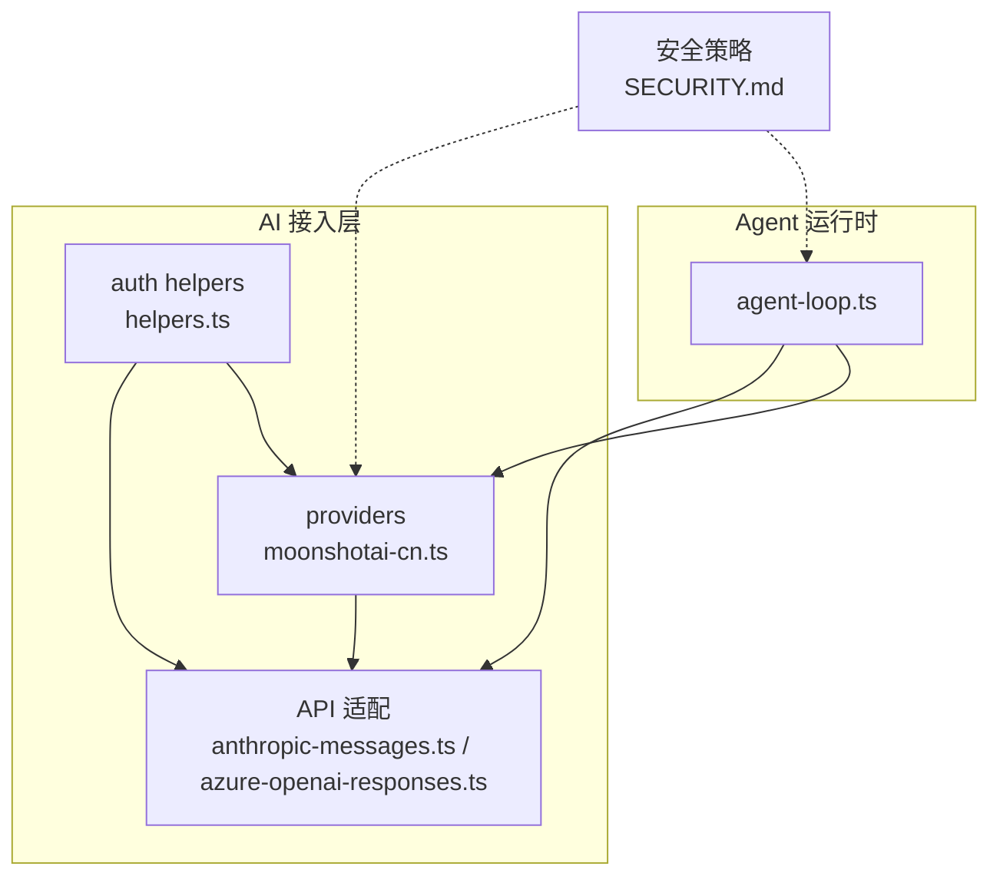
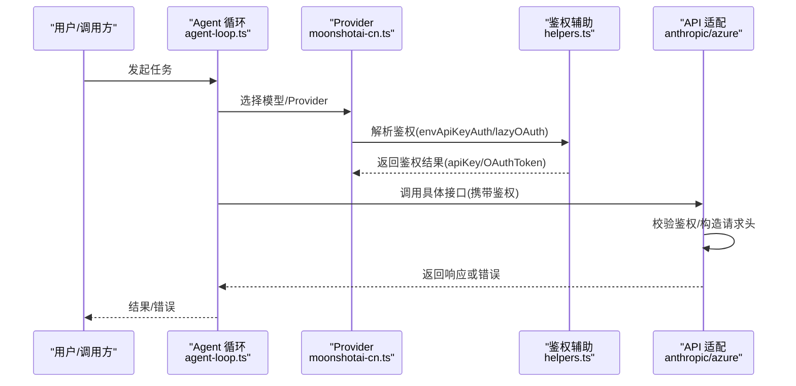
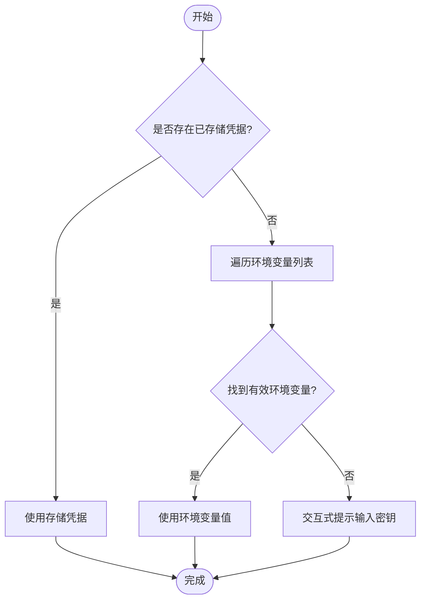
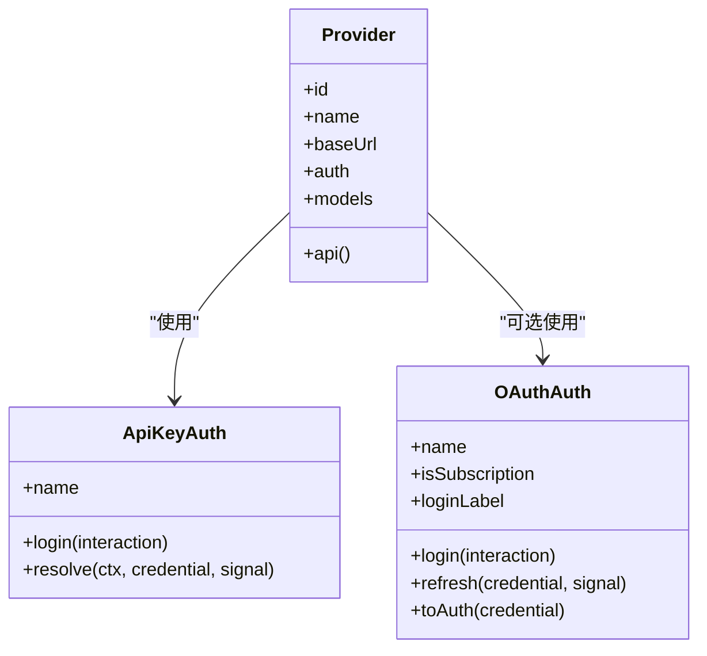
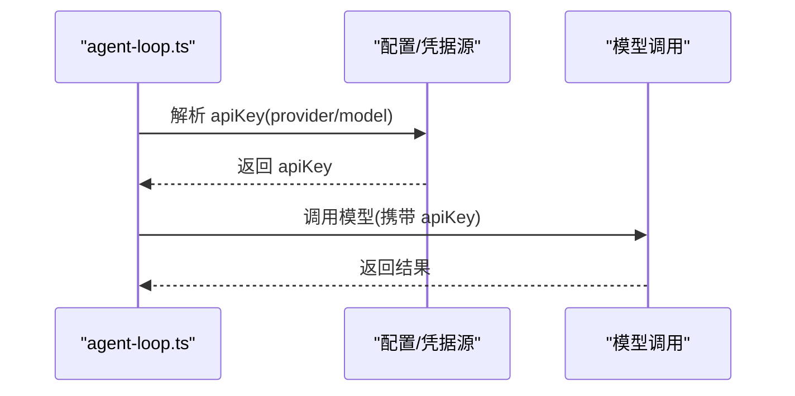
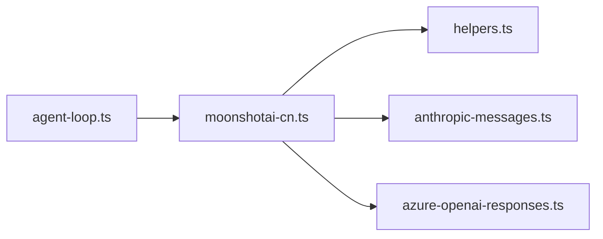

# 安全架构

<cite>
**本文引用的文件**
- [SECURITY.md](file://SECURITY.md)
- [helpers.ts](file://packages/ai/src/auth/helpers.ts)
- [anthropic-messages.ts](file://packages/ai/src/api/anthropic-messages.ts)
- [azure-openai-responses.ts](file://packages/ai/src/api/azure-openai-responses.ts)
- [moonshotai-cn.ts](file://packages/ai/src/providers/moonshotai-cn.ts)
- [agent-loop.ts](file://packages/agent/src/agent-loop.ts)
</cite>

## 目录
1. [简介](#简介)
2. [项目结构](#项目结构)
3. [核心组件](#核心组件)
4. [架构总览](#架构总览)
5. [详细组件分析](#详细组件分析)
6. [依赖关系分析](#依赖关系分析)
7. [性能与安全权衡](#性能与安全权衡)
8. [故障排查指南](#故障排查指南)
9. [结论](#结论)
10. [附录：配置与最佳实践](#附录配置与最佳实践)

## 简介
本文件面向“Pi”项目的安全架构，聚焦以下方面：
- 沙箱环境设计：进程隔离、资源限制、权限控制（本项目明确不在代码内提供沙箱，需由部署方在容器/虚拟机中实现）
- 认证与授权机制：API Key 管理、OAuth 支持、细粒度权限控制（以 Provider 抽象和鉴权辅助函数为核心）
- 数据安全：敏感信息加密、传输安全、存储安全（基于环境变量与 Provider 的鉴权封装）
- 输入验证与输出过滤：SQL 注入防护、XSS 防护、命令注入防护（结合外部调用边界与本地执行策略）
- 威胁模型、风险评估与防护措施
- 安全配置指南与最佳实践

## 项目结构
从安全视角看，仓库采用多包结构，关键安全相关能力集中在 AI 接入层与 Agent 编排层：
- packages/ai：统一对外部模型服务的鉴权与请求封装（API Key/OAuth、请求头构造、错误处理）
- packages/agent：Agent 运行时对密钥解析与传递（将 API Key 注入到模型调用上下文）
- SECURITY.md：官方安全策略与漏洞上报范围说明，明确“本地执行无内置沙箱”的安全边界

图表来源
- [moonshotai-cn.ts:1-15](file://packages/ai/src/providers/moonshotai-cn.ts#L1-L15)
- [helpers.ts:1-60](file://packages/ai/src/auth/helpers.ts#L1-L60)
- [anthropic-messages.ts:280-930](file://packages/ai/src/api/anthropic-messages.ts#L280-L930)
- [azure-openai-responses.ts:90-175](file://packages/ai/src/api/azure-openai-responses.ts#L90-L175)
- [agent-loop.ts:300-315](file://packages/agent/src/agent-loop.ts#L300-L315)
- [SECURITY.md:1-88](file://SECURITY.md#L1-L88)

章节来源
- [SECURITY.md:1-88](file://SECURITY.md#L1-L88)

## 核心组件
- 鉴权辅助与 OAuth 懒加载
  - envApiKeyAuth：统一的 API Key 解析流程，优先使用已存储凭据，其次按环境变量顺序解析；提供交互式登录入口
  - lazyOAuth：按需动态导入 OAuth 实现，避免将 Node-only 流程引入浏览器打包产物
- 模型 Provider 定义
  - moonshotai-cn：通过 createProvider 声明 baseUrl、鉴权方式、模型列表与 API 适配器
- 外部 API 适配
  - anthropic-messages：对 Anthropic 消息接口的鉴权校验、OAuth Token 识别与请求头组装
  - azure-openai-responses：对 Azure OpenAI Responses 的鉴权校验与客户端创建
- Agent 密钥注入
  - agent-loop：解析并注入 apiKey 到模型调用上下文，确保下游 API 可获取凭据

章节来源
- [helpers.ts:1-60](file://packages/ai/src/auth/helpers.ts#L1-L60)
- [moonshotai-cn.ts:1-15](file://packages/ai/src/providers/moonshotai-cn.ts#L1-L15)
- [anthropic-messages.ts:280-930](file://packages/ai/src/api/anthropic-messages.ts#L280-L930)
- [azure-openai-responses.ts:90-175](file://packages/ai/src/api/azure-openai-responses.ts#L90-L175)
- [agent-loop.ts:300-315](file://packages/agent/src/agent-loop.ts#L300-L315)

## 架构总览
下图展示一次带鉴权的模型调用序列，涵盖 API Key/OAuth 解析、请求头注入与错误断言。

图表来源
- [agent-loop.ts:300-315](file://packages/agent/src/agent-loop.ts#L300-L315)
- [moonshotai-cn.ts:1-15](file://packages/ai/src/providers/moonshotai-cn.ts#L1-L15)
- [helpers.ts:1-60](file://packages/ai/src/auth/helpers.ts#L1-L60)
- [anthropic-messages.ts:280-930](file://packages/ai/src/api/anthropic-messages.ts#L280-L930)
- [azure-openai-responses.ts:90-175](file://packages/ai/src/api/azure-openai-responses.ts#L90-L175)

## 详细组件分析

### 鉴权与令牌管理（API Key 与 OAuth）
- envApiKeyAuth
  - 行为：优先读取已存储凭据；否则按环境变量顺序解析；支持交互式提示输入密钥
  - 安全性：密钥仅以明文形式存在于内存与环境变量中，不落地日志；建议配合最小权限环境与密钥轮换
- lazyOAuth
  - 行为：首次 login/refresh/toAuth 时动态加载 OAuth 实现，避免非目标平台打包污染
  - 安全性：将复杂鉴权流程延迟至需要时，减少攻击面暴露
- Provider 集成
  - moonshotai-cn：通过 createProvider 绑定鉴权方式与模型集合，便于统一治理
- API 适配中的鉴权校验
  - anthropic-messages：对缺失鉴权进行断言；识别 OAuth Token 并正确设置请求头
  - azure-openai-responses：强制要求 apiKey，缺失则拒绝请求

图表来源
- [helpers.ts:1-60](file://packages/ai/src/auth/helpers.ts#L1-L60)

章节来源
- [helpers.ts:1-60](file://packages/ai/src/auth/helpers.ts#L1-L60)
- [anthropic-messages.ts:280-930](file://packages/ai/src/api/anthropic-messages.ts#L280-L930)
- [azure-openai-responses.ts:90-175](file://packages/ai/src/api/azure-openai-responses.ts#L90-L175)
- [moonshotai-cn.ts:1-15](file://packages/ai/src/providers/moonshotai-cn.ts#L1-L15)

### 外部 API 调用与传输安全
- 传输安全
  - 所有对外调用均通过 HTTPS 访问各云厂商 API（baseUrl 为 https），避免中间人窃听
- 请求头与鉴权注入
  - 在 API 适配层集中构造请求头，确保仅在必要时注入敏感头字段
- 错误与异常
  - 对缺失鉴权进行断言，尽早失败，避免泄露无效请求

图表来源
- [moonshotai-cn.ts:1-15](file://packages/ai/src/providers/moonshotai-cn.ts#L1-L15)
- [helpers.ts:1-60](file://packages/ai/src/auth/helpers.ts#L1-L60)

章节来源
- [anthropic-messages.ts:280-930](file://packages/ai/src/api/anthropic-messages.ts#L280-L930)
- [azure-openai-responses.ts:90-175](file://packages/ai/src/api/azure-openai-responses.ts#L90-L175)

### Agent 运行时的密钥注入
- agent-loop 负责解析并注入 apiKey 到模型调用上下文，确保下游 API 能获取到凭据
- 该过程应遵循最小可见性原则，避免在日志或调试输出中打印密钥

图表来源
- [agent-loop.ts:300-315](file://packages/agent/src/agent-loop.ts#L300-L315)

章节来源
- [agent-loop.ts:300-315](file://packages/agent/src/agent-loop.ts#L300-L315)

### 沙箱与进程隔离
- 官方安全策略明确：Pi 作为编码代理在本地用户安全边界内运行，不内置沙箱
- 建议部署模式：在容器或虚拟机中运行 Pi，利用操作系统级隔离与资源限制（CPU/内存/网络/文件系统）实现沙箱化
- 信任边界：本地用户账户及该账户可写的文件被视为与 Pi 进程同信任域；任何可被用户修改的配置/脚本都可能影响 Pi 行为

章节来源
- [SECURITY.md:1-88](file://SECURITY.md#L1-L88)

### 输入验证与输出过滤
- 输入侧
  - 对来自外部的提示词、配置文件、扩展与技能保持警惕；项目策略指出无法完全防御提示注入等风险
  - 建议在容器/沙箱中限制文件系统与网络访问，降低恶意输入的影响面
- 输出侧
  - 对模型输出进行必要的内容过滤与白名单校验后再写入文件或执行命令
  - 避免直接拼接用户输入到系统命令或 SQL 语句中

[本节为通用安全建议，不直接分析具体文件]

### 威胁模型与风险评估
- 主要威胁
  - 凭据泄露：环境变量或存储凭据被未授权读取
  - 提示注入：通过受信任文档/指令注入恶意提示
  - 未受控执行：在不受信任仓库中运行导致任意代码执行
  - 中间人攻击：非 HTTPS 通信或不可信代理
- 风险等级
  - 高：凭据泄露、未受控执行
  - 中：提示注入、弱配置
  - 低：偶发网络抖动
- 缓解措施
  - 使用最小权限的环境变量与凭据存储
  - 在容器/VM 中运行，限制文件系统与网络出口
  - 启用 HTTPS 与证书校验，禁用不安全代理
  - 对输入进行严格校验与过滤，对输出进行内容审查

[本节为通用安全建议，不直接分析具体文件]

## 依赖关系分析
- 耦合关系
  - agent-loop 依赖 provider 与鉴权辅助，用于注入 apiKey
  - providers 依赖鉴权辅助与 API 适配
  - API 适配依赖鉴权辅助与第三方 SDK
- 潜在循环依赖
  - 当前分层清晰，未见明显循环依赖
- 外部依赖
  - 第三方模型服务（Anthropic、Azure OpenAI 等）

图表来源
- [agent-loop.ts:300-315](file://packages/agent/src/agent-loop.ts#L300-L315)
- [moonshotai-cn.ts:1-15](file://packages/ai/src/providers/moonshotai-cn.ts#L1-L15)
- [helpers.ts:1-60](file://packages/ai/src/auth/helpers.ts#L1-L60)
- [anthropic-messages.ts:280-930](file://packages/ai/src/api/anthropic-messages.ts#L280-L930)
- [azure-openai-responses.ts:90-175](file://packages/ai/src/api/azure-openai-responses.ts#L90-L175)

章节来源
- [agent-loop.ts:300-315](file://packages/agent/src/agent-loop.ts#L300-L315)
- [moonshotai-cn.ts:1-15](file://packages/ai/src/providers/moonshotai-cn.ts#L1-L15)
- [helpers.ts:1-60](file://packages/ai/src/auth/helpers.ts#L1-L60)
- [anthropic-messages.ts:280-930](file://packages/ai/src/api/anthropic-messages.ts#L280-L930)
- [azure-openai-responses.ts:90-175](file://packages/ai/src/api/azure-openai-responses.ts#L90-L175)

## 性能与安全权衡
- 延迟加载 OAuth：减少启动时间与包体积，但首次登录会有额外开销
- 环境变量优先级：快速路径解析提升性能，但需确保环境变量安全且不被意外覆盖
- 严格鉴权断言：早期失败减少无效请求，提高整体稳定性

[本节为通用性能与安全讨论，不直接分析具体文件]

## 故障排查指南
- 鉴权失败
  - 检查是否设置了正确的环境变量或存储凭据
  - 确认 Provider 的鉴权方式与目标服务一致（API Key 或 OAuth）
- 请求头缺失
  - 查看 API 适配层是否正确注入鉴权头
  - 确认未因代理或网络策略拦截
- 日志与调试
  - 避免在日志中输出密钥
  - 使用结构化日志记录错误码与上下文，便于定位问题

章节来源
- [anthropic-messages.ts:280-930](file://packages/ai/src/api/anthropic-messages.ts#L280-L930)
- [azure-openai-responses.ts:90-175](file://packages/ai/src/api/azure-openai-responses.ts#L90-L175)
- [helpers.ts:1-60](file://packages/ai/src/auth/helpers.ts#L1-L60)

## 结论
- 本项目在代码层面提供了健壮的鉴权与传输安全机制，但未内置沙箱；需在部署层实现进程隔离与资源限制
- 通过 Provider 抽象与鉴权辅助函数，实现了灵活的 API Key 与 OAuth 支持
- 建议在生产环境中采用容器/VM 部署、最小权限原则、严格的输入输出校验与审计日志

[本节为总结性内容，不直接分析具体文件]

## 附录：配置与最佳实践
- 环境变量与凭据
  - 使用最小权限的环境变量命名与存储位置
  - 定期轮换密钥，避免硬编码
- 传输安全
  - 强制 HTTPS，禁用不安全协议
  - 使用可信 CA 与证书校验
- 输入与输出
  - 对所有外部输入进行白名单校验
  - 对模型输出进行内容过滤后再执行或持久化
- 部署与隔离
  - 在容器/VM 中运行，限制 CPU/内存/网络/文件系统
  - 使用只读根文件系统与最小镜像
- 监控与审计
  - 记录鉴权失败与异常请求
  - 对敏感操作进行审计与告警

[本节为通用最佳实践，不直接分析具体文件]