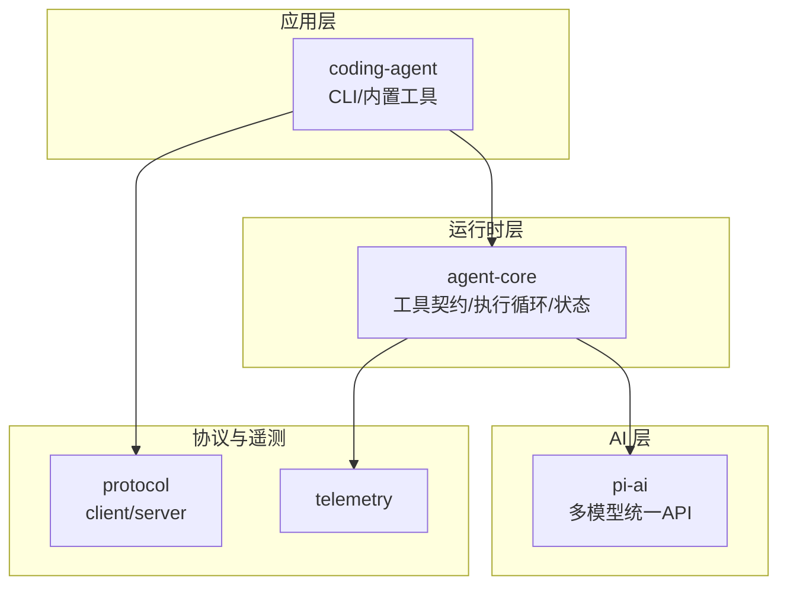
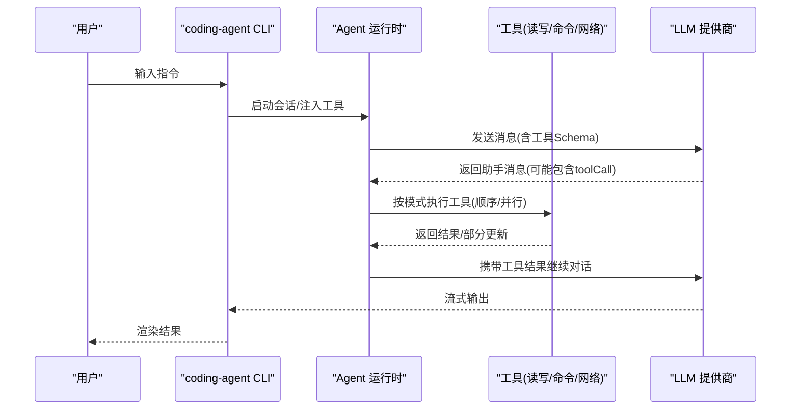
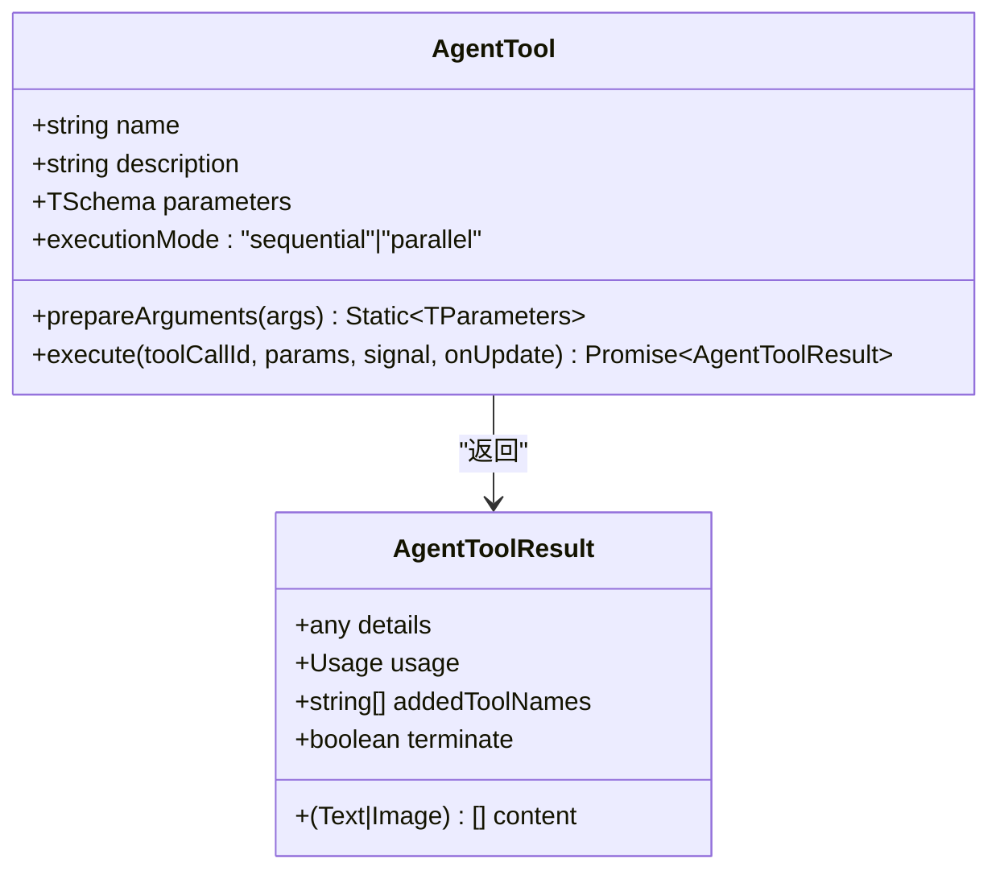
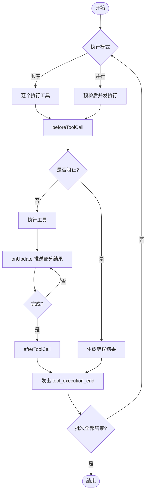
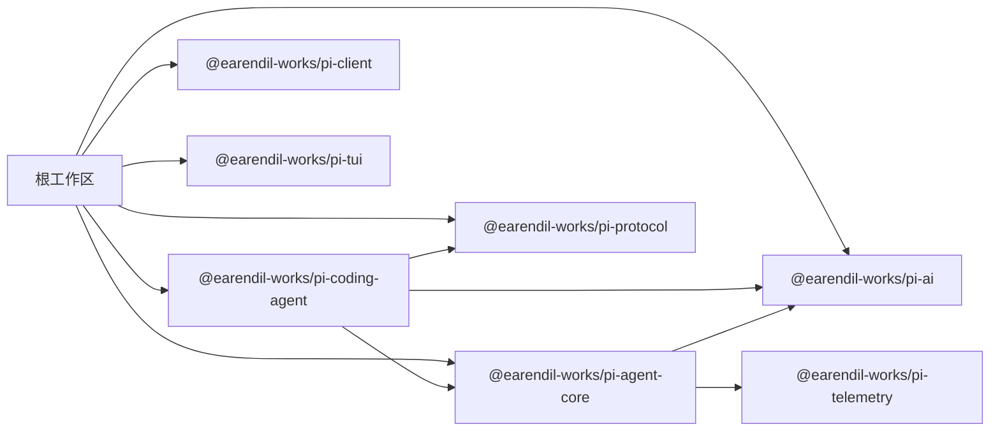

# 工具开发框架

<cite>
**本文引用的文件**
- [README.md](file://README.md)
- [package.json](file://package.json)
- [agent/package.json](file://packages/agent/package.json)
- [coding-agent/package.json](file://packages/coding-agent/package.json)
- [agent/index.ts](file://packages/agent/src/index.ts)
- [agent/types.ts](file://packages/agent/src/types.ts)
</cite>

## 目录
1. [简介](#简介)
2. [项目结构](#项目结构)
3. [核心组件](#核心组件)
4. [架构总览](#架构总览)
5. [详细组件分析](#详细组件分析)
6. [依赖关系分析](#依赖关系分析)
7. [性能与执行环境](#性能与执行环境)
8. [故障排查指南](#故障排查指南)
9. [结论](#结论)
10. [附录：工具开发与发布指南](#附录工具开发与发布指南)

## 简介
本仓库提供一套可扩展的“智能体（Agent）+ 工具”框架，用于驱动 AI 模型在真实环境中调用工具完成复杂任务。核心能力包括：
- 统一的工具定义与执行接口（函数签名、参数校验、返回值、错误处理）
- 工具上下文管理（文件系统、Shell、环境变量、会话信息）
- 工具注册机制（元数据、权限、版本）
- 执行环境控制（并发模式、超时、中止信号、沙箱隔离建议）
- 完整的开发、测试、调试与发布流程

该框架由多包组成，其中 agent 包提供运行时与工具契约，coding-agent 包提供 CLI 与内置工具实现，ai 包提供统一的多模型 API。

## 项目结构
- packages/agent：智能体运行时、工具契约、消息与事件、压缩与提示模板等
- packages/coding-agent：CLI、内置工具（读/写/编辑/命令）、RPC 入口、扩展点
- packages/ai：统一 LLM 抽象与提供商适配
- packages/protocol/client/server：协议与通信层
- packages/telemetry：遥测契约与实现
- scripts：构建、发布、检查脚本

图表来源
- [agent/index.ts:1-146](file://packages/agent/src/index.ts#L1-L146)
- [coding-agent/package.json:1-109](file://packages/coding-agent/package.json#L1-L109)
- [agent/package.json:1-69](file://packages/agent/package.json#L1-L69)

章节来源
- [README.md:13-46](file://README.md#L13-L46)
- [package.json:1-75](file://package.json#L1-L75)

## 核心组件
- Agent 工具类型与执行契约：定义工具的参数 Schema、执行函数、结果结构、更新回调、执行模式等
- 工具执行钩子：beforeToolCall/afterToolCall 支持拦截、改写结果、终止策略
- 执行模式：sequential 与 parallel，支持批内早停
- 上下文与状态：系统提示、消息历史、可用工具、流式响应、待执行工具集合
- 事件总线：agent_start/end、turn/message/tool_execution_* 等生命周期事件
- 资源与错误：统一的错误类型、文件/Shell/执行错误码、ok/getOrThrow 等辅助

章节来源
- [agent/types.ts:35-95](file://packages/agent/src/types.ts#L35-L95)
- [agent/types.ts:149-293](file://packages/agent/src/types.ts#L149-L293)
- [agent/types.ts:360-444](file://packages/agent/src/types.ts#L360-L444)
- [agent/index.ts:109-138](file://packages/agent/src/index.ts#L109-L138)

## 架构总览
下图展示从 CLI 到 Agent 运行时的调用链，以及工具执行的典型流程。

图表来源
- [agent/types.ts:149-293](file://packages/agent/src/types.ts#L149-L293)
- [agent/types.ts:385-409](file://packages/agent/src/types.ts#L385-L409)
- [agent/index.ts:109-138](file://packages/agent/src/index.ts#L109-L138)

## 详细组件分析

### 工具接口规范
- 工具定义
  - 名称与描述：来自 Tool 基类
  - 参数 Schema：使用 TypeBox 静态 Schema 进行强类型校验
  - 可选参数预处理：prepareArguments 可在校验前对原始参数做兼容转换
  - 执行函数 execute：接收 toolCallId、已校验参数、AbortSignal、onUpdate 回调；失败应抛出异常而非在 content 中编码错误
  - 执行模式：executionMode 可覆盖全局设置（sequential/parallel）
- 返回值
  - AgentToolResult：content（文本/图片）、details（结构化日志/UI 用）、usage（工具自身用量）、addedToolNames（动态新增工具名）、terminate（批次早停提示）
- 更新回调
  - onUpdate：允许工具在执行过程中推送部分结果，便于 UI 实时反馈
- 钩子
  - beforeToolCall：可阻止执行并返回原因，或标记 terminate
  - afterToolCall：可替换 content/details/isError/usage/terminate

图表来源
- [agent/types.ts:385-409](file://packages/agent/src/types.ts#L385-L409)
- [agent/types.ts:360-375](file://packages/agent/src/types.ts#L360-L375)

章节来源
- [agent/types.ts:385-409](file://packages/agent/src/types.ts#L385-L409)
- [agent/types.ts:360-375](file://packages/agent/src/types.ts#L360-L375)

### 工具上下文管理
- 文件系统访问
  - FileSystem 抽象与 FileKind/FileInfo/FileErrorCode 暴露了跨平台文件操作能力
  - 通过 getOrThrow/getOrUndefined/ok/toError 等辅助简化错误处理
- Shell 执行
  - Shell 抽象与 ShellExecOptions 封装命令执行，便于在不同环境下复用
- 环境变量与会话
  - 通过 AgentContext 传递 systemPrompt/messages/tools，结合会话后端保存/恢复
  - 可通过 getApiKey 动态获取短期令牌，避免长时任务中的鉴权过期问题
- 安全边界
  - 默认以宿主进程权限运行；如需更强隔离，建议使用容器/微VM/策略沙箱

章节来源
- [agent/index.ts:110-138](file://packages/agent/src/index.ts#L110-L138)
- [README.md:38-46](file://README.md#L38-L46)

### 工具注册机制
- 元数据定义
  - 工具名称、描述、参数 Schema、标签 label（UI 显示）
- 权限配置
  - 通过 beforeToolCall 钩子在调用前进行权限校验与阻断
- 版本管理
  - 工具对象本身不直接暴露版本字段，但可通过 addedToolNames 在运行期动态引入新工具名，配合外部注册表/清单管理版本
- 执行模式
  - 全局 toolExecution 与工具级 executionMode 共同决定并发策略

章节来源
- [agent/types.ts:149-293](file://packages/agent/src/types.ts#L149-L293)
- [agent/types.ts:385-409](file://packages/agent/src/types.ts#L385-L409)

### 工具执行环境
- 并发与调度
  - sequential：逐个准备、执行、收尾
  - parallel：预检后并发执行，tool_execution_end 按完成顺序发出，工具结果消息按源顺序追加
- 超时与中止
  - 钩子与 execute 均接收 AbortSignal，需主动监听并优雅退出
- 资源限制
  - 框架未内置 CPU/内存配额；建议在 Shell/网络层自行限制，或使用容器/微VM 隔离
- 错误处理
  - 工具内部抛错会被捕获为错误结果；也可通过 afterToolCall 将成功结果标记为错误

图表来源
- [agent/types.ts:149-293](file://packages/agent/src/types.ts#L149-L293)
- [agent/types.ts:385-409](file://packages/agent/src/types.ts#L385-L409)

## 依赖关系分析
- coding-agent 依赖 agent-core、ai、client、protocol、tui 等包
- agent-core 依赖 ai、telemetry、typebox、yaml 等
- 根 package.json 定义了 monorepo 工作区与统一构建/检查脚本

图表来源
- [package.json:1-75](file://package.json#L1-L75)
- [coding-agent/package.json:1-109](file://packages/coding-agent/package.json#L1-L109)
- [agent/package.json:1-69](file://packages/agent/package.json#L1-L69)

章节来源
- [package.json:1-75](file://package.json#L1-L75)
- [coding-agent/package.json:1-109](file://packages/coding-agent/package.json#L1-L109)
- [agent/package.json:1-69](file://packages/agent/package.json#L1-L69)

## 性能与执行环境
- 并发优化
  - 合理选择 parallel 模式提升吞吐；对 I/O 密集型工具尤其有效
- 流式更新
  - 使用 onUpdate 减少端到端延迟，改善交互体验
- 资源控制
  - 在 Shell/网络层限制并发与超时；必要时使用容器/微VM 隔离
- 上下文压缩
  - 利用压缩与摘要能力控制上下文大小，降低 LLM 成本与延迟

[本节为通用指导，不直接分析具体文件]

## 故障排查指南
- 常见错误类型
  - 文件错误：FileErrorCode
  - 执行错误：ExecutionErrorCode
  - 分支摘要错误：BranchSummaryErrorCode
  - 压缩错误：CompactionErrorCode
- 定位方法
  - 通过 tool_execution_* 事件追踪工具执行阶段
  - 使用 afterToolCall 调整 isError 与 details，便于诊断
  - 借助 telemetry 记录关键路径指标

章节来源
- [agent/index.ts:110-138](file://packages/agent/src/index.ts#L110-L138)

## 结论
本框架提供了标准化的工具契约、灵活的执行环境与完善的生命周期钩子，适合构建可扩展的智能体工具生态。通过合理的并发策略、错误处理与隔离方案，可以在保证安全的前提下高效完成复杂任务。

[本节为总结性内容，不直接分析具体文件]

## 附录：工具开发与发布指南

### 工具开发步骤
- 定义工具
  - 声明名称、描述、参数 Schema、label
  - 实现 prepareArguments（可选）与 execute
  - 按需设置 executionMode
- 注册工具
  - 将工具加入 AgentState.tools
- 上下文与权限
  - 在 beforeToolCall 中进行权限校验与阻断
  - 通过 AgentContext 读取系统提示、消息历史与可用工具
- 错误与更新
  - 在 execute 中抛出异常表示失败
  - 使用 onUpdate 推送部分结果
  - 在 afterToolCall 中修正结果或标记错误

章节来源
- [agent/types.ts:149-293](file://packages/agent/src/types.ts#L149-L293)
- [agent/types.ts:385-409](file://packages/agent/src/types.ts#L385-L409)

### 常见场景参考
- 文件操作
  - 使用 FileSystem/Shell 抽象进行读写与命令执行
- 命令执行
  - 通过 Shell.exec 执行外部命令，注意超时与权限
- 网络请求
  - 在工具中发起 HTTP 请求，注意重试与限流

章节来源
- [agent/index.ts:110-138](file://packages/agent/src/index.ts#L110-L138)

### 测试与调试
- 单元测试
  - 使用 Vitest 编写工具用例，验证参数校验与结果结构
- 集成测试
  - 通过 AgentHarness 模拟会话与工具执行，断言事件序列
- 调试技巧
  - 订阅 tool_execution_* 事件，打印 args/partialResult/result
  - 使用 afterToolCall 注入诊断信息

章节来源
- [agent/package.json:27-35](file://packages/agent/package.json#L27-L35)
- [coding-agent/package.json:35-44](file://packages/coding-agent/package.json#L35-L44)

### 构建与发布
- 本地构建
  - 根目录执行构建脚本，依次编译各包
- 二进制构建
  - coding-agent 支持构建独立二进制，便于分发
- 发布流程
  - 使用根脚本触发版本升级与发布，确保 shrinkwrap 与依赖锁定一致

章节来源
- [package.json:14-49](file://package.json#L14-L49)
- [coding-agent/package.json:35-44](file://packages/coding-agent/package.json#L35-L44)