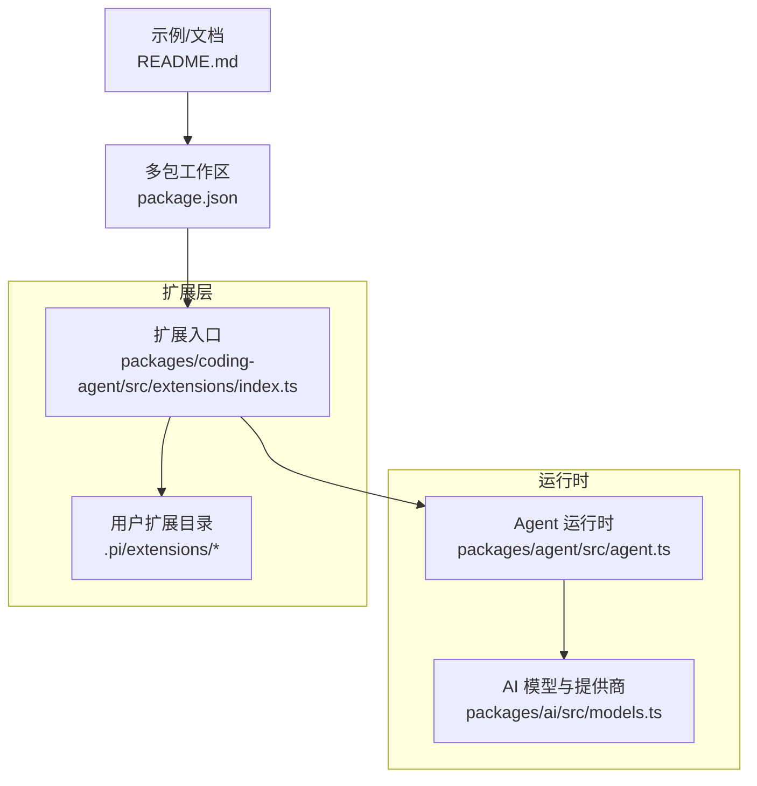
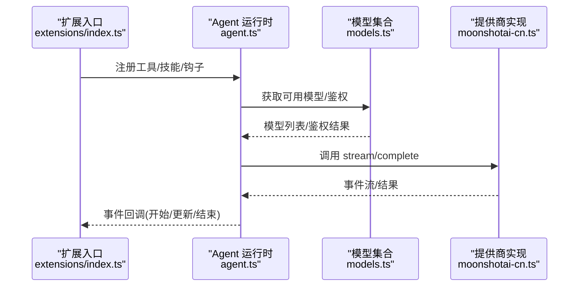
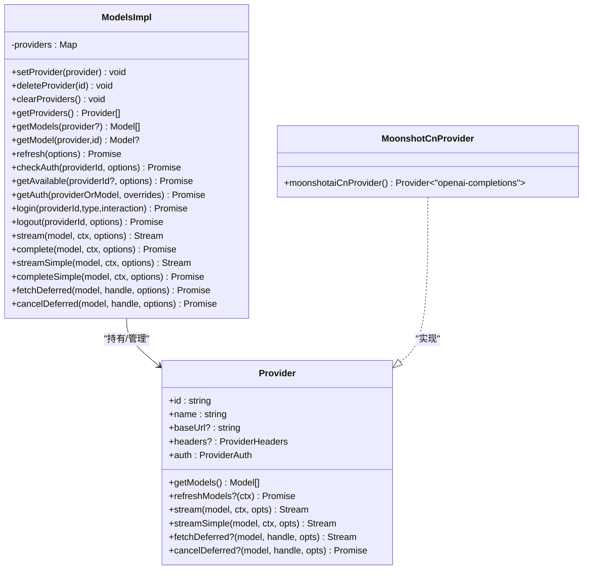
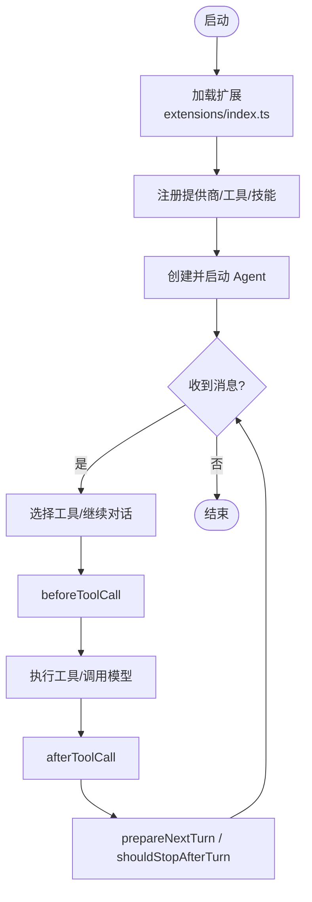
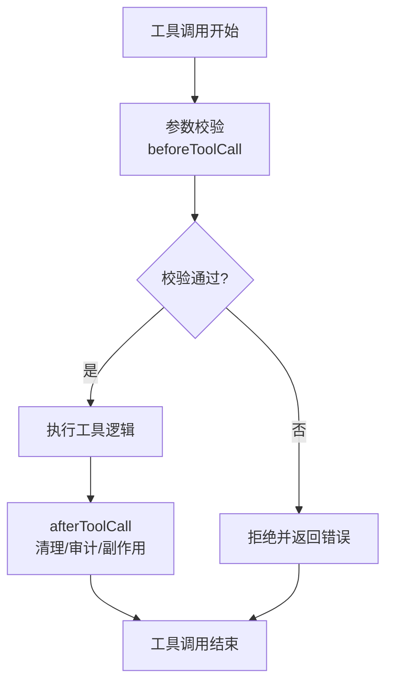
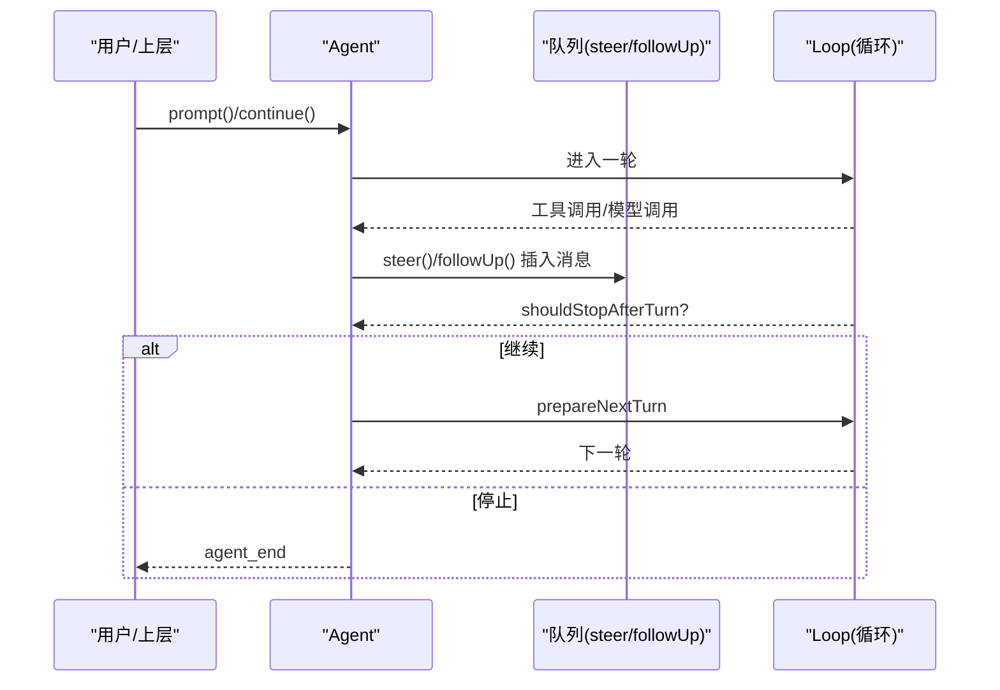
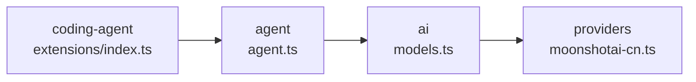

# 扩展机制设计

<cite>
**本文引用的文件**
- [README.md](file://README.md)
- [package.json](file://package.json)
- [packages/agent/package.json](file://packages/agent/package.json)
- [packages/ai/src/models.ts](file://packages/ai/src/models.ts)
- [packages/ai/src/providers/moonshotai-cn.ts](file://packages/ai/src/providers/moonshotai-cn.ts)
- [packages/agent/src/agent.ts](file://packages/agent/src/agent.ts)
- [packages/coding-agent/src/extensions/index.ts](file://packages/coding-agent/src/extensions/index.ts)
</cite>

## 目录
1. [简介](#简介)
2. [项目结构](#项目结构)
3. [核心组件](#核心组件)
4. [架构总览](#架构总览)
5. [详细组件分析](#详细组件分析)
6. [依赖关系分析](#依赖关系分析)
7. [性能考量](#性能考量)
8. [故障排查指南](#故障排查指南)
9. [结论](#结论)
10. [附录](#附录)

## 简介
本文件面向希望为 Pi Agent Harness 开发扩展的工程师，系统化阐述插件化架构与扩展机制的设计与实现。内容覆盖：
- 动态加载、生命周期管理、依赖注入
- 自定义工具开发（接口规范、参数校验、错误处理、权限控制）
- 技能系统（工作流编排、条件执行、状态管理、错误恢复）
- 提供商集成（适配器模式、API 兼容性、认证处理）
- 扩展点定义、注册机制、配置管理
- 完整开发示例与最佳实践

## 项目结构
仓库采用多包 monorepo 组织，关键扩展相关位置如下：
- packages/ai：统一的多提供商 LLM 抽象与 Provider 模型，支持动态刷新、认证解析、请求头合并等
- packages/agent：Agent 运行时，负责消息循环、工具调用、事件生命周期、队列调度
- packages/coding-agent：CLI 与扩展入口，提供 extensions 目录用于加载用户扩展
- .pi/extensions：用户级扩展存放位置（由 CLI 在启动时扫描并加载）
- package.json：workspaces 声明了内置与示例扩展，便于本地开发与联调

图表来源
- [packages/agent/src/agent.ts:173-238](file://packages/agent/src/agent.ts#L173-L238)
- [packages/ai/src/models.ts:254-288](file://packages/ai/src/models.ts#L254-L288)
- [packages/coding-agent/src/extensions/index.ts](file://packages/coding-agent/src/extensions/index.ts)
- [package.json:5-13](file://package.json#L5-L13)
- [README.md:13-35](file://README.md#L13-L35)

章节来源
- [README.md:13-35](file://README.md#L13-L35)
- [package.json:5-13](file://package.json#L5-L13)

## 核心组件
- AI 提供商抽象与模型集合
  - Provider 接口：标识、名称、baseUrl、auth、getModels、refreshModels、stream/streamSimple/fetchDeferred/cancelDeferred 等
  - Models/MutableModels：Provider 注册、鉴权解析、模型刷新、可用模型过滤、请求头合并、延迟流式调用
- Agent 运行时
  - Agent 类：消息与工具状态、事件订阅、提示输入归一化、运行生命周期、队列（steer/followUp）、重试与传输策略
  - 工具钩子：beforeToolCall、afterToolCall、shouldStopAfterTurn、prepareNextTurn 等扩展点
- 扩展入口
  - coding-agent 的 extensions/index.ts 作为扩展装配点，负责发现、加载、初始化用户扩展
  - .pi/extensions 为用户扩展目录，可放置自定义工具、技能、提供商适配器等

章节来源
- [packages/ai/src/models.ts:97-149](file://packages/ai/src/models.ts#L97-L149)
- [packages/ai/src/models.ts:254-288](file://packages/ai/src/models.ts#L254-L288)
- [packages/agent/src/agent.ts:97-123](file://packages/agent/src/agent.ts#L97-L123)
- [packages/agent/src/agent.ts:173-238](file://packages/agent/src/agent.ts#L173-L238)
- [packages/coding-agent/src/extensions/index.ts](file://packages/coding-agent/src/extensions/index.ts)

## 架构总览
下图展示从扩展到运行时再到提供商的端到端流程：扩展通过入口注册工具/技能/提供商；Agent 在运行期根据上下文选择工具或继续对话；AI 层将请求路由至具体 Provider，完成鉴权与流式响应。

图表来源
- [packages/coding-agent/src/extensions/index.ts](file://packages/coding-agent/src/extensions/index.ts)
- [packages/agent/src/agent.ts:173-238](file://packages/agent/src/agent.ts#L173-L238)
- [packages/ai/src/models.ts:254-288](file://packages/ai/src/models.ts#L254-L288)
- [packages/ai/src/providers/moonshotai-cn.ts:6-14](file://packages/ai/src/providers/moonshotai-cn.ts#L6-L14)

## 详细组件分析

### 提供商集成机制（适配器模式、API 兼容、认证处理）
- 适配器模式
  - 通过 createProvider 将不同后端统一为 Provider 接口，屏蔽差异
  - 单一 api 或按 model.api 分派，保证同一 Provider 内多 API 兼容
- API 兼容
  - getModels 同步返回已知模型；refreshModels 可选，用于动态刷新
  - stream/streamSimple/fetchDeferred/cancelDeferred 统一流式与延迟响应
- 认证处理
  - 支持 apiKey/oauth，resolve 阶段合并 baseUrl、headers、env
  - 支持 transformHeaders 在最终派发前修改请求头
  - 支持 filterModels 基于凭证过滤可用模型

图表来源
- [packages/ai/src/models.ts:97-149](file://packages/ai/src/models.ts#L97-L149)
- [packages/ai/src/models.ts:254-288](file://packages/ai/src/models.ts#L254-L288)
- [packages/ai/src/providers/moonshotai-cn.ts:6-14](file://packages/ai/src/providers/moonshotai-cn.ts#L6-L14)

章节来源
- [packages/ai/src/models.ts:97-149](file://packages/ai/src/models.ts#L97-L149)
- [packages/ai/src/models.ts:254-288](file://packages/ai/src/models.ts#L254-L288)
- [packages/ai/src/providers/moonshotai-cn.ts:6-14](file://packages/ai/src/providers/moonshotai-cn.ts#L6-L14)

### 动态加载与生命周期管理
- 动态加载
  - 通过 workspaces 与 .pi/extensions 目录，在构建/启动时按需发现并加载扩展
  - 扩展可注册新的 Provider、工具、技能、钩子函数
- 生命周期
  - Agent 暴露 subscribe 监听 agent/message/turn 等事件
  - beforeToolCall/afterToolCall 提供工具执行前后钩子
  - shouldStopAfterTurn/prepareNextTurn 控制轮次终止与下一轮准备
  - refreshModels 支持动态刷新模型列表，结合持久化与信号中止

图表来源
- [packages/coding-agent/src/extensions/index.ts](file://packages/coding-agent/src/extensions/index.ts)
- [packages/agent/src/agent.ts:240-253](file://packages/agent/src/agent.ts#L240-L253)
- [packages/agent/src/agent.ts:445-484](file://packages/agent/src/agent.ts#L445-L484)
- [packages/ai/src/models.ts:386-446](file://packages/ai/src/models.ts#L386-L446)

章节来源
- [packages/agent/src/agent.ts:240-253](file://packages/agent/src/agent.ts#L240-L253)
- [packages/agent/src/agent.ts:445-484](file://packages/agent/src/agent.ts#L445-L484)
- [packages/ai/src/models.ts:386-446](file://packages/ai/src/models.ts#L386-L446)

### 依赖注入与配置管理
- 依赖注入
  - AgentOptions 注入 streamFn、convertToLlm、transformContext、getApiKey、onPayload/onResponse、工具钩子、传输策略、思考预算等
  - Models 构造注入 CredentialStore、ModelsStore、AuthContext，解耦存储与鉴权上下文
- 配置管理
  - Provider 通过 createProvider 声明 id/name/baseUrl/auth/models/api
  - 支持 per-model headers 与全局 headers 合并
  - 支持 transformHeaders 在派发前对请求头进行最后一步定制

章节来源
- [packages/agent/src/agent.ts:97-123](file://packages/agent/src/agent.ts#L97-L123)
- [packages/ai/src/models.ts:735-754](file://packages/ai/src/models.ts#L735-L754)
- [packages/ai/src/models.ts:636-665](file://packages/ai/src/models.ts#L636-L665)

### 自定义工具开发（接口规范、参数验证、错误处理、权限控制）
- 接口规范
  - 工具以 AgentTool 形式注册，具备名称、描述、参数 Schema、执行函数
  - 通过 beforeToolCall/afterToolCall 钩子实现前置校验与后置处理
- 参数验证
  - 建议基于 JSON Schema 或 TypeBox 等库在 beforeToolCall 中校验入参
- 错误处理
  - 工具执行抛出异常将被捕获，Agent 会生成错误消息并触发 turn_end/agent_end
- 权限控制
  - 可在 beforeToolCall 中检查上下文/环境/凭据，拒绝敏感操作
  - 结合容器化/沙箱隔离（参考 README 中的容器化模式）

图表来源
- [packages/agent/src/agent.ts:240-253](file://packages/agent/src/agent.ts#L240-L253)
- [packages/agent/src/agent.ts:511-527](file://packages/agent/src/agent.ts#L511-L527)

章节来源
- [packages/agent/src/agent.ts:511-527](file://packages/agent/src/agent.ts#L511-L527)

### 技能系统设计（工作流编排、条件执行、状态管理、错误恢复）
- 工作流编排
  - 使用 Agent 的 steer/followUp 队列编排多步任务，支持“一次一个”或“全部”模式
  - prepareNextTurn 决定下一轮输入与上下文转换
- 条件执行
  - shouldStopAfterTurn 基于当前消息/工具结果决定是否停止
- 状态管理
  - Agent.state 维护 messages/tools/systemPrompt 等，支持快照与替换
- 错误恢复
  - 工具失败会写入 errorMessage，可在后续轮次中读取并恢复
  - 支持 AbortSignal 中断长耗时任务

图表来源
- [packages/agent/src/agent.ts:282-311](file://packages/agent/src/agent.ts#L282-L311)
- [packages/agent/src/agent.ts:445-484](file://packages/agent/src/agent.ts#L445-L484)
- [packages/agent/src/agent.ts:511-527](file://packages/agent/src/agent.ts#L511-L527)

章节来源
- [packages/agent/src/agent.ts:282-311](file://packages/agent/src/agent.ts#L282-L311)
- [packages/agent/src/agent.ts:445-484](file://packages/agent/src/agent.ts#L445-L484)
- [packages/agent/src/agent.ts:511-527](file://packages/agent/src/agent.ts#L511-L527)

### 扩展点定义、注册机制、配置管理
- 扩展点
  - 工具：AgentTool（名称、描述、Schema、执行器）
  - 钩子：beforeToolCall、afterToolCall、shouldStopAfterTurn、prepareNextTurn
  - 提供商：Provider（id/name/auth/models/api）
- 注册机制
  - 在 extensions/index.ts 中集中注册，避免散乱耦合
  - 通过 workspaces 将示例扩展纳入本地开发工作区
- 配置管理
  - 通过 AgentOptions 与 createProvider 传入配置
  - 支持 per-model headers、transformHeaders、filterModels

章节来源
- [packages/agent/src/agent.ts:97-123](file://packages/agent/src/agent.ts#L97-L123)
- [packages/ai/src/models.ts:735-754](file://packages/ai/src/models.ts#L735-L754)
- [package.json:5-13](file://package.json#L5-L13)

## 依赖关系分析
- 包间依赖
  - agent 依赖 ai（模型与提供商抽象）
  - coding-agent 依赖 agent（运行时）与 ai（提供商）
  - 扩展通过 coding-agent 的 extensions 入口接入
- 内部耦合
  - ModelsImpl 集中管理 Provider 生命周期与鉴权
  - Agent 封装消息循环与工具执行，向上暴露稳定 API

图表来源
- [packages/coding-agent/src/extensions/index.ts](file://packages/coding-agent/src/extensions/index.ts)
- [packages/agent/src/agent.ts:173-238](file://packages/agent/src/agent.ts#L173-L238)
- [packages/ai/src/models.ts:254-288](file://packages/ai/src/models.ts#L254-L288)
- [packages/ai/src/providers/moonshotai-cn.ts:6-14](file://packages/ai/src/providers/moonshotai-cn.ts#L6-L14)

章节来源
- [packages/agent/package.json:1-69](file://packages/agent/package.json#L1-L69)
- [package.json:5-13](file://package.json#L5-L13)

## 性能考量
- 并发刷新
  - Models.refresh 支持按 provider 并发刷新，错误与取消互不干扰
- 流式与延迟
  - 优先使用 stream/streamSimple，减少阻塞；支持 fetchDeferred/cancelDeferred 提升交互体验
- 头部合并与缓存
  - transformHeaders 仅在派发前执行，避免重复计算；filterModels 减少无效模型枚举
- 队列模式
  - steeringMode/followUpMode 控制消息消费策略，避免风暴

[本节为通用指导，无需特定文件引用]

## 故障排查指南
- 提供商未配置
  - 现象：getAuth 返回 undefined 或抛错
  - 排查：确认 Provider.auth 已正确配置，必要时调用 login
- 模型刷新失败
  - 现象：refresh 返回 errors map
  - 排查：检查网络、凭证、signal 是否被中止
- 工具执行错误
  - 现象：turn_end 携带 errorMessage
  - 排查：在 afterToolCall 中记录日志，定位异常堆栈
- 运行冲突
  - 现象：prompt/continue 抛出“已在处理”
  - 排查：等待 waitForIdle 或使用 steer/followUp 排队

章节来源
- [packages/ai/src/models.ts:386-446](file://packages/ai/src/models.ts#L386-L446)
- [packages/agent/src/agent.ts:347-388](file://packages/agent/src/agent.ts#L347-L388)
- [packages/agent/src/agent.ts:511-527](file://packages/agent/src/agent.ts#L511-L527)

## 结论
本扩展机制以 Provider 抽象为核心，配合 Agent 运行时与扩展入口，形成“插件化 + 适配器 + 钩子”的统一体系。通过 Models 的鉴权与刷新能力、Agent 的事件与队列机制，开发者可以安全地扩展工具、技能与提供商，同时保持系统的稳定性与可观测性。

[本节为总结，无需特定文件引用]

## 附录

### 开发示例与最佳实践
- 新增提供商
  - 使用 createProvider 声明 id/name/baseUrl/auth/models/api
  - 如需动态模型，实现 refreshModels 并通过 context.publish 持久化
  - 示例路径：[packages/ai/src/providers/moonshotai-cn.ts:6-14](file://packages/ai/src/providers/moonshotai-cn.ts#L6-L14)
- 注册工具与钩子
  - 在 extensions/index.ts 中注册工具与 beforeToolCall/afterToolCall
  - 在 beforeToolCall 中进行参数校验与权限检查
  - 示例路径：[packages/coding-agent/src/extensions/index.ts](file://packages/coding-agent/src/extensions/index.ts)
- 工作流编排
  - 使用 steer/followUp 插入后续步骤，shouldStopAfterTurn 控制终止
  - 使用 prepareNextTurn 组装下一轮上下文
  - 示例路径：[packages/agent/src/agent.ts:282-311](file://packages/agent/src/agent.ts#L282-L311)、[packages/agent/src/agent.ts:445-484](file://packages/agent/src/agent.ts#L445-L484)
- 配置与依赖注入
  - 通过 AgentOptions 注入流式函数、传输策略、思考预算等
  - 通过 createProvider 注入 headers、filterModels、transformHeaders
  - 示例路径：[packages/agent/src/agent.ts:97-123](file://packages/agent/src/agent.ts#L97-L123)、[packages/ai/src/models.ts:735-754](file://packages/ai/src/models.ts#L735-L754)

章节来源
- [packages/ai/src/providers/moonshotai-cn.ts:6-14](file://packages/ai/src/providers/moonshotai-cn.ts#L6-L14)
- [packages/coding-agent/src/extensions/index.ts](file://packages/coding-agent/src/extensions/index.ts)
- [packages/agent/src/agent.ts:97-123](file://packages/agent/src/agent.ts#L97-L123)
- [packages/agent/src/agent.ts:282-311](file://packages/agent/src/agent.ts#L282-L311)
- [packages/agent/src/agent.ts:445-484](file://packages/agent/src/agent.ts#L445-L484)
- [packages/ai/src/models.ts:735-754](file://packages/ai/src/models.ts#L735-L754)