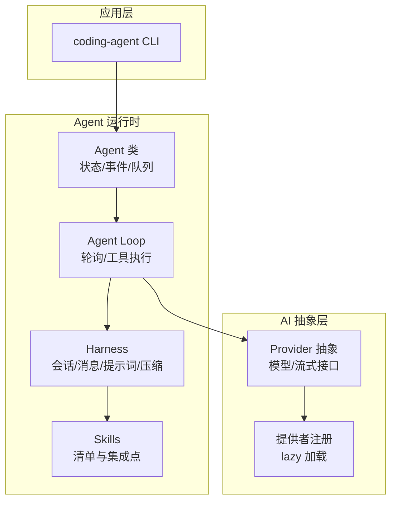
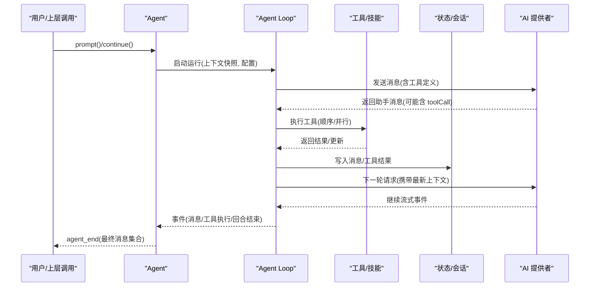
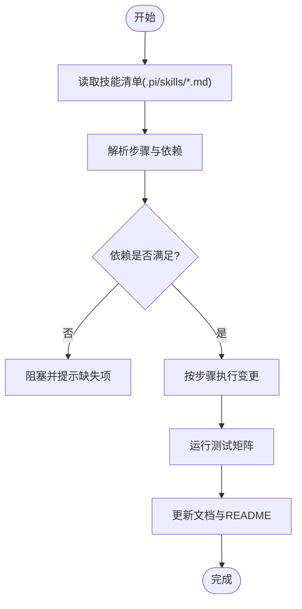
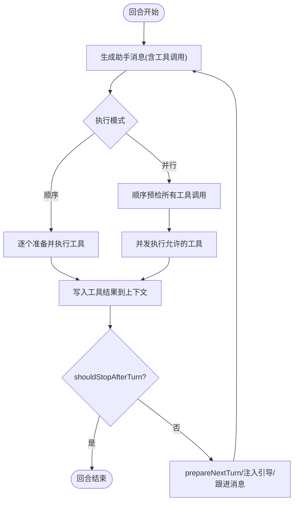
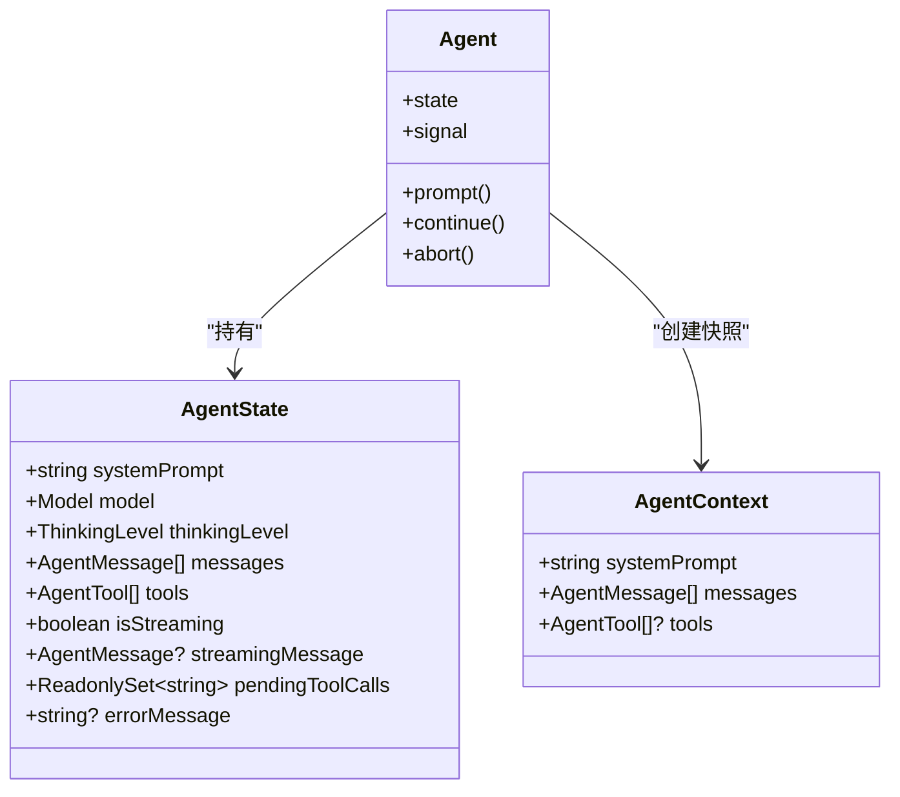
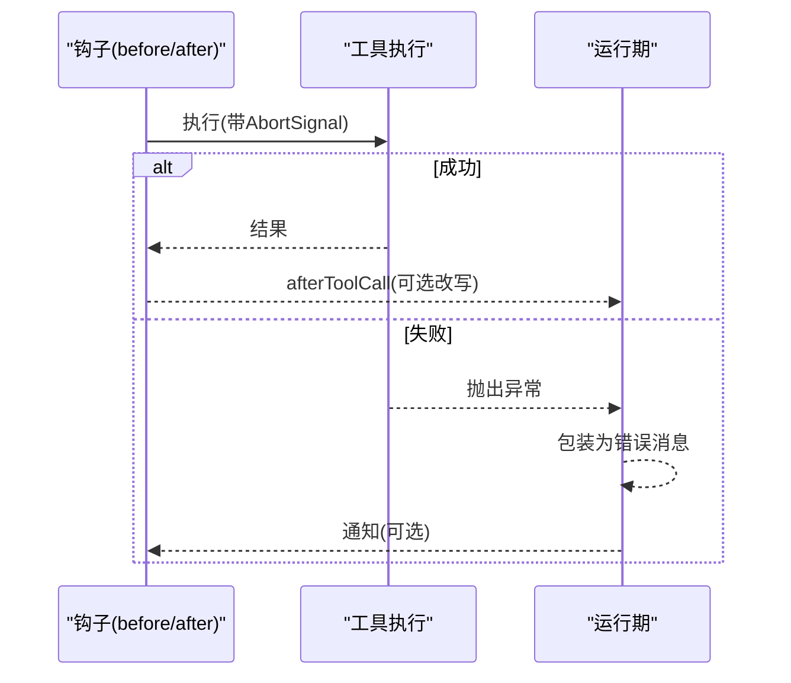
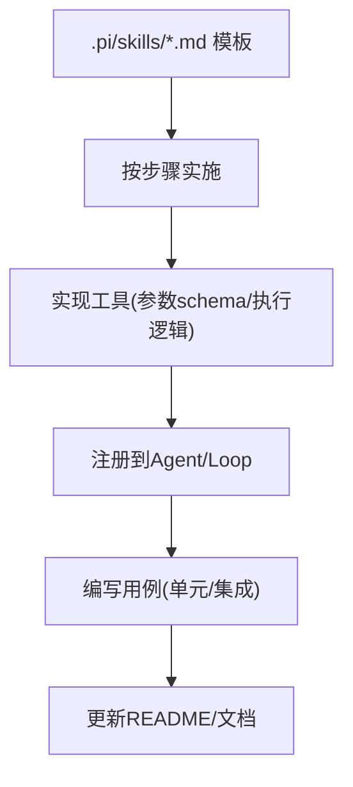
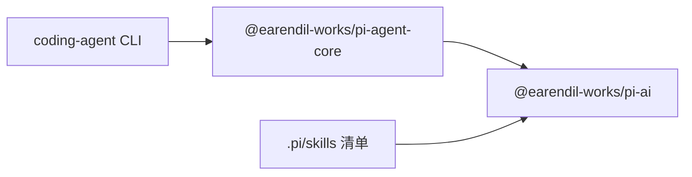

# 技能系统设计

<cite>
**本文引用的文件**
- [README.md](file://README.md)
- [add-llm-provider.md](file://.pi/skills/add-llm-provider.md)
- [index.ts](file://packages/agent/src/index.ts)
- [types.ts](file://packages/agent/src/types.ts)
- [agent.ts](file://packages/agent/src/agent.ts)
- [package.json](file://packages/agent/package.json)
- [moonshotai-cn.ts](file://packages/ai/src/providers/moonshotai-cn.ts)
</cite>

## 目录
1. [简介](#简介)
2. [项目结构](#项目结构)
3. [核心组件](#核心组件)
4. [架构总览](#架构总览)
5. [详细组件分析](#详细组件分析)
6. [依赖关系分析](#依赖关系分析)
7. [性能考量](#性能考量)
8. [故障排查指南](#故障排查指南)
9. [结论](#结论)
10. [附录](#附录)

## 简介
本文件面向“技能系统”的设计与实现，围绕以下目标展开：
- 技能定义格式（YAML/JSON 结构、元数据描述、依赖声明）
- 工作流编排引擎（步骤定义、条件分支、循环控制、并行执行）
- 状态管理机制（变量作用域、数据持久化、状态恢复）
- 技能执行环境（上下文注入、资源管理、错误恢复）
- 技能开发模板与示例（代码生成、文件操作、API 调用等）
- 技能测试、调试与分发指南

本项目以 Agent 运行时为核心，提供工具调用、会话与状态管理、事件驱动的执行模型；同时通过 .pi/skills 下的 Markdown 清单式技能文档组织“如何新增能力”的标准化流程。AI 层提供统一的多厂商 LLM 抽象，便于在技能中复用。

**章节来源**
- [README.md:13-36](file://README.md#L13-L36)

## 项目结构
仓库采用多包 monorepo 组织，关键目录与职责如下：
- packages/agent：Agent 运行时，包含工具调用、会话、状态、事件、提示词模板、压缩与分支摘要等能力
- packages/ai：统一的多提供商 LLM 抽象与提供者注册
- packages/coding-agent：交互式编码代理 CLI（对外入口之一）
- .pi/skills：以 Markdown 形式维护的技能清单与步骤指引（如新增 LLM 提供者的检查清单）

**图示来源**
- [agent.ts:173-238](file://packages/agent/src/agent.ts#L173-L238)
- [index.ts:43-83](file://packages/agent/src/index.ts#L43-L83)
- [moonshotai-cn.ts:6-14](file://packages/ai/src/providers/moonshotai-cn.ts#L6-L14)

**章节来源**
- [README.md:26-36](file://README.md#L26-L36)
- [index.ts:43-83](file://packages/agent/src/index.ts#L43-L83)

## 核心组件
- Agent 运行时：封装会话、消息、工具、事件、队列（steering/follow-up）、执行模式（顺序/并行）与生命周期钩子
- 工具与技能：通过工具接口暴露可执行能力；技能以清单/模板形式组织，指导如何扩展系统能力
- AI 抽象：统一的模型/提供者抽象，支持流式事件与多种后端
- Harness：会话、消息、提示词模板、压缩、分支摘要、遥测等横切能力

**章节来源**
- [types.ts:149-293](file://packages/agent/src/types.ts#L149-L293)
- [agent.ts:173-238](file://packages/agent/src/agent.ts#L173-L238)
- [index.ts:43-83](file://packages/agent/src/index.ts#L43-L83)

## 架构总览
技能系统由“技能定义 + 编排引擎 + 执行环境 + 状态管理”构成，整体数据与控制流如下：

**图示来源**
- [agent.ts:347-434](file://packages/agent/src/agent.ts#L347-L434)
- [types.ts:149-293](file://packages/agent/src/types.ts#L149-L293)

## 详细组件分析

### 技能定义格式（YAML/JSON、元数据、依赖）
- 技能以 Markdown 清单形式存在，位于 .pi/skills，用于描述“如何新增/集成某项能力”的步骤与文件清单
- 典型结构包括：
  - 标题与概述：说明该技能的目标与范围
  - 步骤列表：按序列出需要修改的文件与注意事项
  - 依赖与影响面：标注涉及的核心模块（类型、提供者、注册、测试、CLI 集成、文档）
- 示例参考：新增 LLM 提供者的技能清单，覆盖类型、提供者实现、懒加载注册、模型生成、测试矩阵、编码代理集成与文档更新

**图示来源**
- [add-llm-provider.md:1-58](file://.pi/skills/add-llm-provider.md#L1-L58)

**章节来源**
- [add-llm-provider.md:1-58](file://.pi/skills/add-llm-provider.md#L1-L58)

### 工作流编排引擎（步骤、分支、循环、并行）
- 步骤定义：通过工具（Tool）定义参数 schema 与执行逻辑；Agent 将工具定义随消息发送给模型，由模型决定何时调用
- 条件分支：通过 beforeToolCall/afterToolCall 钩子在工具执行前后进行拦截与改写，实现权限校验、结果替换、终止建议等
- 循环控制：Agent 轮询机制会在每轮结束后根据 shouldStopAfterTurn/prepareNextTurn 决定是否继续；getSteeringMessages/getFollowUpMessages 可在中间注入新指令或后续任务
- 并行执行：toolExecution 支持“顺序/并行”两种模式；并行模式下预检工具调用后并发执行，按完成顺序发出 tool_execution_end，随后按源顺序产出工具结果消息

**图示来源**
- [types.ts:149-293](file://packages/agent/src/types.ts#L149-L293)
- [agent.ts:445-484](file://packages/agent/src/agent.ts#L445-L484)

**章节来源**
- [types.ts:149-293](file://packages/agent/src/types.ts#L149-L293)
- [agent.ts:445-484](file://packages/agent/src/agent.ts#L445-L484)

### 状态管理机制（变量作用域、持久化、恢复）
- 变量作用域：
  - AgentState：包含 systemPrompt、model、thinkingLevel、tools、messages 等当前会话可见状态
  - AgentContext：传递给低层循环的快照（systemPrompt、messages、tools），保证每轮一致性
- 数据持久化：
  - 通过 harness/session 与 compaction/branch-summarization 等能力对长对话进行压缩与摘要，减少上下文占用
  - 外部持久化由宿主应用负责（例如将 messages 序列化存储）
- 状态恢复：
  - 通过 continue() 从当前转录继续；也可通过 prompt() 传入历史消息重新发起
  - 使用 prepareNextTurn/prepareNextTurnWithContext 动态调整下一轮的 model/thinking/context

**图示来源**
- [types.ts:320-419](file://packages/agent/src/types.ts#L320-L419)
- [agent.ts:68-95](file://packages/agent/src/agent.ts#L68-L95)
- [agent.ts:437-443](file://packages/agent/src/agent.ts#L437-L443)

**章节来源**
- [types.ts:320-419](file://packages/agent/src/types.ts#L320-L419)
- [agent.ts:68-95](file://packages/agent/src/agent.ts#L68-L95)
- [agent.ts:437-443](file://packages/agent/src/agent.ts#L437-L443)

### 技能执行环境（上下文注入、资源管理、错误恢复）
- 上下文注入：
  - convertToLlm：将内部消息转换为模型可理解的消息序列
  - transformContext：在进入 LLM 前对消息做裁剪/增强（如上下文窗口管理）
  - getApiKey：动态获取短期令牌，适配 OAuth 等场景
- 资源管理：
  - AbortSignal：贯穿 beforeToolCall/afterToolCall/shouldStopAfterTurn/prepareNextTurn 等钩子，确保取消传播
  - toolExecution：控制工具并发度，避免资源争用
- 错误恢复：
  - 工具执行失败应抛出异常，由运行时捕获并转化为错误消息
  - handleRunFailure：将运行期错误包装为 assistant 消息，附带 stopReason/errorMessage，并正常结束回合

**图示来源**
- [types.ts:271-293](file://packages/agent/src/types.ts#L271-L293)
- [agent.ts:511-527](file://packages/agent/src/agent.ts#L511-L527)

**章节来源**
- [types.ts:271-293](file://packages/agent/src/types.ts#L271-L293)
- [agent.ts:511-527](file://packages/agent/src/agent.ts#L511-L527)

### 技能开发模板与示例
- 模板位置：.pi/skills 下的 Markdown 清单，作为“如何做”的标准作业程序
- 示例：新增 LLM 提供者的技能清单，涵盖类型、提供者实现、懒加载注册、模型生成、测试矩阵、编码代理集成与文档更新
- 常用技能模式（基于现有能力）：
  - 代码生成：通过工具调用模型生成代码片段，再写回文件系统
  - 文件操作：封装读写、搜索、忽略规则等文件能力为工具
  - API 调用：封装 HTTP 客户端为工具，结合鉴权与重试策略

**图示来源**
- [add-llm-provider.md:1-58](file://.pi/skills/add-llm-provider.md#L1-L58)

**章节来源**
- [add-llm-provider.md:1-58](file://.pi/skills/add-llm-provider.md#L1-L58)

## 依赖关系分析
- Agent 运行时依赖 AI 抽象层，通过 streamFn 与 Provider 交互
- 技能清单驱动开发者在 AI 层添加提供者，并在编码代理侧完成集成
- 包导出集中暴露类型与能力，便于上层应用按需引入

**图示来源**
- [index.ts:43-83](file://packages/agent/src/index.ts#L43-L83)
- [moonshotai-cn.ts:6-14](file://packages/ai/src/providers/moonshotai-cn.ts#L6-L14)

**章节来源**
- [package.json:1-69](file://packages/agent/package.json#L1-L69)
- [index.ts:43-83](file://packages/agent/src/index.ts#L43-L83)
- [moonshotai-cn.ts:6-14](file://packages/ai/src/providers/moonshotai-cn.ts#L6-L14)

## 性能考量
- 工具执行模式：默认并行以提升吞吐，但需评估外部资源限制（网络、磁盘、并发上限）
- 上下文管理：利用 transformContext 与压缩/摘要能力控制 token 用量，避免溢出
- 思考级别：thinkingLevel 可按模型能力与成本权衡选择
- 重试与延迟：maxRetryDelayMs 限制最大重试延迟，避免雪崩

[本节为通用指导，不直接分析具体文件]

## 故障排查指南
- 常见错误定位：
  - 工具执行失败：检查 beforeToolCall/afterToolCall 钩子与工具实现中的异常路径
  - 运行期错误：查看 agent_end 前的错误消息与 stopReason
  - 上下文过长：启用 transformContext 与压缩，必要时截断旧消息
- 诊断手段：
  - 订阅事件：监听 message/tool_execution/turn/agent 生命周期事件
  - 日志与遥测：利用 harness/telemetry 记录关键节点
  - 逐步缩小：将并行改为顺序，隔离并发问题

**章节来源**
- [agent.ts:511-527](file://packages/agent/src/agent.ts#L511-L527)
- [types.ts:421-444](file://packages/agent/src/types.ts#L421-L444)

## 结论
本技能系统以 Agent 运行时为核心，通过标准化的技能清单与工具抽象，实现了可扩展的工作流编排、灵活的状态管理与健壮的执行环境。借助统一的 AI 抽象，技能可以无缝对接多种 LLM 提供者。建议在开发中遵循清单式步骤、完善测试矩阵，并结合上下文压缩与执行模式调优以获得稳定高效的体验。

[本节为总结性内容，不直接分析具体文件]

## 附录
- 快速上手
  - 安装与构建：参见根 README 的开发脚本
  - 运行测试：使用提供的测试脚本
- 相关能力
  - 会话与消息：harness/session、harness/messages
  - 提示词模板：harness/prompt-templates
  - 压缩与分支摘要：harness/compaction、harness/compaction/branch-summarization
  - 遥测：harness/telemetry

**章节来源**
- [README.md:52-61](file://README.md#L52-L61)
- [index.ts:43-83](file://packages/agent/src/index.ts#L43-L83)