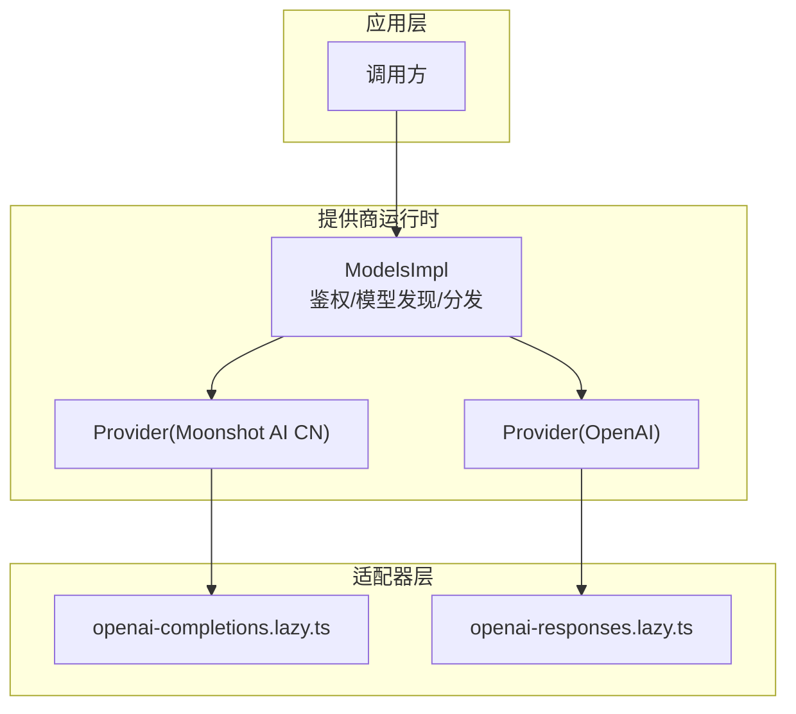
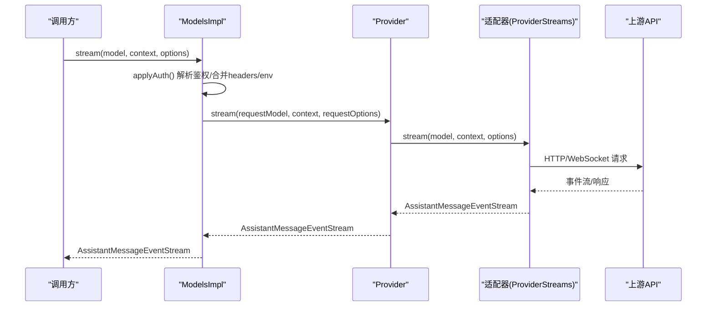
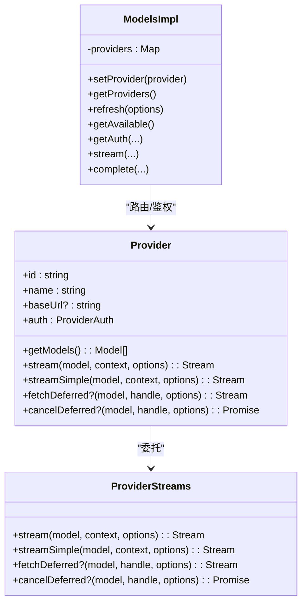
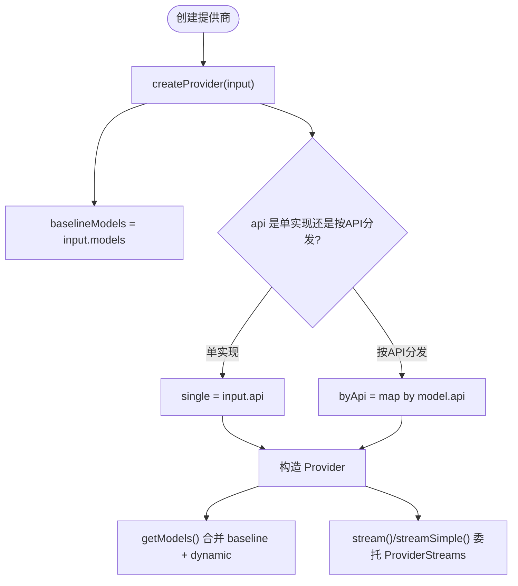
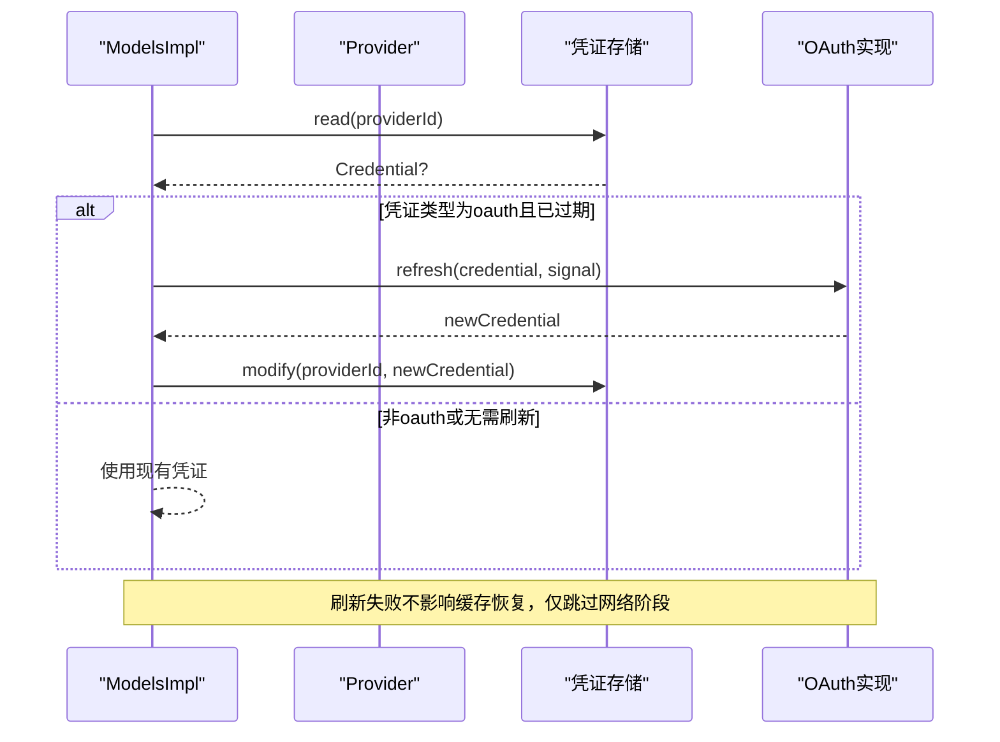
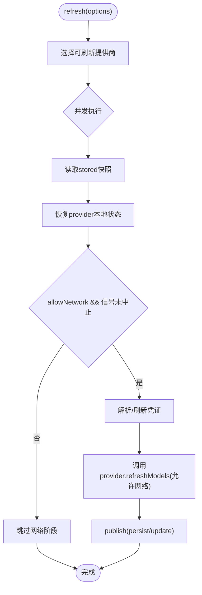
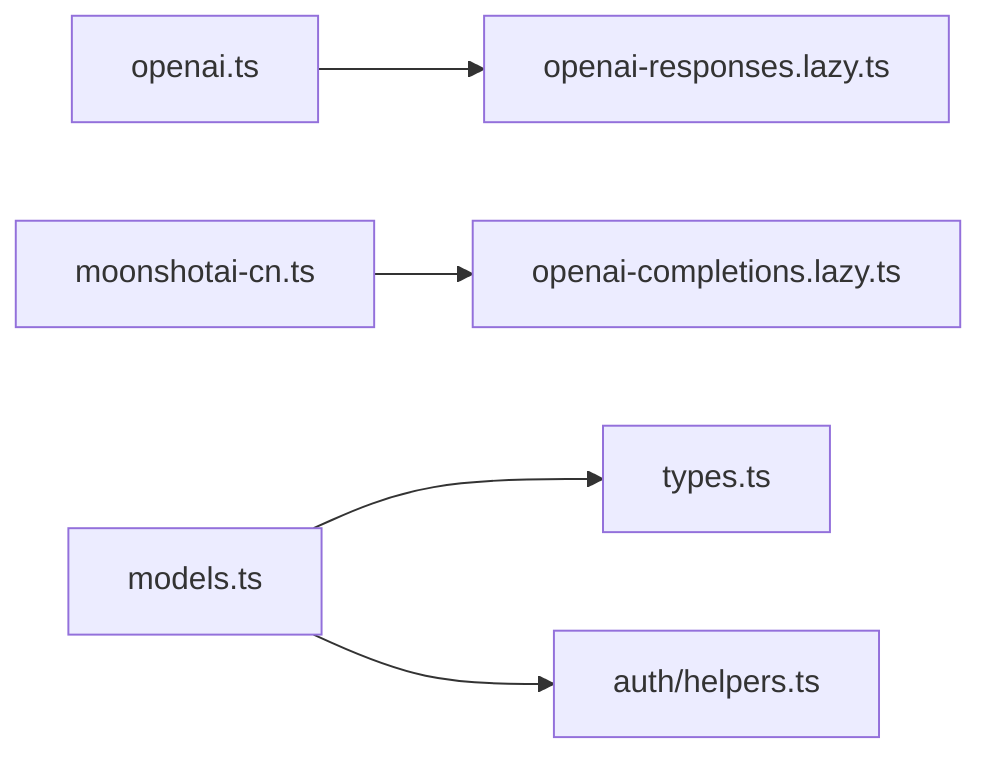

# 提供商集成机制

<cite>
**本文引用的文件**
- [models.ts](file://packages/ai/src/models.ts)
- [types.ts](file://packages/ai/src/types.ts)
- [helpers.ts](file://packages/ai/src/auth/helpers.ts)
- [openai.ts](file://packages/ai/src/providers/openai.ts)
- [moonshotai-cn.ts](file://packages/ai/src/providers/moonshotai-cn.ts)
- [openai-completions.lazy.ts](file://packages/ai/src/api/openai-completions.lazy.ts)
</cite>

## 目录
1. [简介](#简介)
2. [项目结构](#项目结构)
3. [核心组件](#核心组件)
4. [架构总览](#架构总览)
5. [详细组件分析](#详细组件分析)
6. [依赖关系分析](#依赖关系分析)
7. [性能考虑](#性能考虑)
8. [故障排查指南](#故障排查指南)
9. [结论](#结论)
10. [附录：新提供商集成指南](#附录新提供商集成指南)

## 简介
本文件系统性说明“提供商集成机制”，围绕适配器模式实现统一接口、提供商抽象与协议转换；阐述 API 兼容性处理（版本管理、特性检测、降级策略）；介绍认证机制（API Key 管理、OAuth 流程、令牌刷新）；说明模型发现与管理（模型列表获取、能力检测、性能监控）；并提供新提供商集成指南（适配器开发、测试用例、配置示例），以及提供商选择策略、负载均衡与故障转移机制。

## 项目结构
本项目在 packages/ai 中提供统一的提供商接入层，核心由以下部分组成：
- 提供商抽象与运行时调度：Provider、Models 接口及实现，负责鉴权、模型发现、流式调用分发。
- 适配器（API 实现）：各提供商的协议适配模块，如 OpenAI Completions/Responses、Anthropic Messages 等，通过 ProviderStreams 统一暴露 stream/streamSimple/fetchDeferred/cancelDeferred。
- 认证工具：envApiKeyAuth 用于标准 API Key 解析与登录；lazyOAuth 延迟加载 OAuth 实现以减小包体积。
- 提供商工厂：每个提供商通过 createProvider 组装 id/name/baseUrl/auth/models/api，形成可插拔的 Provider 实例。
- 类型与选项：KnownApi、OpenAICompletionsCompat/OpenAIResponsesCompat/AnthropicMessagesCompat 等描述兼容性与特性开关。

图表来源
- [models.ts:254-737](file://packages/ai/src/models.ts#L254-L737)
- [openai.ts:1-16](file://packages/ai/src/providers/openai.ts#L1-L16)
- [moonshotai-cn.ts:1-15](file://packages/ai/src/providers/moonshotai-cn.ts#L1-L15)
- [openai-completions.lazy.ts:1-5](file://packages/ai/src/api/openai-completions.lazy.ts#L1-L5)

章节来源
- [models.ts:254-737](file://packages/ai/src/models.ts#L254-L737)
- [types.ts:17-76](file://packages/ai/src/types.ts#L17-L76)

## 核心组件
- Provider 接口：定义 id/name/baseUrl/auth/getModels/stream/streamSimple/fetchDeferred/cancelDeferred 等能力，是提供商的统一抽象。
- Models 接口与实现：集中管理提供商集合、鉴权解析、模型发现与刷新、请求头合并、流式调用委派到具体 Provider。
- ProviderStreams：适配器统一契约，stream/streamSimple 为必需，fetchDeferred/cancelDeferred 可选。
- 认证助手：envApiKeyAuth 支持从存储凭证或环境变量解析 API Key，并支持交互式登录；lazyOAuth 延迟加载 OAuth 实现。
- 兼容性配置：OpenAICompletionsCompat/OpenAIResponsesCompat/AnthropicMessagesCompat 等用于特性检测与行为切换。

章节来源
- [models.ts:97-149](file://packages/ai/src/models.ts#L97-L149)
- [models.ts:156-223](file://packages/ai/src/models.ts#L156-L223)
- [types.ts:268-277](file://packages/ai/src/types.ts#L268-L277)
- [helpers.ts:1-60](file://packages/ai/src/auth/helpers.ts#L1-L60)
- [types.ts:545-625](file://packages/ai/src/types.ts#L545-L625)

## 架构总览
下图展示从调用方到提供商适配器的完整链路：ModelsImpl 负责鉴权与模型路由，Provider 持有具体适配器实现，适配器将请求转换为上游协议并返回事件流。

图表来源
- [models.ts:667-688](file://packages/ai/src/models.ts#L667-L688)
- [types.ts:268-277](file://packages/ai/src/types.ts#L268-L277)

## 详细组件分析

### 适配器模式与统一接口设计
- 统一入口：Provider.stream/streamSimple 作为统一入口，内部委托给 ProviderStreams 的具体实现。
- 多 API 支持：createProvider 支持单一 ProviderStreams 或按 model.api 分发的映射，便于同一提供商暴露多种协议。
- 懒加载适配器：通过 lazyApi 包装导入，避免未使用代码进入打包产物。

图表来源
- [models.ts:97-149](file://packages/ai/src/models.ts#L97-L149)
- [models.ts:254-737](file://packages/ai/src/models.ts#L254-L737)
- [types.ts:268-277](file://packages/ai/src/types.ts#L268-L277)

章节来源
- [models.ts:739-800](file://packages/ai/src/models.ts#L739-L800)
- [openai-completions.lazy.ts:1-5](file://packages/ai/src/api/openai-completions.lazy.ts#L1-L5)

### 提供商抽象与协议转换
- 提供商工厂：createProvider 接收 id/name/baseUrl/auth/models/api，生成 Provider。
- 协议转换：ProviderStreams 将通用上下文与选项转换为上游特定协议（例如 OpenAI Completions/Responses）。
- 动态模型覆盖：Provider 可维护静态 baseline 模型与动态 overlay，refreshModels 更新后通过 publish 持久化与同步内存状态。

图表来源
- [models.ts:739-800](file://packages/ai/src/models.ts#L739-L800)

章节来源
- [models.ts:739-800](file://packages/ai/src/models.ts#L739-L800)

### API 兼容性处理（版本管理、特性检测、降级策略）
- 特性开关：OpenAICompletionsCompat/OpenAIResponsesCompat/AnthropicMessagesCompat 提供布尔/枚举字段控制行为，如 supportsStore、supportsDeveloperRole、supportsUsageInStreaming、supportsFinishReason、thinkingFormat 等。
- 自动检测与覆盖：部分特性默认基于 URL 或模型元数据自动推断，可通过配置显式覆盖。
- 降级策略：当某特性不可用时，适配器回退到兼容路径（例如不支持 finish_reason 时根据流结束推断 stop/toolUse；不支持严格 JSON Schema 工具时回退为普通函数工具）。

章节来源
- [types.ts:545-625](file://packages/ai/src/types.ts#L545-L625)

### 认证机制（API Key 管理、OAuth 流程、令牌刷新）
- API Key 管理：envApiKeyAuth 优先使用存储凭证，其次按顺序读取环境变量，支持交互式登录写入凭证。
- OAuth 流程：lazyOAuth 延迟加载 OAuth 实现，首次 login/refresh/toAuth 时才引入，减少包体；ModelsImpl.refresh 中针对 OAuth 凭证进行过期检查与刷新。
- 令牌刷新：ModelsImpl.resolveRefreshCredential 在刷新模型前尝试刷新 OAuth 令牌，失败则跳过网络阶段但保留缓存状态。

图表来源
- [models.ts:448-475](file://packages/ai/src/models.ts#L448-L475)
- [helpers.ts:1-60](file://packages/ai/src/auth/helpers.ts#L1-L60)

章节来源
- [models.ts:448-475](file://packages/ai/src/models.ts#L448-L475)
- [helpers.ts:1-60](file://packages/ai/src/auth/helpers.ts#L1-L60)

### 模型发现与管理（模型列表获取、能力检测、性能监控）
- 模型列表：Provider.getModels() 返回静态 baseline 与动态 overlay 的合并结果；ModelsImpl.getModels() 聚合所有提供商的模型。
- 能力过滤：Provider.filterModels(models, credential) 可按凭证能力进一步筛选可用模型。
- 刷新与持久化：refreshModels(context) 支持离线恢复 stored 快照并通过 context.publish 持久化与同步内存；ModelsImpl.refresh 并发刷新多个提供商，错误收集不抛异常。
- 性能监控：通过 onPayload/onResponse 回调与 Usage 统计（input/output/cacheRead/cacheWrite/reasoning/totalTokens/cost）进行观测与计费。

图表来源
- [models.ts:386-446](file://packages/ai/src/models.ts#L386-L446)
- [models.ts:338-384](file://packages/ai/src/models.ts#L338-L384)

章节来源
- [models.ts:294-318](file://packages/ai/src/models.ts#L294-L318)
- [models.ts:338-446](file://packages/ai/src/models.ts#L338-L446)
- [types.ts:370-391](file://packages/ai/src/types.ts#L370-L391)

### 提供商选择策略、负载均衡与故障转移
- 提供商选择：上层可通过 getAvailable() 获取已配置鉴权的模型集合，结合 filterModels 做能力裁剪；也可通过 Models.refresh(providers=[]) 限定刷新范围。
- 负载均衡：当前仓库未内置跨提供商的负载分配器；可在上层根据 Usage.cost、延迟、吞吐等指标选择不同 Provider 的模型。
- 故障转移：单个 Provider 刷新失败会被记录到 errors Map 而不中断其他 Provider；对下游请求，若某 Provider 无对应 API 实现会返回流错误，上层可据此切换到其他 Provider。

章节来源
- [models.ts:522-542](file://packages/ai/src/models.ts#L522-L542)
- [models.ts:781-792](file://packages/ai/src/models.ts#L781-L792)

## 依赖关系分析
- 提供商与适配器：openaiProvider 使用 openAIResponsesApi；moonshotaiCnProvider 使用 openAICompletionsApi，二者均通过 createProvider 装配。
- 运行时依赖：ModelsImpl 依赖 ProviderAuth、ProviderStreams、ModelsStore、CredentialStore 等基础设施。
- 类型依赖：KnownApi/KnownProvider 约束了支持的 API 与提供商集合，确保类型安全。

图表来源
- [openai.ts:1-16](file://packages/ai/src/providers/openai.ts#L1-L16)
- [moonshotai-cn.ts:1-15](file://packages/ai/src/providers/moonshotai-cn.ts#L1-L15)
- [models.ts:254-737](file://packages/ai/src/models.ts#L254-L737)
- [types.ts:17-76](file://packages/ai/src/types.ts#L17-L76)
- [helpers.ts:1-60](file://packages/ai/src/auth/helpers.ts#L1-L60)

章节来源
- [openai.ts:1-16](file://packages/ai/src/providers/openai.ts#L1-L16)
- [moonshotai-cn.ts:1-15](file://packages/ai/src/providers/moonshotai-cn.ts#L1-L15)
- [models.ts:254-737](file://packages/ai/src/models.ts#L254-L737)
- [types.ts:17-76](file://packages/ai/src/types.ts#L17-L76)

## 性能考虑
- 懒加载：适配器与 OAuth 实现采用懒加载，减少初始包体与启动开销。
- 并发刷新：ModelsImpl.refresh 并发刷新多个提供商，提升模型发现效率。
- 流式传输：统一事件流协议降低中间层开销，支持 SSE/WebSocket 等多种传输。
- 成本与用量：Usage 包含 token 与费用明细，可用于节流与预算控制。

[本节为通用指导，不直接分析具体文件]

## 故障排查指南
- 未知提供商：当 getAuth/requireProvider 找不到提供商时会抛出 ModelsError，需检查 setProvider 是否正确注册。
- 未配置鉴权：applyAuth 在未解析到鉴权信息时抛出 ModelsError，需确认 env 变量或凭证存储是否设置。
- 无 API 实现：Provider 对 model.api 无实现时会返回流错误，需检查 createProvider 的 api 映射是否完整。
- 刷新失败：refresh 返回 errors Map，需检查网络与凭证刷新逻辑。

章节来源
- [models.ts:544-563](file://packages/ai/src/models.ts#L544-L563)
- [models.ts:628-665](file://packages/ai/src/models.ts#L628-L665)
- [models.ts:781-792](file://packages/ai/src/models.ts#L781-L792)
- [models.ts:386-446](file://packages/ai/src/models.ts#L386-L446)

## 结论
该集成机制通过 Provider/ProviderStreams 的适配器模式实现了多提供商的统一接入，借助 ModelsImpl 完成鉴权、模型发现与请求分发；通过兼容性配置实现细粒度的特性检测与降级；通过 envApiKeyAuth 与 lazyOAuth 提供灵活的认证方案；通过 refreshModels 与 publish 实现模型的动态管理与持久化。整体架构清晰、可扩展性强，适合持续扩展新的提供商与协议。

[本节为总结性内容，不直接分析具体文件]

## 附录：新提供商集成指南

### 步骤概览
- 定义模型清单：在 providers/<your>.models.ts 中声明模型元数据（id/name/api/provider/baseUrl 等）。
- 编写适配器：在 src/api/<your>.ts 实现 ProviderStreams（至少 stream/streamSimple），按需实现 fetchDeferred/cancelDeferred。
- 创建提供商工厂：在 providers/<your>.ts 中使用 createProvider 装配 id/name/baseUrl/auth/models/api。
- 注册提供商：在应用初始化时将 Provider 注入 ModelsImpl（setProvider）。
- 配置鉴权：使用 envApiKeyAuth 或 lazyOAuth 实现鉴权解析与登录。
- 配置兼容性：在模型或适配器中设置 OpenAICompletionsCompat/OpenAIResponsesCompat/AnthropicMessagesCompat 等字段。

### 最小实现参考
- 提供商工厂示例：参见 openaiProvider/moonshotaiCnProvider 的结构与参数。
- 适配器懒加载：参见 openAICompletionsApi 的 lazyApi 包装方式。
- 鉴权示例：参见 envApiKeyAuth 的使用方式。

章节来源
- [openai.ts:1-16](file://packages/ai/src/providers/openai.ts#L1-L16)
- [moonshotai-cn.ts:1-15](file://packages/ai/src/providers/moonshotai-cn.ts#L1-L15)
- [openai-completions.lazy.ts:1-5](file://packages/ai/src/api/openai-completions.lazy.ts#L1-L5)
- [helpers.ts:1-60](file://packages/ai/src/auth/helpers.ts#L1-L60)
- [models.ts:739-800](file://packages/ai/src/models.ts#L739-L800)

### 测试建议
- 单元测试：验证 Provider.getModels 返回预期模型；鉴权解析在不同环境下的优先级；适配器 stream/streamSimple 的事件序列。
- 集成测试：端到端调用上游 API，校验 Usage 与 cost；模拟网络错误与超时，验证错误编码与重试策略。
- 兼容性测试：开启/关闭各项兼容性开关，验证行为是否符合预期（如 finish_reason、thinkingFormat、strict tools）。

[本节为通用指导，不直接分析具体文件]

### 配置示例要点
- baseUrl：指向提供商 API 根地址。
- auth：apiKey 或 oauth 配置，必要时提供 login/refresh/toAuth。
- models：静态模型清单；如需动态列表，实现 refreshModels 并通过 context.publish 持久化。
- api：单一 ProviderStreams 或按 model.api 分发的映射。
- 兼容性：根据上游能力设置 OpenAICompletionsCompat/OpenAIResponsesCompat/AnthropicMessagesCompat。

章节来源
- [models.ts:739-800](file://packages/ai/src/models.ts#L739-L800)
- [types.ts:545-625](file://packages/ai/src/types.ts#L545-L625)