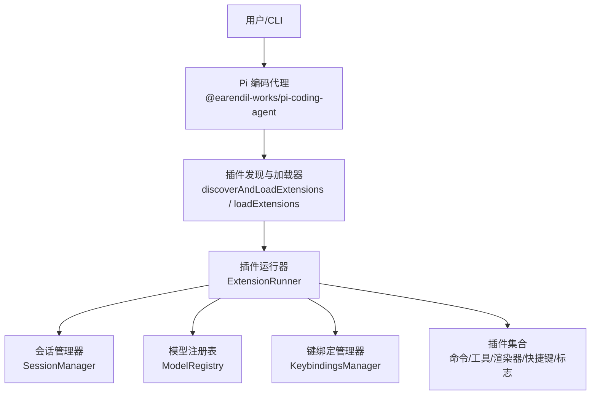
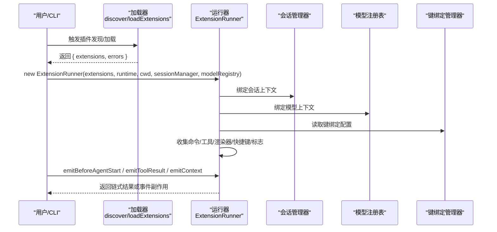
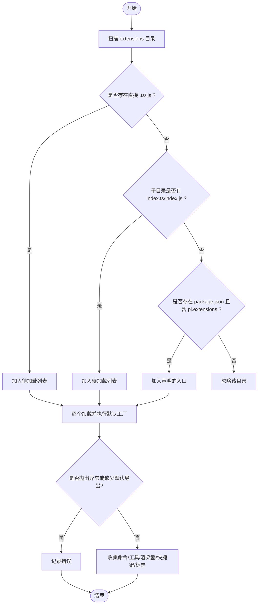
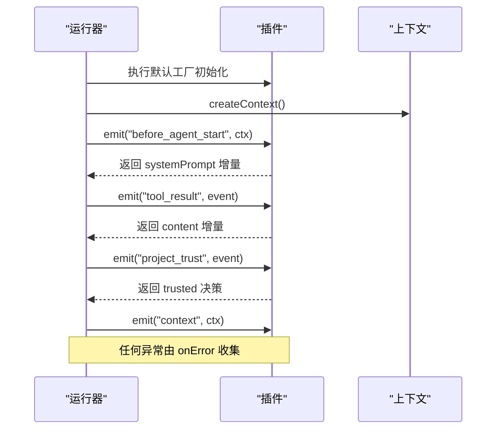
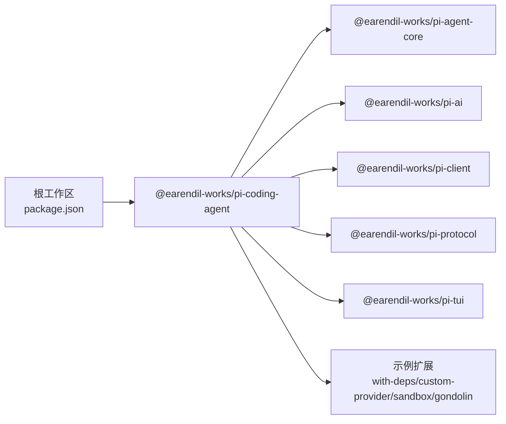

# 插件系统架构

<cite>
**本文引用的文件**
- [README.md](file://README.md)
- [package.json](file://package.json)
- [coding-agent/package.json](file://packages/coding-agent/package.json)
- [extensions-discovery.test.ts](file://packages/coding-agent/test/extensions-discovery.test.ts)
- [extensions-runner.test.ts](file://packages/coding-agent/test/extensions-runner.test.ts)
</cite>

## 目录
1. [简介](#简介)
2. [项目结构](#项目结构)
3. [核心组件](#核心组件)
4. [架构总览](#架构总览)
5. [详细组件分析](#详细组件分析)
6. [依赖关系分析](#依赖关系分析)
7. [性能考虑](#性能考虑)
8. [故障排除指南](#故障排除指南)
9. [结论](#结论)
10. [附录：开发规范与最佳实践](#附录开发规范与最佳实践)

## 简介
本文件面向 Pi Agent Harness 的插件（扩展）系统，聚焦以下目标：
- 动态加载机制：模块发现、依赖解析、生命周期管理
- 注册与卸载流程：接口验证、状态同步、资源清理
- 插件间通信：事件总线、消息传递、状态共享
- 安全沙箱：权限控制、资源限制、隔离机制
- 开发规范、最佳实践与调试技巧
- 完整示例与排错指引

该插件系统以 coding-agent 为核心宿主，通过“发现并加载”策略扫描 extensions 目录或显式路径，执行每个插件的默认工厂函数，收集命令、工具、渲染器、快捷键、标志位等能力，并在运行时统一编排。

**章节来源**
- [README.md:13-46](file://README.md#L13-L46)
- [package.json:5-13](file://package.json#L5-L13)
- [coding-agent/package.json:6-11](file://packages/coding-agent/package.json#L6-L11)

## 项目结构
- monorepo 根目录通过 workspaces 聚合多个包，其中 @earendil-works/pi-coding-agent 提供 CLI 与插件运行环境
- 插件入口约定在 .pi/extensions 下自动发现，或通过 package.json 的 pi.extensions 声明；也支持直接传入显式路径
- 测试覆盖了插件发现、加载、冲突检测、错误处理、上下文绑定、事件分发等关键行为

**图示来源**
- [extensions-discovery.test.ts:6-7](file://packages/coding-agent/test/extensions-discovery.test.ts#L6-L7)
- [extensions-runner.test.ts:11-12](file://packages/coding-agent/test/extensions-runner.test.ts#L11-L12)

**章节来源**
- [package.json:5-13](file://package.json#L5-L13)
- [coding-agent/package.json:6-11](file://packages/coding-agent/package.json#L6-L11)
- [extensions-discovery.test.ts:43-160](file://packages/coding-agent/test/extensions-discovery.test.ts#L43-L160)

## 核心组件
- 插件发现与加载器
  - discoverAndLoadExtensions：扫描 extensions 目录与子目录，识别 index.ts/index.js 或 package.json 中 pi.extensions 指定的入口，返回已加载插件与错误列表
  - loadExtensions：仅加载显式指定路径，跳过自动发现
- 插件运行器 ExtensionRunner
  - 统一管理插件生命周期：创建上下文、绑定核心能力、收集命令/工具/渲染器/快捷键/标志
  - 事件分发：before_agent_start、tool_result、project_trust、context 等
  - 冲突检测：快捷键冲突、工具名冲突、命令调用名重复时的后缀化
  - 错误上报：onError 回调收集异常信息
- 上下文与 UI 模式
  - 通过 bindCore 注入 actions 与 contextActions，暴露当前 abort signal、项目信任状态、scopedModels、RPC/TUI 模式等
- 配置与元数据
  - 插件可通过 package.json 的 pi.extensions 声明多入口，支持 ~ 相对包根路径

**章节来源**
- [extensions-discovery.test.ts:43-160](file://packages/coding-agent/test/extensions-discovery.test.ts#L43-L160)
- [extensions-discovery.test.ts:319-397](file://packages/coding-agent/test/extensions-discovery.test.ts#L319-L397)
- [extensions-runner.test.ts:105-118](file://packages/coding-agent/test/extensions-runner.test.ts#L105-L118)
- [extensions-runner.test.ts:121-158](file://packages/coding-agent/test/extensions-runner.test.ts#L121-L158)
- [extensions-runner.test.ts:160-366](file://packages/coding-agent/test/extensions-runner.test.ts#L160-L366)
- [extensions-runner.test.ts:368-501](file://packages/coding-agent/test/extensions-runner.test.ts#L368-L501)
- [extensions-runner.test.ts:503-564](file://packages/coding-agent/test/extensions-runner.test.ts#L503-L564)
- [extensions-runner.test.ts:567-593](file://packages/coding-agent/test/extensions-runner.test.ts#L567-L593)
- [extensions-runner.test.ts:716-757](file://packages/coding-agent/test/extensions-runner.test.ts#L716-L757)
- [extensions-runner.test.ts:760-800](file://packages/coding-agent/test/extensions-runner.test.ts#L760-L800)

## 架构总览
下图展示了从发现到运行的端到端流程，以及插件与宿主之间的交互点。

**图示来源**
- [extensions-discovery.test.ts:6-7](file://packages/coding-agent/test/extensions-discovery.test.ts#L6-L7)
- [extensions-runner.test.ts:11-12](file://packages/coding-agent/test/extensions-runner.test.ts#L11-L12)
- [extensions-runner.test.ts:105-118](file://packages/coding-agent/test/extensions-runner.test.ts#L105-L118)
- [extensions-runner.test.ts:716-757](file://packages/coding-agent/test/extensions-runner.test.ts#L716-L757)
- [extensions-runner.test.ts:760-800](file://packages/coding-agent/test/extensions-runner.test.ts#L760-L800)

## 详细组件分析

### 模块发现与加载
- 发现规则
  - 直接 .ts/.js 文件位于 extensions/ 下会被识别
  - 子目录若包含 index.ts/index.js 也会被识别，优先 index.ts
  - 子目录若包含 package.json 且存在 pi.extensions 字段，则按声明路径加载
  - 支持 ~ 前缀表示相对于包根的路径
  - 不递归超过一层
- 加载行为
  - 每个插件必须导出一个默认工厂函数，否则视为无效
  - 加载失败会记录错误，不影响其他插件
  - 可显式传入路径跳过自动发现

**图示来源**
- [extensions-discovery.test.ts:43-160](file://packages/coding-agent/test/extensions-discovery.test.ts#L43-L160)
- [extensions-discovery.test.ts:319-397](file://packages/coding-agent/test/extensions-discovery.test.ts#L319-L397)
- [extensions-discovery.test.ts:399-427](file://packages/coding-agent/test/extensions-discovery.test.ts#L399-L427)
- [extensions-discovery.test.ts:503-531](file://packages/coding-agent/test/extensions-discovery.test.ts#L503-L531)

**章节来源**
- [extensions-discovery.test.ts:43-160](file://packages/coding-agent/test/extensions-discovery.test.ts#L43-L160)
- [extensions-discovery.test.ts:319-397](file://packages/coding-agent/test/extensions-discovery.test.ts#L319-L397)
- [extensions-discovery.test.ts:399-427](file://packages/coding-agent/test/extensions-discovery.test.ts#L399-L427)
- [extensions-discovery.test.ts:503-531](file://packages/coding-agent/test/extensions-discovery.test.ts#L503-L531)

### 依赖解析
- 插件可从自身 node_modules 解析依赖
- 测试覆盖加载带有依赖的示例插件并成功注册其工具

**章节来源**
- [extensions-discovery.test.ts:361-372](file://packages/coding-agent/test/extensions-discovery.test.ts#L361-L372)

### 生命周期管理
- 初始化阶段：加载插件并执行默认工厂，收集能力
- 上下文阶段：createContext 暴露 abort signal、mode、hasUI、isProjectTrusted、scopedModels 等
- 事件阶段：
  - before_agent_start：链式拼接 systemPrompt
  - tool_result：链式修改内容
  - project_trust：收集 trusted 决策
  - context：通用上下文事件
- 错误处理：onError 回调收集异常

**图示来源**
- [extensions-runner.test.ts:105-118](file://packages/coding-agent/test/extensions-runner.test.ts#L105-L118)
- [extensions-runner.test.ts:121-158](file://packages/coding-agent/test/extensions-runner.test.ts#L121-L158)
- [extensions-runner.test.ts:503-564](file://packages/coding-agent/test/extensions-runner.test.ts#L503-L564)
- [extensions-runner.test.ts:567-593](file://packages/coding-agent/test/extensions-runner.test.ts#L567-L593)
- [extensions-runner.test.ts:716-757](file://packages/coding-agent/test/extensions-runner.test.ts#L716-L757)
- [extensions-runner.test.ts:760-800](file://packages/coding-agent/test/extensions-runner.test.ts#L760-L800)

**章节来源**
- [extensions-runner.test.ts:105-118](file://packages/coding-agent/test/extensions-runner.test.ts#L105-L118)
- [extensions-runner.test.ts:121-158](file://packages/coding-agent/test/extensions-runner.test.ts#L121-L158)
- [extensions-runner.test.ts:503-564](file://packages/coding-agent/test/extensions-runner.test.ts#L503-L564)
- [extensions-runner.test.ts:567-593](file://packages/coding-agent/test/extensions-runner.test.ts#L567-L593)
- [extensions-runner.test.ts:716-757](file://packages/coding-agent/test/extensions-runner.test.ts#L716-L757)
- [extensions-runner.test.ts:760-800](file://packages/coding-agent/test/extensions-runner.test.ts#L760-L800)

### 插件注册与卸载
- 注册
  - 通过 pi.registerCommand、registerTool、registerMessageRenderer、registerEntryRenderer、registerShortcut、registerFlag 等方式在工厂中声明能力
  - 运行器统一收集并去重/冲突处理
- 卸载
  - 代码库未实现热卸载；卸载通常通过重启进程或重新构建运行器实例完成
  - 资源清理需在插件内部自行实现（如关闭连接、释放句柄），并在退出时调用

**章节来源**
- [extensions-discovery.test.ts:319-397](file://packages/coding-agent/test/extensions-discovery.test.ts#L319-L397)
- [extensions-runner.test.ts:368-501](file://packages/coding-agent/test/extensions-runner.test.ts#L368-L501)

### 插件间通信
- 事件总线
  - 通过 on(event, handler) 订阅宿主事件，如 agent_start、tool_call、agent_end、before_agent_start、tool_result、project_trust、context 等
- 消息传递
  - 通过 actions.sendMessage、sendUserMessage、appendEntry 等向会话写入消息
- 状态共享
  - 通过 flags 共享标志值
  - 通过 scopedModels 共享模型选择上下文
  - 通过 getActiveTools/getAllTools/setActiveTools/refreshTools 管理工具集

**章节来源**
- [extensions-discovery.test.ts:448-465](file://packages/coding-agent/test/extensions-discovery.test.ts#L448-L465)
- [extensions-runner.test.ts:74-89](file://packages/coding-agent/test/extensions-runner.test.ts#L74-L89)
- [extensions-runner.test.ts:105-118](file://packages/coding-agent/test/extensions-runner.test.ts#L105-L118)
- [extensions-runner.test.ts:645-713](file://packages/coding-agent/test/extensions-runner.test.ts#L645-L713)

### 安全沙箱
- 权限与隔离
  - 默认以启动进程的权限运行，无内置文件系统/进程/网络/凭据限制
  - 推荐容器化或沙箱化部署：Gondolin 扩展、Docker、OpenShell 等
- 资源限制
  - 建议在宿主层结合操作系统或容器策略限制 CPU/内存/IO
- 隔离机制
  - 插件之间通过事件与 API 协作，避免直接共享全局状态
  - 使用 scopedModels 与 flags 进行受控的状态共享

**章节来源**
- [README.md:38-46](file://README.md#L38-L46)

## 依赖关系分析
- 工作区与工作流
  - 根 package.json 定义了 workspaces，将 coding-agent 与其示例扩展纳入同一工作区，便于开发与联调
- 插件依赖
  - 插件可从自身 node_modules 解析依赖，示例 with-deps 展示了独立依赖的使用
- 宿主依赖
  - coding-agent 依赖 agent-core、ai、client、protocol、tui 等包，提供运行时能力

**图示来源**
- [package.json:5-13](file://package.json#L5-L13)
- [coding-agent/package.json:45-66](file://packages/coding-agent/package.json#L45-L66)

**章节来源**
- [package.json:5-13](file://package.json#L5-L13)
- [coding-agent/package.json:45-66](file://packages/coding-agent/package.json#L45-L66)

## 性能考虑
- 插件发现与加载
  - 仅扫描一层目录，避免深层递归带来的 I/O 开销
  - 显式路径加载可跳过自动发现，减少不必要的扫描
- 事件与链式处理
  - before_agent_start 与 tool_result 采用链式处理，注意避免在处理器中进行重型计算
- 冲突检测
  - 快捷键与工具名冲突会在加载阶段快速失败并告警，有助于尽早定位问题

[本节为通用指导，无需具体文件引用]

## 故障排除指南
- 常见错误
  - 插件缺少默认导出：加载失败并记录错误
  - 初始化抛错：记录错误，不影响其他插件
  - 快捷键冲突：警告并阻止冲突键绑定
  - 工具名冲突：保留首个定义
  - 命令调用名重复：自动后缀化生成唯一调用名
- 调试建议
  - 使用 onError 回调收集异常堆栈
  - 通过 getRegisteredCommands/getAllRegisteredTools 检查已注册能力
  - 通过 getShortcuts 检查最终快捷键映射
  - 通过 setFlagValue 设置标志并观察行为变化
  - 在 before_agent_start 与 tool_result 中打印中间结果，确认链式处理顺序

**章节来源**
- [extensions-discovery.test.ts:399-427](file://packages/coding-agent/test/extensions-discovery.test.ts#L399-L427)
- [extensions-runner.test.ts:160-366](file://packages/coding-agent/test/extensions-runner.test.ts#L160-L366)
- [extensions-runner.test.ts:368-501](file://packages/coding-agent/test/extensions-runner.test.ts#L368-L501)
- [extensions-runner.test.ts:567-593](file://packages/coding-agent/test/extensions-runner.test.ts#L567-L593)
- [extensions-runner.test.ts:645-713](file://packages/coding-agent/test/extensions-runner.test.ts#L645-L713)

## 结论
Pi 的插件系统以“发现+加载+运行器”为核心，提供了完善的插件能力注册、事件驱动通信、上下文绑定与冲突检测机制。通过容器化与沙箱化部署，可在保持灵活性的同时满足安全边界需求。开发者应遵循最小权限原则，合理使用事件与 API，避免在处理器中进行重型计算，并通过 onError 与诊断方法快速定位问题。

[本节为总结性内容，无需具体文件引用]

## 附录：开发规范与最佳实践
- 插件入口
  - 导出默认工厂函数，接收宿主提供的 pi 对象
  - 在工厂中注册命令、工具、渲染器、快捷键、标志
- 模块组织
  - 使用 index.ts/index.js 作为子目录入口，或在 package.json 的 pi.extensions 中声明多入口
  - 使用 ~ 前缀指向包根路径
- 事件使用
  - 仅在必要处订阅事件，避免过度耦合
  - 对 before_agent_start 与 tool_result 的链式处理保持幂等与轻量
- 状态共享
  - 使用 flags 与 scopedModels 进行受控共享
  - 避免跨插件直接读写全局变量
- 安全与隔离
  - 默认无权限限制，建议使用容器或沙箱部署
  - 谨慎请求外部资源，做好超时与重试策略
- 调试技巧
  - 使用 onError 捕获异常
  - 通过运行器的查询方法检查已注册能力
  - 在 CI 中使用测试用例模拟插件加载与事件分发

[本节为通用指导，无需具体文件引用]