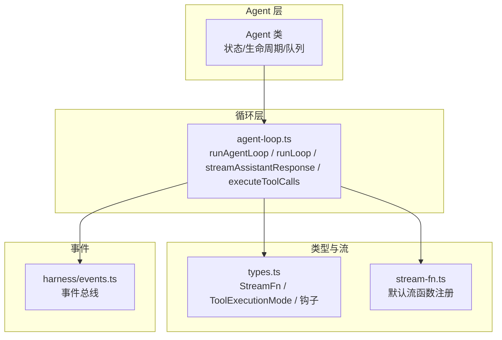
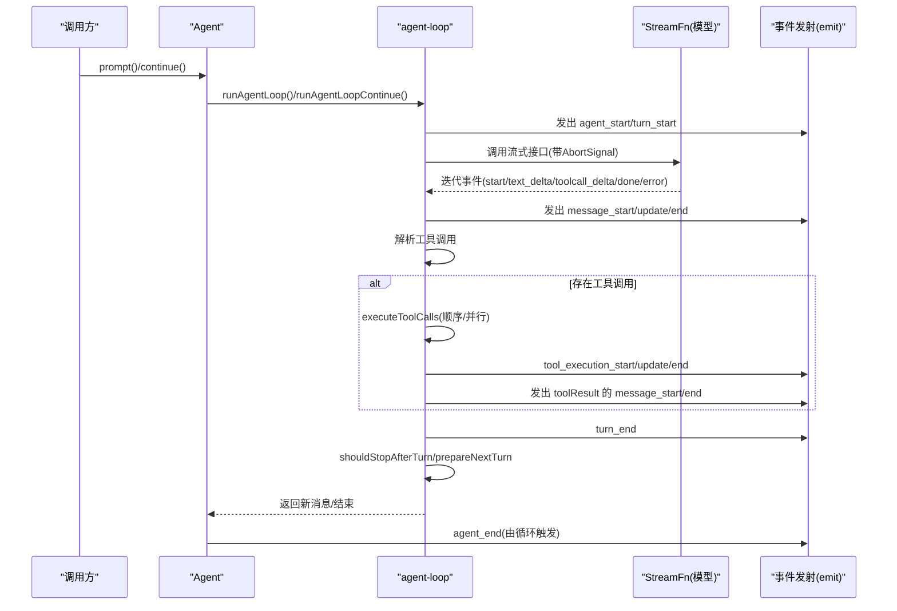
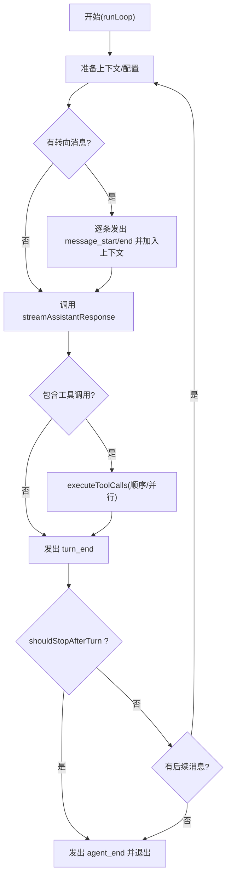
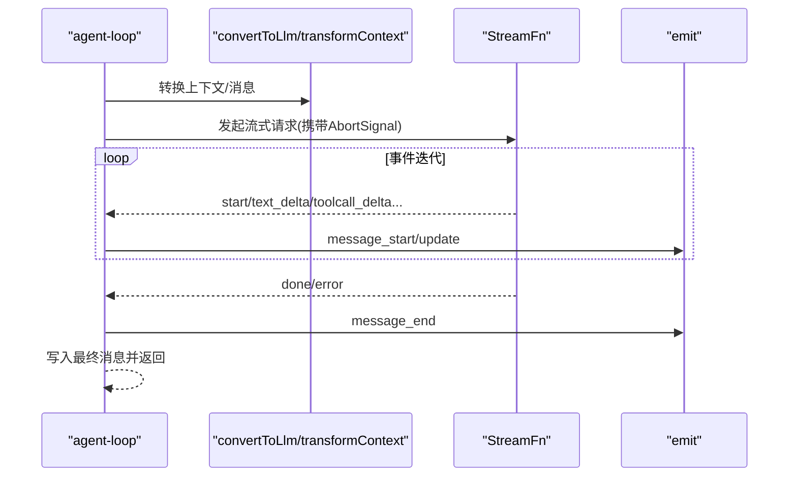
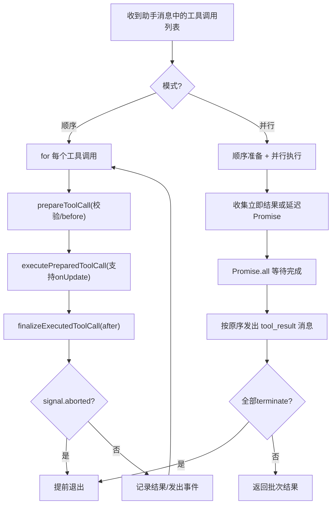
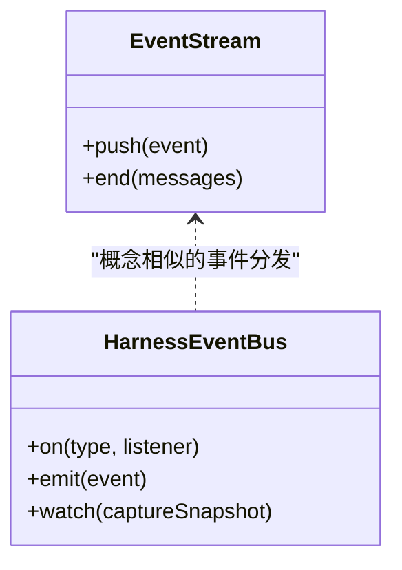
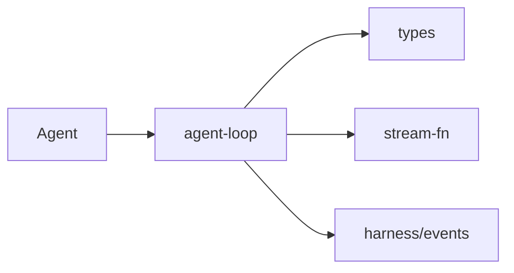

# 异步处理模式

<cite>
**本文引用的文件**
- [agent-loop.ts](file://packages/agent/src/agent-loop.ts)
- [agent.ts](file://packages/agent/src/agent.ts)
- [types.ts](file://packages/agent/src/types.ts)
- [stream-fn.ts](file://packages/agent/src/stream-fn.ts)
- [events.ts](file://packages/agent/src/harness/events.ts)
</cite>

## 目录
1. [简介](#简介)
2. [项目结构](#项目结构)
3. [核心组件](#核心组件)
4. [架构总览](#架构总览)
5. [详细组件分析](#详细组件分析)
6. [依赖关系分析](#依赖关系分析)
7. [性能考虑](#性能考虑)
8. [故障排查指南](#故障排查指南)
9. [结论](#结论)
10. [附录](#附录)

## 简介
本文件围绕 AgentLoop 的异步控制流，系统阐述 Promise 链式调用、事件循环机制与流式数据处理。重点解析 runAgentLoop、streamAssistantResponse、executeToolCalls 等核心函数的协作方式，说明 EventStream 的事件发射、流式响应与背压处理策略，并总结并发控制（并行、串行、条件终止）与错误传播机制。文末提供可复用的异步编程模式与最佳实践建议。

## 项目结构
该仓库采用按功能分层的组织方式：
- 低层 Agent 循环与工具执行位于 agent-loop.ts，负责消息流转、LLM 流式调用、工具调用的顺序/并行执行与事件发射。
- 高层 Agent 类封装状态、生命周期、队列注入（steering/follow-up）、事件订阅与运行期控制（abort/waitForIdle）。
- 类型定义集中在 types.ts，统一 StreamFn、工具执行模式、上下文转换、钩子函数等契约。
- stream-fn.ts 提供默认流函数注册与获取，解耦宿主与模型提供方。
- harness/events.ts 提供轻量事件总线，用于测试/编排场景的事件分发与观察。

**图示来源**
- [agent.ts:173-238](file://packages/agent/src/agent.ts#L173-L238)
- [agent-loop.ts:95-143](file://packages/agent/src/agent-loop.ts#L95-L143)
- [types.ts:18-32](file://packages/agent/src/types.ts#L18-L32)
- [stream-fn.ts:11-20](file://packages/agent/src/stream-fn.ts#L11-L20)
- [events.ts:37-73](file://packages/agent/src/harness/events.ts#L37-L73)

**章节来源**
- [agent.ts:173-238](file://packages/agent/src/agent.ts#L173-L238)
- [agent-loop.ts:95-143](file://packages/agent/src/agent-loop.ts#L95-L143)
- [types.ts:18-32](file://packages/agent/src/types.ts#L18-L32)
- [stream-fn.ts:11-20](file://packages/agent/src/stream-fn.ts#L11-L20)
- [events.ts:37-73](file://packages/agent/src/harness/events.ts#L37-L73)

## 核心组件
- Agent 类：维护会话上下文、工具集、消息历史；提供 prompt/continue/steer/followUp/abort/waitForIdle；通过 subscribe 订阅生命周期事件；内部以 AbortController 管理单次运行的取消。
- AgentLoop：实现多轮对话循环，驱动 LLM 流式响应与工具调用，支持“转向消息”和“后续消息”注入，并在每轮结束后评估是否继续或终止。
- Stream 函数契约：统一模型流式接口，返回事件流，将错误编码为最终消息的 stopReason 与 errorMessage。
- 工具执行器：支持 sequential 与 parallel 两种模式，具备 before/after 钩子、中止信号、批量终止判定。
- 事件系统：通过 emit 向外部推送 message_start/update/end、turn_start/end、tool_execution_*、agent_start/end 等事件；EventStream 作为流式容器承载结束消息。

**章节来源**
- [agent.ts:173-593](file://packages/agent/src/agent.ts#L173-L593)
- [agent-loop.ts:95-797](file://packages/agent/src/agent-loop.ts#L95-L797)
- [types.ts:18-444](file://packages/agent/src/types.ts#L18-L444)
- [stream-fn.ts:11-20](file://packages/agent/src/stream-fn.ts#L11-L20)

## 架构总览
下图展示从上层 Agent 到低层循环再到模型流的完整调用链，以及事件在运行期的传播路径。

**图示来源**
- [agent.ts:409-435](file://packages/agent/src/agent.ts#L409-L435)
- [agent-loop.ts:95-275](file://packages/agent/src/agent-loop.ts#L95-L275)
- [agent-loop.ts:281-372](file://packages/agent/src/agent-loop.ts#L281-L372)
- [agent-loop.ts:411-554](file://packages/agent/src/agent-loop.ts#L411-L554)
- [types.ts:421-444](file://packages/agent/src/types.ts#L421-L444)

## 详细组件分析

### AgentLoop 异步控制流
- runAgentLoop/runAgentLoopContinue：初始化上下文与事件，进入主循环 runLoop。
- runLoop：外层 while(true) 处理“转向消息”与“后续消息”，内层循环依次：
  - 注入待处理消息
  - 调用 streamAssistantResponse 获取助手响应
  - 若含工具调用则执行（顺序/并行），并将结果追加到上下文
  - 发出 turn_end，并根据配置决定是否继续下一轮
- 关键异步点：
  - 流式迭代 for await(response) 逐步消费模型事件
  - 工具执行阶段可能并行（Promise.all）或串行
  - 每步 await emit(...) 保证事件有序且被监听者同步消费

**图示来源**
- [agent-loop.ts:155-275](file://packages/agent/src/agent-loop.ts#L155-L275)

**章节来源**
- [agent-loop.ts:95-275](file://packages/agent/src/agent-loop.ts#L95-L275)

### streamAssistantResponse 流式处理
- 步骤：
  - 可选 transformContext 对消息进行裁剪/增强
  - convertToLlm 转换为模型可理解的消息格式
  - 构建 Context（systemPrompt/messages/tools）
  - 动态解析 API Key（支持过期令牌刷新）
  - 调用 StreamFn 获取事件流，逐个事件更新部分消息并发送 message_update
  - done/error 时产出最终消息，补齐上下文并发送 message_end
- 背压与稳定性：
  - 每次 emit 使用 await，确保事件顺序与消费者处理能力匹配
  - 中间态 partialMessage 仅保留当前轮次最新片段，避免内存膨胀

**图示来源**
- [agent-loop.ts:281-372](file://packages/agent/src/agent-loop.ts#L281-L372)
- [types.ts:18-32](file://packages/agent/src/types.ts#L18-L32)

**章节来源**
- [agent-loop.ts:281-372](file://packages/agent/src/agent-loop.ts#L281-L372)
- [types.ts:18-32](file://packages/agent/src/types.ts#L18-L32)

### executeToolCalls 并发控制与终止
- 模式选择：
  - 全局 toolExecution="sequential" 或单个工具 executionMode="sequential" 时走顺序执行
  - 否则走并行执行：先顺序准备（参数校验、beforeHook），再并行执行允许的工具
- 顺序执行：
  - 逐个 prepare -> execute -> finalize -> emit tool_execution_end -> 生成 toolResult 消息
  - 每次执行后检查 AbortSignal，必要时提前中断
- 并行执行：
  - 收集 finalizedCalls（立即结果或延迟执行的 Promise）
  - 使用 Promise.all 等待全部完成，保持原始顺序输出 toolResult 消息
  - 同样在每个阶段检查 AbortSignal
- 条件终止：
  - 当批次中所有工具结果均设置 terminate=true 时，整体终止本轮工具执行
  - before/after 钩子均可影响 terminate 标志

**图示来源**
- [agent-loop.ts:411-554](file://packages/agent/src/agent-loop.ts#L411-L554)
- [agent-loop.ts:600-758](file://packages/agent/src/agent-loop.ts#L600-L758)
- [types.ts:35-42](file://packages/agent/src/types.ts#L35-L42)

**章节来源**
- [agent-loop.ts:411-554](file://packages/agent/src/agent-loop.ts#L411-L554)
- [agent-loop.ts:600-758](file://packages/agent/src/agent-loop.ts#L600-L758)
- [types.ts:35-42](file://packages/agent/src/types.ts#L35-L42)

### EventStream 与事件发射
- EventStream：在 agentLoop/agentLoopContinue 中创建，以 agent_end 作为结束条件，结束时输出最终消息数组。
- 事件类型：message_start/update/end、turn_start/end、tool_execution_start/update/end、agent_start/end。
- 背压策略：
  - 所有 emit 均为 await，确保事件按序到达且被监听者完全消费后再继续
  - 工具执行期间 onPartialResult 回调收集 updateEvents，在 settle 前统一 await，避免丢失进度
- 事件总线（Harness）：提供 on/watch/emit，适合测试与编排，不阻塞调用方

**图示来源**
- [agent-loop.ts:145-150](file://packages/agent/src/agent-loop.ts#L145-L150)
- [events.ts:37-73](file://packages/agent/src/harness/events.ts#L37-L73)

**章节来源**
- [agent-loop.ts:145-150](file://packages/agent/src/agent-loop.ts#L145-L150)
- [events.ts:37-73](file://packages/agent/src/harness/events.ts#L37-L73)

### 错误传播与异常安全
- 模型侧失败：StreamFn 必须将失败编码为最终消息的 stopReason 与 errorMessage，而非抛出异常
- 工具侧失败：
  - 未找到工具/参数校验失败/执行异常均转为 isError=true 的结果
  - 截断消息的工具调用会被显式失败，提示重新发起
- 运行期失败：
  - Agent.runWithLifecycle 捕获异常，构造错误消息并依次发出 message_start/end、turn_end、agent_end
  - 支持 abort 区分 aborted 与 error 终止原因
- 钩子异常：
  - before/after 钩子抛错会转化为工具错误结果，不影响其他工具的执行顺序

**章节来源**
- [agent-loop.ts:374-406](file://packages/agent/src/agent-loop.ts#L374-L406)
- [agent-loop.ts:600-758](file://packages/agent/src/agent-loop.ts#L600-L758)
- [agent.ts:486-527](file://packages/agent/src/agent.ts#L486-L527)
- [types.ts:18-32](file://packages/agent/src/types.ts#L18-L32)

## 依赖关系分析
- Agent 依赖 agent-loop 提供的 runAgentLoop/runAgentLoopContinue
- agent-loop 依赖 types 定义的 StreamFn、ToolExecutionMode、钩子与上下文
- agent-loop 通过 getDefaultStreamFn 获取默认流函数，解耦具体模型实现
- 事件通过 emit 向外暴露，供 UI/日志/遥测消费；HarnessEventBus 提供测试/编排能力

**图示来源**
- [agent.ts:10-11](file://packages/agent/src/agent.ts#L10-L11)
- [agent-loop.ts:6-23](file://packages/agent/src/agent-loop.ts#L6-L23)
- [stream-fn.ts:1-20](file://packages/agent/src/stream-fn.ts#L1-L20)
- [events.ts:37-73](file://packages/agent/src/harness/events.ts#L37-L73)

**章节来源**
- [agent.ts:10-11](file://packages/agent/src/agent.ts#L10-L11)
- [agent-loop.ts:6-23](file://packages/agent/src/agent-loop.ts#L6-L23)
- [stream-fn.ts:1-20](file://packages/agent/src/stream-fn.ts#L1-L20)
- [events.ts:37-73](file://packages/agent/src/harness/events.ts#L37-L73)

## 性能考虑
- 流式处理优先：使用 StreamFn 的增量事件减少首字节延迟，提升交互体验
- 工具并行化：在满足无副作用/幂等前提下，优先使用 parallel 模式提高吞吐
- 背压控制：await emit 保证事件有序消费，避免 UI/日志过载
- 上下文裁剪：通过 transformContext 控制消息窗口大小，降低请求成本
- 动态密钥：getApiKey 支持短时效令牌，避免长任务中鉴权失效
- 条件终止：利用 afterToolCall.terminate 与 shouldStopAfterTurn 尽早结束长链路
- 资源释放：及时调用 abort 取消未完成请求，配合 signal 检查避免无效工作

[本节为通用指导，无需特定文件引用]

## 故障排查指南
- 无法继续：当上下文为空或最后一条消息角色为 assistant 时，continue 会报错；需先补充 user/toolResult 消息
- 未配置流函数：未设置默认流函数或未传入 streamFn 时会抛出错误；请通过 setDefaultStreamFn 或构造函数传入
- 工具未找到/参数非法：会在 before 阶段直接返回错误结果，检查工具注册与参数 schema
- 截断导致工具调用不完整：长度限制下的工具调用将被标记为错误，需让模型重新生成
- 运行期异常：Agent 会将异常包装为错误消息并正常结束流程；可通过 errorMessage 定位问题
- 事件未消费：确认 subscribe 监听器已正确注册，且未在监听器中长时间阻塞

**章节来源**
- [agent-loop.ts:64-93](file://packages/agent/src/agent-loop.ts#L64-L93)
- [stream-fn.ts:15-20](file://packages/agent/src/stream-fn.ts#L15-L20)
- [agent-loop.ts:600-668](file://packages/agent/src/agent-loop.ts#L600-L668)
- [agent-loop.ts:374-406](file://packages/agent/src/agent-loop.ts#L374-L406)
- [agent.ts:511-527](file://packages/agent/src/agent.ts#L511-L527)

## 结论
AgentLoop 通过清晰的异步分层实现了高内聚的对话与工具执行流程：上层 Agent 管理状态与生命周期，中层循环协调流式响应与工具调用，底层通过统一的 StreamFn 契约对接模型。借助事件驱动的背压、灵活的并发策略与完善的错误传播，系统在可扩展性与鲁棒性之间取得平衡。遵循本文的模式与实践，可在复杂场景中稳定地构建 AI 代理应用。

[本节为总结性内容，无需特定文件引用]

## 附录
- 常用异步模式
  - 流式消费：for await 迭代事件，逐步更新 UI/缓存
  - 并行聚合：Promise.all 合并多个独立工具结果，注意顺序与终止
  - 串行流水线：顺序工具调用或强依赖场景
  - 条件终止：基于 terminate 标志与 shouldStopAfterTurn 提前结束
  - 取消传播：AbortSignal 贯穿流式请求与工具执行
- 最佳实践
  - 始终使用 await emit 保证事件顺序
  - 在 before/after 钩子中尊重 AbortSignal
  - 合理设置 toolExecution 模式，权衡吞吐与一致性
  - 使用 transformContext 控制上下文规模
  - 通过 getApiKey 支持短期令牌，避免长任务鉴权失效
  - 在 UI 层订阅 message_update 实现实时渲染

[本节为通用指导，无需特定文件引用]