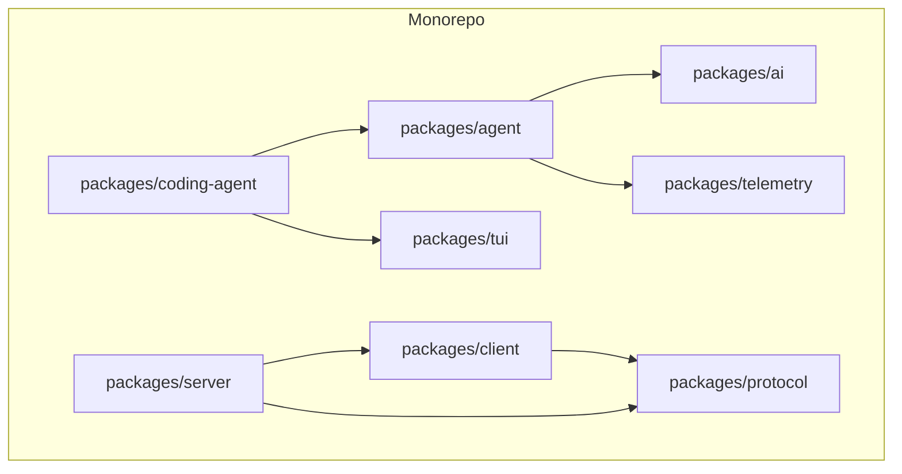
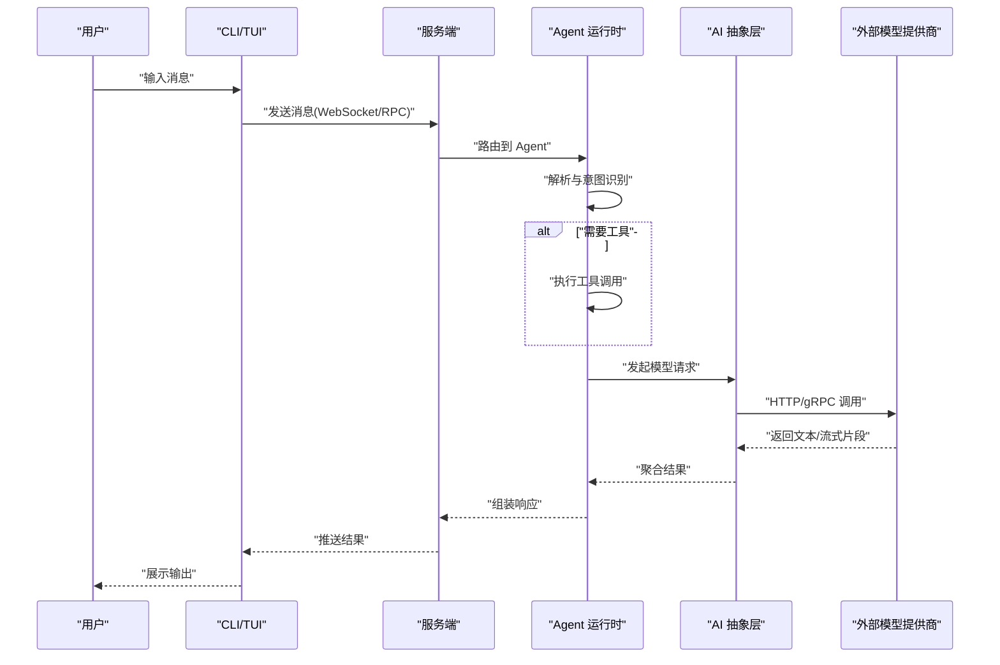
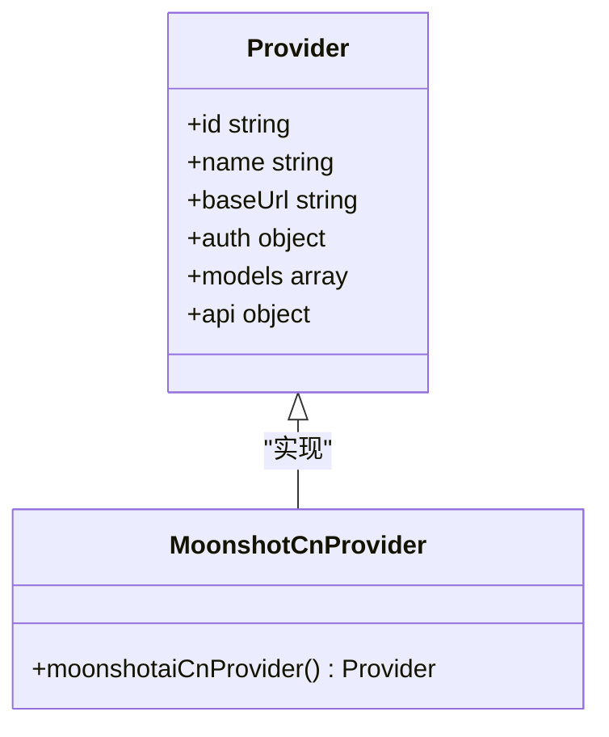
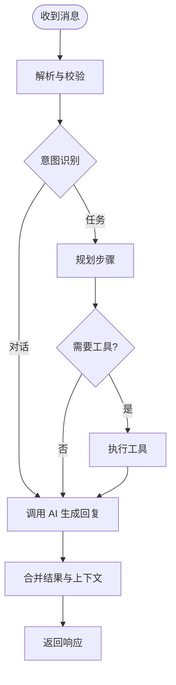
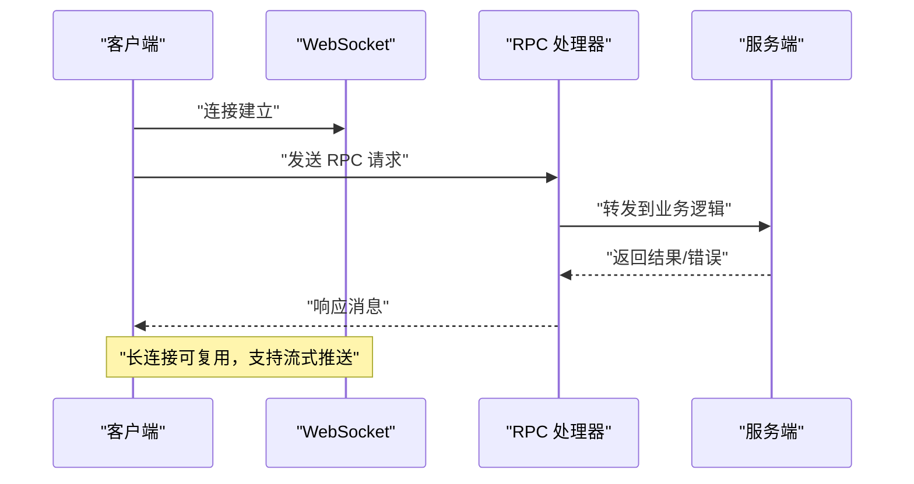
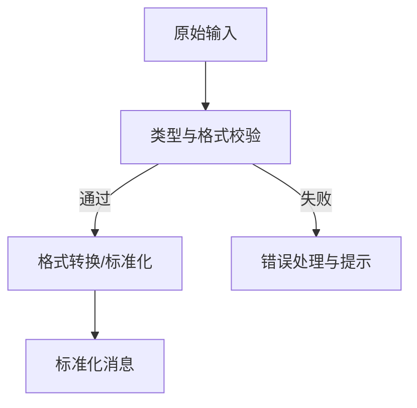
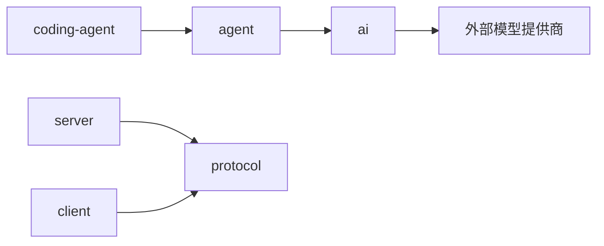

# 数据流设计

<cite>
**本文引用的文件**
- [README.md](file://README.md)
- [package.json](file://package.json)
- [moonshotai-cn.ts](file://packages/ai/src/providers/moonshotai-cn.ts)
</cite>

## 目录
1. [简介](#简介)
2. [项目结构](#项目结构)
3. [核心组件](#核心组件)
4. [架构总览](#架构总览)
5. [详细组件分析](#详细组件分析)
6. [依赖分析](#依赖分析)
7. [性能考虑](#性能考虑)
8. [故障排查指南](#故障排查指南)
9. [结论](#结论)
10. [附录](#附录)

## 简介
本文件聚焦于从用户输入到 AI 响应处理的完整数据流设计，覆盖消息解析、意图识别、工具调用、AI 请求、结果处理等关键环节。同时阐述异步处理模式（Promise 链、事件循环、流式处理）、消息传递机制（RPC 协议、WebSocket 通信、进程间通信），以及数据转换与验证（类型检查、格式转换、错误处理）。文档包含数据流图、时序图和状态转换图，并提供缓存、批处理、并发控制等性能优化策略。

## 项目结构
仓库采用多包 monorepo 组织，核心包包括：
- ai：统一的多提供商 LLM API 抽象与实现
- agent：Agent 运行时，负责工具调用与状态管理
- coding-agent：交互式编码 Agent CLI
- server/client：服务端与客户端通信层（用于 RPC/WebSocket）
- protocol：跨进程/网络通信的协议定义
- telemetry：遥测契约与适配器
- tui：终端 UI 库

构建脚本定义了各包的构建顺序，确保依赖关系正确。

**图表来源**
- [package.json:14-17](file://package.json#L14-L17)

**章节来源**
- [README.md:13-36](file://README.md#L13-L36)
- [package.json:14-17](file://package.json#L14-L17)

## 核心组件
- AI 抽象层：提供统一的模型调用接口，屏蔽不同提供商差异
- Agent 运行时：编排意图识别、工具调用、会话状态
- 通信层：通过 RPC/WebSocket 在客户端与服务端之间传输消息
- 协议层：定义消息结构与序列化方式
- 遥测层：记录关键指标与追踪信息
- TUI：渲染输出与交互

这些组件协同完成“输入→解析→意图→工具→AI→结果”的数据流闭环。

**章节来源**
- [README.md:13-36](file://README.md#L13-L36)

## 架构总览
下图展示端到端数据流：用户输入经客户端进入服务层，Agent 进行意图识别与工具调度，必要时调用 AI 抽象层获取模型响应，最终将结果回传至客户端并渲染。

**图表来源**
- [moonshotai-cn.ts:1-15](file://packages/ai/src/providers/moonshotai-cn.ts#L1-L15)

## 详细组件分析

### 组件A：AI 抽象层与提供商适配
- 职责：封装不同 LLM 提供商的统一接口，处理鉴权、模型清单、API 适配
- 关键点：
  - 通过 createProvider 注册提供商实例
  - 使用 openAICompletionsApi 作为通用 API 适配
  - 鉴权通过 envApiKeyAuth 读取环境变量
  - 模型清单集中管理，便于选择与切换

**图表来源**
- [moonshotai-cn.ts:1-15](file://packages/ai/src/providers/moonshotai-cn.ts#L1-L15)

**章节来源**
- [moonshotai-cn.ts:1-15](file://packages/ai/src/providers/moonshotai-cn.ts#L1-L15)

### 组件B：Agent 运行时（意图识别与工具调用）
- 职责：接收来自服务层的消息，进行解析与意图识别；根据意图决定是否需要调用工具；协调 AI 请求与结果拼装
- 关键流程：
  - 输入校验与格式化
  - 意图分类（对话/任务/工具调用）
  - 工具调度与参数绑定
  - 调用 AI 抽象层获取补充信息或生成内容
  - 结果合并与上下文更新

[本节为概念性流程图，不直接映射具体源码文件]

### 组件C：通信层（RPC/WebSocket/进程间通信）
- 职责：在客户端与服务端之间建立可靠的消息通道，支持双向通信、断线重连、背压与限流
- 关键点：
  - WebSocket 用于实时推送与流式响应
  - RPC 用于结构化请求/响应
  - 协议层定义消息体结构与版本兼容
  - 错误重试与超时控制

[本节为概念性时序图，不直接映射具体源码文件]

### 组件D：数据转换与验证
- 类型检查：对入参进行严格类型校验，避免脏数据进入下游
- 格式转换：统一消息格式，适配不同上游/下游协议
- 错误处理：捕获并分类异常，提供可恢复策略与告警

[本节为概念性流程图，不直接映射具体源码文件]

## 依赖分析
- 构建顺序与依赖：
  - 构建脚本按特定顺序编译各包，确保依赖可用
  - 典型依赖链：coding-agent → agent → ai；server ↔ client 通过 protocol 通信
- 外部依赖：
  - AI 抽象层依赖各模型提供商 HTTP/gRPC 接口
  - 鉴权通过环境变量注入

**图表来源**
- [package.json:14-17](file://package.json#L14-L17)

**章节来源**
- [package.json:14-17](file://package.json#L14-L17)

## 性能考虑
- 缓存机制
  - 模型元数据与配置缓存，减少重复初始化开销
  - 工具调用结果短期缓存，避免重复执行
- 批处理
  - 批量提交 AI 请求，提高吞吐
  - 日志与遥测上报采用批处理降低 I/O 压力
- 并发控制
  - 限制并发请求数，防止过载
  - 使用队列与令牌桶控制流量
- 流式处理
  - 对大模型响应采用流式推送，降低首字节延迟
  - 客户端增量渲染，提升用户体验
- 连接复用与重试
  - WebSocket 长连接复用，减少握手成本
  - 指数退避重试与熔断保护

[本节提供通用指导，不直接分析具体文件]

## 故障排查指南
- 常见问题定位
  - 鉴权失败：检查环境变量与密钥配置
  - 模型不可用：核对模型清单与可用性
  - 工具执行失败：查看工具日志与参数校验
  - 通信中断：检查 WebSocket 状态与重连策略
- 诊断手段
  - 启用遥测与调试日志，追踪关键路径
  - 使用协议层抓包确认消息结构
  - 针对超时与错误码制定降级策略

[本节为通用指导，不直接分析具体文件]

## 结论
本设计以模块化与解耦为核心，围绕 AI 抽象层与 Agent 运行时构建稳定可扩展的数据流。通过统一的协议与通信层，实现客户端、服务端与 AI 服务的松耦合协作。结合缓存、批处理、并发控制与流式处理，可在保证一致性的前提下提升性能与用户体验。

## 附录
- 术语
  - 意图识别：根据输入判断用户意图并路由到相应处理分支
  - 工具调用：执行系统或扩展提供的能力以完成任务
  - 流式处理：边生成边传输，降低延迟
- 参考
  - 多包构建顺序与依赖关系见构建脚本
  - 提供商适配示例见 AI 抽象层中的提供商实现