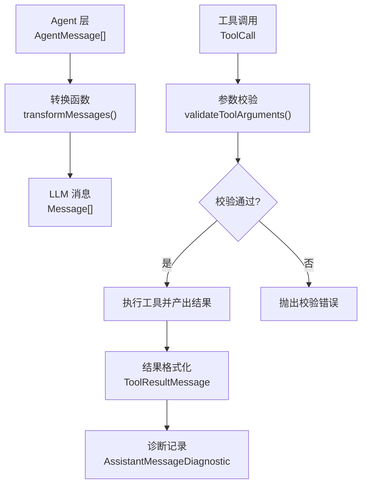
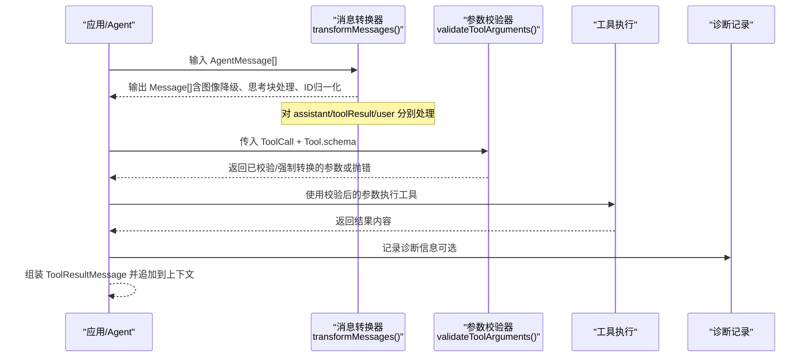
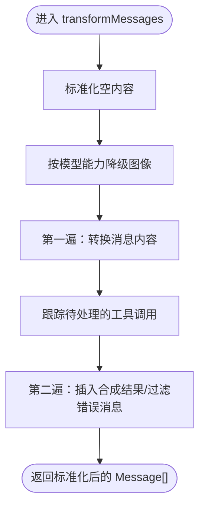
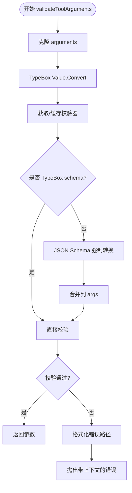
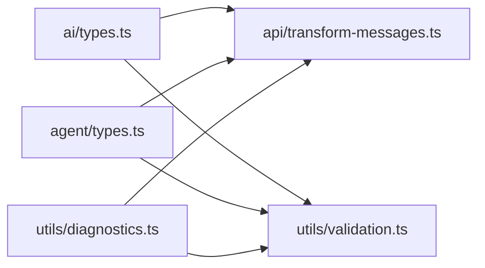
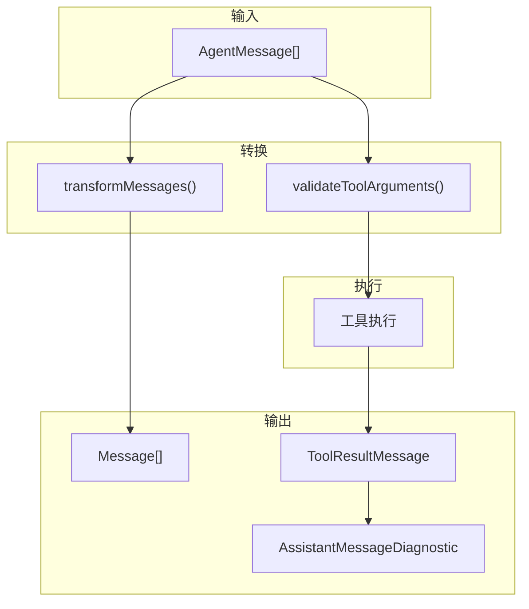

# 数据转换与验证

<cite>
**本文引用的文件**
- [packages/ai/src/types.ts](file://packages/ai/src/types.ts)
- [packages/ai/src/utils/validation.ts](file://packages/ai/src/utils/validation.ts)
- [packages/ai/src/api/transform-messages.ts](file://packages/ai/src/api/transform-messages.ts)
- [packages/agent/src/types.ts](file://packages/agent/src/types.ts)
- [packages/ai/src/utils/diagnostics.ts](file://packages/ai/src/utils/diagnostics.ts)
</cite>

## 目录
1. [简介](#简介)
2. [项目结构](#项目结构)
3. [核心组件](#核心组件)
4. [架构总览](#架构总览)
5. [详细组件分析](#详细组件分析)
6. [依赖关系分析](#依赖关系分析)
7. [性能考量](#性能考量)
8. [故障排查指南](#故障排查指南)
9. [结论](#结论)
10. [附录](#附录)

## 简介
本文件聚焦于“数据转换与验证”的完整机制，覆盖以下关键主题：
- AgentMessage 到 LLM Message 的转换流程与规则
- 工具参数校验（TypeBox 类型检查、JSON Schema 兼容、强制转换）
- 结果格式化与标准化（统一接口、格式规范化、空值处理）
- 错误处理策略（验证失败、类型不匹配、数据损坏）
- 数据流转图、验证规则与错误码定义
- 最佳实践与性能优化技巧

## 项目结构
围绕数据转换与验证的核心代码分布在以下模块：
- 统一消息与工具类型定义：packages/ai/src/types.ts
- 消息转换与标准化：packages/ai/src/api/transform-messages.ts
- 工具参数校验与强制转换：packages/ai/src/utils/validation.ts
- Agent 层消息与执行上下文：packages/agent/src/types.ts
- 诊断与错误信息封装：packages/ai/src/utils/diagnostics.ts



**图表来源**
- [packages/ai/src/api/transform-messages.ts:64-223](file://packages/ai/src/api/transform-messages.ts#L64-L223)
- [packages/ai/src/utils/validation.ts:270-317](file://packages/ai/src/utils/validation.ts#L270-L317)
- [packages/ai/src/utils/diagnostics.ts:15-45](file://packages/ai/src/utils/diagnostics.ts#L15-L45)

**章节来源**
- [packages/ai/src/types.ts:338-455](file://packages/ai/src/types.ts#L338-L455)
- [packages/ai/src/api/transform-messages.ts:64-223](file://packages/ai/src/api/transform-messages.ts#L64-L223)
- [packages/ai/src/utils/validation.ts:270-317](file://packages/ai/src/utils/validation.ts#L270-L317)
- [packages/agent/src/types.ts:149-293](file://packages/agent/src/types.ts#L149-L293)
- [packages/ai/src/utils/diagnostics.ts:15-45](file://packages/ai/src/utils/diagnostics.ts#L15-L45)

## 核心组件
- 统一消息模型与工具定义：包含用户消息、助手消息、工具调用、工具结果等标准结构，以及 Tool 的 TypeBox 参数 schema。
- 消息转换器：负责将 AgentMessage 序列转换为 LLM 可消费的 Message 序列，包括图像降级、思考块处理、工具调用 ID 归一化、孤儿工具调用补全等。
- 工具参数校验器：基于 TypeBox 编译后的校验器与 JSON Schema 兼容的强制转换逻辑，确保工具参数符合 schema 并尽可能容错。
- Agent 层配置：提供 convertToLlm、beforeToolCall、afterToolCall 等钩子，用于在运行期控制消息转换与工具执行行为。
- 诊断与错误：统一的诊断事件结构与错误提取工具，便于在最终消息中附加调试信息。

**章节来源**
- [packages/ai/src/types.ts:338-513](file://packages/ai/src/types.ts#L338-L513)
- [packages/ai/src/api/transform-messages.ts:64-223](file://packages/ai/src/api/transform-messages.ts#L64-L223)
- [packages/ai/src/utils/validation.ts:270-317](file://packages/ai/src/utils/validation.ts#L270-L317)
- [packages/agent/src/types.ts:149-293](file://packages/agent/src/types.ts#L149-L293)
- [packages/ai/src/utils/diagnostics.ts:15-45](file://packages/ai/src/utils/diagnostics.ts#L15-L45)

## 架构总览
下图展示了从 Agent 消息到 LLM 消息的转换路径，以及工具调用的校验与结果回写流程。



**图表来源**
- [packages/ai/src/api/transform-messages.ts:64-223](file://packages/ai/src/api/transform-messages.ts#L64-L223)
- [packages/ai/src/utils/validation.ts:270-317](file://packages/ai/src/utils/validation.ts#L270-L317)
- [packages/ai/src/utils/diagnostics.ts:15-45](file://packages/ai/src/utils/diagnostics.ts#L15-L45)

## 详细组件分析

### 组件A：消息转换 transformMessages
职责与关键点：
- 空值处理：将 content 为 null/undefined 的消息标准化为空数组，避免下游类型契约被破坏。
- 图像降级：若模型不支持图像输入，则将用户与工具结果中的图像替换为占位文本，避免 API 报错。
- 思考块处理：跨模型时丢弃加密的思考块；同模型保留签名以支持回放；空思考块过滤或转为普通文本。
- 工具调用 ID 归一化：为跨提供商兼容性生成稳定 ID，并在 toolResult 中映射回原 ID。
- 孤儿工具调用补全：当 assistant 消息声明了工具调用但未收到对应结果时，插入合成结果以保证会话完整性。
- 错误/中止消息过滤：跳过 stopReason 为 error/aborted 的 assistant 消息，防止回放不完整状态导致 API 错误。



**图表来源**
- [packages/ai/src/api/transform-messages.ts:64-223](file://packages/ai/src/api/transform-messages.ts#L64-L223)

**章节来源**
- [packages/ai/src/api/transform-messages.ts:64-223](file://packages/ai/src/api/transform-messages.ts#L64-L223)

### 组件B：工具参数校验 validateToolArguments
职责与关键点：
- TypeBox 校验：使用 Compile 编译 schema 并缓存校验器，提升重复校验性能。
- 强制转换：对基础类型进行宽松转换（如字符串转数字/布尔），对象与数组递归应用 schema 约束。
- Union/AnyOf/OneOf：尝试匹配任一子 schema，必要时克隆并转换后再次校验。
- 错误报告：将 TypeBox 错误路径格式化为用户可读的路径提示，并附带原始参数以便定位问题。
- 查找工具：根据名称定位 Tool，未找到则直接抛错。



**图表来源**
- [packages/ai/src/utils/validation.ts:270-317](file://packages/ai/src/utils/validation.ts#L270-L317)

**章节来源**
- [packages/ai/src/utils/validation.ts:270-317](file://packages/ai/src/utils/validation.ts#L270-L317)

### 组件C：Agent 层转换与执行钩子
职责与关键点：
- convertToLlm：将 AgentMessage[] 转换为 LLM 可用的 Message[]，支持过滤 UI 专用消息、注入外部上下文等。
- beforeToolCall/afterToolCall：在工具执行前后进行拦截，支持阻断执行、修改结果、标记终止等。
- 流式协议：要求 stream 函数不得抛出异常，而是通过事件流传递错误与完成状态。

```mermaid
sequenceDiagram
participant Loop as "Agent 循环"
participant Conv as "convertToLlm"
participant Hook as "beforeToolCall / afterToolCall"
participant Stream as "Provider.streamSimple"
Loop->>Conv : 转换 AgentMessage[] -> Message[]
Conv-->>Loop : 返回 Message[]
Loop->>Stream : 发起请求并消费事件
Stream-->>Loop : 事件流start/text/toolcall/done/error
Loop->>Hook : 执行前钩子可阻断/终止
Hook-->>Loop : 允许或阻止执行
Loop->>Hook : 执行后钩子可覆盖结果/usage
Hook-->>Loop : 最终结果写入 ToolResultMessage
```

**图表来源**
- [packages/agent/src/types.ts:149-293](file://packages/agent/src/types.ts#L149-L293)

**章节来源**
- [packages/agent/src/types.ts:149-293](file://packages/agent/src/types.ts#L149-L293)

### 组件D：诊断与错误封装
职责与关键点：
- 统一诊断结构：包含类型、时间戳、错误信息与详情，便于上层聚合与展示。
- 错误提取：从任意抛出值中提取 name/message/stack/code，保证一致性。
- 附加诊断：将诊断信息追加到 AssistantMessage 的 diagnostics 字段，不影响主流程。

**章节来源**
- [packages/ai/src/utils/diagnostics.ts:15-45](file://packages/ai/src/utils/diagnostics.ts#L15-L45)

## 依赖关系分析
- 类型依赖：消息与工具类型集中在 ai/types.ts，作为各模块共享契约。
- 转换依赖：transform-messages 依赖统一消息类型，并对模型能力做条件处理。
- 校验依赖：validation 依赖 TypeBox 编译与 Value.Convert，同时兼容 JSON Schema 结构。
- Agent 集成：agent/types.ts 定义了高层转换与执行钩子，串联消息转换与工具执行。
- 诊断依赖：diagnostics 提供通用错误封装，被上层用于记录与上报。



**图表来源**
- [packages/ai/src/types.ts:338-513](file://packages/ai/src/types.ts#L338-L513)
- [packages/ai/src/api/transform-messages.ts:64-223](file://packages/ai/src/api/transform-messages.ts#L64-L223)
- [packages/ai/src/utils/validation.ts:270-317](file://packages/ai/src/utils/validation.ts#L270-L317)
- [packages/agent/src/types.ts:149-293](file://packages/agent/src/types.ts#L149-L293)
- [packages/ai/src/utils/diagnostics.ts:15-45](file://packages/ai/src/utils/diagnostics.ts#L15-L45)

**章节来源**
- [packages/ai/src/types.ts:338-513](file://packages/ai/src/types.ts#L338-L513)
- [packages/ai/src/api/transform-messages.ts:64-223](file://packages/ai/src/api/transform-messages.ts#L64-L223)
- [packages/ai/src/utils/validation.ts:270-317](file://packages/ai/src/utils/validation.ts#L270-L317)
- [packages/agent/src/types.ts:149-293](file://packages/agent/src/types.ts#L149-L293)
- [packages/ai/src/utils/diagnostics.ts:15-45](file://packages/ai/src/utils/diagnostics.ts#L15-L45)

## 性能考量
- 校验器缓存：TypeBox 校验器通过 WeakMap 缓存，避免重复编译开销。
- 最小化转换：仅在必要时进行强制转换与克隆，减少内存分配。
- 批量处理：消息转换采用两遍扫描，尽量在一次遍历中收集必要信息（如工具调用 ID 映射）。
- 短路策略：Union/AnyOf/OneOf 先尝试直接匹配，再考虑转换，降低不必要的计算。
- 流式协议：遵循“不抛异常”的设计，错误编码进事件流，有利于长连接与重试策略。

[本节为通用指导，无需具体文件引用]

## 故障排查指南
常见问题与处理策略：
- 工具未找到：当工具名称不存在时立即抛错，需检查工具注册与名称一致性。
- 参数校验失败：错误信息包含字段路径与原始参数，优先检查必填字段与类型约束。
- 图像不被支持：模型不支持图像时会被替换为占位文本，确认模型能力或调整输入。
- 思考块跨模型：加密思考块在跨模型时被丢弃，避免 API 错误；同模型保留签名以支持回放。
- 孤儿工具调用：若无对应结果，系统会插入合成结果，检查上游工具执行链路是否遗漏。
- 诊断信息：通过 AssistantMessage.diagnostics 查看错误详情与堆栈，辅助定位问题。

**章节来源**
- [packages/ai/src/utils/validation.ts:270-317](file://packages/ai/src/utils/validation.ts#L270-L317)
- [packages/ai/src/api/transform-messages.ts:64-223](file://packages/ai/src/api/transform-messages.ts#L64-L223)
- [packages/ai/src/utils/diagnostics.ts:15-45](file://packages/ai/src/utils/diagnostics.ts#L15-L45)

## 结论
本方案通过统一的消息类型、严格的参数校验与健壮的消息转换，实现了跨提供商、跨模型的稳定数据流转。结合 Agent 层的执行钩子与诊断记录，既保证了灵活性，又提升了可观测性与可维护性。建议在生产环境中启用校验器缓存、合理设置图像降级策略，并利用诊断信息持续优化错误处理流程。

[本节为总结性内容，无需具体文件引用]

## 附录

### 数据流转图（端到端）


**图表来源**
- [packages/ai/src/api/transform-messages.ts:64-223](file://packages/ai/src/api/transform-messages.ts#L64-L223)
- [packages/ai/src/utils/validation.ts:270-317](file://packages/ai/src/utils/validation.ts#L270-L317)
- [packages/ai/src/utils/diagnostics.ts:15-45](file://packages/ai/src/utils/diagnostics.ts#L15-L45)

### 验证规则摘要
- 必填字段：依据 Tool.parameters 的 schema 判定，缺失将触发 required 错误。
- 类型约束：string/number/integer/boolean/null/array/object 严格匹配，必要时进行宽松转换。
- 联合类型：anyOf/oneOf 尝试匹配任一子 schema，失败则整体校验失败。
- 对象属性：仅对 properties 中定义的键进行转换与校验，additionalProperties 可按 schema 处理。
- 数组元素：按 items 或元组 schema 逐项转换与校验。

**章节来源**
- [packages/ai/src/utils/validation.ts:19-237](file://packages/ai/src/utils/validation.ts#L19-L237)

### 错误码定义（约定）
- 工具未找到：错误消息包含工具名，便于快速定位。
- 参数校验失败：错误消息包含字段路径与原始参数，便于调试。
- 图像不支持：自动降级为占位文本，不视为错误，但需在日志中标记。
- 思考块跨模型：加密思考块被丢弃，避免 API 错误。
- 孤儿工具调用：插入合成结果，isError 标记为 true，content 为固定提示。

**章节来源**
- [packages/ai/src/utils/validation.ts:270-317](file://packages/ai/src/utils/validation.ts#L270-L317)
- [packages/ai/src/api/transform-messages.ts:158-180](file://packages/ai/src/api/transform-messages.ts#L158-L180)

### 最佳实践
- 始终为工具定义明确的 TypeBox schema，并启用 strict 模式（如提供商支持）。
- 在 beforeToolCall 中进行权限与安全校验，必要时阻断执行。
- 在 afterToolCall 中统一包装结果，确保 content/details/usage 的一致性。
- 利用 convertToLlm 实现上下文窗口管理（如裁剪旧消息、注入外部知识）。
- 使用诊断记录捕获异常与恢复过程，便于线上问题复现与分析。

[本节为通用指导，无需具体文件引用]