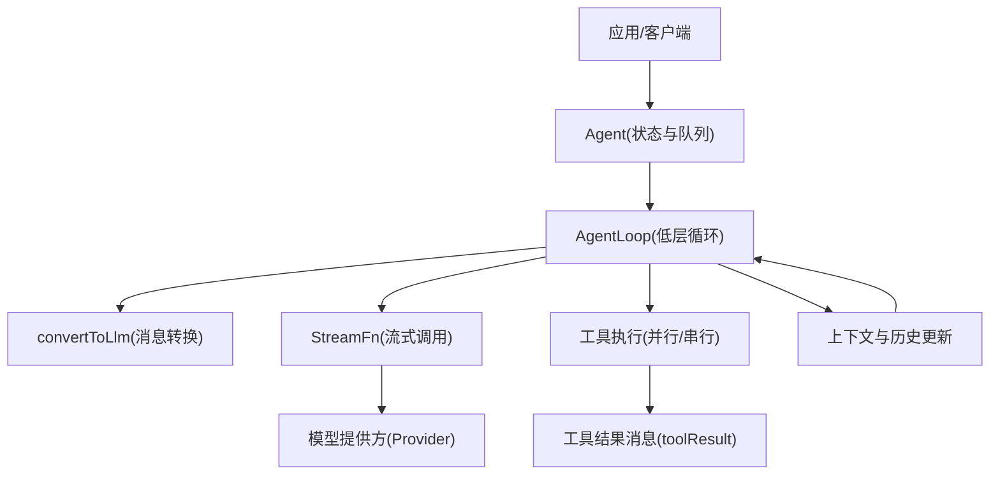
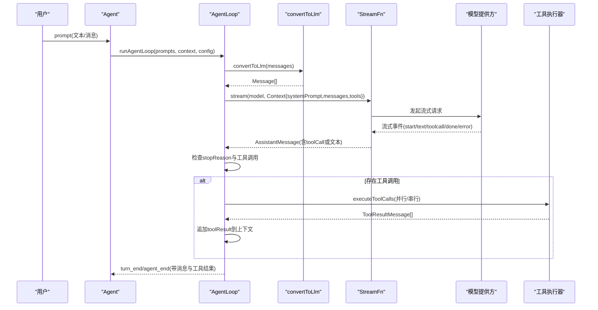
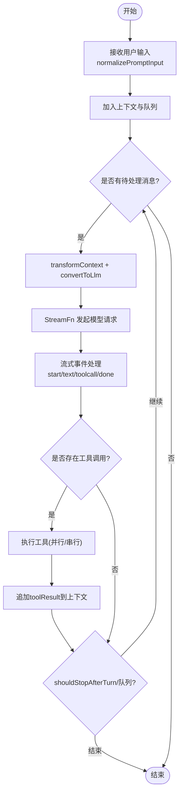
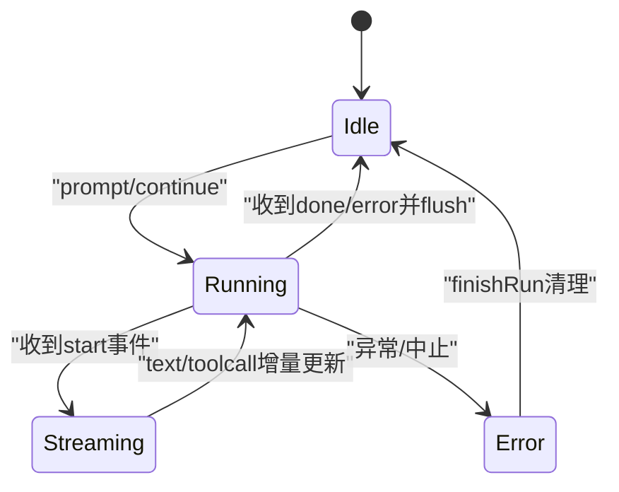
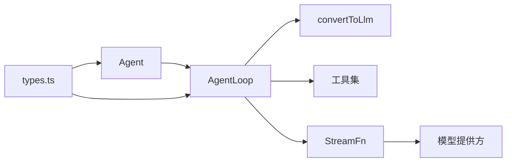

# 消息处理流程

<cite>
**本文引用的文件**
- [packages/agent/src/agent.ts](file://packages/agent/src/agent.ts)
- [packages/agent/src/agent-loop.ts](file://packages/agent/src/agent-loop.ts)
- [packages/agent/src/types.ts](file://packages/agent/src/types.ts)
- [packages/agent/src/stream-fn.ts](file://packages/agent/src/stream-fn.ts)
- [packages/agent/src/harness/messages.ts](file://packages/agent/src/harness/messages.ts)
- [packages/coding-agent/src/core/messages.ts](file://packages/coding-agent/src/core/messages.ts)
</cite>

## 目录
1. [简介](#简介)
2. [项目结构](#项目结构)
3. [核心组件](#核心组件)
4. [架构总览](#架构总览)
5. [详细组件分析](#详细组件分析)
6. [依赖关系分析](#依赖关系分析)
7. [性能考虑](#性能考虑)
8. [故障排查指南](#故障排查指南)
9. [结论](#结论)
10. [附录：代码片段路径索引](#附录代码片段路径索引)

## 简介
本文件系统化梳理从用户输入到最终响应的完整消息处理链路，覆盖消息接收、解析与验证、意图识别（由模型侧完成）、上下文构建、AI 请求生成、工具调用执行与结果回写、历史维护与状态管理。重点说明 AgentMessage 与 Message 的转换过程（角色映射、内容格式化、工具调用提取），并给出消息生命周期图、状态转换图和错误处理机制。所有实现细节均基于仓库中的实际代码。

## 项目结构
围绕消息处理的关键模块分布如下：
- Agent 对外接口与状态管理：负责接收用户输入、维护会话历史、编排事件流、控制队列注入与终止策略。
- Agent Loop 低层循环：驱动一轮或多轮对话，负责将 AgentMessage[] 转换为 LLM 可消费的 Message[]，发起流式请求，处理工具调用与结果回写。
- 类型与配置：定义 AgentMessage、AgentContext、AgentTool、工具执行模式、钩子等。
- 流函数：提供默认流式调用入口，供上层宿主配置具体模型提供方。
- 消息转换器：将内部扩展消息（如 bashExecution、custom、branchSummary、compactionSummary）转换为 LLM 友好的 user/assistant/toolResult 消息。

图表来源
- [packages/agent/src/agent.ts:173-238](file://packages/agent/src/agent.ts#L173-L238)
- [packages/agent/src/agent-loop.ts:155-275](file://packages/agent/src/agent-loop.ts#L155-L275)
- [packages/agent/src/types.ts:149-293](file://packages/agent/src/types.ts#L149-L293)
- [packages/agent/src/stream-fn.ts:11-20](file://packages/agent/src/stream-fn.ts#L11-L20)

章节来源
- [packages/agent/src/agent.ts:173-238](file://packages/agent/src/agent.ts#L173-L238)
- [packages/agent/src/agent-loop.ts:155-275](file://packages/agent/src/agent-loop.ts#L155-L275)
- [packages/agent/src/types.ts:149-293](file://packages/agent/src/types.ts#L149-L293)
- [packages/agent/src/stream-fn.ts:11-20](file://packages/agent/src/stream-fn.ts#L11-L20)

## 核心组件
- Agent：封装会话状态、消息队列（steering/follow-up）、事件订阅、生命周期控制（prompt/continue/reset/abort）。
- AgentLoop：实现“一轮”或“多轮”对话循环，负责上下文转换、LLM 调用、工具调用执行与结果回写。
- 消息转换：将内部扩展消息统一转为 LLM 可理解的 user/assistant/toolResult 消息。
- 流函数：抽象模型调用，支持默认实现与宿主自定义。
- 类型系统：定义 AgentMessage、AgentContext、AgentTool、工具执行模式、钩子等。

章节来源
- [packages/agent/src/agent.ts:173-238](file://packages/agent/src/agent.ts#L173-L238)
- [packages/agent/src/agent-loop.ts:155-275](file://packages/agent/src/agent-loop.ts#L155-L275)
- [packages/agent/src/types.ts:320-419](file://packages/agent/src/types.ts#L320-L419)
- [packages/agent/src/stream-fn.ts:11-20](file://packages/agent/src/stream-fn.ts#L11-L20)

## 架构总览
下图展示一次典型的消息处理流程：用户输入进入 Agent，Agent 将消息加入上下文并启动循环；循环在每次 LLM 调用前进行上下文转换与消息格式转换；模型返回助手消息后，若包含工具调用则执行工具并将结果写入上下文；循环根据停止条件决定是否继续下一轮。

图表来源
- [packages/agent/src/agent.ts:347-435](file://packages/agent/src/agent.ts#L347-L435)
- [packages/agent/src/agent-loop.ts:155-275](file://packages/agent/src/agent-loop.ts#L155-L275)
- [packages/agent/src/agent-loop.ts:281-372](file://packages/agent/src/agent-loop.ts#L281-L372)
- [packages/agent/src/agent-loop.ts:411-554](file://packages/agent/src/agent-loop.ts#L411-L554)
- [packages/agent/src/types.ts:149-293](file://packages/agent/src/types.ts#L149-L293)

## 详细组件分析

### 消息接收与解析验证
- 入口：Agent.prompt 接受字符串、单条消息或消息数组，必要时将文本包装为 user 消息，并合并图片内容。
- 校验与约束：
  - 运行中禁止重复 prompt，需通过 steer/followUp 排队或等待完成。
  - continue 要求最后一条消息不是 assistant，且上下文非空。
- 事件：message_start/message_end 在每轮消息开始时发出，便于 UI 渲染与追踪。

章节来源
- [packages/agent/src/agent.ts:347-407](file://packages/agent/src/agent.ts#L347-L407)
- [packages/agent/src/agent.ts:360-388](file://packages/agent/src/agent.ts#L360-L388)
- [packages/agent/src/agent.ts:544-591](file://packages/agent/src/agent.ts#L544-L591)

### 意图识别与上下文构建
- 意图识别由模型侧完成：AgentLoop 将上下文与工具列表交给模型，模型决定回复文本或工具调用。
- 上下文构建：
  - transformContext：可选的 AgentMessage 级预处理（如裁剪历史、注入外部信息）。
  - convertToLlm：将 AgentMessage[] 转换为 LLM 可消费的 Message[]，过滤不可用消息并做角色映射。
  - Context：包含 systemPrompt、messages、tools，作为模型请求上下文。

章节来源
- [packages/agent/src/types.ts:149-200](file://packages/agent/src/types.ts#L149-L200)
- [packages/agent/src/agent-loop.ts:281-303](file://packages/agent/src/agent-loop.ts#L281-L303)

### AgentMessage 与 Message 的转换
- 角色映射与内容格式化：
  - bashExecution：转为 user 消息，内容为命令执行结果的文本化描述；支持 excludeFromContext 排除。
  - custom：转为 user 消息，内容可为字符串或图文块。
  - branchSummary/compactionSummary：转为 user 消息，包裹摘要前后缀以便模型理解。
  - user/assistant/toolResult：透传。
- 转换位置：
  - 基础默认实现：仅保留 user/assistant/toolResult。
  - 扩展实现：harness 与 coding-agent 提供增强版 convertToLlm，支持更多内部消息类型。

章节来源
- [packages/agent/src/agent.ts:33-37](file://packages/agent/src/agent.ts#L33-L37)
- [packages/agent/src/harness/messages.ts:124-168](file://packages/agent/src/harness/messages.ts#L124-L168)
- [packages/coding-agent/src/core/messages.ts:148-195](file://packages/coding-agent/src/core/messages.ts#L148-L195)

### 工具调用提取与执行
- 提取：从助手消息 content 中筛选 toolCall 类型块。
- 执行模式：
  - 全局 toolExecution 配置或单个工具的 executionMode 决定串行/并行。
  - 串行：逐个准备、执行、收尾。
  - 并行：顺序准备，允许的工具并发执行，按完成顺序发出 tool_execution_end，随后按源顺序产出 toolResult 消息。
- 参数准备与校验：
  - prepareArguments 兼容旧参数。
  - validateToolArguments 严格校验。
- 钩子：
  - beforeToolCall：可在执行前拦截（block/terminate）。
  - afterToolCall：可在执行后覆盖结果内容、details、usage、isError、terminate。
- 截断保护：当模型输出被 token 限制截断时，批量失败该轮工具调用，提示模型重新签发完整参数。

章节来源
- [packages/agent/src/agent-loop.ts:202-224](file://packages/agent/src/agent-loop.ts#L202-L224)
- [packages/agent/src/agent-loop.ts:411-554](file://packages/agent/src/agent-loop.ts#L411-L554)
- [packages/agent/src/agent-loop.ts:586-668](file://packages/agent/src/agent-loop.ts#L586-L668)
- [packages/agent/src/agent-loop.ts:670-758](file://packages/agent/src/agent-loop.ts#L670-L758)
- [packages/agent/src/agent-loop.ts:374-406](file://packages/agent/src/agent-loop.ts#L374-L406)

### 消息状态管理与历史维护
- 会话历史：
  - Agent.state.messages 保存完整对话记录。
  - 流式过程中，partial assistant 消息先入队，done/error 时替换为最终消息。
  - toolResult 消息在执行完成后追加。
- 队列注入：
  - steeringQueue：在当前助手回合结束后注入，用于“中途引导”。
  - followUpQueue：在 agent 自然停止后注入，用于“后续任务”。
  - 队列模式：all 一次性清空；one-at-a-time 逐条处理。
- 运行时状态：
  - isStreaming：是否正在处理。
  - streamingMessage：当前流式消息。
  - pendingToolCalls：正在执行的工具调用集合。
  - errorMessage：最近失败的 assistant 错误信息。

章节来源
- [packages/agent/src/agent.ts:61-95](file://packages/agent/src/agent.ts#L61-L95)
- [packages/agent/src/agent.ts:125-159](file://packages/agent/src/agent.ts#L125-L159)
- [packages/agent/src/agent.ts:282-311](file://packages/agent/src/agent.ts#L282-L311)
- [packages/agent/src/agent.ts:437-483](file://packages/agent/src/agent.ts#L437-L483)
- [packages/agent/src/agent.ts:544-591](file://packages/agent/src/agent.ts#L544-L591)
- [packages/agent/src/agent-loop.ts:155-275](file://packages/agent/src/agent-loop.ts#L155-L275)
- [packages/agent/src/agent-loop.ts:317-372](file://packages/agent/src/agent-loop.ts#L317-L372)

### 消息生命周期图

图表来源
- [packages/agent/src/agent.ts:347-435](file://packages/agent/src/agent.ts#L347-L435)
- [packages/agent/src/agent-loop.ts:155-275](file://packages/agent/src/agent-loop.ts#L155-L275)
- [packages/agent/src/agent-loop.ts:281-372](file://packages/agent/src/agent-loop.ts#L281-L372)
- [packages/agent/src/agent-loop.ts:411-554](file://packages/agent/src/agent-loop.ts#L411-L554)

### 状态转换图（Agent 运行态）

图表来源
- [packages/agent/src/agent.ts:486-535](file://packages/agent/src/agent.ts#L486-L535)
- [packages/agent/src/agent.ts:544-591](file://packages/agent/src/agent.ts#L544-L591)

### 错误处理机制
- 模型侧错误：
  - done/error 分支将最终消息写入上下文，并触发 message_end。
  - stopReason 为 error/aborted 时立即结束本轮。
- 工具调用错误：
  - 找不到工具：直接返回错误结果。
  - 参数校验失败：捕获异常并返回错误结果。
  - beforeToolCall 拦截：返回 block/terminate 标记。
  - afterToolCall 覆盖：可修正 isError/content/details/usage/terminate。
  - 输出截断：批量失败该轮工具调用，提示模型重发。
- 运行期错误：
  - handleRunFailure：构造错误 assistant 消息，发出 message_start/end、turn_end、agent_end。
  - finishRun：清理 isStreaming、streamingMessage、pendingToolCalls 等。

章节来源
- [packages/agent/src/agent-loop.ts:317-372](file://packages/agent/src/agent-loop.ts#L317-L372)
- [packages/agent/src/agent-loop.ts:374-406](file://packages/agent/src/agent-loop.ts#L374-L406)
- [packages/agent/src/agent-loop.ts:600-668](file://packages/agent/src/agent-loop.ts#L600-L668)
- [packages/agent/src/agent-loop.ts:713-758](file://packages/agent/src/agent-loop.ts#L713-L758)
- [packages/agent/src/agent.ts:511-535](file://packages/agent/src/agent.ts#L511-L535)

## 依赖关系分析
- Agent 依赖 AgentLoop 与 StreamFn；AgentLoop 依赖 convertToLlm、工具注册与钩子；convertToLlm 可由 harness 或 coding-agent 扩展。
- 类型集中在 types.ts，贯穿各模块，确保消息、工具、上下文与事件的一致性。
- 流函数解耦了模型提供方，宿主可通过 setDefaultStreamFn 注入。

图表来源
- [packages/agent/src/agent.ts:173-238](file://packages/agent/src/agent.ts#L173-L238)
- [packages/agent/src/agent-loop.ts:155-275](file://packages/agent/src/agent-loop.ts#L155-L275)
- [packages/agent/src/types.ts:149-293](file://packages/agent/src/types.ts#L149-L293)
- [packages/agent/src/stream-fn.ts:11-20](file://packages/agent/src/stream-fn.ts#L11-L20)

章节来源
- [packages/agent/src/agent.ts:173-238](file://packages/agent/src/agent.ts#L173-L238)
- [packages/agent/src/agent-loop.ts:155-275](file://packages/agent/src/agent-loop.ts#L155-L275)
- [packages/agent/src/types.ts:149-293](file://packages/agent/src/types.ts#L149-L293)
- [packages/agent/src/stream-fn.ts:11-20](file://packages/agent/src/stream-fn.ts#L11-L20)

## 性能考虑
- 工具执行模式：
  - 并行模式可减少端到端延迟，但需注意工具间依赖与资源竞争。
  - 串行模式保证顺序性与一致性，适合有副作用的工具。
- 上下文窗口：
  - 使用 transformContext 进行历史裁剪或摘要注入，避免超出模型上下文限制。
- 流式处理：
  - 增量更新 assistant 消息，降低 UI 渲染压力与首字延迟。
- 重试与超时：
  - 通过 getApiKey 动态刷新短期令牌；结合 shouldStopAfterTurn 控制长会话的优雅退出。

[本节为通用指导，不直接分析具体文件]

## 故障排查指南
- 无法继续：
  - 现象：continue 抛出“无消息可继续”或“不能从 assistant 继续”。
  - 排查：确认上下文非空且最后一条消息不是 assistant。
- 工具未找到：
  - 现象：beforeToolCall 阶段返回“工具未找到”的错误结果。
  - 排查：检查 tools 列表是否包含对应名称的工具。
- 参数校验失败：
  - 现象：prepareArguments 或 validateToolArguments 抛错。
  - 排查：核对工具 schema 与实际传入参数。
- 输出被截断：
  - 现象：stopReason 为 length，工具调用被批量失败。
  - 排查：减少上下文长度或调整模型参数，让模型输出更短。
- 运行中重置：
  - 现象：reset 抛出“已在处理中”。
  - 排查：等待 waitForIdle 或 abort 后再重置。

章节来源
- [packages/agent/src/agent.ts:360-388](file://packages/agent/src/agent.ts#L360-L388)
- [packages/agent/src/agent-loop.ts:600-668](file://packages/agent/src/agent-loop.ts#L600-L668)
- [packages/agent/src/agent-loop.ts:374-406](file://packages/agent/src/agent-loop.ts#L374-L406)
- [packages/agent/src/agent.ts:332-345](file://packages/agent/src/agent.ts#L332-L345)

## 结论
本流程以 Agent 为中心，通过 AgentLoop 将内部消息模型与 LLM 协议解耦，借助 convertToLlm 与 transformContext 灵活适配不同场景；工具调用采用可配置的并行/串行策略，并通过 before/after 钩子实现强管控；完整的生命周期事件与状态管理保障了可观测性与稳定性。对于复杂业务，建议优先利用队列注入（steer/follow-up）与上下文裁剪（transformContext）来优化交互体验与成本。

[本节为总结性内容，不直接分析具体文件]

## 附录：代码片段路径索引
- 用户输入归一化与提示入口
  - [packages/agent/src/agent.ts:347-407](file://packages/agent/src/agent.ts#L347-L407)
- 继续对话与约束校验
  - [packages/agent/src/agent.ts:360-388](file://packages/agent/src/agent.ts#L360-L388)
- 上下文快照与循环配置
  - [packages/agent/src/agent.ts:437-483](file://packages/agent/src/agent.ts#L437-L483)
- 低层循环主流程
  - [packages/agent/src/agent-loop.ts:155-275](file://packages/agent/src/agent-loop.ts#L155-L275)
- 助手响应流式处理
  - [packages/agent/src/agent-loop.ts:281-372](file://packages/agent/src/agent-loop.ts#L281-L372)
- 工具调用执行（串行/并行）
  - [packages/agent/src/agent-loop.ts:411-554](file://packages/agent/src/agent-loop.ts#L411-L554)
- 工具参数准备与校验
  - [packages/agent/src/agent-loop.ts:586-668](file://packages/agent/src/agent-loop.ts#L586-L668)
- 工具执行与收尾（含钩子）
  - [packages/agent/src/agent-loop.ts:670-758](file://packages/agent/src/agent-loop.ts#L670-L758)
- 截断保护与批量失败
  - [packages/agent/src/agent-loop.ts:374-406](file://packages/agent/src/agent-loop.ts#L374-L406)
- 消息转换（基础默认）
  - [packages/agent/src/agent.ts:33-37](file://packages/agent/src/agent.ts#L33-L37)
- 消息转换（Harness 扩展）
  - [packages/agent/src/harness/messages.ts:124-168](file://packages/agent/src/harness/messages.ts#L124-L168)
- 消息转换（Coding-Agent 扩展）
  - [packages/coding-agent/src/core/messages.ts:148-195](file://packages/coding-agent/src/core/messages.ts#L148-L195)
- 类型定义（上下文、工具、钩子等）
  - [packages/agent/src/types.ts:149-293](file://packages/agent/src/types.ts#L149-L293)
- 流函数默认实现
  - [packages/agent/src/stream-fn.ts:11-20](file://packages/agent/src/stream-fn.ts#L11-L20)