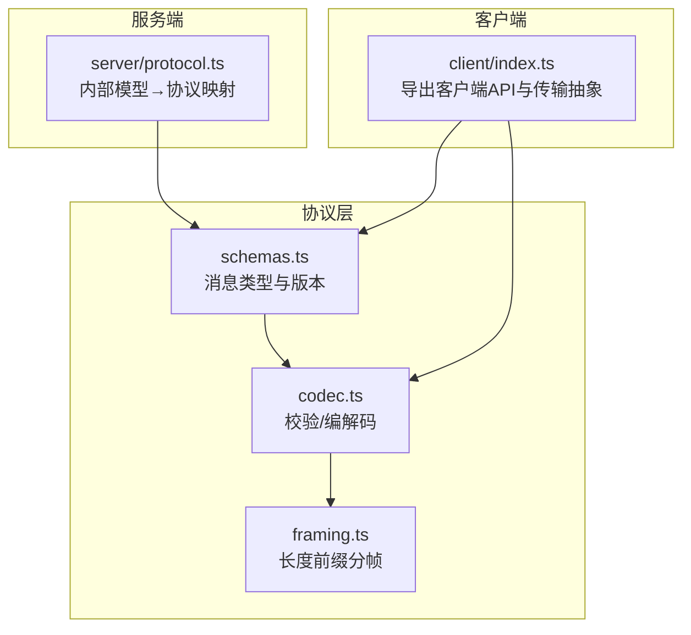
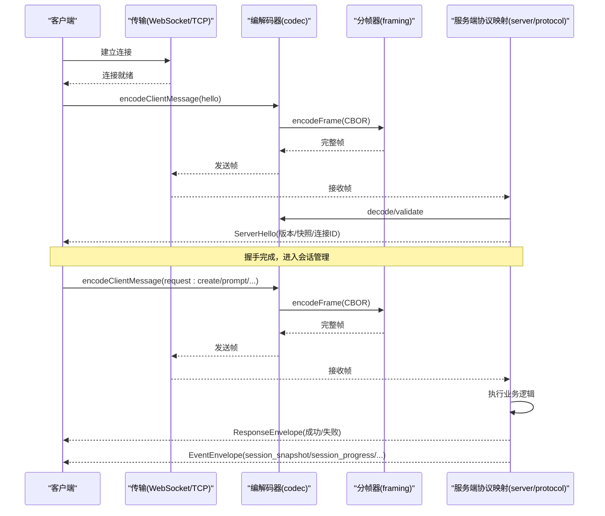
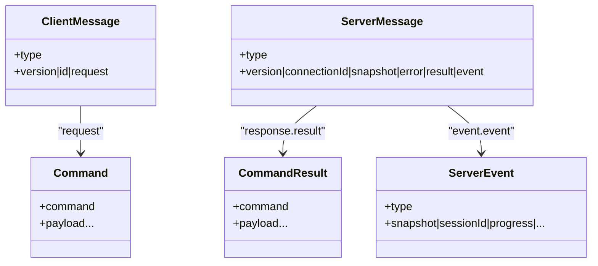
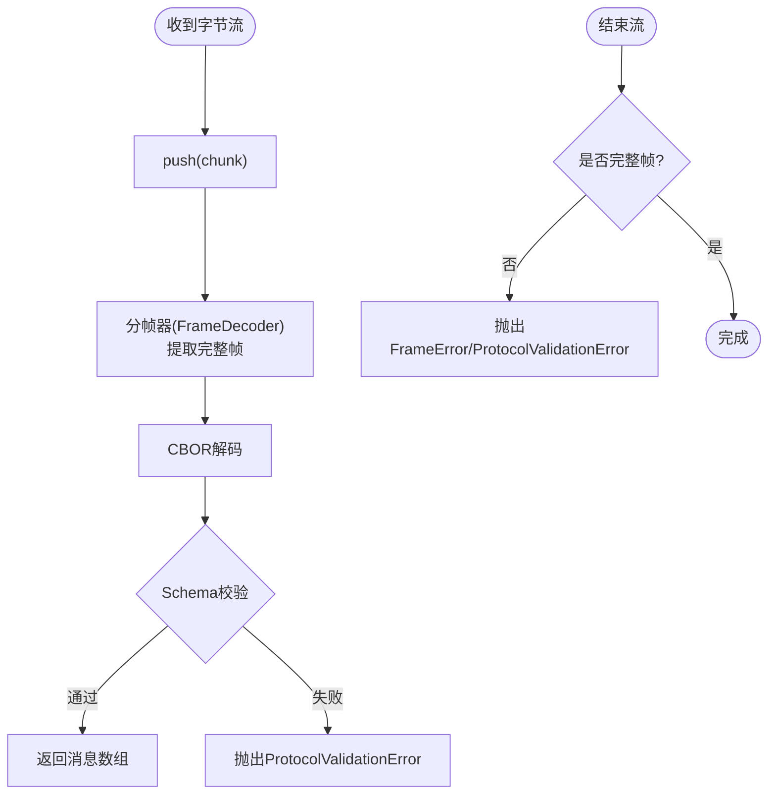
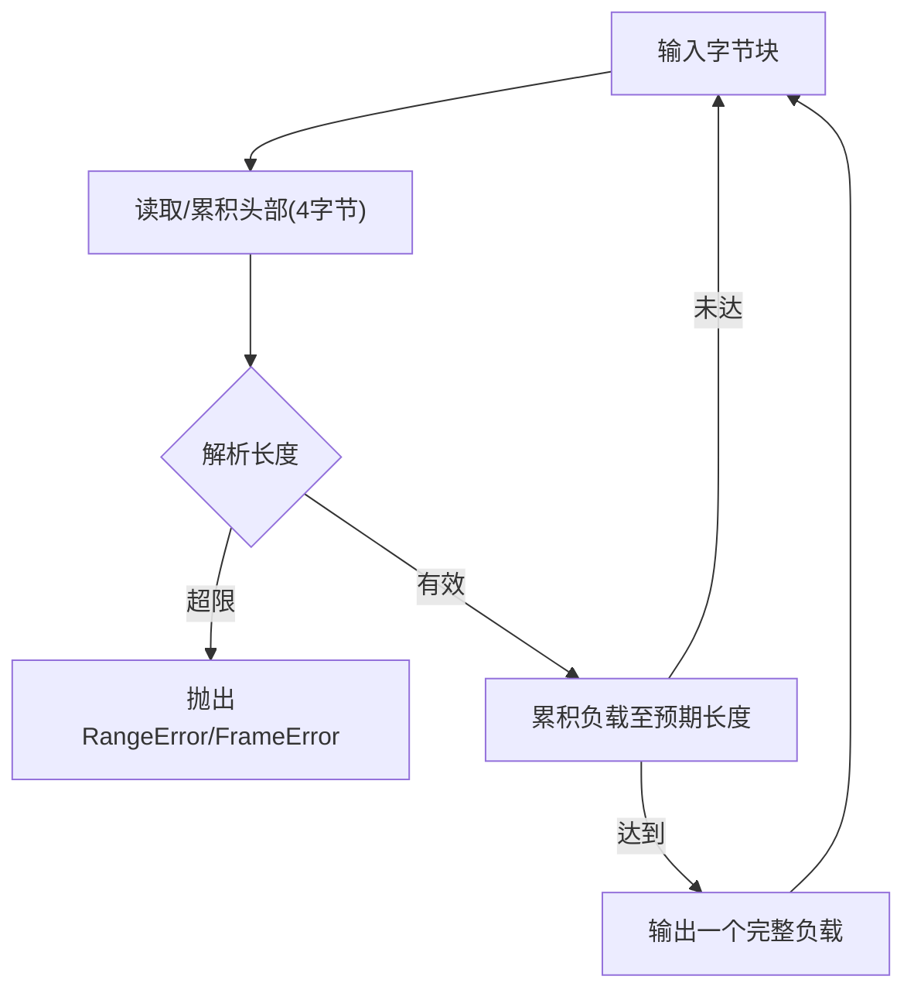
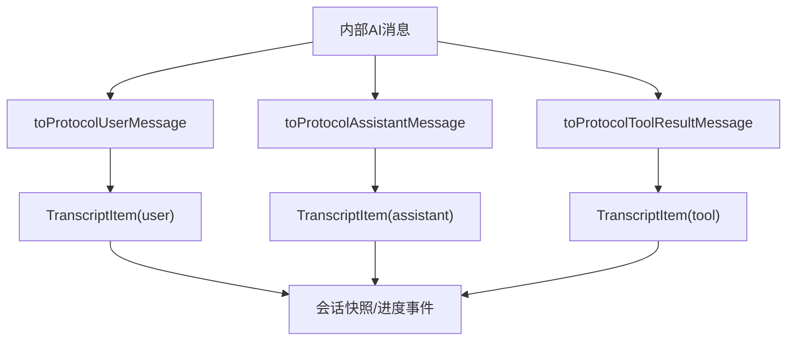
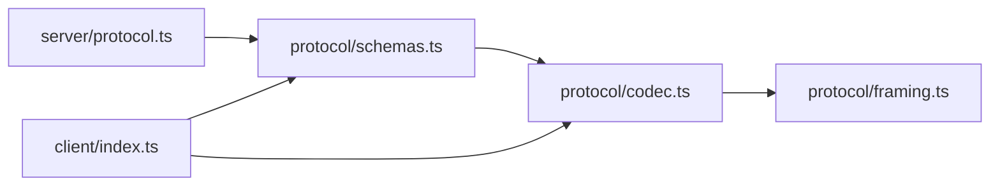

# 通信协议

<cite>
**本文引用的文件**
- [packages/protocol/src/index.ts](file://packages/protocol/src/index.ts)
- [packages/protocol/src/schemas.ts](file://packages/protocol/src/schemas.ts)
- [packages/protocol/src/codec.ts](file://packages/protocol/src/codec.ts)
- [packages/protocol/src/framing.ts](file://packages/protocol/src/framing.ts)
- [packages/server/src/protocol.ts](file://packages/server/src/protocol.ts)
- [packages/client/src/index.ts](file://packages/client/src/index.ts)
</cite>

## 目录
1. [简介](#简介)
2. [项目结构](#项目结构)
3. [核心组件](#核心组件)
4. [架构总览](#架构总览)
5. [详细组件分析](#详细组件分析)
6. [依赖关系分析](#依赖关系分析)
7. [性能考量](#性能考量)
8. [故障排查指南](#故障排查指南)
9. [结论](#结论)
10. [附录：协议规范与消息类型](#附录协议规范与消息类型)

## 简介
本文件系统化梳理 Pi 项目的通信协议，覆盖 RPC 请求-响应、事件推送（实时）、帧级序列化与分帧、版本兼容、连接建立与认证、消息路由、错误处理、以及不同传输通道（如 WebSocket）的适配方式。文档面向不同技术背景的读者，提供从高层到代码级的完整说明，并附带流程图与类图帮助理解。

## 项目结构
本项目将“协议定义”与“编解码/分帧”集中在 protocol 包中，server 侧负责将内部执行模型映射为协议消息，client 侧暴露客户端 API 与传输抽象。

图表来源
- [packages/protocol/src/schemas.ts:1-451](file://packages/protocol/src/schemas.ts#L1-L451)
- [packages/protocol/src/codec.ts:1-173](file://packages/protocol/src/codec.ts#L1-L173)
- [packages/protocol/src/framing.ts:1-166](file://packages/protocol/src/framing.ts#L1-L166)
- [packages/server/src/protocol.ts:1-383](file://packages/server/src/protocol.ts#L1-L383)
- [packages/client/src/index.ts:1-19](file://packages/client/src/index.ts#L1-L19)

章节来源
- [packages/protocol/src/index.ts:1-5](file://packages/protocol/src/index.ts#L1-L5)
- [packages/protocol/src/schemas.ts:1-451](file://packages/protocol/src/schemas.ts#L1-L451)
- [packages/protocol/src/codec.ts:1-173](file://packages/protocol/src/codec.ts#L1-L173)
- [packages/protocol/src/framing.ts:1-166](file://packages/protocol/src/framing.ts#L1-L166)
- [packages/server/src/protocol.ts:1-383](file://packages/server/src/protocol.ts#L1-L383)
- [packages/client/src/index.ts:1-19](file://packages/client/src/index.ts#L1-L19)

## 核心组件
- 协议版本与消息模式：通过 schemas.ts 集中定义协议版本号、客户端/服务器消息联合体、命令与结果、会话快照、进度事件等。
- 编解码器：codec.ts 提供消息校验、CBOR 编码/解码、增量解析器（ClientMessageDecoder/ServerMessageDecoder），以及最大帧长保护。
- 分帧器：framing.ts 实现长度前缀（4字节大端）的分帧与校验，支持流式拼接与截断检测。
- 服务端映射：server/protocol.ts 将内部 AI 执行模型（用户/助手/工具消息、用量、模型元数据等）转换为协议消息，确保字段严格对齐。
- 客户端接口：client/index.ts 暴露客户端类、错误类型、传输抽象（ByteTransport）与连接状态类型，便于上层以统一方式接入不同传输（如 WebSocket）。

章节来源
- [packages/protocol/src/schemas.ts:1-451](file://packages/protocol/src/schemas.ts#L1-L451)
- [packages/protocol/src/codec.ts:1-173](file://packages/protocol/src/codec.ts#L1-L173)
- [packages/protocol/src/framing.ts:1-166](file://packages/protocol/src/framing.ts#L1-L166)
- [packages/server/src/protocol.ts:1-383](file://packages/server/src/protocol.ts#L1-L383)
- [packages/client/src/index.ts:1-19](file://packages/client/src/index.ts#L1-L19)

## 架构总览
下图展示客户端与服务端之间的端到端通信流程：握手、RPC 请求-响应、事件推送（会话快照与进度），以及错误处理路径。

图表来源
- [packages/protocol/src/codec.ts:41-86](file://packages/protocol/src/codec.ts#L41-L86)
- [packages/protocol/src/framing.ts:27-53](file://packages/protocol/src/framing.ts#L27-L53)
- [packages/protocol/src/schemas.ts:384-449](file://packages/protocol/src/schemas.ts#L384-L449)
- [packages/server/src/protocol.ts:141-383](file://packages/server/src/protocol.ts#L141-L383)

## 详细组件分析

### 协议版本与消息模式（schemas.ts）
- 协议版本：固定整数常量，用于握手阶段兼容性检查。
- 客户端消息：包含 hello（首次握手）与 request（携带命令）。
- 服务器消息：包含 hello（握手应答）、hello_error（握手失败）、response（请求响应）、event（事件推送）。
- 命令与结果：list/create/attach/detach/prompt/steer/abort/set_model/set_thinking 等命令及其对应结果。
- 会话与进度：SessionSnapshot、TranscriptProgress（item_started/item_updated/item_finished/assistant_delta）等。
- 错误：ProtocolError（code/message/details）。

图表来源
- [packages/protocol/src/schemas.ts:384-449](file://packages/protocol/src/schemas.ts#L384-L449)

章节来源
- [packages/protocol/src/schemas.ts:1-451](file://packages/protocol/src/schemas.ts#L1-L451)

### 编解码与校验（codec.ts）
- 客户端/服务器消息均先进行结构校验，再 CBOR 编码，最后加长度前缀分帧。
- 提供增量解码器（ClientMessageDecoder/ServerMessageDecoder），按块 push 输入，返回已完整解析的消息数组；end() 时检测截断。
- 错误封装为 ProtocolValidationError，限制错误消息长度以避免放大攻击面。
- 提供 isSupportedProtocolVersion 用于版本兼容判断。

图表来源
- [packages/protocol/src/codec.ts:88-168](file://packages/protocol/src/codec.ts#L88-L168)
- [packages/protocol/src/framing.ts:57-166](file://packages/protocol/src/framing.ts#L57-L166)

章节来源
- [packages/protocol/src/codec.ts:1-173](file://packages/protocol/src/codec.ts#L1-L173)
- [packages/protocol/src/framing.ts:1-166](file://packages/protocol/src/framing.ts#L1-L166)

### 分帧与边界保护（framing.ts）
- 使用 4 字节无符号整型大端作为长度前缀，限制单帧最大长度（默认 16MB，可配置）。
- FrameDecoder 支持任意分片拼接，自动组装完整负载；在流结束时检测截断。
- assertCompleteFrame 用于一次性帧的完整性校验。

图表来源
- [packages/protocol/src/framing.ts:27-53](file://packages/protocol/src/framing.ts#L27-L53)
- [packages/protocol/src/framing.ts:57-166](file://packages/protocol/src/framing.ts#L57-L166)

章节来源
- [packages/protocol/src/framing.ts:1-166](file://packages/protocol/src/framing.ts#L1-L166)

### 服务端模型到协议映射（server/protocol.ts）
- 将内部 AI 消息（用户/助手/工具调用）转换为协议 TranscriptItem，严格限定字段集合，避免泄露内部实现细节。
- 对 usage/cost 等数值进行非负化与裁剪，保证协议安全与一致性。
- 对 details 等诊断信息进行“有损清洗”，仅保留不影响执行语义的数据。
- 对 assistant/tool 消息的状态机（streaming/complete/error/aborted）进行精确映射。

图表来源
- [packages/server/src/protocol.ts:141-383](file://packages/server/src/protocol.ts#L141-L383)

章节来源
- [packages/server/src/protocol.ts:1-383](file://packages/server/src/protocol.ts#L1-L383)

### 客户端接口与传输抽象（client/index.ts）
- 导出 PiClient 及多种错误类型（断开、服务错误、会话所有权等）。
- 导出 ByteTransport/ByteTransportFactory/ByteTransportHandlers 等传输抽象，便于在不同底层（WebSocket/TCP/进程管道）上复用同一协议栈。
- 导出连接状态与监听器错误处理器类型，支撑连接生命周期管理与错误上报。

章节来源
- [packages/client/src/index.ts:1-19](file://packages/client/src/index.ts#L1-L19)

## 依赖关系分析
- protocol 包自包含：schemas → codec → framing，形成稳定的协议基础层。
- server 依赖 protocol 的类型与编解码能力，并将内部模型映射为协议消息。
- client 依赖 protocol 的编解码与类型，并通过传输抽象屏蔽底层差异。

图表来源
- [packages/protocol/src/schemas.ts:1-451](file://packages/protocol/src/schemas.ts#L1-L451)
- [packages/protocol/src/codec.ts:1-173](file://packages/protocol/src/codec.ts#L1-L173)
- [packages/protocol/src/framing.ts:1-166](file://packages/protocol/src/framing.ts#L1-L166)
- [packages/server/src/protocol.ts:1-383](file://packages/server/src/protocol.ts#L1-L383)
- [packages/client/src/index.ts:1-19](file://packages/client/src/index.ts#L1-L19)

章节来源
- [packages/protocol/src/index.ts:1-5](file://packages/protocol/src/index.ts#L1-L5)
- [packages/protocol/src/schemas.ts:1-451](file://packages/protocol/src/schemas.ts#L1-L451)
- [packages/protocol/src/codec.ts:1-173](file://packages/protocol/src/codec.ts#L1-L173)
- [packages/protocol/src/framing.ts:1-166](file://packages/protocol/src/framing.ts#L1-L166)
- [packages/server/src/protocol.ts:1-383](file://packages/server/src/protocol.ts#L1-L383)
- [packages/client/src/index.ts:1-19](file://packages/client/src/index.ts#L1-L19)

## 性能考量
- 序列化格式：采用 CBOR，相比 JSON 体积更小、解析更快，适合高频小消息与大数据负载。
- 分帧策略：长度前缀 + 流式拼接，避免内存拷贝与阻塞，支持大消息分片传输。
- 最大帧长保护：默认 16MB，可通过选项调整，防止恶意或异常大消息导致资源耗尽。
- 增量解码：按块 push 解析，减少峰值内存占用，提升吞吐。
- 服务端映射：对数值进行裁剪与非负化，避免无效计算与溢出风险。
- 事件推送：session_progress 细粒度增量更新，降低带宽与渲染压力。

[本节为通用指导，不直接分析具体文件]

## 故障排查指南
- 握手失败：检查客户端 hello.version 与服务端支持的 PROTOCOL_VERSION 是否一致；若不一致，服务端会返回 hello_error。
- 帧错误：当帧长度超限、不完整或流结束存在截断时，会抛出 FrameError；上层应捕获并重连或降级。
- 协议校验失败：非法消息结构会触发 ProtocolValidationError；建议记录原始载荷与上下文以便定位。
- 会话锁定/忙：服务端可能返回 busy 或 session_locked 错误码，客户端需退避重试或提示用户。
- 内部错误：internal_error 表示服务端异常，应收集日志与堆栈信息。
- 传输层错误：结合 client 导出的断开/服务错误类型，区分网络中断与服务端错误。

章节来源
- [packages/protocol/src/schemas.ts:269-284](file://packages/protocol/src/schemas.ts#L269-L284)
- [packages/protocol/src/codec.ts:18-23](file://packages/protocol/src/codec.ts#L18-L23)
- [packages/protocol/src/framing.ts:12-25](file://packages/protocol/src/framing.ts#L12-L25)
- [packages/client/src/index.ts:1-19](file://packages/client/src/index.ts#L1-L19)

## 结论
该通信协议以 schema 为中心，配合 CBOR 与长度前缀分帧，实现了高效、安全、可扩展的 RPC 与事件推送机制。服务端通过严格的模型映射保障协议一致性，客户端通过传输抽象屏蔽底层差异，便于在 WebSocket、TCP、进程管道等多种通道上复用。版本控制与错误体系完善，适合构建高可靠、低延迟的实时协作系统。

[本节为总结性内容，不直接分析具体文件]

## 附录：协议规范与消息类型

### 协议版本与兼容性
- 协议版本为固定整数常量，握手阶段必须匹配。
- 客户端首先发送 hello(version)，服务端返回 hello(snapshot/connectionId) 或 hello_error。

章节来源
- [packages/protocol/src/schemas.ts:384-417](file://packages/protocol/src/schemas.ts#L384-L417)
- [packages/protocol/src/schemas.ts:1-3](file://packages/protocol/src/schemas.ts#L1-L3)

### 消息格式与序列化
- 所有消息经 Schema 校验后，使用 CBOR 编码，并以 4 字节大端长度前缀分帧。
- 支持增量解析：客户端/服务器均可按块 push 输入，逐步产出完整消息。

章节来源
- [packages/protocol/src/codec.ts:41-86](file://packages/protocol/src/codec.ts#L41-L86)
- [packages/protocol/src/framing.ts:27-53](file://packages/protocol/src/framing.ts#L27-L53)

### 客户端-服务器交互
- 连接建立：客户端发送 hello，服务端返回 hello 或 hello_error。
- 认证：当前协议未内置鉴权字段，建议在传输层（如 TLS/WSS）或网关层实现认证。
- 消息路由：request/response 通过 id 关联；event 为单向推送，无需请求方标识。
- 错误处理：response.ok=false 时携带 ProtocolError；握手失败通过 hello_error 返回。

章节来源
- [packages/protocol/src/schemas.ts:391-449](file://packages/protocol/src/schemas.ts#L391-L449)
- [packages/protocol/src/schemas.ts:269-284](file://packages/protocol/src/schemas.ts#L269-L284)

### 实时通信：事件订阅、广播与连接管理
- 事件类型：server_snapshot、session_snapshot、session_progress、session_removed。
- 广播机制：服务端可向多个客户端推送相同事件（例如全局快照变更）。
- 连接管理：通过 hello/hello_error 管理握手；传输层负责重连与保活。

章节来源
- [packages/protocol/src/schemas.ts:400-409](file://packages/protocol/src/schemas.ts#L400-L409)
- [packages/protocol/src/schemas.ts:412-421](file://packages/protocol/src/schemas.ts#L412-L421)

### 适用场景与性能对比
- WebSocket：适合浏览器/前端实时交互，天然支持双向事件推送；注意心跳与重连策略。
- TCP/Unix Socket：适合高性能本地或内网通信，延迟更低，但需自行实现应用层心跳与重连。
- 进程间通信（IPC）：适合同机多进程协作，零拷贝友好；需考虑权限与隔离。
- 选择建议：优先根据部署环境与客户端类型选择传输；协议层保持不变，通过 ByteTransport 抽象切换。

[本节为通用指导，不直接分析具体文件]