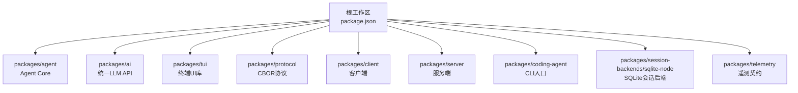
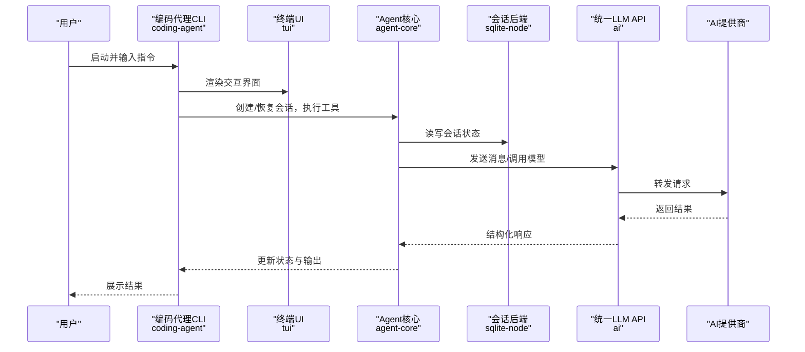
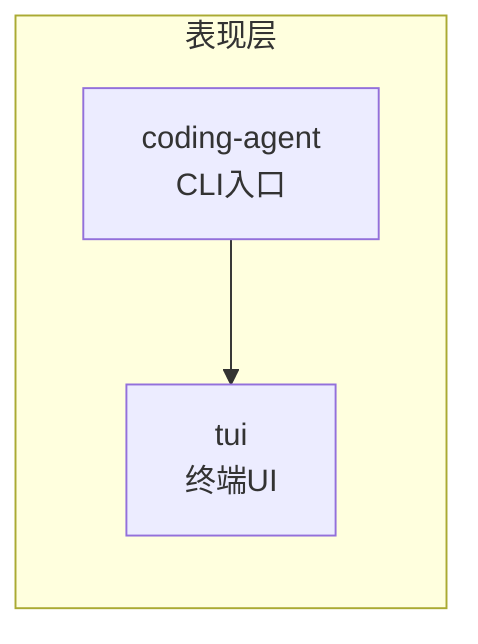
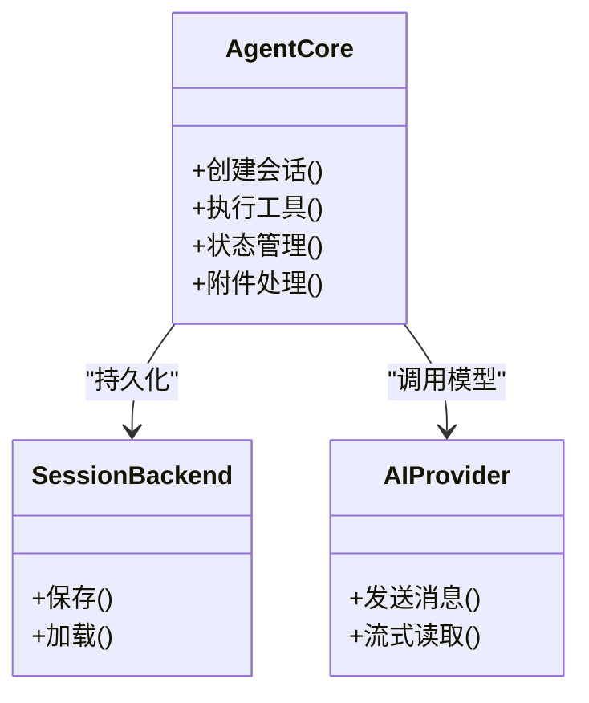
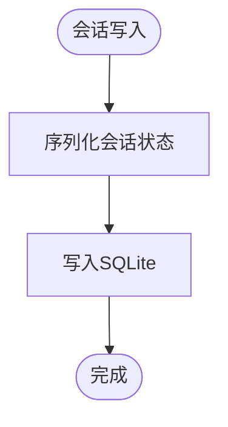
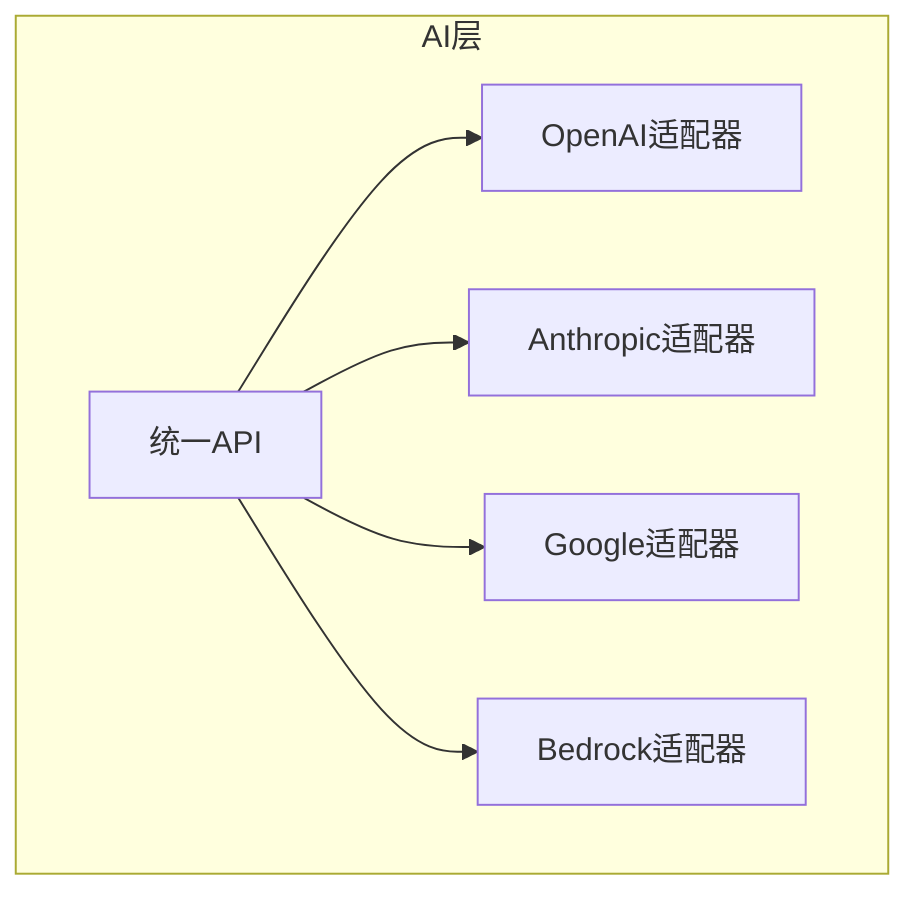
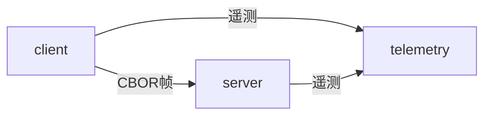
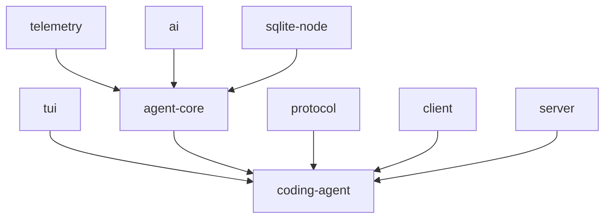

# 整体架构概览

<cite>
**本文引用的文件**
- [README.md](file://README.md)
- [package.json](file://package.json)
- [packages/agent/package.json](file://packages/agent/package.json)
- [packages/ai/package.json](file://packages/ai/package.json)
- [packages/coding-agent/package.json](file://packages/coding-agent/package.json)
- [packages/tui/package.json](file://packages/tui/package.json)
- [packages/session-backends/sqlite-node/package.json](file://packages/session-backends/sqlite-node/package.json)
- [packages/protocol/package.json](file://packages/protocol/package.json)
</cite>

## 目录
1. [简介](#简介)
2. [项目结构](#项目结构)
3. [核心组件](#核心组件)
4. [架构总览](#架构总览)
5. [详细组件分析](#详细组件分析)
6. [依赖关系分析](#依赖关系分析)
7. [性能考量](#性能考量)
8. [故障排查指南](#故障排查指南)
9. [结论](#结论)
10. [附录](#附录)

## 简介
本仓库是 Pi Agent Harness 的 monorepo，包含可扩展的编码代理、统一的 LLM 多供应商 API、终端 UI、协议与遥测等核心能力。系统采用插件化与适配器模式，将 AI 提供商抽象为可插拔实现；通过事件驱动与传输无关的协议，使会话可在不同运行时（CLI/TUI、RPC、远程）复用。包之间职责清晰：表现层负责交互，业务逻辑层管理状态与工具调用，数据访问层持久化会话，基础设施层统一对接多家 AI 服务。

## 项目结构
仓库采用 npm workspaces 组织的 monorepo，根 package.json 声明了 packages/* 及 session-backends/*、coding-agent/examples/extensions/* 等工作区。顶层脚本统一构建顺序，确保 TUI、Telemetry、AI、Agent、Protocol、Client、Server、Coding-Agent 按序编译。各包以独立版本发布，内部工作区包保持版本范围依赖，外部依赖精确锁定以提升供应链安全。

图表来源
- [package.json:5-13](file://package.json#L5-L13)
- [package.json:16-17](file://package.json#L16-L17)

章节来源
- [package.json:1-75](file://package.json#L1-L75)
- [README.md:26-35](file://README.md#L26-L35)

## 核心组件
- 表现层（TUI/CLI）
  - @earendil-works/pi-tui：提供终端界面与差分渲染能力，支撑高效文本应用。
  - @earendil-works/pi-coding-agent：交互式编码代理 CLI，暴露 read/bash/edit/write 等工具与会话管理。
- 业务逻辑层（Agent Core）
  - @earendil-works/pi-agent-core：通用 Agent 运行时，封装传输抽象、状态管理与附件支持，向上提供会话与工具调用能力。
- 数据访问层（Session Backends）
  - @earendil-works/pi-session-backend-sqlite-node：基于 SQLite 的 Node 端会话后端，实现 Agent Core 的会话持久化接口。
- 基础设施层（AI Providers）
  - @earendil-works/pi-ai：统一的多供应商 LLM API，自动模型发现与配置，屏蔽底层差异。
- 协议与遥测
  - @earendil-works/pi-protocol：传输无关的 CBOR 协议，用于远程会话通信。
  - @earendil-works/pi-telemetry：厂商中立的遥测契约、参考适配器和类型化 schema。

章节来源
- [packages/tui/package.json:1-56](file://packages/tui/package.json#L1-L56)
- [packages/coding-agent/package.json:1-109](file://packages/coding-agent/package.json#L1-L109)
- [packages/agent/package.json:1-69](file://packages/agent/package.json#L1-L69)
- [packages/session-backends/sqlite-node/package.json:1-45](file://packages/session-backends/sqlite-node/package.json#L1-L45)
- [packages/ai/package.json:1-101](file://packages/ai/package.json#L1-L101)
- [packages/protocol/package.json:1-49](file://packages/protocol/package.json#L1-L49)
- [README.md:26-35](file://README.md#L26-L35)

## 架构总览
下图展示了从用户输入到 AI 调用的端到端流程，体现“表现层 → 业务逻辑层 → 数据访问层 → 基础设施层”的分层与解耦。

图表来源
- [packages/coding-agent/package.json:45-66](file://packages/coding-agent/package.json#L45-L66)
- [packages/agent/package.json:37-44](file://packages/agent/package.json#L37-L44)
- [packages/session-backends/sqlite-node/package.json:36-39](file://packages/session-backends/sqlite-node/package.json#L36-L39)
- [packages/ai/package.json:62-73](file://packages/ai/package.json#L62-L73)

## 详细组件分析

### 表现层：TUI 与 CLI
- 职责边界
  - tui：专注终端渲染、差分更新、键盘事件处理，不感知业务语义。
  - coding-agent：编排用户命令、工具调用、会话生命周期，组合 tui 与 agent-core。
- 设计要点
  - CLI 作为入口，装配 tui 与 agent-core，并通过 protocol 暴露 RPC 能力。
  - 资源复制与二进制构建脚本保证产物完整与可移植性。

图表来源
- [packages/coding-agent/package.json:9-26](file://packages/coding-agent/package.json#L9-L26)
- [packages/tui/package.json:1-56](file://packages/tui/package.json#L1-L56)

章节来源
- [packages/coding-agent/package.json:1-109](file://packages/coding-agent/package.json#L1-L109)
- [packages/tui/package.json:1-56](file://packages/tui/package.json#L1-L56)

### 业务逻辑层：Agent Core
- 职责边界
  - 提供传输抽象、状态机、工具注册与执行、附件处理。
  - 通过 ai 包与提供商交互，通过 session backend 持久化会话。
- 设计要点
  - 插件化：工具与传输可插拔。
  - 事件驱动：状态变更与工具执行以事件形式传播，便于扩展与观测。
  - 遥测集成：使用 telemetry 契约记录关键指标。

图表来源
- [packages/agent/package.json:37-44](file://packages/agent/package.json#L37-L44)
- [packages/session-backends/sqlite-node/package.json:36-39](file://packages/session-backends/sqlite-node/package.json#L36-L39)
- [packages/ai/package.json:62-73](file://packages/ai/package.json#L62-L73)

章节来源
- [packages/agent/package.json:1-69](file://packages/agent/package.json#L1-L69)

### 数据访问层：Session Backends
- 职责边界
  - 实现 Agent Core 的会话接口，当前提供 SQLite 实现。
- 设计要点
  - 迁移脚本在构建时拷贝，确保数据库结构一致。
  - 与 AI 包无直接耦合，仅依赖 agent-core 的会话契约。

图表来源
- [packages/session-backends/sqlite-node/package.json:19-24](file://packages/session-backends/sqlite-node/package.json#L19-L24)

章节来源
- [packages/session-backends/sqlite-node/package.json:1-45](file://packages/session-backends/sqlite-node/package.json#L1-L45)

### 基础设施层：AI Providers
- 职责边界
  - 统一 LLM 调用接口，自动发现模型，管理认证与网络代理。
- 设计要点
  - 适配器模式：每个提供商实现 Provider，通过 createProvider 注册。
  - 多供应商：OpenAI、Anthropic、Google、Bedrock 等。
  - 遥测：集成 telemetry 契约进行指标上报。

图表来源
- [packages/ai/package.json:62-73](file://packages/ai/package.json#L62-L73)
- [packages/ai/package.json:13-42](file://packages/ai/package.json#L13-L42)

章节来源
- [packages/ai/package.json:1-101](file://packages/ai/package.json#L1-L101)

### 协议与遥测
- Protocol
  - 传输无关的 CBOR 协议，定义会话帧格式与类型，支撑 client/server 跨进程/网络通信。
- Telemetry
  - 厂商中立契约与参考实现，配合类型化 schema 保障一致性。

图表来源
- [packages/protocol/package.json:1-49](file://packages/protocol/package.json#L1-L49)
- [README.md:26-35](file://README.md#L26-L35)

章节来源
- [packages/protocol/package.json:1-49](file://packages/protocol/package.json#L1-L49)
- [README.md:26-35](file://README.md#L26-L35)

## 依赖关系分析
- 构建顺序与依赖链
  - 根脚本按固定顺序构建：tui → telemetry → ai → agent → sqlite-node → protocol → client → server → coding-agent。
  - coding-agent 依赖 agent-core、ai、client、protocol、tui。
  - agent-core 依赖 ai 与 telemetry。
  - sqlite-node 依赖 agent-core 与 ai。
- 版本策略
  - 工作区内部包使用 ^ 范围依赖，外部依赖精确锁定，提升可复现性与安全性。

图表来源
- [package.json:16-17](file://package.json#L16-L17)
- [packages/coding-agent/package.json:45-66](file://packages/coding-agent/package.json#L45-L66)
- [packages/agent/package.json:37-44](file://packages/agent/package.json#L37-L44)
- [packages/session-backends/sqlite-node/package.json:36-39](file://packages/session-backends/sqlite-node/package.json#L36-L39)

章节来源
- [package.json:1-75](file://package.json#L1-L75)
- [packages/coding-agent/package.json:45-66](file://packages/coding-agent/package.json#L45-L66)
- [packages/agent/package.json:37-44](file://packages/agent/package.json#L37-L44)
- [packages/session-backends/sqlite-node/package.json:36-39](file://packages/session-backends/sqlite-node/package.json#L36-L39)

## 性能考量
- 渲染性能
  - tui 采用差分渲染，减少终端重绘开销，适合长会话与高频更新场景。
- 构建与产物
  - 二进制构建脚本整合资源拷贝与编译，减少运行时缺失依赖风险。
- 网络与并发
  - ai 包内置代理支持与流式读取，有助于降低延迟与内存占用。
- 存储
  - sqlite-node 提供轻量级本地持久化，适合单机或容器化部署。

[本节为通用指导，不直接分析具体文件]

## 故障排查指南
- 依赖与构建
  - 若构建失败，优先检查根脚本的构建顺序与 node 版本要求。
  - 使用 check 系列脚本验证依赖锁定、TS 导入兼容性与 shrinkwrap。
- 运行环境
  - 默认以当前用户权限运行，如需隔离请使用容器或沙箱方案。
- 遥测与调试
  - 借助 telemetry 契约与测试套件定位问题；必要时启用离线模型数据构建以排除网络因素。

章节来源
- [package.json:18-24](file://package.json#L18-L24)
- [README.md:52-61](file://README.md#L52-L61)
- [README.md:38-47](file://README.md#L38-L47)

## 结论
Pi Agent Harness 通过清晰的层次划分与插件化设计，实现了高内聚、低耦合的系统架构。表现层聚焦交互，业务层专注状态与工具编排，数据层提供可替换的持久化实现，基础设施层统一对接多家 AI 提供商。结合传输无关的协议与遥测契约，系统具备良好的可测试性、可观测性与可移植性，适合在 CLI、TUI、RPC 等多种场景中复用。

[本节为总结性内容，不直接分析具体文件]

## 附录
- 快速开始
  - 安装依赖后执行构建与测试脚本，即可在源码环境下运行 pi。
- 安全与供应链
  - 外部依赖精确锁定，预提交钩子保护锁文件，CI 定期审计依赖。

章节来源
- [README.md:52-61](file://README.md#L52-L61)
- [README.md:76-88](file://README.md#L76-L88)