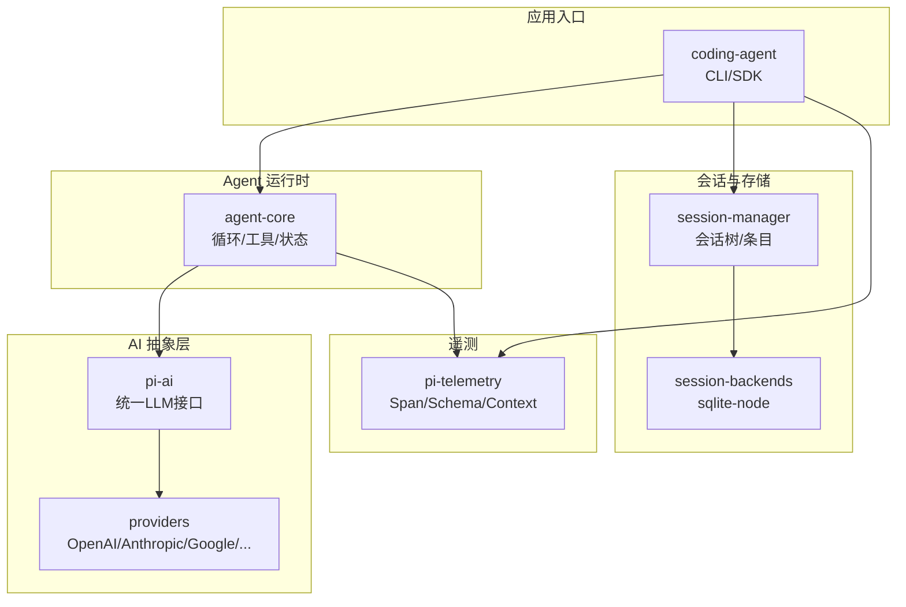
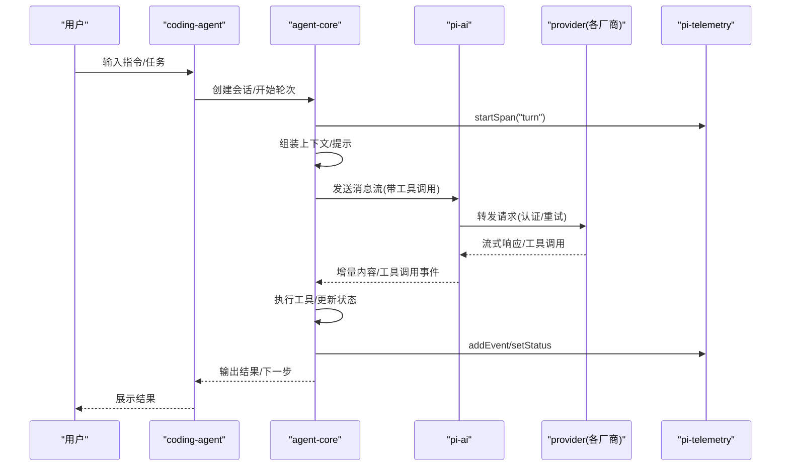
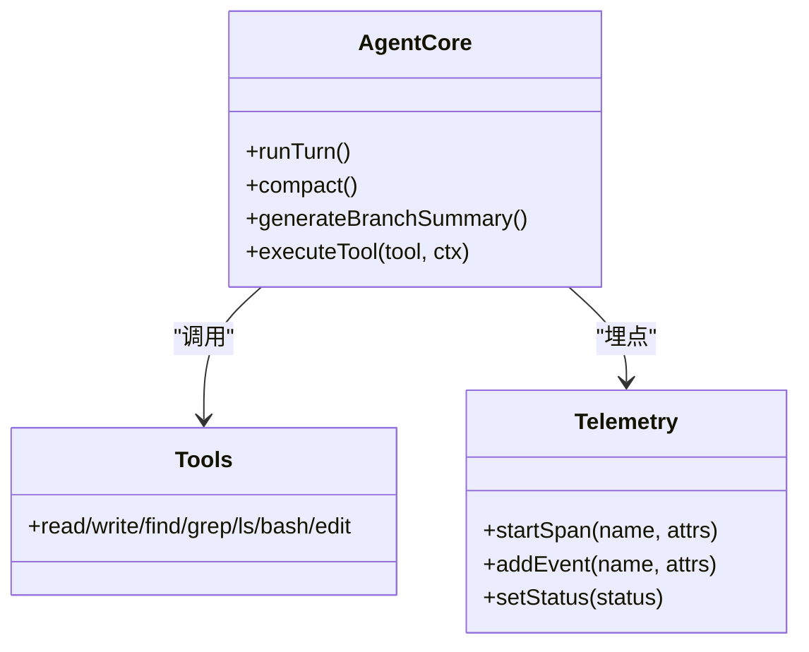
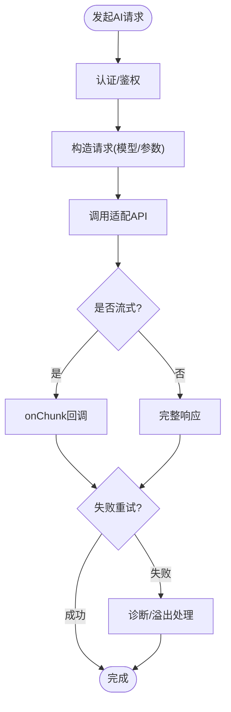
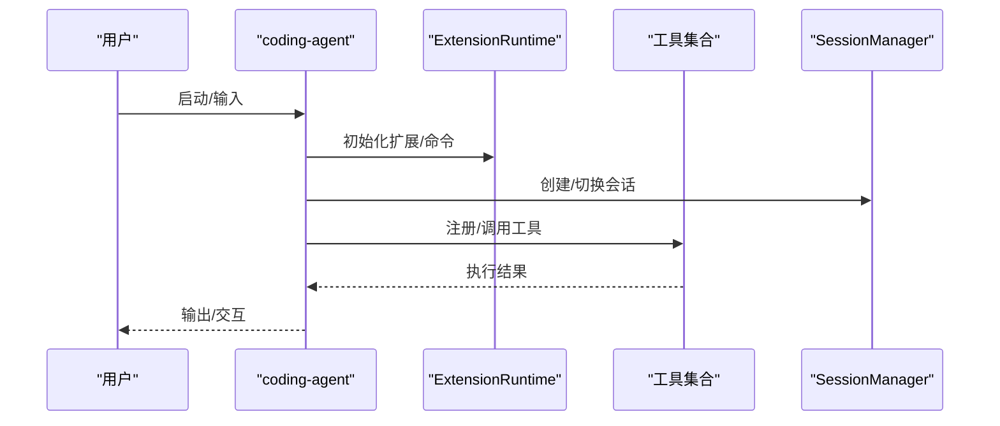
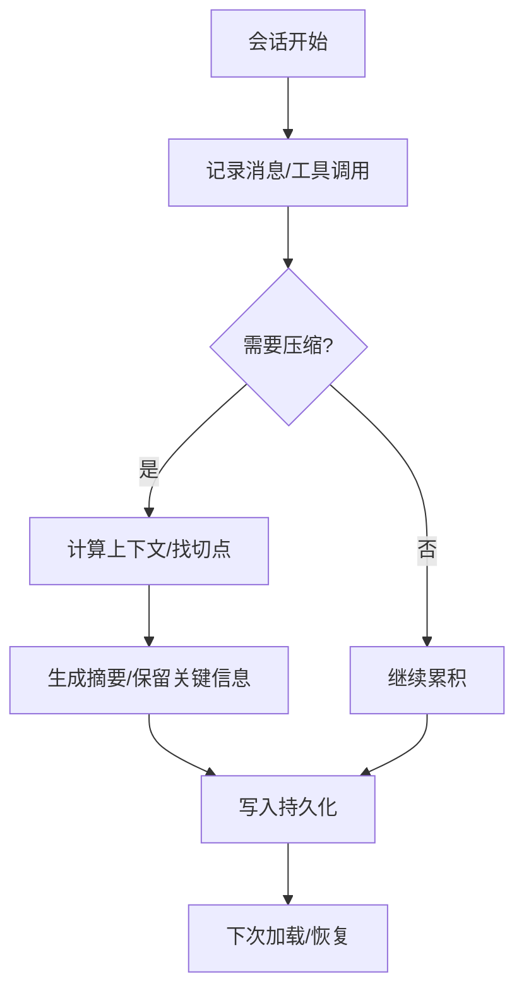
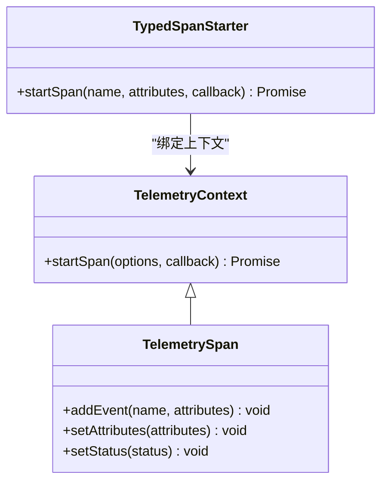
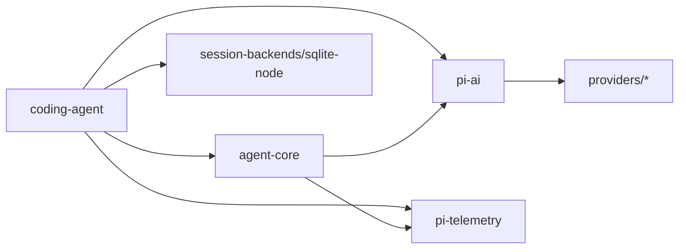

# 架构设计

<cite>
**本文引用的文件**
- [README.md](file://README.md)
- [package.json](file://package.json)
- [packages/agent/src/index.ts](file://packages/agent/src/index.ts)
- [packages/ai/src/index.ts](file://packages/ai/src/index.ts)
- [packages/ai/src/providers/moonshotai-cn.ts](file://packages/ai/src/providers/moonshotai-cn.ts)
- [packages/coding-agent/src/index.ts](file://packages/coding-agent/src/index.ts)
- [packages/telemetry/src/index.ts](file://packages/telemetry/src/index.ts)
</cite>

## 目录
1. [简介](#简介)
2. [项目结构](#项目结构)
3. [核心组件](#核心组件)
4. [架构总览](#架构总览)
5. [详细组件分析](#详细组件分析)
6. [依赖关系分析](#依赖关系分析)
7. [性能考虑](#性能考虑)
8. [故障排查指南](#故障排查指南)
9. [结论](#结论)
10. [附录](#附录)

## 简介
本架构文档面向 Pi Agent Harness，聚焦其模块化、插件化与适配器模式的设计，解释以下核心组件及其关系：Agent Core（代理运行时）、AI Abstraction（AI 抽象层）、Coding Agent（编码代理）、Session Management（会话管理）、Telemetry（遥测系统）。同时给出从用户输入到 AI 请求处理再到结果返回的数据流，以及扩展点（自定义工具、技能系统、提供商集成）的设计说明。文末包含系统边界、技术决策、性能与安全考量，并附架构图与数据流图，帮助开发者理解与扩展系统。

## 项目结构
Pi 采用多包 monorepo 组织，关键包职责如下：
- packages/agent：Agent 运行时、工具调用、状态管理、压缩与分支摘要、提示模板、遥测定义等。
- packages/ai：统一的多提供商 LLM API 抽象，提供认证、模型注册、事件流、重试、溢出处理等能力。
- packages/coding-agent：交互式编码代理 CLI、会话管理、扩展系统、技能加载、工具工厂、信任管理等。
- packages/telemetry：厂商无关的遥测契约、类型化 Span/Schema、内存实现与 NOOP 实现。
- packages/session-backends：会话持久化后端（如 sqlite-node）。
- packages/tui：终端 UI 库，支持差分渲染。
- packages/server/client/protocol：服务端/客户端/协议相关（用于 RPC 与远程交互）。

图表来源
- [packages/coding-agent/src/index.ts:1-409](file://packages/coding-agent/src/index.ts#L1-L409)
- [packages/agent/src/index.ts:1-146](file://packages/agent/src/index.ts#L1-L146)
- [packages/ai/src/index.ts:1-48](file://packages/ai/src/index.ts#L1-L48)
- [packages/telemetry/src/index.ts:1-358](file://packages/telemetry/src/index.ts#L1-L358)

章节来源
- [README.md:13-35](file://README.md#L13-L35)
- [package.json:1-75](file://package.json#L1-L75)

## 核心组件
- Agent Core（代理运行时）
  - 负责编排对话循环、工具调用、上下文压缩与分支摘要、提示模板组装、遥测埋点等。
  - 通过统一的工具接口与执行环境抽象，屏蔽底层文件系统/Shell 差异。
- AI Abstraction（AI 抽象层）
  - 提供统一的多提供商 LLM 接口，封装认证、模型目录、重试、事件流、溢出与诊断。
  - 通过 Provider 工厂与 API 适配，将不同厂商的差异收敛为一致调用方式。
- Coding Agent（编码代理）
  - 提供 CLI/SDK，组合会话管理、扩展系统、技能加载、工具工厂、信任管理与 TUI/RPC 模式。
  - 暴露 SessionManager、ModelRegistry、ExtensionRuntime 等核心能力。
- Session Management（会话管理）
  - 维护会话树、消息条目、压缩策略、分支摘要、上下文构建与迁移。
  - 与持久化后端（如 sqlite-node）协作，实现跨进程/跨次运行的状态恢复。
- Telemetry（遥测系统）
  - 定义厂商无关的 Span/Schema/Context，提供类型化的 Span 启动器与内存/NOOP 实现。
  - 贯穿 Agent 与 AI 调用链路，便于观测与排障。

章节来源
- [packages/agent/src/index.ts:1-146](file://packages/agent/src/index.ts#L1-L146)
- [packages/ai/src/index.ts:1-48](file://packages/ai/src/index.ts#L1-L48)
- [packages/coding-agent/src/index.ts:1-409](file://packages/coding-agent/src/index.ts#L1-L409)
- [packages/telemetry/src/index.ts:1-358](file://packages/telemetry/src/index.ts#L1-L358)

## 架构总览
整体采用“分层 + 插件化”的架构：
- 表现层：CLI/TUI/RPC 作为入口，接收用户输入并展示结果。
- 业务编排层：Agent Core 编排对话循环、工具执行、压缩与提示组装。
- 能力抽象层：AI Abstraction 统一 LLM 调用；Session Management 管理会话状态；Telemetry 提供可观测性。
- 扩展层：Provider 插件（不同 LLM 厂商）、工具插件（读写/搜索/编辑/命令）、技能（Skill）与扩展（Extension）。

图表来源
- [packages/coding-agent/src/index.ts:1-409](file://packages/coding-agent/src/index.ts#L1-L409)
- [packages/agent/src/index.ts:1-146](file://packages/agent/src/index.ts#L1-L146)
- [packages/ai/src/index.ts:1-48](file://packages/ai/src/index.ts#L1-L48)
- [packages/telemetry/src/index.ts:1-358](file://packages/telemetry/src/index.ts#L1-L358)

## 详细组件分析

### Agent Core（代理运行时）
- 职责
  - 编排对话循环：解析用户意图、生成提示、调度工具、处理工具结果、触发下一轮。
  - 上下文管理：会话压缩、分支摘要、消息序列化、Token 估算与裁剪。
  - 遥测埋点：以类型化 Schema 记录 Span/事件，便于追踪与诊断。
- 关键导出
  - 工具与执行环境抽象、提示模板、结果类型、压缩算法、遥测 Schema 与 Span 启动器。
- 设计要点
  - 工具与执行环境解耦：通过 FileSystem/Shell 抽象，便于在容器/沙箱中运行。
  - 可插拔遥测：默认使用内存或 NOOP 实现，生产可替换为外部采集器。

图表来源
- [packages/agent/src/index.ts:1-146](file://packages/agent/src/index.ts#L1-L146)
- [packages/telemetry/src/index.ts:1-358](file://packages/telemetry/src/index.ts#L1-L358)

章节来源
- [packages/agent/src/index.ts:1-146](file://packages/agent/src/index.ts#L1-L146)

### AI Abstraction（AI 抽象层）
- 职责
  - 统一 LLM 调用接口，屏蔽不同厂商差异。
  - 提供认证、模型目录、重试、事件流、溢出与诊断工具。
- 提供商集成机制
  - 通过 createProvider 与 api 适配（如 openai-completions），快速接入新厂商。
  - 示例：moonshotai-cn 使用环境变量鉴权，复用 OpenAI Completions API 适配。
- 设计要点
  - 无副作用的核心导出：避免全局注册，按需懒加载 API。
  - 类型安全：基于 TypeBox 的类型推断与校验。

图表来源
- [packages/ai/src/index.ts:1-48](file://packages/ai/src/index.ts#L1-L48)
- [packages/ai/src/providers/moonshotai-cn.ts:1-15](file://packages/ai/src/providers/moonshotai-cn.ts#L1-L15)

章节来源
- [packages/ai/src/index.ts:1-48](file://packages/ai/src/index.ts#L1-L48)
- [packages/ai/src/providers/moonshotai-cn.ts:1-15](file://packages/ai/src/providers/moonshotai-cn.ts#L1-L15)

### Coding Agent（编码代理）
- 职责
  - 提供 CLI/SDK 入口，组合会话管理、扩展系统、技能加载、工具工厂、信任管理。
  - 支持多种运行模式：交互式、打印、RPC。
- 关键能力
  - 会话管理：SessionManager、会话树、条目解析与迁移。
  - 扩展系统：ExtensionRuntime、工具注册、事件总线、UI 组件。
  - 技能系统：loadSkills/loadSkillsFromDir/formatSkillsForPrompt。
  - 工具工厂：createBashTool/createReadTool/createWriteTool/createEditTool 等。
- 设计要点
  - 插件化：通过 discoverAndLoadExtensions 动态发现与加载扩展。
  - 可配置：SettingsManager 管理主题、重试、图片设置等。

图表来源
- [packages/coding-agent/src/index.ts:1-409](file://packages/coding-agent/src/index.ts#L1-L409)

章节来源
- [packages/coding-agent/src/index.ts:1-409](file://packages/coding-agent/src/index.ts#L1-L409)

### Session Management（会话管理）
- 职责
  - 维护会话树与条目（消息、文件、模型变更、思考级别变化等）。
  - 提供压缩、分支摘要、上下文构建与迁移能力。
  - 与持久化后端（如 sqlite-node）协作，实现状态恢复。
- 关键导出
  - SessionManager、parseSessionEntries、buildSessionContext、migrateSessionEntries 等。
- 设计要点
  - 版本化：CURRENT_SESSION_VERSION 保证向后兼容。
  - 可扩展：CustomEntry/CustomMessageEntry 允许注入自定义条目。

图表来源
- [packages/coding-agent/src/index.ts:1-409](file://packages/coding-agent/src/index.ts#L1-L409)

章节来源
- [packages/coding-agent/src/index.ts:1-409](file://packages/coding-agent/src/index.ts#L1-L409)

### Telemetry（遥测系统）
- 职责
  - 定义厂商无关的 Span/Schema/Context，提供类型化 Span 启动器。
  - 提供 InMemoryTelemetryContext 与 NOOP 实现，便于测试与禁用。
- 关键能力
  - defineTelemetrySchema、createTypedSpanStarter、InMemoryTelemetryContext、NOOP_TELEMETRY_CONTEXT。
- 设计要点
  - 强类型：通过 Schema 推导 Span 名称、属性与事件类型，减少错误。
  - 可插拔：上层仅依赖接口，可替换具体实现。

图表来源
- [packages/telemetry/src/index.ts:1-358](file://packages/telemetry/src/index.ts#L1-L358)

章节来源
- [packages/telemetry/src/index.ts:1-358](file://packages/telemetry/src/index.ts#L1-L358)

## 依赖关系分析
- 包间依赖
  - coding-agent 依赖 agent-core、ai、telemetry、session-backends、tui。
  - agent-core 依赖 ai、telemetry，并暴露工具与压缩能力。
  - ai 提供 providers 与 api 适配，被 agent-core 与 coding-agent 共同使用。
  - telemetry 被所有上层模块引用，提供可观测性。
- 耦合与内聚
  - 通过接口与工厂降低耦合：Provider 工厂、工具工厂、扩展运行时。
  - 高内聚：每个包职责清晰，按功能域划分。

图表来源
- [package.json:1-75](file://package.json#L1-L75)
- [packages/coding-agent/src/index.ts:1-409](file://packages/coding-agent/src/index.ts#L1-L409)
- [packages/agent/src/index.ts:1-146](file://packages/agent/src/index.ts#L1-L146)
- [packages/ai/src/index.ts:1-48](file://packages/ai/src/index.ts#L1-L48)
- [packages/telemetry/src/index.ts:1-358](file://packages/telemetry/src/index.ts#L1-L358)

章节来源
- [package.json:1-75](file://package.json#L1-L75)

## 性能考虑
- 上下文压缩与分支摘要
  - 通过 calculateContextTokens、findCutPoint、generateSummary 控制 Token 使用，避免超限。
  - 分支摘要减少长会话的上下文膨胀，提升响应速度与成本效率。
- 流式处理与重试
  - AI 抽象层提供事件流与重试机制，降低网络抖动影响，提升用户体验。
- 资源隔离
  - 通过容器/沙箱运行工具与命令，限制文件系统/进程/网络权限，提高稳定性与安全性。
- 遥测开销
  - 使用 NOOP 或轻量内存实现进行开发/测试；生产可替换为高效采集器。

[本节为通用指导，不直接分析具体文件]

## 故障排查指南
- 常见问题定位
  - 使用 Telemetry 的 Span/事件追踪调用链，结合 InMemoryTelemetryContext 捕获调试信息。
  - 检查 Provider 认证与环境变量是否正确配置（如 MOONSHOT_API_KEY）。
  - 查看会话条目与压缩日志，确认上下文是否合理。
- 工具执行问题
  - 通过工具执行事件（ToolExecutionStart/Update/End）定位失败环节。
  - 在受限环境中确认 Shell/FS 抽象是否映射到正确实现。
- 会话恢复
  - 检查 session-backends 连接与表结构，确保迁移脚本已执行。

章节来源
- [packages/telemetry/src/index.ts:1-358](file://packages/telemetry/src/index.ts#L1-L358)
- [packages/ai/src/providers/moonshotai-cn.ts:1-15](file://packages/ai/src/providers/moonshotai-cn.ts#L1-L15)
- [packages/coding-agent/src/index.ts:1-409](file://packages/coding-agent/src/index.ts#L1-L409)

## 结论
Pi Agent Harness 通过清晰的层次划分与插件化设计，实现了可扩展的编码代理系统。Agent Core 负责编排与状态管理，AI Abstraction 统一 LLM 调用，Coding Agent 提供交互与扩展能力，Session Management 保障会话一致性，Telemetry 提供可观测性。借助 Provider 工厂、工具工厂与技能系统，开发者可以便捷地集成新厂商、扩展工具与技能，满足多样化需求。

[本节为总结，不直接分析具体文件]

## 附录
- 系统边界
  - 默认以当前用户权限运行，如需更强隔离，建议使用容器/沙箱（参考 README 中的三种模式）。
- 技术决策
  - 多包 monorepo：便于独立演进与复用。
  - 类型化遥测：通过 Schema 与类型推断提升可靠性。
  - 无副作用核心导出：按需懒加载，降低启动开销。
- 扩展点
  - 自定义工具：通过 defineTool 与工具工厂注册。
  - 技能系统：loadSkills/loadSkillsFromDir 加载 YAML/Markdown 技能。
  - 提供商集成：createProvider + api 适配快速接入新厂商。

[本节为补充说明，不直接分析具体文件]