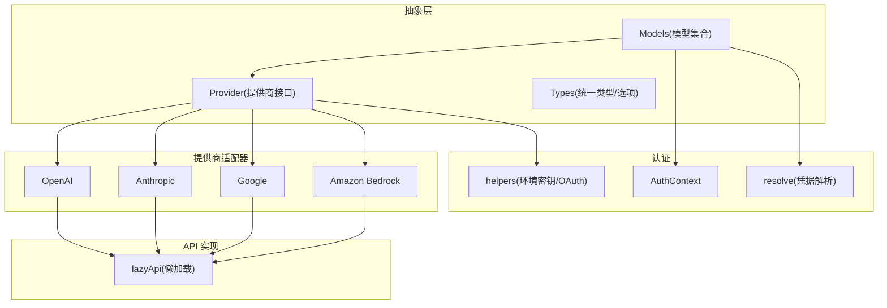
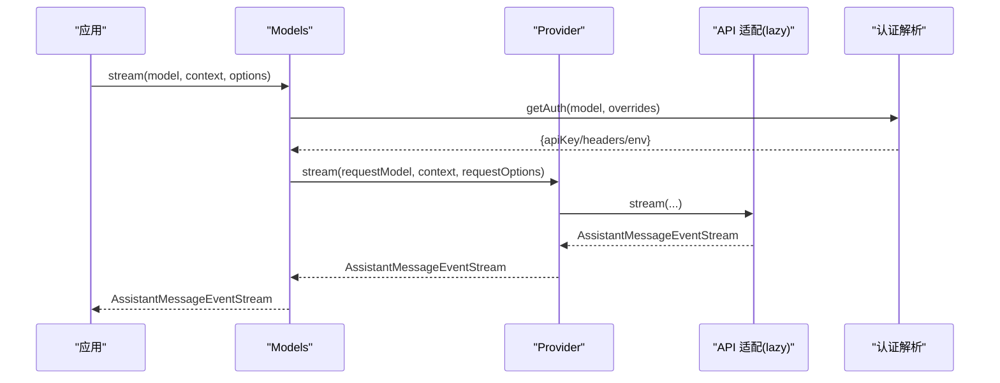
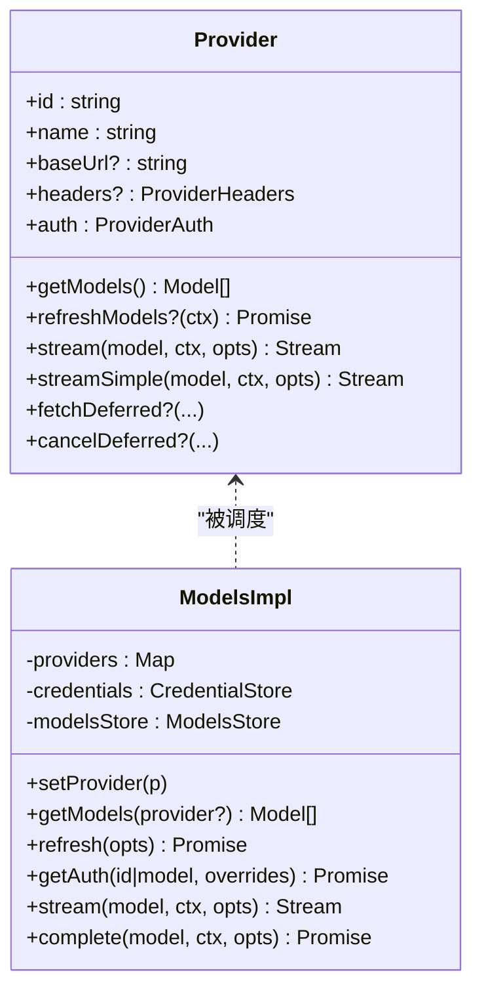
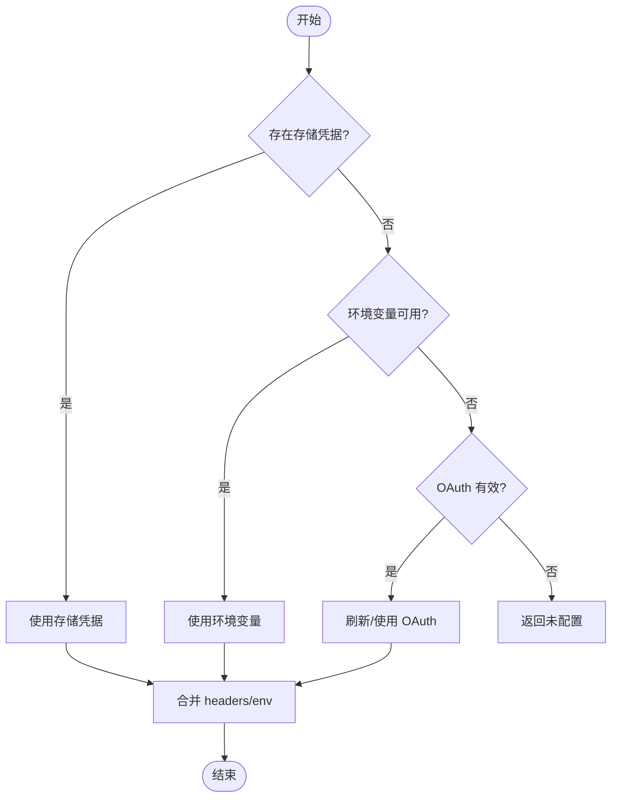
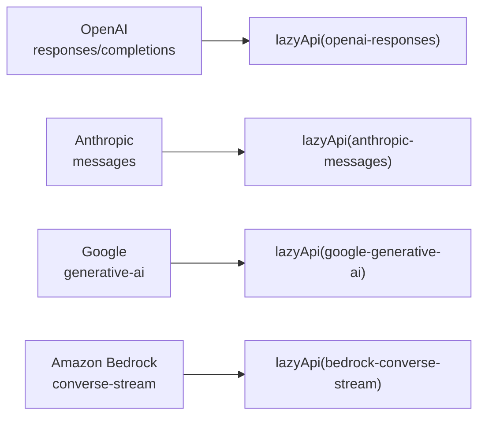
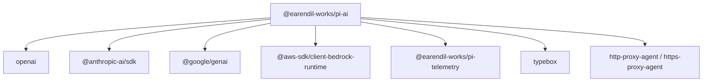

# AI 抽象层

<cite>
**本文引用的文件**
- [packages/ai/src/index.ts](file://packages/ai/src/index.ts)
- [packages/ai/src/models.ts](file://packages/ai/src/models.ts)
- [packages/ai/src/types.ts](file://packages/ai/src/types.ts)
- [packages/ai/src/providers/all.ts](file://packages/ai/src/providers/all.ts)
- [packages/ai/src/providers/openai.ts](file://packages/ai/src/providers/openai.ts)
- [packages/ai/src/providers/anthropic.ts](file://packages/ai/src/providers/anthropic.ts)
- [packages/ai/src/providers/google.ts](file://packages/ai/src/providers/google.ts)
- [packages/ai/src/providers/amazon-bedrock.ts](file://packages/ai/src/providers/amazon-bedrock.ts)
- [packages/ai/src/api/lazy.ts](file://packages/ai/src/api/lazy.ts)
- [packages/ai/src/auth/context.ts](file://packages/ai/src/auth/context.ts)
- [packages/ai/src/auth/helpers.ts](file://packages/ai/src/auth/helpers.ts)
- [packages/ai/src/auth/resolve.ts](file://packages/ai/src/auth/resolve.ts)
- [packages/ai/src/utils/retry.ts](file://packages/ai/src/utils/retry.ts)
- [packages/ai/package.json](file://packages/ai/package.json)
</cite>

## 目录
1. [简介](#简介)
2. [项目结构](#项目结构)
3. [核心组件](#核心组件)
4. [架构总览](#架构总览)
5. [详细组件分析](#详细组件分析)
6. [依赖关系分析](#依赖关系分析)
7. [性能考量](#性能考量)
8. [故障排查指南](#故障排查指南)
9. [结论](#结论)
10. [附录](#附录)

## 简介
本仓库中的 @earendil-works/pi-ai 提供了统一的 LLM API 抽象层，屏蔽不同 AI 提供商（OpenAI、Anthropic、Google、AWS Bedrock 等）的差异，提供一致的模型发现、认证管理、流式响应与重试机制。通过“提供商适配器模式”，上层应用只需面向统一接口调用，即可在多种后端之间切换或组合使用。

## 项目结构
- 入口与导出：index.ts 暴露类型、工具函数、认证上下文、模型集合与事件流等核心能力。
- 模型与提供者：models.ts 定义 Provider、Models 抽象与实现；providers/* 为各提供商适配器；all.ts 聚合内置提供商。
- 类型与选项：types.ts 统一定义请求/流式选项、消息协议、模型元数据、兼容性开关等。
- API 适配层：api/* 按提供商/协议拆分具体实现，并通过 lazyApi 懒加载以降低启动开销。
- 认证与凭据：auth/* 提供环境密钥解析、OAuth、凭据存储与解析流程。
- 工具与重试：utils/* 提供重试、事件流、诊断等通用能力。

图表来源
- [packages/ai/src/models.ts:97-149](file://packages/ai/src/models.ts#L97-L149)
- [packages/ai/src/providers/all.ts:88-131](file://packages/ai/src/providers/all.ts#L88-L131)
- [packages/ai/src/api/lazy.ts:73-73](file://packages/ai/src/api/lazy.ts#L73-L73)
- [packages/ai/src/auth/context.ts:23-23](file://packages/ai/src/auth/context.ts#L23-L23)
- [packages/ai/src/auth/helpers.ts:1-1](file://packages/ai/src/auth/helpers.ts#L1-L1)
- [packages/ai/src/auth/resolve.ts:50-50](file://packages/ai/src/auth/resolve.ts#L50-L50)

章节来源
- [packages/ai/src/index.ts:1-48](file://packages/ai/src/index.ts#L1-L48)
- [packages/ai/package.json:1-101](file://packages/ai/package.json#L1-L101)

## 核心组件
- Provider（提供商）：封装 id/name/baseUrl、认证方式、模型列表、流式行为与可选的延迟响应能力。每个提供商必须声明 auth（至少 apiKey），即使仅支持环境变量或本地服务。
- Models（模型集合）：注册/查询 Provider，合并模型列表，刷新动态模型，解析认证，统一调度到对应 Provider 的 stream/complete/fetchDeferred/cancelDeferred。
- Types（统一类型）：定义 Api、StreamOptions、Message、AssistantMessageEventStream、兼容性配置（如 OpenAI/Anthropic/Bedrock/Gemini 差异）、缓存保留策略、传输方式等。
- API 适配层：按协议拆分实现（如 openai-responses、anthropic-messages、google-generative-ai、bedrock-converse-stream），通过 lazyApi 按需加载，减少冷启动成本。
- 认证系统：支持 apiKey、OAuth、环境密钥与环境覆盖；Models 负责读取凭据、刷新 OAuth、合并 headers/env，并向上游 Provider 传递。

章节来源
- [packages/ai/src/models.ts:97-223](file://packages/ai/src/models.ts#L97-L223)
- [packages/ai/src/types.ts:17-27](file://packages/ai/src/types.ts#L17-L27)
- [packages/ai/src/types.ts:120-219](file://packages/ai/src/types.ts#L120-L219)
- [packages/ai/src/types.ts:268-277](file://packages/ai/src/types.ts#L268-L277)
- [packages/ai/src/api/lazy.ts:73-73](file://packages/ai/src/api/lazy.ts#L73-L73)

## 架构总览
统一 API 设计围绕“提供商适配器模式”展开：
- 所有提供商实现 Provider 接口，对外暴露 getModels/stream/complete 等方法。
- Models 作为编排层，负责认证解析、模型发现与分发，屏蔽底层差异。
- API 适配模块按协议实现具体流式处理，通过 lazyApi 懒加载，避免不必要的依赖。
- 认证由 auth/* 统一管理，支持多源（环境变量、存储、OAuth），并提供可插拔的交互登录流程。

图表来源
- [packages/ai/src/models.ts:667-688](file://packages/ai/src/models.ts#L667-L688)
- [packages/ai/src/models.ts:544-563](file://packages/ai/src/models.ts#L544-L563)
- [packages/ai/src/api/lazy.ts:73-73](file://packages/ai/src/api/lazy.ts#L73-L73)

## 详细组件分析

### 提供商适配器模式与模型发现
- createProvider：将 id/name/baseUrl/auth/models/api 组装成 Provider；支持静态模型与 fetchModels 动态叠加；根据 model.api 分派到对应 ProviderStreams。
- ModelsImpl：维护 Provider 集合，提供 getModels/getAvailable/refresh/login/logout 等能力；并发刷新动态模型，持久化 catalog，失败不阻断整体流程。
- 内置提供商聚合：all.ts 集中注册所有内置提供商，便于一键初始化。

图表来源
- [packages/ai/src/models.ts:97-149](file://packages/ai/src/models.ts#L97-L149)
- [packages/ai/src/models.ts:254-318](file://packages/ai/src/models.ts#L254-L318)
- [packages/ai/src/models.ts:386-446](file://packages/ai/src/models.ts#L386-L446)
- [packages/ai/src/providers/all.ts:88-131](file://packages/ai/src/providers/all.ts#L88-L131)

章节来源
- [packages/ai/src/models.ts:735-800](file://packages/ai/src/models.ts#L735-L800)
- [packages/ai/src/providers/all.ts:1-156](file://packages/ai/src/providers/all.ts#L1-L156)

### 认证管理（ApiKey、OAuth、环境覆盖）
- envApiKeyAuth：从指定环境变量读取 apiKey，简化常见场景。
- Anthropic 自定义 apiKey 解析：支持存储密钥、专用令牌、OAuth token、API key 等多源优先级。
- Bedrock 认证：支持 bearer token、AWS profile、默认凭证链（IAM/ECS/WebIdentity）。
- Models.getAuth：合并 provider 默认头与请求级覆盖，注入 env 与 baseUrl 覆盖。

图表来源
- [packages/ai/src/providers/anthropic.ts:9-41](file://packages/ai/src/providers/anthropic.ts#L9-L41)
- [packages/ai/src/providers/amazon-bedrock.ts:11-79](file://packages/ai/src/providers/amazon-bedrock.ts#L11-L79)
- [packages/ai/src/models.ts:636-665](file://packages/ai/src/models.ts#L636-L665)
- [packages/ai/src/auth/helpers.ts:1-1](file://packages/ai/src/auth/helpers.ts#L1-L1)

章节来源
- [packages/ai/src/providers/anthropic.ts:1-60](file://packages/ai/src/providers/anthropic.ts#L1-L60)
- [packages/ai/src/providers/amazon-bedrock.ts:1-91](file://packages/ai/src/providers/amazon-bedrock.ts#L1-L91)
- [packages/ai/src/auth/resolve.ts:50-50](file://packages/ai/src/auth/resolve.ts#L50-L50)

### 各 AI 提供商适配实现
- OpenAI：基于 responses/completions 适配，baseUrl 指向官方端点，apiKey 来自环境变量。
- Anthropic：messages 适配，支持 OAuth（Claude Pro/Max）与多源 apiKey 解析。
- Google：generative-ai 适配，apiKey 来自 GEMINI_API_KEY。
- Amazon Bedrock：converse-stream 适配，支持多种 AWS 认证方式与无感鉴权。

图表来源
- [packages/ai/src/providers/openai.ts:1-16](file://packages/ai/src/providers/openai.ts#L1-L16)
- [packages/ai/src/providers/anthropic.ts:1-60](file://packages/ai/src/providers/anthropic.ts#L1-L60)
- [packages/ai/src/providers/google.ts:1-16](file://packages/ai/src/providers/google.ts#L1-L16)
- [packages/ai/src/providers/amazon-bedrock.ts:1-91](file://packages/ai/src/providers/amazon-bedrock.ts#L1-L91)
- [packages/ai/src/api/lazy.ts:73-73](file://packages/ai/src/api/lazy.ts#L73-L73)

章节来源
- [packages/ai/src/providers/openai.ts:1-16](file://packages/ai/src/providers/openai.ts#L1-L16)
- [packages/ai/src/providers/anthropic.ts:1-60](file://packages/ai/src/providers/anthropic.ts#L1-L60)
- [packages/ai/src/providers/google.ts:1-16](file://packages/ai/src/providers/google.ts#L1-L16)
- [packages/ai/src/providers/amazon-bedrock.ts:1-91](file://packages/ai/src/providers/amazon-bedrock.ts#L1-L91)

### 模型选择策略与参数透传
- 模型来源：静态模型（catalog）+ 动态刷新（fetchModels），Models 会合并两者并去重。
- 可用性过滤：filterModels 可按凭据裁剪可用模型集。
- 参数透传：StreamOptions.samplingParams 会被合并到请求体，用于 OpenAI 兼容 API；其他 API 忽略未知字段。
- 会话与缓存：sessionId 可用于会话亲和路由；cacheRetention 控制提示词缓存保留时长。

章节来源
- [packages/ai/src/models.ts:735-800](file://packages/ai/src/models.ts#L735-L800)
- [packages/ai/src/types.ts:175-219](file://packages/ai/src/types.ts#L175-L219)

### 请求重试机制
- 重试配置：ProviderRequestOptions.maxRetries、maxRetryDelayMs 允许对支持客户端重试的 SDK 进行限制与封顶。
- 超时控制：timeoutMs 控制 HTTP 请求超时；websocketConnectTimeoutMs 控制 WebSocket 连接握手超时。
- 错误传播：流式错误以事件形式上报，上层可据此决定重试或降级。

章节来源
- [packages/ai/src/types.ts:120-173](file://packages/ai/src/types.ts#L120-L173)
- [packages/ai/src/utils/retry.ts:1-1](file://packages/ai/src/utils/retry.ts#L1-L1)

### 流式响应处理
- 统一事件协议：AssistantMessageEventStream 提供 start/text_delta/toolcall_start/done/error 等事件，保证跨提供商一致消费。
- 懒加载 API：lazyApi 按需引入具体实现，降低启动成本。
- 简单流式：streamSimple/completeSimple 提供便捷方法，自动处理推理级别与延迟响应。

章节来源
- [packages/ai/src/types.ts:515-539](file://packages/ai/src/types.ts#L515-L539)
- [packages/ai/src/api/lazy.ts:73-73](file://packages/ai/src/api/lazy.ts#L73-L73)
- [packages/ai/src/models.ts:690-704](file://packages/ai/src/models.ts#L690-L704)

### 集成新提供商的步骤（示例说明）
- 创建适配器工厂：实现 Provider，包含 id/name/baseUrl/auth/models/api。
- 实现认证：使用 envApiKeyAuth 或自定义 apiKey/oauth 解析逻辑。
- 绑定 API 适配：通过 lazyApi 绑定对应协议实现（如 openai-responses、anthropic-messages）。
- 注册到集合：在 all.ts 中新增 provider 工厂并加入 builtinProviders。
- 生成模型目录：运行脚本生成模型清单，确保 getModels 返回正确模型。

章节来源
- [packages/ai/src/providers/all.ts:88-131](file://packages/ai/src/providers/all.ts#L88-L131)
- [packages/ai/src/providers/openai.ts:1-16](file://packages/ai/src/providers/openai.ts#L1-L16)
- [packages/ai/src/providers/anthropic.ts:1-60](file://packages/ai/src/providers/anthropic.ts#L1-L60)
- [packages/ai/src/providers/google.ts:1-16](file://packages/ai/src/providers/google.ts#L1-L16)
- [packages/ai/src/providers/amazon-bedrock.ts:1-91](file://packages/ai/src/providers/amazon-bedrock.ts#L1-L91)

### 配置不同模型参数的实践要点
- 采样参数：通过 StreamOptions.samplingParams 传入 top_p/top_k/min_p 等，仅对 OpenAI 兼容 API 生效。
- 思考/推理：SimpleStreamOptions.reasoning 与 thinkingBudgets 控制推理强度与预算（token 型提供商）。
- 传输与缓存：transport 选择 sse/websocket/auto；cacheRetention 控制缓存保留策略；sessionId 用于会话亲和。
- 头部与环境：headers 与 env 可在请求级覆盖 provider 默认值，适用于代理、区域设置等。

章节来源
- [packages/ai/src/types.ts:175-219](file://packages/ai/src/types.ts#L175-L219)
- [packages/ai/src/types.ts:303-310](file://packages/ai/src/types.ts#L303-L310)

## 依赖关系分析
- 外部依赖：openai、@anthropic-ai/sdk、@google/genai、@aws-sdk/client-bedrock-runtime 等，分别对应各提供商 SDK。
- 内部依赖：pi-telemetry 用于遥测；typebox 用于类型校验；http-proxy-agent/https-proxy-agent 支持代理。
- 包导出：package.json 定义了多个子路径导出（compat、providers/*、api/*、oauth、bedrock-provider、bun-oauth），便于按需引入。

图表来源
- [packages/ai/package.json:62-74](file://packages/ai/package.json#L62-L74)

章节来源
- [packages/ai/package.json:1-101](file://packages/ai/package.json#L1-L101)

## 性能考量
- 懒加载 API：通过 lazyApi 按需引入具体实现，减少冷启动时间与内存占用。
- 并发刷新：Models.refresh 并发刷新多个 Provider 的动态模型，提升目录更新效率。
- 传输优化：支持 SSE/WebSocket 等多种传输，结合 websocketConnectTimeoutMs 与 timeoutMs 平衡时延与稳定性。
- 缓存策略：利用 cacheRetention 与 sessionId 提高提示词缓存命中率，降低重复请求成本。
- 重试上限：通过 maxRetries 与 maxRetryDelayMs 控制重试次数与等待上限，避免雪崩。

[本节为通用指导，无需特定文件引用]

## 故障排查指南
- 认证失败：检查环境变量、存储凭据与 OAuth 有效性；确认 provider 是否已配置完整。
- 模型不可用：确认 filterModels 是否过滤了目标模型；必要时执行 refresh 获取最新目录。
- 流式错误：关注 error 事件中的 stopReason 与 errorMessage，定位上游错误或中断原因。
- 超时与重试：调整 timeoutMs、maxRetries、maxRetryDelayMs；对于长轮询/延迟响应，合理设置 wait 与 deferred。
- 代理与网络：如需代理，确保 http-proxy-agent/https-proxy-agent 配置正确；验证 baseUrl 与 region 设置。

章节来源
- [packages/ai/src/auth/resolve.ts:50-50](file://packages/ai/src/auth/resolve.ts#L50-L50)
- [packages/ai/src/models.ts:386-446](file://packages/ai/src/models.ts#L386-L446)
- [packages/ai/src/types.ts:120-173](file://packages/ai/src/types.ts#L120-L173)

## 结论
该 AI 抽象层通过 Provider 适配器与 Models 编排，实现了多提供商的统一接入、模型发现、认证管理与流式响应。借助懒加载、并发刷新、重试与缓存等机制，系统在可扩展性与性能之间取得良好平衡。新增提供商只需遵循统一接口与认证约定，即可快速集成。

[本节为总结性内容，无需特定文件引用]

## 附录
- 统一类型参考：Api、StreamOptions、Message、AssistantMessageEventStream、兼容性配置等。
- 提供商适配器参考：OpenAI、Anthropic、Google、Amazon Bedrock 的具体实现与认证策略。
- 工具与重试：retry、event-stream、diagnostics 等通用能力。

章节来源
- [packages/ai/src/types.ts:17-27](file://packages/ai/src/types.ts#L17-L27)
- [packages/ai/src/types.ts:120-219](file://packages/ai/src/types.ts#L120-L219)
- [packages/ai/src/types.ts:515-539](file://packages/ai/src/types.ts#L515-L539)
- [packages/ai/src/providers/openai.ts:1-16](file://packages/ai/src/providers/openai.ts#L1-L16)
- [packages/ai/src/providers/anthropic.ts:1-60](file://packages/ai/src/providers/anthropic.ts#L1-L60)
- [packages/ai/src/providers/google.ts:1-16](file://packages/ai/src/providers/google.ts#L1-L16)
- [packages/ai/src/providers/amazon-bedrock.ts:1-91](file://packages/ai/src/providers/amazon-bedrock.ts#L1-L91)
- [packages/ai/src/utils/retry.ts:1-1](file://packages/ai/src/utils/retry.ts#L1-L1)