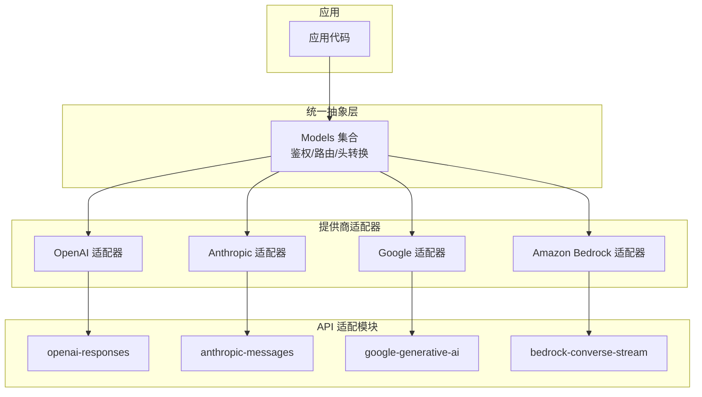
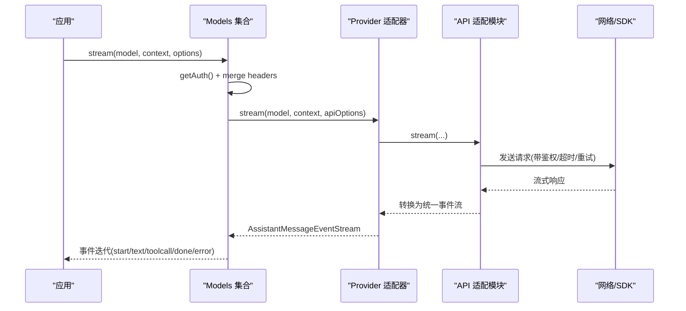
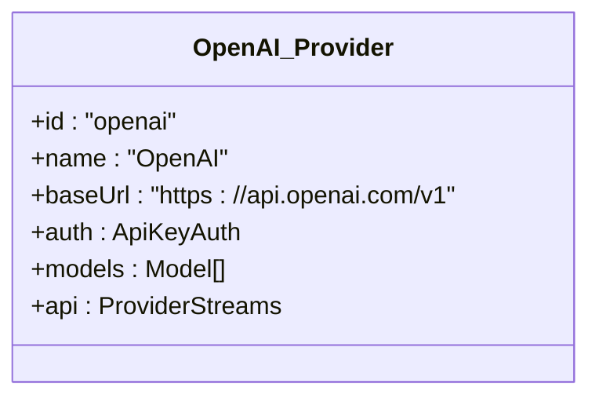
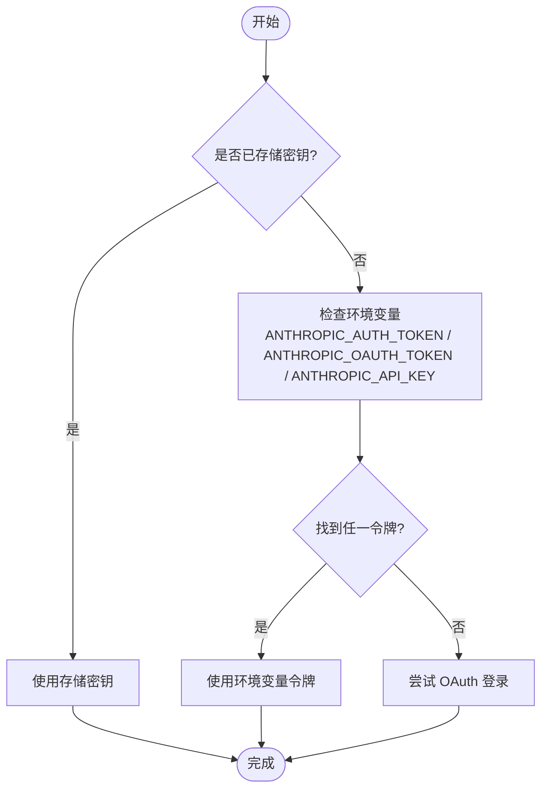
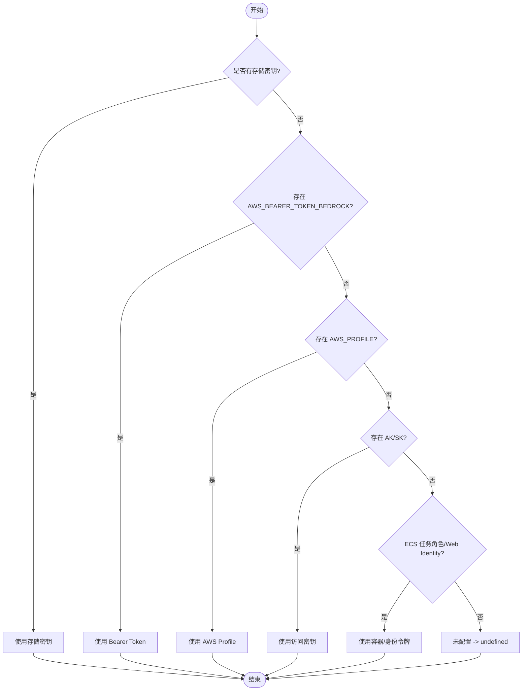
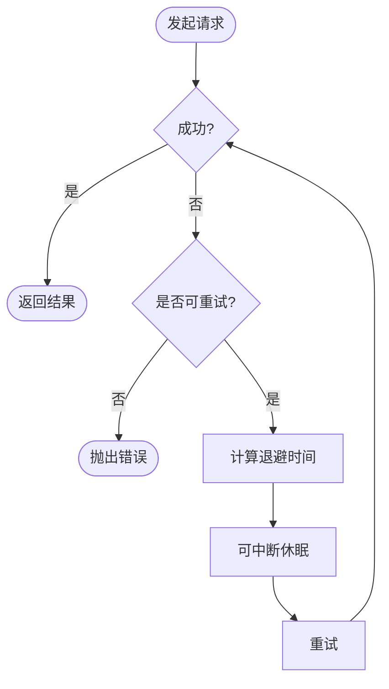
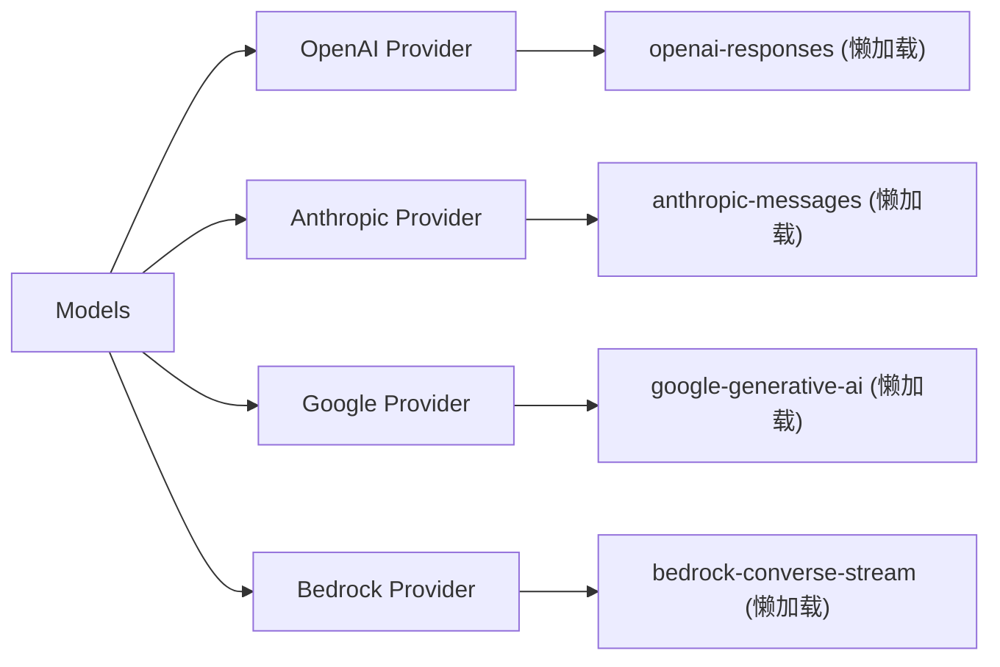

# AI 提供商适配器

<cite>
**本文引用的文件**
- [README.md](file://packages/ai/README.md)
- [types.ts](file://packages/ai/src/types.ts)
- [models.ts](file://packages/ai/src/models.ts)
- [openai.ts](file://packages/ai/src/providers/openai.ts)
- [anthropic.ts](file://packages/ai/src/providers/anthropic.ts)
- [google.ts](file://packages/ai/src/providers/google.ts)
- [amazon-bedrock.ts](file://packages/ai/src/providers/amazon-bedrock.ts)
- [provider-retry.ts](file://packages/ai/src/utils/provider-retry.ts)
</cite>

## 目录
1. [简介](#简介)
2. [项目结构](#项目结构)
3. [核心组件](#核心组件)
4. [架构总览](#架构总览)
5. [详细组件分析](#详细组件分析)
6. [依赖关系分析](#依赖关系分析)
7. [性能考量](#性能考量)
8. [故障排查指南](#故障排查指南)
9. [结论](#结论)
10. [附录](#附录)

## 简介
本仓库的 @earendil-works/pi-ai 提供统一的 LLM API 抽象层，屏蔽不同 AI 提供商（OpenAI、Anthropic Claude、Google Gemini、AWS Bedrock 等）的差异，统一认证解析、模型目录、流式响应、工具调用、思考/推理能力与成本统计。通过“提供商适配器模式”，每个 Provider 封装其鉴权、模型清单与底层 API 实现；Models 集合负责路由请求、合并头部、处理重试与错误，向上暴露一致的流式事件协议。

## 项目结构
- packages/ai/src/providers：各提供商适配器工厂（如 openaiProvider、anthropicProvider、googleProvider、amazonBedrockProvider），声明 id、name、baseUrl、auth、models、api。
- packages/ai/src/api：各 API 适配模块（如 openai-responses、anthropic-messages、google-generative-ai、bedrock-converse-stream），导出 stream/streamSimple 等统一接口。
- packages/ai/src/auth：认证解析、OAuth、凭据存储与环境变量读取。
- packages/ai/src/utils：通用工具（如 provider-retry 重试策略）。
- packages/ai/src/models.ts：Provider 与 Models 的核心类型与运行时集合，负责鉴权合并、请求头转换、分发到具体 Provider。
- packages/ai/src/types.ts：统一的数据模型与选项类型（Model、Context、AssistantMessage、StreamOptions、Api 枚举等）。

图表来源
- [models.ts:88-149](file://packages/ai/src/models.ts#L88-L149)
- [openai.ts:1-16](file://packages/ai/src/providers/openai.ts#L1-L16)
- [anthropic.ts:1-60](file://packages/ai/src/providers/anthropic.ts#L1-L60)
- [google.ts:1-16](file://packages/ai/src/providers/google.ts#L1-L16)
- [amazon-bedrock.ts:1-91](file://packages/ai/src/providers/amazon-bedrock.ts#L1-L91)

章节来源
- [README.md:1-120](file://packages/ai/README.md#L1-L120)
- [models.ts:88-149](file://packages/ai/src/models.ts#L88-L149)

## 核心组件
- Provider 接口：定义 id/name/baseUrl、auth、getModels、refreshModels、stream/streamSimple 等，是适配器的最小契约。
- Models 集合：维护多个 Provider，负责 getAuth 解析、transformHeaders 合并、将请求分派给对应 Provider。
- 统一类型：Model、Context、AssistantMessage、StopReason、StreamOptions、Api 枚举等，保证跨提供商一致的数据形态。
- 认证系统：支持 API Key、OAuth、环境变量、AWS 默认凭证链等，按 Provider 粒度解析并注入请求。
- 重试机制：基于 OpenAI/Anthropic SDK 的重试策略，支持可中断的指数退避与服务器重试头。

章节来源
- [types.ts:17-33](file://packages/ai/src/types.ts#L17-L33)
- [types.ts:119-219](file://packages/ai/src/types.ts#L119-L219)
- [types.ts:268-330](file://packages/ai/src/types.ts#L268-L330)
- [types.ts:415-476](file://packages/ai/src/types.ts#L415-L476)
- [models.ts:88-149](file://packages/ai/src/models.ts#L88-L149)
- [provider-retry.ts:22-67](file://packages/ai/src/utils/provider-retry.ts#L22-L67)

## 架构总览
- 统一入口：应用通过 Models.stream/complete 发起请求。
- 鉴权与头部：Models.getAuth 解析 Provider 级鉴权，合并 model.headers 与显式 headers，再经 transformHeaders 最终下发。
- 路由与分发：根据 Model.api 选择对应 Provider，调用其 stream/streamSimple。
- 流式协议：所有 Provider 返回统一的 AssistantMessageEventStream，包含 start/text/thinking/toolcall/done/error 等事件。
- 重试与错误：对可重试错误执行指数退避，尊重 AbortSignal 与服务器重试头。

图表来源
- [models.ts:156-200](file://packages/ai/src/models.ts#L156-L200)
- [types.ts:515-539](file://packages/ai/src/types.ts#L515-L539)
- [provider-retry.ts:97-126](file://packages/ai/src/utils/provider-retry.ts#L97-L126)

## 详细组件分析

### 统一 API 抽象层设计原理
- 提供商适配器模式：每个 Provider 封装自身鉴权、模型清单与 API 实现，对外仅暴露统一接口。
- 接口标准化：通过 types.ts 中的 Api、Model、Context、AssistantMessage、StreamOptions 等类型，屏蔽差异。
- 请求响应转换：API 适配模块将上游流式数据转换为统一的 AssistantMessageEventStream；Models 负责头部合并与 transformHeaders。
- 认证分层：Provider.auth 负责按 Provider 语义解析密钥/OAuth/环境；Models 在请求前合并并注入。

章节来源
- [types.ts:17-33](file://packages/ai/src/types.ts#L17-L33)
- [types.ts:119-219](file://packages/ai/src/types.ts#L119-L219)
- [types.ts:268-330](file://packages/ai/src/types.ts#L268-L330)
- [models.ts:88-149](file://packages/ai/src/models.ts#L88-L149)

### OpenAI 适配器
- 标识与基础信息：id="openai"，baseUrl 指向官方端点。
- 认证：使用 envApiKeyAuth 从 OPENAI_API_KEY 解析。
- 模型清单：来自 openai.models.ts。
- API 实现：通过 openai-responses.lazy 懒加载，避免无关包体积。

图表来源
- [openai.ts:1-16](file://packages/ai/src/providers/openai.ts#L1-L16)

章节来源
- [openai.ts:1-16](file://packages/ai/src/providers/openai.ts#L1-L16)

### Anthropic Claude 适配器
- 标识与基础信息：id="anthropic"，baseUrl 指向官方端点。
- 认证：支持 API Key、Bearer Token、OAuth（Claude Pro/Max），优先级与来源由 resolve 逻辑决定。
- 模型清单：来自 anthropic.models.ts。
- API 实现：通过 anthropic-messages.lazy 懒加载。

图表来源
- [anthropic.ts:9-41](file://packages/ai/src/providers/anthropic.ts#L9-L41)

章节来源
- [anthropic.ts:1-60](file://packages/ai/src/providers/anthropic.ts#L1-L60)

### Google Gemini 适配器
- 标识与基础信息：id="google"，baseUrl 指向 Generative Language API。
- 认证：envApiKeyAuth 从 GEMINI_API_KEY 解析。
- 模型清单：来自 google.models.ts。
- API 实现：通过 google-generative-ai.lazy 懒加载。

章节来源
- [google.ts:1-16](file://packages/ai/src/providers/google.ts#L1-L16)

### AWS Bedrock 适配器
- 标识与基础信息：id="amazon-bedrock"。
- 认证：支持 Bearer Token、AWS Profile、默认凭证链（IAM/ECS/Web Identity），resolve 顺序严格遵循优先级。
- 模型清单：来自 amazon-bedrock.models.ts。
- API 实现：通过 bedrock-converse-stream.lazy 懒加载。

图表来源
- [amazon-bedrock.ts:11-79](file://packages/ai/src/providers/amazon-bedrock.ts#L11-L79)

章节来源
- [amazon-bedrock.ts:1-91](file://packages/ai/src/providers/amazon-bedrock.ts#L1-L91)

### 认证方式配置与请求头转换
- 认证来源：Provider.auth 的 apiKey/oauth 实现，结合环境变量与凭据存储。
- 头合并顺序：Provider auth headers → model.headers → 显式 options.headers → transformHeaders → 实际 Provider.stream*。
- 自定义扩展：通过 transformHeaders 在最终派发前修改或移除头部。

章节来源
- [README.md:324-380](file://packages/ai/README.md#L324-L380)
- [models.ts:78-86](file://packages/ai/src/models.ts#L78-L86)

### 模型参数映射与工具/思考能力
- 统一选项：StreamOptions 包含 temperature、maxTokens、transport、cacheRetention、sessionId、metadata 等。
- 工具调用：Context.tools 与 ToolCall 事件，支持流式部分 JSON 参数与校验。
- 思考/推理：SimpleStreamOptions.reasoning 与 ThinkingLevel，不同 Provider 以各自兼容字段映射。

章节来源
- [types.ts:175-219](file://packages/ai/src/types.ts#L175-L219)
- [types.ts:303-330](file://packages/ai/src/types.ts#L303-L330)
- [README.md:458-671](file://packages/ai/README.md#L458-L671)

### 错误处理策略与重试机制
- 可重试判定：依据状态码与 x-should-retry/retry-after 头。
- 退避策略：指数退避 + 抖动，尊重服务器重试延迟上限 maxRetryDelayMs。
- 中断支持：AbortSignal 可中断等待与重试。

图表来源
- [provider-retry.ts:22-67](file://packages/ai/src/utils/provider-retry.ts#L22-L67)
- [provider-retry.ts:97-126](file://packages/ai/src/utils/provider-retry.ts#L97-L126)

章节来源
- [provider-retry.ts:22-67](file://packages/ai/src/utils/provider-retry.ts#L22-L67)
- [provider-retry.ts:97-126](file://packages/ai/src/utils/provider-retry.ts#L97-L126)

### 流式响应处理
- 统一事件协议：start、text_start/delta/end、thinking_start/delta/end、toolcall_start/delta/end、done、error。
- 消费方通过 for await 迭代事件，按 contentIndex 关联块，并在 toolcall_end 时获取完整参数进行校验与执行。

章节来源
- [types.ts:515-539](file://packages/ai/src/types.ts#L515-L539)
- [README.md:652-671](file://packages/ai/README.md#L652-L671)

### 集成新提供商与自定义行为
- 创建 Provider：实现 id/name/baseUrl、auth、getModels、stream/streamSimple，并通过 createProvider 注册。
- 懒加载 API：使用 lazy wrapper 按需引入 SDK，减少包体。
- 自定义行为：通过 Provider.auth.resolve 控制鉴权来源；通过 transformHeaders 调整请求头；通过 onPayload/onResponse 调试载荷与响应。

章节来源
- [models.ts:88-149](file://packages/ai/src/models.ts#L88-L149)
- [types.ts:119-219](file://packages/ai/src/types.ts#L119-L219)
- [README.md:230-264](file://packages/ai/README.md#L230-L264)

## 依赖关系分析
- Provider 与 API 解耦：Provider 仅持有 API 实例引用，API 模块通过懒加载避免启动期依赖。
- Models 聚合：Models 不关心具体实现细节，只依赖 Provider 的统一接口。
- 外部依赖：各 API 模块依赖对应 SDK（如 openai、@anthropic-ai/sdk、@google/genai、AWS SDK），但被懒加载隔离。

图表来源
- [openai.ts:1-16](file://packages/ai/src/providers/openai.ts#L1-L16)
- [anthropic.ts:1-60](file://packages/ai/src/providers/anthropic.ts#L1-L60)
- [google.ts:1-16](file://packages/ai/src/providers/google.ts#L1-L16)
- [amazon-bedrock.ts:1-91](file://packages/ai/src/providers/amazon-bedrock.ts#L1-L91)

章节来源
- [models.ts:88-149](file://packages/ai/src/models.ts#L88-L149)

## 性能考量
- 懒加载：Provider 的 API 模块采用懒加载，仅在首次请求时引入 SDK，降低冷启动与包体大小。
- 传输与缓存：支持 transport 选择（SSE/WebSocket）、会话亲和与提示缓存保留策略，提升命中率与吞吐。
- 重试优化：指数退避+抖动，限制最大重试延迟，避免雪崩；可关闭客户端重试交由上层处理。
- 头部合并：减少重复解析与多余请求头，提高网络效率。

[本节为通用指导，无需特定文件引用]

## 故障排查指南
- 认证失败：检查 Provider 的 auth.resolve 优先级与环境变量；必要时使用 getAuth 诊断来源。
- 流式异常：关注 error 事件与 stopReason，定位是网络、限流还是业务错误。
- 重试触发：查看是否命中 408/409/429/5xx 或 x-should-retry；确认 maxRetries 与 maxRetryDelayMs 设置。
- 调试载荷：使用 onPayload/onResponse 捕获原始请求与响应，辅助定位问题。

章节来源
- [README.md:324-380](file://packages/ai/README.md#L324-L380)
- [provider-retry.ts:22-67](file://packages/ai/src/utils/provider-retry.ts#L22-L67)

## 结论
该统一抽象层通过 Provider 适配器模式与严格的类型契约，将多厂商 LLM 服务整合为一致的编程模型。借助懒加载、流式事件协议、灵活认证与健壮的重试机制，开发者可以专注于业务逻辑，而无需关心底层差异。新增提供商只需实现 Provider 契约并接入对应 API 模块即可快速集成。

## 附录
- 环境变量参考：各 Provider 的环境变量名与优先级见 README 的“Environment Variables”表格。
- 工具与思考：工具调用与思考/推理能力的统一接口与事件说明见 README 相关章节。

章节来源
- [README.md:409-456](file://packages/ai/README.md#L409-L456)
- [README.md:458-671](file://packages/ai/README.md#L458-L671)