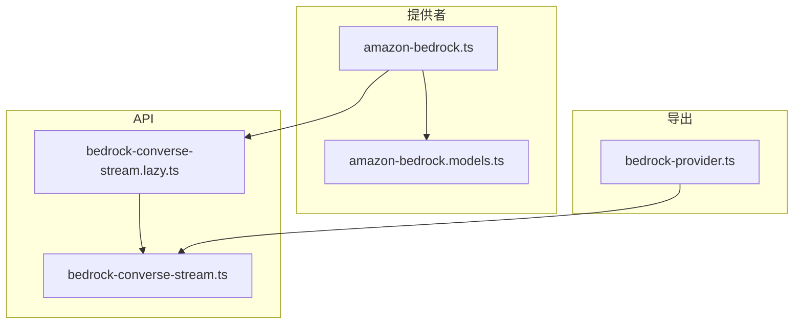
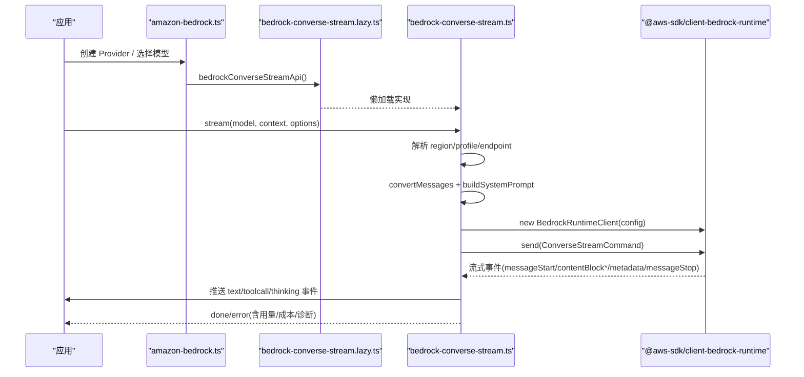
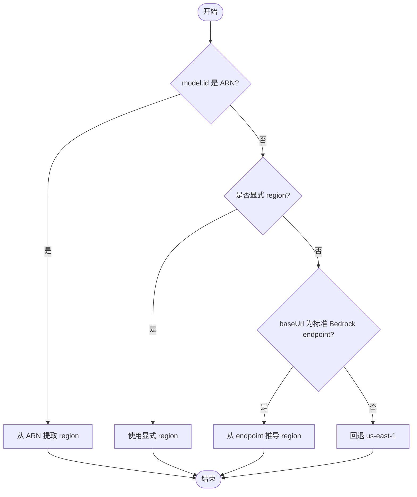
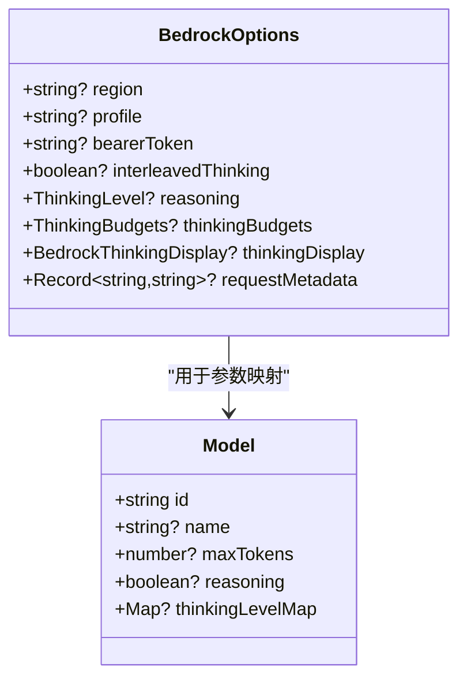
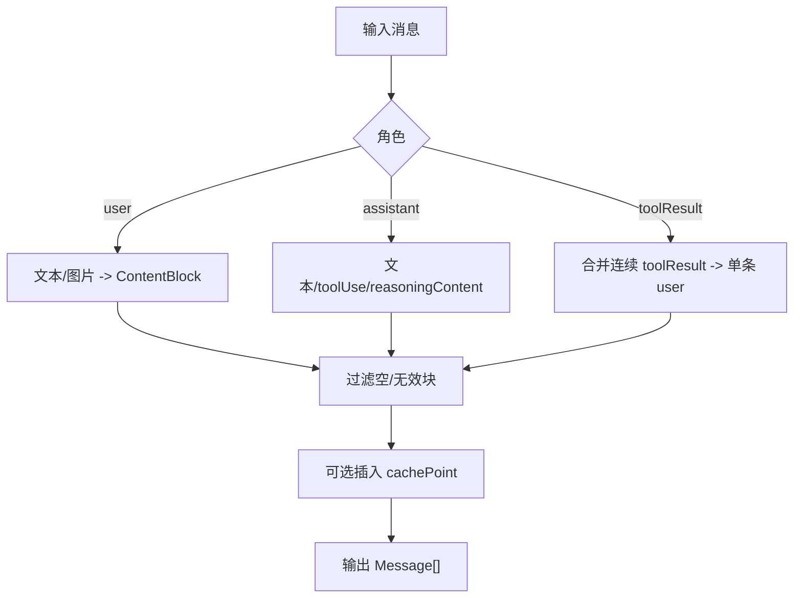
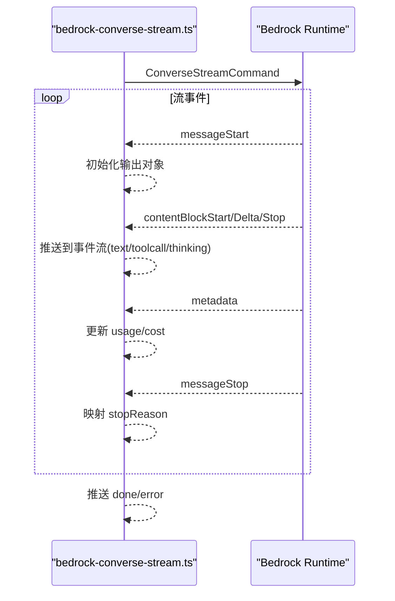
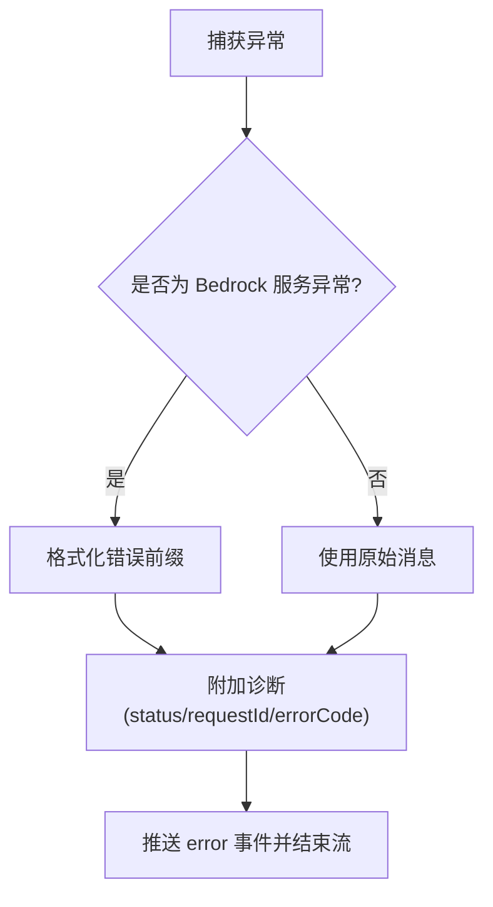
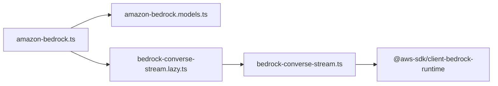

# AWS Bedrock 提供商适配器

<cite>
**本文引用的文件**
- [bedrock-provider.ts](file://packages/ai/src/bedrock-provider.ts)
- [amazon-bedrock.ts](file://packages/ai/src/providers/amazon-bedrock.ts)
- [amazon-bedrock.models.ts](file://packages/ai/src/providers/amazon-bedrock.models.ts)
- [bedrock-converse-stream.lazy.ts](file://packages/ai/src/api/bedrock-converse-stream.lazy.ts)
- [bedrock-converse-stream.ts](file://packages/ai/src/api/bedrock-converse-stream.ts)
- [bedrock-convert-messages.test.ts](file://packages/ai/test/bedrock-convert-messages.test.ts)
- [bedrock-credentials.test.ts](file://packages/ai/test/bedrock-credentials.test.ts)
</cite>

## 目录
1. [简介](#简介)
2. [项目结构](#项目结构)
3. [核心组件](#核心组件)
4. [架构总览](#架构总览)
5. [详细组件分析](#详细组件分析)
6. [依赖关系分析](#依赖关系分析)
7. [性能与成本优化](#性能与成本优化)
8. [故障排查指南](#故障排查指南)
9. [结论](#结论)
10. [附录：配置与使用示例](#附录：配置与使用示例)

## 简介
本文件面向 AWS Bedrock 提供商适配器的实现，聚焦于 Converse API 的流式调用、多模型支持（Claude、Llama、Titan 等）、IAM 认证与区域配置、消息格式转换、工具调用、思考模式（thinking）与提示缓存、错误处理与重试友好性、以及成本优化策略。文档同时提供如何配置和使用 Bedrock 适配器、以及如何切换不同基础模型的实践指引。

## 项目结构
Bedrock 适配相关代码主要位于 packages/ai 下，分为“提供者注册”、“API 流式实现”、“模型目录”和“测试”四个层次：
- 提供者注册：定义 provider 元数据、认证流程与模型集合
- API 流式实现：封装 ConverseStreamCommand 的构建、发送与事件流解析
- 模型目录：自动生成的模型清单，供上层统一选择
- 测试：覆盖消息转换、凭据优先级、错误元数据等关键路径

**图表来源**
- [amazon-bedrock.ts:82-90](file://packages/ai/src/providers/amazon-bedrock.ts#L82-L90)
- [amazon-bedrock.models.ts:1-9](file://packages/ai/src/providers/amazon-bedrock.models.ts#L1-L9)
- [bedrock-converse-stream.lazy.ts:1-31](file://packages/ai/src/api/bedrock-converse-stream.lazy.ts#L1-L31)
- [bedrock-converse-stream.ts:107-327](file://packages/ai/src/api/bedrock-converse-stream.ts#L107-L327)
- [bedrock-provider.ts:1-7](file://packages/ai/src/bedrock-provider.ts#L1-L7)

**章节来源**
- [amazon-bedrock.ts:1-91](file://packages/ai/src/providers/amazon-bedrock.ts#L1-L91)
- [amazon-bedrock.models.ts:1-9](file://packages/ai/src/providers/amazon-bedrock.models.ts#L1-L9)
- [bedrock-converse-stream.lazy.ts:1-31](file://packages/ai/src/api/bedrock-converse-stream.lazy.ts#L1-L31)
- [bedrock-converse-stream.ts:107-327](file://packages/ai/src/api/bedrock-converse-stream.ts#L107-L327)
- [bedrock-provider.ts:1-7](file://packages/ai/src/bedrock-provider.ts#L1-L7)

## 核心组件
- 提供者注册器 amazonBedrockProvider：声明 provider id/name、认证方式、模型列表与 API 入口
- 流式 API bedrockConverseStreamApi：懒加载 Node-only 的 Bedrock SDK 实现，避免浏览器打包引入
- 流式实现 stream/streamSimple：构建 ConverseStreamCommand、处理流事件、计算用量与成本、错误诊断
- 消息与工具转换 convertMessages/convertToolConfig：将通用消息/工具映射为 Bedrock Converse 请求体
- 区域与凭据解析：支持 ARN 区域提取、显式 endpoint、环境变量、AWS 默认凭证链、Bearer Token

**章节来源**
- [amazon-bedrock.ts:6-91](file://packages/ai/src/providers/amazon-bedrock.ts#L6-L91)
- [bedrock-converse-stream.lazy.ts:1-31](file://packages/ai/src/api/bedrock-converse-stream.lazy.ts#L1-L31)
- [bedrock-converse-stream.ts:107-327](file://packages/ai/src/api/bedrock-converse-stream.ts#L107-L327)
- [bedrock-converse-stream.ts:817-1017](file://packages/ai/src/api/bedrock-converse-stream.ts#L817-L1017)

## 架构总览
下图展示了从调用方到 Bedrock Converse 的完整调用链路，包括认证、区域解析、消息转换、流式事件处理与错误诊断。

**图表来源**
- [amazon-bedrock.ts:82-90](file://packages/ai/src/providers/amazon-bedrock.ts#L82-L90)
- [bedrock-converse-stream.lazy.ts:26-31](file://packages/ai/src/api/bedrock-converse-stream.lazy.ts#L26-L31)
- [bedrock-converse-stream.ts:140-253](file://packages/ai/src/api/bedrock-converse-stream.ts#L140-L253)
- [bedrock-converse-stream.ts:263-327](file://packages/ai/src/api/bedrock-converse-stream.ts#L263-L327)

## 详细组件分析

### 认证与 IAM 配置
- 支持三种认证方式：
  - Bearer Token：通过 AWS_BEARER_TOKEN_BEDROCK 或选项传入，启用 httpBearerAuth
  - AWS Profile：通过 profile 或 AWS_PROFILE 指定
  - 默认凭证链：环境变量（AK/SK/SessionToken）、ECS/WebIdentity、EC2 角色等
- 区域解析优先级：
  - 若 model.id 为 ARN，优先从 ARN 提取 region
  - 否则使用显式 region > 环境变量 > 标准 endpoint 区域 > 回退 us-east-1
- 自定义 Endpoint：当 baseUrl 为标准 Bedrock endpoint 且未显式配置 region/无环境 profile 时，强制使用 endpoint 并推导 region；否则保留用户自定义 endpoint（如 VPC/代理）

**图表来源**
- [bedrock-converse-stream.ts:171-183](file://packages/ai/src/api/bedrock-converse-stream.ts#L171-L183)
- [bedrock-converse-stream.ts:1059-1084](file://packages/ai/src/api/bedrock-converse-stream.ts#L1059-L1084)

**章节来源**
- [amazon-bedrock.ts:6-79](file://packages/ai/src/providers/amazon-bedrock.ts#L6-L79)
- [bedrock-converse-stream.ts:140-221](file://packages/ai/src/api/bedrock-converse-stream.ts#L140-L221)
- [bedrock-converse-stream.ts:1036-1084](file://packages/ai/src/api/bedrock-converse-stream.ts#L1036-L1084)
- [bedrock-credentials.test.ts:66-115](file://packages/ai/test/bedrock-credentials.test.ts#L66-L115)

### 模型支持与参数映射
- 模型来源：AMAZON_BEDROCK_MODELS 由脚本自动生成，包含 Claude、Llama、Titan、Nova 等模型族
- 推理参数：
  - maxTokens：对 Claude 模型优先使用模型自身上限
  - temperature：透传至 inferenceConfig
  - reasoning/thinking：
    - 自适应 thinking（Opus/Sonnet/Fable 新世代）：type=adaptive，配合 effort 级别
    - 预算型 thinking：type=enabled，budget_tokens 按级别映射并可自定义
    - interleavedThinking：非自适应模型默认开启 Beta 开关
    - thinkingDisplay：summarized/omitted（GovCloud 下部分模型不支持 display 字段会省略）
- 工具调用：
  - toolChoice：auto/any/none/指定工具名
  - strict 模式：根据模型能力与 constrainedSampling 决定是否注入 strict
- 系统提示与缓存：
  - 支持在 system 与最后一条 user 消息插入 cachePoint（短/长 TTL）
  - 仅对支持的 Claude 模型生效，可通过环境变量强制

**图表来源**
- [bedrock-converse-stream.ts:69-101](file://packages/ai/src/api/bedrock-converse-stream.ts#L69-L101)
- [bedrock-converse-stream.ts:1096-1144](file://packages/ai/src/api/bedrock-converse-stream.ts#L1096-L1144)
- [bedrock-converse-stream.ts:769-787](file://packages/ai/src/api/bedrock-converse-stream.ts#L769-L787)
- [bedrock-converse-stream.ts:982-1017](file://packages/ai/src/api/bedrock-converse-stream.ts#L982-L1017)

**章节来源**
- [amazon-bedrock.models.ts:1-9](file://packages/ai/src/providers/amazon-bedrock.models.ts#L1-L9)
- [bedrock-converse-stream.ts:234-246](file://packages/ai/src/api/bedrock-converse-stream.ts#L234-L246)
- [bedrock-converse-stream.ts:632-691](file://packages/ai/src/api/bedrock-converse-stream.ts#L632-L691)
- [bedrock-converse-stream.ts:736-787](file://packages/ai/src/api/bedrock-converse-stream.ts#L736-L787)
- [bedrock-converse-stream.ts:982-1017](file://packages/ai/src/api/bedrock-converse-stream.ts#L982-L1017)

### 消息格式转换
- 用户消息：文本与图片块转换为 ContentBlock；空内容用占位符
- 助手消息：文本、toolCall、thinking（带签名或纯文本）
- 工具结果：连续 toolResult 合并为单条 user 消息，状态 SUCCESS/ERROR
- 安全与兼容：
  - 跳过未知 content type，避免崩溃
  - 清理非法代理字符，必要时填充占位符
  - 非 Claude 模型不发送 signature 字段

**图表来源**
- [bedrock-converse-stream.ts:817-980](file://packages/ai/src/api/bedrock-converse-stream.ts#L817-L980)

**章节来源**
- [bedrock-converse-stream.ts:817-980](file://packages/ai/src/api/bedrock-converse-stream.ts#L817-L980)
- [bedrock-convert-messages.test.ts:98-274](file://packages/ai/test/bedrock-convert-messages.test.ts#L98-L274)

### 流式响应处理
- 事件类型：messageStart、contentBlockStart/Delta/Stop、messageStop、metadata
- 输出事件：text_start/delta/end、toolcall_start/delta/end、thinking_start/delta/end
- 停止原因映射：end_turn/stop_sequence -> stop；max_tokens/context_window -> length；tool_use -> toolUse；其他 -> error
- 用量与成本：从 metadata.usage 更新 input/output/cache 并计算 cost

**图表来源**
- [bedrock-converse-stream.ts:263-327](file://packages/ai/src/api/bedrock-converse-stream.ts#L263-L327)
- [bedrock-converse-stream.ts:508-630](file://packages/ai/src/api/bedrock-converse-stream.ts#L508-L630)
- [bedrock-converse-stream.ts:589-602](file://packages/ai/src/api/bedrock-converse-stream.ts#L589-L602)
- [bedrock-converse-stream.ts:1019-1034](file://packages/ai/src/api/bedrock-converse-stream.ts#L1019-L1034)

**章节来源**
- [bedrock-converse-stream.ts:263-327](file://packages/ai/src/api/bedrock-converse-stream.ts#L263-L327)
- [bedrock-converse-stream.ts:508-630](file://packages/ai/src/api/bedrock-converse-stream.ts#L508-L630)
- [bedrock-converse-stream.ts:589-602](file://packages/ai/src/api/bedrock-converse-stream.ts#L589-L602)
- [bedrock-converse-stream.ts:1019-1034](file://packages/ai/src/api/bedrock-converse-stream.ts#L1019-L1034)

### 错误处理与重试友好性
- 异常分类：InternalServerException、ModelStreamErrorException、ValidationException、ThrottlingException、ServiceUnavailableException
- 错误信息：标准化前缀便于下游重试逻辑匹配 server.?error/service.?unavailable
- 诊断信息：附加 status/requestId/errorCode 到输出对象的 diagnostic
- 中止与兜底：AbortSignal 中止标记为 aborted；流结束无 stopReason 报错

**图表来源**
- [bedrock-converse-stream.ts:335-422](file://packages/ai/src/api/bedrock-converse-stream.ts#L335-L422)
- [bedrock-converse-stream.ts:284-327](file://packages/ai/src/api/bedrock-converse-stream.ts#L284-L327)

**章节来源**
- [bedrock-converse-stream.ts:335-422](file://packages/ai/src/api/bedrock-converse-stream.ts#L335-L422)
- [bedrock-converse-stream.ts:284-327](file://packages/ai/src/api/bedrock-converse-stream.ts#L284-L327)

## 依赖关系分析
- 提供者层 amazon-bedrock.ts 通过 createProvider 注册 provider，绑定模型目录与 API
- API 层通过 lazy 导入 Node-only 的 Bedrock SDK，避免浏览器打包
- 流式实现依赖 AWS SDK 的 BedrockRuntimeClient 与 ConverseStreamCommand
- 工具与消息转换依赖统一的 transform 与 JSON Schema 严格模式解析

**图表来源**
- [amazon-bedrock.ts:1-91](file://packages/ai/src/providers/amazon-bedrock.ts#L1-L91)
- [bedrock-converse-stream.lazy.ts:1-31](file://packages/ai/src/api/bedrock-converse-stream.lazy.ts#L1-L31)
- [bedrock-converse-stream.ts:1-65](file://packages/ai/src/api/bedrock-converse-stream.ts#L1-L65)

**章节来源**
- [amazon-bedrock.ts:1-91](file://packages/ai/src/providers/amazon-bedrock.ts#L1-L91)
- [bedrock-converse-stream.lazy.ts:1-31](file://packages/ai/src/api/bedrock-converse-stream.lazy.ts#L1-L31)
- [bedrock-converse-stream.ts:1-65](file://packages/ai/src/api/bedrock-converse-stream.ts#L1-L65)

## 性能与成本优化
- 提示缓存（Prompt Caching）：
  - 在 system 与最后一条 user 消息插入 cachePoint（short/long TTL）
  - 仅对支持的 Claude 模型生效；可通过环境变量强制
- 自适应 thinking：
  - 对新世代模型使用 adaptive thinking，减少固定预算浪费
- 工具严格模式：
  - 对支持 strict 的模型启用 strict，降低无效调用与重试
- 代理与协议：
  - 支持 HTTP(S) 代理；可强制 HTTP/1.1 以兼容某些自定义 endpoint
- 请求元数据：
  - 通过 requestMetadata 进行成本分摊标签，便于 Cost Explorer 拆分

[本节为通用指导，无需特定文件引用]

## 故障排查指南
- 认证失败：
  - 检查是否设置了 AWS_BEARER_TOKEN_BEDROCK 或正确的 AWS 环境变量/Profile
  - 确认 IAM 权限（如 bedrock:CallWithBearerToken）
- 区域不匹配：
  - 若使用 ARN 作为 model.id，region 将从 ARN 提取；否则检查显式 region 或 endpoint
- 流结束无停止原因：
  - 检查上游是否被中止；确认 messageStop 事件到达
- 工具调用失败：
  - 检查 toolChoice 与 strict 设置；确认模型能力
- 错误诊断：
  - 查看输出对象的 diagnostic 中的 status/requestId/errorCode，便于定位问题

**章节来源**
- [bedrock-converse-stream.ts:335-422](file://packages/ai/src/api/bedrock-converse-stream.ts#L335-L422)
- [bedrock-converse-stream.ts:284-327](file://packages/ai/src/api/bedrock-converse-stream.ts#L284-L327)
- [bedrock-credentials.test.ts:66-115](file://packages/ai/test/bedrock-credentials.test.ts#L66-L115)

## 结论
Bedrock 适配器通过清晰的提供者注册、健壮的认证与区域解析、完善的消息与工具转换、稳定的流式事件处理与错误诊断，提供了对多种基础模型的一致接入体验。结合提示缓存、自适应 thinking 与严格工具模式，可在保证质量的同时显著降低成本与延迟。

[本节为总结性内容，无需特定文件引用]

## 附录：配置与使用示例
- 选择模型：
  - 通过 AMAZON_BEDROCK_MODELS 获取模型列表，选择 Claude/Llama/Titan/Nova 等模型 ID
- 认证配置：
  - 使用 Bearer Token：设置 AWS_BEARER_TOKEN_BEDROCK 或在选项中传入 bearerToken
  - 使用 AWS Profile：设置 AWS_PROFILE 或通过交互登录选择
  - 使用默认凭证链：配置 AK/SK/SessionToken 或使用 ECS/WebIdentity/EC2 角色
- 区域与 Endpoint：
  - 显式 region 或基于 ARN 自动推断；如需自定义 endpoint（VPC/代理），保持 baseUrl 即可
- 推理参数：
  - reasoning/thinking：根据模型能力选择 adaptive 或 budget-based thinking
  - thinkingDisplay：summarized/omitted（注意 GovCloud 限制）
  - toolChoice：auto/any/none/指定工具名；必要时启用 strict
- 成本优化：
  - 启用提示缓存（cacheRetention=short/long）
  - 使用 requestMetadata 添加成本分摊标签
- 切换基础模型：
  - 更换 model.id 即可切换到不同基础模型（如 Claude Sonnet/Opus、Llama、Titan、Nova）

**章节来源**
- [amazon-bedrock.ts:6-91](file://packages/ai/src/providers/amazon-bedrock.ts#L6-L91)
- [bedrock-converse-stream.ts:69-101](file://packages/ai/src/api/bedrock-converse-stream.ts#L69-L101)
- [bedrock-converse-stream.ts:736-787](file://packages/ai/src/api/bedrock-converse-stream.ts#L736-L787)
- [bedrock-converse-stream.ts:1096-1144](file://packages/ai/src/api/bedrock-converse-stream.ts#L1096-L1144)
- [amazon-bedrock.models.ts:1-9](file://packages/ai/src/providers/amazon-bedrock.models.ts#L1-L9)