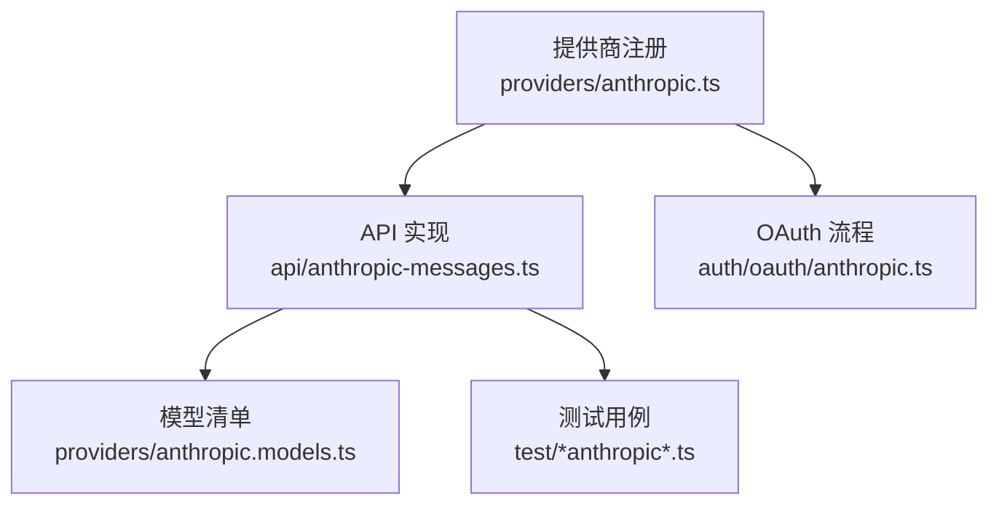
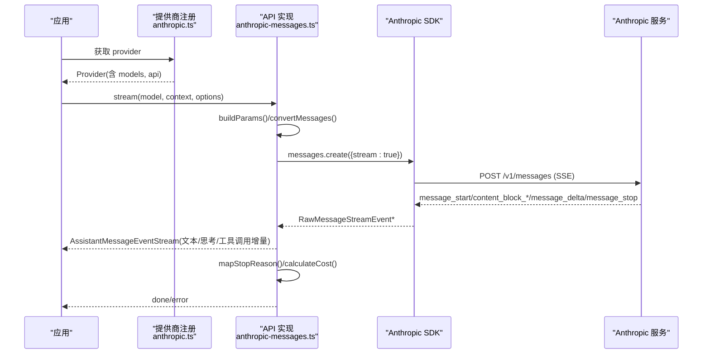
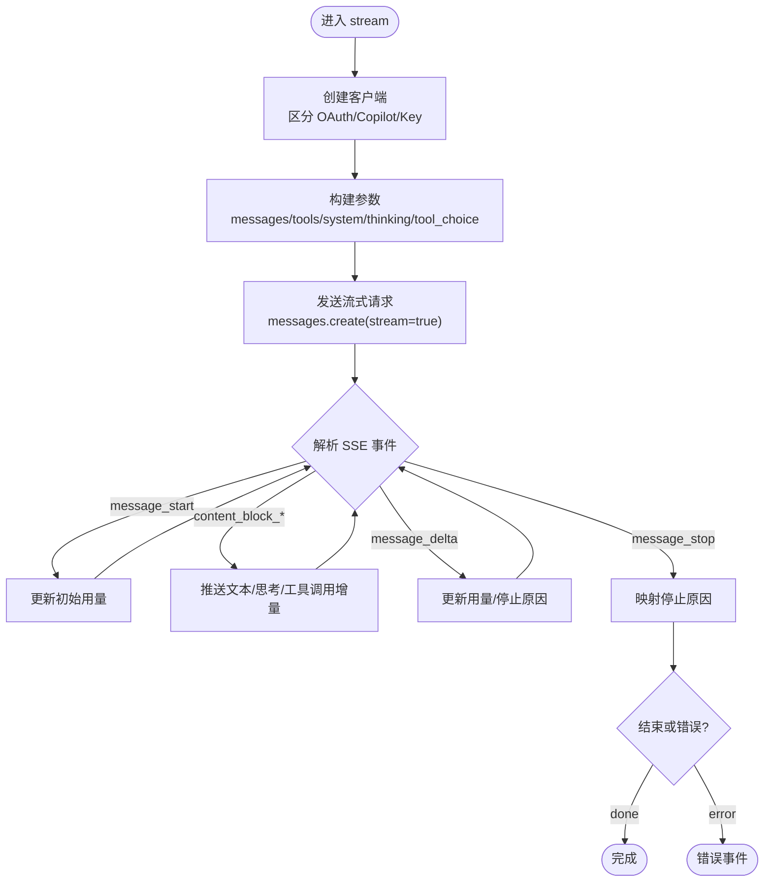
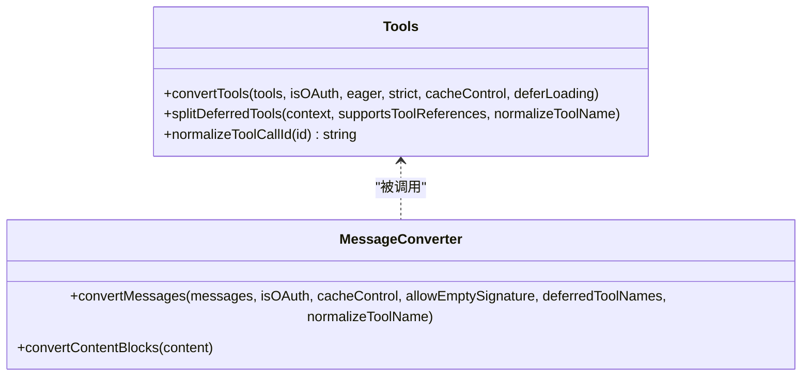
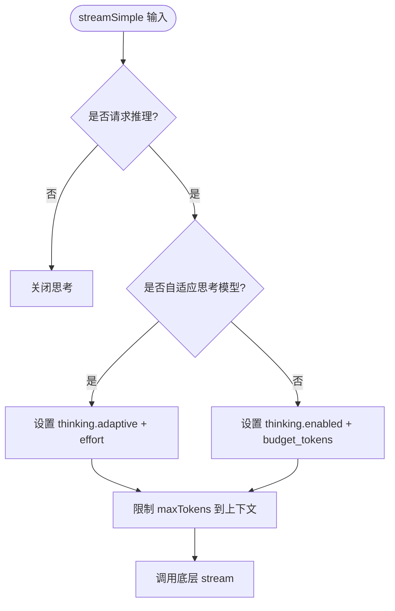
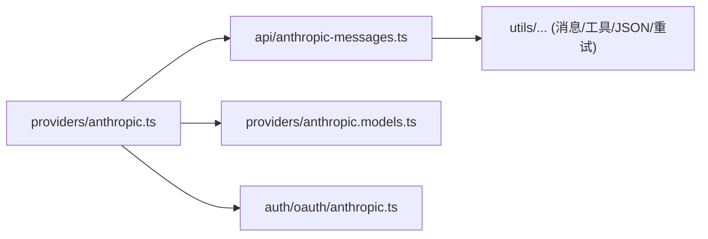

# Anthropic Claude 提供商适配器

<cite>
**本文引用的文件**
- [packages/ai/src/providers/anthropic.ts](file://packages/ai/src/providers/anthropic.ts)
- [packages/ai/src/api/anthropic-messages.ts](file://packages/ai/src/api/anthropic-messages.ts)
- [packages/ai/src/auth/oauth/anthropic.ts](file://packages/ai/src/auth/oauth/anthropic.ts)
- [packages/ai/src/providers/anthropic.models.ts](file://packages/ai/src/providers/anthropic.models.ts)
- [packages/ai/test/anthropic-adaptive-thinking-models.test.ts](file://packages/ai/test/anthropic-adaptive-thinking-models.test.ts)
- [packages/ai/test/anthropic-eager-tool-input-e2e.test.ts](file://packages/ai/test/anthropic-eager-tool-input-e2e.test.ts)
</cite>

## 目录
1. [简介](#简介)
2. [项目结构](#项目结构)
3. [核心组件](#核心组件)
4. [架构总览](#架构总览)
5. [详细组件分析](#详细组件分析)
6. [依赖关系分析](#依赖关系分析)
7. [性能考量](#性能考量)
8. [故障排查指南](#故障排查指南)
9. [结论](#结论)
10. [附录：配置与使用示例](#附录：配置与使用示例)

## 简介
本文件面向需要集成 Anthropic Claude 的开发者，系统性说明项目中“Anthropic Claude 提供商适配器”的实现与用法。内容覆盖：
- Messages API 适配、系统提示词处理、工具调用支持
- 认证配置（API Key、OAuth）
- 模型参数映射（max_tokens、temperature、top_p、top_k）
- 消息格式转换
- 流式响应处理、错误处理策略、安全考虑
- 思考模式（自适应思考与预算型思考）
- 具体配置与使用示例（以代码片段路径引用为主）

## 项目结构
Claude 适配器由三部分构成：
- 提供商注册：定义提供商 ID、名称、基础 URL、认证方式、模型清单与 API 实现
- API 实现：封装 Anthropic Messages API，负责消息转换、工具声明、思考模式、流式事件解析与成本统计
- OAuth 流程：为 Claude Pro/Max 用户提供本地回调服务器的授权码交换与刷新

图表来源
- [packages/ai/src/providers/anthropic.ts:43-58](file://packages/ai/src/providers/anthropic.ts#L43-L58)
- [packages/ai/src/api/anthropic-messages.ts:487-774](file://packages/ai/src/api/anthropic-messages.ts#L487-L774)
- [packages/ai/src/auth/oauth/anthropic.ts:355-364](file://packages/ai/src/auth/oauth/anthropic.ts#L355-L364)
- [packages/ai/src/providers/anthropic.models.ts:7-8](file://packages/ai/src/providers/anthropic.models.ts#L7-L8)

章节来源
- [packages/ai/src/providers/anthropic.ts:43-58](file://packages/ai/src/providers/anthropic.ts#L43-L58)
- [packages/ai/src/api/anthropic-messages.ts:487-774](file://packages/ai/src/api/anthropic-messages.ts#L487-L774)
- [packages/ai/src/auth/oauth/anthropic.ts:355-364](file://packages/ai/src/auth/oauth/anthropic.ts#L355-L364)
- [packages/ai/src/providers/anthropic.models.ts:7-8](file://packages/ai/src/providers/anthropic.models.ts#L7-L8)

## 核心组件
- 提供商注册器：提供 anthropicProvider，绑定 id、name、baseUrl、auth、models、api
- API 适配器：stream/streamSimple，构建请求参数、发送流式请求、解析 SSE 事件、组装输出与用量
- OAuth：login/refresh/toAuth，完成授权码交换与令牌刷新
- 模型清单：自动生成的模型元数据（能力、成本、最大 token 等）

章节来源
- [packages/ai/src/providers/anthropic.ts:9-58](file://packages/ai/src/providers/anthropic.ts#L9-L58)
- [packages/ai/src/api/anthropic-messages.ts:487-774](file://packages/ai/src/api/anthropic-messages.ts#L487-L774)
- [packages/ai/src/auth/oauth/anthropic.ts:234-364](file://packages/ai/src/auth/oauth/anthropic.ts#L234-L364)
- [packages/ai/src/providers/anthropic.models.ts:1-8](file://packages/ai/src/providers/anthropic.models.ts#L1-L8)

## 架构总览
下图展示了从上层调用到 Anthropic 服务端的关键交互路径，包括认证选择、参数构建、流式事件解析与停止原因映射。

图表来源
- [packages/ai/src/providers/anthropic.ts:43-58](file://packages/ai/src/providers/anthropic.ts#L43-L58)
- [packages/ai/src/api/anthropic-messages.ts:487-774](file://packages/ai/src/api/anthropic-messages.ts#L487-L774)
- [packages/ai/src/api/anthropic-messages.ts:939-1074](file://packages/ai/src/api/anthropic-messages.ts#L939-L1074)
- [packages/ai/src/api/anthropic-messages.ts:1325-1351](file://packages/ai/src/api/anthropic-messages.ts#L1325-L1351)

## 详细组件分析

### 提供商注册与认证
- 提供商定义：id=anthropic，name=Anthropic，baseUrl=https://api.anthropic.com
- 认证方式：
  - API Key：支持交互式输入与多环境变量回退；也支持通过 headers 注入 Authorization/x-api-key
  - OAuth：用于 Claude Pro/Max，基于 PKCE 的授权码流程，本地回调服务器接收 code，换取 access_token 并支持 refresh
- 模型清单：加载自动生成的 ANTHROPIC_MODELS

章节来源
- [packages/ai/src/providers/anthropic.ts:9-58](file://packages/ai/src/providers/anthropic.ts#L9-L58)
- [packages/ai/src/auth/oauth/anthropic.ts:234-364](file://packages/ai/src/auth/oauth/anthropic.ts#L234-L364)
- [packages/ai/src/providers/anthropic.models.ts:1-8](file://packages/ai/src/providers/anthropic.models.ts#L1-L8)

### Messages API 适配器（流式）
- 入口：stream(model, context, options)
- 关键步骤：
  - 创建客户端：根据是否 OAuth、是否 GitHub Copilot 路由设置不同默认头与 beta 特性
  - 构建参数：transformMessages + convertMessages，处理 systemPrompt、工具、缓存控制、thinking 模式、tool_choice、metadata
  - 发送流式请求：messages.create({stream:true})，重试策略由通用重试函数包装
  - 解析 SSE：按 event 类型分发 content_block_start/delta/stop、message_start/delta/stop，维护输出块与用量
  - 停止原因映射：将 end_turn/max_tokens/tool_use/refusal/pause_turn/sensitive 等映射为统一 stopReason
  - 成本计算：依据 usage 字段计算 cost，并汇总 totalTokens

图表来源
- [packages/ai/src/api/anthropic-messages.ts:487-774](file://packages/ai/src/api/anthropic-messages.ts#L487-L774)
- [packages/ai/src/api/anthropic-messages.ts:939-1074](file://packages/ai/src/api/anthropic-messages.ts#L939-L1074)
- [packages/ai/src/api/anthropic-messages.ts:1325-1351](file://packages/ai/src/api/anthropic-messages.ts#L1325-L1351)

章节来源
- [packages/ai/src/api/anthropic-messages.ts:487-774](file://packages/ai/src/api/anthropic-messages.ts#L487-L774)
- [packages/ai/src/api/anthropic-messages.ts:939-1074](file://packages/ai/src/api/anthropic-messages.ts#L939-L1074)
- [packages/ai/src/api/anthropic-messages.ts:1325-1351](file://packages/ai/src/api/anthropic-messages.ts#L1325-L1351)

### 系统提示词处理
- 非 OAuth：systemPrompt 直接作为 system 文本块发送，可附加 cache_control
- OAuth：强制注入 Claude Code 身份 system 文本，再追加用户 systemPrompt，均可带缓存控制
- 对代理/网关场景，系统提示词会参与会话亲和性头部（如 x-session-affinity）

章节来源
- [packages/ai/src/api/anthropic-messages.ts:975-1000](file://packages/ai/src/api/anthropic-messages.ts#L975-L1000)

### 工具调用支持
- 工具声明：convertTools 将 Tool[] 转为 Anthropic 工具 schema，支持 eager_input_streaming、strict、defer_loading、cache_control
- 工具放置：splitDeferredTools 将工具分为 immediate 与 deferred，必要时启用 fine-grained tool streaming beta
- 工具名规范化：OAuth 模式下兼容 Claude Code 的工具命名规范
- 工具结果：convertToolResult 将 toolResult 转换为 tool_result 块，支持 tool_reference 引用与兄弟文本分离
- 工具选择：toolChoice 支持 auto/any/none 或强制指定工具

图表来源
- [packages/ai/src/api/anthropic-messages.ts:1287-1323](file://packages/ai/src/api/anthropic-messages.ts#L1287-L1323)
- [packages/ai/src/api/anthropic-messages.ts:1116-1281](file://packages/ai/src/api/anthropic-messages.ts#L1116-L1281)
- [packages/ai/src/api/anthropic-messages.ts:1076-1114](file://packages/ai/src/api/anthropic-messages.ts#L1076-L1114)

章节来源
- [packages/ai/src/api/anthropic-messages.ts:1007-1025](file://packages/ai/src/api/anthropic-messages.ts#L1007-L1025)
- [packages/ai/src/api/anthropic-messages.ts:1081-1114](file://packages/ai/src/api/anthropic-messages.ts#L1081-L1114)
- [packages/ai/src/api/anthropic-messages.ts:1116-1281](file://packages/ai/src/api/anthropic-messages.ts#L1116-L1281)
- [packages/ai/src/api/anthropic-messages.ts:1287-1323](file://packages/ai/src/api/anthropic-messages.ts#L1287-L1323)

### 思考模式（Thinking）
- 自适应思考：forceAdaptiveThinking=true 的模型使用 thinking.type="adaptive"，可通过 effort 控制深度（low/medium/high/xhigh/max）
- 预算型思考：旧模型使用 thinking.type="enabled" 与 budget_tokens
- 显示控制：thinkingDisplay 支持 summarized/omitted，影响返回的思考内容与签名
- 简单接口映射：streamSimple 将 reasoning 级别映射为 effort 或预算，自动调整 maxTokens 与 thinkingBudget

图表来源
- [packages/ai/src/api/anthropic-messages.ts:801-841](file://packages/ai/src/api/anthropic-messages.ts#L801-L841)
- [packages/ai/src/api/anthropic-messages.ts:1027-1056](file://packages/ai/src/api/anthropic-messages.ts#L1027-L1056)

章节来源
- [packages/ai/src/api/anthropic-messages.ts:801-841](file://packages/ai/src/api/anthropic-messages.ts#L801-L841)
- [packages/ai/src/api/anthropic-messages.ts:1027-1056](file://packages/ai/src/api/anthropic-messages.ts#L1027-L1056)
- [packages/ai/test/anthropic-adaptive-thinking-models.test.ts:25-39](file://packages/ai/test/anthropic-adaptive-thinking-models.test.ts#L25-L39)

### 模型参数映射
- max_tokens：来自 options.maxTokens 或 model.maxTokens，经 adjustMaxTokensForThinking 与 clampMaxTokensToContext 调整
- temperature：仅在未启用思考且模型支持时生效
- top_p/top_k：当前适配器未显式设置；如需使用，可在 options.headers 或通过自定义 client 注入
- metadata：支持 user_id 透传
- tool_choice：支持字符串或对象形式

章节来源
- [packages/ai/src/api/anthropic-messages.ts:961-973](file://packages/ai/src/api/anthropic-messages.ts#L961-L973)
- [packages/ai/src/api/anthropic-messages.ts:1002-1005](file://packages/ai/src/api/anthropic-messages.ts#L1002-L1005)
- [packages/ai/src/api/anthropic-messages.ts:1058-1071](file://packages/ai/src/api/anthropic-messages.ts#L1058-L1071)

### 流式响应与事件处理
- SSE 解码：逐行解析 event/data，聚合完整事件
- 事件类型：message_start/delta/stop、content_block_start/delta/stop
- 输出块：text、thinking（含签名）、tool_call（增量 JSON 解析）
- 用量与成本：在 message_start 与 message_delta 中累计 input/output/cache/reasoning tokens，并计算 cost
- 终止条件：无停止原因或异常时抛出错误

章节来源
- [packages/ai/src/api/anthropic-messages.ts:307-485](file://packages/ai/src/api/anthropic-messages.ts#L307-L485)
- [packages/ai/src/api/anthropic-messages.ts:573-744](file://packages/ai/src/api/anthropic-messages.ts#L573-L744)

### 错误处理策略
- 请求前校验：assertRequestAuth 确保存在 apiKey 或必要 header
- 网络与解析：SSE 解析失败抛错；流提前结束或缺少 message_stop 抛错
- 停止原因映射：refusal/sensitive 等映射为 error 并携带解释
- 取消与超时：支持 AbortSignal 与 timeoutMs；中止后标记 aborted

章节来源
- [packages/ai/src/api/anthropic-messages.ts:283-293](file://packages/ai/src/api/anthropic-messages.ts#L283-L293)
- [packages/ai/src/api/anthropic-messages.ts:446-485](file://packages/ai/src/api/anthropic-messages.ts#L446-L485)
- [packages/ai/src/api/anthropic-messages.ts:747-770](file://packages/ai/src/api/anthropic-messages.ts#L747-L770)
- [packages/ai/src/api/anthropic-messages.ts:1325-1351](file://packages/ai/src/api/anthropic-messages.ts#L1325-L1351)

### 安全考虑
- 认证最小化：优先使用 API Key；OAuth 仅用于订阅账户
- 浏览器直连开关：dangerouslyAllowBrowser 仅在特定路由下启用
- 敏感字符清洗：sanitizeSurrogates 清理不可打印字符
- 工具名规范化：避免大小写差异导致的不一致
- 会话亲和性：可选 x-session-affinity 提升一致性

章节来源
- [packages/ai/src/api/anthropic-messages.ts:867-937](file://packages/ai/src/api/anthropic-messages.ts#L867-L937)
- [packages/ai/src/api/anthropic-messages.ts:117-164](file://packages/ai/src/api/anthropic-messages.ts#L117-L164)
- [packages/ai/src/api/anthropic-messages.ts:1076-1079](file://packages/ai/src/api/anthropic-messages.ts#L1076-L1079)
- [packages/ai/src/api/anthropic-messages.ts:915-917](file://packages/ai/src/api/anthropic-messages.ts#L915-L917)

## 依赖关系分析
- 提供商注册依赖 API 实现与模型清单
- API 实现依赖消息转换、工具拆分、JSON 解析、重试、环境值读取等工具模块
- OAuth 依赖本地 HTTP 服务器与 PKCE 生成

图表来源
- [packages/ai/src/providers/anthropic.ts:1-7](file://packages/ai/src/providers/anthropic.ts#L1-L7)
- [packages/ai/src/api/anthropic-messages.ts:1-43](file://packages/ai/src/api/anthropic-messages.ts#L1-L43)
- [packages/ai/src/auth/oauth/anthropic.ts:1-13](file://packages/ai/src/auth/oauth/anthropic.ts#L1-L13)

章节来源
- [packages/ai/src/providers/anthropic.ts:1-7](file://packages/ai/src/providers/anthropic.ts#L1-L7)
- [packages/ai/src/api/anthropic-messages.ts:1-43](file://packages/ai/src/api/anthropic-messages.ts#L1-L43)
- [packages/ai/src/auth/oauth/anthropic.ts:1-13](file://packages/ai/src/auth/oauth/anthropic.ts#L1-L13)

## 性能考量
- 流式传输：SSE 增量推送，降低首字延迟
- 工具流式输入：eager_input_streaming 减少往返
- 缓存控制：ephemeral 缓存会话历史，支持长保留（1h）以提升重复对话效率
- 自适应思考：按需分配思考资源，避免不必要的开销
- 重试策略：外层重试函数控制最大重试次数与延迟

[本节为通用指导，不直接分析具体文件]

## 故障排查指南
- 认证失败：检查是否存在 apiKey 或必要的 Authorization/x-api-key 头；OAuth 流程确认回调端口与 state 匹配
- 流中断：确认收到 message_stop；若缺失，检查网络与代理
- 工具调用异常：核对工具名规范化与 schema 严格模式；必要时开启 fine-grained tool streaming beta
- 思考模式问题：确认模型是否支持 forceAdaptiveThinking；检查 thinkingDisplay 与 effort 组合
- 停止原因：查看映射后的 stopReason 与 errorMessage，定位拒绝或敏感内容拦截

章节来源
- [packages/ai/src/api/anthropic-messages.ts:283-293](file://packages/ai/src/api/anthropic-messages.ts#L283-L293)
- [packages/ai/src/api/anthropic-messages.ts:446-485](file://packages/ai/src/api/anthropic-messages.ts#L446-L485)
- [packages/ai/src/api/anthropic-messages.ts:747-770](file://packages/ai/src/api/anthropic-messages.ts#L747-L770)
- [packages/ai/src/api/anthropic-messages.ts:1325-1351](file://packages/ai/src/api/anthropic-messages.ts#L1325-L1351)

## 结论
该适配器以清晰的职责划分实现了 Anthropic Claude 的完整接入：提供商注册、消息与工具转换、思考模式、流式事件处理、成本统计与错误处理。通过 OAuth 与 API Key 双通道认证，以及自适应思考与缓存控制，兼顾了易用性与性能。建议在生产环境中结合重试、超时与监控，合理配置 thinking 与工具流式能力以获得最佳体验。

[本节为总结，不直接分析具体文件]

## 附录：配置与使用示例
以下示例均以“代码片段路径”的形式给出，便于快速定位实现与用法。

- 配置提供商与模型
  - 提供商注册与模型加载：[packages/ai/src/providers/anthropic.ts:43-58](file://packages/ai/src/providers/anthropic.ts#L43-L58)
  - 模型清单：[packages/ai/src/providers/anthropic.models.ts:7-8](file://packages/ai/src/providers/anthropic.models.ts#L7-L8)

- 使用 API Key 进行流式调用
  - 流式入口与参数构建：[packages/ai/src/api/anthropic-messages.ts:487-774](file://packages/ai/src/api/anthropic-messages.ts#L487-L774)
  - 参数构建（含 max_tokens、temperature、tools、thinking）：[packages/ai/src/api/anthropic-messages.ts:939-1074](file://packages/ai/src/api/anthropic-messages.ts#L939-L1074)

- 使用 OAuth（Claude Pro/Max）
  - OAuth 登录与刷新：[packages/ai/src/auth/oauth/anthropic.ts:234-364](file://packages/ai/src/auth/oauth/anthropic.ts#L234-L364)
  - 在客户端中使用 OAuth Token：[packages/ai/src/api/anthropic-messages.ts:890-912](file://packages/ai/src/api/anthropic-messages.ts#L890-L912)

- 启用思考模式
  - 简单接口映射 reasoning -> effort/budget：[packages/ai/src/api/anthropic-messages.ts:801-841](file://packages/ai/src/api/anthropic-messages.ts#L801-L841)
  - 自适应思考与 effort：[packages/ai/src/api/anthropic-messages.ts:1027-1056](file://packages/ai/src/api/anthropic-messages.ts#L1027-L1056)
  - 自适应思考模型清单验证：[packages/ai/test/anthropic-adaptive-thinking-models.test.ts:25-39](file://packages/ai/test/anthropic-adaptive-thinking-models.test.ts#L25-L39)

- 工具调用与流式输入
  - 工具声明与 eager_input_streaming：[packages/ai/src/api/anthropic-messages.ts:1287-1323](file://packages/ai/src/api/anthropic-messages.ts#L1287-L1323)
  - 端到端工具流式兼容性测试：[packages/ai/test/anthropic-eager-tool-input-e2e.test.ts:101-154](file://packages/ai/test/anthropic-eager-tool-input-e2e.test.ts#L101-L154)

- 系统提示词与缓存控制
  - 系统提示词注入与缓存：[packages/ai/src/api/anthropic-messages.ts:975-1000](file://packages/ai/src/api/anthropic-messages.ts#L975-L1000)
  - 最后一条用户消息缓存控制：[packages/ai/src/api/anthropic-messages.ts:1256-1278](file://packages/ai/src/api/anthropic-messages.ts#L1256-L1278)

- 错误处理与停止原因
  - 停止原因映射：[packages/ai/src/api/anthropic-messages.ts:1325-1351](file://packages/ai/src/api/anthropic-messages.ts#L1325-L1351)
  - 流结束校验与异常处理：[packages/ai/src/api/anthropic-messages.ts:747-770](file://packages/ai/src/api/anthropic-messages.ts#L747-L770)