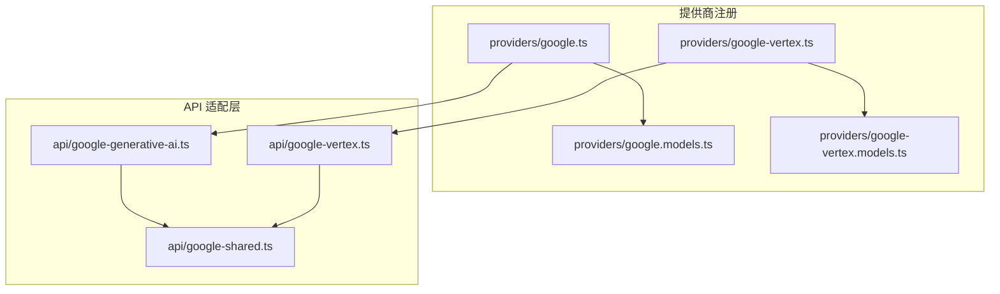
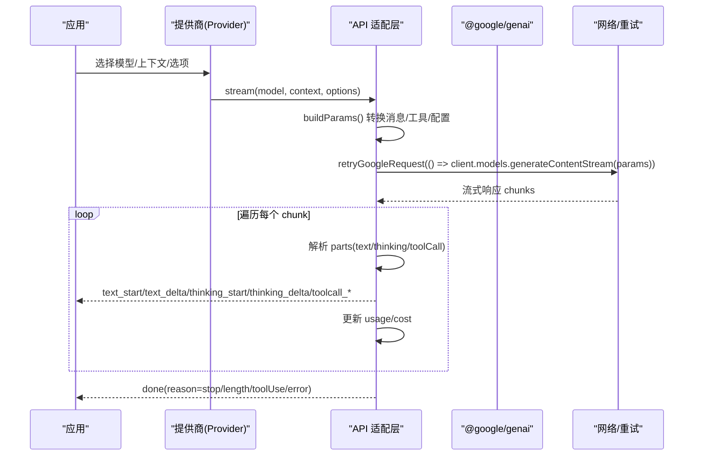
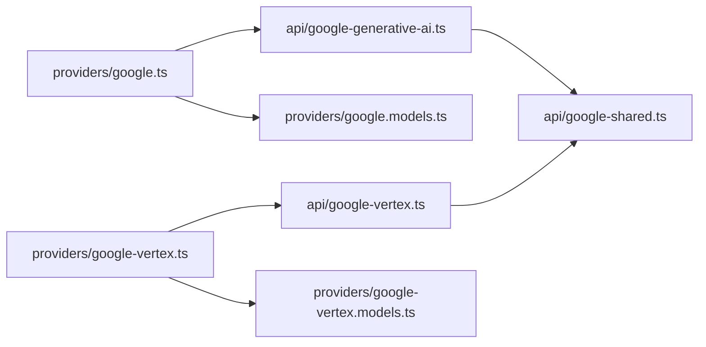

# Google Gemini 提供商适配器

<cite>
**本文引用的文件**
- [google.ts](file://packages/ai/src/providers/google.ts)
- [google-vertex.ts](file://packages/ai/src/providers/google-vertex.ts)
- [google-generative-ai.ts](file://packages/ai/src/api/google-generative-ai.ts)
- [google-vertex.ts](file://packages/ai/src/api/google-vertex.ts)
- [google-shared.ts](file://packages/ai/src/api/google-shared.ts)
- [google.models.ts](file://packages/ai/src/providers/google.models.ts)
- [google-vertex.models.ts](file://packages/ai/src/providers/google-vertex.models.ts)
</cite>

## 目录
1. [简介](#简介)
2. [项目结构](#项目结构)
3. [核心组件](#核心组件)
4. [架构总览](#架构总览)
5. [详细组件分析](#详细组件分析)
6. [依赖关系分析](#依赖关系分析)
7. [性能与配额管理](#性能与配额管理)
8. [故障排查指南](#故障排查指南)
9. [结论](#结论)
10. [附录：配置与使用示例](#附录配置与使用示例)

## 简介
本文件面向需要集成 Google Gemini 的开发者，系统性说明项目中“Google”与“Google Vertex AI”两个提供商适配器的实现。内容涵盖：
- Generative Content API 的流式调用、消息与工具转换、多模态支持（文本与图像）
- Vertex AI 认证方式（API Key、Application Default Credentials、服务账号文件）
- 模型参数映射（temperature、maxTokens→maxOutputTokens、thinking/thinkingLevel/thinkingBudget）
- 请求重试机制、错误处理、停止原因映射
- 配额与成本统计（usage/cost）
- 如何配置与使用适配器，以及如何处理文本、图像等多模态输入

## 项目结构
围绕 Gemini 的核心代码位于 packages/ai 下，分为“提供商注册”和“API 适配层”两部分：
- 提供商注册：定义 provider id、名称、baseUrl、认证、模型列表与底层 API 绑定
- API 适配层：封装 @google/genai SDK，完成消息/工具转换、流式响应解析、重试、用量统计等

图表来源
- [google.ts:6-14](file://packages/ai/src/providers/google.ts#L6-L14)
- [google-vertex.ts:92-99](file://packages/ai/src/providers/google-vertex.ts#L92-L99)
- [google-generative-ai.ts:52-92](file://packages/ai/src/api/google-generative-ai.ts#L52-L92)
- [google-vertex.ts:70-110](file://packages/ai/src/api/google-vertex.ts#L70-L110)
- [google-shared.ts:98-248](file://packages/ai/src/api/google-shared.ts#L98-L248)

章节来源
- [google.ts:6-14](file://packages/ai/src/providers/google.ts#L6-L14)
- [google-vertex.ts:92-99](file://packages/ai/src/providers/google-vertex.ts#L92-L99)
- [google.models.ts:1-9](file://packages/ai/src/providers/google.models.ts#L1-L9)
- [google-vertex.models.ts:1-9](file://packages/ai/src/providers/google-vertex.models.ts#L1-L9)

## 核心组件
- Google 提供商（Generative Language API）
  - 通过 createProvider 注册 provider id="google"，baseUrl 指向 generativelanguage.googleapis.com/v1beta
  - 认证：读取环境变量 GEMINI_API_KEY
  - 模型：来自 google.models.ts 自动生成的模型目录
  - API：绑定 google-generative-ai.ts 提供的流式接口
- Google Vertex AI 提供商
  - 通过 createProvider 注册 provider id="google-vertex"
  - 认证：支持 API Key、ADC（gcloud application-default）、服务账号文件；会提示并收集 project/location/credentials path
  - 模型：来自 google-vertex.models.ts 自动生成的模型目录
  - API：绑定 google-vertex.ts 提供的流式接口

章节来源
- [google.ts:6-14](file://packages/ai/src/providers/google.ts#L6-L14)
- [google-vertex.ts:8-90](file://packages/ai/src/providers/google-vertex.ts#L8-L90)
- [google.models.ts:1-9](file://packages/ai/src/providers/google.models.ts#L1-L9)
- [google-vertex.models.ts:1-9](file://packages/ai/src/providers/google-vertex.models.ts#L1-L9)

## 架构总览
下图展示了从上层调用到 Google/Vertex 流式响应的完整流程，包括消息/工具转换、重试、流式事件分发与用量统计。

图表来源
- [google-generative-ai.ts:52-92](file://packages/ai/src/api/google-generative-ai.ts#L52-L92)
- [google-generative-ai.ts:98-243](file://packages/ai/src/api/google-generative-ai.ts#L98-L243)
- [google-vertex.ts:70-110](file://packages/ai/src/api/google-vertex.ts#L70-L110)
- [google-vertex.ts:116-260](file://packages/ai/src/api/google-vertex.ts#L116-L260)
- [google-shared.ts:393-414](file://packages/ai/src/api/google-shared.ts#L393-L414)

## 详细组件分析

### 1) 认证与配置
- Google（Generative Language API）
  - 通过环境变量 GEMINI_API_KEY 提供 API Key
  - baseUrl 固定为 https://generativelanguage.googleapis.com/v1beta
- Google Vertex AI
  - 支持三种认证方式：
    - API Key：直接传入或读取 GOOGLE_CLOUD_API_KEY
    - ADC：要求设置 GOOGLE_CLOUD_PROJECT/GCLOUD_PROJECT 与 GOOGLE_CLOUD_LOCATION，可选 GOOGLE_APPLICATION_CREDENTIALS
    - 服务账号文件：需提供 credentials 文件路径
  - 当未显式提供 apiKey 时，优先尝试 ADC 环境；若存在有效凭据则无需 apiKey
  - 可自定义 baseUrl（需包含版本路径时关闭自动追加 apiVersion）

章节来源
- [google.ts:6-14](file://packages/ai/src/providers/google.ts#L6-L14)
- [google-vertex.ts:8-90](file://packages/ai/src/providers/google-vertex.ts#L8-L90)
- [google-vertex.ts:349-378](file://packages/ai/src/api/google-vertex.ts#L349-L378)
- [google-vertex.ts:416-452](file://packages/ai/src/api/google-vertex.ts#L416-L452)

### 2) 模型参数映射
- temperature → generationConfig.temperature
- maxTokens → generationConfig.maxOutputTokens
- thinking/thinkingLevel/thinkingBudget：
  - 对 Gemini 3.x Pro/Flash/Gemma 4 使用 thinkingLevel（MINIMAL/LOW/MEDIUM/HIGH）
  - 对 Gemini 2.x 使用 thinkingBudget（含 -1 动态、0 禁用）
  - 当推理能力可用且未启用 thinking 时，按模型特性返回最小可用级别或 budget=0
- toolChoice：
  - auto/none/any 映射至 FunctionCallingConfigMode
  - 对于 Gemini 3+，若工具声明支持严格采样，则进入 VALIDATED 模式

章节来源
- [google-generative-ai.ts:355-409](file://packages/ai/src/api/google-generative-ai.ts#L355-L409)
- [google-generative-ai.ts:413-517](file://packages/ai/src/api/google-generative-ai.ts#L413-L517)
- [google-vertex.ts:454-507](file://packages/ai/src/api/google-vertex.ts#L454-L507)
- [google-vertex.ts:520-592](file://packages/ai/src/api/google-vertex.ts#L520-L592)
- [google-shared.ts:303-336](file://packages/ai/src/api/google-shared.ts#L303-L336)

### 3) 请求格式转换（消息与工具）
- convertMessages：
  - 将内部消息转换为 Gemini Content[]
  - 用户消息支持纯文本或多模态（text + inlineData 图片）
  - 助手消息保留 thinking/text/toolCall，跨模型/提供商时谨慎处理 thoughtSignature
  - toolResult 支持文本与图片；Gemini 3+ 可在 functionResponse.parts 中嵌入图片，否则拆分为独立 user 消息
- convertTools：
  - 默认使用 parametersJsonSchema（完整 JSON Schema）
  - 特殊场景（如 Cloud Code Assist 与 Claude）可使用 parameters（OpenAPI 3.03 Schema）

章节来源
- [google-shared.ts:98-248](file://packages/ai/src/api/google-shared.ts#L98-L248)
- [google-shared.ts:285-301](file://packages/ai/src/api/google-shared.ts#L285-L301)

### 4) 流式响应处理
- 统一以 AssistantMessageEventStream 推送事件：
  - text_start/text_delta/text_end
  - thinking_start/thinking_delta/thinking_end
  - toolcall_start/toolcall_delta/toolcall_end
- 每次 chunk 更新 usageMetadata，计算 input/output/cacheRead/reasoning/totalTokens 与 cost
- finishReason 映射为 stop/length/error，并在检测到 toolCall 时将 stopReason 置为 toolUse
- 异常时清理内部字段，输出 error 事件

章节来源
- [google-generative-ai.ts:98-290](file://packages/ai/src/api/google-generative-ai.ts#L98-L290)
- [google-vertex.ts:116-307](file://packages/ai/src/api/google-vertex.ts#L116-L307)
- [google-shared.ts:341-382](file://packages/ai/src/api/google-shared.ts#L341-L382)

### 5) 错误与重试机制
- 重试策略：
  - 使用 retryGoogleRequest 包装 generateContentStream 调用
  - 针对 408/409/429/5xx 进行退避重试，尊重 Retry-After
  - 对缺少 headers 的 SDK 错误进行规范化后继续重试
- 常见错误：
  - 未提供 API Key
  - 流结束无 finish reason
  - 请求被中止（signal.aborted）
  - 非支持的 fetch 替换

章节来源
- [google-generative-ai.ts:78-85](file://packages/ai/src/api/google-generative-ai.ts#L78-L85)
- [google-generative-ai.ts:263-290](file://packages/ai/src/api/google-generative-ai.ts#L263-L290)
- [google-vertex.ts:96-104](file://packages/ai/src/api/google-vertex.ts#L96-L104)
- [google-vertex.ts:280-307](file://packages/ai/src/api/google-vertex.ts#L280-L307)
- [google-shared.ts:393-414](file://packages/ai/src/api/google-shared.ts#L393-L414)

### 6) 多模态支持（文本与图像）
- 输入：
  - 用户消息可为字符串或数组，数组中包含 text 与 image（inlineData）
- 工具结果：
  - 文本与图片均可作为工具结果返回
  - Gemini 3+ 支持在 functionResponse.parts 内嵌图片；旧版模型需额外 user 消息承载图片
- 思考签名：
  - 仅在同提供商同模型时保留 thoughtSignature，避免跨模型导致推理链断裂

章节来源
- [google-shared.ts:108-132](file://packages/ai/src/api/google-shared.ts#L108-L132)
- [google-shared.ts:189-244](file://packages/ai/src/api/google-shared.ts#L189-L244)
- [google-shared.ts:62-67](file://packages/ai/src/api/google-shared.ts#L62-L67)

### 7) 用量与成本
- 每次 chunk 更新 usage：
  - input = promptTokenCount - cachedContentTokenCount
  - output = candidatesTokenCount + thoughtsTokenCount
  - cacheRead = cachedContentTokenCount
  - reasoning = thoughtsTokenCount
  - totalTokens = totalTokenCount
- 调用 calculateCost 根据模型定价计算 cost 字段

章节来源
- [google-generative-ai.ts:223-242](file://packages/ai/src/api/google-generative-ai.ts#L223-L242)
- [google-vertex.ts:240-259](file://packages/ai/src/api/google-vertex.ts#L240-L259)

## 依赖关系分析
- 提供商注册依赖模型目录与 API 适配层
- API 适配层依赖共享逻辑（消息/工具转换、重试、停止原因映射）
- 两者均基于 @google/genai SDK 的 GenerateContentParameters/Config 与流式接口

图表来源
- [google.ts:6-14](file://packages/ai/src/providers/google.ts#L6-L14)
- [google-vertex.ts:92-99](file://packages/ai/src/providers/google-vertex.ts#L92-L99)
- [google-generative-ai.ts:52-92](file://packages/ai/src/api/google-generative-ai.ts#L52-L92)
- [google-vertex.ts:70-110](file://packages/ai/src/api/google-vertex.ts#L70-L110)
- [google-shared.ts:98-248](file://packages/ai/src/api/google-shared.ts#L98-L248)

章节来源
- [google.ts:6-14](file://packages/ai/src/providers/google.ts#L6-L14)
- [google-vertex.ts:92-99](file://packages/ai/src/providers/google-vertex.ts#L92-L99)
- [google-generative-ai.ts:52-92](file://packages/ai/src/api/google-generative-ai.ts#L52-L92)
- [google-vertex.ts:70-110](file://packages/ai/src/api/google-vertex.ts#L70-L110)
- [google-shared.ts:98-248](file://packages/ai/src/api/google-shared.ts#L98-L248)

## 性能与配额管理
- 流式处理：逐块推送文本/思考/工具调用增量，降低首字延迟
- 重试策略：对瞬态错误（限流、超时、服务端错误）进行指数退避重试，提升稳定性
- 用量统计：实时累计 token 数与缓存命中，便于配额监控与成本控制
- 建议：
  - 合理设置 maxOutputTokens 与 thinkingBudget，避免超额
  - 开启 thinking 时关注 reasoning token 消耗
  - 结合业务 QPS 与模型限额调整并发与重试上限

[本节为通用指导，不直接分析具体文件]

## 故障排查指南
- 未提供 API Key：检查环境变量或选项中的 apiKey
- 流结束无 finish reason：检查上游连接是否异常或被中断
- 请求被中止：确认 signal.aborted 状态
- 不支持自定义 fetch：Google 适配器不允许替换全局 fetch
- 认证失败（Vertex）：确认 project/location/credentials 是否正确设置
- 工具调用 ID 冲突：适配器会为 Gemini 3+ 生成唯一 ID，确保幂等

章节来源
- [google-generative-ai.ts:78-85](file://packages/ai/src/api/google-generative-ai.ts#L78-L85)
- [google-generative-ai.ts:263-290](file://packages/ai/src/api/google-generative-ai.ts#L263-L290)
- [google-vertex.ts:96-104](file://packages/ai/src/api/google-vertex.ts#L96-L104)
- [google-vertex.ts:280-307](file://packages/ai/src/api/google-vertex.ts#L280-L307)
- [google-vertex.ts:433-452](file://packages/ai/src/api/google-vertex.ts#L433-L452)

## 结论
本项目为 Google Gemini 提供了统一的提供商适配层，覆盖 Generative Language API 与 Vertex AI 两种接入方式。通过共享的消息/工具转换、流式事件处理、重试与用量统计，实现了稳定、可扩展的多模态对话能力。推荐在生产环境中：
- 明确选择 API Key 或 ADC/服务账号认证
- 合理配置 thinking 与 maxOutputTokens
- 利用流式事件优化用户体验
- 结合用量与成本统计进行配额管理

[本节为总结性内容，不直接分析具体文件]

## 附录：配置与使用示例
以下示例展示如何配置与使用 Google 与 Google Vertex AI 适配器，并处理文本与图像等多模态输入。为避免泄露敏感信息，示例以步骤与路径引用为主。

- 配置 Google（Generative Language API）
  - 设置环境变量 GEMINI_API_KEY
  - 选择模型（来自 google.models.ts）
  - 调用流式接口，传入上下文与选项（temperature、maxTokens、thinking 等）
  - 参考实现位置：
    - [提供商注册:6-14](file://packages/ai/src/providers/google.ts#L6-L14)
    - [流式入口与参数构建:52-92](file://packages/ai/src/api/google-generative-ai.ts#L52-L92)
    - [消息/工具转换:98-248](file://packages/ai/src/api/google-shared.ts#L98-L248)

- 配置 Google Vertex AI
  - 认证方式：
    - API Key：设置 GOOGLE_CLOUD_API_KEY 或在选项中传入
    - ADC：运行 gcloud auth application-default login，并设置 GOOGLE_CLOUD_PROJECT/GCLOUD_PROJECT 与 GOOGLE_CLOUD_LOCATION
    - 服务账号：设置 GOOGLE_APPLICATION_CREDENTIALS 指向凭据文件
  - 选择模型（来自 google-vertex.models.ts）
  - 调用流式接口，传入上下文与选项
  - 参考实现位置：
    - [提供商注册与认证交互:8-90](file://packages/ai/src/providers/google-vertex.ts#L8-L90)
    - [客户端创建与认证解析:349-378](file://packages/ai/src/api/google-vertex.ts#L349-L378)
    - [项目/区域解析:433-452](file://packages/ai/src/api/google-vertex.ts#L433-L452)

- 多模态输入（文本与图像）
  - 用户消息可包含 text 与 image（inlineData）
  - 工具结果可包含文本与图片；Gemini 3+ 支持在 functionResponse.parts 中嵌入图片
  - 参考实现位置：
    - [用户消息与图片转换:108-132](file://packages/ai/src/api/google-shared.ts#L108-L132)
    - [工具结果与图片处理:189-244](file://packages/ai/src/api/google-shared.ts#L189-L244)

- 流式事件处理
  - 监听 text_start/text_delta/text_end、thinking_start/thinking_delta/thinking_end、toolcall_* 事件
  - 参考实现位置：
    - [Google 流式事件分发:98-243](file://packages/ai/src/api/google-generative-ai.ts#L98-L243)
    - [Vertex 流式事件分发:116-260](file://packages/ai/src/api/google-vertex.ts#L116-L260)

- 重试与错误处理
  - 使用 retryGoogleRequest 包装请求
  - 捕获并上报 error 事件
  - 参考实现位置：
    - [重试封装:393-414](file://packages/ai/src/api/google-shared.ts#L393-L414)
    - [错误处理与停止原因:263-290](file://packages/ai/src/api/google-generative-ai.ts#L263-L290)
    - [错误处理与停止原因（Vertex）:280-307](file://packages/ai/src/api/google-vertex.ts#L280-L307)