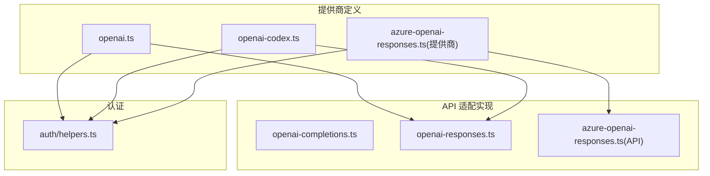
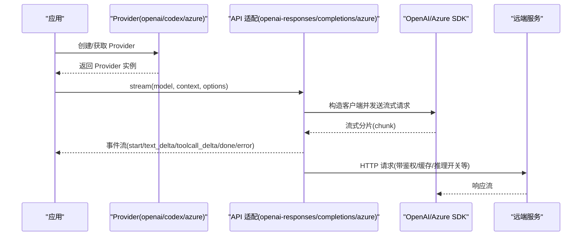
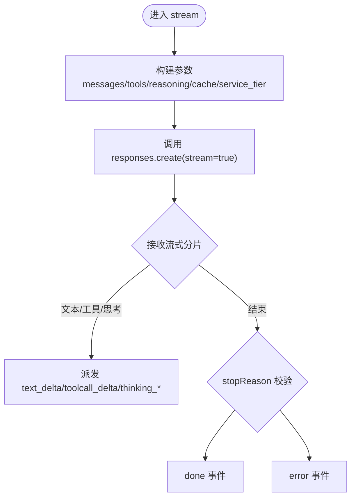
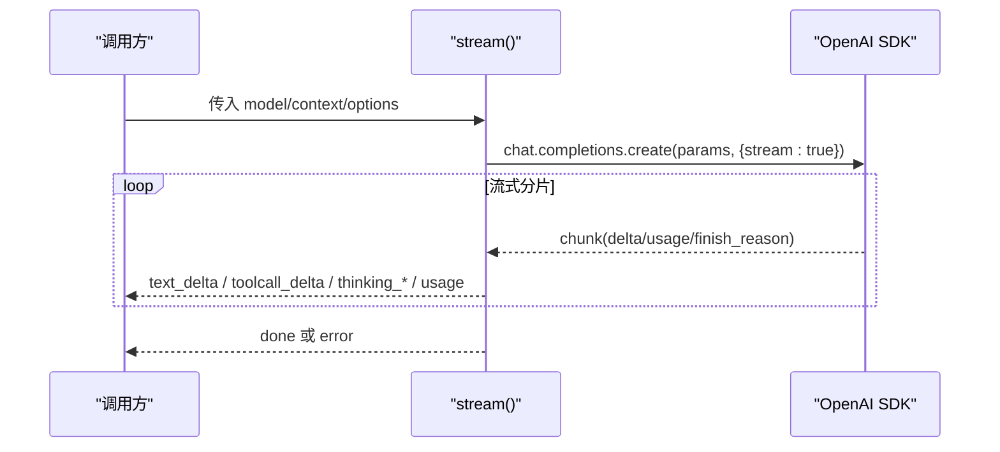
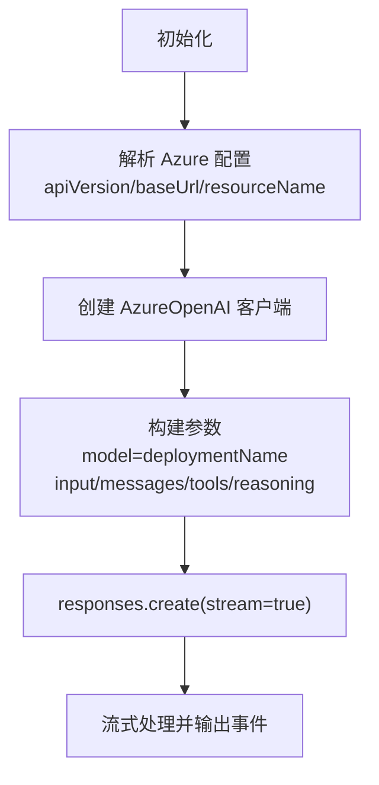
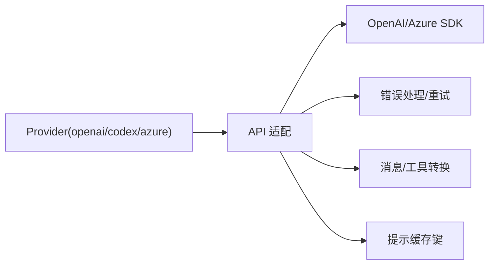

# OpenAI 提供商适配器

<cite>
**本文引用的文件**
- [openai.ts](file://packages/ai/src/providers/openai.ts)
- [openai.models.ts](file://packages/ai/src/providers/openai.models.ts)
- [openai-completions.ts](file://packages/ai/src/api/openai-completions.ts)
- [openai-responses.ts](file://packages/ai/src/api/openai-responses.ts)
- [azure-openai-responses.ts](file://packages/ai/src/api/azure-openai-responses.ts)
- [openai-codex.ts](file://packages/ai/src/providers/openai-codex.ts)
- [helpers.ts](file://packages/ai/src/auth/helpers.ts)
</cite>

## 目录
1. [简介](#简介)
2. [项目结构](#项目结构)
3. [核心组件](#核心组件)
4. [架构总览](#架构总览)
5. [详细组件分析](#详细组件分析)
6. [依赖关系分析](#依赖关系分析)
7. [性能与可靠性](#性能与可靠性)
8. [故障排查指南](#故障排查指南)
9. [结论](#结论)
10. [附录：配置与使用示例](#附录：配置与使用示例)

## 简介
本文件系统性梳理并文档化 OpenAI 提供商适配器的实现，覆盖以下能力：
- Chat Completions、Completions（兼容）、Codex、Responses 等接口支持
- 认证配置：OpenAI API Key、Azure OpenAI、OAuth（ChatGPT Plus/Pro）
- 模型参数映射：temperature、max_tokens/max_output_tokens、top_p、reasoning effort、service tier 等
- 消息格式转换：统一内部消息到 OpenAI/Azure 请求体
- 流式响应处理：增量文本、工具调用、思考内容、用量统计
- 错误重试机制、速率限制与取消
- 不同模型类型的特殊参数处理（如 thinking、prompt cache、会话亲和等）

## 项目结构
OpenAI 相关代码主要位于 packages/ai/src 下，分为“提供商定义”和“API 适配实现”两层：
- 提供商定义：负责声明 provider id、名称、baseUrl、认证方式、可用模型以及绑定的 API 实现
- API 适配实现：封装具体协议细节（Chat Completions、Responses、Azure、Codex），提供统一的流式事件输出

图表来源
- [openai.ts:1-16](file://packages/ai/src/providers/openai.ts#L1-L16)
- [openai-codex.ts:1-23](file://packages/ai/src/providers/openai-codex.ts#L1-L23)
- [azure-openai-responses.ts:1-15](file://packages/ai/src/providers/azure-openai-responses.ts#L1-L15)
- [openai-completions.ts:1-80](file://packages/ai/src/api/openai-completions.ts#L1-L80)
- [openai-responses.ts:1-30](file://packages/ai/src/api/openai-responses.ts#L1-L30)
- [azure-openai-responses.ts:1-30](file://packages/ai/src/api/azure-openai-responses.ts#L1-L30)
- [helpers.ts:1-60](file://packages/ai/src/auth/helpers.ts#L1-L60)

章节来源
- [openai.ts:1-16](file://packages/ai/src/providers/openai.ts#L1-L16)
- [openai-codex.ts:1-23](file://packages/ai/src/providers/openai-codex.ts#L1-L23)
- [azure-openai-responses.ts:1-15](file://packages/ai/src/providers/azure-openai-responses.ts#L1-L15)
- [openai-completions.ts:1-80](file://packages/ai/src/api/openai-completions.ts#L1-L80)
- [openai-responses.ts:1-30](file://packages/ai/src/api/openai-responses.ts#L1-L30)
- [azure-openai-responses.ts:1-30](file://packages/ai/src/api/azure-openai-responses.ts#L1-L30)
- [helpers.ts:1-60](file://packages/ai/src/auth/helpers.ts#L1-L60)

## 核心组件
- OpenAI Responses 提供商：绑定 openai-responses API，默认 baseUrl 为官方端点，通过环境变量注入 API Key
- OpenAI Codex 提供商：绑定 openai-codex-responses API，使用 OAuth（订阅制）进行认证
- Azure OpenAI Responses 提供商：绑定 azure-openai-responses API，通过环境变量或选项配置资源名、Base URL、API 版本、部署名
- OpenAI Completions 适配：面向 Chat Completions 的流式实现，兼容多种 OpenAI 风格后端
- 认证辅助：envApiKeyAuth 提供标准 API Key 解析；lazyOAuth 延迟加载 OAuth 流程

章节来源
- [openai.ts:1-16](file://packages/ai/src/providers/openai.ts#L1-L16)
- [openai-codex.ts:1-23](file://packages/ai/src/providers/openai-codex.ts#L1-L23)
- [azure-openai-responses.ts:1-15](file://packages/ai/src/providers/azure-openai-responses.ts#L1-L15)
- [openai-completions.ts:142-165](file://packages/ai/src/api/openai-completions.ts#L142-L165)
- [openai-responses.ts:92-97](file://packages/ai/src/api/openai-responses.ts#L92-L97)
- [azure-openai-responses.ts:56-63](file://packages/ai/src/api/azure-openai-responses.ts#L56-L63)
- [helpers.ts:1-60](file://packages/ai/src/auth/helpers.ts#L1-L60)

## 架构总览
OpenAI 适配器采用“提供商 + API 实现”的分层设计。上层 Provider 仅声明元数据与认证，下层 API 模块负责协议细节、消息转换、流式处理与错误处理。

图表来源
- [openai-responses.ts:102-195](file://packages/ai/src/api/openai-responses.ts#L102-L195)
- [openai-completions.ts:200-614](file://packages/ai/src/api/openai-completions.ts#L200-L614)
- [azure-openai-responses.ts:68-159](file://packages/ai/src/api/azure-openai-responses.ts#L68-L159)

## 详细组件分析

### OpenAI Responses 适配器
- 职责：将内部消息转换为 Responses 输入，构建请求参数（含 prompt cache、reasoning、tool_choice、service_tier 等），发起流式请求并统一输出事件
- 关键特性：
  - 自动推断会话亲和头（OpenRouter/OpenAI）
  - 支持显式关闭隐式提示缓存（explicit mode）
  - 支持 reasoning.encrypted_content 包含
  - 最小输出 token 下限保护（避免服务端拒绝）
  - 按 service_tier 调整成本计算

图表来源
- [openai-responses.ts:102-195](file://packages/ai/src/api/openai-responses.ts#L102-L195)
- [openai-responses.ts:258-343](file://packages/ai/src/api/openai-responses.ts#L258-L343)
- [openai-responses.ts:345-373](file://packages/ai/src/api/openai-responses.ts#L345-L373)

章节来源
- [openai-responses.ts:92-97](file://packages/ai/src/api/openai-responses.ts#L92-L97)
- [openai-responses.ts:102-195](file://packages/ai/src/api/openai-responses.ts#L102-L195)
- [openai-responses.ts:258-343](file://packages/ai/src/api/openai-responses.ts#L258-L343)
- [openai-responses.ts:345-373](file://packages/ai/src/api/openai-responses.ts#L345-L373)

### OpenAI Completions 适配器（兼容 Chat Completions）
- 职责：面向 Chat Completions 的流式实现，兼容多类 OpenAI 风格后端（包括第三方兼容端点）
- 关键特性：
  - 支持 tool_choice、thinking budgets、reasoning effort
  - 支持 prompt cache key/retention（短/长）
  - 支持多种 thinking 格式（zai/qwen/baseten/deepseek/chat-template）
  - 支持 finish_reason 缺失时的兜底策略
  - 支持 usage 在流中上报（部分后端在 choice.usage）

图表来源
- [openai-completions.ts:200-614](file://packages/ai/src/api/openai-completions.ts#L200-L614)
- [openai-completions.ts:681-800](file://packages/ai/src/api/openai-completions.ts#L681-L800)

章节来源
- [openai-completions.ts:142-165](file://packages/ai/src/api/openai-completions.ts#L142-L165)
- [openai-completions.ts:200-614](file://packages/ai/src/api/openai-completions.ts#L200-L614)
- [openai-completions.ts:681-800](file://packages/ai/src/api/openai-completions.ts#L681-L800)

### Azure OpenAI Responses 适配器
- 职责：对接 Azure OpenAI Responses 端点，处理资源名、Base URL、API 版本、部署名映射
- 关键特性：
  - Base URL 规范化（确保 /openai/v1 路径）
  - 部署名优先级：options > 环境变量映射表 > model.id
  - 支持 reasoning 与 prompt cache
  - 严格的最小输出 token 保护

图表来源
- [azure-openai-responses.ts:68-159](file://packages/ai/src/api/azure-openai-responses.ts#L68-L159)
- [azure-openai-responses.ts:181-249](file://packages/ai/src/api/azure-openai-responses.ts#L181-L249)
- [azure-openai-responses.ts:270-331](file://packages/ai/src/api/azure-openai-responses.ts#L270-L331)

章节来源
- [azure-openai-responses.ts:56-63](file://packages/ai/src/api/azure-openai-responses.ts#L56-L63)
- [azure-openai-responses.ts:68-159](file://packages/ai/src/api/azure-openai-responses.ts#L68-L159)
- [azure-openai-responses.ts:181-249](file://packages/ai/src/api/azure-openai-responses.ts#L181-L249)
- [azure-openai-responses.ts:270-331](file://packages/ai/src/api/azure-openai-responses.ts#L270-L331)

### OpenAI Codex 提供商（ChatGPT Plus/Pro）
- 职责：提供基于 OAuth 的 ChatGPT 访问能力，绑定 openai-codex-responses API
- 关键点：
  - 使用 lazyOAuth 延迟加载 OAuth 流程
  - 标记为订阅型认证
  - baseUrl 指向 ChatGPT 后端端点

章节来源
- [openai-codex.ts:1-23](file://packages/ai/src/providers/openai-codex.ts#L1-L23)

### 认证配置
- 标准 API Key：通过 envApiKeyAuth 从存储凭证或环境变量读取，支持交互式输入
- OAuth：通过 lazyOAuth 包装动态导入的 OAuth 实现，按需加载
- Azure：支持通过环境变量或选项设置 AZURE_OPENAI_API_KEY、AZURE_OPENAI_BASE_URL、AZURE_OPENAI_RESOURCE_NAME、AZURE_OPENAI_API_VERSION、AZURE_OPENAI_DEPLOYMENT_NAME_MAP

章节来源
- [helpers.ts:1-60](file://packages/ai/src/auth/helpers.ts#L1-L60)
- [azure-openai-responses.ts:216-249](file://packages/ai/src/api/azure-openai-responses.ts#L216-L249)

## 依赖关系分析
- Provider 层仅依赖 createProvider 与对应 API 工厂函数
- API 层依赖 OpenAI/Azure SDK、统一错误处理、重试、事件流、消息/工具转换、提示缓存键生成
- 各适配器的差异主要体现在：
  - 请求体字段（messages vs input、max_tokens vs max_output_tokens）
  - 推理开关（reasoning.effort/summary/include）
  - 缓存策略（prompt_cache_key/retention/explicit）
  - 会话亲和头（x-session-id/session_id/x-client-request-id）

图表来源
- [openai.ts:1-16](file://packages/ai/src/providers/openai.ts#L1-L16)
- [openai-responses.ts:1-30](file://packages/ai/src/api/openai-responses.ts#L1-L30)
- [openai-completions.ts:1-57](file://packages/ai/src/api/openai-completions.ts#L1-L57)
- [azure-openai-responses.ts:1-22](file://packages/ai/src/api/azure-openai-responses.ts#L1-L22)

章节来源
- [openai.ts:1-16](file://packages/ai/src/providers/openai.ts#L1-L16)
- [openai-responses.ts:1-30](file://packages/ai/src/api/openai-responses.ts#L1-L30)
- [openai-completions.ts:1-57](file://packages/ai/src/api/openai-completions.ts#L1-L57)
- [azure-openai-responses.ts:1-22](file://packages/ai/src/api/azure-openai-responses.ts#L1-L22)

## 性能与可靠性
- 流式处理：所有适配器均使用流式接口，逐步产出文本、工具调用与用量信息，降低首字节延迟
- 重试机制：通过统一的重试封装对网络/服务端错误进行可控重试，支持最大重试次数与退避时间
- 取消与超时：支持 AbortSignal 与超时控制，避免长时间挂起
- 速率限制：当上游返回限流时，可通过重试策略与 onPayload/onResponse 钩子进行观测与降级
- 成本与配额：
  - Responses 支持 service_tier 影响成本倍率
  - 提示缓存可显著降低重复请求成本（short/long 保留策略）
- 推理开销：开启 reasoning 会增加额外 token 与延迟，可按需关闭或选择 effort

章节来源
- [openai-responses.ts:102-195](file://packages/ai/src/api/openai-responses.ts#L102-L195)
- [openai-responses.ts:345-373](file://packages/ai/src/api/openai-responses.ts#L345-L373)
- [openai-completions.ts:200-614](file://packages/ai/src/api/openai-completions.ts#L200-L614)
- [azure-openai-responses.ts:68-159](file://packages/ai/src/api/azure-openai-responses.ts#L68-L159)

## 故障排查指南
- 缺少 API Key：
  - OpenAI/Codex：未提供 apiKey 且无授权头时会抛出异常
  - Azure：未提供 apiKey 直接报错
- 流结束无 stopReason：
  - Responses/Completions 会在流结束时校验 stopReason，缺失则抛错
- 请求被中止：
  - 检测到 signal.aborted 会抛出中止错误，并在事件中体现
- 错误信息增强：
  - 统一格式化错误体，附加原始元数据（如 OpenRouter raw metadata）
- 常见修复：
  - 检查环境变量与密钥注入
  - 确认 baseUrl、resourceName、apiVersion、部署名映射正确
  - 合理设置 maxTokens/min output tokens
  - 根据后端能力启用/禁用 prompt cache 与 reasoning

章节来源
- [openai-responses.ts:130-195](file://packages/ai/src/api/openai-responses.ts#L130-L195)
- [openai-completions.ts:226-254](file://packages/ai/src/api/openai-completions.ts#L226-L254)
- [openai-completions.ts:571-614](file://packages/ai/src/api/openai-completions.ts#L571-L614)
- [azure-openai-responses.ts:97-159](file://packages/ai/src/api/azure-openai-responses.ts#L97-L159)

## 结论
该适配器体系以 Provider 抽象屏蔽了不同后端的差异，通过统一的流式事件模型对外暴露一致的交互体验。其覆盖了 OpenAI 主流接口（Responses、Chat Completions、Codex）与 Azure OpenAI，具备完善的认证、参数映射、流式处理、错误与重试机制，适合在多模型、多云场景下稳定集成。

## 附录：配置与使用示例
以下为典型配置与使用要点（不展示具体代码，仅提供路径参考）：

- 配置 OpenAI（Responses）
  - 设置 OPENAI_API_KEY
  - 使用 openaiProvider 创建 Provider，并通过 stream/streamSimple 调用
  - 参考：[openai.ts:1-16](file://packages/ai/src/providers/openai.ts#L1-L16)、[openai-responses.ts:102-195](file://packages/ai/src/api/openai-responses.ts#L102-L195)

- 配置 Azure OpenAI（Responses）
  - 设置 AZURE_OPENAI_API_KEY、AZURE_OPENAI_BASE_URL 或 AZURE_OPENAI_RESOURCE_NAME、AZURE_OPENAI_API_VERSION
  - 可选：AZURE_OPENAI_DEPLOYMENT_NAME_MAP 映射模型到部署名
  - 使用 azureOpenAIResponsesProvider 创建 Provider，并通过 stream/streamSimple 调用
  - 参考：[azure-openai-responses.ts:56-63](file://packages/ai/src/api/azure-openai-responses.ts#L56-L63)、[azure-openai-responses.ts:216-249](file://packages/ai/src/api/azure-openai-responses.ts#L216-L249)

- 配置 OpenAI Codex（OAuth）
  - 使用 openaiCodexProvider，自动走 OAuth 流程（订阅制）
  - 参考：[openai-codex.ts:1-23](file://packages/ai/src/providers/openai-codex.ts#L1-L23)

- 模型参数映射
  - temperature：直接透传
  - max_tokens：Completions 使用 max_tokens，Responses 使用 max_output_tokens（有最小值保护）
  - top_p：通过 samplingParams 透传
  - reasoning：Responses 使用 reasoning.effort/summary/include；Completions 按模型能力映射 thinking/format
  - service_tier：Responses 支持 priority/flex，影响成本倍率
  - 参考：[openai-responses.ts:258-343](file://packages/ai/src/api/openai-responses.ts#L258-L343)、[openai-completions.ts:681-800](file://packages/ai/src/api/openai-completions.ts#L681-L800)

- 流式响应处理
  - 监听 start、text_delta、toolcall_delta、thinking_*、usage、done、error 事件
  - 参考：[openai-responses.ts:102-195](file://packages/ai/src/api/openai-responses.ts#L102-L195)、[openai-completions.ts:200-614](file://packages/ai/src/api/openai-completions.ts#L200-L614)

- 错误重试与取消
  - 通过 options.maxRetries、maxRetryDelayMs、signal、timeoutMs 控制
  - 参考：[openai-responses.ts:145-158](file://packages/ai/src/api/openai-responses.ts#L145-L158)、[openai-completions.ts:241-254](file://packages/ai/src/api/openai-completions.ts#L241-L254)

- 提示缓存与会话亲和
  - prompt_cache_key/prompt_cache_retention/explicit 模式
  - 会话亲和头：x-session-id/session_id/x-client-request-id
  - 参考：[openai-responses.ts:284-294](file://packages/ai/src/api/openai-responses.ts#L284-L294)、[openai-completions.ts:655-665](file://packages/ai/src/api/openai-completions.ts#L655-L665)