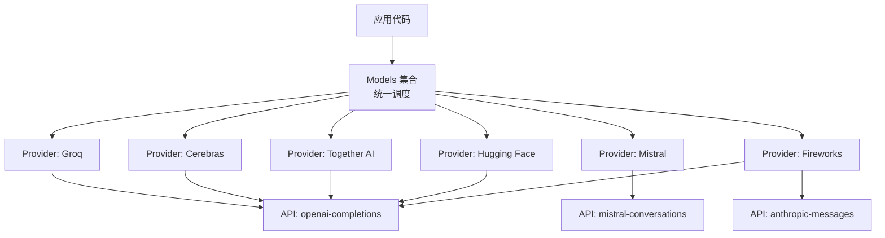
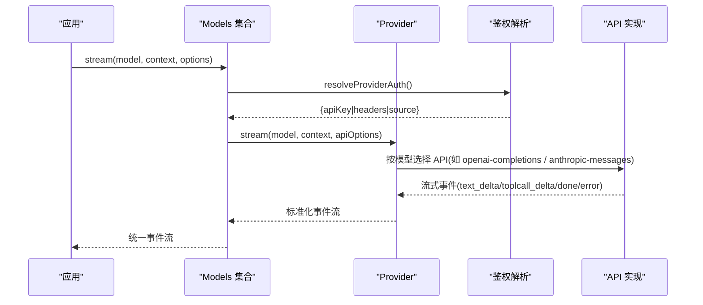
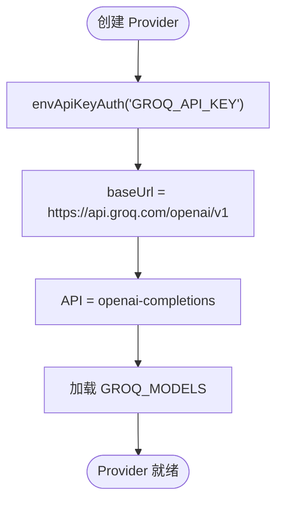
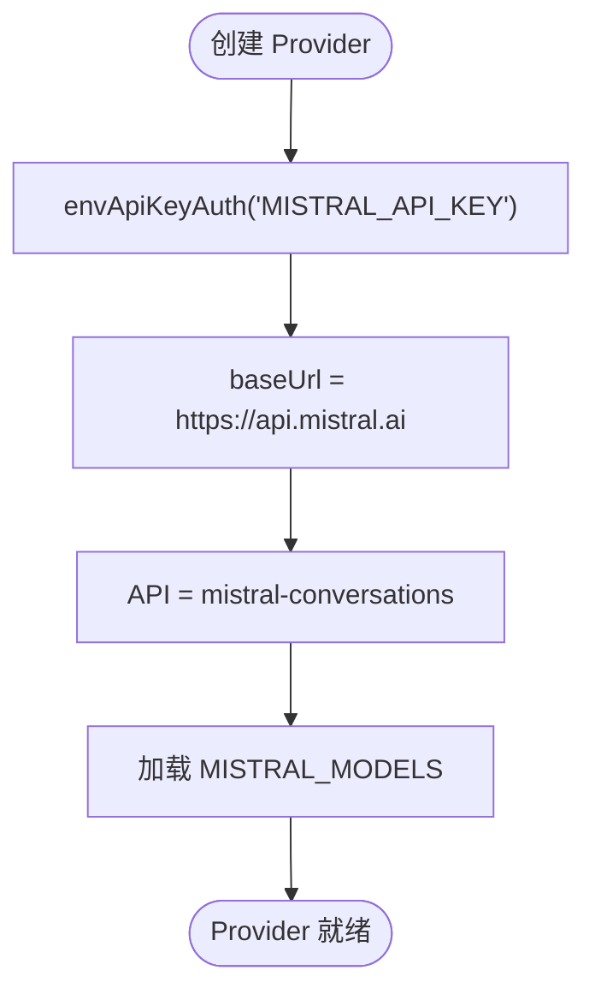
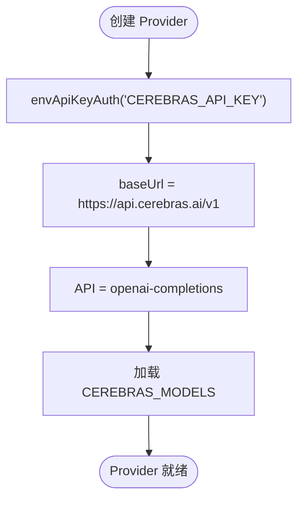
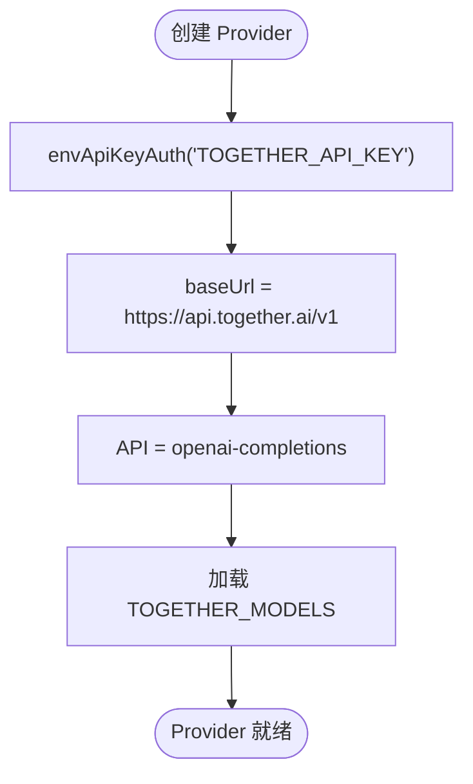
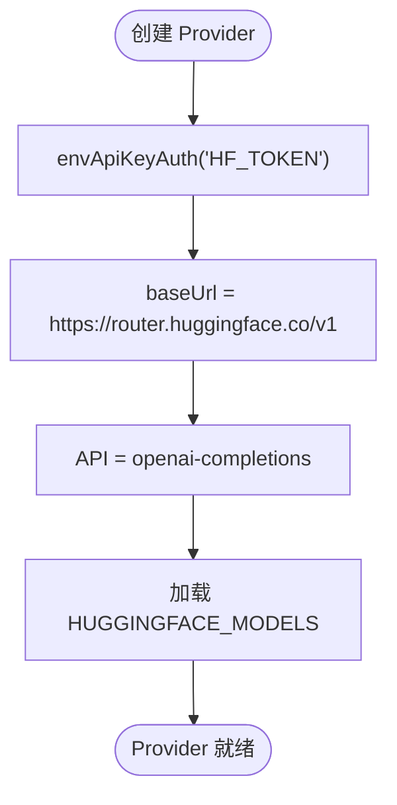
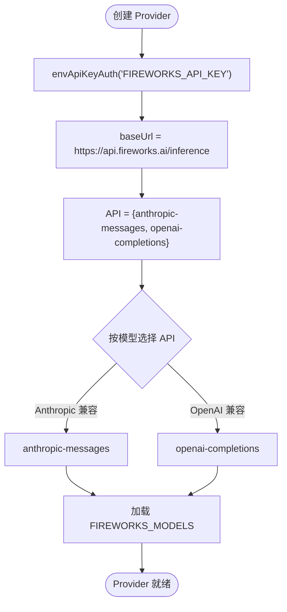
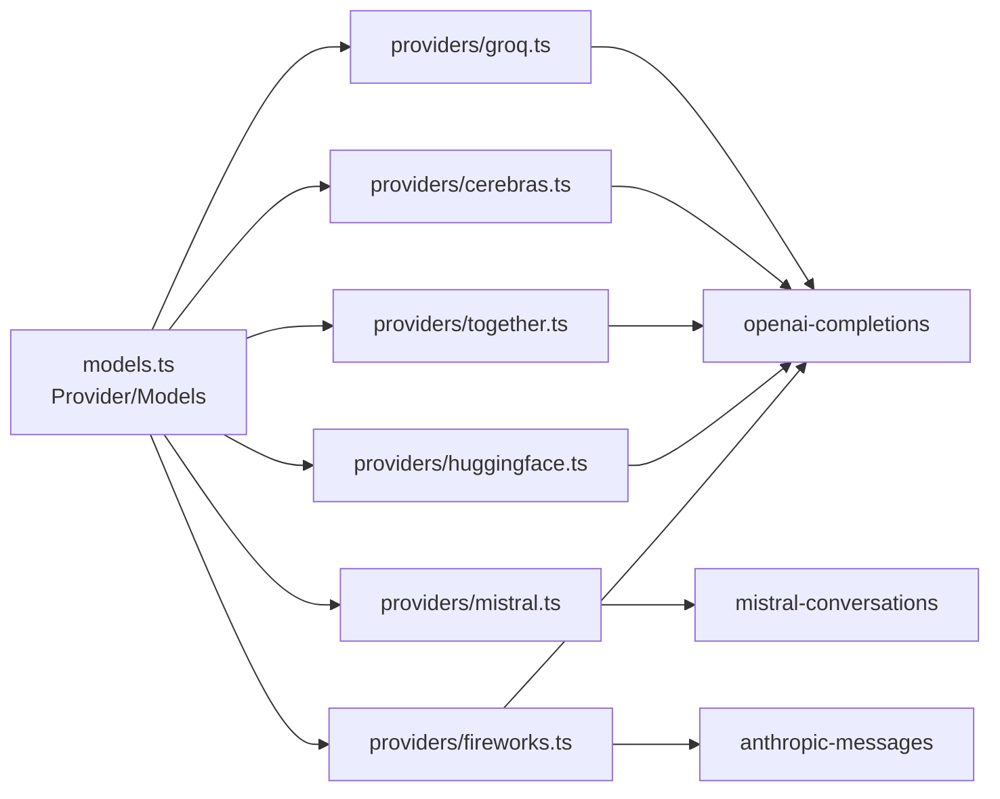

# 第三方 AI 提供商适配器

<cite>
**本文引用的文件**
- [README.md](file://packages/ai/README.md)
- [models.ts](file://packages/ai/src/models.ts)
- [helpers.ts](file://packages/ai/src/auth/helpers.ts)
- [groq.ts](file://packages/ai/src/providers/groq.ts)
- [mistral.ts](file://packages/ai/src/providers/mistral.ts)
- [cerebras.ts](file://packages/ai/src/providers/cerebras.ts)
- [together.ts](file://packages/ai/src/providers/together.ts)
- [fireworks.ts](file://packages/ai/src/providers/fireworks.ts)
- [huggingface.ts](file://packages/ai/src/providers/huggingface.ts)
</cite>

## 目录
1. [简介](#简介)
2. [项目结构](#项目结构)
3. [核心组件](#核心组件)
4. [架构总览](#架构总览)
5. [详细组件分析](#详细组件分析)
6. [依赖关系分析](#依赖关系分析)
7. [性能与成本优化](#性能与成本优化)
8. [故障排除指南](#故障排除指南)
9. [结论](#结论)
10. [附录：配置与环境变量](#附录：配置与环境变量)

## 简介
本文件面向需要在项目中集成多家第三方 AI 提供商（Groq、Mistral、Cerebras、Together AI、HuggingFace、Fireworks 等）的开发者，提供统一的适配层说明。该适配层通过 Provider 抽象统一认证、模型目录、请求路由与流式响应；各提供商以最小实现接入，复用通用 API 实现（如 OpenAI Completions、Anthropic Messages、Mistral Conversations），从而降低多供应商集成的复杂度。

## 项目结构
- 适配层位于 packages/ai/src 下，核心为 models.ts 中的 Provider/Models 抽象与调度。
- 各第三方提供商在 packages/ai/src/providers 中以独立模块注册，包含 baseUrl、鉴权方式、模型清单与 API 实现选择。
- 鉴权辅助在 packages/ai/src/auth/helpers.ts，提供标准 API Key 解析流程与环境变量读取。
- 文档入口 README.md 提供了支持的提供商列表、环境变量、工具调用、错误处理等使用指引。

图表来源
- [models.ts:88-149](file://packages/ai/src/models.ts#L88-L149)
- [groq.ts:1-16](file://packages/ai/src/providers/groq.ts#L1-L16)
- [mistral.ts:1-16](file://packages/ai/src/providers/mistral.ts#L1-L16)
- [cerebras.ts:1-16](file://packages/ai/src/providers/cerebras.ts#L1-L16)
- [together.ts:1-16](file://packages/ai/src/providers/together.ts#L1-L16)
- [huggingface.ts:1-16](file://packages/ai/src/providers/huggingface.ts#L1-L16)
- [fireworks.ts:1-20](file://packages/ai/src/providers/fireworks.ts#L1-L20)

章节来源
- [README.md:57-90](file://packages/ai/README.md#L57-L90)
- [models.ts:88-149](file://packages/ai/src/models.ts#L88-L149)

## 核心组件
- Provider 抽象：每个 Provider 拥有 id、name、baseUrl、auth、模型清单与 stream/streamSimple/fetchDeferred 等方法，负责将请求路由到具体 API 实现。
- Models 集合：聚合多个 Provider，提供 getModels/getModel/refresh/getAuth 等能力，并在调用前完成鉴权合并与可选的请求头转换。
- 鉴权助手 envApiKeyAuth：统一从“存储凭证优先、环境变量回退”的策略解析 API Key，并支持交互式登录。

章节来源
- [models.ts:88-149](file://packages/ai/src/models.ts#L88-L149)
- [helpers.ts:1-60](file://packages/ai/src/auth/helpers.ts#L1-L60)

## 架构总览
下图展示了从应用发起请求到具体提供商 API 调用的完整链路，包括鉴权解析、模型路由、API 实现选择与流式事件返回。

图表来源
- [models.ts:151-200](file://packages/ai/src/models.ts#L151-L200)
- [groq.ts:1-16](file://packages/ai/src/providers/groq.ts#L1-L16)
- [fireworks.ts:1-20](file://packages/ai/src/providers/fireworks.ts#L1-L20)

## 详细组件分析

### Groq 适配器
- 认证方式：API Key，优先从存储凭证读取，否则读取环境变量 GROQ_API_KEY。
- 基础地址：https://api.groq.com/openai/v1
- API 实现：openai-completions（兼容 OpenAI Completions 协议）
- 模型清单：来自 groq.models.ts 的静态目录

图表来源
- [groq.ts:1-16](file://packages/ai/src/providers/groq.ts#L1-L16)
- [helpers.ts:1-60](file://packages/ai/src/auth/helpers.ts#L1-L60)

章节来源
- [groq.ts:1-16](file://packages/ai/src/providers/groq.ts#L1-L16)
- [helpers.ts:1-60](file://packages/ai/src/auth/helpers.ts#L1-L60)

### Mistral 适配器
- 认证方式：API Key，优先从存储凭证读取，否则读取 MISTRAL_API_KEY。
- 基础地址：https://api.mistral.ai
- API 实现：mistral-conversations（专用对话协议）
- 模型清单：来自 mistral.models.ts

图表来源
- [mistral.ts:1-16](file://packages/ai/src/providers/mistral.ts#L1-L16)
- [helpers.ts:1-60](file://packages/ai/src/auth/helpers.ts#L1-L60)

章节来源
- [mistral.ts:1-16](file://packages/ai/src/providers/mistral.ts#L1-L16)
- [helpers.ts:1-60](file://packages/ai/src/auth/helpers.ts#L1-L60)

### Cerebras 适配器
- 认证方式：API Key，优先从存储凭证读取，否则读取 CEREBRAS_API_KEY。
- 基础地址：https://api.cerebras.ai/v1
- API 实现：openai-completions
- 模型清单：来自 cerebras.models.ts

图表来源
- [cerebras.ts:1-16](file://packages/ai/src/providers/cerebras.ts#L1-L16)
- [helpers.ts:1-60](file://packages/ai/src/auth/helpers.ts#L1-L60)

章节来源
- [cerebras.ts:1-16](file://packages/ai/src/providers/cerebras.ts#L1-L16)
- [helpers.ts:1-60](file://packages/ai/src/auth/helpers.ts#L1-L60)

### Together AI 适配器
- 认证方式：API Key，优先从存储凭证读取，否则读取 TOGETHER_API_KEY。
- 基础地址：https://api.together.ai/v1
- API 实现：openai-completions
- 模型清单：来自 together.models.ts

图表来源
- [together.ts:1-16](file://packages/ai/src/providers/together.ts#L1-L16)
- [helpers.ts:1-60](file://packages/ai/src/auth/helpers.ts#L1-L60)

章节来源
- [together.ts:1-16](file://packages/ai/src/providers/together.ts#L1-L16)
- [helpers.ts:1-60](file://packages/ai/src/auth/helpers.ts#L1-L60)

### Hugging Face 适配器
- 认证方式：API Key（Token），优先从存储凭证读取，否则读取 HF_TOKEN。
- 基础地址：https://router.huggingface.co/v1
- API 实现：openai-completions
- 模型清单：来自 huggingface.models.ts

图表来源
- [huggingface.ts:1-16](file://packages/ai/src/providers/huggingface.ts#L1-L16)
- [helpers.ts:1-60](file://packages/ai/src/auth/helpers.ts#L1-L60)

章节来源
- [huggingface.ts:1-16](file://packages/ai/src/providers/huggingface.ts#L1-L16)
- [helpers.ts:1-60](file://packages/ai/src/auth/helpers.ts#L1-L60)

### Fireworks 适配器（多协议）
- 认证方式：API Key，优先从存储凭证读取，否则读取 FIREWORKS_API_KEY。
- 基础地址：https://api.fireworks.ai/inference
- API 实现：同时支持 anthropic-messages 与 openai-completions，按模型选择具体协议
- 模型清单：来自 fireworks.models.ts

图表来源
- [fireworks.ts:1-20](file://packages/ai/src/providers/fireworks.ts#L1-L20)
- [helpers.ts:1-60](file://packages/ai/src/auth/helpers.ts#L1-L60)

章节来源
- [fireworks.ts:1-20](file://packages/ai/src/providers/fireworks.ts#L1-L20)
- [helpers.ts:1-60](file://packages/ai/src/auth/helpers.ts#L1-L60)

## 依赖关系分析
- 所有 Provider 均依赖 createProvider 与鉴权助手 envApiKeyAuth，确保统一的鉴权策略与 Provider 构造。
- 不同 Provider 共享少量 API 实现：
  - openai-completions：被 Groq、Cerebras、Together、HuggingFace、Fireworks（部分模型）复用
  - anthropic-messages：被 Fireworks（部分模型）复用
  - mistral-conversations：被 Mistral 专用
- Models 集合负责：
  - 解析鉴权（getAuth/checkAuth）
  - 路由到对应 Provider
  - 可选 transformHeaders 在最终派发前修改请求头

图表来源
- [models.ts:88-149](file://packages/ai/src/models.ts#L88-L149)
- [groq.ts:1-16](file://packages/ai/src/providers/groq.ts#L1-L16)
- [mistral.ts:1-16](file://packages/ai/src/providers/mistral.ts#L1-L16)
- [cerebras.ts:1-16](file://packages/ai/src/providers/cerebras.ts#L1-L16)
- [together.ts:1-16](file://packages/ai/src/providers/together.ts#L1-L16)
- [huggingface.ts:1-16](file://packages/ai/src/providers/huggingface.ts#L1-L16)
- [fireworks.ts:1-20](file://packages/ai/src/providers/fireworks.ts#L1-L20)

章节来源
- [models.ts:88-149](file://packages/ai/src/models.ts#L88-L149)

## 性能与成本优化
- 流式输出：优先使用 stream/streamSimple 获取增量文本与工具调用参数，减少首字节延迟并提升交互体验。
- 按需引入：仅注册所需 Provider 或模型，避免全量导入带来的包体膨胀与冷启动开销。
- 请求头转换：通过 transformHeaders 添加追踪标识或控制重试行为，避免重复鉴权解析。
- 成本控制：结合 usage 统计与 cost 信息（由模型元数据与提供方返回）进行用量监控与预算控制。
- 并发刷新：对动态模型列表使用 refresh 并发刷新，失败不阻断整体可用性。

[本节为通用建议，无需特定文件引用]

## 故障排除指南
- 鉴权未配置：
  - 现象：getAuth 返回 undefined 或抛出 ModelsError（oauth/auth）。
  - 排查：确认已设置对应环境变量或已在凭证存储中保存密钥；必要时调用 login 流程。
- 模型不可用：
  - 现象：getModel 返回 undefined 或 getAvailable 过滤后为空。
  - 排查：检查 provider 是否已正确注册、模型清单是否刷新、是否存在订阅/区域限制。
- 请求头冲突：
  - 现象：自定义 header 未生效或被覆盖。
  - 排查：确认 transformHeaders 顺序：provider auth headers -> model.headers -> 显式 options.headers -> transformHeaders。
- 流式中断：
  - 现象：stream 提前结束或 error 事件触发。
  - 排查：检查 signal/abort、网络超时、上游限流或配额耗尽。

章节来源
- [models.ts:151-200](file://packages/ai/src/models.ts#L151-L200)
- [README.md:324-380](file://packages/ai/README.md#L324-L380)

## 结论
本项目通过 Provider 抽象与 Models 集合，将多家第三方 AI 提供商统一到一致的接口之下。Groq、Mistral、Cerebras、Together、HuggingFace、Fireworks 等均以最小实现接入，复用通用 API 实现，显著降低了多供应商集成的复杂度。配合统一的鉴权、流式事件、头部转换与模型目录管理，可快速构建稳定、可观测且具备成本意识的 AI 应用。

[本节为总结性内容，无需特定文件引用]

## 附录：配置与环境变量
- 环境变量优先级：存储凭证优先，其次为环境变量。若均未配置，则 Provider 视为未配置。
- 关键环境变量（节选）：
  - Groq：GROQ_API_KEY
  - Mistral：MISTRAL_API_KEY
  - Cerebras：CEREBRAS_API_KEY
  - Together AI：TOGETHER_API_KEY
  - Hugging Face：HF_TOKEN
  - Fireworks：FIREWORKS_API_KEY
- 其他提供商与环境变量详见 README 的环境变量表格。

章节来源
- [README.md:409-456](file://packages/ai/README.md#L409-L456)