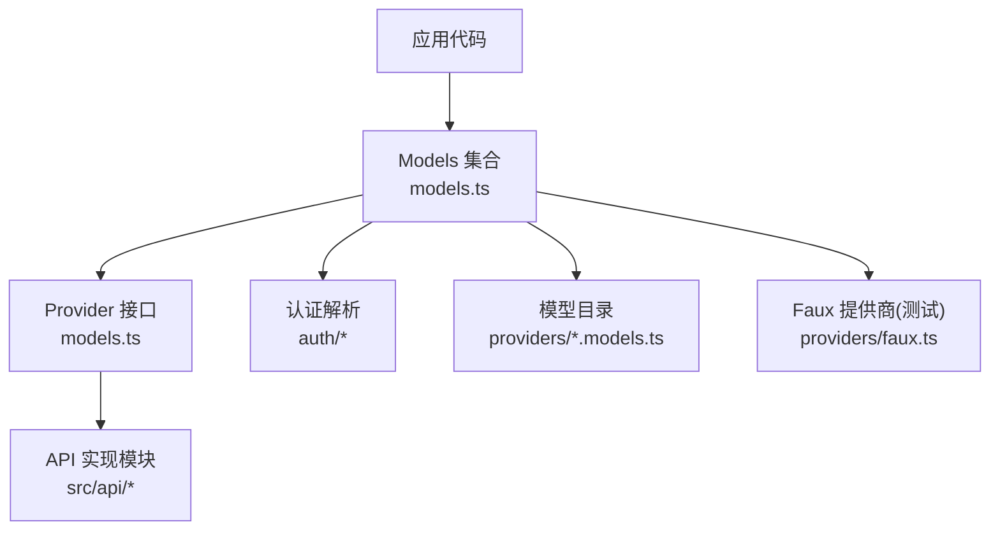
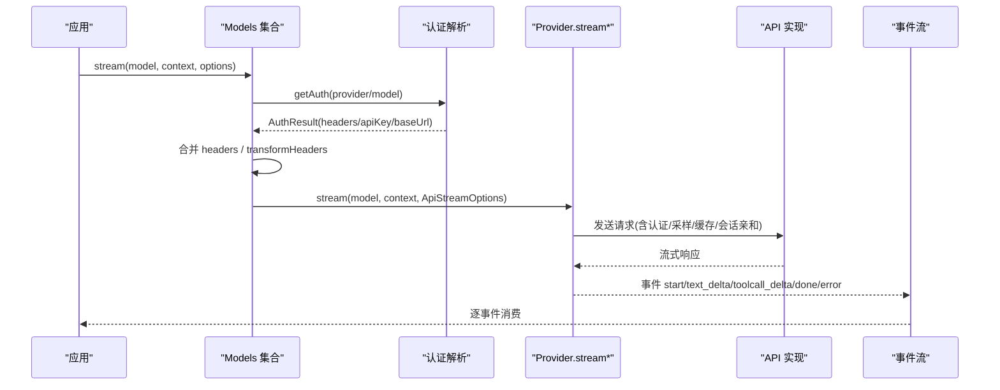
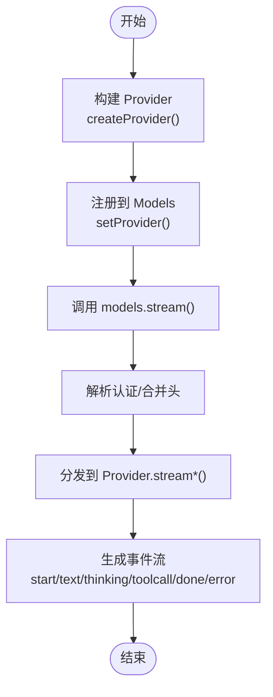
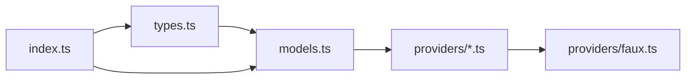

# 自定义提供商开发指南

<cite>
**本文引用的文件**
- [README.md](file://packages/ai/README.md)
- [index.ts](file://packages/ai/src/index.ts)
- [types.ts](file://packages/ai/src/types.ts)
- [models.ts](file://packages/ai/src/models.ts)
- [faux.ts](file://packages/ai/src/providers/faux.ts)
</cite>

## 目录
1. [简介](#简介)
2. [项目结构](#项目结构)
3. [核心组件](#核心组件)
4. [架构总览](#架构总览)
5. [详细组件分析](#详细组件分析)
6. [依赖关系分析](#依赖关系分析)
7. [性能考虑](#性能考虑)
8. [故障排查指南](#故障排查指南)
9. [结论](#结论)
10. [附录：开发模板与清单](#附录：开发模板与清单)

## 简介
本指南面向需要在 @earendil-works/pi-ai 中实现“自定义 AI 提供商适配器”的开发者。内容覆盖 Provider 接口规范、消息格式转换、认证机制、流式响应处理、注册与配置管理、版本兼容性、调试技巧与常见问题，并提供基于仓库内测试用 Faux 提供商的完整开发模板与示例路径。

## 项目结构
@earendil-works/pi-ai 提供统一的 LLM 调用抽象，将不同提供商（OpenAI、Anthropic、Google、Bedrock 等）封装为 Provider，并通过 Models 集合进行路由、鉴权与流式事件分发。新增提供商时，主要涉及以下位置：
- 类型与契约：types.ts 定义 Provider、Model、Context、事件协议等核心类型
- 运行时集合：models.ts 定义 Provider 接口与 Models 集合能力
- 入口导出：index.ts 暴露核心类型与工具
- 测试用提供商：providers/faux.ts 提供可插拔的 Faux 提供商，便于本地开发与单测

图表来源
- [models.ts:88-149](file://packages/ai/src/models.ts#L88-L149)
- [types.ts:17-33](file://packages/ai/src/types.ts#L17-L33)
- [faux.ts:685-709](file://packages/ai/src/providers/faux.ts#L685-L709)

章节来源
- [README.md:1-120](file://packages/ai/README.md#L1-L120)
- [index.ts:1-48](file://packages/ai/src/index.ts#L1-L48)

## 核心组件
- Provider 接口：包含 id/name/baseUrl/headers、auth、getModels/refreshModels、stream/streamSimple/fetchDeferred/cancelDeferred 等能力
- Model：描述模型元数据（id、name、api、provider、baseUrl、reasoning、input/output、cost、contextWindow、maxTokens 等）
- Context 与消息：统一的消息表示（用户、助手、工具结果），以及工具调用与思考块
- 事件流：AssistantMessageEventStream 的事件协议（start/text/thinking/toolcall/done/error 等）
- 选项与传输：StreamOptions/SimpleStreamOptions、Transport、采样参数、缓存保留、会话亲和等
- 兼容层：OpenAI/Anthropic/Bedrock/Gemini 等 API 的兼容设置，控制字段映射与特性开关

章节来源
- [models.ts:88-149](file://packages/ai/src/models.ts#L88-L149)
- [types.ts:103-221](file://packages/ai/src/types.ts#L103-L221)
- [types.ts:303-330](file://packages/ai/src/types.ts#L303-L330)
- [types.ts:332-540](file://packages/ai/src/types.ts#L332-L540)
- [types.ts:542-687](file://packages/ai/src/types.ts#L542-L687)

## 架构总览
下图展示了从应用调用到提供商实现的端到端流程，包括认证解析、请求头合并、流式事件分发与错误编码。

图表来源
- [models.ts:156-200](file://packages/ai/src/models.ts#L156-L200)
- [types.ts:260-277](file://packages/ai/src/types.ts#L260-L277)
- [types.ts:515-540](file://packages/ai/src/types.ts#L515-L540)

## 详细组件分析

### 1) Provider 接口规范
- 标识与元数据：id、name、baseUrl、headers
- 认证：auth 必须至少提供 apiKey 或 oauth；即使无密钥的本地服务也需提供 apiKey.resolve() 以声明是否已配置
- 模型列表：getModels() 同步返回已知模型；动态提供商需实现 refreshModels()
- 流式接口：stream()/streamSimple() 必须返回 AssistantMessageEventStream；可选支持 fetchDeferred()/cancelDeferred()
- 过滤：filterModels() 可按凭据过滤可用模型

实现要点
- 每个 Provider 拥有自己的模型目录与认证策略
- 流式实现必须遵循事件协议：先 emit start，再逐步 emit text/thinking/toolcall 增量，最后 done 或 error
- 错误必须通过事件编码（stopReason 为 error/aborted，并携带 errorMessage），不得直接抛异常中断流

章节来源
- [models.ts:88-149](file://packages/ai/src/models.ts#L88-L149)
- [types.ts:515-540](file://packages/ai/src/types.ts#L515-L540)

### 2) 消息格式与上下文
- Context：systemPrompt、messages、tools
- Message：UserMessage、AssistantMessage、ToolResultMessage
- 内容块：TextContent、ThinkingContent、ImageContent、ToolCall
- Usage：输入/输出/缓存读写/推理 token/成本
- 停止原因：stop、length、toolUse、error、aborted、deferred

注意
- 工具调用在流式中会分片到达，消费者需使用 contentIndex 关联同一块的多条事件
- 思考块与文本块可能交错出现，不应假设连续

章节来源
- [types.ts:332-476](file://packages/ai/src/types.ts#L332-L476)
- [types.ts:515-540](file://packages/ai/src/types.ts#L515-L540)

### 3) 认证机制实现
- 认证来源：环境变量、存储凭据、OAuth、云环境（如 AWS ADC/gcloud）
- 解析顺序：Provider 内置解析 + model.headers + 显式 options.headers + transformHeaders
- 凭据存储：CredentialStore 提供 read/list/modify/delete；修改路径唯一写点，避免并发刷新冲突
- 诊断：getAuth/checkAuth/getAvailable 可用于预检与 UI 展示

实现建议
- 为自定义提供商实现 auth.apiKey.resolve() 或 auth.oauth.refresh()，并在阻塞操作中尊重 AbortSignal
- 对不支持的环境变量或凭据类型，明确返回未配置，以便上层提示用户

章节来源
- [README.md:324-456](file://packages/ai/README.md#L324-L456)
- [models.ts:179-200](file://packages/ai/src/models.ts#L179-L200)

### 4) 流式响应处理
- 事件协议：start → (text_start/text_delta/text_end | thinking_start/thinking_delta/thinking_end | toolcall_start/toolcall_delta/toolcall_end)* → done/error
- 中止与超时：通过 signal/timeoutMs/websocketConnectTimeoutMs 控制
- 传输：SSE/WebSocket/auto，按 provider 能力选择
- 延迟响应：deferred 模式返回 handle，后续通过 fetchDeferred/cancelDeferred 拉取最终结果

实现建议
- 在流中持续检查 signal.aborted，及时终止并推送 error 事件
- 对工具调用参数采用增量 JSON 解析，确保 UI 能渐进更新
- 对长轮询/延迟响应场景，正确维护 handle 的生命周期

章节来源
- [types.ts:175-221](file://packages/ai/src/types.ts#L175-L221)
- [types.ts:303-330](file://packages/ai/src/types.ts#L303-L330)
- [types.ts:515-540](file://packages/ai/src/types.ts#L515-L540)

### 5) 版本兼容性与特性开关
- OpenAI 兼容：supportsStore/supportsDeveloperRole/supportsReasoningEffort/supportsUsageInStreaming/supportsFinishReason/maxTokensField/requiresToolResultName/requiresAssistantAfterToolResult/requiresThinkingAsText/thinkingFormat/chatTemplateKwargs/...
- Anthropic Messages 兼容：supportsEagerToolInputStreaming/supportsLongCacheRetention/sendSessionAffinityHeaders/supportsCacheControlOnTools/supportsTemperature/forceAdaptiveThinking/allowEmptySignature/supportsStrictTools/supportsToolReferences
- Bedrock 兼容：supportsStrictMode
- 其他：sessionAffinityFormat、supportsLongCacheRetention、supportsOpenAIGrammarTools、supportsStrictMode 等

实践
- 根据目标提供商的实际能力，精确设置 compat.* 字段，避免发送不被支持的参数导致失败
- 对语法约束工具（grammar tools）、严格模式（strict mode）、长缓存保留等高级特性，仅在模型/端点支持时启用

章节来源
- [types.ts:542-687](file://packages/ai/src/types.ts#L542-L687)

### 6) 注册新提供商与配置管理
- 使用 createProvider() 构造 Provider，注入 id/auth/models/api(stream/streamSimple/...)
- 将 Provider 加入 Models 集合：createModels().setProvider(...)
- 模型目录：静态模型可直接声明；动态模型实现 refreshModels() 并持久化 catalog
- 配置项：apiKey/env/headers/transport/cacheRetention/sessionId/metadata 等通过 Options 传递
- 请求头变换：transformHeaders 在 Provider 调度前运行，用于追加追踪 ID、删除默认头等

章节来源
- [models.ts:88-149](file://packages/ai/src/models.ts#L88-L149)
- [types.ts:103-221](file://packages/ai/src/types.ts#L103-L221)

### 7) 开发模板与示例（基于 Faux 提供商）
Faux 提供商提供了完整的 Provider 骨架，适合用作自定义提供商的开发模板：
- 模型定义与枚举：FauxModelDefinition、models 数组
- 认证占位：apiKey.resolve 返回空 auth，便于本地调试
- 流式实现：stream/streamSimple 产生标准事件流，支持 deferred 模式
- 状态与统计：state.callCount/state.deferredFetchCount/state.cancelledDeferred
- 工具方法：fauxText/fauxThinking/fauxToolCall/fauxAssistantMessage

参考路径
- 创建与注册：[faux.ts:685-709](file://packages/ai/src/providers/faux.ts#L685-L709)
- 流式事件生成：[faux.ts:338-434](file://packages/ai/src/providers/faux.ts#L338-L434)
- 延迟响应与取消：[faux.ts:567-642](file://packages/ai/src/providers/faux.ts#L567-L642)
- 模型与默认值：[faux.ts:40-48](file://packages/ai/src/providers/faux.ts#L40-L48)、[faux.ts:462-486](file://packages/ai/src/providers/faux.ts#L462-L486)

图表来源
- [faux.ts:685-709](file://packages/ai/src/providers/faux.ts#L685-L709)
- [models.ts:156-200](file://packages/ai/src/models.ts#L156-L200)
- [types.ts:515-540](file://packages/ai/src/types.ts#L515-L540)

章节来源
- [faux.ts:1-709](file://packages/ai/src/providers/faux.ts#L1-L709)

### 8) 单元测试编写
- 使用 Faux 提供商快速构造断言场景：设置 setResponses/appendResponses，验证事件序列与最终消息
- 覆盖用例：正常完成、工具调用、思考块、错误、中止、延迟响应与取消
- 验证点：事件顺序、contentIndex 一致性、usage 估算、stopReason、errorMessage

参考路径
- 事件流与中止：[faux.ts:338-434](file://packages/ai/src/providers/faux.ts#L338-L434)
- 延迟响应与取消：[faux.ts:567-642](file://packages/ai/src/providers/faux.ts#L567-L642)
- 模型与默认行为：[faux.ts:462-486](file://packages/ai/src/providers/faux.ts#L462-L486)

章节来源
- [faux.ts:1-709](file://packages/ai/src/providers/faux.ts#L1-L709)

### 9) 错误处理策略
- 流式错误：通过 error 事件上报 stopReason="error"/"aborted" 与 errorMessage
- 认证失败：getAuth/checkAuth 抛出 ModelsError（oauth/auth），上层应转换为流错误
- 网络/SDK 错误：捕获后包装为 AssistantMessage 并推入事件流
- 中止：检测 signal.aborted，立即终止并推送 aborted 事件

章节来源
- [types.ts:515-540](file://packages/ai/src/types.ts#L515-L540)
- [models.ts:179-200](file://packages/ai/src/models.ts#L179-L200)

### 10) 性能优化技巧
- 合理设置 transport 与 websocketConnectTimeoutMs，减少握手开销
- 使用 cacheRetention 与 sessionAffinityFormat 提升缓存命中
- 限制 maxRetries 与 maxRetryDelayMs，避免雪崩
- 对大响应流进行背压控制，避免内存峰值过高
- 按需加载 SDK（懒加载 API 实现），减小包体积

章节来源
- [types.ts:175-221](file://packages/ai/src/types.ts#L175-L221)
- [types.ts:542-687](file://packages/ai/src/types.ts#L542-L687)

## 依赖关系分析
- 类型层：types.ts 定义所有跨模块共享的类型与选项
- 运行时层：models.ts 提供 Provider 接口与 Models 集合
- 提供商层：各 providers/*.ts 实现具体提供商逻辑；faux.ts 作为通用模板
- 入口层：index.ts 仅导出核心类型与工具，保持轻量

图表来源
- [index.ts:1-48](file://packages/ai/src/index.ts#L1-L48)
- [types.ts:17-33](file://packages/ai/src/types.ts#L17-L33)
- [models.ts:88-149](file://packages/ai/src/models.ts#L88-L149)
- [faux.ts:685-709](file://packages/ai/src/providers/faux.ts#L685-L709)

章节来源
- [index.ts:1-48](file://packages/ai/src/index.ts#L1-L48)
- [types.ts:17-33](file://packages/ai/src/types.ts#L17-L33)
- [models.ts:88-149](file://packages/ai/src/models.ts#L88-L149)

## 性能考虑
- 流式处理优先：尽量使用 stream/streamSimple，降低首字节延迟
- 连接复用与传输选择：SSE/WebSocket 按提供商能力选择，必要时 auto
- 缓存与会话亲和：利用 cacheRetention 与 sessionAffinityFormat 提高命中率
- 重试与超时：合理配置 maxRetries、maxRetryDelayMs、timeoutMs
- 资源释放：及时中止信号传播，避免悬挂连接与内存泄漏

[本节为通用指导，不直接分析具体文件]

## 故障排查指南
- 认证问题：使用 getAuth/getAvailable 预检；查看 source 字段定位来源（env/OAuth/存储）
- 流事件错乱：确认 consumer 使用 contentIndex 关联事件；不要假设连续
- 工具调用参数不完整：在 toolcall_delta 阶段做防御性编程，等待 toolcall_end 再执行
- 延迟响应卡住：检查 fetchDeferred/cancelDeferred 是否正确配对；确认 pendingFetches 计数
- 头部被覆盖：确认 transformHeaders 的执行时机与优先级（provider auth -> model.headers -> options.headers -> transform）

章节来源
- [README.md:324-380](file://packages/ai/README.md#L324-L380)
- [faux.ts:338-434](file://packages/ai/src/providers/faux.ts#L338-L434)
- [faux.ts:567-642](file://packages/ai/src/providers/faux.ts#L567-L642)

## 结论
通过遵循 Provider 接口规范、统一消息与事件协议、正确的认证与流式处理、合理的兼容配置与性能调优，你可以高效地为任意 AI 提供商实现适配器。建议以 Faux 提供商为模板，结合仓库提供的类型与运行时能力，快速落地并完善测试与排障流程。

## 附录：开发模板与清单
- 最小实现清单
  - 实现 Provider.id/name/auth/getModels/stream/streamSimple
  - 定义 Model 元数据（id/name/api/provider/baseUrl/reasoning/input/output/cost/contextWindow/maxTokens）
  - 实现事件流：start → text/thinking/toolcall 增量 → done/error
  - 支持 optional：refreshModels/filterModels/fetchDeferred/cancelDeferred
- 认证与环境
  - 实现 auth.apiKey.resolve() 或 auth.oauth.refresh()
  - 支持 env 变量与存储凭据；必要时实现 login/logout
- 兼容与特性
  - 设置 OpenAI/Anthropic/Bedrock 等 compat 字段
  - 按需启用 grammar tools、strict mode、长缓存保留
- 测试与调试
  - 使用 Faux 提供商构造用例，覆盖成功/失败/中止/延迟
  - 使用 getAuth/checkAuth 预检认证；打印 transformHeaders 前后差异
- 发布与集成
  - 将 Provider 加入 Models 集合；提供模型目录（静态或动态）
  - 文档化环境变量、配置项与兼容特性

章节来源
- [models.ts:88-149](file://packages/ai/src/models.ts#L88-L149)
- [types.ts:103-221](file://packages/ai/src/types.ts#L103-L221)
- [types.ts:542-687](file://packages/ai/src/types.ts#L542-L687)
- [faux.ts:685-709](file://packages/ai/src/providers/faux.ts#L685-L709)